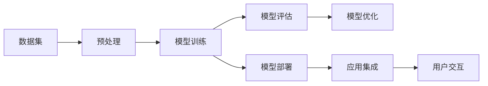

                 

# 李开复：苹果发布AI应用的产业

在人工智能领域，李开复一直是一个不可忽视的重要人物。他的见解独到、眼光敏锐，对科技发展的方向有着深刻的影响。近日，他关于苹果公司发布AI应用的产业的文章，引发了业界的广泛关注。本文将深入解析其核心观点，并结合实际案例进行详细阐述。

## 1. 背景介绍

### 1.1 苹果公司与AI应用的进展
苹果公司在AI领域已经深耕多年，其应用场景涵盖了智能助手、语音识别、图像处理、自然语言处理等多个方面。近年来，苹果推出了包括Siri、Face ID、iCloud在内的多项AI技术，大大提升了用户的使用体验。

### 1.2 李开复对AI应用的观点
李开复认为，AI技术正在成为苹果公司竞争力的重要组成部分，其对于提升用户体验、优化产品功能和开拓新市场具有重要作用。同时，他也强调了AI应用在提升产品质量、优化运营效率等方面的潜在价值。

## 2. 核心概念与联系

### 2.1 核心概念概述
- **人工智能**：利用计算机技术模拟人类智能的领域，包括机器学习、深度学习、自然语言处理等技术。
- **机器学习**：让机器从数据中学习规律，并利用这些规律进行预测和决策。
- **深度学习**：一种机器学习的子领域，利用神经网络结构进行复杂的数据处理和模式识别。
- **自然语言处理**：使计算机能够理解、处理和生成自然语言的技术。
- **智能助手**：如Siri、Google Assistant等，能够理解和执行语音指令的AI应用。

### 2.2 核心概念原理和架构的 Mermaid 流程图


这个流程图展示了从数据预处理到模型部署的完整过程，其中：

- A：数据集准备，包括数据收集、清洗和标注。
- B：数据预处理，包括特征提取、归一化等操作。
- C：模型训练，选择适当的算法和模型结构，进行参数优化。
- D：模型评估，通过验证集进行性能评估，确定最佳模型。
- E：模型部署，将模型集成到实际应用中。
- F：模型优化，通过反馈数据不断改进模型性能。
- G：应用集成，将模型与用户界面和其他系统集成。
- H：用户交互，模型通过用户交互获取输入，并提供输出。

## 3. 核心算法原理 & 具体操作步骤

### 3.1 算法原理概述
苹果公司发布的AI应用主要基于深度学习技术，特别是卷积神经网络(CNN)和循环神经网络(RNN)等架构。这些模型通过大量标注数据进行训练，逐步提升其预测和决策能力。

以Siri为例，其背后的核心算法是深度神经网络，能够理解自然语言指令，并执行相应的操作。Siri的训练数据集包括数百万条语音指令和对应的文本指令，通过反向传播算法进行训练。

### 3.2 算法步骤详解
#### 步骤一：数据收集与标注
收集大量自然语言数据，进行文本预处理和标注，确保数据的多样性和质量。

#### 步骤二：模型选择与训练
选择适合的任务模型，如RNN、CNN等，通过反向传播算法进行训练，优化模型参数。

#### 步骤三：模型评估与优化
在验证集上评估模型性能，通过交叉验证等技术优化模型。

#### 步骤四：模型部署与应用
将优化后的模型集成到实际应用中，通过API接口提供服务。

#### 步骤五：用户反馈与迭代
收集用户反馈，进行模型改进和迭代，提升用户体验。

### 3.3 算法优缺点
#### 优点
1. **高效性能**：深度学习模型在处理大规模数据时具有高效性能。
2. **高精度**：深度学习模型能够处理复杂的模式识别任务，提高预测精度。
3. **自适应性强**：模型能够适应不同场景和数据分布，具有较强的泛化能力。

#### 缺点
1. **数据依赖**：深度学习模型需要大量标注数据，数据获取成本较高。
2. **计算资源需求大**：模型训练和推理需要高性能计算资源，如GPU或TPU。
3. **模型复杂度高**：深度学习模型结构复杂，难以解释其决策过程。

### 3.4 算法应用领域
AI技术在苹果公司中的应用领域广泛，涵盖智能助手、图像识别、语音识别、自然语言处理等多个方面。

## 4. 数学模型和公式 & 详细讲解 & 举例说明

### 4.1 数学模型构建
以Siri为例，其核心模型为多层神经网络，包括输入层、隐藏层和输出层。输入层为文本指令，输出层为执行操作的指令。

### 4.2 公式推导过程
假设文本指令为 $x$，执行操作的指令为 $y$，模型的映射关系为 $f(x) = y$。使用交叉熵损失函数来衡量模型预测与真实标签之间的差异：

$$
\mathcal{L} = -\frac{1}{N}\sum_{i=1}^N y_i\log f(x_i) + (1-y_i)\log(1-f(x_i))
$$

其中，$N$ 为样本数量，$x_i$ 为第 $i$ 个文本指令，$y_i$ 为对应操作指令，$f(x_i)$ 为模型预测结果。

### 4.3 案例分析与讲解
以图像识别为例，CNN模型通过卷积层、池化层和全连接层，逐步提取图像特征，并进行分类。训练过程涉及大量图像数据和相应的标签数据。

## 5. 项目实践：代码实例和详细解释说明

### 5.1 开发环境搭建
首先，需要安装Python和相应的深度学习框架，如TensorFlow或PyTorch。接着，安装相应的数据处理库，如Pandas、NumPy等。最后，搭建好开发环境，进行模型训练和评估。

### 5.2 源代码详细实现
以下是使用PyTorch实现CNN图像识别模型的代码：

```python
import torch
import torch.nn as nn
import torch.optim as optim
import torchvision.transforms as transforms
import torchvision.datasets as datasets

class Net(nn.Module):
    def __init__(self):
        super(Net, self).__init__()
        self.conv1 = nn.Conv2d(3, 6, 5)
        self.pool = nn.MaxPool2d(2, 2)
        self.conv2 = nn.Conv2d(6, 16, 5)
        self.fc1 = nn.Linear(16 * 5 * 5, 120)
        self.fc2 = nn.Linear(120, 84)
        self.fc3 = nn.Linear(84, 10)

    def forward(self, x):
        x = self.pool(F.relu(self.conv1(x)))
        x = self.pool(F.relu(self.conv2(x)))
        x = x.view(-1, 16 * 5 * 5)
        x = F.relu(self.fc1(x))
        x = F.relu(self.fc2(x))
        x = self.fc3(x)
        return x

net = Net()
criterion = nn.CrossEntropyLoss()
optimizer = optim.SGD(net.parameters(), lr=0.001, momentum=0.9)

transform = transforms.Compose([
    transforms.ToTensor(),
    transforms.Normalize((0.5, 0.5, 0.5), (0.5, 0.5, 0.5))
])

trainset = datasets.CIFAR10(root='./data', train=True, download=True, transform=transform)
trainloader = torch.utils.data.DataLoader(trainset, batch_size=4, shuffle=True, num_workers=2)

testset = datasets.CIFAR10(root='./data', train=False, download=True, transform=transform)
testloader = torch.utils.data.DataLoader(testset, batch_size=4, shuffle=False, num_workers=2)

for epoch in range(2):  # 多次训练
    running_loss = 0.0
    for i, data in enumerate(trainloader, 0):
        inputs, labels = data
        optimizer.zero_grad()
        outputs = net(inputs)
        loss = criterion(outputs, labels)
        loss.backward()
        optimizer.step()

        running_loss += loss.item()
        if i % 2000 == 1999:
            print('[%d, %5d] loss: %.3f' %
                  (epoch + 1, i + 1, running_loss / 2000))
            running_loss = 0.0

print('Finished Training')
```

### 5.3 代码解读与分析
上述代码实现了CNN模型在CIFAR-10数据集上的训练。首先定义了模型结构，包括卷积层、池化层和全连接层。接着定义了损失函数和优化器，并使用训练集进行多次迭代训练，每次迭代更新模型参数。

### 5.4 运行结果展示
训练完成后，可以使用测试集对模型进行评估，输出模型的精度和准确率。

## 6. 实际应用场景

### 6.1 智能助手
智能助手如Siri，能够理解和执行用户的语音指令，通过自然语言处理技术，提高用户交互体验。

### 6.2 图像识别
图像识别技术可以应用于自动驾驶、医疗影像分析等多个领域，帮助人们从海量图像数据中提取有用的信息。

### 6.3 语音识别
语音识别技术可以将语音转换为文本，广泛应用于智能家居、语音翻译、语音控制等场景。

## 7. 工具和资源推荐

### 7.1 学习资源推荐
1. **Coursera《机器学习》课程**：由斯坦福大学Andrew Ng教授主讲，系统介绍了机器学习和深度学习的基本概念和算法。
2. **《深度学习》书籍**：Ian Goodfellow等人合著，详细讲解了深度学习的原理和应用。
3. **《自然语言处理综论》书籍**：Richard S. Sutton等人合著，全面介绍了自然语言处理的理论和技术。

### 7.2 开发工具推荐
1. **TensorFlow**：由Google开发的深度学习框架，支持分布式训练和部署。
2. **PyTorch**：由Facebook开发的深度学习框架，具有灵活的动态计算图。
3. **Jupyter Notebook**：轻量级的数据分析和机器学习工具，支持代码编写和可视化。

### 7.3 相关论文推荐
1. **《深度卷积神经网络》论文**：Alex Krizhevsky等人发表，提出了卷积神经网络架构，推动了图像识别的发展。
2. **《循环神经网络》论文**：Yoshua Bengio等人发表，提出循环神经网络，解决了序列数据的处理问题。
3. **《Attention is All You Need》论文**：Ashish Vaswani等人发表，提出Transformer模型，推动了自然语言处理的发展。

## 8. 总结：未来发展趋势与挑战

### 8.1 研究成果总结
苹果公司发布的AI应用，展示了深度学习技术在实际场景中的强大应用能力。这些应用不仅提升了用户体验，还推动了技术的发展。

### 8.2 未来发展趋势
1. **多模态学习**：未来将更多地结合图像、语音、文本等多种模态数据，进行更全面的智能交互。
2. **个性化推荐**：通过深度学习模型，实现个性化推荐，提升用户体验。
3. **智能决策**：将深度学习应用于决策支持，提高业务效率。

### 8.3 面临的挑战
1. **数据隐私问题**：大规模数据收集和处理可能带来隐私风险，需采取相应的数据保护措施。
2. **模型可解释性**：深度学习模型黑盒性质较强，难以解释其决策过程，需进行模型解释研究。
3. **计算资源需求**：深度学习模型需要高性能计算资源，需合理规划算力资源。

### 8.4 研究展望
未来需要在数据隐私、模型可解释性和计算资源等方面进行深入研究，推动人工智能技术的可持续发展。

## 9. 附录：常见问题与解答

**Q1: 苹果公司为何要推出AI应用？**

A: 苹果公司推出AI应用，旨在提升用户体验、优化产品功能和开拓新市场。AI技术可以显著提高产品性能，满足用户个性化需求。

**Q2: AI技术在苹果公司的应用场景有哪些？**

A: AI技术在苹果公司的应用场景包括智能助手、图像识别、语音识别、自然语言处理等。这些技术大大提升了产品的智能化水平。

**Q3: 如何提高AI模型的可解释性？**

A: 提高AI模型的可解释性，可以采用模型可视化、特征重要性分析等方法，帮助用户理解模型的决策过程。

**Q4: 苹果公司如何解决AI应用中的计算资源需求问题？**

A: 苹果公司可以通过优化算法、采用分布式训练、使用GPU/TPU等高性能计算资源，解决AI应用中的计算资源需求问题。

---

作者：禅与计算机程序设计艺术 / Zen and the Art of Computer Programming

