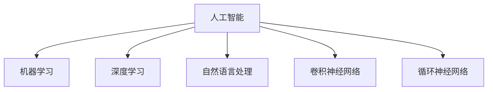

                 

# 李开复：苹果发布AI应用的价值

> 关键词：人工智能, 苹果, AI应用, 价值, 机器学习

## 1. 背景介绍

### 1.1 问题由来

近年来，人工智能(AI)技术取得了飞速发展，广泛应用于各行业。苹果作为全球领先的科技公司，也在积极布局AI领域。近日，苹果公司发布了一系列AI应用，包括Siri的升级、自然语言处理模型等，引发了广泛关注。

本文将详细分析这些AI应用的原理和价值，探讨苹果AI技术的发展趋势及其在各个领域的潜在影响。

## 2. 核心概念与联系

### 2.1 核心概念概述

本节将介绍与苹果AI应用密切相关的核心概念，包括：

- **人工智能(AI)**：通过计算机模拟人类智能行为的技术，包括机器学习、深度学习、自然语言处理等。
- **机器学习(ML)**：让机器从数据中学习规律，自动改进算法，提高性能。
- **深度学习(Deep Learning)**：一种特殊的机器学习方法，通过多层次神经网络模拟人脑工作方式。
- **自然语言处理(NLP)**：使计算机能够理解、处理和生成人类语言的技术。
- **卷积神经网络(CNN)**：一种常用的深度学习模型，常用于图像处理。
- **循环神经网络(RNN)**：一种特殊的神经网络，用于处理序列数据，如时间序列、文本等。

这些概念之间的逻辑关系可以通过以下Mermaid流程图来展示：



这个流程图展示了AI相关的核心概念及其之间的关联：

1. AI包含多个子领域，机器学习、深度学习、自然语言处理等。
2. 深度学习是机器学习中的一种特殊形式。
3. CNN和RNN是深度学习中常用的模型。
4. NLP是AI领域的重要组成部分。

## 3. 核心算法原理 & 具体操作步骤

### 3.1 算法原理概述

苹果的AI应用主要基于深度学习和自然语言处理技术，其核心算法原理包括：

- **卷积神经网络(CNN)**：苹果在图像识别、视频分析等任务中广泛应用CNN。CNN能够自动提取图像特征，减少人工干预。
- **循环神经网络(RNN)**：苹果在语音识别、机器翻译等任务中采用RNN。RNN能够处理序列数据，保持上下文信息。
- **自然语言处理(NLP)**：苹果在Siri等语音助手中应用NLP，使计算机能够理解和处理自然语言。

### 3.2 算法步骤详解

以下将详细介绍苹果AI应用的算法步骤：

1. **数据预处理**：苹果首先收集和整理大量数据，包括图片、音频、文本等。通过预处理步骤，将原始数据转换为模型能够处理的格式。
2. **模型训练**：苹果使用GPU、TPU等高性能设备进行模型训练。训练过程包括前向传播和反向传播，通过优化算法更新模型参数。
3. **模型微调**：苹果在特定任务上微调模型，提升其在具体场景下的性能。微调过程通常使用少量标注数据，减少训练时间。
4. **模型评估**：苹果在测试集上评估模型的性能，确保其在实际应用中表现良好。评估指标包括准确率、召回率、F1分数等。
5. **模型部署**：苹果将训练好的模型集成到应用程序中，提供用户使用。部署过程中，需考虑模型性能、资源占用等问题。

### 3.3 算法优缺点

苹果的AI应用具有以下优点：

- **高效性**：采用先进的深度学习技术，模型能够快速提取数据特征，减少人工干预。
- **通用性**：基于通用模型框架，如TensorFlow、PyTorch，能够在多个任务和场景中灵活应用。
- **可解释性**：使用可视化工具，如TensorBoard、Weights & Biases，能够解释模型内部的工作机制。

同时，也存在一些缺点：

- **资源消耗大**：深度学习模型通常需要大量计算资源，可能会带来高昂的成本。
- **可解释性不足**：复杂模型难以解释其决策过程，用户难以理解其内部逻辑。
- **依赖数据质量**：模型效果依赖于数据质量，若数据标注不准确，会影响模型性能。

### 3.4 算法应用领域

苹果的AI应用广泛涉及以下几个领域：

- **医疗健康**：苹果通过机器学习技术，分析医疗数据，提供个性化的健康建议。
- **智能家居**：苹果在智能家居设备中集成AI功能，如Siri语音助手，实现智能化控制。
- **自动驾驶**：苹果在自动驾驶技术中采用深度学习，提高车辆的感知和决策能力。
- **增强现实(AR)**：苹果在AR应用中引入自然语言处理，提升用户体验。
- **金融科技**：苹果利用AI进行风险评估、信用评分等，提升金融服务效率。

## 4. 数学模型和公式 & 详细讲解 & 举例说明

### 4.1 数学模型构建

苹果的AI应用中，常见的数学模型包括卷积神经网络(CNN)和循环神经网络(RNN)。以下是两个模型的基本形式：

- **卷积神经网络(CNN)**：
  $$
  y=f(x,W,b)=\sigma(\sum_{i=1}^k W_i x_i + b_i)
  $$
  其中，$x$为输入数据，$W$和$b$为模型参数，$\sigma$为激活函数。

- **循环神经网络(RNN)**：
  $$
  h_t=f(h_{t-1},x_t,W,b)=\sigma(\sum_{i=1}^k W_i h_{t-1} + x_t + b_i)
  $$
  其中，$h_t$为当前时间步的隐藏状态，$x_t$为当前时间步的输入数据，$W$和$b$为模型参数，$\sigma$为激活函数。

### 4.2 公式推导过程

以CNN为例，推导其基本形式。假设输入数据为$x_1$，$x_2$，...，$x_n$，每个输入特征的维度为$d$。卷积层计算过程如下：

1. 卷积操作：
  $$
  c_{i,j}=\sum_{m=1}^k W_{m,i} x_{j,m}+b_{i}
  $$
  其中，$W_{m,i}$为卷积核，$x_{j,m}$为输入数据，$b_i$为偏置项。

2. 激活函数：
  $$
  y_i=\sigma(\sum_{j=1}^n c_{i,j})
  $$
  其中，$\sigma$为激活函数，通常采用ReLU或Sigmoid。

3. 池化操作：
  $$
  y_i=\max(y_i)
  $$
  其中，$\max$为最大池化操作，选择池化窗口内的最大值。

### 4.3 案例分析与讲解

以苹果的图像识别应用为例，分析其工作原理。

1. **数据预处理**：苹果收集大量图片，将其转换为张量格式，进行归一化和增强处理。
2. **卷积层**：苹果使用多个卷积核，提取图片的局部特征，减少数据量。
3. **池化层**：苹果通过最大池化操作，保留最重要的特征，减少参数数量。
4. **全连接层**：苹果将池化后的特征向量输入全连接层，进行分类。
5. **softmax**：苹果使用softmax函数，将分类结果转换为概率分布，进行预测。

## 5. 项目实践：代码实例和详细解释说明

### 5.1 开发环境搭建

要在苹果的AI应用中进行项目实践，需要搭建合适的开发环境。以下是详细的步骤：

1. **安装Python**：确保计算机上已安装Python，并设置环境变量。
2. **安装TensorFlow**：使用pip安装TensorFlow，并进行版本选择。
3. **安装PyTorch**：使用pip安装PyTorch，并进行版本选择。
4. **安装OpenCV**：使用pip安装OpenCV，用于图像处理。
5. **安装Keras**：使用pip安装Keras，进行模型训练。
6. **安装TensorBoard**：使用pip安装TensorBoard，进行模型监控。

### 5.2 源代码详细实现

以下是一个简单的卷积神经网络模型示例：

```python
import tensorflow as tf
from tensorflow.keras import layers, models

# 定义模型
model = models.Sequential([
    layers.Conv2D(32, (3, 3), activation='relu', input_shape=(32, 32, 3)),
    layers.MaxPooling2D((2, 2)),
    layers.Conv2D(64, (3, 3), activation='relu'),
    layers.MaxPooling2D((2, 2)),
    layers.Conv2D(64, (3, 3), activation='relu'),
    layers.Flatten(),
    layers.Dense(64, activation='relu'),
    layers.Dense(10, activation='softmax')
])

# 编译模型
model.compile(optimizer='adam',
              loss='sparse_categorical_crossentropy',
              metrics=['accuracy'])

# 训练模型
model.fit(x_train, y_train, epochs=10, validation_data=(x_test, y_test))
```

### 5.3 代码解读与分析

在上述代码中，首先定义了一个包含多个卷积层和全连接层的卷积神经网络模型。通过`Sequential`类，将各个层进行堆叠。

接着，使用`compile`方法进行模型编译，设置优化器、损失函数和评价指标。在训练过程中，使用`fit`方法对模型进行训练，并在测试集上进行评估。

## 6. 实际应用场景

### 6.1 医疗健康

苹果在医疗健康领域的应用，通过深度学习分析医学数据，提供个性化的健康建议。例如，苹果的CareKit平台，可以整合多个健康应用，提供跨应用的健康数据共享和管理。

### 6.2 智能家居

苹果的智能家居设备中，广泛应用了AI技术，如Siri语音助手、智能家居控制等。Siri通过自然语言处理技术，能够理解和处理用户的语音指令，提供智能化的家居控制服务。

### 6.3 自动驾驶

苹果在自动驾驶技术中，应用深度学习进行图像和传感器数据处理，提高车辆的感知和决策能力。例如，苹果的自动驾驶平台ARKit，利用计算机视觉技术，进行图像识别和场景理解。

### 6.4 增强现实(AR)

苹果在AR应用中，通过自然语言处理技术，提升用户体验。例如，苹果的ARKit平台，允许开发者通过自然语言控制AR场景，实现更加灵活的互动。

### 6.5 金融科技

苹果在金融科技领域，利用AI进行风险评估、信用评分等，提升金融服务效率。例如，苹果的Pay with Apple平台，通过机器学习技术，提升支付安全和便利性。

## 7. 工具和资源推荐

### 7.1 学习资源推荐

以下是几本优秀的AI书籍，推荐读者学习：

1. **《深度学习》**：Ian Goodfellow、Yoshua Bengio、Aaron Courville著。全面介绍深度学习原理和算法，适合初学者和进阶者。
2. **《TensorFlow实战Google深度学习》**：Mike Sullivan著。详细讲解TensorFlow框架的使用和实践，适合TensorFlow开发者。
3. **《Python深度学习》**：Francois Chollet著。介绍使用Keras和TensorFlow进行深度学习开发，适合Python开发者。
4. **《自然语言处理综论》**：Daniel Jurafsky、James H. Martin著。涵盖自然语言处理的基本理论和应用，适合NLP开发者。
5. **《强化学习》**：Richard S. Sutton、Andrew G. Barto著。介绍强化学习原理和应用，适合AI研究者。

### 7.2 开发工具推荐

以下是几个常用的AI开发工具，推荐开发者使用：

1. **TensorFlow**：Google开发的深度学习框架，支持Python和C++，适合大规模深度学习项目。
2. **PyTorch**：Facebook开发的深度学习框架，支持Python，适合快速原型开发和研究。
3. **Keras**：高层次的深度学习框架，支持TensorFlow和Theano，适合快速开发和原型设计。
4. **Jupyter Notebook**：交互式编程环境，适合开发和实验深度学习模型。
5. **TensorBoard**：TensorFlow配套的可视化工具，适合监控和调试深度学习模型。

### 7.3 相关论文推荐

以下是几篇重要的AI论文，推荐读者阅读：

1. **《ImageNet大规模视觉识别挑战》**：Alex Krizhevsky、Ilya Sutskever、Geoffrey Hinton著。提出CNN模型，推动计算机视觉领域的发展。
2. **《Long Short-Term Memory》**：Sepp Hochreiter、Jürgen Schmidhuber著。提出RNN模型，推动自然语言处理领域的发展。
3. **《AlphaGo Zero》**：David Silver、Doina Precup、John Schulman等著。提出AlphaGo Zero，推动人工智能领域的突破。
4. **《Language Models are Unsupervised Multitask Learners》**：Alec Radford、Jeff Wu、Roberto C. Moore等著。提出预训练语言模型BERT，推动自然语言处理领域的突破。
5. **《Imagenet classification with deep convolutional neural networks》**：Alex Krizhevsky、Ilya Sutskever、Geoffrey Hinton著。提出卷积神经网络CNN，推动计算机视觉领域的发展。

## 8. 总结：未来发展趋势与挑战

### 8.1 研究成果总结

苹果在AI应用方面取得了显著进展，其核心技术包括深度学习、自然语言处理等。通过这些技术，苹果能够在多个领域实现智能化应用，提升用户体验和服务效率。

### 8.2 未来发展趋势

未来，苹果的AI应用将向以下几个方向发展：

1. **模型规模扩大**：随着计算资源和数据量的增加，苹果将进一步扩大AI模型的规模，提升模型的泛化能力和性能。
2. **多模态融合**：苹果将更多地引入图像、视频、语音等多模态数据，推动跨模态的AI应用。
3. **实时性提升**：苹果将优化模型推理过程，提升实时性，适应更多的实时应用场景。
4. **边缘计算应用**：苹果将引入边缘计算技术，优化模型部署，提高响应速度。
5. **跨平台集成**：苹果将进一步整合各个平台的AI应用，提供无缝的用户体验。

### 8.3 面临的挑战

尽管苹果在AI应用方面取得了显著进展，但仍面临以下挑战：

1. **计算资源消耗**：大规模深度学习模型需要大量的计算资源，苹果需要在资源消耗和性能提升之间找到平衡。
2. **数据隐私保护**：AI应用需要大量的数据支持，如何在保护用户隐私的前提下进行数据采集和使用，是一大挑战。
3. **模型可解释性**：复杂模型难以解释其内部工作机制，如何提高模型可解释性，是一个重要的问题。
4. **算法公平性**：AI模型容易受到偏见影响，如何在算法设计中避免偏见，保障公平性，是一大挑战。
5. **模型安全性**：AI模型容易受到攻击，如何保障模型安全性，是一大挑战。

### 8.4 研究展望

未来，苹果需要在以下几个方面进行深入研究：

1. **模型压缩和优化**：研究模型压缩技术，如知识蒸馏、量子化等，提高模型的推理速度和资源利用效率。
2. **跨领域知识融合**：研究跨领域知识图谱和规则库，增强AI模型的知识整合能力。
3. **鲁棒性提升**：研究鲁棒性提升技术，如对抗训练、鲁棒性优化等，提高模型的泛化能力和抗干扰能力。
4. **公平性保障**：研究公平性保障算法，如公平优化、对抗学习等，提高模型的公平性和鲁棒性。
5. **隐私保护技术**：研究隐私保护技术，如差分隐私、联邦学习等，保障用户数据隐私。

## 9. 附录：常见问题与解答

### Q1: 苹果的AI应用具体有哪些？

A: 苹果的AI应用广泛涉及多个领域，包括：

1. **医疗健康**：通过深度学习分析医学数据，提供个性化的健康建议。
2. **智能家居**：在智能家居设备中集成AI功能，如Siri语音助手、智能家居控制等。
3. **自动驾驶**：利用深度学习进行图像和传感器数据处理，提高车辆的感知和决策能力。
4. **增强现实(AR)**：通过自然语言处理技术，提升AR用户体验。
5. **金融科技**：利用AI进行风险评估、信用评分等，提升金融服务效率。

### Q2: 苹果在AI应用中使用了哪些算法？

A: 苹果在AI应用中广泛使用了以下算法：

1. **卷积神经网络(CNN)**：用于图像识别、视频分析等任务。
2. **循环神经网络(RNN)**：用于语音识别、机器翻译等任务。
3. **自然语言处理(NLP)**：用于Siri等语音助手，使计算机能够理解和处理自然语言。

### Q3: 苹果的AI应用面临哪些挑战？

A: 苹果的AI应用面临以下挑战：

1. **计算资源消耗**：大规模深度学习模型需要大量计算资源，带来高昂成本。
2. **数据隐私保护**：AI应用需要大量数据，如何在保护用户隐私的前提下进行数据采集和使用。
3. **模型可解释性**：复杂模型难以解释其内部工作机制，难以理解其决策过程。
4. **算法公平性**：AI模型容易受到偏见影响，需要在算法设计中避免偏见，保障公平性。
5. **模型安全性**：AI模型容易受到攻击，需保障模型安全性。

### Q4: 苹果的AI应用未来有哪些发展方向？

A: 苹果的AI应用未来有以下发展方向：

1. **模型规模扩大**：进一步扩大AI模型的规模，提升模型的泛化能力和性能。
2. **多模态融合**：引入图像、视频、语音等多模态数据，推动跨模态的AI应用。
3. **实时性提升**：优化模型推理过程，提高实时性，适应更多实时应用场景。
4. **边缘计算应用**：引入边缘计算技术，优化模型部署，提高响应速度。
5. **跨平台集成**：整合各个平台的AI应用，提供无缝的用户体验。

---

作者：禅与计算机程序设计艺术 / Zen and the Art of Computer Programming

