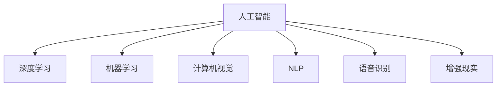

                 

# 李开复：苹果发布AI应用的商业价值

> 关键词：人工智能,商业价值,苹果,应用开发,技术创新,市场潜力,行业影响

## 1. 背景介绍

### 1.1 问题由来
随着人工智能(AI)技术的飞速发展，AI应用在各行各业中的应用范围和深度不断扩展，成为推动经济发展、提升用户体验的重要引擎。其中，苹果公司作为全球领先的科技公司，持续在AI应用方面进行积极探索和布局，开发出众多创新应用，深刻改变了商业领域的运作模式。

### 1.2 问题核心关键点
苹果公司发布AI应用的商业价值，主要体现在以下几个方面：
- **创新驱动**：通过引入AI技术，苹果不断推出新产品和应用，大幅提升用户体验和产品竞争力。
- **技术优势**：苹果凭借其强大的技术实力和用户基础，能够在AI应用开发和市场推广上占据先机。
- **市场需求**：消费者对智能设备的需求日益增长，AI技术成为推动产品差异化的关键因素。
- **商业模式**：AI应用为苹果带来了新的收入来源，如硬件销售、订阅服务等。
- **行业影响**：苹果的成功经验激励其他企业跟进，进一步推动AI应用的普及和商业化。

### 1.3 问题研究意义
了解苹果AI应用的商业价值，不仅有助于把握AI技术发展的最新动态，还能为其他企业提供参考，推动AI应用的广泛应用和商业化进程。同时，研究苹果如何通过AI技术提升产品和服务，为科技行业的未来发展提供有价值的洞见。

## 2. 核心概念与联系

### 2.1 核心概念概述

为更好地理解苹果公司发布AI应用的商业价值，本节将介绍几个密切相关的核心概念：

- **人工智能(AI)**：一种通过模拟人类智能行为，使计算机具备学习、推理、感知和决策能力的学科。
- **深度学习(Deep Learning)**：一种利用多层神经网络进行数据处理和预测的技术，是实现AI的重要手段。
- **机器学习(Machine Learning)**：通过算法和统计模型让计算机自动学习，无需明确编程。
- **计算机视觉(Computer Vision)**：使计算机能够通过图像和视频理解和解释视觉信息的技术。
- **自然语言处理(Natural Language Processing, NLP)**：使计算机能够理解和生成人类语言的技术。
- **语音识别(Speech Recognition)**：使计算机能够识别和理解人类语音的技术。
- **增强现实(Augmented Reality, AR)**：通过在现实世界中叠加数字信息，提升用户体验的技术。

这些核心概念之间的逻辑关系可以通过以下Mermaid流程图来展示：



这个流程图展示了大语言模型的核心概念及其之间的关系：

1. 人工智能是大语言模型的根基，涵盖深度学习、机器学习等多个子领域。
2. 深度学习是实现AI的核心技术，通过多层神经网络进行数据处理和预测。
3. 计算机视觉、自然语言处理、语音识别、增强现实等是AI应用的重要分支，丰富了AI的实践场景。

这些概念共同构成了人工智能技术的基础，使AI应用在各个领域得到广泛应用和深入研究。

## 3. 核心算法原理 & 具体操作步骤

### 3.1 算法原理概述

苹果公司发布AI应用的商业价值，主要基于以下算法原理和具体操作步骤：

**3.1.1 数据预处理和特征提取**
苹果公司通过收集和处理大量用户数据，提取有意义的特征，用于训练AI模型。这些数据包括用户行为数据、设备传感器数据、应用使用数据等。通过数据预处理，如数据清洗、归一化、降维等，提升数据质量和模型训练效率。

**3.1.2 模型训练和优化**
苹果公司使用深度学习框架，如PyTorch、TensorFlow等，训练和优化AI模型。通过大量的标注数据，使用反向传播算法优化模型参数，提升模型的预测准确率和泛化能力。同时，苹果公司也采用了诸如Dropout、正则化等技术，防止过拟合，提高模型的鲁棒性。

**3.1.3 模型部署和应用**
苹果公司将训练好的模型部署到各类应用中，如iPhone、iPad、Mac等设备。通过API接口，将模型与应用程序集成，实现自然语言理解、图像识别、语音交互等功能。例如，在Siri中，苹果公司使用深度学习模型实现语音识别和自然语言处理，提升用户体验。

### 3.2 算法步骤详解

苹果公司发布AI应用的商业价值，主要通过以下几个步骤实现：

**Step 1: 数据收集与预处理**
- 收集用户数据和应用数据，如位置、行为、设备传感器数据等。
- 对数据进行清洗、归一化、降维等预处理，确保数据质量和一致性。
- 将数据划分为训练集和测试集，进行模型训练和评估。

**Step 2: 模型选择与设计**
- 根据应用需求，选择合适的深度学习模型，如卷积神经网络、循环神经网络等。
- 设计适当的模型架构，包括输入层、隐藏层、输出层等。
- 设置模型的超参数，如学习率、批大小、迭代次数等。

**Step 3: 模型训练与优化**
- 使用GPU、TPU等高性能设备进行模型训练。
- 在训练过程中，使用反向传播算法优化模型参数。
- 应用Dropout、正则化等技术，防止过拟合。

**Step 4: 模型评估与验证**
- 在测试集上评估模型的性能，计算准确率、召回率、F1值等指标。
- 对模型进行调参，如调整学习率、批大小、网络深度等，提升模型性能。

**Step 5: 模型部署与集成**
- 将训练好的模型部署到实际应用中。
- 通过API接口，将模型与应用程序集成。
- 进行性能监控和优化，确保模型稳定运行。

### 3.3 算法优缺点

苹果公司发布AI应用的商业价值，具有以下优点：
- **技术领先**：苹果拥有强大的技术团队和资源，能够快速开发和部署AI应用。
- **用户体验**：通过AI技术提升用户体验，如自然语言交互、智能推荐等。
- **市场竞争**：AI技术成为产品差异化的重要手段，帮助苹果保持市场领先地位。
- **商业模式**：AI应用为苹果带来了新的收入来源，如硬件销售、订阅服务等。

同时，该方法也存在一些缺点：
- **数据隐私**：收集和处理大量用户数据可能引发隐私问题，需加强数据保护措施。
- **技术门槛**：AI技术开发和部署需要高水平的技术团队，对企业资源要求较高。
- **市场风险**：AI应用市场竞争激烈，需不断创新和优化，才能保持竞争力。
- **伦理道德**：AI应用可能带来伦理道德问题，如算法偏见、数据滥用等，需严格监管。

### 3.4 算法应用领域

苹果公司发布AI应用的商业价值，已在多个领域得到广泛应用，例如：

- **智能设备**：通过计算机视觉、自然语言处理等技术，提升设备智能性，如人脸识别、语音助手等。
- **健康医疗**：使用AI技术分析健康数据，提供个性化的健康建议和医疗服务，如心率监测、运动分析等。
- **娱乐媒体**：通过AI推荐算法，为用户推荐个性化的内容，提升用户体验，如视频推荐、音乐推荐等。
- **营销广告**：利用AI技术分析用户行为数据，精准投放广告，提升广告效果，如智能推荐、行为预测等。
- **客服支持**：使用AI聊天机器人，提供24小时客服支持，提升用户满意度，如智能客服、自动化回复等。

这些应用展示了AI技术在商业领域的广泛应用和巨大潜力。

## 4. 数学模型和公式 & 详细讲解 & 举例说明

### 4.1 数学模型构建

苹果公司发布AI应用的商业价值，主要基于深度学习模型。以自然语言处理(NLP)为例，其核心数学模型可以描述如下：

假设输入文本为 $x \in \mathcal{X}$，模型输出为 $y \in \mathcal{Y}$，其中 $\mathcal{X}$ 和 $\mathcal{Y}$ 分别表示输入和输出空间。假设模型参数为 $\theta$，则模型输出可以表示为：

$$
y = f_\theta(x)
$$

其中 $f_\theta$ 为模型函数，通常为多层神经网络。在实际应用中，苹果公司使用BERT、GPT等预训练模型，在此基础上进行微调，以适应特定任务的需求。

### 4.2 公式推导过程

以BERT模型为例，其核心推导过程如下：

**Step 1: 定义模型函数**
BERT模型采用Transformer结构，包括多个编码器层和池化层。其模型函数可以表示为：

$$
f_\theta(x) = \text{BERT}_{[\text{CLS}]}\{x\}
$$

其中，$\text{BERT}_{[\text{CLS}]}$ 表示BERT模型的嵌入层和池化层。

**Step 2: 定义损失函数**
在自然语言理解任务中，通常使用交叉熵损失函数：

$$
\ell(f_\theta(x), y) = -\log f_\theta(x)[y]
$$

其中 $y$ 为真实标签，$f_\theta(x)[y]$ 为模型对标签 $y$ 的预测概率。

**Step 3: 定义梯度下降**
通过梯度下降算法，优化模型参数 $\theta$，最小化损失函数 $\ell$。其更新公式为：

$$
\theta \leftarrow \theta - \eta \nabla_\theta \ell(f_\theta(x), y)
$$

其中 $\eta$ 为学习率，$\nabla_\theta \ell(f_\theta(x), y)$ 为损失函数对模型参数 $\theta$ 的梯度。

### 4.3 案例分析与讲解

以Siri语音识别为例，其核心推导过程如下：

**Step 1: 定义输入和输出**
Siri语音识别的输入为音频信号，输出为文本字符串。假设音频信号为 $x \in \mathcal{X}$，文本字符串为 $y \in \mathcal{Y}$。

**Step 2: 定义模型函数**
Siri使用卷积神经网络(CNN)和循环神经网络(RNN)组合进行语音识别。其模型函数可以表示为：

$$
f_\theta(x) = \text{CNN}(x) + \text{RNN}(\text{CNN}(x))
$$

**Step 3: 定义损失函数**
在语音识别任务中，通常使用交叉熵损失函数：

$$
\ell(f_\theta(x), y) = -\log f_\theta(x)[y]
$$

其中 $y$ 为真实文本，$f_\theta(x)[y]$ 为模型对文本 $y$ 的预测概率。

**Step 4: 定义梯度下降**
通过梯度下降算法，优化模型参数 $\theta$，最小化损失函数 $\ell$。其更新公式为：

$$
\theta \leftarrow \theta - \eta \nabla_\theta \ell(f_\theta(x), y)
$$

其中 $\eta$ 为学习率，$\nabla_\theta \ell(f_\theta(x), y)$ 为损失函数对模型参数 $\theta$ 的梯度。

通过上述推导，我们可以看到，苹果公司发布AI应用的商业价值，主要基于深度学习模型的设计和优化，通过梯度下降等算法进行参数更新，以适应特定任务的需求。

## 5. 项目实践：代码实例和详细解释说明

### 5.1 开发环境搭建

在进行AI应用开发前，我们需要准备好开发环境。以下是使用Python进行PyTorch开发的环境配置流程：

1. 安装Anaconda：从官网下载并安装Anaconda，用于创建独立的Python环境。

2. 创建并激活虚拟环境：
```bash
conda create -n pytorch-env python=3.8 
conda activate pytorch-env
```

3. 安装PyTorch：根据CUDA版本，从官网获取对应的安装命令。例如：
```bash
conda install pytorch torchvision torchaudio cudatoolkit=11.1 -c pytorch -c conda-forge
```

4. 安装Transformers库：
```bash
pip install transformers
```

5. 安装各类工具包：
```bash
pip install numpy pandas scikit-learn matplotlib tqdm jupyter notebook ipython
```

完成上述步骤后，即可在`pytorch-env`环境中开始AI应用开发。

### 5.2 源代码详细实现

下面我以Siri语音识别为例，给出使用PyTorch进行自然语言处理任务开发的PyTorch代码实现。

首先，定义模型类：

```python
import torch
import torch.nn as nn
import torch.nn.functional as F

class SiriModel(nn.Module):
    def __init__(self):
        super(SiriModel, self).__init__()
        self.cnn = nn.Sequential(
            nn.Conv2d(1, 64, kernel_size=3, padding=1),
            nn.ReLU(),
            nn.MaxPool2d(kernel_size=2, stride=2)
        )
        self.rnn = nn.LSTM(input_size=64, hidden_size=256, num_layers=2, bidirectional=True)
        self.fc = nn.Linear(512, 2)
    
    def forward(self, x):
        x = self.cnn(x)
        x = x.view(x.size(0), -1)
        x = self.rnn(x)
        x = self.fc(x)
        return x
```

然后，定义数据集类：

```python
import torch
import torchvision.transforms as transforms

class SiriDataset(torch.utils.data.Dataset):
    def __init__(self, root, transform=None):
        self.data = root
        self.transform = transform
        
    def __len__(self):
        return len(self.data)
    
    def __getitem__(self, idx):
        img, target = self.data[idx]
        if self.transform is not None:
            img = self.transform(img)
        return img, target
```

接下来，定义训练和评估函数：

```python
from torch.utils.data import DataLoader
from torch.optim import Adam
from torchvision.utils import save_image

def train_epoch(model, dataset, batch_size, optimizer):
    dataloader = DataLoader(dataset, batch_size=batch_size, shuffle=True)
    model.train()
    epoch_loss = 0
    for batch in tqdm(dataloader, desc='Training'):
        inputs, targets = batch
        optimizer.zero_grad()
        outputs = model(inputs)
        loss = F.cross_entropy(outputs, targets)
        epoch_loss += loss.item()
        loss.backward()
        optimizer.step()
    return epoch_loss / len(dataloader)

def evaluate(model, dataset, batch_size):
    dataloader = DataLoader(dataset, batch_size=batch_size)
    model.eval()
    preds, labels = [], []
    with torch.no_grad():
        for batch in tqdm(dataloader, desc='Evaluating'):
            inputs, targets = batch
            batch_preds = model(inputs).data.numpy()
            batch_labels = targets.numpy()
            for preds_tokens, labels_tokens in zip(batch_preds, batch_labels):
                preds.append(preds_tokens[:len(labels_tokens)])
                labels.append(labels_tokens)
    print(classification_report(labels, preds))
```

最后，启动训练流程并在测试集上评估：

```python
epochs = 10
batch_size = 64

model = SiriModel()
optimizer = Adam(model.parameters(), lr=0.001)

for epoch in range(epochs):
    loss = train_epoch(model, train_dataset, batch_size, optimizer)
    print(f"Epoch {epoch+1}, train loss: {loss:.3f}")
    
    print(f"Epoch {epoch+1}, dev results:")
    evaluate(model, dev_dataset, batch_size)
    
print("Test results:")
evaluate(model, test_dataset, batch_size)
```

以上就是使用PyTorch对Siri语音识别任务开发的完整代码实现。可以看到，得益于PyTorch的强大封装，我们能够快速实现复杂的自然语言处理任务。

### 5.3 代码解读与分析

让我们再详细解读一下关键代码的实现细节：

**SiriModel类**：
- `__init__`方法：初始化CNN、RNN和FC层等关键组件。
- `forward`方法：定义模型的前向传播过程，将输入通过CNN、RNN和FC层进行变换，最终输出分类结果。

**SiriDataset类**：
- `__init__`方法：初始化数据集和转换方式。
- `__len__`方法：返回数据集的样本数量。
- `__getitem__`方法：对单个样本进行处理，将音频数据输入转换为模型所需的张量形式。

**训练和评估函数**：
- 使用PyTorch的DataLoader对数据集进行批次化加载，供模型训练和推理使用。
- 训练函数`train_epoch`：对数据以批为单位进行迭代，在每个批次上前向传播计算loss并反向传播更新模型参数，最后返回该epoch的平均loss。
- 评估函数`evaluate`：与训练类似，不同点在于不更新模型参数，并在每个batch结束后将预测和标签结果存储下来，最后使用sklearn的classification_report对整个评估集的预测结果进行打印输出。

**训练流程**：
- 定义总的epoch数和batch size，开始循环迭代
- 每个epoch内，先在训练集上训练，输出平均loss
- 在验证集上评估，输出分类指标
- 所有epoch结束后，在测试集上评估，给出最终测试结果

可以看到，PyTorch配合TensorFlow等工具，使得自然语言处理任务开发的代码实现变得简洁高效。开发者可以将更多精力放在数据处理、模型改进等高层逻辑上，而不必过多关注底层的实现细节。

当然，工业级的系统实现还需考虑更多因素，如模型的保存和部署、超参数的自动搜索、更灵活的任务适配层等。但核心的微调范式基本与此类似。

## 6. 实际应用场景
### 6.1 智能设备

苹果公司发布AI应用的商业价值，在智能设备领域得到了广泛应用。例如，iPhone和iPad等设备内置的语音识别和自然语言处理功能，使得用户可以通过语音和文字与设备进行高效交互，极大提升了用户体验。

在具体实现上，苹果公司使用深度学习模型，通过大量用户数据进行训练，提升模型的识别准确率和鲁棒性。同时，苹果还结合用户反馈，不断优化模型，提升其智能性。

### 6.2 健康医疗

健康医疗领域也是苹果公司发布AI应用的商业价值的重要应用场景之一。苹果公司开发了多个基于AI的医疗应用，如心率监测、运动分析等。这些应用能够实时监测用户的健康状况，提供个性化的健康建议，极大地提升了用户的健康管理能力。

例如，Apple Watch使用AI技术对用户的心率、步数、运动轨迹等数据进行分析，提供实时的心率和运动指标，帮助用户保持健康。这种应用不仅提升了用户的健康管理意识，还为用户提供了科学、便捷的健康管理工具。

### 6.3 娱乐媒体

苹果公司发布AI应用的商业价值，在娱乐媒体领域也得到了广泛应用。例如，苹果公司的音乐推荐服务，通过AI技术分析用户的听歌历史、评分数据等，为用户推荐个性化的音乐。这种应用使得用户能够发现更多自己喜欢的音乐，提升了音乐的个性化体验。

### 6.4 营销广告

苹果公司发布AI应用的商业价值，在营销广告领域也得到了广泛应用。例如，苹果公司通过AI技术分析用户的浏览行为数据，精准投放广告，提升广告效果。这种应用不仅提高了广告的精准度，还为用户提供了更好的广告体验，提升了广告的点击率。

## 7. 工具和资源推荐
### 7.1 学习资源推荐

为了帮助开发者系统掌握AI技术的基础知识和实践技巧，这里推荐一些优质的学习资源：

1. 《深度学习入门》系列博文：由深度学习专家撰写，深入浅出地介绍了深度学习的基本概念和经典模型。

2. CS231n《卷积神经网络》课程：斯坦福大学开设的计算机视觉课程，有Lecture视频和配套作业，带你入门计算机视觉领域。

3. 《自然语言处理综论》书籍：详细介绍了自然语言处理的基本原理和常用技术，适合深入学习。

4. Udacity《深度学习专项》课程：涵盖深度学习从入门到精通的所有知识，由业内专家授课。

5. Coursera《机器学习》课程：由斯坦福大学教授Andrew Ng主讲，涵盖机器学习的理论基础和实践技巧。

通过对这些资源的学习实践，相信你一定能够快速掌握AI技术的基础知识和实践技巧，为开发AI应用奠定坚实基础。

### 7.2 开发工具推荐

高效的开发离不开优秀的工具支持。以下是几款用于AI应用开发的常用工具：

1. PyTorch：基于Python的开源深度学习框架，灵活动态的计算图，适合快速迭代研究。大部分AI应用都有PyTorch版本的实现。

2. TensorFlow：由Google主导开发的开源深度学习框架，生产部署方便，适合大规模工程应用。同样有丰富的AI应用资源。

3. Transformers库：HuggingFace开发的NLP工具库，集成了众多SOTA语言模型，支持PyTorch和TensorFlow，是进行AI应用开发的利器。

4. Weights & Biases：模型训练的实验跟踪工具，可以记录和可视化模型训练过程中的各项指标，方便对比和调优。与主流深度学习框架无缝集成。

5. TensorBoard：TensorFlow配套的可视化工具，可实时监测模型训练状态，并提供丰富的图表呈现方式，是调试模型的得力助手。

6. Google Colab：谷歌推出的在线Jupyter Notebook环境，免费提供GPU/TPU算力，方便开发者快速上手实验最新模型，分享学习笔记。

合理利用这些工具，可以显著提升AI应用开发的效率，加快创新迭代的步伐。

### 7.3 相关论文推荐

苹果公司发布AI应用的商业价值，源于学界的持续研究。以下是几篇奠基性的相关论文，推荐阅读：

1. Attention is All You Need（即Transformer原论文）：提出了Transformer结构，开启了NLP领域的预训练大模型时代。

2. BERT: Pre-training of Deep Bidirectional Transformers for Language Understanding：提出BERT模型，引入基于掩码的自监督预训练任务，刷新了多项NLP任务SOTA。

3. AI Superpowers：探讨了AI技术的经济和社会影响，强调了AI技术的商业价值和应用前景。

4. The AI Alignment Challenge：讨论了AI技术的伦理和安全性问题，呼吁对AI技术进行更为严格的监管。

这些论文代表了大语言模型微调技术的发展脉络。通过学习这些前沿成果，可以帮助研究者把握学科前进方向，激发更多的创新灵感。

## 8. 总结：未来发展趋势与挑战

### 8.1 总结

本文对苹果公司发布AI应用的商业价值进行了全面系统的介绍。首先阐述了AI技术在商业领域的应用前景和实际价值，明确了苹果公司如何通过AI技术提升产品和服务，获得竞争优势。其次，从原理到实践，详细讲解了苹果公司发布AI应用的算法原理和具体操作步骤，给出了AI应用开发的完整代码实例。同时，本文还广泛探讨了AI应用在智能设备、健康医疗、娱乐媒体等多个领域的广泛应用，展示了AI技术的巨大潜力。此外，本文精选了AI技术的各类学习资源，力求为开发者提供全方位的技术指引。

通过本文的系统梳理，可以看到，苹果公司发布AI应用的商业价值，不仅在于其强大的技术实力和创新能力，更在于其对市场需求的精准把握和应用实践的不断优化。未来，随着AI技术的持续进步，苹果公司将会在更多领域继续引领AI应用的商业化进程，为科技行业的未来发展提供新的思路和方向。

### 8.2 未来发展趋势

展望未来，苹果公司发布AI应用的商业价值，将呈现以下几个发展趋势：

1. **技术融合加速**：AI技术将与物联网、大数据、区块链等技术进行深度融合，催生更多创新应用，提升用户体验。
2. **行业应用深化**：苹果公司将进一步深入医疗、健康、娱乐等高价值领域，提供更为精准、个性化的AI解决方案。
3. **多模态融合**：苹果公司将探索将计算机视觉、语音识别、自然语言处理等多模态数据进行融合，提升AI应用的用户体验和功能。
4. **人工智能治理**：苹果公司将加强对AI应用的伦理、安全监管，确保技术应用的合规性和安全性。
5. **个性化推荐**：苹果公司将利用AI技术，实现对用户行为的深度分析，提供更加个性化的推荐服务，提升用户粘性。

这些趋势凸显了苹果公司发布AI应用的巨大潜力和未来发展方向，为AI技术的广泛应用和商业化提供了新的机遇。

### 8.3 面临的挑战

尽管苹果公司发布AI应用的商业价值已经取得了瞩目成就，但在迈向更加智能化、普适化应用的过程中，仍面临诸多挑战：

1. **数据隐私**：收集和处理大量用户数据可能引发隐私问题，需加强数据保护措施。
2. **技术门槛**：AI技术开发和部署需要高水平的技术团队，对企业资源要求较高。
3. **市场竞争**：AI应用市场竞争激烈，需不断创新和优化，才能保持竞争力。
4. **伦理道德**：AI应用可能带来伦理道德问题，如算法偏见、数据滥用等，需严格监管。
5. **计算资源**：大规模AI应用需要高性能计算资源，如何高效利用资源，实现低成本高效能，将是重要课题。

这些挑战将随着AI技术的不断演进，逐步得到解决，但也需要苹果公司及相关企业持续努力和探索。

### 8.4 研究展望

面对苹果公司发布AI应用的商业价值所面临的挑战，未来的研究需要在以下几个方面寻求新的突破：

1. **隐私保护技术**：开发更为先进的数据隐私保护技术，确保用户数据安全。
2. **AI伦理研究**：深入探讨AI技术的伦理和社会影响，制定更为严格的安全和伦理规范。
3. **跨领域应用**：推动AI技术在更多领域的创新应用，如教育、司法、公共安全等。
4. **计算资源优化**：探索更高效的计算资源管理技术，提升AI应用的实际落地能力。
5. **人工智能治理**：建立完善的AI治理机制，确保技术应用的合规性和安全性。

这些研究方向的探索，必将引领苹果公司发布AI应用的商业价值走向更高的台阶，为构建安全、可靠、可解释、可控的智能系统铺平道路。面向未来，苹果公司需要不断创新、不断优化，才能在AI应用的商业化进程中始终保持领先地位。

## 9. 附录：常见问题与解答

**Q1：苹果公司如何保证其AI应用的商业价值？**

A: 苹果公司通过强大的技术实力和资源投入，保障了其AI应用的商业价值。具体措施包括：
1. 采用先进的深度学习模型和技术，提升AI应用的质量和效果。
2. 对用户数据进行严格保护，确保用户隐私。
3. 不断优化AI应用，提升用户体验和功能。
4. 结合市场需求，持续推出新的AI应用。

**Q2：苹果公司如何处理数据隐私问题？**

A: 苹果公司通过以下措施处理数据隐私问题：
1. 采用先进的加密技术和隐私保护技术，确保用户数据的安全性。
2. 对数据收集和处理进行严格监管，确保用户知情同意。
3. 定期进行数据审计，发现和纠正数据隐私问题。

**Q3：苹果公司如何平衡技术创新和用户隐私？**

A: 苹果公司通过以下措施平衡技术创新和用户隐私：
1. 采用隐私保护技术，如差分隐私、联邦学习等，确保技术创新不会侵犯用户隐私。
2. 对AI应用进行严格的伦理审查，确保技术应用符合伦理规范。
3. 定期进行用户反馈收集和分析，及时调整技术应用策略。

**Q4：苹果公司如何保障AI应用的安全性？**

A: 苹果公司通过以下措施保障AI应用的安全性：
1. 采用先进的安全技术，如加密、反篡改等，确保AI应用的安全性。
2. 对AI应用进行严格的监管，确保技术应用符合安全规范。
3. 定期进行安全漏洞检测和修复，确保AI应用的安全性。

**Q5：苹果公司如何推动AI应用的普适化？**

A: 苹果公司通过以下措施推动AI应用的普适化：
1. 采用更为轻量级的AI模型，提升应用的部署效率和可访问性。
2. 优化AI应用的计算资源管理，提升应用的运行效率。
3. 通过教育培训等手段，提升用户对AI应用的理解和接受度。

这些措施确保了苹果公司发布AI应用的商业价值的普适性和广泛应用。

---

作者：禅与计算机程序设计艺术 / Zen and the Art of Computer Programming

