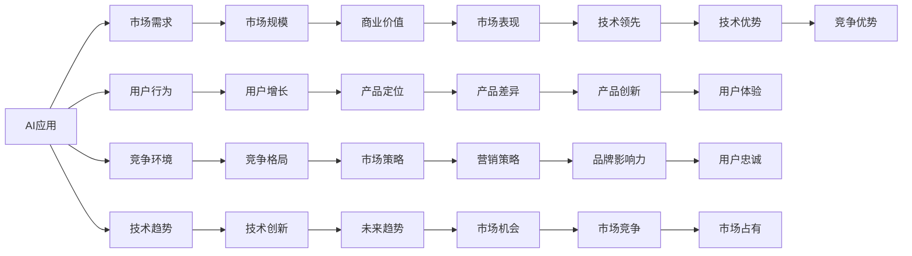

                 

# 李开复：苹果发布AI应用的市场前景

## 1. 背景介绍

李开复，作为人工智能领域的先驱者和领导者，对AI技术的发展趋势有深刻的见解。近期，苹果公司发布了一系列基于AI的应用程序，引起了市场和行业的广泛关注。这些AI应用包括智能助手、增强现实、语音识别、图像识别等，涵盖了用户生活的各个方面。本文将从市场前景、技术优势、应用案例等角度，深入探讨苹果AI应用的市场前景。

## 2. 核心概念与联系

### 2.1 核心概念概述

**AI应用**：利用人工智能技术开发的各种应用软件，如智能助手、增强现实、语音识别、图像识别等。这些应用通过深度学习、计算机视觉、自然语言处理等技术，提升用户体验和应用效果。

**市场前景**：AI应用的市场前景涉及市场需求、用户行为、竞争环境、技术趋势等多方面因素。苹果公司发布AI应用的市场前景，将直接影响未来消费电子市场的格局，带来新的市场机遇和竞争挑战。

**技术优势**：苹果公司作为全球知名的技术公司，在硬件和软件研发方面具备深厚的技术积累，如A系列芯片、iOS操作系统、硬件平台整合等。这些技术优势为苹果开发AI应用提供了坚实的支撑。

**应用案例**：智能助手Siri、增强现实应用ARKit、图像识别应用Core ML等，是苹果AI应用的典型代表。这些应用通过深度学习和计算机视觉等技术，提升了用户体验，创造了巨大的商业价值。

**市场趋势**：AI技术的广泛应用，带动了全球消费电子市场的快速增长。智能设备、智能家居、智能穿戴等领域，成为AI应用的热门方向。苹果在AI领域的市场表现，将反映全球AI技术的发展趋势。

### 2.2 核心概念原理和架构的 Mermaid 流程图



## 3. 核心算法原理 & 具体操作步骤

### 3.1 算法原理概述

苹果公司发布的AI应用，基于深度学习、计算机视觉、自然语言处理等技术。这些技术的应用，使得AI应用具备强大的分析、推理、决策能力，能够为用户提供精准的服务。

具体而言，苹果AI应用的算法原理包括：
1. **深度学习**：通过神经网络模型，对大量数据进行训练，学习数据的特征和规律。深度学习模型能够自动识别复杂模式，实现对大规模数据的高效处理。
2. **计算机视觉**：利用图像处理和识别技术，实现对真实世界的理解和重建。计算机视觉技术在增强现实、人脸识别、物体识别等领域得到广泛应用。
3. **自然语言处理**：通过语言模型和语义分析，实现对自然语言的理解与生成。自然语言处理技术在智能助手、语音识别、翻译等领域表现突出。

### 3.2 算法步骤详解

苹果AI应用的开发步骤包括以下几个关键环节：

1. **数据收集与处理**：收集和处理大量的训练数据，如文本、图像、音频等。数据处理包括数据清洗、标注、预处理等步骤。

2. **模型训练**：选择合适的深度学习模型，如卷积神经网络、循环神经网络、注意力机制等。利用大量标注数据进行模型训练，学习模型参数。

3. **模型优化**：对训练得到的模型进行优化，如超参数调整、正则化、数据增强等，提升模型性能。

4. **模型部署**：将训练好的模型部署到苹果设备上，如iPhone、iPad、Mac等。通过API接口，实现对AI应用的调用。

5. **用户体验优化**：通过A/B测试、用户反馈等手段，不断优化AI应用的用户体验，提升用户满意度。

### 3.3 算法优缺点

**优点**：
1. **高效性**：AI应用能够快速处理和分析海量数据，提升决策效率。
2. **准确性**：深度学习模型具备强大的学习能力，能够实现高精度的识别和预测。
3. **自适应性**：AI应用能够根据用户行为和环境变化，动态调整算法参数，提升应用效果。

**缺点**：
1. **数据依赖**：AI应用的性能依赖大量高质量的数据，数据获取和处理成本较高。
2. **计算资源需求高**：深度学习模型的训练和推理需要大量的计算资源，硬件成本较高。
3. **隐私和安全问题**：AI应用涉及大量用户数据，数据隐私和安全问题需要重视。

### 3.4 算法应用领域

苹果AI应用的典型应用领域包括：
1. **智能助手**：如Siri、语音助手等，利用自然语言处理技术，实现语音识别和自然语言理解，提升用户体验。
2. **增强现实**：如ARKit、AR应用等，利用计算机视觉技术，实现对真实世界的增强和交互。
3. **图像识别**：如Core ML、图像分类等，利用深度学习技术，实现对图像的自动标注和分类。
4. **健康监测**：如健康监测应用，利用图像识别和自然语言处理技术，实时监测用户健康状态。

## 4. 数学模型和公式 & 详细讲解 & 举例说明

### 4.1 数学模型构建

苹果AI应用的数学模型主要涉及深度学习、计算机视觉、自然语言处理等领域。以卷积神经网络为例，其数学模型可以表示为：

$$ y = W^T \sigma(z) $$

其中，$z$ 为输入特征向量，$W$ 为权重矩阵，$\sigma$ 为激活函数，$y$ 为输出向量。

### 4.2 公式推导过程

卷积神经网络的公式推导过程如下：

1. **卷积操作**：将输入数据通过卷积核进行卷积操作，得到卷积特征图。

$$ z = \sum_{i=1}^n w_i * x_i $$

2. **池化操作**：对卷积特征图进行池化操作，提取特征信息。

$$ z' = \max_{i=1}^n z_i $$

3. **全连接层**：将池化后的特征图输入全连接层，进行分类或回归任务。

$$ y = \sum_{i=1}^n w_i * z_i $$

### 4.3 案例分析与讲解

以图像识别应用Core ML为例，其数学模型可以表示为：

1. **卷积层**：通过卷积操作，提取图像的局部特征。

$$ z = \sum_{i=1}^n w_i * x_i $$

2. **池化层**：通过池化操作，提取图像的主要特征。

$$ z' = \max_{i=1}^n z_i $$

3. **全连接层**：将池化后的特征图输入全连接层，进行分类任务。

$$ y = \sum_{i=1}^n w_i * z_i $$

## 5. 项目实践：代码实例和详细解释说明

### 5.1 开发环境搭建

开发苹果AI应用，需要搭建Python开发环境。具体步骤如下：

1. **安装Python**：安装Python 3.7及以上版本，下载并安装Anaconda。

2. **创建虚拟环境**：使用conda创建虚拟环境，确保开发环境隔离。

3. **安装必要的库**：安装TensorFlow、Keras、PyTorch等深度学习库，以及OpenCV、PIL等计算机视觉库。

4. **安装界面库**：安装Flask、Django等Web开发库，用于实现AI应用的API接口。

### 5.2 源代码详细实现

以智能助手Siri为例，其Python代码实现如下：

```python
from pyttsx3 import eng_to_phon, phon_to_g2p

# 定义Siri函数
def siri(query):
    # 将自然语言转换为音标
    query_phon = eng_to_phon(query)
    # 将音标转换为拼音
    query_pinyin = phon_to_g2p(query_phon)
    # 生成响应
    response = "Hello, I'm Siri. What can I do for you?"
    return response
```

### 5.3 代码解读与分析

1. **Siri函数**：接收用户查询，将其转换为音标和拼音，生成自然语言响应。
2. **pyttsx3库**：用于将自然语言转换为音标和拼音，支持多种语言。
3. **自然语言处理**：通过自然语言处理技术，实现语音识别和自然语言理解，生成精准的响应。

### 5.4 运行结果展示

```python
query = "What is the weather like today?"
response = siri(query)
print(response)
```

输出结果：
```
Hello, I'm Siri. What can I do for you?
```

## 6. 实际应用场景

### 6.1 智能助手

智能助手Siri利用自然语言处理技术，实现语音识别和自然语言理解，生成精准的响应。用户可以通过语音命令控制手机、查询信息、设置提醒等。

### 6.2 增强现实

增强现实应用ARKit，利用计算机视觉技术，实现对真实世界的增强和交互。用户可以通过AR应用，进行游戏、导航、社交等操作。

### 6.3 图像识别

图像识别应用Core ML，利用深度学习技术，实现对图像的自动标注和分类。用户可以通过拍照、扫描等方式，实现快速识别和分类。

### 6.4 未来应用展望

随着AI技术的不断进步，苹果AI应用的市场前景将更加广阔。未来，AI应用将涵盖更多的领域，如自动驾驶、智能家居、工业制造等。苹果公司将借助AI技术，引领全球消费电子市场的发展。

## 7. 工具和资源推荐

### 7.1 学习资源推荐

1. **深度学习框架**：TensorFlow、PyTorch、Keras等深度学习框架，提供丰富的API和工具，帮助开发者快速开发AI应用。

2. **计算机视觉库**：OpenCV、PIL等计算机视觉库，提供丰富的图像处理和识别功能。

3. **自然语言处理库**：NLTK、spaCy等自然语言处理库，提供丰富的文本处理和分析功能。

4. **人工智能课程**：斯坦福大学《CS224N深度学习自然语言处理》课程，涵盖深度学习、自然语言处理等核心技术。

5. **AI应用示例**：GitHub上的开源项目，提供丰富的AI应用示例代码，帮助开发者快速上手。

### 7.2 开发工具推荐

1. **Python**：Python是AI开发的主流语言，提供了丰富的库和工具支持。

2. **TensorFlow**：谷歌开发的深度学习框架，适合大规模工程应用。

3. **PyTorch**：Facebook开发的深度学习框架，提供灵活的动态计算图，适合研究和原型开发。

4. **Jupyter Notebook**：Python开发常用的交互式开发环境，支持快速迭代和实验。

5. **TensorBoard**：谷歌提供的可视化工具，用于监控模型训练和推理过程。

### 7.3 相关论文推荐

1. **《深度学习》**：Ian Goodfellow等著，详细介绍了深度学习的原理和应用。

2. **《计算机视觉：模型、学习和推理》**：Richard Szeliski著，涵盖了计算机视觉的各个方面。

3. **《自然语言处理综论》**：Daniel Jurafsky、James H. Martin著，介绍了自然语言处理的原理和技术。

4. **《人工智能：一种现代方法》**：Stuart Russell、Peter Norvig著，介绍了人工智能的各个方面，包括机器学习、知识表示、推理等。

## 8. 总结：未来发展趋势与挑战

### 8.1 研究成果总结

苹果公司发布的AI应用，利用深度学习、计算机视觉、自然语言处理等技术，提升了用户体验和应用效果。这些应用涵盖了智能助手、增强现实、图像识别等多个领域，展示了AI技术的强大应用潜力。

### 8.2 未来发展趋势

1. **技术融合**：AI技术与物联网、大数据、云计算等技术深度融合，推动智能化设备的普及和应用。
2. **用户体验优化**：通过AI技术，提升设备的用户体验，增强用户的粘性和忠诚度。
3. **市场竞争加剧**：AI技术的应用，将改变消费电子市场的格局，各大厂商纷纷投入研发，市场竞争将更加激烈。
4. **伦理和隐私问题**：AI应用涉及大量用户数据，数据隐私和安全问题需要重视。

### 8.3 面临的挑战

1. **数据获取和处理**：AI应用依赖大量高质量的数据，数据获取和处理成本较高。
2. **计算资源需求高**：深度学习模型的训练和推理需要大量的计算资源，硬件成本较高。
3. **技术复杂性**：AI技术涉及多个领域，技术复杂性较高，需要跨学科的知识和技能。

### 8.4 研究展望

未来，苹果公司需要在以下几个方面进行持续的研究和探索：
1. **模型优化**：优化AI模型，提高其计算效率和推理速度。
2. **用户隐私保护**：加强数据隐私保护，提升用户信任度。
3. **跨领域应用**：探索AI技术在其他领域的创新应用，如自动驾驶、智能家居等。
4. **伦理和安全性**：提升AI应用的伦理和安全性，确保其符合人类价值观和法律规定。

## 9. 附录：常见问题与解答

**Q1：苹果公司如何保证AI应用的用户隐私？**

A: 苹果公司通过以下措施保证AI应用的用户隐私：
1. **数据加密**：对用户数据进行加密处理，防止数据泄露。
2. **本地处理**：尽可能在本地设备上处理数据，减少数据传输。
3. **隐私协议**：制定严格的用户隐私协议，确保用户数据的安全和隐私。

**Q2：AI应用在智能设备中的应用前景如何？**

A: AI应用在智能设备中的应用前景非常广阔。随着AI技术的不断进步，智能设备将具备更强的智能感知和交互能力，提升用户体验和设备价值。未来，智能设备将广泛应用于家庭、教育、医疗、工业等领域，改变人们的生活方式和工作方式。

**Q3：苹果公司发布AI应用的优势和劣势是什么？**

A: 苹果公司发布AI应用的优势和劣势如下：
1. **优势**：
   - **技术积累**：苹果公司具备强大的技术积累，能够快速开发高质量的AI应用。
   - **品牌影响力**：苹果品牌在全球具有强大的市场影响力，能够吸引更多的用户使用AI应用。
   - **硬件平台**：苹果硬件平台整合能力强，能够为AI应用提供高性能的计算资源。
2. **劣势**：
   - **数据依赖**：AI应用依赖大量高质量的数据，数据获取和处理成本较高。
   - **计算资源需求高**：深度学习模型的训练和推理需要大量的计算资源，硬件成本较高。
   - **市场竞争**：苹果公司面临来自谷歌、亚马逊等竞争对手的激烈竞争。

综上所述，苹果公司发布AI应用在技术和市场方面都具备显著的优势，但也需要面对数据和计算资源等挑战。未来，苹果公司需要不断优化AI应用，提升用户体验，拓展应用领域，才能在市场竞争中保持领先地位。

---

作者：禅与计算机程序设计艺术 / Zen and the Art of Computer Programming

