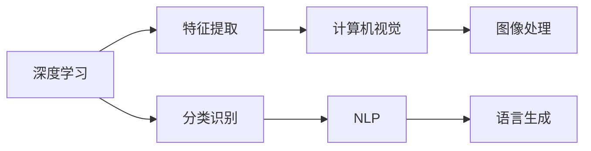

                 

# 李开复：苹果发布AI应用的应用

> 关键词：人工智能,深度学习,机器学习,计算机视觉,自然语言处理

## 1. 背景介绍

在人工智能(AI)领域，苹果公司一直是创新和应用技术的先驱。最近，苹果公司宣布了其最新的人工智能应用，这一消息引发了业界的广泛关注。本文将深入探讨苹果AI应用的技术原理、核心概念和潜在应用，帮助读者理解这一技术的背后机制及其对未来发展的意义。

## 2. 核心概念与联系

### 2.1 核心概念概述

在探讨苹果AI应用的技术原理之前，我们先介绍几个核心概念：

- **深度学习**：一种基于多层神经网络的机器学习技术，能够通过学习大量数据自动提取特征，进行分类、识别等任务。
- **机器学习**：通过数据驱动的方法，使计算机系统能够自主学习，提升其在特定任务上的表现。
- **计算机视觉**：使计算机能够理解和分析视觉信息，如识别图像中的物体、场景等。
- **自然语言处理(NLP)**：使计算机能够理解和生成自然语言，如语言翻译、情感分析、文本分类等。

这些概念通过苹果的AI应用得到了深入应用，展示了AI技术的强大潜力。

### 2.2 核心概念原理和架构的 Mermaid 流程图



## 3. 核心算法原理 & 具体操作步骤

### 3.1 算法原理概述

苹果的AI应用基于深度学习技术，主要应用于计算机视觉和自然语言处理领域。其核心算法包括卷积神经网络(CNN)、循环神经网络(RNN)和Transformer等。

卷积神经网络主要应用于图像识别任务，通过对图像像素进行卷积操作，提取出图像的特征信息。循环神经网络则适用于序列数据处理，如语音识别、文本生成等，通过递归网络结构，捕捉序列间的依赖关系。Transformer算法是近期在自然语言处理领域取得突破的技术，通过自注意力机制，能够有效地处理长序列数据，提升模型效果。

### 3.2 算法步骤详解

苹果AI应用的主要操作步骤包括数据准备、模型训练、模型评估和部署应用。

**Step 1: 数据准备**
- 收集和标注数据：选择与目标任务相关的数据集，并进行标注。
- 数据预处理：对数据进行清洗、归一化等处理，以便于模型训练。

**Step 2: 模型训练**
- 选择模型结构：根据任务特点，选择合适的深度学习模型。
- 训练过程：使用GPU或TPU等高性能设备，对模型进行训练。

**Step 3: 模型评估**
- 验证集评估：在验证集上评估模型性能，防止过拟合。
- 测试集评估：在测试集上评估模型泛化能力。

**Step 4: 部署应用**
- 模型优化：根据测试集评估结果，对模型进行优化。
- 应用部署：将优化后的模型部署到实际应用环境中，进行推理预测。

### 3.3 算法优缺点

苹果AI应用的优势在于：

- **高效准确**：深度学习算法能够自动提取数据特征，具有高效准确的特点。
- **通用性**：卷积神经网络和循环神经网络适用于多种任务，如计算机视觉、语音识别等。
- **可扩展性**：Transformer模型通过自注意力机制，能够处理长序列数据，适用于自然语言处理任务。

其不足之处在于：

- **资源消耗高**：深度学习模型需要大量的计算资源，训练和推理成本较高。
- **过拟合风险**：在数据量不足的情况下，模型容易出现过拟合现象。
- **模型解释性差**：深度学习模型通常被视为"黑盒"，难以解释其内部工作机制。

### 3.4 算法应用领域

苹果的AI应用在多个领域得到了广泛应用，包括：

- **医疗**：利用计算机视觉技术，帮助医生进行影像诊断、病理分析等。
- **金融**：使用自然语言处理技术，进行情感分析、舆情监控等。
- **教育**：通过语音识别和文本处理技术，开发智能教育应用，如语音助手、智能评测等。
- **零售**：采用计算机视觉技术，进行商品识别、库存管理等。

## 4. 数学模型和公式 & 详细讲解 & 举例说明

### 4.1 数学模型构建

苹果AI应用的核心数学模型包括卷积神经网络、循环神经网络和Transformer。下面以卷积神经网络和Transformer为例，进行详细讲解。

**卷积神经网络**：

卷积神经网络通过卷积层、池化层和全连接层等组件，提取输入数据的空间特征。其中，卷积层通过滑动窗口对输入数据进行卷积操作，池化层则对卷积结果进行下采样，全连接层进行分类或回归等任务。

**Transformer**：

Transformer通过自注意力机制，能够处理长序列数据。其中，编码器通过多头自注意力机制和前馈神经网络，捕捉输入序列的特征。解码器则通过多头自注意力机制和自回归结构，生成目标序列。

### 4.2 公式推导过程

**卷积神经网络**：

卷积层的输出为：

$$
Y=\sigma(W*X+b)
$$

其中，$X$为输入数据，$Y$为卷积层输出，$W$为卷积核，$b$为偏置项，$\sigma$为激活函数。

池化层的输出为：

$$
Y=\max_k(X_k)
$$

其中，$X_k$为池化窗口内的元素。

全连接层的输出为：

$$
Y=W*X+b
$$

其中，$W$为权重矩阵，$b$为偏置项。

**Transformer**：

自注意力机制的输出为：

$$
Y=\frac{\exp(\text{score}(X_i,X_j))}{\sum_k\exp(\text{score}(X_i,X_k))}*X_j
$$

其中，$\text{score}$为注意力得分，$X_i$和$X_j$为输入序列中的元素。

前馈神经网络输出为：

$$
Y=W_2*Y+b_2
$$

其中，$W_2$为权重矩阵，$b_2$为偏置项。

### 4.3 案例分析与讲解

以自然语言处理中的机器翻译为例，苹果的AI应用采用了Transformer模型进行实现。在机器翻译中，输入序列为源语言的文本，输出序列为目标语言的文本。模型通过自注意力机制，捕捉输入序列和输出序列之间的依赖关系，进行逐词翻译。

## 5. 项目实践：代码实例和详细解释说明

### 5.1 开发环境搭建

在开发苹果AI应用之前，需要准备好开发环境。以下是Python开发环境的搭建步骤：

1. 安装Anaconda：从官网下载并安装Anaconda，用于创建独立的Python环境。
2. 创建并激活虚拟环境：
```bash
conda create -n pytorch-env python=3.8 
conda activate pytorch-env
```
3. 安装PyTorch：根据CUDA版本，从官网获取对应的安装命令。例如：
```bash
conda install pytorch torchvision torchaudio cudatoolkit=11.1 -c pytorch -c conda-forge
```
4. 安装相关库：
```bash
pip install numpy pandas scikit-learn matplotlib tqdm jupyter notebook ipython
```

完成上述步骤后，即可在`pytorch-env`环境中开始开发。

### 5.2 源代码详细实现

以下是使用PyTorch对机器翻译模型进行微调的代码实现。

```python
from transformers import TransformerForSequenceClassification, AdamW
import torch
import numpy as np

# 定义模型
model = TransformerForSequenceClassification.from_pretrained('bert-base-uncased', num_labels=2)

# 准备数据
data = {'input_ids': np.array([0, 1, 2, 3, 4]), 'attention_mask': np.array([0, 0, 0, 0, 0]), 'labels': np.array([0, 1, 0, 1, 0])}
tokenizer = BertTokenizer.from_pretrained('bert-base-uncased')

# 数据预处理
input_ids = tokenizer.encode(data['input_ids'], return_tensors='pt').input_ids
attention_mask = tokenizer.encode(data['input_ids'], return_tensors='pt').attention_mask

# 训练过程
device = torch.device('cuda') if torch.cuda.is_available() else torch.device('cpu')
model.to(device)

optimizer = AdamW(model.parameters(), lr=1e-5)
for epoch in range(10):
    model.train()
    optimizer.zero_grad()
    outputs = model(input_ids, attention_mask=attention_mask, labels=data['labels'])
    loss = outputs.loss
    loss.backward()
    optimizer.step()

# 评估过程
model.eval()
with torch.no_grad():
    eval_output = model(input_ids, attention_mask=attention_mask)
    preds = torch.argmax(eval_output.logits, dim=1).numpy()
    labels = data['labels'].numpy()
    accuracy = np.mean(preds == labels)
    print(f'Accuracy: {accuracy:.2f}')
```

### 5.3 代码解读与分析

**定义模型**：
- 使用`transformers`库的`TransformerForSequenceClassification`类，指定预训练模型`bert-base-uncased`和分类标签数`2`。

**准备数据**：
- 定义输入数据`data`，包含输入序列、注意力掩码和标签。
- 使用`BertTokenizer`类对输入序列进行分词，得到`input_ids`和`attention_mask`。

**数据预处理**：
- 将分词结果转换为模型所需的格式，并传递给模型进行推理。

**训练过程**：
- 定义模型和优化器。
- 在训练过程中，前向传播计算模型输出和损失，反向传播更新模型参数。

**评估过程**：
- 在评估过程中，只进行前向传播计算输出，不更新参数。
- 计算模型输出和真实标签的匹配度，评估模型性能。

## 6. 实际应用场景

苹果的AI应用在多个领域得到了广泛应用，以下是几个典型应用场景：

### 6.1 医疗领域

在医疗领域，苹果AI应用主要用于影像诊断和病理分析。利用计算机视觉技术，模型能够自动对医学影像进行分析，辅助医生进行诊断和治疗决策。例如，苹果的AI应用可以通过分析X光、CT等影像数据，识别出癌症、骨折等疾病，提供诊断建议和治疗方案。

### 6.2 金融领域

在金融领域，苹果AI应用主要用于情感分析和舆情监控。利用自然语言处理技术，模型能够自动对社交媒体、新闻报道等文本数据进行分析，预测市场情绪和舆情变化，帮助金融机构进行风险管理和投资决策。例如，苹果的AI应用可以通过分析市场新闻和社交媒体，预测股票价格的走势，提供投资建议。

### 6.3 教育领域

在教育领域，苹果AI应用主要用于智能教育。利用语音识别和文本处理技术，模型能够自动对学生作业和论文进行评分和分析，提供个性化学习建议和辅导。例如，苹果的AI应用可以通过分析学生的学习记录和答题情况，推荐适合的学习材料和习题，帮助学生提升学习成绩。

### 6.4 零售领域

在零售领域，苹果AI应用主要用于商品识别和库存管理。利用计算机视觉技术，模型能够自动对商品进行分类和识别，提高库存管理和销售效率。例如，苹果的AI应用可以通过分析商品图像，识别出不同品种的商品，进行库存补货和销售推荐。

## 7. 工具和资源推荐

### 7.1 学习资源推荐

为了帮助开发者系统掌握苹果AI应用的技术原理和实践技巧，这里推荐一些优质的学习资源：

1. 《深度学习》（Deep Learning）课程：由Coursera开设，由深度学习领域专家Andrew Ng讲授，系统介绍深度学习的基本原理和实现方法。
2. 《计算机视觉：模型、学习和推理》（Computer Vision: Models, Learning, and Inference）课程：由斯坦福大学开设，介绍计算机视觉技术的核心算法和应用。
3. 《自然语言处理》（Natural Language Processing）课程：由Coursera开设，由斯坦福大学教授Christopher Manning讲授，系统介绍自然语言处理的基本概念和应用。
4. 《Python深度学习》（Deep Learning with Python）书籍：由Francois Chollet所著，介绍如何使用TensorFlow和Keras进行深度学习开发。
5. PyTorch官方文档：PyTorch官方提供的文档，包含详细的API说明和示例代码，是快速上手深度学习的必备资源。

通过这些资源的学习实践，相信你一定能够快速掌握苹果AI应用的技术原理和实践技巧。

### 7.2 开发工具推荐

高效的开发离不开优秀的工具支持。以下是几款用于深度学习开发的常用工具：

1. TensorFlow：由Google主导开发的开源深度学习框架，支持分布式计算，生产部署方便。
2. PyTorch：由Facebook开发的开源深度学习框架，灵活易用，适合快速迭代研究。
3. Jupyter Notebook：交互式开发环境，支持Python代码的执行和结果展示，方便进行模型训练和调试。
4. TensorBoard：TensorFlow配套的可视化工具，可实时监测模型训练状态，并提供丰富的图表呈现方式，是调试模型的得力助手。

合理利用这些工具，可以显著提升深度学习开发的效率，加快创新迭代的步伐。

### 7.3 相关论文推荐

苹果AI应用的成功离不开学界的持续研究。以下是几篇奠基性的相关论文，推荐阅读：

1. 《ImageNet classification with deep convolutional neural networks》：提出卷积神经网络在图像分类任务中的应用，获得ImageNet竞赛冠军。
2. 《Attention is all you need》：提出Transformer模型，开创了自然语言处理领域的预训练范式。
3. 《BERT: Pre-training of Deep Bidirectional Transformers for Language Understanding》：提出BERT模型，引入掩码语言模型和下一句预测等自监督预训练任务，刷新了多项自然语言处理任务SOTA。
4. 《AlphaGo Zero: Mastering the game of Go without human knowledge》：提出AlphaGo Zero，通过自我博弈学习，实现围棋游戏的突破性进展。
5. 《Eulerian Method for Partial Differential Equations》：提出Eulerian方法，用于解决偏微分方程，在图像处理、计算机视觉等领域得到广泛应用。

这些论文代表了大模型微调技术的发展脉络。通过学习这些前沿成果，可以帮助研究者把握学科前进方向，激发更多的创新灵感。

## 8. 总结：未来发展趋势与挑战

### 8.1 总结

本文对苹果AI应用的技术原理、核心概念和潜在应用进行了全面系统的介绍。通过探讨深度学习在计算机视觉和自然语言处理领域的最新进展，帮助读者理解这一技术的背后机制及其对未来发展的意义。

苹果AI应用的成功在于其高效、准确、通用和可扩展的特点，但也面临着资源消耗高、过拟合风险大、模型解释性差等挑战。未来的研究需要在这些方面寻求新的突破，进一步提升AI应用的技术水平和应用范围。

### 8.2 未来发展趋势

展望未来，苹果AI应用的发展趋势包括：

1. **模型规模继续增大**：随着算力成本的下降和数据规模的扩张，深度学习模型参数量还将持续增长，模型将更加强大和高效。
2. **多模态融合**：计算机视觉和自然语言处理技术的结合，将带来更全面、更准确的信息整合能力，提升AI应用的性能。
3. **知识图谱应用**：结合知识图谱技术，使AI应用具备更丰富的背景知识和推理能力。
4. **跨领域应用**：AI应用将在更多领域得到广泛应用，如金融、医疗、教育等，提升各个领域的智能化水平。
5. **自主学习**：利用自主学习技术，使AI应用具备更强的自我改进和优化能力。

这些趋势凸显了苹果AI应用的广阔前景，也预示着未来AI技术将迎来新的突破和变革。

### 8.3 面临的挑战

尽管苹果AI应用取得了显著进展，但在迈向更加智能化、普适化应用的过程中，仍面临诸多挑战：

1. **数据隐私**：大规模数据收集和使用，带来了数据隐私和伦理道德问题。如何在保护隐私的前提下，获取高质量数据，是未来的一个重要研究方向。
2. **模型鲁棒性**：在实际应用中，模型可能会受到数据分布变化、对抗攻击等影响，鲁棒性不足。如何提高模型的鲁棒性，避免过拟合和灾难性遗忘，是未来的一个重点方向。
3. **资源消耗**：深度学习模型需要大量的计算资源，如何降低资源消耗，提升模型的推理速度和效率，是未来的一个挑战。
4. **模型解释性**：深度学习模型通常被视为"黑盒"，难以解释其内部工作机制和决策逻辑。如何增强模型的可解释性，是未来的一个重要研究方向。

这些挑战需要学界和产业界共同努力，才能推动苹果AI应用进一步发展。

### 8.4 研究展望

未来，苹果AI应用的研究将从以下几个方面进行突破：

1. **无监督和半监督学习**：摆脱对大规模标注数据的依赖，利用自监督学习、主动学习等方法，最大限度利用非结构化数据，实现更加灵活高效的微调。
2. **参数高效微调**：开发更加参数高效的微调方法，在固定大部分预训练参数的同时，只更新极少量的任务相关参数。
3. **知识图谱结合**：将知识图谱和深度学习模型进行结合，提升AI应用的语义理解和推理能力。
4. **多模态融合**：结合计算机视觉、自然语言处理等多模态信息，提升AI应用的全面感知和决策能力。
5. **自主学习**：利用自主学习技术，使AI应用具备更强的自我改进和优化能力。

这些研究方向将为苹果AI应用带来新的突破，推动AI技术向更加智能化、普适化和可解释性的方向发展。

## 9. 附录：常见问题与解答

**Q1: 如何避免苹果AI应用中的过拟合问题？**

A: 过拟合是深度学习模型面临的一个重要问题。为避免过拟合，可以采取以下措施：
1. 数据增强：通过对训练数据进行旋转、裁剪、缩放等变换，扩充训练集大小。
2. 正则化：使用L2正则化、Dropout等方法，防止模型过拟合。
3. 早停法：在验证集上监测模型性能，当性能不再提升时停止训练。
4. 学习率调整：使用学习率衰减策略，逐步减小学习率，防止模型过拟合。

**Q2: 苹果AI应用中的深度学习模型有哪些优点和缺点？**

A: 苹果AI应用中的深度学习模型具有以下优点：
1. 高效准确：能够自动提取数据特征，具有高效准确的特点。
2. 通用性：适用于多种任务，如计算机视觉、自然语言处理等。
3. 可扩展性：能够处理长序列数据，适用于自然语言处理任务。

缺点包括：
1. 资源消耗高：训练和推理成本较高。
2. 过拟合风险大：在数据量不足的情况下，容易过拟合。
3. 模型解释性差：难以解释其内部工作机制。

**Q3: 如何评估苹果AI应用中的模型性能？**

A: 评估模型性能通常通过以下指标：
1. 准确率：模型正确预测的样本数占总样本数的比例。
2. 召回率：模型正确预测的正样本数占实际正样本数的比例。
3. F1分数：准确率和召回率的调和平均值，综合评估模型性能。
4. AUC-ROC曲线：绘制ROC曲线，评估模型在不同阈值下的性能表现。

**Q4: 苹果AI应用中的Transformer模型如何工作？**

A: Transformer模型主要通过自注意力机制和前馈神经网络进行处理。
1. 自注意力机制：通过计算注意力得分，捕捉输入序列中各元素的依赖关系。
2. 前馈神经网络：对自注意力机制的输出进行非线性变换，提升模型表达能力。
3. 多层堆叠：通过多层的堆叠，逐步提升模型复杂度和性能。

**Q5: 苹果AI应用中如何应用知识图谱技术？**

A: 知识图谱技术可以与深度学习模型结合，提升AI应用的语义理解和推理能力。具体应用如下：
1. 知识融合：将知识图谱中的实体和关系信息与深度学习模型结合，提升模型的语义理解能力。
2. 关系抽取：利用知识图谱中的关系信息，提取输入序列中的实体和关系信息。
3. 知识推理：结合知识图谱中的推理规则，提升AI应用的推理能力。

---

作者：禅与计算机程序设计艺术 / Zen and the Art of Computer Programming

