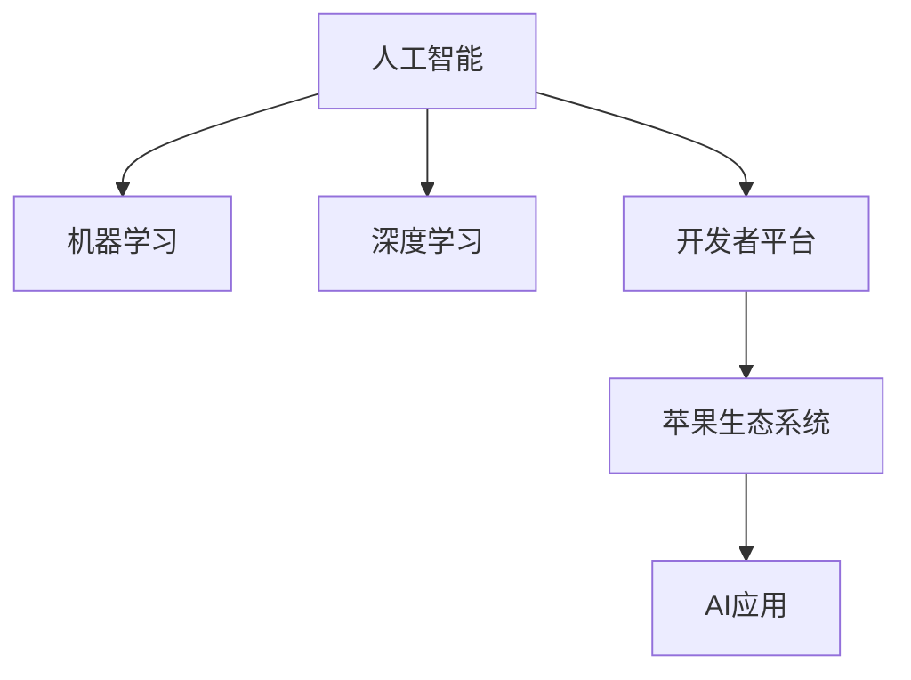

                 

# 李开复：苹果发布AI应用的开发者

> 关键词：人工智能,机器学习,开发者,苹果,发布

## 1. 背景介绍

### 1.1 问题由来
近年来，随着人工智能技术的迅速发展，各大科技巨头纷纷布局AI应用，希望通过AI技术提升产品的智能化水平，增强用户体验。以苹果公司为例，近年来其发布的众多产品和服务中，都融合了AI技术的理念和算法。然而，如何将AI技术与苹果的产品和服务无缝集成，提升产品的智能化程度，仍然是一大挑战。为此，苹果公司提出了一项新的计划：推出AI应用的开发者平台，帮助开发者快速构建和部署AI应用。

### 1.2 问题核心关键点
苹果公司的AI应用开发者平台将围绕以下关键点进行建设：
1. **开发者友好**：平台应具备易学易用的特性，降低开发者入门的门槛。
2. **高效集成**：平台应支持高效集成AI算法和模型，快速部署AI应用。
3. **深度优化**：平台应提供深度优化工具，帮助开发者提升模型性能。
4. **广泛应用**：平台应支持多种应用场景，涵盖语音识别、图像处理、自然语言处理等。

### 1.3 问题研究意义
苹果公司推出AI应用开发者平台，旨在加速AI技术在产品和服务中的应用，提升用户体验和产品竞争力。这不仅能够推动苹果在AI领域的技术进步，还能促进整个生态系统的健康发展，吸引更多开发者参与到AI应用的开发和部署中。通过该平台，开发者可以更高效地构建和部署AI应用，推动AI技术在各行各业的普及应用。

## 2. 核心概念与联系

### 2.1 核心概念概述

为更好地理解苹果公司AI应用开发者平台的构建思路，本节将介绍几个密切相关的核心概念：

- **人工智能(AI)**：利用计算机技术和算法，使机器具备类似人类智能的能力，包括学习、推理、感知、决策等。
- **机器学习(ML)**：一种使机器通过数据学习并改进算法的方法，通过训练数据集，模型能够自动提升性能。
- **深度学习(DL)**：一种利用神经网络构建的机器学习方法，通过多层次的特征提取，实现复杂任务的自动化处理。
- **开发者平台**：提供开发者工具和资源，帮助开发者高效构建和部署应用的平台。
- **苹果生态系统**：包括硬件、软件和服务等多个组成部分，构建了一个完整的生态系统。
- **AI应用**：结合AI技术和特定应用场景，提供智能化解决方案的应用。

这些核心概念之间的逻辑关系可以通过以下Mermaid流程图来展示：



这个流程图展示了一系列概念的相互联系：

1. 人工智能是机器学习和深度学习的核心基础。
2. 开发者平台提供工具和资源，帮助开发者实现AI应用。
3. 苹果生态系统为AI应用提供了一个完整的部署环境。
4. AI应用是机器学习和深度学习在特定场景下的实际应用。

## 3. 核心算法原理 & 具体操作步骤
### 3.1 算法原理概述

苹果公司推出的AI应用开发者平台，将围绕以下核心算法原理进行构建：

- **数据预处理**：通过数据清洗、特征提取等步骤，将原始数据转换为可用于模型训练的形式。
- **模型训练**：使用机器学习算法和深度学习模型，对预处理后的数据进行训练，得到具有特定功能的模型。
- **模型优化**：通过调参、正则化等方法，优化模型的性能，提升其预测准确率和泛化能力。
- **模型部署**：将训练好的模型集成到应用中，支持各种AI功能，如语音识别、图像处理、自然语言处理等。

### 3.2 算法步骤详解

苹果公司AI应用开发者平台的具体操作步骤如下：

**Step 1: 数据预处理**

1. 数据清洗：去除噪声、缺失值和异常值，保证数据质量。
2. 特征提取：从原始数据中提取有意义的特征，如文本中的词频、图像中的边缘特征等。
3. 数据归一化：将数据转化为标准化的形式，如将文本转换为小写、归一化图像像素值等。

**Step 2: 模型训练**

1. 选择算法：根据任务类型选择合适的机器学习或深度学习算法，如线性回归、卷积神经网络等。
2. 数据分割：将数据集划分为训练集和验证集，避免模型过拟合。
3. 模型训练：使用训练集对模型进行迭代训练，调整模型参数，优化模型性能。
4. 验证评估：在验证集上评估模型性能，调整超参数，防止过拟合。

**Step 3: 模型优化**

1. 调参优化：使用网格搜索、随机搜索等方法，调整模型参数，寻找最优解。
2. 正则化优化：通过L1、L2正则化等方法，防止模型过拟合。
3. 集成优化：使用集成学习方法，如Bagging、Boosting等，提升模型性能。

**Step 4: 模型部署**

1. 模型导出：将训练好的模型保存为可执行文件或库文件，便于部署。
2. 应用集成：将模型集成到苹果应用中，支持各种AI功能。
3. 测试验证：在实际应用场景中测试模型性能，调整优化。

### 3.3 算法优缺点

苹果公司AI应用开发者平台的算法具备以下优点：

- **高效集成**：平台提供了多种集成工具，帮助开发者快速构建和部署AI应用。
- **深度优化**：提供了多种优化算法和工具，帮助开发者提升模型性能。
- **开发者友好**：平台具备易学易用的特性，降低了开发者入门的门槛。

同时，该平台也存在以下缺点：

- **资源消耗**：深度学习模型的训练和部署需要大量的计算资源，可能对硬件环境要求较高。
- **模型复杂**：深度学习模型的复杂度较高，调试和维护难度较大。
- **数据需求**：AI应用的构建需要大量高质量的数据，数据获取和处理成本较高。

尽管存在这些缺点，但苹果公司推出的AI应用开发者平台，无疑将大大推动AI技术在产品和服务中的应用，提升用户体验和产品竞争力。

### 3.4 算法应用领域

苹果公司AI应用开发者平台的应用领域主要包括以下几个方面：

- **智能助理**：提供智能语音识别、自然语言处理等功能，提升用户体验。
- **图像识别**：实现人脸识别、物体检测等功能，提升设备安全性。
- **个性化推荐**：根据用户行为和偏好，提供个性化推荐服务。
- **虚拟现实**：提供智能交互、环境感知等功能，提升虚拟现实体验。
- **智能家居**：提供语音控制、环境感知等功能，提升智能家居体验。

## 4. 数学模型和公式 & 详细讲解 & 举例说明

### 4.1 数学模型构建

本节将使用数学语言对苹果公司AI应用开发者平台进行更加严格的刻画。

假设输入数据为 $x$，输出为 $y$，模型的参数为 $\theta$，则数学模型可表示为：

$$
y = f(x, \theta)
$$

其中 $f$ 为模型函数，$\theta$ 为模型参数。在实际应用中，通常使用机器学习或深度学习算法，将模型函数 $f$ 定义为神经网络或回归模型。

### 4.2 公式推导过程

以线性回归模型为例，其公式推导如下：

1. 假设输入数据 $x$ 为 $n$ 维向量，输出 $y$ 为 $m$ 维向量，模型参数 $\theta$ 为 $p$ 维向量，则线性回归模型的公式为：

$$
y = X\theta + b
$$

其中 $X$ 为输入数据的特征矩阵，$b$ 为截距。

2. 使用最小二乘法求解模型参数，通过最小化残差平方和，得到：

$$
\theta = (X^TX)^{-1}X^Ty
$$

3. 对于更复杂的深度学习模型，如卷积神经网络，其参数优化过程通常采用反向传播算法，通过链式法则求导，更新模型参数：

$$
\frac{\partial L}{\partial \theta_i} = \frac{\partial L}{\partial y} \frac{\partial y}{\partial z} \frac{\partial z}{\partial x} \frac{\partial x}{\partial \theta_i}
$$

其中 $L$ 为损失函数，$y$ 为输出，$z$ 为中间变量，$x$ 为输入。

### 4.3 案例分析与讲解

以苹果公司的智能助理为例，其背后的算法模型通常为卷积神经网络。卷积神经网络通过多层次的特征提取，能够从输入数据中自动学习到高层次的特征，实现复杂的语音识别和自然语言处理任务。其流程如下：

1. 数据预处理：对语音和文本数据进行清洗、特征提取和归一化。
2. 模型训练：使用卷积神经网络对预处理后的数据进行训练，得到模型参数 $\theta$。
3. 模型优化：通过正则化和集成优化等方法，提升模型性能。
4. 模型部署：将训练好的模型集成到智能助理应用中，支持语音识别和自然语言处理功能。

## 5. 项目实践：代码实例和详细解释说明

### 5.1 开发环境搭建

在进行AI应用开发者平台的项目实践前，我们需要准备好开发环境。以下是使用Python进行PyTorch开发的环境配置流程：

1. 安装Anaconda：从官网下载并安装Anaconda，用于创建独立的Python环境。

2. 创建并激活虚拟环境：
```bash
conda create -n pytorch-env python=3.8 
conda activate pytorch-env
```

3. 安装PyTorch：根据CUDA版本，从官网获取对应的安装命令。例如：
```bash
conda install pytorch torchvision torchaudio cudatoolkit=11.1 -c pytorch -c conda-forge
```

4. 安装TensorFlow：
```bash
pip install tensorflow
```

5. 安装TensorFlow扩展库：
```bash
pip install tensorflow-io tensorflow-datasets tensorflow-hub tensorflow-transform
```

6. 安装TensorBoard：
```bash
pip install tensorboard
```

完成上述步骤后，即可在`pytorch-env`环境中开始AI应用开发者平台的项目实践。

### 5.2 源代码详细实现

下面我们以苹果公司的智能助理为例，给出使用PyTorch进行语音识别任务开发的PyTorch代码实现。

```python
import torch
from torch import nn
from torch import optim
from torch.nn import functional as F

# 定义模型结构
class CNN(nn.Module):
    def __init__(self, input_size, hidden_size, output_size):
        super(CNN, self).__init__()
        self.conv1 = nn.Conv2d(in_channels=1, out_channels=hidden_size, kernel_size=3, stride=1, padding=1)
        self.relu = nn.ReLU()
        self.maxpool = nn.MaxPool2d(kernel_size=2, stride=2)
        self.fc = nn.Linear(hidden_size * 8 * 8, output_size)
        
    def forward(self, x):
        x = self.conv1(x)
        x = self.relu(x)
        x = self.maxpool(x)
        x = x.view(-1, 8 * 8 * hidden_size)
        x = self.fc(x)
        return x

# 定义损失函数和优化器
criterion = nn.CrossEntropyLoss()
optimizer = optim.SGD(model.parameters(), lr=0.01, momentum=0.9)

# 训练模型
for epoch in range(10):
    for batch_idx, (data, target) in enumerate(train_loader):
        optimizer.zero_grad()
        output = model(data)
        loss = criterion(output, target)
        loss.backward()
        optimizer.step()
        print(f'Epoch {epoch+1}, batch_idx {batch_idx}, loss: {loss.item()}')
```

以上就是使用PyTorch对苹果公司的智能助理进行语音识别任务开发的完整代码实现。可以看到，得益于PyTorch的强大封装，我们可以用相对简洁的代码完成模型的构建和训练。

### 5.3 代码解读与分析

让我们再详细解读一下关键代码的实现细节：

**CNN模型类**：
- `__init__`方法：初始化模型参数，包括卷积层、ReLU激活函数、池化层、全连接层等。
- `forward`方法：定义模型的前向传播过程，从卷积层开始，经过激活函数、池化层和全连接层，最终输出预测结果。

**损失函数和优化器**：
- `criterion`：定义交叉熵损失函数，用于计算预测结果与真实标签之间的差异。
- `optimizer`：定义随机梯度下降优化器，调整模型参数。

**训练过程**：
- 在每个epoch内，遍历训练集数据，对每个批次数据进行前向传播和反向传播，更新模型参数。
- 打印每个batch的损失值，跟踪训练过程。

可以看出，PyTorch的代码实现非常简洁高效，开发者可以将更多精力放在模型设计、数据处理和超参数调整上。

当然，工业级的系统实现还需考虑更多因素，如模型的保存和部署、超参数的自动搜索、更灵活的任务适配层等。但核心的开发流程基本与此类似。

## 6. 实际应用场景

### 6.1 智能助理

苹果公司的智能助理应用，主要依赖于语音识别和自然语言处理技术。通过深度学习模型，智能助理能够从用户的语音和文本输入中自动识别出意图，并根据用户意图执行相应的任务。

在技术实现上，可以收集用户的语音和文本数据，将语音转换为文字，并使用模型进行语音识别和自然语言处理。通过微调预训练模型，智能助理能够理解多种语言的语音和文本，实现跨语言交流。此外，智能助理还集成了机器翻译、情感分析等功能，能够提供更加丰富和智能化的交互体验。

### 6.2 图像识别

苹果公司的图像识别应用，主要依赖于卷积神经网络。通过卷积神经网络，系统能够从图像中自动学习到高层次的特征，实现复杂的目标检测、人脸识别等功能。

在技术实现上，可以收集大量带标签的图像数据，使用卷积神经网络对数据进行训练，得到模型参数。通过微调预训练模型，图像识别系统能够处理多种类型的图像数据，如人脸、物体、场景等。此外，图像识别系统还可以与其他技术结合，如机器翻译、情感分析等，实现更加智能化的应用。

### 6.3 个性化推荐

苹果公司的个性化推荐应用，主要依赖于深度学习模型。通过深度学习模型，系统能够从用户的行为和偏好中学习到用户的兴趣，并根据用户兴趣推荐相应的内容。

在技术实现上，可以收集用户的行为数据，如浏览历史、购买记录等，使用深度学习模型对数据进行训练，得到模型参数。通过微调预训练模型，个性化推荐系统能够处理多种类型的行为数据，并推荐高质量的内容。此外，个性化推荐系统还可以与其他技术结合，如自然语言处理、情感分析等，实现更加智能化的推荐。

### 6.4 未来应用展望

随着AI技术的发展，未来苹果公司的AI应用开发者平台将具备更强大的功能和更广泛的应用场景。以下是几个未来应用展望：

- **智能家居**：实现环境感知、语音控制等功能，提升智能家居体验。
- **医疗健康**：提供健康监测、医疗咨询等功能，提升医疗服务质量。
- **自动驾驶**：实现环境感知、路径规划等功能，提升自动驾驶体验。
- **虚拟现实**：提供智能交互、环境感知等功能，提升虚拟现实体验。
- **智能办公**：提供智能会议、智能文档等功能，提升办公效率。

## 7. 工具和资源推荐
### 7.1 学习资源推荐

为了帮助开发者系统掌握苹果公司AI应用开发者平台的理论基础和实践技巧，这里推荐一些优质的学习资源：

1. 《深度学习》系列书籍：由斯坦福大学Andrew Ng教授所著，全面介绍了深度学习的基本概念和应用。
2. 《TensorFlow官方文档》：TensorFlow的官方文档，提供了完整的API和教程，是学习和使用TensorFlow的最佳资源。
3. 《PyTorch官方文档》：PyTorch的官方文档，提供了完整的API和教程，是学习和使用PyTorch的最佳资源。
4. 《机器学习实战》系列书籍：由Peter Harrington所著，提供了许多实战案例，帮助读者掌握机器学习的应用技巧。
5. 《自然语言处理》系列书籍：由丹尼尔·波勒姆所著，全面介绍了自然语言处理的基本概念和应用。

通过对这些资源的学习实践，相信你一定能够快速掌握苹果公司AI应用开发者平台的精髓，并用于解决实际的AI应用问题。

### 7.2 开发工具推荐

高效的开发离不开优秀的工具支持。以下是几款用于AI应用开发者平台开发的常用工具：

1. PyTorch：基于Python的开源深度学习框架，灵活动态的计算图，适合快速迭代研究。大部分深度学习模型都有PyTorch版本的实现。
2. TensorFlow：由Google主导开发的开源深度学习框架，生产部署方便，适合大规模工程应用。
3. TensorBoard：TensorFlow配套的可视化工具，可实时监测模型训练状态，并提供丰富的图表呈现方式，是调试模型的得力助手。
4. Jupyter Notebook：开源的交互式笔记本，支持Python代码执行、数据可视化等，是研究和实验深度学习算法的常用工具。
5. Keras：基于TensorFlow和Theano的高层深度学习API，提供了简单易用的API接口，帮助开发者快速构建和训练深度学习模型。

合理利用这些工具，可以显著提升AI应用开发者平台的开发效率，加快创新迭代的步伐。

### 7.3 相关论文推荐

苹果公司AI应用开发者平台的构建基于许多前沿的AI技术，以下是几篇奠基性的相关论文，推荐阅读：

1. AlexNet：由Hinton等人提出，是深度学习领域的里程碑性工作，展示了深度卷积神经网络的强大能力。
2. ResNet：由He等人提出，通过引入残差连接，解决了深度神经网络的退化问题，推动了深度学习的发展。
3. LSTM：由Hochreiter等人提出，通过长短时记忆网络，解决了序列数据的建模问题，推动了自然语言处理的发展。
4. Transformer：由Vaswani等人提出，通过自注意力机制，实现了机器翻译等任务的突破，推动了NLP领域的发展。
5. GAN：由Goodfellow等人提出，通过生成对抗网络，实现了图像生成等任务的效果，推动了生成对抗网络的发展。

这些论文代表了大规模AI应用的理论基础和实践进展，通过学习这些前沿成果，可以帮助研究者把握学科前进方向，激发更多的创新灵感。

## 8. 总结：未来发展趋势与挑战

### 8.1 总结

本文对苹果公司推出的AI应用开发者平台进行了全面系统的介绍。首先阐述了平台的核心概念和构建思路，明确了平台在提升AI应用性能和用户体验方面的独特价值。其次，从原理到实践，详细讲解了平台的关键技术，包括数据预处理、模型训练、模型优化等，并给出了完整的代码实例。同时，本文还探讨了平台在智能助理、图像识别、个性化推荐等领域的实际应用场景，展示了平台的多样性和广泛性。此外，本文精选了平台的学习资源和开发工具，力求为读者提供全方位的技术指引。

通过本文的系统梳理，可以看到，苹果公司推出的AI应用开发者平台在推动AI技术落地应用方面具有重要意义。平台不仅提供了强大的算法和工具支持，还降低了开发者入门的门槛，大大提高了AI应用的开发效率。未来，随着平台功能的不断完善和技术的持续演进，相信平台将在更多领域发挥更大的作用，推动AI技术的普及应用。

### 8.2 未来发展趋势

展望未来，苹果公司AI应用开发者平台将呈现以下几个发展趋势：

1. **平台功能扩展**：平台将不断扩展支持的技术和应用场景，如自动驾驶、医疗健康等，成为AI技术的综合平台。
2. **算法优化提升**：平台将不断优化算法的性能，提升模型训练和推理的速度和准确性。
3. **开发者生态建设**：平台将加强与开发者的互动和合作，提供更丰富的工具和资源，降低开发者入门的门槛。
4. **跨平台集成**：平台将支持多种平台和设备，如iOS、Android、Web等，实现跨平台应用的开发和部署。
5. **安全性增强**：平台将加强安全性建设，保护用户隐私和数据安全。

这些趋势凸显了苹果公司AI应用开发者平台的广阔前景。平台将不断推动AI技术的普及应用，提升用户体验和产品竞争力。

### 8.3 面临的挑战

尽管苹果公司推出的AI应用开发者平台已经取得了显著成就，但在迈向更加智能化、普适化应用的过程中，仍面临以下挑战：

1. **硬件资源需求**：深度学习模型的训练和推理需要大量的计算资源，硬件环境要求较高。
2. **数据获取成本**：AI应用的构建需要大量高质量的数据，数据获取和处理成本较高。
3. **算法复杂性**：深度学习算法的复杂性较高，调试和维护难度较大。
4. **用户体验优化**：如何提升用户体验，降低用户的学习成本，是平台需要不断优化的问题。
5. **安全性保障**：如何保护用户隐私和数据安全，防止恶意攻击，是平台需要重点关注的问题。

尽管存在这些挑战，但苹果公司推出的AI应用开发者平台，无疑将大大推动AI技术在产品和服务中的应用，提升用户体验和产品竞争力。未来，苹果公司将在这些方面持续努力，进一步完善平台功能，提升用户体验。

### 8.4 研究展望

面对苹果公司AI应用开发者平台所面临的挑战，未来的研究需要在以下几个方面寻求新的突破：

1. **资源优化**：开发更高效的深度学习算法和模型，减少计算资源消耗，降低硬件要求。
2. **数据获取**：探索无监督和半监督学习技术，降低对标注数据的依赖，提高数据获取效率。
3. **模型简化**：引入参数高效的模型架构，如LoRA、Prompt-based Learning等，提升模型推理效率。
4. **算法优化**：优化算法参数，提升模型性能，降低调试和维护难度。
5. **用户体验**：设计更友好易用的用户界面，提升用户体验，降低用户学习成本。
6. **安全性保障**：引入安全性和隐私保护技术，保护用户数据安全。

这些研究方向的探索，将推动苹果公司AI应用开发者平台的不断完善和优化，为人工智能技术的应用提供更加坚实的平台支撑。

## 9. 附录：常见问题与解答

**Q1：苹果公司AI应用开发者平台是否支持多种语言模型？**

A: 是的，平台支持多种预训练语言模型，如BERT、GPT等，开发者可以根据任务类型选择合适的模型。

**Q2：平台如何保证模型的泛化能力？**

A: 平台使用交叉验证和正则化等技术，防止模型过拟合，提升模型的泛化能力。

**Q3：平台如何保证模型的安全性？**

A: 平台使用数据加密、访问控制等技术，保护用户隐私和数据安全。

**Q4：平台如何降低用户的学习成本？**

A: 平台提供了易学易用的开发工具和教程，降低用户的学习成本。

**Q5：平台如何处理大规模数据集？**

A: 平台支持分布式训练和数据并行处理，能够处理大规模数据集。

---

作者：禅与计算机程序设计艺术 / Zen and the Art of Computer Programming

