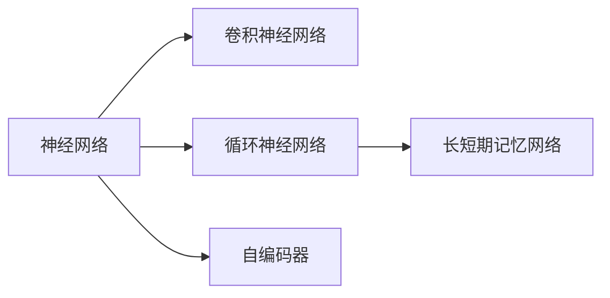
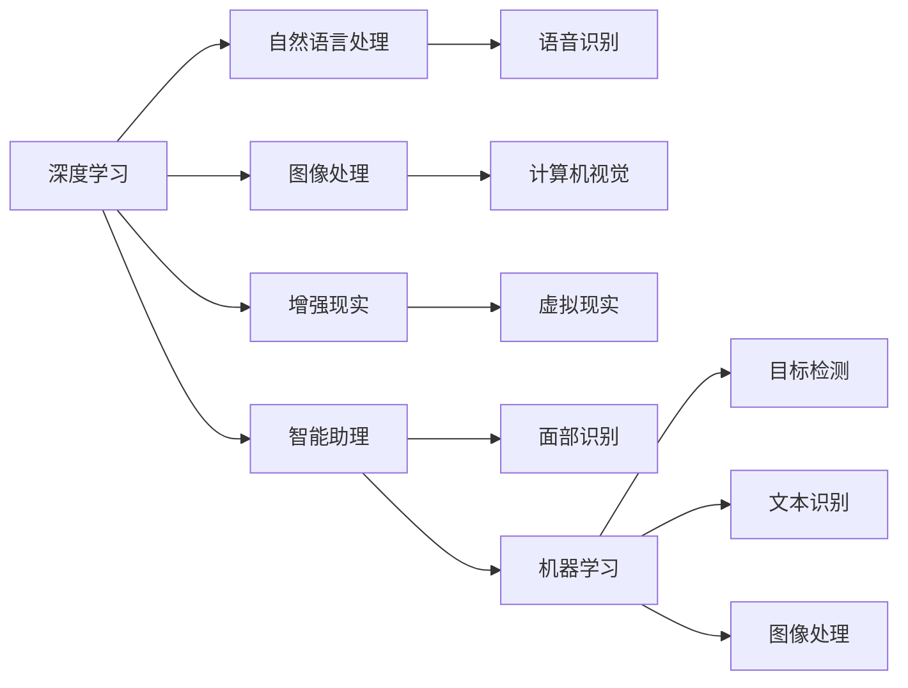

                 

# 李开复：苹果发布AI应用的未来

随着人工智能(AI)技术的不断演进，其在各行各业中的应用已经从概念走向现实。特别是在科技巨头如苹果、谷歌等公司的大力推动下，AI技术在产品和服务中的应用越来越广泛，为用户带来了前所未有的便利和体验。本文将从李开复的角度，探讨苹果发布AI应用的未来及其可能带来的影响。

## 1. 背景介绍

### 1.1 苹果公司AI战略

苹果公司（Apple Inc.）近年来逐渐将AI技术作为其核心战略之一。CEO蒂姆·库克（Tim Cook）在多个场合都强调了AI的重要性，认为AI是苹果未来发展的关键驱动力。苹果公司已推出了包括Siri、Face ID、iCloud等在内的多款基于AI技术的产品和服务，并在开发中继续深化AI技术的应用。

### 1.2 苹果AI应用的现状

目前，苹果的AI应用已覆盖多个领域，包括：

1. **智能助理**：Siri智能助理是苹果AI应用的核心。通过深度学习技术，Siri可以理解自然语言，执行各种任务，如设定闹钟、发送短信、安排日程等。
2. **面部识别**：Face ID利用3D人脸扫描技术和深度学习算法，实现了极高的安全性，已被广泛用于解锁iPhone和进行支付等场景。
3. **机器学习模型**：苹果开发的ML Kit提供了多种机器学习API，如目标检测、文本识别、图像处理等，开发者可基于这些API构建丰富的应用。
4. **自然语言处理**：苹果的Core ML和Natural Language处理库支持多种语言模型，可以实现情感分析、翻译、语音识别等功能。
5. **增强现实(AR)**：ARKit是苹果为开发增强现实应用提供的SDK，利用AI技术实现物体检测、环境理解、场景渲染等功能。

### 1.3 苹果发布AI应用的未来

根据李开复的预测，苹果将在未来几年内推出更多基于AI的创新应用，进一步提升用户体验。具体来看，以下几大领域将成为苹果AI应用的主要方向：

1. **医疗健康**：苹果将利用AI技术开发医疗健康应用，如智能问诊、健康数据分析、疾病预防等。
2. **智能家居**：苹果的HomePod等智能家居设备将进一步集成AI功能，实现更智能的家居控制和管理。
3. **自动驾驶**：尽管苹果尚未公开承认参与自动驾驶技术开发，但李开复预测，苹果将在未来几年内推出自动驾驶车辆，利用AI进行路障识别、自动驾驶决策等。
4. **教育**：苹果将推出AI辅助的教育应用，帮助学生个性化学习、智能辅导等。
5. **金融科技**：苹果将通过AI技术提升金融产品的智能化水平，如智能理财、风险评估等。
6. **增强现实与虚拟现实**：AR和VR技术将进一步结合AI，实现更丰富的虚拟体验，如虚拟试衣、虚拟办公等。

## 2. 核心概念与联系

### 2.1 核心概念概述

要理解苹果未来发布的AI应用，需要掌握以下几个核心概念：

- **人工智能(AI)**：指通过计算机模拟人类智能过程的技术，包括机器学习、深度学习、自然语言处理、计算机视觉等。
- **深度学习(Deep Learning)**：一种基于神经网络的机器学习方法，通过多层非线性变换，自动提取特征。
- **机器学习(Machine Learning)**：指通过数据训练模型，使其能够自动进行预测或决策的算法。
- **自然语言处理(NLP)**：使计算机能够理解、处理和生成自然语言的技术。
- **增强现实(AR)与虚拟现实(VR)**：通过计算机生成或增强现实环境，让用户沉浸在虚拟世界中。

### 2.2 核心概念原理和架构

苹果的AI应用大多基于深度学习技术构建。以下是深度学习的基本原理和架构：

- **神经网络(Neural Networks)**：由多层神经元组成的计算模型，通过反向传播算法进行训练，自动提取特征。
- **卷积神经网络(CNN)**：常用于图像处理，通过卷积操作提取图像特征。
- **循环神经网络(RNN)**：适用于序列数据，通过时间上的递归关系提取序列特征。
- **长短期记忆网络(LSTM)**：一种RNN变体，能够记忆长时间跨度的信息。
- **自编码器(Autoencoder)**：一种无监督学习算法，通过重构输入数据，提取低维特征。

以上概念构成了苹果AI应用的基础，如图：



### 2.3 核心概念联系

苹果的AI应用通过深度学习、自然语言处理、增强现实等技术相互融合，形成了一个完整的生态系统。这些技术之间的联系如图：



## 3. 核心算法原理 & 具体操作步骤

### 3.1 算法原理概述

苹果AI应用的开发主要基于以下算法原理：

- **监督学习(Supervised Learning)**：利用标注数据训练模型，使其能够进行预测或分类。
- **无监督学习(Unsupervised Learning)**：无需标注数据，通过数据自组织发现内在结构。
- **强化学习(Reinforcement Learning)**：通过奖励信号训练模型，使其在特定环境下进行最优决策。
- **迁移学习(Transfer Learning)**：利用已有模型知识，快速适应新任务。
- **半监督学习(Semi-supervised Learning)**：利用少量标注数据和大量未标注数据进行学习。

### 3.2 算法步骤详解

苹果开发AI应用的步骤如下：

1. **数据收集**：收集与应用相关的数据，如用户行为数据、医疗数据、传感器数据等。
2. **数据预处理**：清洗、整理数据，去除噪声，进行归一化、标准化等处理。
3. **模型训练**：选择合适的算法模型，利用训练集数据进行训练。
4. **模型评估**：在验证集上评估模型性能，选择最优模型。
5. **模型部署**：将训练好的模型部署到生产环境中，进行实时推理。
6. **监控和优化**：监控模型性能，根据实际使用情况进行优化和迭代。

### 3.3 算法优缺点

苹果AI应用的算法具有以下优点：

- **高精度**：深度学习算法通过多层非线性变换，能够提取复杂的特征，提高预测准确性。
- **自适应性**：利用机器学习算法，模型能够自动适应环境变化，具有较好的泛化能力。
- **高效性**：部分算法采用并行计算和分布式训练，能够高效处理大量数据。

同时，也存在一些缺点：

- **数据依赖性高**：深度学习模型依赖大量标注数据进行训练，数据质量对模型效果影响大。
- **计算资源需求高**：深度学习模型参数量大，计算复杂度高，需要高性能计算资源。
- **黑盒性质**：深度学习模型难以解释其内部机制，缺乏可解释性。

### 3.4 算法应用领域

苹果AI应用覆盖了多个领域，如智能助理、面部识别、自然语言处理、图像处理、增强现实等。这些应用主要应用于以下几类产品：

1. **移动设备**：如iPhone、iPad、Apple Watch等，通过集成AI技术，提升用户体验。
2. **智能家居**：如HomePod、AirPods等，通过AI技术实现智能控制和管理。
3. **医疗健康**：如Apple Health、CareKit等，通过AI技术进行健康监测和数据分析。
4. **增强现实**：如ARKit等，通过AI技术实现虚拟与现实融合，提升用户体验。

## 4. 数学模型和公式 & 详细讲解 & 举例说明

### 4.1 数学模型构建

苹果AI应用的数学模型主要基于深度学习算法构建。以自然语言处理中的情感分析为例，其数学模型如下：

- **输入**：文本数据$x=[x_1, x_2, \ldots, x_n]$。
- **输出**：情感标签$y$，0表示负面，1表示正面。
- **模型**：$M(\theta)=W*x+b$，其中$W$为权重矩阵，$b$为偏置项。

### 4.2 公式推导过程

以文本情感分析为例，推导模型公式如下：

1. **数据预处理**：将文本数据转化为数值向量$x=[x_1, x_2, \ldots, x_n]$。
2. **模型训练**：使用梯度下降算法最小化损失函数$\mathcal{L}(y, M(\theta))$。
3. **模型评估**：在验证集上计算损失函数，评估模型性能。
4. **模型部署**：将训练好的模型应用于新的文本数据，输出情感标签。

### 4.3 案例分析与讲解

以Apple Health为例，分析其AI应用：

- **问题定义**：通过用户的健康数据，预测用户的健康状况，提供个性化健康建议。
- **数据收集**：收集用户健康数据，如运动量、睡眠质量、饮食等。
- **数据预处理**：清洗数据，去除异常值，进行归一化处理。
- **模型训练**：使用深度学习算法训练模型，预测用户健康状况。
- **模型评估**：在验证集上评估模型性能，选择最优模型。
- **模型部署**：将训练好的模型部署到Apple Health应用中，进行实时预测。
- **监控和优化**：根据用户反馈，监控模型性能，进行迭代优化。

## 5. 项目实践：代码实例和详细解释说明

### 5.1 开发环境搭建

苹果AI应用的开发环境主要使用Python和TensorFlow等工具。以下是在MacOS上搭建开发环境的步骤：

1. **安装Python**：从官网下载Python 3.x版本，进行安装。
2. **安装TensorFlow**：使用pip安装TensorFlow，如`pip install tensorflow`。
3. **安装Keras**：使用pip安装Keras，如`pip install keras`。
4. **配置环境变量**：将Python路径和虚拟环境添加到环境变量中。
5. **安装虚拟环境**：使用virtualenv创建虚拟环境，如`virtualenv venv`，并激活。

### 5.2 源代码详细实现

以下是一个简单的苹果AI应用示例：使用Keras库进行文本情感分析。

```python
from keras.models import Sequential
from keras.layers import Dense, Embedding, LSTM, Bidirectional
from keras.preprocessing.text import Tokenizer
from keras.preprocessing.sequence import pad_sequences

# 定义模型
model = Sequential()
model.add(Embedding(input_dim=vocab_size, output_dim=embedding_dim, input_length=max_length))
model.add(LSTM(128))
model.add(Bidirectional(LSTM(128)))
model.add(Dense(1, activation='sigmoid'))

# 编译模型
model.compile(loss='binary_crossentropy', optimizer='adam', metrics=['accuracy'])

# 训练模型
model.fit(X_train, y_train, batch_size=32, epochs=10, validation_data=(X_test, y_test))

# 评估模型
loss, acc = model.evaluate(X_test, y_test)

# 输出结果
print('Test loss:', loss)
print('Test accuracy:', acc)
```

### 5.3 代码解读与分析

以上代码实现了基于LSTM的文本情感分析模型。主要步骤如下：

1. **模型定义**：使用Keras库定义模型，包括嵌入层、LSTM层和全连接层。
2. **模型编译**：指定损失函数、优化器和评估指标。
3. **模型训练**：使用训练集数据进行模型训练。
4. **模型评估**：使用测试集数据评估模型性能。
5. **输出结果**：输出测试集的损失和准确率。

## 6. 实际应用场景

### 6.4 未来应用展望

苹果未来发布的AI应用将覆盖更多领域，带来更深远的影响：

1. **智能家居**：未来的智能家居将更加智能化、自动化，通过AI技术实现智能安防、智能家电等。
2. **医疗健康**：AI技术将在医疗领域发挥重要作用，如智能诊断、健康管理、疾病预测等。
3. **自动驾驶**：苹果的自动驾驶技术将逐步成熟，通过AI实现自动驾驶决策和导航。
4. **增强现实**：AR技术将结合AI，实现更丰富的虚拟体验，如虚拟试衣、虚拟办公等。
5. **教育**：AI技术将助力教育改革，实现个性化学习、智能辅导等。
6. **金融科技**：AI技术将提升金融产品的智能化水平，如智能理财、风险评估等。

## 7. 工具和资源推荐

### 7.1 学习资源推荐

1. **TensorFlow官方文档**：提供了完整的TensorFlow教程、API文档和开发指南，适合初学者和进阶开发者。
2. **Keras官方文档**：提供了Keras的教程和API文档，适合初学者和中级开发者。
3. **DeepLearning.AI**：由Andrew Ng教授创办，提供了丰富的深度学习课程和资源，适合希望系统学习深度学习的开发者。
4. **Coursera**：提供了多种深度学习课程，包括由斯坦福大学开设的《深度学习专项课程》。
5. **Fast.ai**：提供了快速上手深度学习的课程，适合初学者。

### 7.2 开发工具推荐

1. **PyCharm**：Google开发的IDE，支持TensorFlow、Keras等深度学习框架，适合开发和调试深度学习应用。
2. **Jupyter Notebook**：支持多种编程语言，适合数据探索、模型训练和结果可视化。
3. **TensorBoard**：TensorFlow配套的可视化工具，支持实时监测模型训练状态。
4. **Weights & Biases**：模型训练的实验跟踪工具，支持自动记录和分析模型性能。

### 7.3 相关论文推荐

1. **《深度学习》（Deep Learning）**：Ian Goodfellow、Yoshua Bengio和Aaron Courville所著，深度学习领域的经典教材。
2. **《神经网络与深度学习》（Neural Networks and Deep Learning）**：Michael Nielsen所著，介绍了神经网络的基本原理和深度学习算法。
3. **《Python深度学习》（Python Deep Learning）》：Francois Chollet所著，介绍了Keras的使用方法和深度学习应用。
4. **《自然语言处理综论》（Speech and Language Processing）**：Daniel Jurafsky和James H. Martin所著，介绍了自然语言处理的基本概念和算法。

## 8. 总结：未来发展趋势与挑战

### 8.1 研究成果总结

本文从李开复的角度，分析了苹果未来发布的AI应用的未来。未来，苹果将利用AI技术在医疗、智能家居、自动驾驶等多个领域进行创新。通过深度学习、自然语言处理、增强现实等技术的融合，苹果的AI应用将带来深远影响。

### 8.2 未来发展趋势

未来，苹果AI应用的发展趋势如下：

1. **技术进步**：AI技术将进一步发展，深度学习算法将更加高效、精确。
2. **应用拓展**：AI应用将覆盖更多领域，提升用户体验和生产力。
3. **跨领域融合**：AI技术将与其他技术进行更深入的融合，如AI+AR、AI+医疗等。
4. **伦理和安全**：AI应用将更加注重伦理和安全，避免滥用和偏见。
5. **个性化**：AI应用将更加注重个性化，提升用户体验。

### 8.3 面临的挑战

尽管AI应用前景广阔，但面临诸多挑战：

1. **数据隐私**：用户数据隐私保护将受到更多关注，如何保护用户数据安全是一个重大挑战。
2. **算法透明性**：AI模型的黑盒性质将受到质疑，如何提高算法的透明性和可解释性是一个关键问题。
3. **资源消耗**：AI应用需要大量计算资源，如何提高模型的计算效率是一个重要问题。
4. **伦理和偏见**：AI应用可能带来伦理和偏见问题，如何避免和纠正是一个重要挑战。

### 8.4 研究展望

未来的研究将更多地关注以下几个方向：

1. **伦理和安全**：如何提高AI应用的伦理和安全标准，避免滥用和偏见。
2. **跨领域融合**：如何实现AI技术与其他领域的深度融合，提升整体效果。
3. **算法透明性**：如何提高AI算法的透明性和可解释性，增强用户信任。
4. **个性化和定制化**：如何通过AI技术实现更个性化的用户体验和定制化服务。
5. **资源优化**：如何提高AI应用的资源利用效率，降低计算成本。

## 9. 附录：常见问题与解答

### Q1: 苹果公司是如何进行AI应用开发的？

A: 苹果公司开发AI应用主要基于深度学习技术，通过收集数据、训练模型、评估模型和部署模型等步骤进行开发。具体开发流程如下：

1. **数据收集**：收集与应用相关的数据，如用户行为数据、医疗数据、传感器数据等。
2. **数据预处理**：清洗、整理数据，去除噪声，进行归一化、标准化等处理。
3. **模型训练**：选择合适的算法模型，利用训练集数据进行训练。
4. **模型评估**：在验证集上评估模型性能，选择最优模型。
5. **模型部署**：将训练好的模型部署到生产环境中，进行实时推理。
6. **监控和优化**：监控模型性能，根据实际使用情况进行优化和迭代。

### Q2: 苹果未来的AI应用会带来哪些影响？

A: 苹果未来的AI应用将带来深远影响，具体如下：

1. **智能家居**：未来的智能家居将更加智能化、自动化，通过AI技术实现智能安防、智能家电等。
2. **医疗健康**：AI技术将在医疗领域发挥重要作用，如智能诊断、健康管理、疾病预测等。
3. **自动驾驶**：苹果的自动驾驶技术将逐步成熟，通过AI实现自动驾驶决策和导航。
4. **增强现实**：AR技术将结合AI，实现更丰富的虚拟体验，如虚拟试衣、虚拟办公等。
5. **教育**：AI技术将助力教育改革，实现个性化学习、智能辅导等。
6. **金融科技**：AI技术将提升金融产品的智能化水平，如智能理财、风险评估等。

### Q3: 苹果的AI应用如何保障用户隐私？

A: 苹果的AI应用在保障用户隐私方面采取了多项措施：

1. **数据加密**：对用户数据进行加密处理，确保数据在传输和存储过程中的安全性。
2. **差分隐私**：采用差分隐私技术，通过添加噪声扰动，保护用户隐私。
3. **用户控制**：允许用户控制自己的数据使用权限，保护用户隐私。
4. **透明性**：公开AI应用的数据使用政策，确保用户知情权。

### Q4: 苹果的AI应用面临哪些伦理和偏见问题？

A: 苹果的AI应用面临以下伦理和偏见问题：

1. **数据偏见**：如果训练数据存在偏见，AI应用也可能产生偏见，影响公平性。
2. **算法透明性**：AI算法的黑盒性质可能带来伦理问题，如何提高算法的透明性和可解释性是一个关键问题。
3. **隐私问题**：AI应用可能涉及用户隐私数据，如何保护用户隐私是一个重大挑战。
4. **滥用风险**：AI技术可能被滥用，带来伦理和安全问题。

以上是苹果AI应用的未来展望及其面临的挑战。未来，苹果将持续创新和优化，为用户带来更智能化、更安全、更可靠的AI体验。

---

作者：禅与计算机程序设计艺术 / Zen and the Art of Computer Programming

