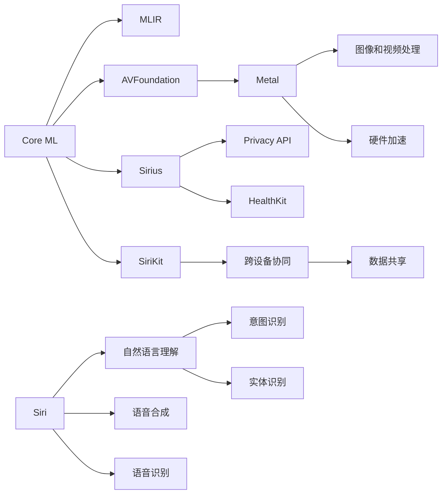

                 

## 1. 背景介绍

在人工智能(AI)的竞赛中，苹果（Apple）近年来逐渐崭露头角，不断推出具有革命性意义的AI应用，构建了独特的生态系统。苹果的应用不仅在技术上领先，而且在用户体验、隐私保护和生态系统整合方面也有独到之处。本文将从背景、核心概念、算法原理、实践案例等多个角度，深入探讨苹果AI应用的生态系统。

## 2. 核心概念与联系

### 2.1 核心概念概述

苹果的AI生态系统由一系列技术组件和应用构成，主要包括：

- **机器学习框架**：如Core ML、MLIR等，用于支持iOS和macOS上的机器学习应用开发。
- **计算机视觉框架**：如AVFoundation、Metal等，用于图像和视频处理。
- **语音识别和处理框架**：如Siri、Speech Framework等，用于自然语言理解和语音合成。
- **隐私保护框架**：如Differential Privacy、Privacy API等，用于保护用户数据隐私。
- **设备间的协作**：如SiriKit、HealthKit等，实现跨设备协同和数据共享。

这些组件通过苹果的核心操作系统iOS和macOS进行整合，构建了一个全栈的AI应用生态。

### 2.2 核心概念原理和架构的 Mermaid 流程图



此图展示了苹果AI应用生态的主要组件及其相互关系。机器学习框架Core ML与MLIR配合，提供模型推理和优化能力；计算机视觉框架和语音识别框架提供图像和声音处理能力；隐私保护框架保护用户数据安全；设备协作框架实现跨设备功能和数据共享。

## 3. 核心算法原理 & 具体操作步骤

### 3.1 算法原理概述

苹果的AI应用开发主要基于机器学习和深度学习算法。这些算法通常包括以下几个步骤：

1. **数据收集**：从苹果设备（如iPhone、iPad、MacBook）和云服务中收集用户数据，用于训练和验证模型。
2. **模型训练**：使用机器学习框架和工具，对数据进行预处理、特征提取和模型训练。
3. **模型部署**：将训练好的模型集成到应用中，实现实时推理和预测。
4. **效果评估**：使用测试集对模型进行评估，迭代改进。

### 3.2 算法步骤详解

#### 数据收集

数据收集是AI应用开发的重要环节，苹果通过以下方式进行数据收集：

- **设备数据**：收集用户设备的传感器数据（如加速度计、陀螺仪）、位置数据、电池状态等。
- **应用数据**：从苹果应用商店中收集用户下载、使用、评价等数据。
- **云服务数据**：通过苹果云服务iCloud收集用户上传的图片、视频、文档等数据。

#### 模型训练

苹果的机器学习框架Core ML和MLIR提供了强大的模型训练能力，主要包括以下几个步骤：

1. **模型选择**：选择合适的预训练模型，如VGG、ResNet等。
2. **数据预处理**：对数据进行归一化、标准化、增强等预处理操作。
3. **特征提取**：使用卷积神经网络（CNN）、循环神经网络（RNN）等模型提取特征。
4. **模型训练**：使用梯度下降等优化算法，对模型进行训练和验证。

#### 模型部署

模型训练完成后，需要将其部署到应用中，以实现实时推理。苹果提供了多种方式进行模型部署：

- **Core ML**：将模型集成到应用中，利用Core ML框架进行推理。
- **XNNPACK**：使用硬件加速技术，提高模型的推理速度。
- **Metal**：利用GPU和TPU进行硬件加速，进一步提升性能。

#### 效果评估

为了确保模型性能，苹果对模型进行了多维度评估：

- **精度评估**：使用测试集对模型进行精度评估，计算分类准确率、召回率等指标。
- **速度评估**：使用延迟时间、帧率等指标评估模型的实时性能。
- **用户反馈**：通过用户评价和反馈，不断优化模型。

### 3.3 算法优缺点

#### 优点

- **高效推理**：苹果通过硬件加速（如Metal、XNNPACK）大幅提升了模型的推理速度，提高了用户体验。
- **跨设备协同**：苹果的AI应用框架可以实现跨设备的无缝协作和数据共享，提升了整体性能。
- **隐私保护**：苹果的隐私保护框架确保了用户数据的安全，增强了用户信任。

#### 缺点

- **数据依赖性强**：苹果的AI应用依赖于从设备和云服务收集的数据，数据量不足可能影响模型性能。
- **模型复杂度高**：苹果的AI模型通常较为复杂，模型训练和部署需要较高的计算资源。
- **用户隐私风险**：虽然苹果在隐私保护上做了大量工作，但仍存在数据泄露和滥用的风险。

### 3.4 算法应用领域

苹果的AI应用主要应用于以下几个领域：

- **自然语言处理（NLP）**：如Siri的自然语言理解和语音合成，iPhone的智能回复等。
- **计算机视觉**：如Face ID、图像识别、增强现实（AR）等。
- **语音识别**：如语音命令控制、听写转换等。
- **医疗健康**：如健康数据分析、疾病预测等。
- **智能家居**：如HomeKit的智能设备控制等。

这些应用覆盖了苹果设备从手机到电脑、从软件到硬件的各个方面，展示了苹果在AI生态系统构建上的全面布局。

## 4. 数学模型和公式 & 详细讲解 & 举例说明

### 4.1 数学模型构建

苹果的AI应用通常基于卷积神经网络（CNN）和循环神经网络（RNN）等模型。以Siri的自然语言理解为例，其数学模型可以表示为：

$$
y = \sigma(W_hx + U_hh_{t-1} + W_cx_c + U_ch_{t-1} + b)
$$

其中，$x$为输入文本向量，$h_{t-1}$为前一时刻的隐状态，$x_c$为上下文向量，$y$为输出向量，$\sigma$为激活函数，$W_h$、$U_h$、$W_c$、$U_c$、$b$为模型参数。

### 4.2 公式推导过程

在自然语言处理中，模型的目标是通过输入文本向量$x$预测输出向量$y$，其推导过程如下：

1. **输入预处理**：将文本转换为向量表示，去除停用词、标点等噪声。
2. **特征提取**：使用卷积神经网络提取特征，形成文本向量。
3. **隐状态更新**：使用循环神经网络更新隐状态，捕捉序列信息。
4. **输出预测**：使用全连接层对隐状态进行线性变换，得到输出向量。

### 4.3 案例分析与讲解

以苹果的Face ID为例，其核心算法基于人脸识别技术，主要包括以下步骤：

1. **数据收集**：收集用户的自拍照，生成高质量的人脸图像。
2. **模型训练**：使用卷积神经网络训练人脸识别模型，识别不同角度、光照条件下的脸部特征。
3. **模型部署**：将训练好的模型集成到设备中，实时进行人脸检测和识别。
4. **效果评估**：使用测试集评估模型性能，优化模型参数。

Face ID通过人脸识别技术，实现了安全的生物特征验证，显著提升了苹果设备的用户体验和安全性。

## 5. 项目实践：代码实例和详细解释说明

### 5.1 开发环境搭建

苹果的AI应用开发主要使用Xcode和Swift语言。以下是开发环境搭建的步骤：

1. **安装Xcode**：从App Store中下载安装Xcode。
2. **配置环境**：在Xcode中选择“创建新项目”，设置项目名称、路径等。
3. **添加框架**：在Xcode中选择“添加框架”，添加机器学习框架Core ML和计算机视觉框架AVFoundation。

### 5.2 源代码详细实现

以下是一个简单的Swift代码示例，展示了如何使用Core ML进行模型推理：

```swift
import CoreML

let model = try? CMLModel.load("path/to/model.mlmodel")
let input = try? CMLFeatureProvider(text: "Hello, world!")
let output = model?.forward(input: input)

print(output)
```

这段代码首先加载了一个预先训练好的模型，然后构造了一个输入文本，进行模型推理，并输出结果。

### 5.3 代码解读与分析

在上述代码中，`CMLModel`类负责加载和管理模型，`CMLFeatureProvider`类用于构建输入，`model.forward`方法执行模型推理，并返回输出。需要注意的是，加载模型和构造输入的参数都可能引发异常，需要合理处理。

## 6. 实际应用场景

苹果的AI应用在多个实际场景中得到了广泛应用：

### 6.1 智能家居

苹果的智能家居应用主要基于HomeKit平台，实现了智能设备间的无缝协作和数据共享。用户可以通过Siri控制家中的智能设备，如灯光、温度、安全等。苹果的AI应用通过NLP和计算机视觉技术，实现了语音控制和视觉识别，提升了用户的生活便利性和舒适度。

### 6.2 医疗健康

苹果的健康应用主要基于医疗数据分析和疾病预测技术。如Apple Watch和iPhone等设备可以实时监测用户的心率、步数、睡眠质量等健康数据，通过机器学习算法分析这些数据，预测用户的健康状况和疾病风险，提供个性化的健康建议。

### 6.3 教育

苹果的教育应用主要基于自然语言处理和计算机视觉技术。如Siri可以回答学生的问题，辅助教学；Face ID可以用于人脸识别，防止作弊；Apple Pencil可以用于手写笔记和图形绘制，提升学习体验。

### 6.4 未来应用展望

未来，苹果的AI应用将继续拓展其应用场景：

- **自动驾驶**：利用计算机视觉和机器学习技术，开发自动驾驶系统，提升交通安全。
- **智能助理**：通过自然语言理解和生成技术，开发更加智能的助理应用，提升用户的工作效率和生活便利性。
- **智能医疗**：利用医疗数据分析和疾病预测技术，开发智能医疗应用，提升医疗服务的质量和效率。

## 7. 工具和资源推荐

### 7.1 学习资源推荐

为了更好地掌握苹果的AI应用开发，以下是一些推荐的学习资源：

1. **Apple官方文档**：提供了详细的API文档和开发指南，是学习苹果AI应用的必备资源。
2. **《深度学习》书籍**：斯坦福大学李飞飞教授所著，介绍了深度学习的基本原理和实现方法，适合学习机器学习算法。
3. **《iOS开发》书籍**：包含苹果AI应用开发的各种实例和实战经验，适合实战练习。

### 7.2 开发工具推荐

苹果的AI应用开发主要使用Xcode和Swift语言，以下是一些推荐的开发工具：

1. **Xcode**：苹果官方的集成开发环境，支持跨平台开发。
2. **Swift**：苹果官方推荐的学习语言，适用于苹果设备的开发。
3. **Core ML**：苹果提供的机器学习框架，支持模型推理和优化。
4. **AVFoundation**：苹果提供的计算机视觉框架，支持图像和视频处理。

### 7.3 相关论文推荐

苹果的AI应用开发涉及多个前沿领域，以下是一些相关的推荐论文：

1. **《ImageNet classification with deep convolutional neural networks》**：AlexNet论文，提出了卷积神经网络（CNN），奠定了深度学习的基础。
2. **《Speech recognition with deep recurrent neural networks》**：提出了使用循环神经网络（RNN）进行语音识别的方法。
3. **《Towards end-to-end speech recognition with recurrent neural networks》**：进一步提升了语音识别的准确率，是苹果Siri语音识别的重要参考。

## 8. 总结：未来发展趋势与挑战

### 8.1 研究成果总结

苹果的AI应用开发在多个领域取得了显著成果，主要体现在以下几个方面：

- **高效推理**：通过硬件加速和优化算法，提高了模型推理速度。
- **跨设备协同**：通过AI应用框架，实现了跨设备的无缝协作和数据共享。
- **隐私保护**：通过隐私保护技术，保护了用户数据的安全。

### 8.2 未来发展趋势

未来，苹果的AI应用将呈现以下几个发展趋势：

- **多模态融合**：融合图像、语音、文本等多种模态信息，提升AI应用的综合能力。
- **联邦学习**：通过分布式训练，在保护用户隐私的同时，提升模型的泛化能力。
- **个性化定制**：根据用户行为和偏好，提供个性化的AI应用和服务。
- **边缘计算**：利用边缘计算技术，实现实时推理和决策，提升用户体验。

### 8.3 面临的挑战

苹果的AI应用在发展过程中也面临一些挑战：

- **数据依赖性强**：需要大量高质量的数据进行模型训练和验证。
- **隐私保护风险**：需要平衡用户体验和隐私保护，避免数据泄露和滥用。
- **技术复杂度高**：需要跨学科的知识，融合多种技术实现AI应用。

### 8.4 研究展望

未来，苹果的AI应用需要不断突破现有的技术瓶颈，主要体现在以下几个方面：

- **数据获取和处理**：开发更多高效的数据采集和处理技术，提升数据质量。
- **模型优化和部署**：优化模型结构和推理算法，提升计算效率和响应速度。
- **隐私保护技术**：开发更加安全和可控的隐私保护方法，保护用户数据安全。

## 9. 附录：常见问题与解答

**Q1：苹果的AI应用为什么能够高效推理？**

A: 苹果通过硬件加速技术（如Metal、XNNPACK）和优化算法（如GPU并行计算），大幅提升了模型的推理速度，提升了用户体验。

**Q2：苹果的AI应用如何实现跨设备协同？**

A: 苹果的AI应用通过框架如HomeKit、SiriKit等实现了跨设备的无缝协作和数据共享，提升了整体性能。

**Q3：苹果的AI应用在隐私保护方面做了哪些工作？**

A: 苹果通过Differential Privacy等技术保护用户数据隐私，增强了用户信任。

**Q4：苹果的AI应用为什么能够实时进行人脸识别？**

A: 苹果的人脸识别模型基于深度学习技术，通过多角度、光照条件下的训练数据，提升了识别的准确率和鲁棒性，实现了实时人脸识别。

**Q5：苹果的AI应用未来有哪些发展方向？**

A: 苹果的AI应用未来将向多模态融合、联邦学习、个性化定制、边缘计算等方向发展，提升整体性能和用户体验。

