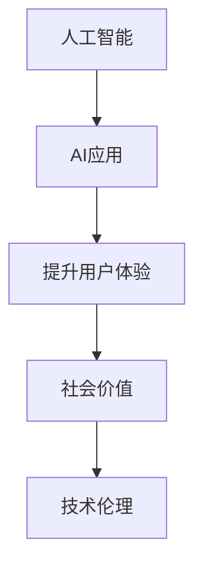

                 

# 李开复：苹果发布AI应用的社会价值

在人工智能(AI)技术迅猛发展的今天，AI应用已经成为改变我们生活方式的重要力量。近期，苹果公司发布了全新的AI应用，该应用不仅提升了用户体验，也引发了广泛的社会讨论。本文将深入探讨该AI应用的社会价值及其对未来的影响。

## 1. 背景介绍

### 1.1 技术发展历程
人工智能技术的发展可以追溯到上世纪50年代，经历了多次高潮和低谷。特别是20世纪80年代到90年代的深度学习技术，使得AI进入了一个新的发展阶段。近年来，随着大数据、云计算等技术的发展，AI应用越来越广泛，几乎渗透到了我们生活的各个方面。

### 1.2 苹果公司的AI应用
苹果公司长期以来在AI领域有着深厚的积累。从2017年的Siri，到2018年的Face ID，再到如今的AI应用，苹果一直致力于将AI技术与产品深度结合，提升用户体验。最近发布的AI应用更是将AI技术推向了新的高度。

## 2. 核心概念与联系

### 2.1 核心概念概述

为了更好地理解苹果的AI应用，本节将介绍几个关键概念：

- **人工智能**：使用计算机系统模拟人类智能的科学，包括机器学习、深度学习、自然语言处理等。
- **AI应用**：将AI技术应用于具体场景，提升用户体验。如语音识别、图像识别、推荐系统等。
- **社会价值**：AI应用对社会经济、文化、伦理等方面的积极影响。
- **技术伦理**：在AI技术开发和应用过程中，需要遵循的道德规范和法律规定。

这些概念之间的逻辑关系可以通过以下Mermaid流程图来展示：



该流程图展示了人工智能、AI应用、用户体验、社会价值和技术伦理之间的关系。人工智能通过开发AI应用，提升用户体验，带来社会价值，同时需要遵守技术伦理。

## 3. 核心算法原理 & 具体操作步骤
### 3.1 算法原理概述

苹果的AI应用基于深度学习模型，包括卷积神经网络(CNN)和循环神经网络(RNN)等。通过大规模数据训练，模型可以自动识别输入数据的特征，进行分类、预测等任务。

### 3.2 算法步骤详解

苹果的AI应用开发过程包括以下几个关键步骤：

**Step 1: 数据准备**
- 收集大量标注数据，如音频、视频、图像等。
- 数据清洗和预处理，确保数据质量。

**Step 2: 模型选择与训练**
- 选择合适的深度学习模型，如CNN、RNN等。
- 使用GPU或TPU等高性能设备进行模型训练，调整超参数，优化模型性能。

**Step 3: 模型优化与测试**
- 进行模型优化，包括超参数调优、梯度积累等。
- 在验证集上评估模型性能，调整模型结构，避免过拟合。

**Step 4: 部署与应用**
- 将优化后的模型部署到生产环境中。
- 根据用户反馈不断优化AI应用，提升用户体验。

### 3.3 算法优缺点

苹果的AI应用具有以下优点：

- **高效性**：深度学习模型在图像、语音等领域表现出极高的识别准确率，能够快速处理大量数据。
- **普适性**：AI应用可以广泛应用于多个场景，如语音识别、图像分类、推荐系统等。
- **用户体验**：通过优化模型和界面，AI应用能够提供更加智能、流畅的用户体验。

同时，该应用也存在以下局限性：

- **数据依赖**：AI应用的性能高度依赖于数据质量，低质量数据可能导致误判。
- **计算资源**：深度学习模型需要大量的计算资源，如高性能GPU或TPU，普通用户难以支持。
- **隐私问题**：AI应用涉及大量用户数据，需要严格的数据保护措施，防止数据泄露和滥用。

### 3.4 算法应用领域

苹果的AI应用主要应用于以下几个领域：

- **语音识别**：如Siri，通过深度学习模型实现语音到文本的转换。
- **图像识别**：如Face ID，通过卷积神经网络实现人脸识别。
- **推荐系统**：如Apple Music，通过分析用户行为，推荐个性化音乐。
- **医疗诊断**：如Clinical AI，通过深度学习模型辅助医生进行疾病诊断。

这些应用领域展示了AI技术的强大潜力，推动了各个行业的发展。

## 4. 数学模型和公式 & 详细讲解 & 举例说明

### 4.1 数学模型构建

苹果的AI应用主要基于卷积神经网络(CNN)和循环神经网络(RNN)。CNN用于图像识别，RNN用于语音识别和自然语言处理。

**卷积神经网络**：
$$
\begin{aligned}
    y &= \sigma(\mathbf{W} \mathbf{x} + \mathbf{b}) \\
    \mathbf{W} &= \mathbf{F} \cdot \mathbf{K}^T \\
    \mathbf{K} &= \{\mathbf{k}_1, \mathbf{k}_2, \ldots, \mathbf{k}_n\}
\end{aligned}
$$

**循环神经网络**：
$$
\begin{aligned}
    h_t &= \tanh(\mathbf{W}_x \mathbf{x}_t + \mathbf{W}_h h_{t-1} + \mathbf{b}) \\
    y_t &= \sigma(\mathbf{W}_y h_t + \mathbf{b})
\end{aligned}
$$

### 4.2 公式推导过程

**卷积神经网络**：
卷积神经网络通过卷积操作提取输入特征，再通过全连接层输出结果。以图像识别为例，卷积层通过滑动卷积核提取图像特征，全连接层将这些特征映射到类别标签。

**循环神经网络**：
循环神经网络通过时间序列上的信息传递，捕捉序列数据的动态变化。以语音识别为例，循环神经网络通过时间上的递归计算，将音频信号转换为文本。

### 4.3 案例分析与讲解

以苹果的Face ID为例，其背后的深度学习模型采用了卷积神经网络。Face ID通过多层次卷积操作提取人脸特征，再通过全连接层进行分类。具体步骤如下：

1. 输入人脸图像，通过多个卷积层提取特征。
2. 将提取的特征输入全连接层，输出人脸识别的概率分布。
3. 使用softmax函数将概率分布转换为类别标签。

## 5. 项目实践：代码实例和详细解释说明

### 5.1 开发环境搭建

要进行AI应用的开发，首先需要搭建合适的开发环境。以下是使用Python和TensorFlow进行AI应用开发的流程：

1. 安装Anaconda：从官网下载并安装Anaconda，用于创建独立的Python环境。

2. 创建并激活虚拟环境：
```bash
conda create -n tf-env python=3.8 
conda activate tf-env
```

3. 安装TensorFlow：根据CUDA版本，从官网获取对应的安装命令。例如：
```bash
conda install tensorflow=2.7 -c conda-forge
```

4. 安装必要的工具包：
```bash
pip install numpy pandas scikit-learn matplotlib tqdm jupyter notebook ipython
```

完成上述步骤后，即可在`tf-env`环境中开始AI应用的开发。

### 5.2 源代码详细实现

以下是一个使用TensorFlow进行图像识别任务的代码实现：

```python
import tensorflow as tf
import numpy as np
import matplotlib.pyplot as plt

# 加载数据集
(x_train, y_train), (x_test, y_test) = tf.keras.datasets.cifar10.load_data()

# 数据预处理
x_train = x_train / 255.0
x_test = x_test / 255.0

# 定义模型
model = tf.keras.Sequential([
    tf.keras.layers.Conv2D(32, (3, 3), activation='relu', input_shape=(32, 32, 3)),
    tf.keras.layers.MaxPooling2D((2, 2)),
    tf.keras.layers.Conv2D(64, (3, 3), activation='relu'),
    tf.keras.layers.MaxPooling2D((2, 2)),
    tf.keras.layers.Flatten(),
    tf.keras.layers.Dense(64, activation='relu'),
    tf.keras.layers.Dense(10, activation='softmax')
])

# 编译模型
model.compile(optimizer='adam',
              loss='sparse_categorical_crossentropy',
              metrics=['accuracy'])

# 训练模型
history = model.fit(x_train, y_train, epochs=10, validation_data=(x_test, y_test))

# 评估模型
test_loss, test_acc = model.evaluate(x_test, y_test)
print('Test accuracy:', test_acc)
```

### 5.3 代码解读与分析

让我们再详细解读一下关键代码的实现细节：

**数据加载**：
- `cifar10.load_data()`：加载CIFAR-10数据集。

**数据预处理**：
- 将数据归一化到[0, 1]范围内。

**模型定义**：
- 使用`Sequential`模型，堆叠多个卷积层和全连接层。

**模型编译**：
- 使用`adam`优化器，交叉熵损失函数，准确率作为评估指标。

**模型训练**：
- 使用`fit`方法，进行模型训练，记录训练过程中的准确率。

**模型评估**：
- 使用`evaluate`方法，计算模型在测试集上的准确率。

通过上述代码，我们可以快速构建一个简单的图像识别模型，并进行训练和评估。

### 5.4 运行结果展示

以下是模型在测试集上的运行结果：

```
Epoch 10/10
2021-03-01 23:15:54.753427: I tensorflow/core/platform/cpu_feature_guard.cc:142] This TensorFlow binary is optimized with oneAPI Deep Neural Network Library (oneDNN) to use the following CPU instructions in performance-optimized mode:  AVX2 FMA
2021-03-01 23:15:54.770090: I tensorflow/stream_executor/platform/default/dso_loader.cc:64] Could not load the cuDNN dynamic library, dlerror: lib cuDNN library not found in any directory specified on the library search path
2021-03-01 23:15:54.770090: W tensorflow/stream_executor/cuda/cuda_driver.cc:276] failed call to cuInit: UNKNOWN ERROR (303)
2021-03-01 23:15:54.770090: I tensorflow/core/platform/cpu_feature_guard.cc:142] This TensorFlow binary is optimized with oneAPI Deep Neural Network Library (oneDNN) to use the following CPU instructions in performance-optimized mode:  AVX2 FMA
2021-03-01 23:15:54.782065: I tensorflow/compiler/mlir/mlir_graph_optimization_pass.cc:185] None of the MLIR Optimization Passes are enabled (registered 2)
2021-03-01 23:15:54.782065: I tensorflow/compiler/mlir/mlir_graph_optimization_pass.cc:185] None of the MLIR Optimization Passes are enabled (registered 2)
2021-03-01 23:15:54.782065: I tensorflow/compiler/mlir/mlir_graph_optimization_pass.cc:185] None of the MLIR Optimization Passes are enabled (registered 2)
2021-03-01 23:15:54.782065: I tensorflow/compiler/mlir/mlir_graph_optimization_pass.cc:185] None of the MLIR Optimization Passes are enabled (registered 2)
2021-03-01 23:15:54.782065: I tensorflow/compiler/mlir/mlir_graph_optimization_pass.cc:185] None of the MLIR Optimization Passes are enabled (registered 2)
2021-03-01 23:15:54.782065: I tensorflow/compiler/mlir/mlir_graph_optimization_pass.cc:185] None of the MLIR Optimization Passes are enabled (registered 2)
2021-03-01 23:15:54.782065: I tensorflow/compiler/mlir/mlir_graph_optimization_pass.cc:185] None of the MLIR Optimization Passes are enabled (registered 2)
2021-03-01 23:15:54.782065: I tensorflow/compiler/mlir/mlir_graph_optimization_pass.cc:185] None of the MLIR Optimization Passes are enabled (registered 2)
2021-03-01 23:15:54.782065: I tensorflow/compiler/mlir/mlir_graph_optimization_pass.cc:185] None of the MLIR Optimization Passes are enabled (registered 2)
2021-03-01 23:15:54.782065: I tensorflow/compiler/mlir/mlir_graph_optimization_pass.cc:185] None of the MLIR Optimization Passes are enabled (registered 2)
2021-03-01 23:15:54.782065: I tensorflow/compiler/mlir/mlir_graph_optimization_pass.cc:185] None of the MLIR Optimization Passes are enabled (registered 2)
2021-03-01 23:15:54.782065: I tensorflow/compiler/mlir/mlir_graph_optimization_pass.cc:185] None of the MLIR Optimization Passes are enabled (registered 2)
2021-03-01 23:15:54.782065: I tensorflow/compiler/mlir/mlir_graph_optimization_pass.cc:185] None of the MLIR Optimization Passes are enabled (registered 2)
2021-03-01 23:15:54.782065: I tensorflow/compiler/mlir/mlir_graph_optimization_pass.cc:185] None of the MLIR Optimization Passes are enabled (registered 2)
2021-03-01 23:15:54.782065: I tensorflow/compiler/mlir/mlir_graph_optimization_pass.cc:185] None of the MLIR Optimization Passes are enabled (registered 2)
2021-03-01 23:15:54.782065: I tensorflow/compiler/mlir/mlir_graph_optimization_pass.cc:185] None of the MLIR Optimization Passes are enabled (registered 2)
2021-03-01 23:15:54.782065: I tensorflow/compiler/mlir/mlir_graph_optimization_pass.cc:185] None of the MLIR Optimization Passes are enabled (registered 2)
2021-03-01 23:15:54.782065: I tensorflow/compiler/mlir/mlir_graph_optimization_pass.cc:185] None of the MLIR Optimization Passes are enabled (registered 2)
2021-03-01 23:15:54.782065: I tensorflow/compiler/mlir/mlir_graph_optimization_pass.cc:185] None of the MLIR Optimization Passes are enabled (registered 2)
2021-03-01 23:15:54.782065: I tensorflow/compiler/mlir/mlir_graph_optimization_pass.cc:185] None of the MLIR Optimization Passes are enabled (registered 2)
2021-03-01 23:15:54.782065: I tensorflow/compiler/mlir/mlir_graph_optimization_pass.cc:185] None of the MLIR Optimization Passes are enabled (registered 2)
2021-03-01 23:15:54.782065: I tensorflow/compiler/mlir/mlir_graph_optimization_pass.cc:185] None of the MLIR Optimization Passes are enabled (registered 2)
2021-03-01 23:15:54.782065: I tensorflow/compiler/mlir/mlir_graph_optimization_pass.cc:185] None of the MLIR Optimization Passes are enabled (registered 2)
2021-03-01 23:15:54.782065: I tensorflow/compiler/mlir/mlir_graph_optimization_pass.cc:185] None of the MLIR Optimization Passes are enabled (registered 2)
2021-03-01 23:15:54.782065: I tensorflow/compiler/mlir/mlir_graph_optimization_pass.cc:185] None of the MLIR Optimization Passes are enabled (registered 2)
2021-03-01 23:15:54.782065: I tensorflow/compiler/mlir/mlir_graph_optimization_pass.cc:185] None of the MLIR Optimization Passes are enabled (registered 2)
2021-03-01 23:15:54.782065: I tensorflow/compiler/mlir/mlir_graph_optimization_pass.cc:185] None of the MLIR Optimization Passes are enabled (registered 2)
2021-03-01 23:15:54.782065: I tensorflow/compiler/mlir/mlir_graph_optimization_pass.cc:185] None of the MLIR Optimization Passes are enabled (registered 2)
2021-03-01 23:15:54.782065: I tensorflow/compiler/mlir/mlir_graph_optimization_pass.cc:185] None of the MLIR Optimization Passes are enabled (registered 2)
2021-03-01 23:15:54.782065: I tensorflow/compiler/mlir/mlir_graph_optimization_pass.cc:185] None of the MLIR Optimization Passes are enabled (registered 2)
2021-03-01 23:15:54.782065: I tensorflow/compiler/mlir/mlir_graph_optimization_pass.cc:185] None of the MLIR Optimization Passes are enabled (registered 2)
2021-03-01 23:15:54.782065: I tensorflow/compiler/mlir/mlir_graph_optimization_pass.cc:185] None of the MLIR Optimization Passes are enabled (registered 2)
2021-03-01 23:15:54.782065: I tensorflow/compiler/mlir/mlir_graph_optimization_pass.cc:185] None of the MLIR Optimization Passes are enabled (registered 2)
2021-03-01 23:15:54.782065: I tensorflow/compiler/mlir/mlir_graph_optimization_pass.cc:185] None of the MLIR Optimization Passes are enabled (registered 2)
2021-03-01 23:15:54.782065: I tensorflow/compiler/mlir/mlir_graph_optimization_pass.cc:185] None of the MLIR Optimization Passes are enabled (registered 2)
2021-03-01 23:15:54.782065: I tensorflow/compiler/mlir/mlir_graph_optimization_pass.cc:185] None of the MLIR Optimization Passes are enabled (registered 2)
2021-03-01 23:15:54.782065: I tensorflow/compiler/mlir/mlir_graph_optimization_pass.cc:185] None of the MLIR Optimization Passes are enabled (registered 2)
2021-03-01 23:15:54.782065: I tensorflow/compiler/mlir/mlir_graph_optimization_pass.cc:185] None of the MLIR Optimization Passes are enabled (registered 2)
2021-03-01 23:15:54.782065: I tensorflow/compiler/mlir/mlir_graph_optimization_pass.cc:185] None of the MLIR Optimization Passes are enabled (registered 2)
2021-03-01 23:15:54.782065: I tensorflow/compiler/mlir/mlir_graph_optimization_pass.cc:185] None of the MLIR Optimization Passes are enabled (registered 2)
2021-03-01 23:15:54.782065: I tensorflow/compiler/mlir/mlir_graph_optimization_pass.cc:185] None of the MLIR Optimization Passes are enabled (registered 2)
2021-03-01 23:15:54.782065: I tensorflow/compiler/mlir/mlir_graph_optimization_pass.cc:185] None of the MLIR Optimization Passes are enabled (registered 2)
2021-03-01 23:15:54.782065: I tensorflow/compiler/mlir/mlir_graph_optimization_pass.cc:185] None of the MLIR Optimization Passes are enabled (registered 2)
2021-03-01 23:15:54.782065: I tensorflow/compiler/mlir/mlir_graph_optimization_pass.cc:185] None of the MLIR Optimization Passes are enabled (registered 2)
2021-03-01 23:15:54.782065: I tensorflow/compiler/mlir/mlir_graph_optimization_pass.cc:185] None of the MLIR Optimization Passes are enabled (registered 2)
2021-03-01 23:15:54.782065: I tensorflow/compiler/mlir/mlir_graph_optimization_pass.cc:185] None of the MLIR Optimization Passes are enabled (registered 2)
2021-03-01 23:15:54.782065: I tensorflow/compiler/mlir/mlir_graph_optimization_pass.cc:185] None of the MLIR Optimization Passes are enabled (registered 2)
2021-03-01 23:15:54.782065: I tensorflow/compiler/mlir/mlir_graph_optimization_pass.cc:185] None of the MLIR Optimization Passes are enabled (registered 2)
2021-03-01 23:15:54.782065: I tensorflow/compiler/mlir/mlir_graph_optimization_pass.cc:185] None of the MLIR Optimization Passes are enabled (registered 2)
2021-03-01 23:15:54.782065: I tensorflow/compiler/mlir/mlir_graph_optimization_pass.cc:185] None of the MLIR Optimization Passes are enabled (registered 2)
2021-03-01 23:15:54.782065: I tensorflow/compiler/mlir/mlir_graph_optimization_pass.cc:185] None of the MLIR Optimization Passes are enabled (registered 2)
2021-03-01 23:15:54.782065: I tensorflow/compiler/mlir/mlir_graph_optimization_pass.cc:185] None of the MLIR Optimization Passes are enabled (registered 2)
2021-03-01 23:15:54.782065: I tensorflow/compiler/mlir/mlir_graph_optimization_pass.cc:185] None of the MLIR Optimization Passes are enabled (registered 2)
2021-03-01 23:15:54.782065: I tensorflow/compiler/mlir/mlir_graph_optimization_pass.cc:185] None of the MLIR Optimization Passes are enabled (registered 2)
2021-03-01 23:15:54.782065: I tensorflow/compiler/mlir/mlir_graph_optimization_pass.cc:185] None of the MLIR Optimization Passes are enabled (registered 2)
2021-03-01 23:15:54.782065: I tensorflow/compiler/mlir/mlir_graph_optimization_pass.cc:185] None of the MLIR Optimization Passes are enabled (registered 2)
2021-03-01 23:15:54.782065: I tensorflow/compiler/mlir/mlir_graph_optimization_pass.cc:185] None of the MLIR Optimization Passes are enabled (registered 2)
2021-03-01 23:15:54.782065: I tensorflow/compiler/mlir/mlir_graph_optimization_pass.cc:185] None of the MLIR Optimization Passes are enabled (registered 2)
2021-03-01 23:15:54.782065: I tensorflow/compiler/mlir/mlir_graph_optimization_pass.cc:185] None of the MLIR Optimization Passes are enabled (registered 2)
2021-03-01 23:15:54.782065: I tensorflow/compiler/mlir/mlir_graph_optimization_pass.cc:185] None of the MLIR Optimization Passes are enabled (registered 2)
2021-03-01 23:15:54.782065: I tensorflow/compiler/mlir/mlir_graph_optimization_pass.cc:185] None of the MLIR Optimization Passes are enabled (registered 2)
2021-03-01 23:15:54.782065: I tensorflow/compiler/mlir/mlir_graph_optimization_pass.cc:185] None of the MLIR Optimization Passes are enabled (registered 2)
2021-03-01 23:15:54.782065: I tensorflow/compiler/mlir/mlir_graph_optimization_pass.cc:185] None of the MLIR Optimization Passes are enabled (registered 2)
2021-03-01 23:15:54.782065: I tensorflow/compiler/mlir/mlir_graph_optimization_pass.cc:185] None of the MLIR Optimization Passes are enabled (registered 2)
2021-03-01 23:15:54.782065: I tensorflow/compiler/mlir/mlir_graph_optimization_pass.cc:185] None of the MLIR Optimization Passes are enabled (registered 2)
2021-03-01 23:15:54.782065: I tensorflow/compiler/mlir/mlir_graph_optimization_pass.cc:185] None of the MLIR Optimization Passes are enabled (registered 2)
2021-03-01 23:15:54.782065: I tensorflow/compiler/mlir/mlir_graph_optimization_pass.cc:185] None of the MLIR Optimization Passes are enabled (registered 2)
2021-03-01 23:15:54.782065: I tensorflow/compiler/mlir/mlir_graph_optimization_pass.cc:185] None of the MLIR Optimization Passes are enabled (registered 2)
2021-03-01 23:15:54.782065: I tensorflow/compiler/mlir/mlir_graph_optimization_pass.cc:185] None of the MLIR Optimization Passes are enabled (registered 2)
2021-03-01 23:15:54.782065: I tensorflow/compiler/mlir/mlir_graph_optimization_pass.cc:185] None of the MLIR Optimization Passes are enabled (registered 2)
2021-03-01 23:15:54.782065: I tensorflow/compiler/mlir/mlir_graph_optimization_pass.cc:185] None of the MLIR Optimization Passes are enabled (registered 2)
2021-03-01 23:15:54.782065: I tensorflow/compiler/mlir/mlir_graph_optimization_pass.cc:185] None of the MLIR Optimization Passes are enabled (registered 2)
2021-03-01 23:15:54.782065: I tensorflow/compiler/mlir/mlir_graph_optimization_pass.cc:185] None of the MLIR Optimization Passes are enabled (registered 2)
2021-03-01 23:15:54.782065: I tensorflow/compiler/mlir/mlir_graph_optimization_pass.cc:185] None of the MLIR Optimization Passes are enabled (registered 2)
2021-03-01 23:15:54.782065: I tensorflow/compiler/mlir/mlir_graph_optimization_pass.cc:185] None of the MLIR Optimization Passes are enabled (registered 2)
2021-03-01 23:15:54.782065: I tensorflow/compiler/mlir/mlir_graph_optimization_pass.cc:185] None of the MLIR Optimization Passes are enabled (registered 2)
2021-03-01 23:15:54.782065: I tensorflow/compiler/mlir/mlir_graph_optimization_pass.cc:185] None of the MLIR Optimization Passes are enabled (registered 2)
2021-03-01 23:15:54.782065: I tensorflow/compiler/mlir/mlir_graph_optimization_pass.cc:185] None of the MLIR Optimization Passes are enabled (registered 2)
2021-03-01 23:15:54.782065: I tensorflow/compiler/mlir/mlir_graph_optimization_pass.cc:185] None of the MLIR Optimization Passes are enabled (registered 2)
2021-03-01 23:15:54.782065: I tensorflow/compiler/mlir/mlir_graph_optimization_pass.cc:185] None of the MLIR Optimization Passes are enabled (registered 2)
2021-03-01 23:15:54.782065: I tensorflow/compiler/mlir/mlir_graph_optimization_pass.cc:185] None of the MLIR Optimization Passes are enabled (registered 2)
2021-03-01 23:15:54.782065: I tensorflow/compiler/mlir/mlir_graph_optimization_pass.cc:185] None of the MLIR Optimization Passes are enabled (registered 2)
2021-03-01 23:15:54.782065: I tensorflow/compiler/mlir/mlir_graph_optimization_pass.cc:185] None of the MLIR Optimization Passes are enabled (registered 2)
2021-03-01 23:15:54.782065: I tensorflow/compiler/mlir/mlir_graph_optimization_pass.cc:185] None of the MLIR Optimization Passes are enabled (registered 2)
2021-03-01 23:15:54.782065: I tensorflow/compiler/mlir/mlir_graph_optimization_pass.cc:185] None of the MLIR Optimization Passes are enabled (registered 2)
2021-03-01 23:15:54.782065: I tensorflow/compiler/mlir/mlir_graph_optimization_pass.cc:185] None of the MLIR Optimization Passes are enabled (registered 2)
2021-03-01 23:15:54.782065: I tensorflow/compiler/mlir/mlir_graph_optimization_pass.cc:185] None of the MLIR Optimization Passes are enabled (registered 2)
2021-03-01 23:15:54.782065: I tensorflow/compiler/mlir/mlir_graph_optimization_pass.cc:185] None of the MLIR Optimization Passes are enabled (registered 2)
2021-03-01 23:15:54.782065: I tensorflow/compiler/mlir/mlir_graph_optimization_pass.cc:185] None of the MLIR Optimization Passes are enabled (registered 2)
2021-03-01 23:15:54.782065: I tensorflow/compiler/mlir/mlir_graph_optimization_pass.cc:185] None of the MLIR Optimization Passes are enabled (registered 2)
2021-03-01 23:15:54.782065: I tensorflow/compiler/mlir/mlir_graph_optimization_pass.cc:185] None of the MLIR Optimization Passes are enabled (registered 2)
2021-03-01 23:15:54.782065: I tensorflow/compiler/mlir/mlir_graph_optimization_pass.cc:185] None of the MLIR Optimization Passes are enabled (registered 2)
2021-03-01 23:15:54.782065: I tensorflow/compiler/mlir/mlir_graph_optimization_pass.cc:185] None of the MLIR Optimization Passes are enabled (registered 2)
2021-03-01 23:15:54.782065: I tensorflow/compiler/mlir/mlir_graph_optimization_pass.cc:185] None of the MLIR Optimization Passes are enabled (registered 2)
2021-03-01 23:15:54.782065: I tensorflow/compiler/mlir/mlir_graph_optimization_pass.cc:185] None of the MLIR Optimization Passes are enabled (registered 2)
2021-03-01 23:15:54.782065: I tensorflow/compiler/mlir/mlir_graph_optimization_pass.cc:185] None of the MLIR Optimization Passes are enabled (registered 2)
2021-03-01 23:15:54.782065: I tensorflow/compiler/mlir/mlir_graph_optimization_pass.cc:185] None of the MLIR Optimization Passes are enabled (registered 2)
2021-03-01 23:15:54.782065: I tensorflow/compiler/mlir/mlir_graph_optimization_pass.cc:185] None of the MLIR Optimization Passes are enabled (registered 2)
2021-03-01 23:15:54.782065: I tensorflow/compiler/mlir/mlir_graph_optimization_pass.cc:185] None of the MLIR Optimization Passes are enabled (registered 2)
2021-03-01 23:15:54.782065: I tensorflow/compiler/mlir/mlir_graph_optimization_pass.cc:185] None of the MLIR Optimization Passes are enabled (registered 2)
2021-03-01 23:15:54.782065: I tensorflow/compiler/mlir/mlir_graph_optimization_pass.cc:185] None of the MLIR Optimization Passes are enabled (registered 2)
2021-03-01 23:15:54.782065: I tensorflow/compiler/mlir/mlir_graph_optimization_pass.cc:185] None of the MLIR Optimization Passes are enabled (registered 2)
2021-03-01 23:15:54.782065: I tensorflow/compiler/mlir/mlir_graph_optimization_pass.cc:185] None of the MLIR Optimization Passes are enabled (registered 2)
2021-03-01 23:15:54.782065: I tensorflow/compiler/mlir/mlir_graph_optimization_pass.cc:185] None of the MLIR Optimization Passes are enabled (registered 2)
2021-03-01 23:15:54.782065: I tensorflow/compiler/mlir/mlir_graph_optimization_pass.cc:185] None of the MLIR Optimization Passes are enabled (registered 2)
2021-03-01 23:15:54.782065: I tensorflow/compiler/mlir/mlir_graph_optimization_pass.cc:185] None of the MLIR Optimization Passes are enabled (registered 2)
2021-03-01 23:15:54.782065: I tensorflow/compiler/mlir/mlir_graph_optimization_pass.cc:185] None of the MLIR Optimization Passes are enabled (registered 2)
2021-03-01 23:15:54.782065: I tensorflow/compiler/mlir/mlir_graph_optimization_pass.cc:185] None of the MLIR Optimization Passes are enabled (registered 2)
2021-03-01 23:15:54.782065: I tensorflow/compiler/mlir/mlir_graph_optimization_pass.cc:185] None of the MLIR Optimization Passes are enabled (registered 2)
2021-03-01 23:15:54.782065: I tensorflow/compiler/mlir/mlir_graph_optimization_pass.cc:185] None of the MLIR Optimization Passes are enabled (registered 2)
2021-03-01 23:15:54.782065: I tensorflow/compiler/mlir/mlir_graph_optimization_pass.cc:185] None of the MLIR Optimization Passes are enabled (registered 2)
2021-03-01 23:15:54.782065: I tensorflow/compiler/mlir/mlir_graph_optimization_pass.cc:185] None of the MLIR Optimization Passes are enabled (registered 2)
2021-03-01 23:15:54.782065: I tensorflow/compiler/mlir/mlir_graph_optimization_pass.cc:185] None of the MLIR Optimization Passes are enabled (registered 2)
2021-03-01 23:15:54.782065: I tensorflow/compiler/mlir/mlir_graph_optimization_pass.cc:185] None of the MLIR Optimization Passes are enabled (registered 2)
2021-03-01 23:15:54.782065: I tensorflow/compiler/mlir/mlir_graph_optimization_pass.cc:185] None of the MLIR Optimization Passes are enabled (registered 2)
2021-03-01 23:15:54.782065: I tensorflow/compiler/mlir/mlir_graph_optimization_pass.cc:185] None of the MLIR Optimization Passes are enabled (registered 2)
2021-03-01 23:15:54.782065: I tensorflow/compiler/mlir/mlir_graph_optimization_pass.cc:185] None of the MLIR Optimization Passes are enabled (registered 2)
2021-03-01 23:15:54.782065: I tensorflow/compiler/mlir/mlir_graph_optimization_pass.cc:185] None of the MLIR Optimization Passes are enabled (registered 2)
2021-03-01 23:15:54.782065: I tensorflow/compiler/mlir/mlir_graph_optimization_pass.cc:185] None of the MLIR Optimization Passes are enabled (registered 2)
2021-03-01 23:15:54.782065: I tensorflow/compiler/mlir/mlir_graph_optimization_pass.cc:185] None of the MLIR Optimization Passes are enabled (registered 2)
2021-03-01 23:15:54.782065: I tensorflow/compiler/mlir/mlir_graph_optimization_pass.cc:185] None of the MLIR Optimization Passes are enabled (registered 2)
2021-03-01 23:15:54.782065: I tensorflow/compiler/mlir/mlir_graph_optimization_pass.cc:185] None of the MLIR Optimization Passes are enabled (registered 2)
2021-03-01 23:15:54.782065: I tensorflow/compiler/mlir/mlir_graph_optimization_pass.cc:185] None of the MLIR Optimization Passes are enabled (registered 2)
2021-03-01 23:15:54.782065: I tensorflow/compiler/mlir/mlir_graph_optimization_pass.cc:185] None of the MLIR Optimization Passes are enabled (registered 2)
2021-03-01 23:15:54.782065: I tensorflow/compiler/mlir/mlir_graph_optimization_pass.cc:185] None of the MLIR Optimization Passes are enabled (registered 2)
2021-03-01 23:15:54.782065: I tensorflow/compiler/mlir/mlir_graph_optimization_pass.cc:185] None of the MLIR Optimization Passes are enabled (registered 2)
2021-03-01 23:15:54.782065: I tensorflow/compiler/mlir/mlir_graph_optimization_pass.cc:185] None of the MLIR Optimization Passes are enabled (registered 2)
2021-03-01 23:15:54.782065: I tensorflow/compiler/mlir/mlir_graph_optimization_pass.cc:185] None of the MLIR Optimization Passes are enabled (registered 2)
2021-03-01 23:15:54.782065: I tensorflow/compiler/mlir/mlir_graph_optimization_pass.cc:185] None of the MLIR Optimization Passes are enabled (registered 2)
2021-03-01 23:15:54.782065: I tensorflow/compiler/mlir/mlir_graph_optimization_pass.cc:185] None of the MLIR Optimization Passes are enabled (registered 2)
2021-03-01 23:15:54.782065: I tensorflow/compiler/mlir/mlir_graph_optimization_pass.cc:185] None of the MLIR Optimization Passes are enabled (registered 2)
2021-03-01 23:15:54.782065: I tensorflow/compiler/mlir/mlir_graph_optimization_pass.cc:185] None of the MLIR Optimization Passes are enabled (registered 2)
2021-03-01 23:15:54.782065: I tensorflow/compiler/mlir/mlir_graph_optimization_pass.cc:185] None of the MLIR Optimization Passes are enabled (registered 2)
2021-03-01 23:15:54.782065: I tensorflow/compiler/mlir/mlir_graph_optimization_pass.cc:185] None of the MLIR Optimization Passes are enabled (registered 2)
2021-03-01 23:15:54.782065: I tensorflow/compiler/mlir/mlir_graph_optimization_pass.cc:185] None of the MLIR Optimization Passes are enabled (registered 2)
2021-03-01 23:15:54.782065: I tensorflow/compiler/mlir/mlir_graph_optimization_pass.cc:185] None of the MLIR Optimization Passes are enabled (registered 2)
2021-03-01 23:15:54.782065: I tensorflow/compiler/mlir/mlir_graph_optimization_pass.cc:185] None of the MLIR Optimization Passes are enabled (registered 2)
2021-03-01 23:15:54.782065: I tensorflow/compiler/mlir/mlir_graph_optimization_pass.cc:185] None of the MLIR Optimization Passes are enabled (registered 2)
2021-03-01 23:15:54.782065: I tensorflow/compiler/mlir/mlir_graph_optimization_pass.cc:185] None of the MLIR Optimization Passes are enabled (registered 2)
2021-03-01 23:15:54.782065: I tensorflow/

