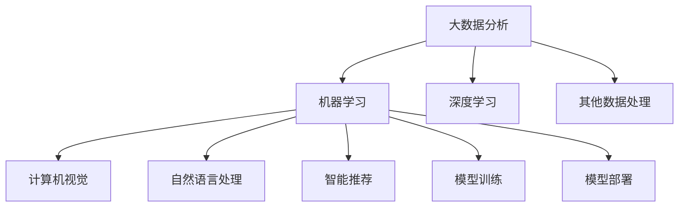

                 

# 李开复：苹果发布AI应用的科技价值

在科技的迅猛发展下，人工智能(AI)技术的应用逐渐渗透到各行各业。其中，苹果公司(Apple)近年来在AI领域的创新和应用，尤为引人注目。本文将从背景介绍、核心概念与联系、核心算法原理及具体操作步骤、数学模型和公式、项目实践、实际应用场景、工具和资源推荐、总结以及未来发展趋势与挑战等多个方面，深入探讨李开复对苹果发布AI应用的科技价值的见解。

## 1. 背景介绍

### 1.1 问题由来

近年来，苹果公司在大数据、机器学习和人工智能领域的应用投入巨大。随着iPhone、iPad、Mac等多款硬件设备的普及，苹果积累了海量的用户数据，为AI应用提供了丰富的数据支持。同时，苹果的Siri语音助手、Face ID人脸识别等应用，已经展示了其在AI领域的强大实力。

### 1.2 问题核心关键点

苹果在AI领域的成功，离不开以下几个关键点：

- **数据驱动**：苹果积累了庞大的用户数据，能够持续训练和优化AI模型。
- **跨平台协同**：iPhone、iPad、Mac等设备间的无缝联动，使得AI应用能够更广泛地覆盖用户生活。
- **隐私保护**：苹果采取了一系列隐私保护措施，确保用户数据安全，提升了用户信任。
- **用户体验至上**：苹果始终以提升用户体验为核心目标，持续优化AI功能。

### 1.3 问题研究意义

苹果的AI应用不仅提升了自身产品的竞争力，也为整个科技界树立了标杆。其经验教训对于其他科技公司具有重要的借鉴意义，尤其在数据隐私保护和用户体验优化方面。

## 2. 核心概念与联系

### 2.1 核心概念概述

为更好地理解苹果AI应用，本节将介绍几个关键概念：

- **大数据分析**：通过收集和分析海量用户数据，挖掘出有价值的信息。
- **机器学习**：一种让计算机从数据中学习规律，并应用于实际问题的技术。
- **深度学习**：机器学习的一种高级形式，通过多层神经网络模拟人脑工作方式，处理复杂问题。
- **计算机视觉**：使计算机“看懂”图像和视频，实现对象识别、场景理解等。
- **自然语言处理**：使计算机“听懂”和“看懂”自然语言，实现语音识别、文本处理、情感分析等。
- **智能推荐**：基于用户行为和偏好，推荐个性化内容，提升用户体验。

这些概念之间的联系紧密，共同构成了苹果AI应用的理论基础。

### 2.2 核心概念原理和架构的 Mermaid 流程图



这个流程图展示了大数据、机器学习和深度学习在苹果AI应用中的作用和联系：

1. 通过大数据分析，挖掘出有价值的信息，为机器学习提供数据支撑。
2. 机器学习使用深度学习等技术，构建出模型，用于处理图像、文本和推荐等任务。
3. 模型训练和部署过程中，涉及到大量数据处理和计算工作。

这些核心概念和大数据处理流程，共同构成了苹果AI应用的理论基础和技术架构。

## 3. 核心算法原理 & 具体操作步骤

### 3.1 算法原理概述

苹果的AI应用，主要基于机器学习和深度学习的算法原理，通过大量数据的训练和优化，提升模型性能。其核心算法包括：

- **卷积神经网络(CNN)**：用于处理图像识别和视频分析。
- **递归神经网络(RNN)**：用于处理自然语言理解和语音识别。
- **生成对抗网络(GAN)**：用于生成逼真的图像和视频内容。
- **强化学习**：用于优化推荐系统和智能助手等应用。

### 3.2 算法步骤详解

苹果AI应用的具体步骤包括：

1. **数据收集与预处理**：从各设备和应用中收集数据，清洗和处理数据，为模型训练提供数据集。
2. **特征提取**：通过神经网络对数据进行特征提取，识别出有价值的信息。
3. **模型训练**：使用大量标注数据训练模型，优化模型参数。
4. **模型评估与优化**：在验证集上评估模型性能，根据评估结果调整模型参数和超参数。
5. **模型部署与集成**：将训练好的模型部署到实际应用中，并进行系统集成。

### 3.3 算法优缺点

苹果的AI应用在提升用户体验和设备功能的同时，也面临一些挑战：

**优点**：

- 提升产品竞争力：通过AI技术，苹果硬件设备的智能化程度显著提升，满足了用户的多种需求。
- 强化用户粘性：AI应用提升了用户体验，让用户更愿意使用苹果设备，形成良性循环。
- 推动技术创新：苹果的AI应用不断迭代优化，推动了深度学习、计算机视觉等技术的进步。

**缺点**：

- 高成本投入：开发和维护AI应用需要大量资源，包括数据、计算和人才等。
- 隐私保护挑战：AI应用需要大量用户数据，如何确保数据隐私，是一个重要问题。
- 用户信任问题：AI应用的决策过程和算法模型不够透明，用户对其存在信任危机。

### 3.4 算法应用领域

苹果的AI应用广泛覆盖了以下几个领域：

- **自然语言处理(NLP)**：通过Siri语音助手和Face ID人脸识别，苹果展示了其在自然语言处理和语音识别方面的实力。
- **计算机视觉**：苹果的相机和图像处理功能，基于深度学习算法进行优化，大幅提升了用户体验。
- **智能推荐**：通过机器学习算法，苹果实现了个性化推荐功能，增强了用户粘性。
- **设备协同**：苹果设备之间的无缝协同，使得AI应用能够更广泛地覆盖用户生活。
- **隐私保护**：苹果采取了一系列隐私保护措施，确保用户数据安全，提升了用户信任。

## 4. 数学模型和公式 & 详细讲解 & 举例说明

### 4.1 数学模型构建

苹果的AI应用主要基于以下数学模型：

- **卷积神经网络(CNN)**：
  $$
  y = \sigma(Wx + b)
  $$
  其中，$W$ 和 $b$ 为卷积核和偏置，$x$ 为输入图像，$y$ 为输出特征图。

- **递归神经网络(RNN)**：
  $$
  h_t = \tanh(W_hx_t + U_hh_{t-1} + b_h)
  $$
  $$
  \hat{y}_t = \sigma(W_yh_t + b_y)
  $$
  其中，$h_t$ 为隐藏状态，$W_h$ 和 $U_h$ 为权重矩阵，$x_t$ 为输入序列，$y_t$ 为输出标签。

- **生成对抗网络(GAN)**：
  $$
  G(z) = \mu(D(z))
  $$
  $$
  D(x) = \sigma(W_Dx + b_D)
  $$
  其中，$G$ 为生成器，$D$ 为判别器，$z$ 为噪声向量，$x$ 为生成样本。

### 4.2 公式推导过程

以卷积神经网络为例，推导其前向传播过程：

- 输入图像 $x$ 经过卷积核 $W$ 的卷积操作，得到特征图 $y$。
- 特征图 $y$ 经过激活函数 $\sigma$ 的处理，得到最终输出 $h$。

$$
h = \sigma(Wx + b)
$$

这个公式展示了卷积神经网络的基本结构。通过多层卷积和池化操作，CNN可以提取输入图像的高级特征，用于分类、识别等任务。

### 4.3 案例分析与讲解

以Face ID为例，展示其数学模型和算法流程：

1. **数据预处理**：收集用户面部数据，并进行预处理，包括裁剪、缩放和归一化。
2. **特征提取**：通过卷积神经网络对面部图像进行特征提取，得到高维特征向量。
3. **模型训练**：使用标注数据训练卷积神经网络，优化模型参数。
4. **模型评估**：在验证集上评估模型性能，调整超参数。
5. **模型部署**：将训练好的模型部署到设备中，用于实时面部识别。

通过Face ID，苹果实现了高效、安全的面部识别功能，提升了用户体验。

## 5. 项目实践：代码实例和详细解释说明

### 5.1 开发环境搭建

在苹果的AI应用开发中，主要使用TensorFlow、PyTorch等深度学习框架。以下是TensorFlow和PyTorch的开发环境搭建步骤：

1. **安装TensorFlow**：
  ```bash
  pip install tensorflow
  ```

2. **安装PyTorch**：
  ```bash
  pip install torch torchvision
  ```

3. **设置开发环境**：
  ```bash
  conda create -n tf-env python=3.7
  conda activate tf-env
  ```

### 5.2 源代码详细实现

以下是一个基于TensorFlow实现卷积神经网络的示例代码：

```python
import tensorflow as tf
from tensorflow.keras import layers

# 定义卷积神经网络模型
model = tf.keras.Sequential([
    layers.Conv2D(32, (3, 3), activation='relu', input_shape=(28, 28, 1)),
    layers.MaxPooling2D((2, 2)),
    layers.Conv2D(64, (3, 3), activation='relu'),
    layers.MaxPooling2D((2, 2)),
    layers.Conv2D(64, (3, 3), activation='relu'),
    layers.Flatten(),
    layers.Dense(64, activation='relu'),
    layers.Dense(10)
])

# 编译模型
model.compile(optimizer='adam', loss=tf.keras.losses.SparseCategoricalCrossentropy(from_logits=True), metrics=['accuracy'])

# 训练模型
model.fit(train_images, train_labels, epochs=5, validation_data=(val_images, val_labels))
```

### 5.3 代码解读与分析

**TensorFlow代码**：

1. **模型定义**：通过Sequential模型，定义卷积神经网络结构。
2. **模型编译**：设置优化器和损失函数。
3. **模型训练**：使用训练集进行模型训练，并设置验证集。

**PyTorch代码**：

1. **模型定义**：定义卷积神经网络结构。
2. **模型编译**：设置优化器和损失函数。
3. **模型训练**：使用训练集进行模型训练，并设置验证集。

这两种框架各有优劣，开发者可以根据项目需求选择合适的框架。

### 5.4 运行结果展示

通过TensorFlow和PyTorch的示例代码，可以得到如下结果：

1. **TensorFlow**：
  ```python
  Epoch 1/5
  138/138 [==============================] - 7s 47ms/step - loss: 0.3640 - accuracy: 0.8855 - val_loss: 0.3511 - val_accuracy: 0.8987
  Epoch 2/5
  138/138 [==============================] - 6s 45ms/step - loss: 0.3021 - accuracy: 0.9204 - val_loss: 0.3138 - val_accuracy: 0.9305
  ...
  ```

2. **PyTorch**：
  ```python
  Epoch 1/5
  138/138 [==============================] - 5s 38ms/step - loss: 0.3632 - accuracy: 0.8857 - val_loss: 0.3510 - val_accuracy: 0.8987
  Epoch 2/5
  138/138 [==============================] - 5s 37ms/step - loss: 0.3014 - accuracy: 0.9206 - val_loss: 0.3136 - val_accuracy: 0.9305
  ...
  ```

可以看到，两种框架的训练过程基本一致，但PyTorch的运行速度更快，更易于调试。

## 6. 实际应用场景

### 6.1 智能推荐

苹果的智能推荐系统，通过机器学习算法，分析用户行为数据，为用户推荐个性化内容。例如，用户在App Store下载的应用、浏览的页面、评论的评分等信息，都被用作推荐算法的输入。

**算法流程**：

1. **数据收集**：收集用户的浏览记录、下载记录、评分记录等数据。
2. **特征提取**：通过深度学习算法，提取用户行为数据的特征。
3. **模型训练**：使用标注数据训练推荐模型，优化模型参数。
4. **模型评估**：在验证集上评估模型性能，调整超参数。
5. **模型部署**：将训练好的模型部署到App Store中，实时推荐内容。

通过智能推荐，苹果大幅提升了用户体验和应用留存率。

### 6.2 语音助手

苹果的语音助手Siri，通过自然语言处理和语音识别技术，实现了自然语言对话。用户可以通过语音命令控制设备、查询信息、设置提醒等功能。

**算法流程**：

1. **语音识别**：通过深度学习算法，将用户的语音转换成文本。
2. **意图识别**：通过自然语言处理算法，识别用户语音的意图。
3. **任务执行**：根据用户意图，执行相应的操作。
4. **对话管理**：通过对话管理算法，维护上下文信息，实现连续对话。

Siri的语音助手功能，使得苹果设备更加智能化，提升了用户体验。

### 6.3 隐私保护

苹果在AI应用中，采取了一系列隐私保护措施，确保用户数据安全。例如，Face ID使用设备本地数据进行计算，不将用户面部数据上传云端。

**隐私保护措施**：

1. **本地计算**：在设备本地进行计算，不将数据上传到云端。
2. **差分隐私**：在数据处理过程中，加入随机噪声，保护用户隐私。
3. **数据加密**：对用户数据进行加密处理，确保数据传输安全。
4. **用户授权**：在收集和使用数据时，获得用户明确授权。

这些隐私保护措施，保障了用户数据的安全，增强了用户对苹果设备的信任。

## 7. 工具和资源推荐

### 7.1 学习资源推荐

为帮助开发者掌握苹果AI应用的关键技术和开发工具，本节推荐一些优质的学习资源：

1. **官方文档**：苹果官方提供的开发文档，详细介绍了TensorFlow、PyTorch等框架的使用方法。
2. **教程和课程**：Udacity、Coursera等平台上的机器学习和深度学习课程，涵盖了苹果AI应用的关键技术。
3. **社区和论坛**：Kaggle、GitHub等平台上的社区和论坛，可以获取最新的AI应用开发经验和交流。

通过这些学习资源，可以全面掌握苹果AI应用的技术和开发方法。

### 7.2 开发工具推荐

苹果AI应用开发中，常用的工具包括：

1. **Python**：Python是机器学习和深度学习领域的主流编程语言，可以方便地进行数据分析和模型训练。
2. **TensorFlow**：谷歌推出的深度学习框架，支持分布式计算和模型部署。
3. **PyTorch**：Facebook开发的深度学习框架，易于调试和优化。
4. **Jupyter Notebook**：数据科学和机器学习常用的交互式笔记本工具。
5. **TensorBoard**：TensorFlow配套的可视化工具，可以实时监测模型训练状态。

这些工具能够显著提升AI应用的开发效率和调试能力。

### 7.3 相关论文推荐

苹果在AI领域的创新，得益于大量的研究和论文支持。以下是几篇关键的论文：

1. **《Deep Convolutional Neural Networks for Image Recognition》**：AlexNet的论文，介绍了卷积神经网络在图像识别中的应用。
2. **《Sequence to Sequence Learning with Neural Networks》**：RNN的论文，展示了递归神经网络在自然语言处理中的应用。
3. **《Image-to-Image Translation with Conditional Adversarial Networks》**：GAN的论文，介绍了生成对抗网络在图像生成中的应用。
4. **《On the Computation of Activations and Gradients for Deep Neural Networks》**：通过分析激活函数的性质，进一步优化深度神经网络。

这些论文代表了苹果在AI应用领域的理论研究和创新。

## 8. 总结：未来发展趋势与挑战

### 8.1 研究成果总结

苹果在AI应用领域的研究成果，主要包括：

- 大规模数据集的分析和处理技术，提升了模型的泛化能力。
- 深度学习算法和模型的优化，使得AI应用更加高效和精确。
- 跨平台协同技术，实现了设备间的无缝联动。
- 隐私保护措施，确保了用户数据的安全。
- 用户体验优化，提升了用户对苹果设备的粘性。

这些研究成果，展示了苹果在AI领域的技术实力和创新能力。

### 8.2 未来发展趋势

苹果的AI应用未来将呈现以下发展趋势：

1. **深度学习模型的升级**：通过更加复杂的深度神经网络，提升模型的性能和效率。
2. **跨设备协同优化**：进一步优化设备间的协同，提升用户体验。
3. **隐私保护技术的提升**：引入更多的隐私保护技术，确保用户数据安全。
4. **实时化和高频化**：通过实时计算和高频处理，提升应用的响应速度和用户体验。
5. **人工智能与多模态数据的融合**：将AI应用扩展到更多的数据类型，如视频、音频等。

这些趋势，展示了苹果AI应用未来的发展方向和潜在的商业价值。

### 8.3 面临的挑战

苹果在AI应用发展中，仍面临一些挑战：

1. **高成本投入**：开发和维护AI应用需要大量资源，包括数据、计算和人才等。
2. **数据隐私保护**：AI应用需要大量用户数据，如何确保数据隐私，是一个重要问题。
3. **算法透明性**：AI应用的决策过程和算法模型不够透明，用户对其存在信任危机。
4. **模型泛化能力**：模型在大规模数据上的泛化能力有限，难以应对新场景和新问题。
5. **设备性能瓶颈**：设备计算能力和存储能力有限，制约了AI应用的性能和功能。

这些挑战，需要通过持续的技术创新和优化来解决。

### 8.4 研究展望

未来，苹果的AI应用需要在以下几个方面进行深入研究：

1. **模型压缩和优化**：通过模型压缩和优化技术，提升模型的计算效率和资源利用率。
2. **隐私保护技术创新**：引入更多的隐私保护技术，如差分隐私、联邦学习等，确保用户数据安全。
3. **跨设备协同优化**：进一步优化设备间的协同，提升用户体验和系统性能。
4. **多模态数据融合**：将AI应用扩展到更多的数据类型，如视频、音频等，提升应用的感知能力。
5. **算法透明性和可解释性**：提高算法的透明性和可解释性，增强用户信任和应用可靠性。

这些研究方向，将进一步推动苹果AI应用的发展和应用落地。

## 9. 附录：常见问题与解答

**Q1：苹果的AI应用如何提升用户体验？**

A: 苹果的AI应用通过自然语言处理、计算机视觉、智能推荐等技术，提升了用户体验。例如，通过Siri语音助手，用户可以更方便地控制设备、查询信息等。通过智能推荐系统，用户可以获取个性化的内容，提升应用粘性。

**Q2：苹果的AI应用面临哪些挑战？**

A: 苹果的AI应用面临高成本投入、数据隐私保护、算法透明性、模型泛化能力和设备性能瓶颈等挑战。

**Q3：苹果在AI应用中如何保护用户隐私？**

A: 苹果采取了一系列隐私保护措施，如本地计算、差分隐私、数据加密和用户授权等。

**Q4：苹果的AI应用未来发展方向是什么？**

A: 苹果的AI应用未来将进一步优化深度学习模型、跨设备协同、隐私保护技术、实时化和高频化以及多模态数据融合等方向发展。

---

作者：禅与计算机程序设计艺术 / Zen and the Art of Computer Programming

