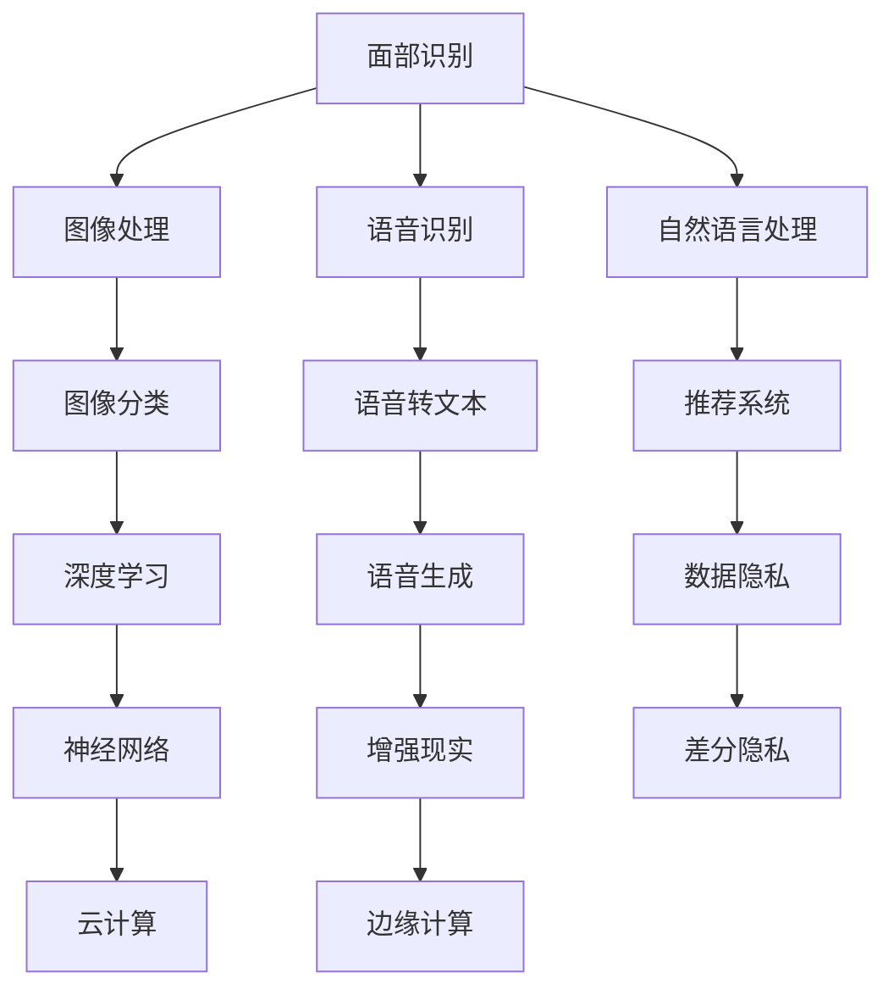

                 

# 李开复：苹果发布AI应用的趋势

## 1. 背景介绍

在人工智能(AI)领域，苹果公司一向以神秘著称。但最近，苹果发布了其最新的人工智能应用，这标志着苹果在AI领域的深度参与和大规模布局。本文将详细探讨苹果在AI领域的最新进展，分析其应用趋势，并探讨这些应用对行业和消费者可能产生的影响。

## 2. 核心概念与联系

### 2.1 核心概念概述

苹果在人工智能领域的核心概念主要包括以下几个方面：

- **AI与机器学习**：苹果在其设备和服务中广泛应用机器学习技术，如面部识别、语音识别和图像识别等，以提升用户体验和设备智能化水平。
- **深度学习与神经网络**：苹果利用深度学习技术，优化其产品中的各种功能，包括自然语言处理、图像分类和推荐系统等。
- **数据隐私和安全**：苹果高度重视用户数据隐私和安全，在AI应用中采取了多项措施，如差分隐私和端到端加密等，以保护用户数据。
- **自动化与增强现实(AR)**：苹果通过AI技术驱动的增强现实应用，为用户提供沉浸式的交互体验，如苹果眼镜等。
- **云计算与边缘计算**：苹果通过其Apple M1芯片和云计算服务，支持AI应用的运行和优化，提升AI应用的性能和效率。

### 2.2 核心概念原理和架构的 Mermaid 流程图



## 3. 核心算法原理 & 具体操作步骤

### 3.1 算法原理概述

苹果的AI应用主要基于深度学习和机器学习算法。其核心算法原理可以概述如下：

- **卷积神经网络(CNN)**：用于图像处理和分类任务，如人脸识别和图像分类。
- **循环神经网络(RNN)**：用于处理序列数据，如语音识别和自然语言处理。
- **生成对抗网络(GAN)**：用于图像和语音生成任务，如面部生成和语音合成。
- **强化学习**：用于优化推荐系统和自动化控制，提升用户体验和设备智能化水平。

### 3.2 算法步骤详解

苹果的AI应用开发过程一般包括以下步骤：

1. **数据收集与预处理**：收集大量标注数据，并进行数据清洗、标准化和归一化处理。
2. **模型选择与设计**：选择合适的深度学习模型或神经网络结构，并设计合适的损失函数和优化器。
3. **模型训练与验证**：在标注数据上训练模型，并在验证集上评估模型性能，调整模型参数。
4. **模型部署与优化**：将训练好的模型部署到设备或云端，并不断优化模型性能，提升用户体验。
5. **隐私保护与合规**：确保用户数据的安全和隐私，符合相关法律法规，如GDPR和CCPA等。

### 3.3 算法优缺点

苹果的AI应用具有以下优点：

- **用户体验**：通过AI技术，苹果设备能提供更加智能和个性化的用户体验。
- **设备智能化**：AI技术的应用使得苹果设备在自动驾驶、医疗健康等场景中具有更强的智能化水平。
- **数据隐私**：苹果高度重视用户数据隐私和安全，通过差分隐私和端到端加密等措施保护用户数据。

但其缺点也较为明显：

- **算法复杂度**：深度学习和机器学习算法的复杂度较高，需要大量计算资源和专业人才支持。
- **数据依赖**：AI应用高度依赖标注数据，数据获取和处理成本较高。
- **隐私风险**：在处理大量用户数据时，数据隐私和安全问题不容忽视，需要采取多项措施保护用户隐私。

### 3.4 算法应用领域

苹果的AI应用广泛涵盖以下领域：

- **硬件**：如苹果设备中的面部识别、图像分类和语音识别等，提升设备智能化水平。
- **软件**：如Siri语音助手、Apple News推荐系统和Apple Pay支付系统等，提升用户体验。
- **服务**：如苹果的地图服务、天气预报和健康跟踪服务等，提供更为精准和智能的服务。
- **自动驾驶**：苹果在自动驾驶领域的AI应用，如自动驾驶汽车和自动驾驶自行车等，提升了交通系统的智能化水平。
- **增强现实**：如苹果眼镜等增强现实应用，提供了沉浸式的交互体验。

## 4. 数学模型和公式 & 详细讲解 & 举例说明

### 4.1 数学模型构建

苹果的AI应用模型通常基于以下数学模型：

- **线性回归模型**：用于处理连续型数据，如价格预测和天气预报等。
- **逻辑回归模型**：用于分类任务，如垃圾邮件识别和恶意软件检测等。
- **支持向量机(SVM)**：用于分类和回归任务，如文本分类和图像分类等。
- **卷积神经网络(CNN)**：用于图像处理和分类任务，如人脸识别和图像分类等。
- **循环神经网络(RNN)**：用于处理序列数据，如语音识别和自然语言处理等。
- **生成对抗网络(GAN)**：用于图像和语音生成任务，如面部生成和语音合成等。

### 4.2 公式推导过程

以卷积神经网络(CNN)为例，其公式推导过程如下：

$$
f(x) = W_1 * g(x) + b_1
$$

其中，$W_1$为卷积核，$g(x)$为激活函数，$b_1$为偏置项。

### 4.3 案例分析与讲解

以苹果设备中的面部识别为例，其工作原理如下：

1. **数据收集**：收集用户面部图像数据，并进行数据清洗和标准化处理。
2. **模型训练**：使用CNN模型对数据进行训练，优化模型参数，提升识别精度。
3. **模型部署**：将训练好的模型部署到设备中，实现实时面部识别功能。
4. **性能优化**：对模型进行优化，提升识别速度和准确性，提升用户体验。

## 5. 项目实践：代码实例和详细解释说明

### 5.1 开发环境搭建

苹果的AI应用开发通常基于以下开发环境：

- **macOS**：使用macOS平台进行AI应用的开发和测试。
- **Python**：使用Python语言进行数据处理和模型训练。
- **PyTorch**：使用PyTorch深度学习框架进行模型开发。
- **OpenCV**：使用OpenCV库进行图像处理和分析。
- **TensorFlow**：使用TensorFlow深度学习框架进行模型训练和优化。

### 5.2 源代码详细实现

以面部识别为例，其Python代码实现如下：

```python
import torch
import torchvision
import torchvision.transforms as transforms

# 加载数据集
transform = transforms.Compose(
    [transforms.ToTensor(),
     transforms.Normalize((0.5, 0.5, 0.5), (0.5, 0.5, 0.5))])

trainset = torchvision.datasets.CIFAR10(root='./data', train=True,
                                        download=True, transform=transform)
trainloader = torch.utils.data.DataLoader(trainset, batch_size=4,
                                          shuffle=True, num_workers=2)

testset = torchvision.datasets.CIFAR10(root='./data', train=False,
                                       download=True, transform=transform)
testloader = torch.utils.data.DataLoader(testset, batch_size=4,
                                         shuffle=False, num_workers=2)

# 定义模型
model = torchvision.models.resnet18(pretrained=False)

# 定义优化器和损失函数
criterion = torch.nn.CrossEntropyLoss()
optimizer = torch.optim.SGD(model.parameters(), lr=0.001, momentum=0.9)

# 训练模型
for epoch in range(2):  # 多次迭代
    running_loss = 0.0
    for i, data in enumerate(trainloader, 0):
        inputs, labels = data
        optimizer.zero_grad()
        outputs = model(inputs)
        loss = criterion(outputs, labels)
        loss.backward()
        optimizer.step()
        running_loss += loss.item()
        if i % 2000 == 1999:    # 每2000个小批次打印一次日志
            print('[%d, %5d] loss: %.3f' %
                  (epoch + 1, i + 1, running_loss / 2000))
            running_loss = 0.0

# 测试模型
correct = 0
total = 0
with torch.no_grad():
    for data in testloader:
        images, labels = data
        outputs = model(images)
        _, predicted = torch.max(outputs.data, 1)
        total += labels.size(0)
        correct += (predicted == labels).sum().item()

print('Accuracy of the network on the 10000 test images: %d %%' % (
    100 * correct / total))
```

### 5.3 代码解读与分析

上述代码实现了一个简单的卷积神经网络(CNN)模型，用于CIFAR-10数据集中的图像分类任务。代码主要分为以下几个部分：

1. **数据集加载**：使用torchvision库加载CIFAR-10数据集，并进行标准化和归一化处理。
2. **模型定义**：定义一个ResNet-18模型，并进行预训练。
3. **优化器和损失函数**：定义SGD优化器和交叉熵损失函数。
4. **模型训练**：使用训练集对模型进行训练，并输出训练过程中的损失值。
5. **模型测试**：使用测试集对模型进行测试，并输出测试集上的准确率。

## 6. 实际应用场景

### 6.1 智能家居

苹果的AI应用在智能家居领域也有广泛应用。如智能音箱可以通过语音识别技术，与用户进行自然语言交互，进行音乐播放、天气查询等操作。智能温控系统可以通过图像识别技术，实时监测家中温度变化，并通过AI算法自动调节室内温度，提升居住舒适度。

### 6.2 自动驾驶

苹果在自动驾驶领域的AI应用，如Apple Car，将深度学习和机器学习技术应用于车辆感知、决策和控制等多个环节。通过图像识别、目标检测、路径规划和避障等技术，使得自动驾驶车辆具备更高的智能水平和安全性。

### 6.3 医疗健康

苹果在医疗健康领域的AI应用，如Apple Watch，可以通过健康追踪和数据分析，为用户提供个性化的健康建议和预警。通过机器学习算法，对用户的运动数据、心率数据和睡眠数据进行分析，预测用户的健康风险，并提供相应的健康管理方案。

## 7. 工具和资源推荐

### 7.1 学习资源推荐

1. **Coursera**：提供多门AI和机器学习课程，涵盖深度学习、强化学习、自然语言处理等多个领域。
2. **Udacity**：提供AI纳米学位课程，包括机器学习、计算机视觉和自动驾驶等多个方向。
3. **斯坦福大学深度学习课程**：由斯坦福大学教授Andrew Ng主讲，介绍深度学习和机器学习的基本概念和应用。
4. **Kaggle**：提供大量数据集和竞赛，帮助学习者提升AI和机器学习技能。

### 7.2 开发工具推荐

1. **PyTorch**：深度学习框架，提供丰富的深度学习库和工具。
2. **TensorFlow**：深度学习框架，支持多种深度学习模型和算法。
3. **OpenCV**：计算机视觉库，提供图像处理和分析功能。
4. **Keras**：深度学习库，提供高层次的API，支持快速原型设计和模型部署。
5. **Jupyter Notebook**：交互式编程环境，支持Python代码的开发和调试。

### 7.3 相关论文推荐

1. **Deep Learning**：由Ian Goodfellow等编著，介绍深度学习的基本概念和算法。
2. **Pattern Recognition and Machine Learning**：由Christopher Bishop编著，涵盖机器学习和模式识别的基础知识和应用。
3. **Artificial Intelligence: A Modern Approach**：由Stuart Russell和Peter Norvig编著，介绍人工智能的基本概念和应用。

## 8. 总结：未来发展趋势与挑战

### 8.1 研究成果总结

苹果在AI领域的深度参与和大规模布局，已经取得了显著的进展。其AI应用覆盖了多个领域，包括面部识别、语音识别、自然语言处理、图像分类和自动驾驶等，提升了设备智能化水平和用户体验。

### 8.2 未来发展趋势

未来，苹果的AI应用将继续在多个领域扩展，提升设备的智能化水平和用户体验。以下是一些可能的发展趋势：

1. **AI芯片**：苹果将继续研发和优化AI芯片，提升其计算能力和能效比，支持更多的AI应用。
2. **增强现实**：苹果将进一步发展增强现实技术，为用户提供更加沉浸式的交互体验，如苹果眼镜等。
3. **自动驾驶**：苹果将进一步推动自动驾驶技术的发展，提升交通系统的智能化水平。
4. **医疗健康**：苹果将继续发展健康追踪和数据分析技术，提升用户的健康管理水平。
5. **个性化推荐**：苹果将继续优化推荐系统，为用户提供更加个性化的服务和产品。

### 8.3 面临的挑战

尽管苹果在AI领域取得了显著进展，但仍面临以下挑战：

1. **数据获取和处理**：AI应用高度依赖标注数据，数据获取和处理成本较高，且数据隐私和安全问题不容忽视。
2. **算法复杂度**：深度学习和机器学习算法的复杂度较高，需要大量计算资源和专业人才支持。
3. **模型部署和优化**：将训练好的模型部署到设备或云端，并不断优化模型性能，提升用户体验，仍需不断努力。
4. **用户隐私保护**：在处理大量用户数据时，数据隐私和安全问题不容忽视，需要采取多项措施保护用户隐私。

### 8.4 研究展望

未来的AI研究将更加注重模型可解释性、用户隐私保护和伦理道德约束。以下是一些可能的研究方向：

1. **模型可解释性**：研究如何使AI模型具备更强的可解释性，增强用户对模型决策的理解和信任。
2. **用户隐私保护**：研究如何保护用户数据隐私和安全，确保数据使用的合法性和合规性。
3. **伦理道德约束**：研究如何制定AI伦理道德规范，避免算法的偏见和歧视，确保AI技术的公平性和公正性。

## 9. 附录：常见问题与解答

**Q1: 苹果的AI应用主要基于哪些技术和算法？**

A: 苹果的AI应用主要基于深度学习和机器学习算法，包括卷积神经网络(CNN)、循环神经网络(RNN)、生成对抗网络(GAN)和强化学习等。

**Q2: 苹果的AI应用在哪些领域有广泛应用？**

A: 苹果的AI应用广泛涵盖智能家居、自动驾驶、医疗健康和个性化推荐等多个领域。

**Q3: 苹果的AI应用开发通常需要哪些技术和工具？**

A: 苹果的AI应用开发通常需要深度学习框架、计算机视觉库、交互式编程环境和数据处理工具等，如PyTorch、TensorFlow、OpenCV和Jupyter Notebook等。

**Q4: 苹果的AI应用面临哪些挑战？**

A: 苹果的AI应用面临数据获取和处理成本高、算法复杂度高、模型部署和优化困难以及用户隐私保护等问题。

**Q5: 苹果的AI应用未来可能有哪些发展趋势？**

A: 苹果的AI应用未来可能的发展趋势包括AI芯片的研发和优化、增强现实技术的发展、自动驾驶技术的发展、健康追踪和数据分析技术的提升以及个性化推荐系统的优化等。

