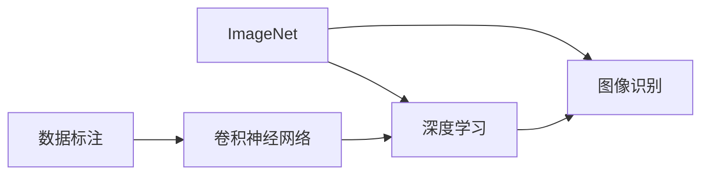

                 

## 1. 背景介绍

在人工智能的历史长河中，有一对夫妇的名字被频繁提及——李飞飞和她的丈夫，杰弗里·辛顿。他们共同推动了深度学习的发展，其中李飞飞在ImageNet项目上的贡献尤为突出。ImageNet不仅改变了计算机视觉领域的面貌，更是推动了整个深度学习技术的成熟和应用。

## 2. 核心概念与联系

### 2.1 核心概念概述

ImageNet是一个大规模的图像识别数据库，由斯坦福大学计算机视觉实验室发布。ImageNet的核心目标是将大量的图像数据标记，并用于训练深度学习模型，特别是在图像识别任务上。ImageNet项目由李飞飞领导，涵盖大量的图像和相应的标签，是深度学习模型训练的重要数据来源。

- **ImageNet**：一个包含超过一百万张图像的视觉识别数据库，涵盖1000个类别的图像。
- **深度学习**：一种基于多层神经网络的机器学习方法，通过自动化的特征学习，实现复杂的非线性映射。
- **图像识别**：计算机视觉领域的重要任务，识别图像中的物体或场景。
- **数据标注**：对数据进行标记的过程，是深度学习训练的基础。
- **卷积神经网络(CNN)**：一种常用的深度学习模型，广泛应用于图像识别等计算机视觉任务。

这些核心概念通过ImageNet项目紧密联系在一起，推动了深度学习技术的突破和应用。

### 2.2 核心概念原理和架构的 Mermaid 流程图



这个流程图展示了这些核心概念之间的联系和相互影响。ImageNet项目提供了大量标注数据，作为深度学习模型的训练样本，训练出的卷积神经网络被广泛应用于图像识别任务。

## 3. 核心算法原理 & 具体操作步骤

### 3.1 算法原理概述

ImageNet的贡献主要体现在以下几个方面：

1. **大规模数据集**：ImageNet提供了超过一百万张图像和1000个类别的标注数据，使得深度学习模型可以从大规模数据中学习到更加丰富的特征。
2. **数据标注的标准化**：ImageNet采用严格的标注标准，确保数据的一致性和可靠性，有助于提升模型的泛化能力。
3. **深度学习的突破**：ImageNet推动了深度学习技术的成熟，使得卷积神经网络等深度学习模型在图像识别任务上取得了显著的性能提升。

### 3.2 算法步骤详解

1. **数据收集与标注**：ImageNet项目从互联网收集图像，并邀请大量志愿者进行标注。标注过程采用严格的审核机制，确保数据的准确性和一致性。
2. **模型训练**：使用ImageNet数据集训练深度学习模型，特别是卷积神经网络。模型在ImageNet上的表现成为衡量其性能的重要指标。
3. **模型评估**：在ImageNet数据集上评估深度学习模型的性能，使用准确率、召回率等指标。评估结果为后续模型的改进提供指导。
4. **应用推广**：将训练好的模型应用于实际问题中，如物体识别、场景理解等，推动深度学习技术的实际应用。

### 3.3 算法优缺点

**优点**：

- **大规模数据**：ImageNet提供了大规模数据集，有助于训练出性能更强的深度学习模型。
- **标注标准化**：严格的标注过程确保了数据的一致性，提升了模型的泛化能力。
- **推动技术发展**：ImageNet项目推动了深度学习技术的成熟和应用，加速了人工智能的发展。

**缺点**：

- **数据来源复杂**：大规模数据集来自互联网，质量参差不齐，可能需要额外的清洗和处理。
- **标注工作量大**：大量图像的标注需要大量人力和时间，成本较高。
- **数据偏见**：大规模数据集可能存在偏见，影响模型的公平性和鲁棒性。

### 3.4 算法应用领域

ImageNet项目的应用领域主要集中在计算机视觉领域，推动了图像识别、场景理解、物体检测等任务的进展。此外，ImageNet还促进了深度学习技术在其他领域的广泛应用，如自然语言处理、语音识别、自动驾驶等。

## 4. 数学模型和公式 & 详细讲解 & 举例说明

### 4.1 数学模型构建

ImageNet项目涉及的数学模型主要集中在卷积神经网络（CNN）和图像识别任务上。CNN模型通常由多个卷积层、池化层和全连接层组成，用于提取和处理图像特征。

### 4.2 公式推导过程

以卷积层为例，卷积层的公式推导如下：

$$
f(x) = \sigma(w*x + b)
$$

其中，$w$ 为卷积核权重，$x$ 为输入图像，$b$ 为偏置项，$\sigma$ 为激活函数。

### 4.3 案例分析与讲解

使用ImageNet数据集训练的ResNet模型，取得了在图像识别任务上的最先进性能。ResNet通过引入残差连接，解决了深度网络训练过程中的梯度消失问题，提高了模型的深度和性能。

## 5. 项目实践：代码实例和详细解释说明

### 5.1 开发环境搭建

开发ImageNet项目需要使用Python和深度学习框架，如TensorFlow或PyTorch。以下是基本开发环境的搭建步骤：

1. 安装Anaconda：
```
conda create -n tf-env python=3.8
conda activate tf-env
```

2. 安装TensorFlow或PyTorch：
```
pip install tensorflow
# 或者
pip install torch
```

3. 安装必要的库：
```
pip install numpy matplotlib scikit-image
```

### 5.2 源代码详细实现

以下是一个使用TensorFlow进行ImageNet数据集标注的示例代码：

```python
import tensorflow as tf
import numpy as np
from sklearn.model_selection import train_test_split
from tensorflow.keras.preprocessing.image import ImageDataGenerator

# 加载图像数据
train_data = tf.keras.preprocessing.image_dataset_from_directory(
    'path/to/train/directory',
    validation_split=0.2,
    subset='training',
    seed=123,
    image_size=(224, 224),
    batch_size=32)

# 定义模型
model = tf.keras.Sequential([
    tf.keras.layers.Conv2D(32, (3, 3), activation='relu', input_shape=(224, 224, 3)),
    tf.keras.layers.MaxPooling2D((2, 2)),
    tf.keras.layers.Conv2D(64, (3, 3), activation='relu'),
    tf.keras.layers.MaxPooling2D((2, 2)),
    tf.keras.layers.Flatten(),
    tf.keras.layers.Dense(64, activation='relu'),
    tf.keras.layers.Dense(10, activation='softmax')
])

# 编译模型
model.compile(optimizer='adam', loss='categorical_crossentropy', metrics=['accuracy'])

# 训练模型
history = model.fit(train_data, epochs=10)
```

### 5.3 代码解读与分析

这段代码展示了如何使用TensorFlow进行图像数据集的加载、模型定义和训练。其中，`ImageDataGenerator`用于生成数据集，`Sequential`用于定义模型结构，`compile`和`fit`分别用于模型编译和训练。

### 5.4 运行结果展示

训练完成后，可以通过`history`对象查看训练过程中的损失和准确率曲线，以评估模型的性能。

## 6. 实际应用场景

### 6.1 智能图像搜索

智能图像搜索系统通过训练好的深度学习模型，对用户上传的图像进行识别和分类，返回最相关的图像搜索结果。ImageNet训练的模型可以在图像搜索系统中直接应用，提升搜索的准确性和效率。

### 6.2 医疗影像诊断

在医疗影像诊断中，深度学习模型能够对X光片、CT扫描等影像进行自动分析，识别异常区域。ImageNet训练的模型可以在医疗影像分析系统中进行迁移学习，提高诊断的准确性和效率。

### 6.3 自动驾驶

自动驾驶技术依赖于计算机视觉和深度学习模型，对车辆周围的环境进行感知和理解。ImageNet训练的模型可以在自动驾驶系统中进行迁移学习，提升系统的感知能力和决策水平。

### 6.4 未来应用展望

未来，ImageNet将推动更多领域的应用，如工业检测、农业识别、安全监控等。深度学习技术将在这些领域发挥更大的作用，提升效率和准确性，推动技术进步和产业发展。

## 7. 工具和资源推荐

### 7.1 学习资源推荐

1. **TensorFlow官方文档**：详细介绍了TensorFlow的用法和深度学习模型的训练流程。
2. **PyTorch官方文档**：提供了PyTorch的使用指南和深度学习模型的构建方法。
3. **深度学习入门**：由李飞飞和杨立昆共同撰写的经典书籍，详细介绍了深度学习的基础知识和实际应用。
4. **计算机视觉入门**：由李飞飞和杰弗里·辛顿撰写的入门书籍，涵盖了计算机视觉的基础知识和应用。

### 7.2 开发工具推荐

1. **TensorFlow**：开源的深度学习框架，支持大规模分布式训练和模型部署。
2. **PyTorch**：基于Python的深度学习框架，支持动态图和静态图计算图。
3. **Jupyter Notebook**：开源的交互式编程环境，支持Python和深度学习代码的编写和调试。
4. **TensorBoard**：开源的可视化工具，用于监控和分析深度学习模型的训练过程。

### 7.3 相关论文推荐

1. **ImageNet Classification with Deep Convolutional Neural Networks**：李飞飞等人撰写的论文，详细介绍了ImageNet项目和深度学习模型在图像识别任务上的应用。
2. **ResNet: Deep Residual Learning for Image Recognition**：何凯明等人撰写的论文，介绍了ResNet模型在图像识别任务上的突破。
3. **Understanding the difficulty of training deep feedforward neural networks**：杨立昆和杰弗里·辛顿等人撰写的论文，探讨了深度神经网络训练过程中的梯度消失问题。

## 8. 总结：未来发展趋势与挑战

### 8.1 研究成果总结

ImageNet项目通过大规模数据集和严格的标注标准，推动了深度学习技术在计算机视觉领域的应用和发展。ImageNet训练的模型在多个领域取得了显著的性能提升，成为深度学习模型训练的重要数据来源。

### 8.2 未来发展趋势

未来，ImageNet将继续推动深度学习技术在更多领域的应用，如医疗、自动驾驶、智能搜索等。深度学习技术将在这些领域发挥更大的作用，提升效率和准确性，推动技术进步和产业发展。

### 8.3 面临的挑战

1. **数据隐私**：大规模数据集的来源复杂，可能涉及用户隐私和版权问题。如何在保证数据隐私的前提下，获取高质量标注数据，是一个重要的挑战。
2. **模型公平性**：深度学习模型可能存在偏见，影响其公平性和鲁棒性。如何在模型设计和使用过程中，确保其公平性和可靠性，是一个重要的研究方向。
3. **模型解释性**：深度学习模型通常是"黑盒"系统，难以解释其内部工作机制。如何提高模型的可解释性，增强用户的信任和接受度，是一个重要的研究方向。
4. **资源消耗**：深度学习模型通常需要大量的计算资源和存储空间，如何在保证性能的同时，优化资源消耗，是一个重要的挑战。

### 8.4 研究展望

1. **数据隐私保护**：开发隐私保护的数据采集和标注技术，确保数据的使用符合法律法规和用户隐私要求。
2. **模型公平性**：引入公平性约束，在模型设计和训练过程中，确保模型的公平性和鲁棒性。
3. **模型解释性**：开发可解释的深度学习模型，增强模型的透明性和可解释性。
4. **资源优化**：优化深度学习模型的计算图和模型结构，提升模型的计算效率和资源利用率。

总之，ImageNet项目在深度学习领域具有重要地位，推动了计算机视觉和深度学习技术的突破和应用。未来，我们需要面对更多的挑战，推动技术的进一步发展和应用。

## 9. 附录：常见问题与解答

**Q1：ImageNet项目的核心贡献是什么？**

A: ImageNet项目的核心贡献主要体现在以下几个方面：
- 提供大规模数据集：ImageNet提供了超过一百万张图像和1000个类别的标注数据，使得深度学习模型可以从大规模数据中学习到更加丰富的特征。
- 推动深度学习技术成熟：ImageNet推动了深度学习技术的成熟，使得卷积神经网络等深度学习模型在图像识别任务上取得了显著的性能提升。
- 严格的标注标准：ImageNet采用严格的标注标准，确保数据的一致性和可靠性，有助于提升模型的泛化能力。

**Q2：ImageNet项目对计算机视觉领域的影响是什么？**

A: ImageNet项目对计算机视觉领域的影响主要体现在以下几个方面：
- 推动了深度学习技术的发展：ImageNet训练的深度学习模型在计算机视觉任务上取得了显著的性能提升，推动了深度学习技术在计算机视觉领域的应用和发展。
- 提升了图像识别技术的精度：ImageNet训练的模型在图像识别任务上取得了最先进性能，提升了计算机视觉技术的精度和效率。
- 促进了图像处理技术的创新：ImageNet推动了计算机视觉领域的技术创新，如图像搜索、医疗影像分析、自动驾驶等。

**Q3：如何处理大规模数据集的标注工作？**

A: 处理大规模数据集的标注工作通常采用以下方法：
- 众包标注：通过在线平台，将标注任务分发给大量志愿者进行标注。
- 自动标注：利用计算机视觉和自然语言处理技术，自动标注数据。
- 半监督学习：利用小部分人工标注数据和大量未标注数据进行联合学习，提高标注效率。

**Q4：在实际应用中，如何提高深度学习模型的公平性和鲁棒性？**

A: 提高深度学习模型的公平性和鲁棒性通常采用以下方法：
- 数据预处理：通过数据清洗和平衡处理，减少数据偏见。
- 模型优化：在模型设计和训练过程中，引入公平性约束和正则化技术，确保模型的公平性和鲁棒性。
- 模型解释：开发可解释的深度学习模型，增强模型的透明性和可解释性。

总之，ImageNet项目在深度学习领域具有重要地位，推动了计算机视觉和深度学习技术的突破和应用。未来，我们需要面对更多的挑战，推动技术的进一步发展和应用。

作者：禅与计算机程序设计艺术 / Zen and the Art of Computer Programming

