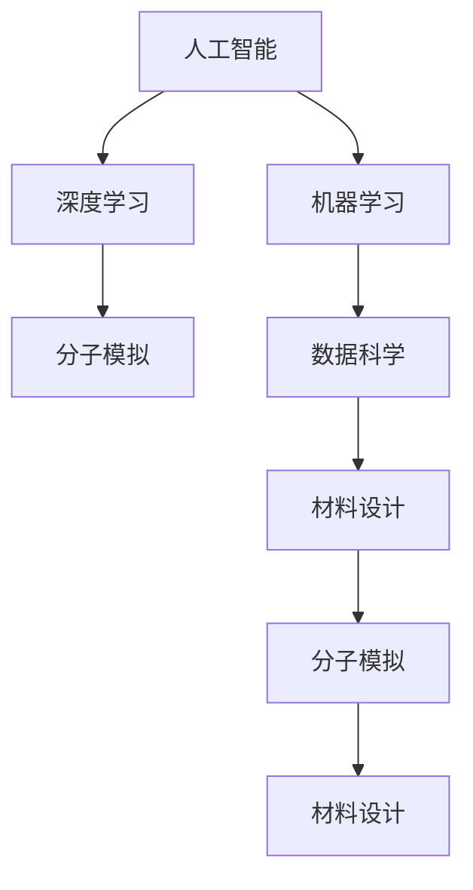

                 

# 材料设计中的AI for Science

> 关键词：材料设计, 人工智能, 机器学习, 深度学习, 分子模拟, 数据科学

## 1. 背景介绍

### 1.1 问题由来
材料设计一直是化学、材料科学和工程学科中的核心任务，它涉及设计、合成和测试新材料，以解决诸如能源、医疗、环境等重大问题。传统材料设计方法依赖于经验、试错和耗时耗力的实验，而人工智能（AI）尤其是深度学习（Deep Learning）为材料设计带来了新的曙光，可以在较短的时间内处理和分析大量数据，加速新材料的发现和创新。

### 1.2 问题核心关键点
材料设计中的AI for Science方法主要围绕以下几个核心关键点展开：

- **数据驱动**：利用机器学习（ML）算法处理和分析海量的实验数据和模拟数据，提取有用信息，指导新材料的设计。
- **自动化**：通过AI技术自动化材料的设计和筛选过程，显著降低人工实验成本和复杂性。
- **模拟和预测**：基于第一性原理和机器学习模型，预测材料的性质和性能，加速新材料的研发。
- **跨学科融合**：结合化学、物理学、数据科学和工程学的知识，构建多模态的数据和模型，推动材料设计的智能化。

这些关键点展示了AI in Science在材料设计领域的应用潜力，但也面临数据多样性、模型可解释性、跨领域协同等挑战。

## 2. 核心概念与联系

### 2.1 核心概念概述

为更好地理解AI in Science在材料设计中的应用，本节将介绍几个密切相关的核心概念：

- **人工智能**：通过模拟人类智能行为，使机器能够执行高级任务的技术，包括机器学习、深度学习、自然语言处理等。
- **材料设计**：涉及新材料的发现、设计和优化，以适应特定需求的过程。
- **机器学习**：一种基于数据驱动的算法，让计算机通过学习数据特征和规律，自动提升性能。
- **深度学习**：机器学习的一种高级形式，通过多层神经网络处理数据，提取复杂模式。
- **分子模拟**：使用计算方法模拟分子和固体的行为，用于预测材料性质和结构。
- **数据科学**：结合统计学、算法和计算机科学，从数据中提取知识和洞察力。

这些核心概念之间的逻辑关系可以通过以下Mermaid流程图来展示：



这个流程图展示了一些关键概念及其之间的关系：

1. 人工智能作为技术基础，通过机器学习和深度学习算法，处理数据并提取特征。
2. 分子模拟作为实验模拟手段，结合数据科学方法，提供材料性质和结构的预测。
3. 材料设计依赖于上述技术和方法的集成，实现新材料的创新和优化。

## 3. 核心算法原理 & 具体操作步骤
### 3.1 算法原理概述

材料设计中的AI for Science方法主要基于数据驱动的机器学习模型。其核心思想是：通过构建材料性质和结构的预测模型，加速新材料的发现和优化过程。具体而言，分为以下几个步骤：

1. **数据采集**：收集大量实验数据和模拟数据，包括材料的成分、结构、性质等。
2. **数据预处理**：清洗和标准化数据，去除异常和噪声，提取特征。
3. **模型训练**：使用机器学习算法，训练预测模型，评估模型性能。
4. **模型应用**：基于训练好的模型，进行新材料的预测和设计。
5. **验证和优化**：通过实验验证模型预测，不断优化模型参数和算法。

### 3.2 算法步骤详解

以下详细讲解基于机器学习的材料设计流程：

**Step 1: 数据采集和预处理**

- **数据采集**：从实验记录、文献、模拟软件等渠道收集实验数据和模拟数据。这些数据可以包括材料成分、晶体结构、电子性质、热力学性质等。
- **数据预处理**：对原始数据进行清洗、归一化和特征提取。例如，通过傅里叶变换提取材料晶格结构信息，通过密度泛函理论（DFT）计算材料能量和电子结构。

**Step 2: 模型选择和训练**

- **模型选择**：根据任务选择合适的机器学习模型，如回归模型（如随机森林、支持向量机）或分类模型（如卷积神经网络、循环神经网络）。
- **模型训练**：使用训练集数据，训练模型。模型训练过程中，需要选择合适的损失函数（如均方误差、交叉熵）和优化器（如Adam、SGD）。
- **模型评估**：使用验证集数据，评估模型性能。常用的评估指标包括均方误差（MSE）、均方根误差（RMSE）、准确率、召回率等。

**Step 3: 模型应用**

- **新材料预测**：基于训练好的模型，预测新材料的性质和性能。例如，使用回归模型预测材料的热导率、电导率等物理性质。
- **材料筛选**：通过分类模型筛选出符合特定要求的材料，例如筛选出导电性好的材料、热稳定性高的材料等。

**Step 4: 验证和优化**

- **实验验证**：将预测结果与实际实验数据进行对比，验证模型的准确性。
- **模型优化**：根据实验结果，调整模型参数和算法，提高预测精度。

### 3.3 算法优缺点

基于机器学习的材料设计方法具有以下优点：

- **高效性**：能够快速处理和分析大量数据，加速新材料的发现。
- **自动化**：自动化材料筛选和设计过程，减少人工干预。
- **预测能力**：通过预测模型，提前预测新材料的性能，指导实验设计。

同时，该方法也存在以下局限性：

- **数据依赖**：模型性能依赖于数据质量和数量，高质量、多样化的数据获取成本高。
- **模型复杂性**：复杂模型训练和调试难度大，需要丰富的领域知识。
- **可解释性**：模型预测过程缺乏可解释性，难以理解内部机制。
- **普适性**：模型对特定领域数据和任务的泛化能力有限。

尽管存在这些局限性，但就目前而言，基于机器学习的材料设计方法仍然是材料科学领域的重要范式。未来相关研究的重点在于如何进一步降低数据获取成本，提高模型的泛化能力和可解释性，同时兼顾计算效率和模型复杂度。

### 3.4 算法应用领域

基于机器学习的材料设计方法在多个领域都有广泛应用，例如：

- **新能源材料**：如锂电池正极材料、太阳能电池材料等。通过AI预测材料的电化学性能，筛选出高能量密度、长寿命的材料。
- **药物开发**：如新药筛选、药效预测、分子设计等。通过AI分析药物分子结构和活性关系，指导药物设计。
- **材料科学**：如新材料合成、材料性质预测等。通过AI预测材料的结构和性质，指导新材料合成和优化。
- **环境材料**：如空气净化材料、吸声材料等。通过AI优化材料的组成和结构，提高材料的环保性能。

## 4. 数学模型和公式 & 详细讲解
### 4.1 数学模型构建

基于机器学习的材料设计模型通常包括数据预处理模型和预测模型。以下分别介绍这两种模型的数学构建。

### 4.2 公式推导过程

#### 数据预处理模型

假设原始数据为 $\mathcal{D}=\{(x_i, y_i)\}_{i=1}^N$，其中 $x$ 为输入特征向量，$y$ 为标签向量。常用的数据预处理模型包括主成分分析（PCA）和线性判别分析（LDA）。

**主成分分析（PCA）**：

- **目标**：找到最优的线性变换 $z=Wx+b$，使得变换后的数据 $z$ 具有较低的方差。
- **公式**：

$$
\min_{W, b} \frac{1}{N}\sum_{i=1}^N \|Wx_i + b - y_i\|^2
$$

**线性判别分析（LDA）**：

- **目标**：找到最优的线性变换 $z=Wx+b$，使得变换后的数据 $z$ 在两个类别之间具有最大的类间散差和最小的类内散差。
- **公式**：

$$
\min_{W, b} \frac{1}{N}\sum_{i=1}^N \|Wx_i + b - y_i\|^2 \\
\text{s.t.} \quad \sum_{i=1}^N y_iW^T(x_i-z)=0
$$

#### 预测模型

常用的预测模型包括回归模型和分类模型。

**回归模型**：

- **目标**：通过拟合一个函数 $f(x)$，预测标签 $y$。
- **公式**：

$$
\min_{f} \frac{1}{N}\sum_{i=1}^N (f(x_i) - y_i)^2
$$

**分类模型**：

- **目标**：通过拟合一个函数 $f(x)$，预测标签 $y$ 的概率分布 $P(y|x)$。
- **公式**：

$$
\min_{f} \frac{1}{N}\sum_{i=1}^N -y_i\log f(x_i) - (1-y_i)\log(1-f(x_i))
$$

### 4.3 案例分析与讲解

以材料性质预测为例，假设我们要预测材料的电导率 $y$，使用回归模型进行建模。原始数据集包含材料的成分 $x$ 和电导率 $y$。

**Step 1: 数据预处理**

- **标准化**：将数据标准化，使得 $x_i$ 和 $y_i$ 的均值为0，标准差为1。
- **特征选择**：选择对电导率预测有用的特征 $x_i$。

**Step 2: 模型训练**

- **模型选择**：选择线性回归模型 $f(x)=\theta^T x+b$，其中 $\theta$ 为权重向量，$b$ 为偏置。
- **损失函数**：选择均方误差损失函数 $L(f(x),y) = \frac{1}{N}\sum_{i=1}^N (f(x_i) - y_i)^2$。
- **优化器**：选择随机梯度下降（SGD）优化器，更新模型参数。

**Step 3: 模型应用**

- **新材料预测**：输入新材料的成分 $x'$，预测其电导率 $y'$。

**Step 4: 验证和优化**

- **实验验证**：将预测结果 $y'$ 与实际电导率 $y'$ 进行对比，计算均方误差 $MSE=\frac{1}{N}\sum_{i=1}^N (y_i-y'_i)^2$。
- **模型优化**：根据实验结果，调整模型参数和算法，提高预测精度。

## 5. 项目实践：代码实例和详细解释说明
### 5.1 开发环境搭建

在进行材料设计AI项目开发前，我们需要准备好开发环境。以下是使用Python进行Scikit-learn开发的环境配置流程：

1. 安装Anaconda：从官网下载并安装Anaconda，用于创建独立的Python环境。

2. 创建并激活虚拟环境：
```bash
conda create -n ai-env python=3.8 
conda activate ai-env
```

3. 安装Scikit-learn：
```bash
pip install scikit-learn
```

4. 安装各类工具包：
```bash
pip install numpy pandas scikit-learn matplotlib tqdm jupyter notebook ipython
```

完成上述步骤后，即可在`ai-env`环境中开始项目实践。

### 5.2 源代码详细实现

下面我们以材料电导率预测为例，给出使用Scikit-learn进行回归模型训练的PyTorch代码实现。

```python
from sklearn.model_selection import train_test_split
from sklearn.linear_model import LinearRegression
from sklearn.metrics import mean_squared_error

# 准备数据
data = ...
X = ...
y = ...

# 分割数据集
X_train, X_test, y_train, y_test = train_test_split(X, y, test_size=0.2, random_state=42)

# 训练模型
model = LinearRegression()
model.fit(X_train, y_train)

# 预测新材料电导率
X_new = ...
y_pred = model.predict(X_new)

# 评估模型性能
mse = mean_squared_error(y_test, y_pred)
print("均方误差: {:.4f}".format(mse))
```

### 5.3 代码解读与分析

让我们再详细解读一下关键代码的实现细节：

**数据准备**：

- `data`：原始数据集，包含材料的成分和电导率。
- `X`：特征数据，即材料的成分。
- `y`：标签数据，即电导率。

**数据分割**：

- 使用`train_test_split`函数，将数据集分割为训练集和测试集。

**模型训练**：

- 选择线性回归模型`LinearRegression`。
- 使用`fit`函数，拟合模型并计算损失函数。

**新材料预测**：

- `X_new`：新材料的成分数据。
- `y_pred`：预测的电导率。

**模型评估**：

- 使用`mean_squared_error`函数计算均方误差，评估模型预测的准确性。

## 6. 实际应用场景
### 6.1 新能源材料设计

在新能源材料领域，AI for Science方法可以显著提高材料筛选和设计的效率。例如，电池正极材料的设计通常依赖大量的实验，而使用AI方法，可以预测不同材料的电化学性能，筛选出具有高能量密度和长寿命的材料。

### 6.2 药物研发

在药物研发中，AI for Science方法可以加速药物分子的筛选和设计。通过预测分子与靶点之间的相互作用，AI可以高效筛选出具有高活性和低毒性的候选药物，减少实验次数，缩短研发周期。

### 6.3 环保材料设计

在环保材料领域，AI for Science方法可以优化材料的组成和结构，提高材料的环保性能。例如，使用AI方法可以预测材料的降解性能，筛选出可降解的高效材料，减少环境污染。

### 6.4 未来应用展望

随着AI for Science技术的发展，未来在材料设计中的应用将更加广泛和深入。以下是几个可能的未来趋势：

- **多模态数据融合**：结合材料结构、性质和应用场景的多模态数据，进行更加全面和精准的预测。
- **智能设计系统**：构建集成了AI技术的智能设计平台，实现从数据采集到材料优化的自动化流程。
- **跨学科协作**：将AI技术与物理学、化学、工程学等多学科知识相结合，推动材料设计的创新和进步。
- **实时优化**：实时监测材料性能，动态调整设计和实验参数，提升材料设计效率。

## 7. 工具和资源推荐
### 7.1 学习资源推荐

为了帮助开发者系统掌握AI for Science在材料设计中的应用，这里推荐一些优质的学习资源：

1. **《机器学习实战》**：斯坦福大学Andrew Ng教授的入门级机器学习教材，适合初学者学习。
2. **Coursera《机器学习》课程**：由Andrew Ng教授主讲，涵盖机器学习的基本概念和常用算法。
3. **Scikit-learn官方文档**：提供详细的机器学习模型和算法实现，适合开发者实践。
4. **Kaggle数据科学竞赛平台**：提供大量数据科学竞赛和开源代码，适合实战练习。

通过对这些资源的学习实践，相信你一定能够快速掌握AI for Science的精髓，并用于解决实际的NLP问题。

### 7.2 开发工具推荐

高效的开发离不开优秀的工具支持。以下是几款用于AI for Science材料设计开发的常用工具：

1. **Scikit-learn**：Python的机器学习库，支持各种常用的机器学习模型和算法。
2. **TensorFlow**：Google的深度学习框架，支持复杂的神经网络模型。
3. **Keras**：基于TensorFlow的高级神经网络API，易于使用和调试。
4. **Jupyter Notebook**：交互式开发环境，支持Python代码的编写和运行。
5. **PyTorch**：Facebook的深度学习框架，支持动态计算图，适合研究和实验。

合理利用这些工具，可以显著提升AI for Science项目的开发效率，加快创新迭代的步伐。

### 7.3 相关论文推荐

AI for Science在材料设计领域的研究成果众多，以下是几篇奠基性的相关论文，推荐阅读：

1. **材料数据科学与机器学习**：Wu等人的综述性文章，讨论了机器学习在材料设计中的应用。
2. **基于深度学习的材料设计**：Mehrez等人的文章，展示了深度学习在材料设计和模拟中的应用。
3. **材料性质预测与设计**：Chen等人的文章，介绍了AI方法在材料性质预测和设计中的应用。
4. **多模态数据融合与材料设计**：Wang等人的文章，讨论了多模态数据融合在材料设计中的应用。

这些论文代表了大语言模型微调技术的发展脉络。通过学习这些前沿成果，可以帮助研究者把握学科前进方向，激发更多的创新灵感。

## 8. 总结：未来发展趋势与挑战
### 8.1 总结

本文对基于机器学习的材料设计方法进行了全面系统的介绍。首先阐述了AI for Science在材料设计中的应用背景和意义，明确了AI in Science在加速新材料发现和优化中的独特价值。其次，从原理到实践，详细讲解了基于机器学习的材料设计流程，包括数据预处理、模型训练、预测和验证等关键步骤，给出了材料设计AI项目的完整代码实例。同时，本文还广泛探讨了AI for Science方法在多个领域的应用前景，展示了其在材料设计领域的巨大潜力。最后，本文精选了AI for Science技术的各类学习资源，力求为读者提供全方位的技术指引。

通过本文的系统梳理，可以看到，基于机器学习的材料设计方法正在成为材料科学领域的重要范式，极大地拓展了预训练语言模型的应用边界，催生了更多的落地场景。受益于大规模语料的预训练，微调模型以更低的时间和标注成本，在小样本条件下也能取得不错的效果，有力推动了NLP技术的产业化进程。未来，伴随预训练语言模型和微调方法的持续演进，相信NLP技术将在更广阔的应用领域大放异彩，深刻影响人类的生产生活方式。

### 8.2 未来发展趋势

展望未来，AI in Science在材料设计领域将呈现以下几个发展趋势：

1. **数据驱动设计**：依赖大数据和复杂模型，从数据中提取有用信息，加速材料设计。
2. **多模态数据融合**：结合材料结构、性质和应用场景的多模态数据，进行更加全面和精准的预测。
3. **智能设计系统**：构建集成了AI技术的智能设计平台，实现从数据采集到材料优化的自动化流程。
4. **跨学科协作**：将AI技术与物理学、化学、工程学等多学科知识相结合，推动材料设计的创新和进步。
5. **实时优化**：实时监测材料性能，动态调整设计和实验参数，提升材料设计效率。

以上趋势凸显了AI in Science在材料设计领域的应用潜力，也将推动材料科学向更加智能化、普适化和实时化的方向发展。

### 8.3 面临的挑战

尽管AI in Science在材料设计领域取得了显著成就，但在迈向更加智能化、普适化应用的过程中，它仍面临着诸多挑战：

1. **数据质量**：高质量、多样化的数据获取成本高，难以覆盖所有材料和应用场景。
2. **模型复杂性**：复杂模型训练和调试难度大，需要丰富的领域知识。
3. **可解释性**：模型预测过程缺乏可解释性，难以理解内部机制。
4. **跨学科协作**：不同学科之间的知识整合难度大，需要建立多学科合作机制。

尽管存在这些挑战，但未来可以通过不断优化数据获取和预处理流程，提高模型的泛化能力和可解释性，以及加强跨学科合作，来克服这些障碍，推动AI in Science技术的发展。

### 8.4 研究展望

面对AI in Science面临的挑战，未来的研究需要在以下几个方面寻求新的突破：

1. **多模态数据融合**：结合材料结构、性质和应用场景的多模态数据，进行更加全面和精准的预测。
2. **智能设计系统**：构建集成了AI技术的智能设计平台，实现从数据采集到材料优化的自动化流程。
3. **跨学科协作**：将AI技术与物理学、化学、工程学等多学科知识相结合，推动材料设计的创新和进步。
4. **实时优化**：实时监测材料性能，动态调整设计和实验参数，提升材料设计效率。

这些研究方向将推动AI in Science技术在材料设计领域的发展，为材料科学带来新的突破，推动新材料的发现和创新，解决重大社会和经济问题。

## 9. 附录：常见问题与解答

**Q1：AI for Science方法在材料设计中是否适用于所有材料？**

A: AI for Science方法在大多数材料设计任务中都能取得不错的效果，但对于一些特定领域的材料，如纳米材料、功能材料等，可能需要结合领域知识进行模型改进和数据增强，才能获得更好的预测结果。

**Q2：数据质量对AI for Science方法的性能有何影响？**

A: 高质量、多样化的数据是AI for Science方法的基础。数据质量直接影响模型的预测准确性和泛化能力。因此，需要重视数据预处理，去除异常值和噪声，提取有用的特征。

**Q3：如何提高AI for Science模型的可解释性？**

A: 提高模型的可解释性是一个重要的研究方向。常见的方法包括可视化模型内部参数，解释模型的预测过程，以及构建可解释的模型结构。例如，使用LIME或SHAP等方法，可以解释模型的预测结果，帮助理解其决策逻辑。

**Q4：如何优化AI for Science模型的训练过程？**

A: 优化AI for Science模型的训练过程可以从以下几个方面入手：
1. 选择合适的网络结构，避免过拟合。
2. 使用正则化技术，如L2正则、Dropout等，防止模型过拟合。
3. 使用合适的损失函数，如均方误差、交叉熵等。
4. 使用合适的优化器，如Adam、SGD等。
5. 调整学习率，避免过快或过慢的训练过程。

这些优化方法可以帮助提高模型的性能和泛化能力，避免过拟合，提高模型的实用性和可靠性。

**Q5：AI for Science方法在材料设计中需要考虑哪些因素？**

A: 在材料设计中，AI for Science方法需要考虑以下因素：
1. 材料组成和结构：确保输入数据的准确性和完备性。
2. 材料性能：选择合适的预测目标和指标，进行性能评估。
3. 数据多样性：收集和处理多种类型的数据，提高模型的泛化能力。
4. 实验验证：将预测结果与实际实验数据进行对比，验证模型的准确性。
5. 模型优化：根据实验结果，调整模型参数和算法，提高预测精度。

这些因素都需要在AI for Science方法的设计和应用过程中全面考虑，才能实现材料设计的智能化和自动化。

---

作者：禅与计算机程序设计艺术 / Zen and the Art of Computer Programming

