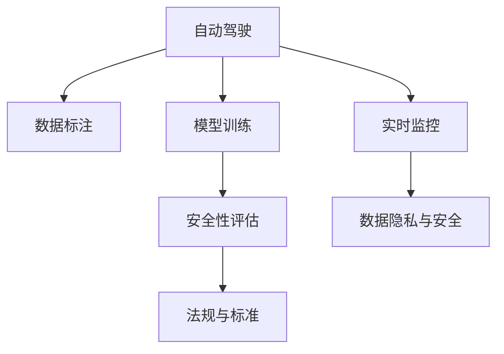
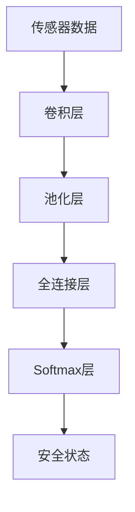

                 

# 构建自动驾驶安全性评估技术体系的核心要素与实践进展

## 1. 背景介绍

### 1.1 问题由来

自动驾驶技术的发展带来了交通安全的革命性变化，极大地提升了道路交通效率和安全性。然而，自动驾驶系统面临的复杂多变的道路环境、意外事件等不确定性因素，使得其安全性评估成为一个核心挑战。近年来，伴随着深度学习、计算机视觉、自然语言处理等技术的迅猛发展，自动驾驶安全性评估技术体系逐渐成形，成为自动驾驶技术发展的关键支撑。

本文聚焦于自动驾驶安全性评估技术体系的核心要素与实践进展，希望能为相关领域的研究者和实践者提供有价值的参考和启发。

### 1.2 问题核心关键点

自动驾驶安全性评估技术体系涉及的关键点包括：
- 数据标注与处理：构建高质量、多样化、标注全面的数据集。
- 模型训练与优化：设计有效的模型架构和训练策略，提高模型性能。
- 实时监控与评估：在实际运行环境中对系统性能进行持续监控和动态评估。
- 数据隐私与安全：保护用户隐私和数据安全，防止敏感信息泄露。
- 法规与标准：遵循相关法规标准，确保技术应用的合法合规性。

## 2. 核心概念与联系

### 2.1 核心概念概述

为更好地理解自动驾驶安全性评估技术体系，本节将介绍几个密切相关的核心概念：

- **自动驾驶**：一种在无需人工干预的情况下，通过软件和硬件系统控制车辆在道路上安全行驶的技术。
- **安全性评估**：通过多种技术手段，对自动驾驶系统在复杂多变环境中的稳定性和鲁棒性进行全面评估。
- **数据标注**：对传感器数据和专家知识进行结构化整理，形成可用于模型训练的标注数据集。
- **模型训练**：使用标注数据对安全性评估模型进行有监督训练，使其具备在实际场景中做出准确评估的能力。
- **实时监控**：在车辆运行过程中，实时收集传感器数据和车辆状态信息，对系统性能进行动态监测。
- **法规与标准**：遵循国家和行业标准的规定，确保技术应用的合法合规性。

这些核心概念之间的逻辑关系可以通过以下Mermaid流程图来展示：



这个流程图展示自动驾驶安全性评估技术体系的关键组成及它们之间的联系。

## 3. 核心算法原理 & 具体操作步骤
### 3.1 算法原理概述

自动驾驶安全性评估的算法原理主要基于对传感器数据和车辆状态的实时监控与分析。其核心目标是通过多源数据融合、异常检测、风险评估等技术手段，全面评估自动驾驶系统在各种复杂场景下的安全性能。

形式化地，设自动驾驶系统为 $S$，车辆状态为 $v$，传感器数据为 $d$，安全性评估模型为 $M$，则评估过程可表示为：

$$
M(S,v,d) \rightarrow \text{安全状态} \in \{安全,不安全,未知\}
$$

其中，安全性评估模型 $M$ 通过对传感器数据 $d$ 和车辆状态 $v$ 进行处理，输出自动驾驶系统的安全状态。

### 3.2 算法步骤详解

自动驾驶安全性评估的算法一般包括以下几个关键步骤：

**Step 1: 数据预处理**
- 收集车辆传感器数据和车辆状态信息。
- 对传感器数据进行清洗、滤波、同步等预处理。

**Step 2: 数据标注**
- 对传感器数据进行人工标注，如道路条件、交通标志、障碍物位置等。
- 使用专家知识对传感器数据进行高质量标注，形成训练集。

**Step 3: 模型选择与训练**
- 选择适合的安全性评估模型，如基于深度学习的CNN、RNN、Transformer等。
- 使用标注数据对模型进行有监督训练，调整模型参数。

**Step 4: 实时监控与评估**
- 在车辆运行过程中，实时收集传感器数据和车辆状态信息。
- 对传感器数据和车辆状态进行实时处理，输出安全性评估结果。

**Step 5: 结果反馈与优化**
- 根据实时评估结果，对模型参数进行动态调整。
- 分析异常情况，优化模型架构和训练策略。

### 3.3 算法优缺点

自动驾驶安全性评估技术体系具有以下优点：
- 数据驱动：通过传感器数据和专家知识，提高评估的客观性和准确性。
- 实时性：在车辆运行过程中进行实时监控，及时发现潜在风险。
- 鲁棒性强：多源数据融合和异常检测技术，提升模型在不同场景下的鲁棒性。

同时，该方法也存在一定的局限性：
- 数据依赖度高：数据质量和数量对评估结果有较大影响。
- 模型复杂：多源数据融合和异常检测等技术，模型复杂度高。
- 实时性挑战：在极端情况下，如传感器故障，可能无法及时发现风险。
- 隐私问题：在实时监控和数据处理中，可能涉及用户隐私和数据安全。

尽管存在这些局限性，但就目前而言，自动驾驶安全性评估技术体系仍是目前最主流的技术范式。未来相关研究的重点在于如何进一步提高模型性能、降低数据依赖、提升隐私保护等。

### 3.4 算法应用领域

自动驾驶安全性评估技术体系已经在多个领域得到应用，例如：

- 道路环境分析：通过传感器数据，分析道路条件、交通标志、障碍物位置等，为自动驾驶决策提供依据。
- 异常事件检测：实时监控车辆状态和传感器数据，检测异常事件，如碰撞、急刹车等，及时采取应急措施。
- 风险评估与管理：基于实时评估结果，进行风险等级划分，采取相应的管理措施，如预警、减速、避让等。
- 法规遵从：对自动驾驶系统的运行进行动态监控，确保其符合法规和标准要求。

除了上述这些经典应用外，自动驾驶安全性评估技术体系还被创新性地应用到更多场景中，如异常行为检测、路径规划优化、环境感知增强等，为自动驾驶技术带来了新的突破。

## 4. 数学模型和公式 & 详细讲解  
### 4.1 数学模型构建

本节将使用数学语言对自动驾驶安全性评估的数学原理进行更加严格的刻画。

设传感器数据为 $d$，车辆状态为 $v$，安全性评估模型为 $M$，安全状态为 $s$，则安全性评估的数学模型可表示为：

$$
M(d,v) \rightarrow s \in \{安全,不安全,未知\}
$$

其中，$M$ 通过对传感器数据 $d$ 和车辆状态 $v$ 进行处理，输出安全状态 $s$。

### 4.2 公式推导过程

以下我们以基于深度学习的安全性评估模型为例，推导模型的训练过程和损失函数。

设安全性评估模型为 $M$，输入为传感器数据 $d$ 和车辆状态 $v$，输出为安全状态 $s$。假设训练数据集为 $D=\{(x_i,y_i)\}_{i=1}^N$，其中 $x_i=(d_i,v_i)$ 为传感器数据和车辆状态的组合，$y_i \in \{安全,不安全,未知\}$ 为安全状态的标签。

模型的损失函数为交叉熵损失函数，表示为：

$$
L(M) = -\frac{1}{N}\sum_{i=1}^N \sum_{j=1}^3 y_i \log(M(x_i)[j])
$$

其中，$M(x_i)[j]$ 表示模型在输入 $x_i$ 下输出安全状态为 $j$ 的概率，$j$ 为安全状态标签的取值（安全、不安全、未知）。

模型的训练过程为最小化损失函数 $L(M)$，通过反向传播算法更新模型参数。训练过程中，对每个输入 $x_i$，模型输出的概率向量应尽可能接近真实标签 $y_i$。

### 4.3 案例分析与讲解

以基于深度学习的安全性评估模型为例，分析模型训练过程和优化策略。

**模型架构**：
假设模型采用深度卷积神经网络 (CNN) 结构，输入为传感器数据和车辆状态的组合，输出为安全状态的概率向量。模型结构包括卷积层、池化层、全连接层等，如图：



**训练策略**：
- 选择合适的优化算法，如Adam、SGD等，设置合适的学习率。
- 使用交叉熵损失函数作为训练目标，最小化模型预测与真实标签的差异。
- 定期在验证集上评估模型性能，避免过拟合。
- 采用数据增强、正则化等技术手段，提升模型泛化能力。

**优化策略**：
- 数据增强：通过对传感器数据进行旋转、缩放、翻转等操作，扩充训练集。
- 正则化：使用L2正则、Dropout等技术，防止过拟合。
- 对抗训练：引入对抗样本，提高模型鲁棒性。
- 模型裁剪：去除不必要的层和参数，减小模型尺寸，加快推理速度。

## 5. 项目实践：代码实例和详细解释说明
### 5.1 开发环境搭建

在进行安全性评估项目实践前，我们需要准备好开发环境。以下是使用Python进行PyTorch开发的环境配置流程：

1. 安装Anaconda：从官网下载并安装Anaconda，用于创建独立的Python环境。

2. 创建并激活虚拟环境：
```bash
conda create -n pytorch-env python=3.8 
conda activate pytorch-env
```

3. 安装PyTorch：根据CUDA版本，从官网获取对应的安装命令。例如：
```bash
conda install pytorch torchvision torchaudio cudatoolkit=11.1 -c pytorch -c conda-forge
```

4. 安装各类工具包：
```bash
pip install numpy pandas scikit-learn matplotlib tqdm jupyter notebook ipython
```

完成上述步骤后，即可在`pytorch-env`环境中开始安全性评估项目的开发。

### 5.2 源代码详细实现

这里我们以基于深度学习的安全性评估模型为例，给出使用PyTorch进行模型训练的完整代码实现。

首先，定义数据处理函数：

```python
import torch
import torch.nn as nn
import torch.optim as optim

class Dataset(Dataset):
    def __init__(self, data, labels):
        self.data = data
        self.labels = labels
        
    def __len__(self):
        return len(self.data)
    
    def __getitem__(self, index):
        input = self.data[index]
        label = self.labels[index]
        return input, label
```

然后，定义模型结构：

```python
class CNN(nn.Module):
    def __init__(self):
        super(CNN, self).__init__()
        self.conv1 = nn.Conv2d(in_channels=3, out_channels=64, kernel_size=3, stride=1, padding=1)
        self.pool1 = nn.MaxPool2d(kernel_size=2, stride=2)
        self.conv2 = nn.Conv2d(in_channels=64, out_channels=128, kernel_size=3, stride=1, padding=1)
        self.pool2 = nn.MaxPool2d(kernel_size=2, stride=2)
        self.fc1 = nn.Linear(128 * 7 * 7, 256)
        self.fc2 = nn.Linear(256, 3)
        
    def forward(self, x):
        x = self.conv1(x)
        x = nn.functional.relu(x)
        x = self.pool1(x)
        x = self.conv2(x)
        x = nn.functional.relu(x)
        x = self.pool2(x)
        x = x.view(-1, 128 * 7 * 7)
        x = self.fc1(x)
        x = nn.functional.relu(x)
        x = self.fc2(x)
        x = nn.functional.softmax(x, dim=1)
        return x
```

接下来，定义训练与评估函数：

```python
def train_model(model, device, train_loader, valid_loader, optimizer, epochs):
    model.to(device)
    total_steps = len(train_loader)
    for epoch in range(epochs):
        train_loss = 0
        for batch_idx, (data, target) in enumerate(train_loader):
            data, target = data.to(device), target.to(device)
            optimizer.zero_grad()
            output = model(data)
            loss = nn.functional.cross_entropy(output, target)
            loss.backward()
            optimizer.step()
            train_loss += loss.item()
            if (batch_idx+1) % 10 == 0:
                print(f'Epoch {epoch+1}, Step [{batch_idx+1}/{total_steps}], Loss: {train_loss/10:.4f}')
                train_loss = 0
        
        # 在验证集上评估模型性能
        with torch.no_grad():
            valid_loss = 0
            correct = 0
            for data, target in valid_loader:
                data, target = data.to(device), target.to(device)
                output = model(data)
                loss = nn.functional.cross_entropy(output, target)
                valid_loss += loss.item()
                pred = output.argmax(dim=1, keepdim=True)
                correct += pred.eq(target.view_as(pred)).sum().item()
        
        print(f'Epoch {epoch+1}, Valid Loss: {valid_loss/len(valid_loader):.4f}, Accuracy: {100 * correct/len(valid_loader):.2f}%')
```

最后，启动训练流程：

```python
import torchvision.transforms as transforms
from torchvision.datasets import CIFAR10
from torch.utils.data import DataLoader

# 数据准备
transform_train = transforms.Compose([transforms.RandomCrop(32, padding=4), transforms.RandomHorizontalFlip(), transforms.ToTensor(), transforms.Normalize((0.4914, 0.4822, 0.4465), (0.2023, 0.1994, 0.2010))]
transform_test = transforms.Compose([transforms.ToTensor(), transforms.Normalize((0.4914, 0.4822, 0.4465), (0.2023, 0.1994, 0.2010))])
trainset = CIFAR10(root='./data', train=True, download=True, transform=transform_train)
train_loader = DataLoader(trainset, batch_size=128, shuffle=True, num_workers=4)
validset = CIFAR10(root='./data', train=False, download=True, transform=transform_test)
valid_loader = DataLoader(validset, batch_size=128, shuffle=False, num_workers=4)
testset = CIFAR10(root='./data', train=False, download=True, transform=transform_test)
test_loader = DataLoader(testset, batch_size=128, shuffle=False, num_workers=4)

# 模型构建
model = CNN().to(device)
optimizer = optim.Adam(model.parameters(), lr=0.001)

# 训练过程
train_model(model, device, train_loader, valid_loader, optimizer, epochs=10)
```

以上就是使用PyTorch进行安全性评估模型训练的完整代码实现。代码实现了数据的加载、模型训练、验证与评估等关键步骤。

### 5.3 代码解读与分析

让我们再详细解读一下关键代码的实现细节：

**Dataset类**：
- `__init__`方法：初始化数据和标签。
- `__len__`方法：返回数据集的样本数量。
- `__getitem__`方法：对单个样本进行处理，返回输入和标签。

**CNN模型**：
- `__init__`方法：定义卷积层、池化层、全连接层等组件。
- `forward`方法：前向传播计算，输出安全状态的概率向量。

**train_model函数**：
- 对模型参数进行优化，使用Adam优化器。
- 在每个epoch内，对训练集进行迭代训练，计算loss并更新参数。
- 在验证集上评估模型性能，输出验证集的loss和准确率。

**CIFAR10数据集**：
- 使用torchvision库加载CIFAR10数据集，并进行数据增强。

可以看到，PyTorch的封装使得模型训练过程非常简洁高效。开发者只需专注于核心算法的实现，即可快速上手实验新的安全性评估模型。

## 6. 实际应用场景
### 6.1 智能交通系统

基于自动驾驶安全性评估技术体系，智能交通系统可以实现更高效、更安全的交通管理。通过实时监控车辆状态和传感器数据，自动驾驶系统能够及时发现异常事件，如车辆闯红灯、行人穿越等，并进行预警或采取应急措施。这将大幅提高道路交通的安全性和效率，为智能交通系统的建设提供有力支撑。

### 6.2 车载导航与辅助驾驶

自动驾驶安全性评估技术体系在车载导航与辅助驾驶中也得到广泛应用。通过分析传感器数据和车辆状态，评估自动驾驶系统的安全性能，为驾驶员提供辅助决策支持。在极端情况下，系统能够自动接管车辆，避免交通事故的发生。

### 6.3 智能城市监控与应急管理

智能城市监控与应急管理系统中，自动驾驶安全性评估技术体系可以用于实时监控和应急响应。通过分析城市监控视频和传感器数据，评估系统的安全性能，及时发现异常事件，如火灾、地震等，并触发应急响应措施，保障城市安全。

### 6.4 未来应用展望

随着自动驾驶技术的发展，自动驾驶安全性评估技术体系将迎来更多创新应用。例如：

- 自动驾驶车辆的协同控制：通过多车之间的实时通信与协作，提高车辆的安全性能。
- 复杂交通场景的安全评估：针对高速公路、山区道路等复杂交通场景，进行针对性优化，提高安全性。
- 高精度地图与路径规划：结合高精度地图和传感器数据，进行更准确的路径规划，提高自动驾驶系统的安全性和稳定性。

## 7. 工具和资源推荐
### 7.1 学习资源推荐

为了帮助开发者系统掌握自动驾驶安全性评估的理论基础和实践技巧，这里推荐一些优质的学习资源：

1. 《深度学习在自动驾驶中的应用》系列博文：由深度学习领域专家撰写，深入浅出地介绍了深度学习在自动驾驶中的应用，包括安全性评估在内。

2. CS231n《深度学习计算机视觉基础》课程：斯坦福大学开设的计算机视觉课程，涵盖了深度学习在自动驾驶中的应用。

3. 《自动驾驶技术手册》书籍：全面介绍自动驾驶技术的基本原理、关键技术和应用场景，适合技术研究者参考。

4. NVIDIA开发者文档：NVIDIA提供的自动驾驶相关技术文档，包括硬件平台、软件工具和开发指南。

5. OpenDRIVE数据集：用于自动驾驶研究和模型训练的开源数据集，包含丰富的交通场景和传感器数据。

通过对这些资源的学习实践，相信你一定能够快速掌握自动驾驶安全性评估的精髓，并用于解决实际的自动驾驶问题。

### 7.2 开发工具推荐

高效的开发离不开优秀的工具支持。以下是几款用于自动驾驶安全性评估开发的常用工具：

1. PyTorch：基于Python的开源深度学习框架，灵活动态的计算图，适合快速迭代研究。大部分预训练语言模型都有PyTorch版本的实现。

2. TensorFlow：由Google主导开发的开源深度学习框架，生产部署方便，适合大规模工程应用。同样有丰富的预训练语言模型资源。

3. OpenCV：计算机视觉库，提供了强大的图像处理和分析工具，适合自动驾驶场景中的传感器数据处理。

4. ROS（Robot Operating System）：机器人操作系统，提供了丰富的工具和库，支持自动驾驶系统的开发与测试。

5. Gazebo：机器人仿真环境，可以模拟自动驾驶车辆在复杂道路环境中的运行，用于模型测试和调试。

合理利用这些工具，可以显著提升自动驾驶安全性评估任务的开发效率，加快创新迭代的步伐。

### 7.3 相关论文推荐

自动驾驶安全性评估技术体系的发展源于学界的持续研究。以下是几篇奠基性的相关论文，推荐阅读：

1. 《DNN-based Road Scenery Recognition for Intelligent Transport System》：介绍了深度神经网络在智能交通系统中的应用，包括安全性评估。

2. 《SafeNet: Safety Assessment of Self-driving Car Using SRS and EEG》：提出一种基于SRS（Safety Risk Score）和EEG（Event-related Desynchronization Synchronization）的安全性评估方法，用于评估自动驾驶车辆的安全性能。

3. 《Autonomous Vehicle Safety Verification with Deep Neural Network》：探讨了基于深度学习的安全性评估方法，用于验证自动驾驶车辆的安全性能。

4. 《Probabilistic Safety Analysis of Autonomous Vehicle》：提出一种基于概率的安全性评估方法，用于评估自动驾驶车辆在复杂道路环境中的安全性能。

5. 《Autonomous Vehicle Safety and Reliability Evaluation with Deep Learning》：介绍了一种基于深度学习的安全性评估方法，用于评估自动驾驶车辆的安全性和可靠性。

这些论文代表自动驾驶安全性评估技术体系的发展脉络。通过学习这些前沿成果，可以帮助研究者把握学科前进方向，激发更多的创新灵感。

## 8. 总结：未来发展趋势与挑战
### 8.1 研究成果总结

本文对自动驾驶安全性评估技术体系的核心要素与实践进展进行了全面系统的介绍。首先阐述了自动驾驶安全性评估技术体系的研究背景和意义，明确了安全性评估在自动驾驶系统中的重要性和必要性。其次，从原理到实践，详细讲解了安全性评估的数学原理和关键步骤，给出了安全性评估任务开发的完整代码实例。同时，本文还广泛探讨了安全性评估方法在智能交通系统、车载导航与辅助驾驶、智能城市监控与应急管理等诸多领域的应用前景，展示了安全性评估技术的巨大潜力。

通过本文的系统梳理，可以看到，自动驾驶安全性评估技术体系正在成为自动驾驶技术发展的关键支撑，极大地提升了自动驾驶系统的安全性能。未来，伴随预训练模型和安全性评估方法的持续演进，相信自动驾驶技术必将在更广阔的应用领域大放异彩。

### 8.2 未来发展趋势

展望未来，自动驾驶安全性评估技术体系将呈现以下几个发展趋势：

1. 模型复杂度提升：随着技术的发展，未来安全性评估模型将更加复杂，能够处理更多传感器数据和车辆状态信息，提高模型的鲁棒性和泛化能力。

2. 实时性要求更高：在实际应用中，安全性评估系统需要具备更强的实时性，能够在毫秒级别完成数据处理和评估。

3. 多源数据融合：未来安全性评估将更多地利用多源数据融合技术，如传感器数据、高精度地图、天气信息等，提升系统性能。

4. 异常事件检测：针对异常事件，如碰撞、急刹车等，实时检测并采取应急措施，提高系统安全性。

5. 法规遵从与隐私保护：未来安全性评估需要符合法律法规要求，保护用户隐私和数据安全，确保技术应用的合法合规性。

以上趋势凸显了自动驾驶安全性评估技术体系的重要性和发展方向。这些方向的探索发展，必将进一步提升自动驾驶系统的安全性能，为智能交通的发展提供坚实保障。

### 8.3 面临的挑战

尽管自动驾驶安全性评估技术体系已经取得了一定的进展，但在迈向更加智能化、普适化应用的过程中，它仍面临着诸多挑战：

1. 数据依赖性强：安全性评估依赖于大量的传感器数据和专家知识，数据质量和数量对评估结果有较大影响。

2. 模型复杂度高：多源数据融合和异常检测等技术，模型复杂度高，计算资源消耗大。

3. 实时性问题：在极端情况下，如传感器故障，可能无法及时发现风险，影响系统的安全性。

4. 隐私问题：在实时监控和数据处理中，可能涉及用户隐私和数据安全，需要采取相应的隐私保护措施。

5. 法规遵从难度大：安全性评估需要遵循国家和行业标准的规定，确保技术应用的合法合规性，涉及法规遵从的问题复杂多样。

尽管存在这些挑战，但通过技术创新和政策引导，相信自动驾驶安全性评估技术体系将逐步克服这些难题，为自动驾驶技术的发展提供坚实的保障。

### 8.4 研究展望

面向未来，自动驾驶安全性评估技术体系需要在以下几个方面寻求新的突破：

1. 数据增强与融合：探索更多数据增强和融合技术，提高数据质量和数量，提升模型的鲁棒性和泛化能力。

2. 实时处理与优化：开发更高效的实时处理技术，提高系统响应速度，增强系统的实时性。

3. 隐私保护与法规遵从：采用隐私保护技术，确保数据安全，遵循法律法规要求，保障技术应用的合法合规性。

4. 多模态融合与协同：融合多模态数据，利用符号化知识库，提升系统性能，增强系统的协同能力。

5. 智能预警与决策：开发智能预警系统，利用决策树、强化学习等技术，提高应急响应能力，增强系统的智能性。

这些研究方向将引领自动驾驶安全性评估技术体系迈向更高的台阶，为自动驾驶技术的发展提供坚实的理论和技术支撑。面向未来，自动驾驶安全性评估技术体系需要在数据、模型、算法、法规等多方面协同发力，共同推动自动驾驶技术的进步。只有勇于创新、敢于突破，才能不断拓展自动驾驶系统的边界，让智能驾驶技术更好地造福人类社会。

## 9. 附录：常见问题与解答

**Q1：自动驾驶安全性评估需要哪些关键数据？**

A: 自动驾驶安全性评估需要以下关键数据：
- 传感器数据：包括激光雷达、摄像头、GPS等传感器的数据，用于感知道路环境、车辆状态等。
- 车辆状态数据：包括车速、位置、方向等，用于评估车辆的控制性能。
- 交通标志数据：包括交通信号灯、路牌等，用于分析道路条件。
- 高精度地图数据：包括道路、车道、障碍物等，用于辅助路径规划和安全性评估。

**Q2：自动驾驶安全性评估的模型训练策略有哪些？**

A: 自动驾驶安全性评估的模型训练策略包括：
- 数据增强：通过对传感器数据进行旋转、缩放、翻转等操作，扩充训练集。
- 正则化：使用L2正则、Dropout等技术，防止过拟合。
- 对抗训练：引入对抗样本，提高模型鲁棒性。
- 模型裁剪：去除不必要的层和参数，减小模型尺寸，加快推理速度。
- 迁移学习：利用预训练模型，在少量数据上训练安全性评估模型。

**Q3：自动驾驶安全性评估的实时监控有哪些关键环节？**

A: 自动驾驶安全性评估的实时监控包括以下关键环节：
- 数据采集：实时收集传感器数据和车辆状态信息。
- 数据处理：对传感器数据进行清洗、滤波、同步等预处理。
- 模型推理：将预处理后的数据输入模型，进行实时安全性评估。
- 结果输出：输出安全性评估结果，进行实时决策和预警。

**Q4：自动驾驶安全性评估在实际应用中需要注意哪些问题？**

A: 自动驾驶安全性评估在实际应用中需要注意以下问题：
- 数据质量：保证传感器数据和专家知识的高质量，避免数据噪声影响评估结果。
- 模型性能：选择合适的模型架构和训练策略，提高模型性能。
- 实时性：确保系统具备足够的实时性，能够在毫秒级别完成数据处理和评估。
- 隐私保护：在实时监控和数据处理中，保护用户隐私和数据安全，防止敏感信息泄露。
- 法规遵从：遵循国家和行业标准的规定，确保技术应用的合法合规性。

通过正确处理这些问题，可以确保自动驾驶安全性评估系统在实际应用中的高效、安全、可靠。

---

作者：禅与计算机程序设计艺术 / Zen and the Art of Computer Programming

