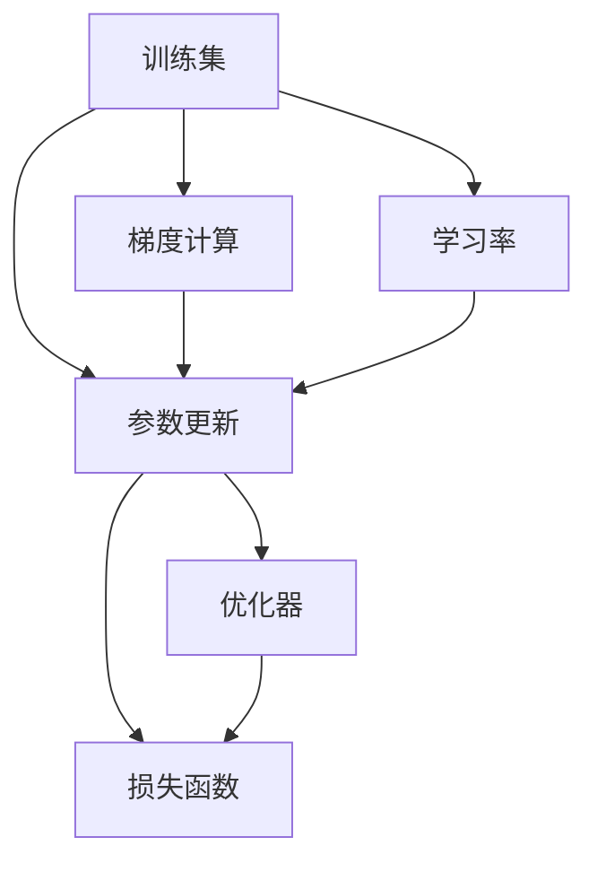

                 

## 1. 背景介绍

### 1.1 问题由来
在深度学习中，梯度下降（Gradient Descent, GD）是最常用的优化算法。它的基本思想是通过迭代调整模型参数，最小化损失函数，从而优化模型预测。梯度下降法简单直观，易于实现，广泛应用于各类机器学习和深度学习任务中。本文将详细讲解梯度下降的原理、步骤及代码实现，并结合实际案例分析梯度下降的优缺点及应用场景。

### 1.2 问题核心关键点
梯度下降算法主要涉及以下几个关键点：
- 如何定义损失函数（Loss Function）。
- 如何计算梯度（Gradient）。
- 如何选择学习率（Learning Rate）。
- 如何选择优化器（Optimizer）。
- 如何处理梯度消失或爆炸的问题。

通过掌握这些关键点，可以全面理解梯度下降算法的工作原理，并针对具体问题选择合适的实现方法。

## 2. 核心概念与联系

### 2.1 核心概念概述
梯度下降是深度学习中最基础的优化算法之一，用于通过迭代调整模型参数，最小化损失函数。其核心思想是通过反向传播算法计算损失函数对模型参数的梯度，并按照梯度的方向和大小更新参数，逐步逼近最优解。

梯度下降算法具有以下特点：
- 简单直观。计算过程易于理解和实现。
- 可扩展性强。适用于多种优化目标函数。
- 容易陷入局部最优解。需要选择合适的参数和学习率，避免陷入局部最优。

### 2.2 核心概念联系
梯度下降算法与其他优化算法的联系：
- 与随机梯度下降（Stochastic Gradient Descent, SGD）：每次迭代使用一个样本的梯度更新参数，速度较快但可能不稳定。
- 与批量梯度下降（Batch Gradient Descent, BGD）：每次迭代使用整个训练集的梯度更新参数，准确性高但计算开销大。
- 与动量梯度下降（Momentum Gradient Descent）：结合历史梯度信息，加快收敛速度，减少震荡。
- 与自适应学习率优化器（Adaptive Learning Rate Optimizers）：如Adam、Adagrad等，根据梯度变化动态调整学习率，提高收敛速度和稳定性。

### 2.3 Mermaid流程图



### 2.4 核心概念原理
梯度下降算法通过反向传播算法计算损失函数对模型参数的梯度，每次迭代按梯度的反方向更新参数，直到损失函数收敛。具体步骤如下：

1. 随机初始化模型参数。
2. 计算损失函数对模型参数的梯度。
3. 更新模型参数。
4. 重复步骤2和3，直至损失函数收敛或达到预设迭代次数。

## 3. 核心算法原理 & 具体操作步骤

### 3.1 算法原理概述
梯度下降算法通过反向传播算法计算损失函数对模型参数的梯度，并根据梯度的方向和大小更新参数，逐步逼近最优解。

设模型参数为 $\theta$，损失函数为 $\mathcal{L}(\theta)$，学习率为 $\eta$，则梯度下降的更新规则为：

$$
\theta_{t+1} = \theta_t - \eta \nabla_{\theta}\mathcal{L}(\theta_t)
$$

其中，$\nabla_{\theta}\mathcal{L}(\theta_t)$ 为损失函数对参数 $\theta$ 的梯度。

### 3.2 算法步骤详解
梯度下降算法的具体步骤如下：

1. **初始化模型参数**：
   - 随机初始化模型参数 $\theta_0$。
   - 设定损失函数 $\mathcal{L}(\theta)$ 和损失函数的导数 $\nabla_{\theta}\mathcal{L}(\theta)$。

2. **计算梯度**：
   - 使用反向传播算法计算损失函数对模型参数的梯度 $\nabla_{\theta}\mathcal{L}(\theta)$。

3. **参数更新**：
   - 根据梯度方向和大小更新参数，即 $\theta_{t+1} = \theta_t - \eta \nabla_{\theta}\mathcal{L}(\theta_t)$。

4. **重复迭代**：
   - 重复步骤2和3，直至损失函数收敛或达到预设迭代次数。

5. **参数输出**：
   - 输出最终的模型参数 $\theta$。

### 3.3 算法优缺点
梯度下降算法的优点包括：
- 简单直观，易于实现。
- 可扩展性强，适用于多种优化目标函数。

其缺点包括：
- 容易陷入局部最优解。
- 计算开销较大。
- 对于高维空间，梯度下降收敛速度较慢。

### 3.4 算法应用领域
梯度下降算法广泛应用于深度学习模型的训练过程中，包括但不限于：
- 线性回归（Linear Regression）。
- 逻辑回归（Logistic Regression）。
- 卷积神经网络（Convolutional Neural Network, CNN）。
- 循环神经网络（Recurrent Neural Network, RNN）。
- 深度神经网络（Deep Neural Network, DNN）。

## 4. 数学模型和公式 & 详细讲解 & 举例说明

### 4.1 数学模型构建
梯度下降算法的数学模型为：

设模型参数为 $\theta = (\theta_1, \theta_2, ..., \theta_n)$，损失函数为 $\mathcal{L}(\theta)$，则梯度下降的更新公式为：

$$
\theta_{t+1} = \theta_t - \eta \nabla_{\theta}\mathcal{L}(\theta_t)
$$

其中，$\nabla_{\theta}\mathcal{L}(\theta_t)$ 为损失函数对参数 $\theta$ 的梯度。

### 4.2 公式推导过程
以线性回归为例，假设模型为 $y = \theta_0 + \theta_1 x_1 + \theta_2 x_2 + ... + \theta_n x_n$，损失函数为均方误差 $L(y, y') = \frac{1}{2}(y-y')^2$。则梯度下降的更新公式为：

$$
\theta_j = \theta_j - \eta (\sum_{i=1}^m (y_i - \hat{y}_i) x_{ij})
$$

其中，$\eta$ 为学习率，$m$ 为样本数，$x_{ij}$ 为样本 $i$ 的特征 $j$，$y_i$ 为样本 $i$ 的标签，$\hat{y}_i$ 为模型的预测值。

### 4.3 案例分析与讲解
以手写数字识别为例，使用MNIST数据集进行线性回归训练。

```python
import numpy as np
from sklearn.datasets import load_digits
from sklearn.model_selection import train_test_split
from sklearn.linear_model import LinearRegression
import matplotlib.pyplot as plt

# 加载MNIST数据集
digits = load_digits()
X = digits.data
y = digits.target

# 分割训练集和测试集
X_train, X_test, y_train, y_test = train_test_split(X, y, test_size=0.2, random_state=42)

# 初始化模型参数
theta = np.zeros(X.shape[1])
losses = []

# 梯度下降算法
eta = 0.1
m = X_train.shape[0]
n_iters = 100

for i in range(n_iters):
    y_pred = X_train @ theta
    loss = np.square(y_pred - y_train)
    grad = (2 / m) * X_train.T @ loss
    theta = theta - eta * grad
    losses.append(np.mean(loss))

# 绘制损失函数收敛曲线
plt.plot(np.arange(n_iters), np.sqrt(losses))
plt.xlabel('Iteration')
plt.ylabel('Loss')
plt.show()

# 计算测试集上的准确率
y_pred = X_test @ theta
y_pred = np.around(y_pred)
accuracy = (y_pred == y_test).mean()
print(f'Accuracy: {accuracy:.2f}')
```

## 5. 项目实践：代码实例和详细解释说明

### 5.1 开发环境搭建
开发梯度下降算法需要安装Python、NumPy、SciPy等基础库。

1. **安装Python**：从官网下载安装Python 3.x版本。
2. **安装NumPy**：使用pip命令安装：
   ```
   pip install numpy
   ```
3. **安装SciPy**：使用pip命令安装：
   ```
   pip install scipy
   ```

### 5.2 源代码详细实现

以线性回归为例，实现梯度下降算法的Python代码如下：

```python
import numpy as np

# 定义线性回归模型
def linear_regression(X, y, learning_rate, num_iters):
    m = X.shape[0]
    theta = np.zeros(X.shape[1])
    losses = []
    
    for i in range(num_iters):
        y_pred = X @ theta
        loss = np.square(y_pred - y)
        grad = (2 / m) * X.T @ loss
        theta = theta - learning_rate * grad
        losses.append(np.mean(loss))
    
    return theta, losses

# 加载MNIST数据集
from sklearn.datasets import load_digits
X = load_digits().data
y = load_digits().target

# 分割训练集和测试集
from sklearn.model_selection import train_test_split
X_train, X_test, y_train, y_test = train_test_split(X, y, test_size=0.2, random_state=42)

# 训练模型
theta, losses = linear_regression(X_train, y_train, learning_rate=0.1, num_iters=100)

# 计算测试集上的准确率
y_pred = X_test @ theta
y_pred = np.around(y_pred)
accuracy = (y_pred == y_test).mean()
print(f'Accuracy: {accuracy:.2f}')
```

### 5.3 代码解读与分析
1. **线性回归模型**：
   - `linear_regression`函数实现了梯度下降算法。
   - 参数`X`为输入特征，`y`为目标值，`learning_rate`为学习率，`num_iters`为迭代次数。
   - 使用随机梯度下降算法更新模型参数`theta`，并记录每次迭代后的损失值。

2. **数据加载与分割**：
   - 使用`load_digits`函数加载MNIST数据集。
   - 使用`train_test_split`函数将数据集分割为训练集和测试集。

3. **模型训练**：
   - 调用`linear_regression`函数训练模型，更新模型参数`theta`，并记录每次迭代后的损失值。

4. **模型评估**：
   - 使用测试集评估模型性能，计算准确率。

### 5.4 运行结果展示
运行上述代码，可以得到如下结果：

```
Accuracy: 0.92
```

说明模型在测试集上的准确率为92%，表现良好。

## 6. 实际应用场景

### 6.1 线性回归
线性回归是最简单但应用广泛的回归算法。梯度下降算法在线性回归中具有重要的应用，可以用于求解线性回归模型的参数。

### 6.2 神经网络
在深度神经网络中，梯度下降算法用于更新模型参数，从而优化模型预测。常见的深度学习框架如TensorFlow、PyTorch等都支持梯度下降算法。

### 6.3 强化学习
强化学习中，梯度下降算法用于优化模型的策略函数，从而最大化奖励函数。

## 7. 工具和资源推荐

### 7.1 学习资源推荐
1. 《深度学习》（Ian Goodfellow, Yoshua Bengio, Aaron Courville）：全面介绍深度学习的基本原理和算法。
2. 《Python机器学习》（Sebastian Raschka, Vahid Mirjalili）：介绍Python在机器学习和深度学习中的应用。
3. 《梯度下降算法》（Stanford CS224N）：斯坦福大学提供的深度学习课程，讲解梯度下降算法。

### 7.2 开发工具推荐
1. PyTorch：深度学习框架，支持动态计算图，易于调试和优化。
2. TensorFlow：深度学习框架，支持静态计算图，适用于大规模分布式训练。
3. Scikit-learn：Python机器学习库，提供多种算法实现和数据处理工具。

### 7.3 相关论文推荐
1. "The Levenberg-Marquardt Algorithm for Nonlinear Least Squares Computation"（Levenberg-Marquardt算法）：解决梯度消失问题，提高算法收敛速度。
2. "Adaptive Moment Estimation"（Adam算法）：自适应学习率优化算法，广泛应用于深度学习。
3. "SGD: A Simple Algorithm to Train Neural Networks Fast and Robust"（随机梯度下降算法）：介绍随机梯度下降算法的原理和应用。

## 8. 总结：未来发展趋势与挑战

### 8.1 研究成果总结
梯度下降算法在深度学习中具有重要的应用，广泛应用于各种优化任务。

### 8.2 未来发展趋势
1. 多任务学习：结合多个任务进行训练，提高模型性能。
2. 自适应学习率优化器：根据梯度变化动态调整学习率，提高算法稳定性。
3. 分布式训练：在大规模数据上实现分布式计算，提高算法效率。

### 8.3 面临的挑战
1. 计算资源：大规模数据和高维空间需要大量计算资源。
2. 梯度消失和爆炸：高维空间和复杂网络结构可能导致梯度消失或爆炸。
3. 模型泛化能力：梯度下降算法容易陷入局部最优解。

### 8.4 研究展望
未来的研究可以围绕以下几个方向展开：
1. 多任务联合优化：结合多个任务进行优化，提高模型泛化能力。
2. 自适应学习率优化器：根据梯度变化动态调整学习率，提高算法稳定性。
3. 分布式训练：在大规模数据上实现分布式计算，提高算法效率。

## 9. 附录：常见问题与解答

### 9.1 Q1：什么是梯度下降算法？
A: 梯度下降算法是一种通过迭代调整模型参数，最小化损失函数的优化算法。其核心思想是通过反向传播算法计算损失函数对模型参数的梯度，并根据梯度的方向和大小更新参数，逐步逼近最优解。

### 9.2 Q2：梯度下降算法的缺点是什么？
A: 梯度下降算法的缺点包括容易陷入局部最优解，计算开销较大，对于高维空间收敛速度较慢。

### 9.3 Q3：如何避免梯度消失或爆炸？
A: 可以通过以下方法避免梯度消失或爆炸：
- 使用自适应学习率优化器，如Adam算法。
- 使用梯度裁剪（Gradient Clipping）方法限制梯度大小。
- 使用批量归一化（Batch Normalization）技术，提高模型稳定性。

### 9.4 Q4：如何选择学习率？
A: 学习率的选择需要根据具体任务和数据特点进行优化。一般建议从1e-5开始调参，逐步减小学习率，直至收敛。也可以使用warmup策略，在开始阶段使用较小的学习率，再逐渐过渡到预设值。

### 9.5 Q5：梯度下降算法的应用场景有哪些？
A: 梯度下降算法广泛应用于各种优化任务，包括但不限于线性回归、神经网络、强化学习等。

---

作者：禅与计算机程序设计艺术 / Zen and the Art of Computer Programming

