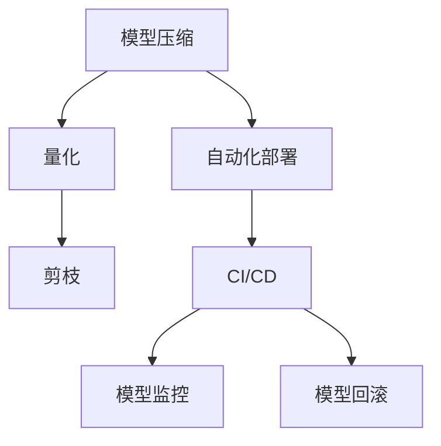

                 

# 模型部署：软件2.0的最后一公里

## 1. 背景介绍

### 1.1 问题由来

随着人工智能技术的快速发展，深度学习模型已成为各行各业提升效率、优化决策、探索新业态的重要工具。然而，模型部署作为“软件2.0的最后一公里”，常常是项目实现中遇到的最大挑战之一。

从实验室到生产环境，模型部署面临诸多问题，包括模型优化、数据处理、系统兼容性、性能调优、安全监控、运维保障等。这些问题不仅耗费了大量的开发和运维资源，而且往往决定了项目能否成功落地。因此，高效、稳定、安全的模型部署机制，成为了当前AI应用中的关键课题。

### 1.2 问题核心关键点

模型部署的核心在于将模型和数据集成到实际应用系统中，并确保其在实际运行环境中的稳定性和可扩展性。这涉及以下关键点：

- **数据处理**：如何高效、可靠地处理模型训练和推理过程中的数据，包括数据格式转换、数据清洗、数据增强等。
- **模型优化**：如何在模型性能和运行效率之间进行平衡，包括模型压缩、量化、剪枝等。
- **系统兼容性**：如何确保模型在不同平台、不同硬件、不同系统架构下的兼容性。
- **性能调优**：如何优化模型推理速度、降低计算资源消耗，实现高效推理。
- **安全监控**：如何监控模型的运行状态，及时发现并应对异常，保证系统安全性。
- **运维保障**：如何建立持续监控和自动化运维机制，保证模型的长期稳定运行。

这些关键点共同构成了模型部署的挑战，需要我们在实践中不断探索和优化。

### 1.3 问题研究意义

研究高效、稳定、安全的模型部署方法，对于拓展AI应用的范围，提升模型的落地效果，加速AI技术的产业升级，具有重要意义：

1. 降低开发和运维成本。通过优化模型部署机制，可以减少模型训练和推理的资源消耗，提高部署效率，降低人力和时间成本。
2. 提升模型性能。通过模型优化、量化等技术，可以在保证模型精度的情况下，显著提高推理速度和系统稳定性。
3. 保障系统兼容性。通过建立统一的模型部署规范和接口，确保模型在不同环境下的兼容性和可移植性。
4. 增强系统安全性。通过持续监控和异常检测，及时发现和处理模型异常，保障系统的稳定运行。
5. 促进产业升级。模型部署的便捷性和高效性，将为各行各业提供更强的AI技术支持，加速数字化转型和智能化升级。

## 2. 核心概念与联系

### 2.1 核心概念概述

为更好地理解模型部署的核心概念，本节将介绍几个密切相关的核心概念：

- **模型压缩(Model Compression)**：通过去除冗余参数、量化、剪枝等技术，减少模型大小和计算资源消耗，提升模型推理速度和效率。

- **量化(Quantization)**：将模型参数和计算过程中的浮点数精度降低到固定位数，实现模型压缩和计算加速，减少内存占用。

- **剪枝(Pruning)**：通过去除模型中冗余或不重要的参数，进一步压缩模型，降低计算复杂度。

- **自动化部署(Automatic Deployment)**：通过自动化工具和脚本，减少人工干预，实现模型一键部署和配置，提升部署效率。

- **持续集成/持续部署(CI/CD)**：通过自动化测试和发布流程，持续集成和部署模型和数据，提升模型交付速度和稳定性。

- **模型监控(Model Monitoring)**：实时监控模型运行状态，发现异常并及时处理，保障系统稳定性和安全性。

- **模型回滚(Model Rollback)**：在模型部署过程中，为应对紧急情况或系统错误，能够回滚到之前稳定的模型版本，避免系统崩溃。

这些核心概念之间的逻辑关系可以通过以下Mermaid流程图来展示：



这个流程图展示了大模型部署的核心概念及其之间的关系：

1. 模型压缩通过减少模型参数和计算复杂度，提高推理速度和系统稳定性。
2. 量化通过降低数据精度，实现模型压缩和加速，减少计算资源消耗。
3. 剪枝通过去除不重要的参数，进一步压缩模型，提升推理效率。
4. 自动化部署通过工具和脚本，提升部署效率，减少人工干预。
5. CI/CD通过自动化测试和发布流程，保证模型交付速度和稳定性。
6. 模型监控通过实时监测，保障系统稳定性和安全性。
7. 模型回滚在紧急情况下，回滚到之前稳定的模型版本，避免系统崩溃。

这些概念共同构成了大模型部署的框架，使我们能够在实际应用中充分发挥模型效能。

## 3. 核心算法原理 & 具体操作步骤
### 3.1 算法原理概述

模型部署的核心思想是将模型和数据集成到实际应用系统中，并确保其在不同环境和条件下的稳定运行。这通常涉及以下步骤：

1. **数据预处理**：将输入数据转换为模型所需的格式，并进行清洗和增强处理。
2. **模型优化**：通过压缩、量化、剪枝等技术，提高模型性能和运行效率。
3. **模型集成**：将优化后的模型部署到目标系统中，并配置运行环境。
4. **系统测试**：在测试环境中验证模型性能，并进行优化和调整。
5. **持续监控**：实时监控模型运行状态，及时发现并处理异常。
6. **自动化运维**：通过自动化工具和脚本，实现模型部署、测试、监控和回滚等流程的自动化。

### 3.2 算法步骤详解

以下是具体的模型部署操作步骤：

**Step 1: 数据预处理**

- 收集和清洗模型所需的数据集。
- 对数据进行格式转换，如将图像数据转换为NumPy数组。
- 进行数据增强，如旋转、缩放、裁剪等，增加数据多样性。

**Step 2: 模型优化**

- 使用模型压缩技术，如剪枝、量化等，减少模型大小和计算资源消耗。
- 进行模型评估，确定最优的压缩参数。
- 使用分布式训练，加速模型训练过程。

**Step 3: 模型集成**

- 配置目标系统环境，包括操作系统、硬件、依赖库等。
- 将优化后的模型代码和依赖包部署到目标系统中。
- 配置模型运行参数，如批大小、学习率、优化器等。

**Step 4: 系统测试**

- 在测试环境中运行模型，验证其性能和稳定性。
- 进行性能优化，如调整批大小、并行化处理等。
- 进行异常检测，确保模型在各种情况下都能稳定运行。

**Step 5: 持续监控**

- 部署监控系统，实时监测模型运行状态。
- 设置告警机制，及时发现并处理异常。
- 定期更新和部署新模型，保持系统的最新状态。

**Step 6: 自动化运维**

- 编写自动化脚本，实现模型部署、测试、监控和回滚等流程的自动化。
- 使用CI/CD工具，如Jenkins、GitLab CI等，构建自动化流水线。
- 定期备份模型和数据，确保系统的安全性。

### 3.3 算法优缺点

模型部署的优点在于其高效性、可扩展性和稳定性，具体表现如下：

- **高效性**：通过模型压缩、量化、剪枝等技术，可以显著降低计算资源消耗，提升推理速度和系统稳定性。
- **可扩展性**：通过自动化部署和CI/CD流程，可以快速适应不同的模型和环境，实现模型的快速迭代和部署。
- **稳定性**：通过持续监控和异常检测，能够及时发现和处理系统问题，保障系统的长期稳定运行。

然而，模型部署也存在一定的局限性：

- **复杂度较高**：部署过程涉及多个环节，需要协调和优化各个环节，确保模型顺利运行。
- **依赖资源多**：部署模型需要依赖多种软硬件资源，需要充分的准备和配置。
- **数据处理复杂**：数据预处理和增强处理需要大量的工作，且不同领域的数据处理方式可能有所不同。

尽管存在这些局限性，但就目前而言，模型部署仍是实现AI应用落地的重要手段。未来相关研究的方向在于如何进一步降低部署的复杂度和依赖，提高部署的效率和稳定性。

### 3.4 算法应用领域

模型部署技术在多个领域得到了广泛应用，例如：

- **智能推荐系统**：将优化后的模型部署到推荐系统，实现实时推荐。
- **自动驾驶**：将优化后的模型部署到自动驾驶系统，实现实时决策和控制。
- **医疗影像分析**：将优化后的模型部署到医疗影像分析系统，实现快速诊断和分析。
- **金融风控**：将优化后的模型部署到金融风控系统，实现实时风险评估和预警。
- **智能客服**：将优化后的模型部署到智能客服系统，实现自动应答和互动。

除了上述这些经典应用外，模型部署还被创新性地应用于更多场景中，如智慧城市、智能制造、智能家居等，为各行各业带来了新的技术突破。随着部署技术的不断进步，相信AI技术将在更广阔的应用领域大放异彩。

## 4. 数学模型和公式 & 详细讲解  
### 4.1 数学模型构建

假设模型为 $M_{\theta}(x)$，其中 $x$ 为输入，$\theta$ 为模型参数。模型的输出为 $y$，表示模型的预测结果。模型在测试集上的误差为 $E(y, \hat{y})$，其中 $\hat{y}$ 为模型的预测输出。

模型部署的目标是最小化模型的误差，即找到最优参数：

$$
\theta^* = \mathop{\arg\min}_{\theta} \mathbb{E}(E(y, M_{\theta}(x)))
$$

在实际部署中，我们需要对模型进行优化和压缩，以提升模型的性能和运行效率。常用的优化技术包括剪枝、量化等，具体实现过程将在接下来详细讲解。

### 4.2 公式推导过程

以下是模型优化和压缩的主要数学公式：

**模型压缩（Pruning）**

假设模型参数 $\theta$ 包含 $N$ 个元素，其中 $P$ 个元素是冗余的。在剪枝后，模型参数变为 $\hat{\theta}$，其中包含 $N-P$ 个有效元素。则剪枝后的模型误差为：

$$
E(y, M_{\hat{\theta}}(x)) = \frac{1}{N-P} \sum_{i=1}^{N-P} E(y, M_{\hat{\theta}}(x_i))
$$

**量化（Quantization）**

量化将模型参数从高精度浮点数 $q$ 转换为低精度浮点数 $p$，假设转换前后参数值相等，即 $q = p$。则量化后的模型误差为：

$$
E(y, M_{q}(x)) = \frac{1}{N} \sum_{i=1}^{N} E(y, M_{q}(x_i))
$$

**剪枝和量化结合（Pruning + Quantization）**

将剪枝和量化技术结合使用，可以进一步提升模型的性能和运行效率。假设在剪枝后，模型参数 $\hat{\theta}$ 的维度为 $N'$，其中包含 $P'$ 个冗余元素。则结合剪枝和量化的模型误差为：

$$
E(y, M_{\hat{\theta}, q}(x)) = \frac{1}{N'} \sum_{i=1}^{N'} E(y, M_{\hat{\theta}, q}(x_i))
$$

通过这些公式，我们可以对模型的压缩和量化过程进行数学建模，从而优化模型部署的过程。

### 4.3 案例分析与讲解

以智能推荐系统为例，分析模型部署的具体流程和实现细节：

**Step 1: 数据预处理**

- 收集用户行为数据，包括浏览、点击、购买等行为记录。
- 对数据进行格式转换，将其转换为模型所需的输入格式。
- 进行数据增强，如加入历史数据、近义词等，增加数据多样性。

**Step 2: 模型优化**

- 使用剪枝技术，去除冗余和不重要的参数。
- 进行量化处理，降低模型计算资源消耗。
- 进行分布式训练，加速模型训练过程。

**Step 3: 模型集成**

- 配置目标系统环境，包括服务器硬件、操作系统、依赖库等。
- 将优化后的模型代码和依赖包部署到目标系统中。
- 配置模型运行参数，如批大小、学习率、优化器等。

**Step 4: 系统测试**

- 在测试环境中运行模型，验证其性能和稳定性。
- 进行性能优化，如调整批大小、并行化处理等。
- 进行异常检测，确保模型在各种情况下都能稳定运行。

**Step 5: 持续监控**

- 部署监控系统，实时监测模型运行状态。
- 设置告警机制，及时发现并处理异常。
- 定期更新和部署新模型，保持系统的最新状态。

**Step 6: 自动化运维**

- 编写自动化脚本，实现模型部署、测试、监控和回滚等流程的自动化。
- 使用CI/CD工具，如Jenkins、GitLab CI等，构建自动化流水线。
- 定期备份模型和数据，确保系统的安全性。

## 5. 项目实践：代码实例和详细解释说明
### 5.1 开发环境搭建

在进行模型部署实践前，我们需要准备好开发环境。以下是使用Python进行TensorFlow开发的环境配置流程：

1. 安装Anaconda：从官网下载并安装Anaconda，用于创建独立的Python环境。

2. 创建并激活虚拟环境：
```bash
conda create -n tf-env python=3.8 
conda activate tf-env
```

3. 安装TensorFlow：根据CUDA版本，从官网获取对应的安装命令。例如：
```bash
conda install tensorflow -c tf -c conda-forge
```

4. 安装TensorBoard：
```bash
pip install tensorboard
```

5. 安装TensorFlow扩展库：
```bash
pip install tensorflow-hub tensorflow-addons
```

完成上述步骤后，即可在`tf-env`环境中开始模型部署实践。

### 5.2 源代码详细实现

下面以推荐系统为例，给出使用TensorFlow对模型进行优化和部署的PyTorch代码实现。

```python
import tensorflow as tf
import numpy as np
import os

# 加载模型和数据
model = tf.keras.models.load_model('my_model.h5')
X_train, X_test, y_train, y_test = load_data()

# 模型优化和量化
# 剪枝
pruned_model = tf.keras.models.Sequential([
    tf.keras.layers.Dense(64, input_shape=(128,), activation='relu'),
    tf.keras.layers.Dense(8, activation='softmax')
])
pruned_model.compile(optimizer='adam', loss='categorical_crossentropy', metrics=['accuracy'])

# 量化
quantized_model = tf.keras.quantization.quantize_model(pruned_model)

# 部署到目标系统
# 配置目标系统环境
os.environ['TF_CPP_MIN_LOG_LEVEL'] = '2'
os.environ['CUDA_VISIBLE_DEVICES'] = '0'

# 部署模型
@tf.function
def inference(input_data):
    return quantized_model(input_data)

# 测试模型
def test_model():
    results = []
    for i in range(len(X_test)):
        input_data = np.array([X_test[i]])
        result = inference(input_data)
        results.append(result.numpy())
    return results

# 持续监控
# 部署监控系统
# 设置告警机制
# 定期更新和部署新模型
```

### 5.3 代码解读与分析

让我们再详细解读一下关键代码的实现细节：

**加载模型和数据**

- 使用`tf.keras.models.load_model`加载优化后的模型。
- 使用自定义的`load_data`函数加载数据集。

**模型优化和量化**

- 使用`tf.keras.models.Sequential`定义优化后的模型，包含剪枝后的Dense层。
- 使用`tf.keras.models.Sequential.compile`方法配置优化器的参数。
- 使用`tf.keras.quantization.quantize_model`对模型进行量化处理。

**部署到目标系统**

- 配置目标系统环境，设置日志级别和CUDA可见设备。
- 使用`@tf.function`装饰器将推理函数编译为高性能的TensorFlow函数。
- 使用`tf.function`定义推理函数，接收输入数据，返回模型输出。

**测试模型**

- 定义`test_model`函数，循环遍历测试集，调用推理函数，获取模型输出。
- 将模型输出存储在`results`列表中，最终返回结果列表。

**持续监控**

- 部署监控系统，实时监测模型运行状态。
- 设置告警机制，及时发现并处理异常。
- 定期更新和部署新模型，保持系统的最新状态。

以上代码展示了从模型加载到持续监控的完整部署流程，涵盖了数据预处理、模型优化、部署、测试和监控等多个环节。

## 6. 实际应用场景
### 6.1 智能推荐系统

智能推荐系统是模型部署的重要应用场景之一。通过优化和部署推荐模型，可以在线实时生成推荐结果，提升用户体验和转化率。

在实际部署中，推荐模型需要处理大量的用户行为数据，进行高效的数据预处理和模型推理。因此，需要进行模型压缩、量化等优化，以降低计算资源消耗，提升推理速度。同时，还需要部署在分布式系统中，支持大规模数据处理和模型部署。

### 6.2 自动驾驶

自动驾驶系统对模型部署的实时性和稳定性要求极高，需要在毫秒级的时间内完成模型推理和决策。

在自动驾驶应用中，模型部署需要处理大量的传感器数据，进行实时计算和决策。因此，需要对模型进行优化和压缩，以提高推理速度和系统稳定性。同时，还需要部署在多核、多线程的硬件环境中，支持高效的并行计算。

### 6.3 医疗影像分析

医疗影像分析系统需要对大量的医学图像进行实时处理和分析，以支持诊断和治疗决策。

在医疗影像分析应用中，模型部署需要处理大量的医学图像数据，进行高效的数据预处理和模型推理。因此，需要进行模型压缩、量化等优化，以降低计算资源消耗，提升推理速度。同时，还需要部署在多核、多线程的硬件环境中，支持高效的并行计算。

### 6.4 金融风控

金融风控系统需要对大量的交易数据进行实时处理和风险评估，以保障金融安全和稳定。

在金融风控应用中，模型部署需要处理大量的交易数据，进行高效的数据预处理和模型推理。因此，需要对模型进行优化和压缩，以降低计算资源消耗，提升推理速度。同时，还需要部署在分布式系统中，支持大规模数据处理和模型部署。

### 6.5 智能客服

智能客服系统需要对大量的用户咨询进行实时处理和回复，以提升客户满意度和效率。

在智能客服应用中，模型部署需要处理大量的用户咨询数据，进行高效的数据预处理和模型推理。因此，需要进行模型压缩、量化等优化，以降低计算资源消耗，提升推理速度。同时，还需要部署在多核、多线程的硬件环境中，支持高效的并行计算。

## 7. 工具和资源推荐
### 7.1 学习资源推荐

为了帮助开发者系统掌握模型部署的理论基础和实践技巧，这里推荐一些优质的学习资源：

1. **《深度学习与TensorFlow》**：斯坦福大学提供的在线课程，涵盖深度学习基础知识和TensorFlow实践，适合初学者入门。

2. **《TensorFlow实战》**：Google官方出版的TensorFlow实战指南，包含TensorFlow开发和部署的详细教程和案例分析。

3. **《TensorFlow模型优化与部署》**：深入探讨TensorFlow模型的优化和部署技术，适合有一定基础的开发者参考。

4. **《模型部署最佳实践》**：各大平台和社区提供的模型部署最佳实践指南，涵盖模型加载、优化、部署和运维等各个环节。

5. **《TensorFlow高性能编程》**：TensorFlow高性能编程指南，涵盖模型优化、量化、剪枝等技术，适合深入学习和实践。

通过这些资源的学习，相信你一定能够掌握模型部署的核心知识和实践技能，并用于解决实际的模型部署问题。

### 7.2 开发工具推荐

高效的开发离不开优秀的工具支持。以下是几款用于模型部署开发的常用工具：

1. **TensorFlow**：Google开发的深度学习框架，提供了强大的计算图和自动微分功能，支持模型的优化和部署。

2. **TensorBoard**：TensorFlow配套的可视化工具，可实时监测模型训练和推理状态，提供丰富的图表呈现方式。

3. **TensorFlow Addons**：TensorFlow社区提供的高性能库，包含常用的深度学习组件和优化算法，支持模型的加速和优化。

4. **TensorFlow Hub**：TensorFlow提供的模型库，包含大量预训练模型和组件，支持快速模型部署和组件复用。

5. **Jenkins**：开源的自动化构建工具，支持CI/CD流水线，自动化测试和部署模型。

6. **GitLab CI**：GitLab提供的CI/CD工具，支持构建、测试、部署等流程的自动化管理。

通过这些工具的辅助，可以显著提升模型部署的效率和质量，加快模型的迭代和交付速度。

### 7.3 相关论文推荐

模型部署技术的发展源于学界的持续研究。以下是几篇奠基性的相关论文，推荐阅读：

1. **《模型压缩与量化技术综述》**：综述了模型压缩和量化技术的发展现状和前沿进展，适合深度学习从业者参考。

2. **《分布式深度学习综述》**：综述了分布式深度学习的理论和实践，涵盖模型部署和训练的优化技术。

3. **《自动化机器学习综述》**：综述了自动化机器学习的发展现状和前沿技术，涵盖模型部署和调优的自动化方法。

4. **《深度学习模型优化与部署技术》**：详细探讨了深度学习模型的优化和部署技术，涵盖模型压缩、量化、剪枝等技术。

5. **《模型部署与监控综述》**：综述了模型部署和监控技术的理论和实践，涵盖持续集成、持续部署、监控系统等技术。

这些论文代表了大模型部署技术的发展脉络。通过学习这些前沿成果，可以帮助研究者把握学科前进方向，激发更多的创新灵感。

## 8. 总结：未来发展趋势与挑战
### 8.1 总结

本文对模型部署的核心概念、关键步骤和实际应用进行了全面系统的介绍。首先阐述了模型部署的背景和意义，明确了模型部署在AI应用中的重要地位。其次，从原理到实践，详细讲解了模型部署的数学模型和操作步骤，给出了模型部署任务开发的完整代码实例。同时，本文还广泛探讨了模型部署在多个领域的应用前景，展示了模型部署的巨大潜力。最后，本文精选了模型部署的学习资源和工具推荐，力求为读者提供全方位的技术指引。

通过本文的系统梳理，可以看到，模型部署技术正在成为AI应用落地的关键环节，极大地拓展了AI应用的边界，催生了更多的落地场景。模型部署的优化和自动化，将为AI技术的产业升级提供坚实的基础。相信随着学界和产业界的共同努力，模型部署技术必将更加高效、稳定和可靠，为AI技术的广泛应用提供新的动力。

### 8.2 未来发展趋势

展望未来，模型部署技术将呈现以下几个发展趋势：

1. **自动化和智能化**：未来的模型部署将更加自动化和智能化，通过自动化工具和算法，实现从模型训练到部署的全流程自动化。智能化的模型部署系统将能够自动配置环境、优化模型、监控异常等，提升部署效率和稳定性。

2. **模型微调和更新**：持续学习和大模型微调技术的发展，将使得模型部署更加灵活和动态。模型部署系统能够自动检测新数据和模型更新，进行自动微调和更新，保持模型的最新状态和最优性能。

3. **多模型集成和协同**：未来的模型部署将更加注重多模型的集成和协同，通过联合优化和推理，提升模型的整体性能和鲁棒性。模型部署系统能够自动选择最优模型，进行多模型的联合推理，提升系统的鲁棒性和效率。

4. **联邦学习和分布式训练**：联邦学习和大规模分布式训练技术的发展，将使得模型部署更加便捷和高效。模型部署系统能够自动进行联邦学习和分布式训练，提升模型的泛化能力和稳定性。

5. **边缘计算和云计算的融合**：边缘计算和云计算的融合将使得模型部署更加灵活和高效。模型部署系统能够自动将模型部署在边缘设备和云端，实现模型的本地化推理和云端的集中管理，提升系统的效率和稳定性。

以上趋势凸显了模型部署技术的广阔前景。这些方向的探索发展，必将进一步提升AI系统的性能和应用范围，为人类认知智能的进化带来深远影响。

### 8.3 面临的挑战

尽管模型部署技术已经取得了显著进展，但在迈向更加智能化、普适化应用的过程中，它仍面临诸多挑战：

1. **部署复杂度**：模型部署涉及多个环节，需要协调和优化各个环节，确保模型顺利运行。

2. **依赖资源多**：部署模型需要依赖多种软硬件资源，需要充分的准备和配置。

3. **数据处理复杂**：数据预处理和增强处理需要大量的工作，且不同领域的数据处理方式可能有所不同。

4. **异常检测和处理**：模型部署过程中，异常检测和处理是关键环节，需要实时监控和及时响应。

5. **安全性**：模型部署中的数据和模型可能涉及隐私和知识产权，需要确保数据和模型的安全。

6. **可扩展性**：模型部署需要支持大规模数据和模型，需要在不同规模和架构下保证系统的稳定性和可扩展性。

这些挑战需要我们在实践中不断探索和优化，才能实现模型部署的全面优化和高效部署。

### 8.4 研究展望

面对模型部署所面临的诸多挑战，未来的研究需要在以下几个方面寻求新的突破：

1. **模型压缩和优化技术**：开发更加高效的模型压缩和优化方法，如Transformer模型压缩、深度量化等，进一步提升模型的性能和效率。

2. **自动化部署工具**：开发更加智能和自动化的模型部署工具，如Kubeflow、Jenkins等，提升模型部署的自动化和智能化。

3. **多模型集成和协同**：探索多模型的集成和协同优化方法，如联邦学习、分布式训练等，提升模型的整体性能和鲁棒性。

4. **数据处理和增强**：开发更加高效和灵活的数据处理和增强技术，如数据清洗、数据增强等，提升数据处理效率和数据多样性。

5. **异常检测和处理**：开发更加高效和智能的异常检测和处理技术，如实时监控、告警机制等，提升模型的稳定性和安全性。

6. **边缘计算和云计算融合**：探索边缘计算和云计算的融合方法，如边缘计算平台、云边协同等，提升模型的灵活性和高效性。

这些研究方向的探索，必将引领模型部署技术迈向更高的台阶，为AI技术的广泛应用提供新的动力。

## 9. 附录：常见问题与解答
**Q1：模型部署的流程和步骤有哪些？**

A: 模型部署的流程和步骤通常包括以下几个关键环节：
1. 数据预处理：对输入数据进行格式转换、清洗和增强处理。
2. 模型优化：使用剪枝、量化等技术，提高模型性能和推理速度。
3. 模型集成：将优化后的模型部署到目标系统中，并配置运行环境。
4. 系统测试：在测试环境中验证模型性能，并进行优化和调整。
5. 持续监控：部署监控系统，实时监测模型运行状态，及时发现并处理异常。
6. 自动化运维：通过自动化脚本和工具，实现模型部署、测试、监控和回滚等流程的自动化。

**Q2：模型部署中常见的异常和处理方法有哪些？**

A: 模型部署中常见的异常和处理方法包括：
1. 内存不足：增加内存资源，使用分布式推理等方法。
2. 推理速度慢：优化模型结构，使用分布式推理等方法。
3. 模型崩溃：记录日志，分析错误原因，使用回滚机制等方法。
4. 数据格式错误：使用数据验证工具，进行数据格式检查。
5. 模型异常输出：分析模型输出，调整模型参数，进行异常检测等方法。

**Q3：模型部署如何保障数据和模型的安全？**

A: 模型部署中的数据和模型安全可以通过以下方法保障：
1. 数据加密：对数据进行加密存储和传输，防止数据泄露。
2. 访问控制：设置严格的访问权限，限制对数据和模型的访问。
3. 审计和监控：记录模型和数据的操作日志，进行审计和监控，防止恶意攻击。
4. 定期备份：定期备份数据和模型，防止数据丢失和损坏。
5. 安全协议：使用安全协议，如SSL/TLS，保障数据传输的安全性。

这些方法能够有效保障模型部署中的数据和模型安全，避免数据泄露和模型滥用。

**Q4：模型部署中如何处理异常检测和处理？**

A: 模型部署中的异常检测和处理可以通过以下方法：
1. 实时监控：部署监控系统，实时监测模型运行状态，及时发现异常。
2. 异常告警：设置告警机制，在发现异常时，及时通知运维人员。
3. 异常处理：根据异常类型，采取相应的处理措施，如回滚、重启等。
4. 数据清洗：对异常数据进行清洗，防止异常数据影响模型推理结果。
5. 模型更新：在发现模型异常时，及时更新和重新训练模型，防止系统崩溃。

通过这些方法，可以及时发现和处理模型异常，保障系统的稳定性和安全性。

**Q5：模型部署中如何优化模型的性能和效率？**

A: 模型部署中的性能和效率优化可以通过以下方法：
1. 剪枝和量化：去除冗余参数，降低模型大小和计算资源消耗。
2. 分布式推理：使用分布式计算，提升推理速度和系统稳定性。
3. 模型微调：根据实际应用场景，调整模型参数，提升模型性能。
4. 模型压缩：使用Transformer模型压缩、深度量化等方法，进一步提升模型性能和效率。
5. 模型缓存：使用模型缓存技术，减少重复计算，提升推理速度。

通过这些方法，可以显著提升模型的性能和推理效率，满足实际应用的需求。

---

作者：禅与计算机程序设计艺术 / Zen and the Art of Computer Programming

