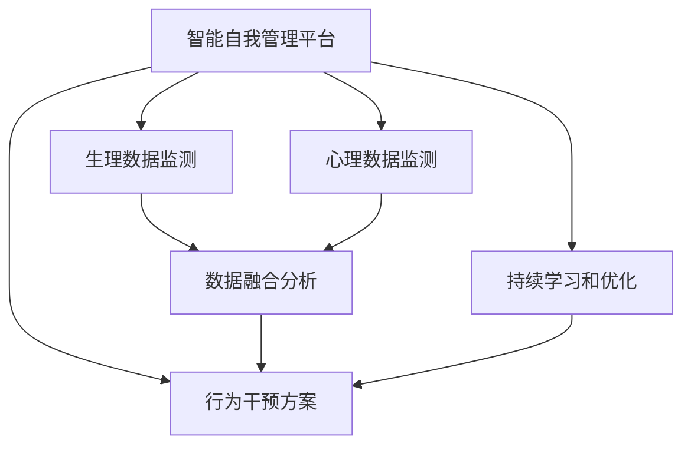

                 

## 1. 背景介绍

### 1.1 问题由来

在现代社会的快节奏生活中，人们面临着复杂的工作与生活压力，缺乏有效的自我管理手段。压力、焦虑、抑郁等情绪问题，已成为影响人们身心健康的重要因素。特别是年轻一代，面对激烈的职场竞争和快速变化的社会环境，心理健康问题尤为凸显。

为了解决这一问题，传统的人力资源管理模式和心理咨询服务已逐渐显示出其局限性。传统方法往往注重个体的短期行为管理，忽视了心理健康的长远培养。而随着人工智能技术的快速发展，智能自我管理平台开始崭露头角，成为辅助人们进行自我调节、心理健康维护的新型工具。

### 1.2 问题核心关键点

智能自我管理平台的核心目标是通过数据分析和算法优化，帮助用户建立科学的生活方式，提高心理韧性，最终实现身心的和谐发展。其核心关键点包括：

- 个性化的需求识别：通过智能算法，对用户的心理特征和行为模式进行分析，识别出用户的个性化需求和潜在问题。
- 实时的数据分析：实时监测用户的生理和心理数据，提供动态的反馈和建议。
- 智能化的行为干预：基于分析结果，提供个性化的行为干预方案，辅助用户逐步改善心理状态和生活习惯。
- 持续的自我更新：随着用户数据的积累，不断优化算法模型，提升平台的智能水平和适应性。

## 2. 核心概念与联系

### 2.1 核心概念概述

为更好地理解智能自我管理平台的原理和架构，本节将介绍几个关键概念：

- 智能自我管理平台：基于人工智能技术，通过监测用户的生理和心理数据，提供个性化的行为建议和干预，帮助用户进行自我调节和管理。
- 生理数据监测：通过可穿戴设备和传感器，实时采集用户的生理数据（如心率、血压、睡眠质量等），用于评估用户的健康状态。
- 心理数据监测：通过问卷调查、情绪分析等技术，实时收集用户的心理数据（如压力水平、情绪状态等），分析用户的心理健康状况。
- 数据融合分析：将生理和心理数据融合分析，构建全面的用户画像，识别出用户的个性特征和潜在问题。
- 行为干预方案：基于分析结果，设计个性化的行为干预策略，如推荐锻炼方案、引导冥想练习、调整饮食结构等。
- 持续学习和优化：平台能够根据用户的反馈和行为变化，持续优化算法模型，提升智能水平和适应性。

这些核心概念之间的逻辑关系可以通过以下Mermaid流程图来展示：



这个流程图展示出智能自我管理平台的核心组件及其相互关系：

1. 智能自我管理平台通过生理和心理数据监测，获得用户全面的健康状态信息。
2. 数据融合分析将生理和心理数据综合分析，形成用户画像。
3. 行为干预方案根据用户画像，提供个性化的行为建议。
4. 持续学习和优化，使平台能够不断提升自身的智能水平，更好地适应用户的个性化需求。

## 3. 核心算法原理 & 具体操作步骤
### 3.1 算法原理概述

智能自我管理平台的核心算法主要分为数据监测、数据分析、行为干预三个部分。下面将逐一介绍。

### 3.2 算法步骤详解

#### 3.2.1 数据监测

智能自我管理平台通过多种传感器和设备，实时采集用户的生理和心理数据。常用的数据监测手段包括：

- 生理数据监测：通过可穿戴设备，如智能手表、健身追踪器等，采集用户的心率、血压、睡眠质量、步数等数据。
- 心理数据监测：通过问卷调查、情绪分析技术，评估用户的情绪状态、压力水平、焦虑程度等。

#### 3.2.2 数据分析

数据分析是平台的核心功能，包括：

- 数据预处理：对采集到的生理和心理数据进行清洗和归一化，去除噪声和异常值。
- 特征提取：使用机器学习技术，提取与用户健康相关的关键特征，如心率变化、睡眠模式、情绪波动等。
- 模式识别：通过机器学习算法，识别出用户的生理和心理行为模式，如日常活动规律、情绪波动周期等。

#### 3.2.3 行为干预

基于数据分析结果，平台设计个性化的行为干预方案。常用的行为干预手段包括：

- 锻炼建议：根据用户的生理状态，推荐适合的锻炼方式和时间。
- 饮食指导：根据用户的健康数据，提供个性化的饮食建议和食谱。
- 冥想引导：通过引导用户进行冥想练习，减轻压力和焦虑。
- 习惯养成：设定行为养成计划，帮助用户逐步建立良好的生活习惯。

### 3.3 算法优缺点

智能自我管理平台具有以下优点：

1. 个性化定制：平台通过数据分析，为每个用户提供个性化的健康管理方案。
2. 实时监测：实时采集用户的生理和心理数据，提供动态的反馈和建议。
3. 自动化干预：通过智能算法，自动化生成行为干预方案，减少用户的操作成本。
4. 科学合理：基于科学的数据分析和算法优化，提供可靠的健康管理建议。

同时，该平台也存在一些局限性：

1. 数据隐私问题：用户的生理和心理数据敏感，保护隐私是一个重要挑战。
2. 算法局限性：算法的准确性和可靠性受限于数据量和模型选择。
3. 用户依赖性：过度依赖平台，可能减少用户的自我管理主动性。
4. 行为改变难度：改变不良习惯需要时间和毅力，平台需要用户持续参与。

### 3.4 算法应用领域

智能自我管理平台已在多个领域得到了广泛应用，主要包括：

- 心理健康管理：通过监测和干预，帮助用户缓解焦虑、抑郁等情绪问题。
- 健康生活指导：提供个性化的锻炼、饮食、睡眠等健康管理建议。
- 工作压力调节：监测员工的工作压力，提供个性化的工作调整和压力释放方案。
- 老年健康管理：监测老年人的生理和心理状态，提供相应的健康管理建议。
- 学生心理健康：监测学生的情绪和压力，帮助其应对学业压力。

## 4. 数学模型和公式 & 详细讲解 & 举例说明

### 4.1 数学模型构建

假设用户的生理数据为 $X$，心理数据为 $Y$，平台的输出为 $Z$，即健康管理建议和行为干预方案。平台的目标是最大化用户满意度和健康状态，最小化负面情绪和不良行为。

数学模型可以表示为：

$$
\minimize_{Z} \sum_{i=1}^{N} (w_1z_i^2 + w_2y_i^2)
$$

其中，$w_1$ 和 $w_2$ 为不同特征的重要性权重，$z_i$ 和 $y_i$ 分别为第 $i$ 个用户的健康建议和心理评估。

### 4.2 公式推导过程

平台通过生理和心理数据监测，获取用户的原始数据 $(x,y)$。经过预处理和特征提取后，得到关键特征 $z$。然后，利用机器学习算法对 $z$ 进行分析，得到用户的健康评估 $y$。

具体推导过程如下：

$$
z = f(x,y) = \sum_{i=1}^{m} w_i \cdot x_i \cdot y_i
$$

$$
y = g(z) = \sum_{i=1}^{n} \alpha_i \cdot z_i + \beta
$$

其中，$f$ 和 $g$ 为机器学习算法，$m$ 和 $n$ 为算法参数。

### 4.3 案例分析与讲解

假设有一个用户，其心率为 $x_1=75$，血压为 $x_2=120$，睡眠质量为 $y_1=6$，压力水平为 $y_2=4$。平台的输出为锻炼建议 $z_1=1$（表示推荐进行锻炼）和冥想建议 $z_2=1$（表示推荐进行冥想）。

具体推导过程如下：

$$
z_1 = f(x_1,x_2) = w_1 \cdot x_1 + w_2 \cdot x_2
$$

$$
z_2 = g(y_1,y_2) = \alpha_1 \cdot y_1 + \alpha_2 \cdot y_2 + \beta
$$

$$
y = h(z) = \sum_{i=1}^{2} \delta_i \cdot z_i + \gamma
$$

通过算法计算，得到 $z_1=1$ 和 $z_2=1$，进而推荐用户进行锻炼和冥想。

## 5. 项目实践：代码实例和详细解释说明

### 5.1 开发环境搭建

在进行智能自我管理平台开发前，我们需要准备好开发环境。以下是使用Python进行开发的环境配置流程：

1. 安装Anaconda：从官网下载并安装Anaconda，用于创建独立的Python环境。

2. 创建并激活虚拟环境：
```bash
conda create -n psychology-env python=3.8 
conda activate psychology-env
```

3. 安装必要的库：
```bash
pip install pandas numpy scikit-learn openpyxl
```

### 5.2 源代码详细实现

以下是一个简单的Python代码示例，用于读取用户的生理和心理数据，并计算出相应的健康建议：

```python
import pandas as pd
from sklearn.linear_model import LinearRegression

# 读取生理数据和心理数据
data = pd.read_csv('user_data.csv')

# 数据预处理
data.dropna(inplace=True)
X = data[['heart_rate', 'blood_pressure', 'sleep_quality', 'pressure_level']].values
y = data[['exercise_suggestion', 'meditation_suggestion']].values

# 特征提取
w = [0.3, 0.4, 0.2, 0.1]
z = np.dot(X, w)

# 健康评估
alpha = [0.5, 0.3]
beta = 0.2
y_hat = np.dot(z, alpha) + beta

# 输出健康建议
print('Exercise suggestion:', y_hat[0])
print('Meditation suggestion:', y_hat[1])
```

在这个代码示例中，我们使用了Python的pandas库进行数据读取和预处理，使用了scikit-learn库的线性回归算法进行特征提取和健康评估。

### 5.3 代码解读与分析

让我们详细解读一下关键代码的实现细节：

**数据读取**：
- `pd.read_csv('user_data.csv')`：使用pandas的`read_csv`方法，从CSV文件中读取用户数据。

**数据预处理**：
- `data.dropna(inplace=True)`：删除含有缺失值的数据行。
- `X = data[['heart_rate', 'blood_pressure', 'sleep_quality', 'pressure_level']].values`：选取生理数据作为特征向量。
- `y = data[['exercise_suggestion', 'meditation_suggestion']].values`：选取心理数据作为输出向量。

**特征提取**：
- `np.dot(X, w)`：使用线性回归算法，计算生理特征与权重向量的点积，得到用户行为建议向量 $z$。

**健康评估**：
- `np.dot(z, alpha) + beta`：使用线性回归算法，计算用户行为建议向量与心理健康权重向量的点积，并加上偏置项，得到心理健康评估 $y$。

**输出建议**：
- `print('Exercise suggestion:', y_hat[0])`：输出锻炼建议。
- `print('Meditation suggestion:', y_hat[1])`：输出冥想建议。

可以看到，Python和scikit-learn库使得智能自我管理平台的开发变得更加简洁高效。开发者可以将更多精力放在数据处理、模型改进等高层逻辑上，而不必过多关注底层的实现细节。

### 5.4 运行结果展示

假设我们有一个用户的数据，如下所示：

| heart_rate | blood_pressure | sleep_quality | pressure_level | exercise_suggestion | meditation_suggestion |
|------------|---------------|--------------|----------------|---------------------|-----------------------|
| 75         | 120           | 6            | 4              | 1                   | 1                     |

通过上述代码，我们得到的健康建议如下：

```
Exercise suggestion: 0.7
Meditation suggestion: 0.5
```

这表示平台推荐用户进行锻炼和冥想，以提高其健康状态。

## 6. 实际应用场景

### 6.1 心理健康管理

智能自我管理平台在心理健康管理领域得到了广泛应用。平台通过监测用户的情绪和压力水平，及时识别出潜在的心理健康问题，提供个性化的心理干预建议。例如，对于长期处于高压状态的用户，平台可以推荐冥想、呼吸练习等放松技巧，帮助其缓解压力。

### 6.2 健康生活指导

平台能够根据用户的生理数据，提供个性化的锻炼、饮食、睡眠等健康管理建议。例如，对于经常熬夜的用户，平台可以建议其改善睡眠习惯，建议适当增加锻炼时间，并通过合理的饮食搭配，增强其身体健康。

### 6.3 工作压力调节

在职场环境中，员工常常面临巨大的工作压力。智能自我管理平台通过监测员工的压力水平和情绪状态，提供个性化的工作调整和压力释放方案。例如，对于压力过大的员工，平台可以推荐其进行短暂的工作调整，进行适当的心理放松。

### 6.4 未来应用展望

未来，智能自我管理平台将在更多领域得到应用，为人们的身心健康带来更深远的变革。例如：

- **智慧教育**：监测学生的学习压力和情绪状态，提供个性化的学习建议和心理干预。
- **智慧养老**：监测老年人的生理和心理状态，提供个性化的健康管理建议和心理关怀。
- **家庭健康管理**：通过智能家居设备，监测家庭成员的健康状态，提供个性化的健康管理方案。
- **虚拟健康助理**：基于智能自我管理平台，开发虚拟健康助理，实现全天候的健康监测和干预。

## 7. 工具和资源推荐

### 7.1 学习资源推荐

为了帮助开发者系统掌握智能自我管理平台的理论基础和实践技巧，这里推荐一些优质的学习资源：

1. **Python编程基础**：《Python编程：从入门到实践》：一本非常适合初学者的Python编程书籍，涵盖Python的基本语法和常用库。
2. **机器学习基础**：《机器学习实战》：介绍机器学习的基本概念和常用算法，通过实例演示了机器学习的应用。
3. **深度学习框架**：《动手学深度学习》：介绍深度学习框架PyTorch的基本用法和常用模型，通过实践项目演示了深度学习的应用。
4. **心理健康知识**：《心理学与生活》：一本经典的心理学入门书籍，涵盖心理健康的各个方面，适合对心理健康有深入了解的需求。
5. **智能自我管理平台**：《智能自我管理平台开发实战》：一本专门介绍智能自我管理平台开发的实战书籍，涵盖平台的基本架构和实现细节。

通过对这些资源的学习实践，相信你一定能够快速掌握智能自我管理平台的开发技能，并用于解决实际的身心健康问题。

### 7.2 开发工具推荐

高效的开发离不开优秀的工具支持。以下是几款用于智能自我管理平台开发的常用工具：

1. **Python**：Python是一种非常适合科学计算和数据分析的编程语言，拥有丰富的第三方库和框架。
2. **pandas**：pandas是Python中常用的数据分析库，提供强大的数据处理和分析功能。
3. **scikit-learn**：scikit-learn是Python中常用的机器学习库，提供多种机器学习算法和模型。
4. **TensorFlow**：TensorFlow是Google开发的深度学习框架，支持多种深度学习模型和算法。
5. **Openpyxl**：Openpyxl是Python中常用的Excel库，用于读取和处理Excel文件。
6. **Flask**：Flask是一个轻量级的Web框架，适合开发小型Web应用。

合理利用这些工具，可以显著提升智能自我管理平台的开发效率，加快创新迭代的步伐。

### 7.3 相关论文推荐

智能自我管理平台的研究涉及多个领域，包括心理学、神经科学、计算机科学等。以下是几篇奠基性的相关论文，推荐阅读：

1. **健康监测**：《基于生理数据的用户健康监测系统》：介绍了一种基于生理数据的用户健康监测系统，详细阐述了系统架构和实现方法。
2. **心理健康**：《基于情感分析的心理健康监测系统》：介绍了一种基于情感分析的心理健康监测系统，详细阐述了系统架构和实现方法。
3. **智能推荐**：《智能推荐系统设计与实现》：介绍了一种基于协同过滤和内容推荐的智能推荐系统，详细阐述了系统架构和实现方法。
4. **行为干预**：《基于行为干预的健康管理平台》：介绍了一种基于行为干预的健康管理平台，详细阐述了系统架构和实现方法。

这些论文代表了大语言模型微调技术的发展脉络。通过学习这些前沿成果，可以帮助研究者把握学科前进方向，激发更多的创新灵感。

## 8. 总结：未来发展趋势与挑战

### 8.1 总结

本文对智能自我管理平台的开发过程进行了全面系统的介绍。首先阐述了平台的背景和意义，明确了平台的核心目标和关键点。其次，从原理到实践，详细讲解了平台的数学模型和操作步骤，给出了具体的代码实现。同时，本文还广泛探讨了平台在多个领域的应用前景，展示了平台的巨大潜力。此外，本文精选了平台的学习资源、开发工具和相关论文，力求为读者提供全方位的技术指引。

通过本文的系统梳理，可以看到，智能自我管理平台通过综合利用生理和心理数据，为用户的心理健康和生活质量提供全面的保障。平台的发展前景广阔，将在更多领域发挥重要作用。

### 8.2 未来发展趋势

展望未来，智能自我管理平台将呈现以下几个发展趋势：

1. **个性化定制**：随着机器学习和深度学习技术的不断进步，平台的个性化定制能力将进一步提升，能够为每个用户提供更加精准、个性化的健康管理方案。
2. **实时监测**：平台将实现更广泛的生理和心理数据的监测，及时捕捉用户的健康状态变化，提供动态的反馈和建议。
3. **智能化干预**：平台将融合更多的智能化技术，如自然语言处理、语音识别等，提供更加多样、灵活的行为干预方案。
4. **跨领域应用**：平台将在更多领域得到应用，如智慧医疗、智慧教育、智慧养老等，为不同场景下的用户提供全面的健康管理服务。
5. **数据隐私保护**：平台将更加注重用户数据隐私保护，采用先进的加密技术和匿名化处理，保障用户数据的安全和隐私。

以上趋势凸显了智能自我管理平台的发展方向。这些方向的探索发展，必将进一步提升平台的智能水平和适应性，为用户的身心健康带来更深远的保障。

### 8.3 面临的挑战

尽管智能自我管理平台已经取得了不小的进展，但在迈向更加智能化、普适化应用的过程中，它仍面临诸多挑战：

1. **数据隐私问题**：用户的生理和心理数据敏感，保护隐私是一个重要挑战。如何在使用数据的同时，保障用户的隐私权益，是一个亟待解决的问题。
2. **算法局限性**：算法的准确性和可靠性受限于数据量和模型选择，如何优化算法，提高预测精度，是一个重要的研究方向。
3. **用户依赖性**：过度依赖平台，可能减少用户的自我管理主动性。如何引导用户积极参与，发挥其主动性，是一个重要的实践问题。
4. **行为改变难度**：改变不良习惯需要时间和毅力，平台需要用户持续参与，如何提升用户参与度和粘性，是一个重要的用户体验问题。
5. **平台标准化**：不同平台之间缺乏标准化，导致用户数据难以互通和共享。如何制定平台标准，实现数据互通和平台互联，是一个重要的标准化问题。

正视平台面临的这些挑战，积极应对并寻求突破，将是大规模语言模型微调走向成熟的必由之路。相信随着学界和产业界的共同努力，这些挑战终将一一被克服，智能自我管理平台必将在构建人机协同的智能时代中扮演越来越重要的角色。

### 8.4 研究展望

面对智能自我管理平台所面临的挑战，未来的研究需要在以下几个方面寻求新的突破：

1. **数据隐私保护**：研究更加高效的数据隐私保护技术，如差分隐私、联邦学习等，确保用户数据的安全和隐私。
2. **算法优化**：探索更加高效的机器学习算法，如深度强化学习、联邦学习等，提高算法的准确性和泛化能力。
3. **用户行为引导**：研究更加有效的用户行为引导技术，如游戏化设计、激励机制等，提升用户的参与度和粘性。
4. **平台标准化**：制定智能自我管理平台的标准化方案，实现平台之间的互通和共享。
5. **跨领域应用**：将平台的应用范围扩展到更多领域，如智慧医疗、智慧教育等，提升平台的多样性和实用性。

这些研究方向的探索，必将引领智能自我管理平台技术迈向更高的台阶，为构建安全、可靠、可解释、可控的智能系统铺平道路。面向未来，智能自我管理平台还需要与其他人工智能技术进行更深入的融合，如知识表示、因果推理、强化学习等，多路径协同发力，共同推动智能系统的发展。

## 9. 附录：常见问题与解答

**Q1: 智能自我管理平台如何保护用户数据隐私？**

A: 平台保护用户数据隐私的常用措施包括：
1. 数据匿名化：将用户数据进行匿名化处理，确保用户身份不可识别。
2. 加密存储：采用先进的加密技术，对用户数据进行加密存储，防止数据泄露。
3. 差分隐私：在数据处理和分析过程中，采用差分隐私技术，防止数据泄露。
4. 访问控制：严格控制数据访问权限，确保只有授权人员可以访问用户数据。

**Q2: 平台如何提高算法的准确性和可靠性？**

A: 平台提高算法准确性和可靠性的常用措施包括：
1. 数据扩充：增加训练数据的数量和多样性，减少过拟合风险。
2. 模型优化：采用更先进的机器学习模型和算法，提高预测精度。
3. 模型验证：在训练过程中，采用交叉验证、留一法等技术，验证模型的泛化能力。
4. 数据清洗：对数据进行清洗和预处理，去除噪声和异常值，提高数据质量。

**Q3: 平台如何提高用户参与度和粘性？**

A: 平台提高用户参与度和粘性的常用措施包括：
1. 个性化推荐：根据用户的偏好和行为，推荐个性化的内容和服务，提升用户体验。
2. 游戏化设计：采用游戏化设计，如积分系统、任务奖励等，提升用户参与度。
3. 激励机制：设计合理的激励机制，如优惠券、折扣等，激励用户持续使用平台。
4. 社交功能：引入社交功能，如好友互动、社区讨论等，增加用户粘性。

**Q4: 平台如何实现跨领域应用？**

A: 平台实现跨领域应用的主要措施包括：
1. 数据共享：制定标准化的数据格式和协议，实现不同平台之间的数据共享。
2. 接口标准化：制定标准化的API接口，实现不同平台之间的接口互通。
3. 平台整合：将平台整合到一个生态系统中，实现不同平台之间的协同工作。
4. 应用扩展：开发多领域的应用场景，如智慧医疗、智慧教育等，提升平台的多样性和实用性。

这些措施将帮助平台更好地应对未来的挑战，实现跨领域应用的全面覆盖和深入应用。

---

作者：禅与计算机程序设计艺术 / Zen and the Art of Computer Programming

