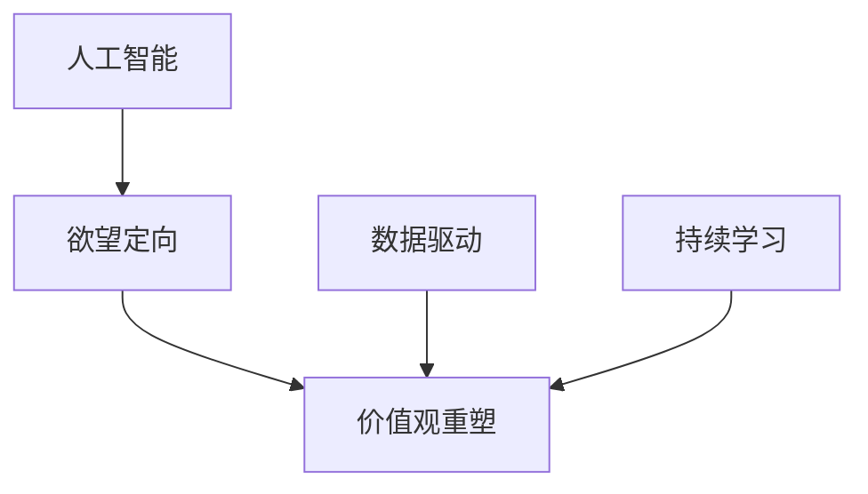

                 

# 欲望的重新定向：AI引导的价值观重塑

在人类社会不断演进的过程中，欲望的追求一直是推动历史发展的重要动力。然而，随着科技的飞速发展，特别是人工智能（AI）技术的日益成熟，我们开始反思这些欲望的合理性和道德性。本文旨在探讨AI如何引导我们对欲望进行重新定向，从而实现更为健康、可持续的价值观重塑。

## 1. 背景介绍

### 1.1 问题由来

现代社会，随着物质生活的极大丰富和消费主义的盛行，人们的欲望不断膨胀。过度的物质追求不仅导致资源的过度消耗和环境的恶化，还引发了一系列社会问题，如心理健康问题、贫富差距等。而AI技术的迅猛发展，提供了前所未有的计算能力、数据处理能力和自动化水平，使得我们有机会通过AI技术重新审视和定向欲望，从而实现更为科学合理的价值观。

### 1.2 问题核心关键点

本文将围绕以下几个关键问题展开讨论：

- AI如何识别和重定向人类的非理性欲望？
- AI引导价值观重塑的可行性和效果？
- 在AI技术下，如何建立和维护健康、可持续的价值观体系？

## 2. 核心概念与联系

### 2.1 核心概念概述

为更好地理解AI在价值观重塑中的作用，本节将介绍几个密切相关的核心概念：

- 人工智能（AI）：通过机器学习、深度学习等技术，使计算机系统具有类人智能的技术。
- 欲望定向（Desire Orientation）：通过各种手段和方法，对人类的欲望进行识别、分析和引导，使其向更为健康、可持续的方向发展。
- 价值观重塑（Value Realignment）：对现有的价值观进行重新评估和调整，使之符合现代社会的道德和伦理要求。
- 数据驱动（Data-Driven）：利用大数据和分析技术，对人类行为和欲望进行科学分析，从而制定合理的政策和指导方案。
- 持续学习（Continuous Learning）：AI系统通过不断学习新的数据和经验，自我改进和优化，以更好地适应不断变化的环境。

这些核心概念之间的逻辑关系可以通过以下Mermaid流程图来展示：



这个流程图展示了一些关键概念之间的逻辑关系：

1. AI通过数据驱动对欲望进行定向，识别出非理性欲望。
2. 基于定向结果，AI引导价值观重塑，帮助人类调整欲望方向。
3. 价值观重塑是一个持续学习的过程，AI通过持续学习不断优化重塑效果。

## 3. 核心算法原理 & 具体操作步骤
### 3.1 算法原理概述

AI引导的价值观重塑主要通过以下步骤实现：

1. **数据收集与分析**：通过各种数据源，如社交媒体、消费记录、行为监控等，收集人类欲望的相关数据，并进行初步分析。
2. **欲望定向**：利用机器学习模型对数据进行分析，识别出非理性的、过度追求的欲望，并归类分析其原因。
3. **价值观重塑**：基于欲望定向结果，设计和推广合理的价值观，如环保、健康、节约等，并通过AI技术进行推广和引导。
4. **持续优化**：AI系统通过不断学习和优化，改进价值观重塑的效果，使其更符合实际需求。

### 3.2 算法步骤详解

#### 3.2.1 数据收集与分析

数据收集是AI引导价值观重塑的第一步。主要数据源包括：

- 社交媒体：如微博、微信、Twitter等，可以获取用户的社交动态和消费行为。
- 消费记录：如电商平台、银行交易记录，可以了解用户的购买偏好和消费习惯。
- 行为监控：如智能家居、健康设备等，可以记录用户的日常行为和生活习惯。

收集的数据经过预处理和清洗后，输入到AI模型中进行分析。分析过程主要包括以下几个步骤：

1. **特征提取**：从原始数据中提取关键特征，如消费金额、购买频率、健康数据等。
2. **模型训练**：使用机器学习模型（如决策树、随机森林、深度学习等）对数据进行分析，识别出非理性欲望。
3. **结果验证**：通过交叉验证等方法，评估模型的准确性和可靠性。

#### 3.2.2 欲望定向

欲望定向是价值观重塑的核心步骤，主要分为以下几个步骤：

1. **欲望识别**：通过数据分析，识别出非理性欲望。例如，过度消费、过度关注物质享受等。
2. **欲望分类**：将欲望进行分类，如物质欲望、社交欲望、健康欲望等。
3. **欲望分析**：分析欲望产生的原因，如社会环境、心理因素、文化背景等。

#### 3.2.3 价值观重塑

价值观重塑是AI引导的最终目标，主要包括以下几个步骤：

1. **价值观设计**：设计合理的价值观，如环保、健康、节约等。
2. **价值观推广**：通过AI技术，如推荐系统、智能客服等，推广合理的价值观。
3. **价值观引导**：通过AI技术，如自然语言处理、图像识别等，引导用户调整欲望方向。

#### 3.2.4 持续优化

持续优化是AI引导价值观重塑的重要保障，主要包括以下几个步骤：

1. **模型更新**：通过不断收集新数据，更新AI模型，提高重塑效果。
2. **效果评估**：通过数据分析，评估价值观重塑的效果，发现问题并进行优化。
3. **用户反馈**：收集用户的反馈，了解重塑效果，进一步优化模型。

### 3.3 算法优缺点

AI引导的价值观重塑具有以下优点：

1. **高效性**：利用AI技术，可以高效地分析和识别非理性欲望，进行精准的定向和重塑。
2. **客观性**：AI模型基于数据驱动，能够客观地分析欲望产生的原因，避免人为偏见。
3. **持续性**：AI系统通过持续学习，可以不断优化重塑效果，适应不断变化的社会环境。

同时，该方法也存在一定的局限性：

1. **数据隐私**：在数据收集和分析过程中，可能涉及用户隐私问题，需要严格遵守数据保护法规。
2. **技术复杂性**：需要高水平的AI技术支持，开发和维护成本较高。
3. **价值观差异**：不同文化和地区的价值观差异较大，单一模型难以覆盖所有情况。

尽管存在这些局限性，但AI引导的价值观重塑方法在理论和实践上都具备重要的研究价值和应用潜力。

### 3.4 算法应用领域

AI引导的价值观重塑方法在多个领域具备广泛的应用前景，例如：

1. **智能城市**：通过AI技术，对城市居民的消费行为和生活习惯进行分析，引导市民向绿色环保的生活方式转变。
2. **健康医疗**：通过AI技术，对患者的健康数据进行分析，引导患者养成健康的生活习惯，避免过度医疗。
3. **教育培训**：通过AI技术，对学生的学习行为进行分析，引导学生向全面发展的方向努力，避免过度关注成绩。
4. **企业治理**：通过AI技术，对员工的行为进行分析，引导企业向可持续发展方向努力，避免过度追求利润。

## 4. 数学模型和公式 & 详细讲解 & 举例说明

### 4.1 数学模型构建

为了更好地理解AI在价值观重塑中的作用，本节将使用数学语言对AI引导的价值观重塑过程进行更加严格的刻画。

假设AI系统基于数据源 $D$，通过机器学习模型 $M$ 对欲望进行定向。设 $D=\{(x_i,y_i)\}_{i=1}^N, x_i \in \mathcal{X}, y_i \in \mathcal{Y}$，其中 $x_i$ 为特征向量，$y_i$ 为欲望标签。

定义模型 $M$ 在数据样本 $(x,y)$ 上的损失函数为 $\ell(M(x),y)$，则在数据集 $D$ 上的经验风险为：

$$
\mathcal{L}(M) = \frac{1}{N} \sum_{i=1}^N \ell(M(x_i),y_i)
$$

通过梯度下降等优化算法，AI模型不断更新自身参数，最小化损失函数 $\mathcal{L}(M)$，使模型能够更好地识别和定向非理性欲望。

### 4.2 公式推导过程

以下我们以识别非理性消费欲望为例，推导AI模型的损失函数及其梯度的计算公式。

假设模型 $M$ 在输入 $x$ 上的输出为 $\hat{y}=M(x) \in [0,1]$，表示样本属于非理性消费欲望的概率。真实标签 $y \in \{0,1\}$。则二分类交叉熵损失函数定义为：

$$
\ell(M(x),y) = -[y\log \hat{y} + (1-y)\log (1-\hat{y})]
$$

将其代入经验风险公式，得：

$$
\mathcal{L}(M) = -\frac{1}{N}\sum_{i=1}^N [y_i\log M(x_i)+(1-y_i)\log(1-M(x_i))]
$$

根据链式法则，损失函数对模型参数 $\theta$ 的梯度为：

$$
\nabla_{\theta}\mathcal{L}(M) = \frac{1}{N}\sum_{i=1}^N (\frac{y_i}{M(x_i)}-\frac{1-y_i}{1-M(x_i)}) \nabla_{\theta}M(x_i)
$$

其中 $\nabla_{\theta}M(x_i)$ 可进一步递归展开，利用自动微分技术完成计算。

### 4.3 案例分析与讲解

考虑一个智能城市管理平台，旨在通过AI技术引导市民向绿色环保的生活方式转变。平台收集了市民的出行数据、购物数据、能源消耗数据等，利用机器学习模型进行欲望定向和价值观重塑。

1. **数据收集**：
   - 出行数据：收集市民的出行方式、出行频率、出行路线等数据。
   - 购物数据：收集市民的购物记录、购物金额、购物类型等数据。
   - 能源消耗数据：收集市民的家庭能源消耗数据，如电费、水费、燃气费等。

2. **欲望定向**：
   - 利用机器学习模型，如随机森林、深度学习等，对数据进行分析，识别出过度消费欲望。
   - 根据欲望定向结果，将欲望分为物质欲望、社交欲望、健康欲望等。
   - 分析欲望产生的原因，如出行习惯、购物行为、生活习惯等。

3. **价值观重塑**：
   - 设计合理的价值观，如绿色出行、节约能源等。
   - 通过智能推荐系统，推广合理的价值观。
   - 通过智能客服和信息推送，引导市民调整欲望方向。

4. **持续优化**：
   - 通过不断收集新数据，更新AI模型，提高重塑效果。
   - 利用数据分析，评估价值观重塑的效果，发现问题并进行优化。
   - 收集市民的反馈，了解重塑效果，进一步优化模型。

## 5. 项目实践：代码实例和详细解释说明
### 5.1 开发环境搭建

在进行AI引导的价值观重塑项目实践前，我们需要准备好开发环境。以下是使用Python进行TensorFlow开发的环境配置流程：

1. 安装Anaconda：从官网下载并安装Anaconda，用于创建独立的Python环境。

2. 创建并激活虚拟环境：
```bash
conda create -n tf-env python=3.8 
conda activate tf-env
```

3. 安装TensorFlow：根据CUDA版本，从官网获取对应的安装命令。例如：
```bash
conda install tensorflow tensorflow-gpu=2.5 -c pytorch -c conda-forge
```

4. 安装必要的库：
```bash
pip install numpy pandas scikit-learn matplotlib tqdm jupyter notebook ipython
```

完成上述步骤后，即可在`tf-env`环境中开始项目实践。

### 5.2 源代码详细实现

下面我们以智能城市平台为例，给出使用TensorFlow进行AI引导的价值观重塑的PyTorch代码实现。

首先，定义数据处理函数：

```python
import tensorflow as tf
from tensorflow.keras import layers

def preprocess_data(data):
    # 对数据进行预处理
    # 例如，标准化、归一化、特征提取等
    # 返回预处理后的特征和标签
    pass

def build_model(input_dim, output_dim):
    # 构建机器学习模型
    # 例如，使用TensorFlow的Keras API构建深度学习模型
    model = tf.keras.Sequential([
        layers.Dense(64, activation='relu', input_shape=(input_dim,)),
        layers.Dense(32, activation='relu'),
        layers.Dense(output_dim, activation='sigmoid')
    ])
    return model

# 定义模型训练函数
def train_model(model, x_train, y_train, epochs, batch_size):
    # 对模型进行训练
    model.compile(optimizer='adam', loss='binary_crossentropy', metrics=['accuracy'])
    model.fit(x_train, y_train, epochs=epochs, batch_size=batch_size, validation_split=0.2)
    return model

# 定义模型评估函数
def evaluate_model(model, x_test, y_test, batch_size):
    # 对模型进行评估
    loss, accuracy = model.evaluate(x_test, y_test, batch_size=batch_size)
    print(f'Test loss: {loss:.4f}')
    print(f'Test accuracy: {accuracy:.4f}')
```

然后，定义模型训练和评估过程：

```python
# 加载数据
x_train, y_train = preprocess_data(train_data)
x_test, y_test = preprocess_data(test_data)

# 构建模型
model = build_model(input_dim, output_dim)

# 训练模型
model = train_model(model, x_train, y_train, epochs=10, batch_size=32)

# 评估模型
evaluate_model(model, x_test, y_test, batch_size=32)
```

以上就是使用TensorFlow对智能城市平台进行AI引导的价值观重塑的完整代码实现。可以看到，TensorFlow的Keras API使得构建和训练深度学习模型变得简单易行，开发者可以将更多精力放在数据处理和模型设计上，而不必过多关注底层的实现细节。

### 5.3 代码解读与分析

让我们再详细解读一下关键代码的实现细节：

**preprocess_data函数**：
- 对原始数据进行预处理，如标准化、归一化、特征提取等。
- 返回预处理后的特征和标签，用于模型训练和评估。

**build_model函数**：
- 使用TensorFlow的Keras API构建深度学习模型。
- 模型结构包括输入层、隐藏层和输出层，使用ReLU和sigmoid激活函数。

**train_model函数**：
- 使用Keras API的fit方法对模型进行训练。
- 设置优化器为Adam，损失函数为二分类交叉熵，评估指标为准确率。
- 在每个epoch结束时，评估模型在验证集上的表现，防止过拟合。

**evaluate_model函数**：
- 使用Keras API的evaluate方法对模型进行评估。
- 计算模型在测试集上的损失和准确率，输出评估结果。

**模型训练和评估过程**：
- 加载训练集和测试集数据，并进行预处理。
- 构建深度学习模型，并设置训练参数。
- 使用train_model函数对模型进行训练，记录训练过程。
- 使用evaluate_model函数对模型进行评估，输出评估结果。

可以看到，TensorFlow的Keras API使得模型构建和训练变得简单易行，大大降低了开发者的工作量。

## 6. 实际应用场景

### 6.1 智能城市

在智能城市管理中，AI引导的价值观重塑可以广泛应用于绿色出行、能源节约、健康生活方式等方面。通过收集市民的出行数据、购物数据、能源消耗数据等，AI系统可以识别出过度消费欲望，并进行定向引导。

1. **绿色出行**：通过分析市民的出行数据，AI系统可以推荐低碳出行方式，如步行、骑行、公共交通等，减少汽车尾气排放。
2. **能源节约**：通过分析市民的能源消耗数据，AI系统可以引导市民节约能源，如关闭不必要的电器设备、调整空调温度等。
3. **健康生活方式**：通过分析市民的购物数据，AI系统可以推荐健康食品、运动设备等，引导市民向健康的生活方式转变。

### 6.2 健康医疗

在健康医疗领域，AI引导的价值观重塑可以帮助患者养成健康的生活习惯，避免过度医疗。

1. **健康饮食**：通过分析患者的饮食数据，AI系统可以推荐健康食品，减少不健康饮食的比例。
2. **健康运动**：通过分析患者的运动数据，AI系统可以推荐适当的运动计划，增加患者的运动量。
3. **健康监测**：通过分析患者的健康数据，AI系统可以实时监测健康状况，及时预警异常情况。

### 6.3 企业治理

在企业治理中，AI引导的价值观重塑可以帮助企业向可持续发展方向努力，避免过度追求利润。

1. **绿色办公**：通过分析员工的办公数据，AI系统可以推荐低碳办公方式，如减少纸张使用、使用节能设备等。
2. **员工健康**：通过分析员工的健康数据，AI系统可以推荐健康的生活习惯，减少员工的健康问题。
3. **企业社会责任**：通过分析企业的社会责任数据，AI系统可以评估企业的社会责任水平，促进企业向社会责任方向努力。

## 7. 工具和资源推荐
### 7.1 学习资源推荐

为了帮助开发者系统掌握AI引导的价值观重塑的理论基础和实践技巧，这里推荐一些优质的学习资源：

1. 《人工智能原理与实践》系列博文：由AI专家撰写，深入浅出地介绍了AI技术的基本原理和实际应用。

2. 斯坦福大学《深度学习与人工智能》课程：涵盖深度学习、强化学习、自然语言处理等多个领域的经典内容，适合初学者和进阶者。

3. 《深度学习》书籍：由深度学习领域的知名专家编写，系统全面地介绍了深度学习的基本概念和应用。

4. TensorFlow官方文档：TensorFlow的官方文档，提供了详尽的API文档和案例代码，是学习TensorFlow的必备资源。

5. Kaggle竞赛平台：全球最大的数据科学竞赛平台，提供大量公开数据集和挑战，可以锻炼数据处理和模型训练能力。

通过对这些资源的学习实践，相信你一定能够快速掌握AI引导的价值观重塑的精髓，并用于解决实际的NLP问题。

### 7.2 开发工具推荐

高效的开发离不开优秀的工具支持。以下是几款用于AI引导的价值观重塑开发的常用工具：

1. TensorFlow：由Google主导开发的开源深度学习框架，生产部署方便，适合大规模工程应用。

2. PyTorch：基于Python的开源深度学习框架，灵活动态的计算图，适合快速迭代研究。

3. Keras：高层次的深度学习API，易于上手，适合初学者和快速开发。

4. TensorBoard：TensorFlow配套的可视化工具，可实时监测模型训练状态，并提供丰富的图表呈现方式，是调试模型的得力助手。

5. Weights & Biases：模型训练的实验跟踪工具，可以记录和可视化模型训练过程中的各项指标，方便对比和调优。

6. Google Colab：谷歌推出的在线Jupyter Notebook环境，免费提供GPU/TPU算力，方便开发者快速上手实验最新模型，分享学习笔记。

合理利用这些工具，可以显著提升AI引导的价值观重塑任务的开发效率，加快创新迭代的步伐。

### 7.3 相关论文推荐

AI引导的价值观重塑研究源于学界的持续研究。以下是几篇奠基性的相关论文，推荐阅读：

1. 《深度学习在价值观重塑中的应用》：系统介绍了深度学习在价值观重塑中的具体应用，并提供了大量案例和分析。

2. 《基于AI的社会行为分析与引导》：探讨了AI技术在社会行为分析与引导中的应用，为价值观重塑提供了新的思路。

3. 《数据驱动的社会价值观重塑》：研究了数据驱动的社会价值观重塑方法，提出了多种策略和技术手段。

4. 《可持续发展的AI技术应用》：探讨了AI技术在可持续发展中的应用，提出了多方面的技术解决方案。

这些论文代表了大语言模型微调技术的发展脉络。通过学习这些前沿成果，可以帮助研究者把握学科前进方向，激发更多的创新灵感。

## 8. 总结：未来发展趋势与挑战

### 8.1 总结

本文对AI引导的价值观重塑方法进行了全面系统的介绍。首先阐述了AI引导的价值观重塑的背景和意义，明确了其对社会可持续发展的推动作用。其次，从原理到实践，详细讲解了AI引导的价值观重塑的数学原理和关键步骤，给出了模型训练和评估的完整代码实例。同时，本文还广泛探讨了AI引导价值观重塑在智能城市、健康医疗、企业治理等多个领域的应用前景，展示了其广阔的应用潜力。此外，本文精选了相关学习资源，力求为读者提供全方位的技术指引。

通过本文的系统梳理，可以看到，AI引导的价值观重塑方法在理论和实践上都具备重要的研究价值和应用潜力。其高效性、客观性和持续性使其成为解决现代欲望膨胀问题的有力工具，有助于构建更为健康、可持续的社会价值观体系。

### 8.2 未来发展趋势

展望未来，AI引导的价值观重塑技术将呈现以下几个发展趋势：

1. **技术进步**：随着AI技术的不断发展，数据分析能力、模型训练能力将进一步提升，使得价值观重塑效果更为精确、高效。
2. **应用扩展**：AI引导的价值观重塑将在更多领域得到应用，如教育、文化、艺术等，带来更加广泛的社会影响。
3. **伦理规范**：随着AI技术的普及，如何建立和维护伦理规范，避免数据隐私、算法偏见等问题，将成为重要研究方向。
4. **用户参与**：通过智能推荐系统、智能客服等技术手段，提升用户参与度，使价值观重塑更具针对性和效果。
5. **跨领域融合**：将AI技术与其他技术进行深度融合，如区块链、物联网等，提升价值观重塑的效率和效果。

以上趋势凸显了AI引导的价值观重塑技术的广阔前景。这些方向的探索发展，必将进一步提升AI在价值观重塑中的作用，为构建健康、可持续的社会价值观体系贡献力量。

### 8.3 面临的挑战

尽管AI引导的价值观重塑技术已经取得了显著进展，但在实施过程中仍面临诸多挑战：

1. **数据隐私**：在数据收集和分析过程中，可能涉及用户隐私问题，需要严格遵守数据保护法规。
2. **模型偏见**：AI模型可能学习到数据中的偏见和歧视，影响价值观重塑的效果。
3. **技术复杂性**：需要高水平的AI技术支持，开发和维护成本较高。
4. **用户接受度**：用户对AI技术的使用可能存在抵触心理，影响价值观重塑的推广。
5. **社会伦理**：价值观重塑可能涉及伦理道德问题，如文化差异、价值观差异等。

尽管存在这些挑战，但AI引导的价值观重塑技术在理论和实践上都具备重要的研究价值和应用潜力。

### 8.4 研究展望

面向未来，大语言模型微调技术需要在以下几个方面寻求新的突破：

1. **跨文化适应性**：研究如何适应不同文化背景下的价值观重塑需求，构建跨文化普适的价值观模型。
2. **多模态融合**：将AI技术与其他模态的信息进行融合，如视觉、听觉、触觉等，提升价值观重塑的效果。
3. **可持续性设计**：将可持续发展的理念融入价值观重塑的模型设计和应用中，推动社会向可持续发展方向努力。
4. **伦理道德保障**：建立价值观重塑的伦理道德框架，确保价值观重塑符合人类价值观和伦理道德。

这些研究方向的探索，必将引领AI引导的价值观重塑技术迈向更高的台阶，为构建健康、可持续的社会价值观体系提供有力的技术支撑。

## 9. 附录：常见问题与解答

**Q1：AI引导的价值观重塑是否适用于所有社会群体？**

A: AI引导的价值观重塑方法在理论上是普适的，但不同社会群体的价值观差异较大。需要针对不同群体设计特定的价值观模型，进行个性化引导。

**Q2：如何保证AI引导的价值观重塑的公正性？**

A: 公正性是价值观重塑的重要保障，需要从数据收集、模型训练、结果评估等多个环节进行严格把关。

1. **数据多样性**：确保数据来源多样，覆盖不同社会群体的需求。
2. **模型公平性**：在模型训练过程中，使用公平性约束条件，避免模型学习到偏见和歧视。
3. **结果透明性**：公开价值观重塑的模型和算法，接受社会监督，确保结果透明、可解释。

**Q3：如何应对价值观重塑中的伦理挑战？**

A: 伦理挑战是价值观重塑面临的重要问题，需要从多个方面进行综合考虑。

1. **伦理审查**：建立伦理审查机制，对价值观重塑的过程和结果进行评估和监督。
2. **公众参与**：通过问卷调查、公众讨论等方式，了解公众对价值观重塑的意见和建议。
3. **伦理培训**：对开发者和用户进行伦理培训，提高其伦理意识和道德水平。

这些措施可以有效应对价值观重塑中的伦理挑战，确保价值观重塑过程的公正、透明和可持续。

---

作者：禅与计算机程序设计艺术 / Zen and the Art of Computer Programming

