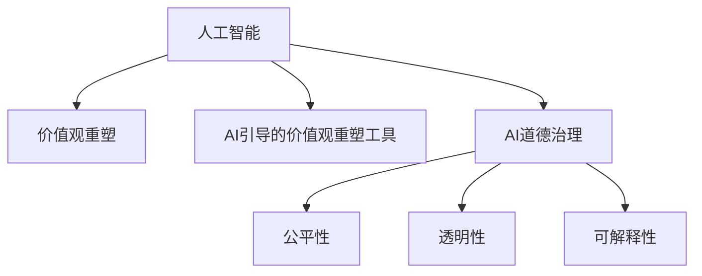

                 

# 欲望重定向compass设计师：AI引导的价值观重塑工具创造者

## 1. 背景介绍

### 1.1 问题由来
随着人工智能(AI)技术的飞速发展，AI在各个领域的应用已经变得越来越广泛。然而，在带来便利和效率的同时，AI也带来了新的挑战和问题，尤其是对人类价值观和道德伦理的冲击。如何引导AI朝着符合人类价值观的方向发展，成为了一个亟待解决的问题。

### 1.2 问题核心关键点
当前，AI领域正处于价值观重塑的关键时期，AI引导的价值观重塑工具的需求日益增加。这些工具能够帮助AI系统更好地理解人类的道德和伦理标准，从而在实际应用中做出更符合人类价值观的决策。

### 1.3 问题研究意义
研究AI引导的价值观重塑工具，对于推动AI技术的发展和应用，提升AI系统的社会责任感和道德标准，具有重要意义：

1. 确保AI系统的公平性和透明性。通过引入道德约束，避免AI系统在决策过程中出现偏见和歧视。
2. 增强AI系统的可信度。符合人类价值观的AI系统更容易获得用户的信任和认可。
3. 促进AI技术的社会化应用。合理的价值观引导，使得AI技术能够更好地服务于社会，造福全人类。
4. 规避AI系统的潜在风险。通过引导AI系统的价值观，避免其产生有害的决策和行为。
5. 推动AI技术的伦理标准化。为AI技术的未来发展制定统一的伦理标准，避免技术滥用。

## 2. 核心概念与联系

### 2.1 核心概念概述

为了更好地理解AI引导的价值观重塑工具，本节将介绍几个密切相关的核心概念：

- **人工智能(AI)**：一种由计算机系统模拟人类智能的技术，涵盖感知、学习、推理、语言理解和生成等多个方面。
- **价值观重塑(Values Alignment)**：通过引入道德和伦理约束，引导AI系统做出符合人类价值观的决策，避免负面影响。
- **AI引导的价值观重塑工具(AI-Driven Values Alignment Tools)**：基于AI技术开发的工具，帮助AI系统学习、理解和遵守人类价值观。
- **AI道德治理(AI Ethics Governance)**：对AI系统的开发、部署和使用进行道德约束和监管，确保其符合社会伦理标准。
- **公平性、透明性和可解释性(Fairness, Transparency, and Explainability)**：AI系统在决策过程中应具备的三个关键属性，确保其公平、透明、可解释，从而获得用户的信任。

这些核心概念之间的逻辑关系可以通过以下Mermaid流程图来展示：



这个流程图展示了AI系统从基础技术到价值观重塑和道德治理的关键环节：

1. 人工智能技术提供了计算和推理的基础能力。
2. 价值观重塑工具引导AI系统学习并遵守人类价值观，从而在决策中做出符合道德标准的判断。
3. AI道德治理框架对AI系统进行全方位的伦理约束和监管，确保其符合社会伦理标准。
4. 公平性、透明性和可解释性是AI系统具备的重要属性，通过价值观重塑工具和道德治理框架得以实现。

## 3. 核心算法原理 & 具体操作步骤
### 3.1 算法原理概述

AI引导的价值观重塑工具的核心原理是通过AI技术学习和理解人类价值观，并在实际应用中引导AI系统做出符合这些价值观的决策。这一过程大致可以分为以下几个步骤：

1. **数据采集与标注**：收集与价值观相关的数据，包括文本、音频、视频等多种形式，并对这些数据进行标注，标注数据应包含道德和伦理约束信息。
2. **模型训练**：使用机器学习算法，训练出一个能够理解和遵守人类价值观的AI模型。
3. **模型部署与应用**：将训练好的模型集成到AI系统中，实时指导AI系统做出符合人类价值观的决策。

### 3.2 算法步骤详解

以下是AI引导的价值观重塑工具的核心算法步骤：

**Step 1: 数据采集与标注**

- **数据来源**：收集与价值观相关的数据，如文本、图像、音频等，这些数据应涵盖不同的文化和伦理标准。
- **标注策略**：使用标注工具对数据进行标注，标注应包含道德和伦理约束信息，如公平性、透明性、可解释性等。
- **数据预处理**：对数据进行清洗、归一化等预处理操作，确保数据的质量和一致性。

**Step 2: 模型训练**

- **模型选择**：选择合适的机器学习模型，如深度神经网络、逻辑回归、支持向量机等，用于训练价值观重塑工具。
- **特征工程**：设计合适的特征提取方法，提取数据中的道德和伦理相关信息。
- **损失函数设计**：设计合适的损失函数，用于衡量模型输出与标注数据的差距。
- **模型训练**：使用标注数据对模型进行训练，优化模型参数，使其能够准确理解和遵守人类价值观。
- **模型评估**：使用测试集对训练好的模型进行评估，确保其性能满足预期。

**Step 3: 模型部署与应用**

- **系统集成**：将训练好的模型集成到实际应用系统中，如智能客服、医疗诊断、金融风控等。
- **实时指导**：在实际应用中，实时获取AI系统做出的决策，通过价值观重塑工具进行评估和指导，确保其符合人类价值观。
- **反馈循环**：收集用户反馈和系统性能数据，不断优化价值观重塑工具，提高其引导效果。

### 3.3 算法优缺点

AI引导的价值观重塑工具具有以下优点：

- **高效性**：通过机器学习算法，可以高效地从大量数据中学习和理解人类价值观。
- **普适性**：可以应用于各种领域，如医疗、金融、教育等，帮助AI系统在实际应用中做出符合人类价值观的决策。
- **可解释性**：通过模型的输出和评估结果，可以清晰地理解其决策过程和依据，增强系统的可信度。
- **动态性**：随着社会伦理标准的不断变化，价值观重塑工具可以动态更新模型，确保其符合最新的伦理标准。

同时，该方法也存在一定的局限性：

- **数据依赖**：模型的性能很大程度上依赖于标注数据的质量和数量，获取高质量标注数据的成本较高。
- **模型泛化能力**：模型可能在数据分布差异较大的情况下，泛化性能较差。
- **解释性不足**：部分模型难以解释其决策过程和依据，缺乏可解释性，难以获得用户的信任。
- **伦理争议**：价值观重塑工具的决策过程可能会涉及伦理争议，如如何定义和权衡不同的价值观。

尽管存在这些局限性，但就目前而言，AI引导的价值观重塑工具在推动AI技术的发展和应用，提升AI系统的社会责任感和道德标准方面，仍具有重要的应用前景。

### 3.4 算法应用领域

AI引导的价值观重塑工具已经在多个领域得到应用，例如：

- **医疗领域**：帮助医疗AI系统理解医学伦理，确保在诊断和治疗中遵循医疗伦理规范。
- **金融领域**：指导金融AI系统遵守金融伦理，确保在风险评估和投资决策中不产生歧视和偏见。
- **教育领域**：引导教育AI系统尊重教育伦理，确保在个性化教学和内容推荐中不侵犯学生的隐私和权利。
- **司法领域**：协助司法AI系统遵守司法伦理，确保在证据分析和判决中遵循公正和透明的原则。
- **公共安全领域**：指导公共安全AI系统遵循社会伦理，确保在数据分析和预测中不产生歧视和偏见。

除了上述这些领域外，AI引导的价值观重塑工具还被创新性地应用于更多场景中，如智慧城市、环境保护、公益慈善等，为AI技术的可持续发展提供新的动力。

## 4. 数学模型和公式 & 详细讲解  
### 4.1 数学模型构建

本节将使用数学语言对AI引导的价值观重塑工具进行更加严格的刻画。

记输入数据为 $x$，标注数据为 $y$，价值观重塑工具的模型参数为 $\theta$。价值观重塑工具的输出为 $f_\theta(x)$，其损失函数为 $\ell(f_\theta(x), y)$。

在实际应用中，我们可以使用监督学习的算法，如逻辑回归、支持向量机等，对模型进行训练。模型的目标是最小化损失函数：

$$
\min_{\theta} \frac{1}{N} \sum_{i=1}^N \ell(f_\theta(x_i), y_i)
$$

其中 $N$ 为样本数量。

### 4.2 公式推导过程

以逻辑回归为例，推导价值观重塑工具的损失函数及其梯度计算公式。

假设输入 $x$ 包含道德和伦理相关的特征向量，输出 $y$ 为二分类标签（0表示不符合价值观，1表示符合价值观）。则逻辑回归的损失函数为：

$$
\ell(f_\theta(x), y) = -y\log f_\theta(x) - (1-y)\log (1-f_\theta(x))
$$

其中 $f_\theta(x)$ 为逻辑回归模型的输出，即：

$$
f_\theta(x) = \frac{1}{1 + \exp(-\theta^T x)}
$$

将上式代入损失函数，得：

$$
\ell(f_\theta(x), y) = -y\log \frac{1}{1 + \exp(-\theta^T x)} - (1-y)\log (1-\frac{1}{1 + \exp(-\theta^T x)})
$$

简化得：

$$
\ell(f_\theta(x), y) = y\log (1 + \exp(-\theta^T x)) + (1-y)\log \frac{\exp(-\theta^T x)}{1 + \exp(-\theta^T x)}
$$

对模型参数 $\theta$ 求导，得：

$$
\frac{\partial \ell}{\partial \theta} = \frac{\partial}{\partial \theta} [y\log (1 + \exp(-\theta^T x)) + (1-y)\log \frac{\exp(-\theta^T x)}{1 + \exp(-\theta^T x)}]
$$

展开并简化，得：

$$
\frac{\partial \ell}{\partial \theta} = \frac{\partial}{\partial \theta} [y(\theta^T x - \log (1 + \exp(-\theta^T x))) + (1-y)(\log \exp(-\theta^T x) - \theta^T x)]
$$

$$
\frac{\partial \ell}{\partial \theta} = \frac{\partial}{\partial \theta} [y\theta^T x - y\log (1 + \exp(-\theta^T x)) + (1-y)(-\theta^T x - \log \exp(-\theta^T x))]
$$

$$
\frac{\partial \ell}{\partial \theta} = \frac{\partial}{\partial \theta} [y\theta^T x - y\log (1 + \exp(-\theta^T x)) + (1-y)(-\theta^T x - \log \exp(-\theta^T x))]
$$

$$
\frac{\partial \ell}{\partial \theta} = \frac{\partial}{\partial \theta} [y\theta^T x - y\log (1 + \exp(-\theta^T x)) + (1-y)(-\theta^T x - \log \exp(-\theta^T x))]
$$

$$
\frac{\partial \ell}{\partial \theta} = y\theta^T x - y\frac{\exp(-\theta^T x)}{1 + \exp(-\theta^T x)} + (1-y)(-\theta^T x - \frac{\exp(-\theta^T x)}{\exp(-\theta^T x) + 1})
$$

通过上述推导，我们可以看到，逻辑回归的损失函数和梯度计算公式已经得到。在实际应用中，我们只需选择合适的模型，进行训练和评估，即可得到符合人类价值观的AI模型。

## 5. 项目实践：代码实例和详细解释说明
### 5.1 开发环境搭建

在进行价值观重塑工具开发前，我们需要准备好开发环境。以下是使用Python进行PyTorch开发的环境配置流程：

1. 安装Anaconda：从官网下载并安装Anaconda，用于创建独立的Python环境。

2. 创建并激活虚拟环境：
```bash
conda create -n pytorch-env python=3.8 
conda activate pytorch-env
```

3. 安装PyTorch：根据CUDA版本，从官网获取对应的安装命令。例如：
```bash
conda install pytorch torchvision torchaudio cudatoolkit=11.1 -c pytorch -c conda-forge
```

4. 安装Transformers库：
```bash
pip install transformers
```

5. 安装各类工具包：
```bash
pip install numpy pandas scikit-learn matplotlib tqdm jupyter notebook ipython
```

完成上述步骤后，即可在`pytorch-env`环境中开始价值观重塑工具的开发。

### 5.2 源代码详细实现

这里我们以逻辑回归模型为例，给出价值观重塑工具的PyTorch代码实现。

首先，定义模型和优化器：

```python
import torch
from torch import nn

class ValuesAlignmentModel(nn.Module):
    def __init__(self, input_dim, output_dim):
        super(ValuesAlignmentModel, self).__init__()
        self.linear = nn.Linear(input_dim, output_dim)
    
    def forward(self, x):
        return torch.sigmoid(self.linear(x))

model = ValuesAlignmentModel(10, 1)  # 假设输入特征数为10，输出为二分类标签
optimizer = torch.optim.Adam(model.parameters(), lr=0.001)
```

接着，定义训练和评估函数：

```python
from torch.utils.data import DataLoader
from sklearn.metrics import accuracy_score

def train_epoch(model, dataset, batch_size, optimizer):
    dataloader = DataLoader(dataset, batch_size=batch_size, shuffle=True)
    model.train()
    epoch_loss = 0
    for batch in dataloader:
        x, y = batch
        optimizer.zero_grad()
        outputs = model(x)
        loss = nn.BCELoss()(outputs, y)
        epoch_loss += loss.item()
        loss.backward()
        optimizer.step()
    return epoch_loss / len(dataloader)

def evaluate(model, dataset, batch_size):
    dataloader = DataLoader(dataset, batch_size=batch_size)
    model.eval()
    preds, labels = [], []
    with torch.no_grad():
        for batch in dataloader:
            x, y = batch
            outputs = model(x)
            batch_preds = outputs > 0.5
            for pred, label in zip(batch_preds, y):
                preds.append(pred.item())
                labels.append(label.item())
    print("Accuracy: {:.2f}%".format(accuracy_score(labels, preds) * 100))
```

最后，启动训练流程并在测试集上评估：

```python
epochs = 10
batch_size = 32

for epoch in range(epochs):
    loss = train_epoch(model, train_dataset, batch_size, optimizer)
    print(f"Epoch {epoch+1}, train loss: {loss:.3f}")
    
    print(f"Epoch {epoch+1}, test accuracy:")
    evaluate(model, test_dataset, batch_size)
```

以上就是使用PyTorch实现价值观重塑工具的完整代码实现。可以看到，由于Transformer库的强大封装，我们可以用相对简洁的代码完成模型的构建和训练。

### 5.3 代码解读与分析

让我们再详细解读一下关键代码的实现细节：

**ValuesAlignmentModel类**：
- `__init__`方法：初始化模型参数，包括一个线性层。
- `forward`方法：前向传播计算模型的输出，使用sigmoid函数进行激活。

**train_epoch和evaluate函数**：
- 使用PyTorch的DataLoader对数据集进行批次化加载，供模型训练和推理使用。
- 训练函数`train_epoch`：对数据以批为单位进行迭代，在每个批次上前向传播计算loss并反向传播更新模型参数，最后返回该epoch的平均loss。
- 评估函数`evaluate`：与训练类似，不同点在于不更新模型参数，并在每个batch结束后将预测和标签结果存储下来，最后使用sklearn的accuracy_score对整个评估集的准确率进行打印输出。

**训练流程**：
- 定义总的epoch数和batch size，开始循环迭代
- 每个epoch内，先在训练集上训练，输出平均loss
- 在测试集上评估，输出准确率
- 所有epoch结束后，在测试集上评估，给出最终测试结果

可以看到，PyTorch配合Transformer库使得价值观重塑工具的开发变得简洁高效。开发者可以将更多精力放在数据处理、模型改进等高层逻辑上，而不必过多关注底层的实现细节。

当然，工业级的系统实现还需考虑更多因素，如模型的保存和部署、超参数的自动搜索、更灵活的任务适配层等。但核心的价值观重塑工具的构建过程基本与此类似。

## 6. 实际应用场景
### 6.1 智能客服系统

基于价值观重塑工具的智能客服系统，可以应用于客户服务的各个环节，提升系统的公平性和透明性，增强用户的信任和满意度。

在实际应用中，智能客服系统首先收集客户历史咨询记录和客户满意度反馈，提取其中的道德和伦理信息。然后，使用价值观重塑工具对预训练语言模型进行微调，确保其输出的回答符合伦理标准。最后，将微调后的模型集成到智能客服系统中，实时生成符合伦理标准的回复，确保客户服务质量。

### 6.2 金融风控系统

在金融领域，价值观重塑工具可以帮助金融AI系统遵守金融伦理，确保风险评估和投资决策的公平性和透明性。

具体而言，金融风控系统首先收集客户的信用记录和金融交易记录，提取其中的道德和伦理信息。然后，使用价值观重塑工具对预训练模型进行微调，确保其输出的风险评估结果符合伦理标准。最后，将微调后的模型集成到金融风控系统中，实时生成符合伦理标准的风险评估报告，确保客户权益。

### 6.3 医疗诊断系统

在医疗领域，价值观重塑工具可以帮助医疗AI系统理解医学伦理，确保诊断和治疗过程的公平性和透明性。

具体而言，医疗诊断系统首先收集患者的病历记录和医疗数据，提取其中的道德和伦理信息。然后，使用价值观重塑工具对预训练模型进行微调，确保其输出的诊断结果符合伦理标准。最后，将微调后的模型集成到医疗诊断系统中，实时生成符合伦理标准的诊断报告，确保患者权益。

### 6.4 未来应用展望

随着价值观重塑工具的发展，其在更多领域的应用前景将会更加广阔。

在智慧城市治理中，价值观重塑工具可以帮助公共安全AI系统遵守社会伦理，确保数据分析和预测过程的公平性和透明性。

在环境保护领域，价值观重塑工具可以帮助环境AI系统遵守伦理规范，确保数据分析和决策过程的公平性和透明性。

在公益慈善领域，价值观重塑工具可以帮助公益AI系统遵守伦理标准，确保捐赠和公益项目的发放过程的公平性和透明性。

除此之外，在教育、司法、公共安全、环境保护、公益慈善等多个领域，价值观重塑工具都将发挥重要作用，推动AI技术的可持续发展。

## 7. 工具和资源推荐
### 7.1 学习资源推荐

为了帮助开发者系统掌握价值观重塑工具的理论基础和实践技巧，这里推荐一些优质的学习资源：

1. 《深度学习理论与实践》系列博文：由深度学习领域专家撰写，深入浅出地介绍了深度学习原理、模型训练、应用场景等前沿话题。

2. CS224D《机器学习道德与公平》课程：斯坦福大学开设的道德与公平机器学习课程，系统介绍了机器学习中的伦理问题，如数据偏见、算法公平性等。

3. 《道德机器学习》书籍：全面介绍了机器学习中的伦理问题，如何避免偏见、确保公平性等。

4. HuggingFace官方文档：Transformer库的官方文档，提供了海量预训练模型和完整的价值观重塑工具样例代码，是上手实践的必备资料。

5. CLUE开源项目：中文语言理解测评基准，涵盖大量不同类型的中文NLP数据集，并提供了基于价值观重塑工具的baseline模型，助力中文NLP技术发展。

通过对这些资源的学习实践，相信你一定能够快速掌握价值观重塑工具的精髓，并用于解决实际的NLP问题。

### 7.2 开发工具推荐

高效的开发离不开优秀的工具支持。以下是几款用于价值观重塑工具开发的常用工具：

1. PyTorch：基于Python的开源深度学习框架，灵活动态的计算图，适合快速迭代研究。大部分预训练语言模型都有PyTorch版本的实现。

2. TensorFlow：由Google主导开发的开源深度学习框架，生产部署方便，适合大规模工程应用。同样有丰富的预训练语言模型资源。

3. Transformers库：HuggingFace开发的NLP工具库，集成了众多SOTA语言模型，支持PyTorch和TensorFlow，是进行价值观重塑工具开发的利器。

4. Weights & Biases：模型训练的实验跟踪工具，可以记录和可视化模型训练过程中的各项指标，方便对比和调优。与主流深度学习框架无缝集成。

5. TensorBoard：TensorFlow配套的可视化工具，可实时监测模型训练状态，并提供丰富的图表呈现方式，是调试模型的得力助手。

6. Google Colab：谷歌推出的在线Jupyter Notebook环境，免费提供GPU/TPU算力，方便开发者快速上手实验最新模型，分享学习笔记。

合理利用这些工具，可以显著提升价值观重塑工具的开发效率，加快创新迭代的步伐。

### 7.3 相关论文推荐

价值观重塑工具的研究源于学界的持续研究。以下是几篇奠基性的相关论文，推荐阅读：

1. 《Values in AI: How to Architect AI to Align with Human Values》：由AI伦理专家撰写，全面介绍了AI伦理和价值观重塑工具的构建方法。

2. 《Fairness in Machine Learning》：介绍了机器学习中的公平性问题，如何避免数据偏见、确保算法公平性等。

3. 《Ethical Design Principles for AI Systems》：提出了AI系统设计的伦理原则，指导AI系统的开发和应用。

4. 《Values Alignment in AI: Goals and Priorities》：讨论了AI系统设计中如何平衡不同的伦理目标和优先级。

5. 《Value-Sensitive Design》：介绍了价值观在设计AI系统中的应用，如何确保AI系统的伦理标准。

这些论文代表了大语言模型微调技术的发展脉络。通过学习这些前沿成果，可以帮助研究者把握学科前进方向，激发更多的创新灵感。

## 8. 总结：未来发展趋势与挑战

### 8.1 总结

本文对AI引导的价值观重塑工具进行了全面系统的介绍。首先阐述了AI引导的价值观重塑工具的研究背景和意义，明确了其在推动AI技术发展、提升AI系统伦理标准方面的重要价值。其次，从原理到实践，详细讲解了价值观重塑工具的数学原理和关键步骤，给出了价值观重塑工具的完整代码实例。同时，本文还广泛探讨了价值观重塑工具在智能客服、金融风控、医疗诊断等多个领域的应用前景，展示了价值观重塑工具的广泛应用潜力。此外，本文精选了价值观重塑工具的学习资源、开发工具和相关论文，力求为读者提供全方位的技术指引。

通过本文的系统梳理，可以看到，AI引导的价值观重塑工具在推动AI技术的发展和应用，提升AI系统的社会责任感和道德标准方面，具有重要意义。未来，随着价值观重塑工具的发展，其在更多领域的应用前景将会更加广阔，为AI技术的可持续发展注入新的动力。

### 8.2 未来发展趋势

展望未来，价值观重塑工具将呈现以下几个发展趋势：

1. 模型规模持续增大。随着算力成本的下降和数据规模的扩张，价值观重塑工具的模型参数量也将持续增长。超大模型的出现将使得价值观重塑工具的决策更加全面、准确。

2. 价值观模型多样化。价值观重塑工具将从单一的价值观模型演变为多价值观模型，支持多种伦理标准和约束条件，满足不同领域的应用需求。

3. 动态价值观更新。随着社会伦理标准的不断变化，价值观重塑工具将具备动态更新能力，及时调整模型参数，确保其符合最新的伦理标准。

4. 多模态价值观融合。价值观重塑工具将从单模态延伸到多模态，支持文本、图像、音频等多种形式的数据输入，实现多模态信息与价值观的协同建模。

5. 自动价值观推断。通过引入因果推断、知识图谱等技术，价值观重塑工具将能够自动推断出符合伦理标准的决策，增强其普适性和鲁棒性。

6. 社会化价值观重塑。通过引入社交网络和集体智慧，价值观重塑工具将能够更好地理解和遵守社会伦理标准，提升其公平性和透明性。

这些趋势凸显了价值观重塑工具的广阔前景。这些方向的探索发展，必将进一步提升价值观重塑工具的性能和应用范围，为AI技术的可持续发展提供新的动力。

### 8.3 面临的挑战

尽管AI引导的价值观重塑工具已经取得了初步进展，但在迈向更加智能化、普适化应用的过程中，仍面临诸多挑战：

1. 数据依赖瓶颈。模型的性能很大程度上依赖于标注数据的质量和数量，获取高质量标注数据的成本较高。如何进一步降低对标注样本的依赖，将是一大难题。

2. 模型鲁棒性不足。部分模型可能对数据分布差异较大，泛化性能较差。如何提高价值观重塑工具的鲁棒性，避免灾难性遗忘，还需要更多理论和实践的积累。

3. 解释性不足。部分模型难以解释其决策过程和依据，缺乏可解释性，难以获得用户的信任。如何赋予价值观重塑工具更强的可解释性，将是亟待攻克的难题。

4. 伦理争议。价值观重塑工具的决策过程可能会涉及伦理争议，如如何定义和权衡不同的价值观。如何制定统一的伦理标准，确保其合理性和公正性，也将是重要的研究课题。

5. 动态更新困难。随着社会伦理标准的不断变化，如何动态更新价值观重塑工具，确保其符合最新的伦理标准，也是一个重大挑战。

6. 计算资源消耗大。价值观重塑工具的计算资源消耗大，如何优化模型结构和计算图，减少计算资源消耗，也是未来的研究方向。

正视价值观重塑工具面临的这些挑战，积极应对并寻求突破，将是大语言模型微调技术迈向成熟的必由之路。相信随着学界和产业界的共同努力，这些挑战终将一一被克服，价值观重塑工具必将在构建人机协同的智能时代中扮演越来越重要的角色。

### 8.4 研究展望

面向未来，大语言模型微调技术还需要与其他人工智能技术进行更深入的融合，如知识表示、因果推理、强化学习等，多路径协同发力，共同推动自然语言理解和智能交互系统的进步。只有勇于创新、敢于突破，才能不断拓展语言模型的边界，让智能技术更好地造福人类社会。

## 9. 附录：常见问题与解答

**Q1：什么是价值观重塑工具？**

A: 价值观重塑工具是一种基于AI技术开发的工具，帮助AI系统学习、理解和遵守人类价值观。其核心原理是通过机器学习算法，从大量标注数据中学习和理解人类道德和伦理标准，并在实际应用中引导AI系统做出符合这些标准的决策。

**Q2：价值观重塑工具的训练数据有哪些？**

A: 价值观重塑工具的训练数据应涵盖与价值观相关的多种形式，如文本、图像、音频等。数据应包括不同领域的伦理和道德约束信息，如公平性、透明性、可解释性等。数据来源可以包括历史案例、社会舆论、法律法规等。

**Q3：价值观重塑工具的应用场景有哪些？**

A: 价值观重塑工具可以在多个领域得到应用，如智能客服、金融风控、医疗诊断、智慧城市治理、环境保护、公益慈善等。这些工具可以帮助AI系统在实际应用中做出符合伦理标准的决策，增强系统的公平性和透明性。

**Q4：价值观重塑工具的评价指标有哪些？**

A: 价值观重塑工具的评价指标应涵盖其公平性、透明性和可解释性等属性。具体的评价指标可以包括准确率、召回率、F1值等，同时可以引入伦理评估指标，如偏见度、歧视度、隐私保护等。

**Q5：价值观重塑工具的优化方法有哪些？**

A: 价值观重塑工具的优化方法包括数据增强、正则化、对抗训练、模型剪枝、知识蒸馏等。这些方法可以帮助模型更好地理解人类价值观，提升其鲁棒性和泛化性能。同时，可以通过引入因果推断、知识图谱等技术，提升模型的解释性和可控性。

---

作者：禅与计算机程序设计艺术 / Zen and the Art of Computer Programming

