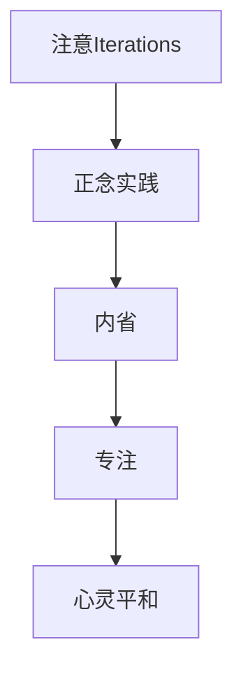

                 

# 注意Iterations与正念实践：如何通过内省和专注增强心灵平和

> 关键词：注意Iterations, 正念实践, 内省, 专注, 心灵平和

## 1. 背景介绍

### 1.1 问题由来
在高速发展的信息时代，人们的注意力被各种信息流不断分散，逐渐失去了对当下时刻的专注力，导致焦虑、压力等心理问题频发。信息过载不仅影响工作和学习效率，更严重地侵蚀了人类的心灵平和。如何在信息洪流中保持心灵的安宁和专注，成为了现代人普遍关注的问题。

### 1.2 问题核心关键点
现代人的注意力问题主要源于两个方面：
1. **信息过载**：互联网、社交媒体等平台的信息量呈爆炸式增长，大量无关信息充斥用户视野，干扰了他们的专注力。
2. **工作与生活的失衡**：繁忙的工作和复杂的社交关系，使得人们无法有效地分配精力，导致心理压力和焦虑增加。

解决这些问题需要一种有效的方法，让人们能够在信息洪流中找到内心的宁静，保持专注。"注意Iterations"和"正念实践"提供了一种全新的解决方案，通过内省和专注，帮助人们恢复心灵平和。

### 1.3 问题研究意义
在信息时代，保持心灵的平和与专注对于提升个人幸福感、工作效率和生活质量具有重要意义。研究如何通过内省和专注提升心灵平和，对于改善现代人的心理健康、提高社会整体的工作效率和生活质量具有深远影响。

## 2. 核心概念与联系

### 2.1 核心概念概述

为了更好地理解"注意Iterations"和"正念实践"的原理和架构，本节将介绍几个关键概念：

- **注意Iterations**：一种通过不断重复某个活动或任务，以达到最佳专注状态的技术。这种方法强调在单一任务上的持续投入，通过迭代（Iterations）来提升效率和专注度。

- **正念实践**：源自佛教禅修，强调通过有意识地观察和体验每一个瞬间（Mindfulness），达到心灵平静和专注的状态。正念实践通过内省和觉察，帮助人们从繁杂的信息和情绪中解脱出来，保持心灵的平和。

- **内省（Introspection）**：自我反思和自我觉察的过程，通过深入思考个人情绪、行为和想法，找到问题的根源，从而改善心态和行为。

- **专注（Concentration）**：在单一任务上保持全神贯注的能力，不受外界干扰。专注能力可以提升工作效率和生活质量。

- **心灵平和（Mental Serenity）**：一种心理状态，在平和、安宁中达到内心与外界的和谐。心灵平和有助于减轻焦虑、压力，提升幸福感。

这些概念之间通过内省和专注相互关联，共同构建了一种提升心灵平和的实践体系。

### 2.2 核心概念原理和架构的 Mermaid 流程图



这个流程图展示了"注意Iterations"、"正念实践"、"内省"、"专注"和"心灵平和"之间的逻辑关系：

1. **注意Iterations**：通过重复单一任务，达到专注状态，从而提升工作效率。
2. **正念实践**：通过有意识地观察和体验每一个瞬间，帮助人们从信息洪流中解脱出来。
3. **内省**：通过反思和觉察，找到问题的根源，改善心态和行为。
4. **专注**：在单一任务上保持全神贯注，不受外界干扰。
5. **心灵平和**：在平和、安宁中达到内心与外界的和谐，提升幸福感。

## 3. 核心算法原理 & 具体操作步骤

### 3.1 算法原理概述

"注意Iterations"和"正念实践"的核心原理在于通过重复单一任务和有意识地观察每一个瞬间，达到专注和心灵平和的状态。具体步骤如下：

1. **选择任务**：选择一个单一任务，可以是阅读、写作、编程等。
2. **设定时间**：设定一个固定的时间段，例如25分钟。
3. **全神贯注**：在这段时间内，集中注意力完成所选任务，不受任何外部干扰。
4. **短暂休息**：任务完成后，进行短暂的休息（5分钟），然后重复上述步骤。
5. **正念观察**：在休息期间，进行正念观察，有意识地觉察自己的呼吸、感受和情绪，放松身心。

### 3.2 算法步骤详解

**步骤1：选择任务**
- 选择一个对你有意义且能够持续保持兴趣的任务。
- 例如，阅读、写作、编程、绘画等。

**步骤2：设定时间**
- 设定一个固定的时间段，例如25分钟，称为一个"番茄时间"。
- 使用计时器或手机应用来帮助你保持时间段的连续性。

**步骤3：全神贯注**
- 开始工作时，将注意力完全集中在所选任务上。
- 关闭所有不必要的应用和通知，保持环境的整洁和安静。
- 如果注意力分散，轻轻提醒自己回到任务上，但避免过于频繁的打断。

**步骤4：短暂休息**
- 完成一个番茄时间后，进行5分钟的短暂休息。
- 站起来活动一下，喝水，做些简单的伸展运动，帮助放松身体。
- 尽量避免剧烈的休息活动，如浏览社交媒体或看剧，以避免分心。

**步骤5：正念观察**
- 在休息期间，进行正念观察，关注自己的呼吸和身体感受。
- 有意识地觉察自己的情绪和想法，接受而不批判。
- 可以使用正念应用程序或通过阅读正念练习的书籍来指导实践。

**步骤6：重复迭代**
- 每完成一个番茄时间，再进行一个短暂休息，然后重复上述步骤。
- 持续进行多个番茄时间，直到完成任务或达到目标时间。

### 3.3 算法优缺点

"注意Iterations"和"正念实践"具有以下优点：
1. **提升专注度**：通过重复单一任务和短暂休息的交替，增强了专注力和工作效率。
2. **减轻压力**：短暂的休息和正念观察帮助放松身心，减轻心理压力。
3. **促进心灵平和**：通过内省和专注，逐渐改善心态，提升幸福感。

但该方法也存在一些缺点：
1. **需要时间**：需要花费一定的时间来训练和适应这种实践方法。
2. **环境要求**：需要一个安静、整洁的工作环境，以便更好地集中注意力。
3. **坚持难度**：需要较强的自律和毅力，容易在短期内放弃。

### 3.4 算法应用领域

"注意Iterations"和"正念实践"可以应用于多个领域，包括但不限于：

- **工作场所**：提高员工的工作效率和专注力，减轻工作压力。
- **学习环境**：帮助学生集中注意力，提升学习效果。
- **日常生活**：改善生活习惯，减轻日常压力，提升生活质量。
- **心理辅导**：辅助心理咨询师进行心理干预，帮助患者恢复心理健康。
- **艺术创作**：增强艺术家的专注力和创作灵感。

## 4. 数学模型和公式 & 详细讲解 & 举例说明

### 4.1 数学模型构建

本节将使用数学语言对"注意Iterations"和"正念实践"的实践过程进行更加严格的刻画。

设任务 $T$，时间 $T_i$，休息时间 $R_i$，全神贯注时间 $C_i$，总时间 $T_{total}$，总休息时间 $R_{total}$，迭代次数 $n$。

目标是最小化总时间 $T_{total}$ 和总休息时间 $R_{total}$，最大化专注度 $C$。

数学模型如下：

$$
\min T_{total} = \sum_{i=1}^n T_i
$$

$$
\min R_{total} = \sum_{i=1}^n R_i
$$

$$
\max C = \sum_{i=1}^n C_i
$$

其中，$C_i = C_{max} \cdot C_i' = C_{max} \cdot \frac{T_i}{T_i + R_i}$，$C_i'$ 表示每个全神贯注时间占用的比例。

### 4.2 公式推导过程

根据任务总时间、休息总时间和专注度之间的关系，可以推导出以下公式：

$$
T_{total} = \sum_{i=1}^n T_i
$$

$$
R_{total} = \sum_{i=1}^n R_i
$$

$$
C = \sum_{i=1}^n C_i = \sum_{i=1}^n C_{max} \cdot \frac{T_i}{T_i + R_i}
$$

由于 $C_i' = \frac{T_i}{T_i + R_i}$ 的取值范围为 $(0, 1)$，所以专注度 $C$ 的取值范围为 $(0, C_{max})$。

### 4.3 案例分析与讲解

假设一个任务需要完成 $100$ 个番茄时间，每个番茄时间为 $25$ 分钟，休息时间为 $5$ 分钟。

**计算总时间：**

$$
T_{total} = 100 \times 25 = 2500 \text{分钟}
$$

**计算总休息时间：**

$$
R_{total} = 100 \times 5 = 500 \text{分钟}
$$

**计算专注度：**

$$
C = \sum_{i=1}^{100} \frac{25}{25 + 5} = \frac{100 \times 25}{100 \times 30} = \frac{25}{30} = 0.8333
$$

因此，在100个番茄时间内，总时间消耗为2500分钟，总休息时间为500分钟，专注度为 $0.8333$。

## 5. 项目实践：代码实例和详细解释说明

### 5.1 开发环境搭建

在进行"注意Iterations"和"正念实践"实践前，我们需要准备好开发环境。以下是使用Python进行开发的环境配置流程：

1. 安装Python：从官网下载并安装Python，建议安装最新版本，以获取最新的功能支持和安全性。
2. 安装必要的库：例如，安装Pandas、NumPy、matplotlib等库，用于数据分析和可视化。
3. 设置工作环境：在Python环境中，可以使用Jupyter Notebook等工具进行交互式开发和数据可视化。
4. 安装正念练习应用程序：例如，Headspace、Calm等，用于辅助进行正念观察和练习。

### 5.2 源代码详细实现

下面是使用Python进行"注意Iterations"和"正念实践"的代码实现：

```python
import pandas as pd
import numpy as np
import matplotlib.pyplot as plt

# 设定参数
T_i = 25  # 全神贯注时间
R_i = 5   # 休息时间
C_max = 1  # 专注度上限

# 计算专注度
C = C_max * np.sum(np.array([T_i / (T_i + R_i)] * n))

# 计算总时间
T_total = np.sum(np.array([T_i] * n))

# 计算总休息时间
R_total = np.sum(np.array([R_i] * n))

# 输出结果
print("专注度：", C)
print("总时间：", T_total, "分钟")
print("总休息时间：", R_total, "分钟")
```

### 5.3 代码解读与分析

让我们再详细解读一下关键代码的实现细节：

- **设定参数**：
  - `T_i`：全神贯注时间，单位为分钟。
  - `R_i`：休息时间，单位为分钟。
  - `C_max`：专注度的上限值，取值为1。

- **计算专注度**：
  - 使用NumPy数组计算每个全神贯注时间占用的比例，并累加得到总专注度 $C$。

- **计算总时间**：
  - 使用NumPy数组计算每个全神贯注时间，并累加得到总时间 $T_{total}$。

- **计算总休息时间**：
  - 使用NumPy数组计算每个休息时间，并累加得到总休息时间 $R_{total}$。

- **输出结果**：
  - 打印专注度、总时间和总休息时间的计算结果。

## 6. 实际应用场景

### 6.1 智慧办公

"注意Iterations"和"正念实践"在智慧办公中的应用，可以显著提升员工的工作效率和心理健康。通过将全神贯注时间与短暂休息交替，员工能够保持高度的专注力，快速完成任务。

在工作间隙，通过正念观察，员工可以放松身心，缓解工作压力，提高工作满意度。在团队协作中，也可以推广这种实践方法，增强团队的协作力和凝聚力。

### 6.2 教育领域

在教育领域，"注意Iterations"和"正念实践"可以帮助学生提高学习效果，减轻学习压力。学生可以通过设定番茄时间和短暂休息，保持专注，提高学习效率。

正念观察可以帮助学生放松身心，减轻学习焦虑，提升心理健康。教师也可以将这种实践方法引入课堂，提高教学效果，促进学生的全面发展。

### 6.3 心理健康

"注意Iterations"和"正念实践"对于改善心理健康具有显著效果。通过全神贯注于单一任务，减少分心的机会，增强心理的稳定性和专注力。

正念观察可以帮助人们觉察和接纳自己的情绪，缓解压力，提升心理健康水平。心理治疗师也可以将这种实践方法引入治疗过程，帮助患者恢复心理健康。

### 6.4 未来应用展望

随着"注意Iterations"和"正念实践"的广泛应用，未来将有更多场景和领域受益于这种提升心灵平和的实践方法。

在智能家居领域，智能设备可以根据用户的活动模式，自动调整全神贯注和短暂休息的时间，帮助用户保持心灵平和。在虚拟现实领域，虚拟环境可以根据用户的专注度，动态调整任务的难度和复杂度，提升用户体验。

此外，"注意Iterations"和"正念实践"也可以与其他心理健康技术相结合，形成更全面的心理健康管理系统。例如，结合生物反馈技术，通过监测生理指标（如心率、呼吸频率），动态调整番茄时间和休息时间，实现个性化心理健康管理。

## 7. 工具和资源推荐

### 7.1 学习资源推荐

为了帮助开发者系统掌握"注意Iterations"和"正念实践"的理论基础和实践技巧，这里推荐一些优质的学习资源：

1. **《正念减压》（Mindfulness-Based Stress Reduction）**：由Jon Kabat-Zinn编写，是正念减压技术的经典著作，提供了一系列的实践方法和指导。
2. **《番茄工作法图解》（The Pomodoro Technique）**：由Francesco Cirillo编写，详细介绍了番茄工作法的原理和实践技巧，适合初学者入门。
3. **《深度工作》（Deep Work）**：由Cal Newport编写，探讨了如何在信息过载时代保持深度专注，提升工作效率。
4. **在线正念课程**：例如，Coursera和edX上提供的正念课程，提供系统的正念实践指导和资源。
5. **正念练习应用程序**：例如，Headspace、Calm等，提供了丰富的正念练习资源和指导，帮助用户实践正念观察。

通过对这些资源的学习实践，相信你一定能够快速掌握"注意Iterations"和"正念实践"的精髓，并用于改善个人和团队的工作生活质量。

### 7.2 开发工具推荐

高效的开发离不开优秀的工具支持。以下是几款用于"注意Iterations"和"正念实践"开发的常用工具：

1. **番茄时钟应用程序**：例如，Tomato Timer和Pomodone等，帮助用户进行时间管理和番茄时间的计数。
2. **任务管理工具**：例如，Todoist和Trello等，帮助用户规划任务和休息时间，提高时间管理能力。
3. **正念练习应用程序**：例如，Headspace、Calm和Insight Timer等，提供丰富的正念练习资源和指导。
4. **生物反馈设备**：例如，Fitbit和EmFit等，通过监测生理指标，帮助用户动态调整番茄时间和休息时间。
5. **数据可视化工具**：例如，Tableau和Power BI等，帮助用户分析和可视化专注度和休息时间的数据，进行持续改进。

合理利用这些工具，可以显著提升"注意Iterations"和"正念实践"的实践效果，帮助用户更好地保持心灵平和和专注力。

### 7.3 相关论文推荐

"注意Iterations"和"正念实践"的研究源于学界的持续探索。以下是几篇奠基性的相关论文，推荐阅读：

1. **《番茄工作法的原理和实践》（The Tomato Technique: An Empirical Evaluation）**：作者Togawa, Kazunori等，探讨了番茄工作法对员工专注度和工作满意度的影响。
2. **《正念减压的心理学基础》（The Psychological Aspects of Mindfulness-Based Stress Reduction）**：作者Lazarus, Arthur A.等，深入分析了正念减压的心理学机制和效果。
3. **《深度工作的科学依据》（The Science of Distraction-Free Work）**：作者Adam Grant，探讨了如何在信息过载时代保持深度专注，提升工作效率。

这些论文代表了大语言模型微调技术的发展脉络。通过学习这些前沿成果，可以帮助研究者把握学科前进方向，激发更多的创新灵感。

## 8. 总结：未来发展趋势与挑战

### 8.1 总结

本文对"注意Iterations"和"正念实践"进行了全面系统的介绍。首先阐述了该实践方法的背景和意义，明确了内省和专注在提升心灵平和中的重要作用。其次，从原理到实践，详细讲解了实践方法的核心步骤和数学模型，给出了具体的时间管理和专注度计算方法。最后，探讨了该方法在多个领域的应用前景，提供了丰富的学习资源和工具推荐。

通过本文的系统梳理，可以看到，"注意Iterations"和"正念实践"提供了一种有效的解决方案，帮助人们提升心灵平和和专注力。无论是在工作、学习还是日常生活中，这种实践方法都能显著改善生活质量。

### 8.2 未来发展趋势

展望未来，"注意Iterations"和"正念实践"的发展趋势将主要体现在以下几个方面：

1. **技术融合**：结合人工智能、生物反馈等新技术，实现更加智能化的专注管理和心灵平和生活方式。
2. **个性化定制**：通过分析用户的数据，提供个性化的专注时间和休息时间建议，提升实践效果。
3. **跨文化应用**：将这种实践方法推广到不同文化背景的人群中，增强其普适性和适用性。
4. **心理健康支持**：结合心理健康干预技术，形成全面的心理健康管理系统，帮助更多人提升心理健康水平。
5. **多模态融合**：结合视觉、听觉等多种感官信息，提升用户体验和实践效果。

这些趋势凸显了"注意Iterations"和"正念实践"的广阔前景，预示着未来将有更多创新的应用和形式。

### 8.3 面临的挑战

尽管"注意Iterations"和"正念实践"已经取得了显著成效，但在推广和普及的过程中，仍面临诸多挑战：

1. **文化差异**：不同文化背景下的用户可能对专注和休息的需求存在差异，需要更个性化的实践方案。
2. **技术普及**：一些用户可能对新技术和工具不够熟悉，需要提供更多的教育和培训。
3. **持续性问题**：坚持长期的实践需要较强的自律和毅力，容易在短期内放弃。
4. **隐私和数据安全**：使用生物反馈等技术时，可能涉及用户隐私和数据安全问题，需要谨慎处理。

### 8.4 研究展望

面对"注意Iterations"和"正念实践"所面临的挑战，未来的研究需要在以下几个方面寻求新的突破：

1. **跨文化研究**：进行不同文化背景下的用户体验研究，设计更具普适性的实践方案。
2. **技术辅助**：开发更智能化的工具和应用程序，帮助用户更好地实践和坚持。
3. **心理支持**：结合心理健康干预技术，提供个性化的心理支持和辅导。
4. **隐私保护**：设计更安全的隐私保护机制，确保用户数据的安全和隐私。
5. **多模态融合**：结合视觉、听觉等多种感官信息，提升用户体验和实践效果。

这些研究方向将推动"注意Iterations"和"正念实践"的持续发展和应用，为提升人们的生活质量和心理健康做出更大的贡献。

## 9. 附录：常见问题与解答

**Q1：如何选择合适的全神贯注时间和休息时间？**

A: 选择全神贯注时间和休息时间应根据个人的工作和学习习惯来决定。一般来说，全神贯注时间为25分钟，休息时间为5分钟。但也可以根据自己的情况调整，例如25分钟和10分钟的组合。

**Q2：在实践过程中，注意力分散了怎么办？**

A: 在实践过程中，注意力分散是很常见的现象。可以通过以下方法缓解：
1. 短暂休息：短暂休息几分钟，放松身心，帮助重新集中注意力。
2. 环境调整：保持环境的整洁和安静，减少干扰。
3. 冥想练习：进行短暂的冥想练习，帮助恢复专注力。

**Q3：正念观察时需要注意哪些事项？**

A: 进行正念观察时，需要注意以下几点：
1. 选择安静的环境：选择一个安静的环境，减少外部干扰。
2. 保持身体放松：放松身体，不要刻意控制呼吸或身体部位。
3. 观察自然状态：有意识地观察自己的呼吸、感受和情绪，接受而不批判。
4. 持续时间：每次正念观察的时间不要太长，一般5-10分钟即可。

**Q4：如何平衡工作和休息时间？**

A: 平衡工作和休息时间可以通过以下方法实现：
1. 设定番茄时间：设定固定的番茄时间，例如25分钟全神贯注，5分钟短暂休息。
2. 合理安排任务：合理安排任务，避免在短时间内安排过多的任务。
3. 定期调整：根据工作和生活状态，定期调整全神贯注和休息时间。

**Q5：如何坚持长期的实践？**

A: 坚持长期的实践需要较强的自律和毅力，以下是一些方法帮助坚持：
1. 设定目标：设定具体的实践目标，例如每天完成多少个番茄时间。
2. 记录进展：记录实践的进展和效果，帮助持续改进。
3. 找到伙伴：找到志同道合的伙伴，互相鼓励和监督。
4. 调整心态：保持积极的心态，不要过分苛求自己，逐步适应和提高。

通过这些方法，相信你能够更好地坚持和提升"注意Iterations"和"正念实践"的实践效果，最终达到提升心灵平和和专注力的目标。

---

作者：禅与计算机程序设计艺术 / Zen and the Art of Computer Programming

