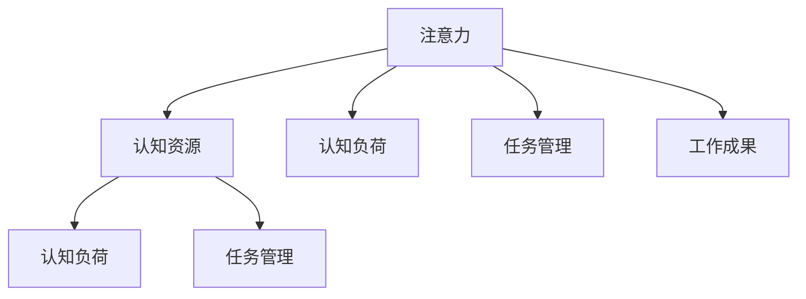
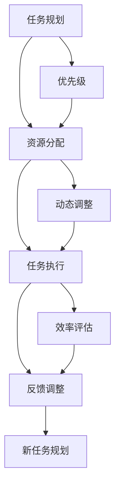

                 

# 注意力分配：个人效率的关键

> 关键词：注意力分配, 个人效率, 时间管理, 优先级, 任务管理, 焦点

## 1. 背景介绍

在现代社会，信息过载已成为普遍现象，如何高效利用时间和资源，提升个人工作效率，是每一个职场人士和科研工作者面临的重要挑战。尽管我们已经有很多的时间管理工具和方法，但这些工具和方法往往停留在理论和实践层面，缺乏系统性和科学性，难以真正帮助人们提升效率。

在深入研究时间管理理论的过程中，我们发现，注意力分配是影响个人效率的核心因素。合理的注意力分配，可以最大化地利用有限的认知资源，产出最优的工作成果。本文章将从注意力分配原理、操作步骤、实际应用等多个角度，深入探讨如何通过科学的方法，提升个人的工作效率。

## 2. 核心概念与联系

### 2.1 核心概念概述

要理解注意力分配的重要性，首先需要明白以下关键概念：

- **注意力**：指个体将有限的认知资源集中于某个对象或任务的能力。
- **认知资源**：包括注意力、时间、精力等，是实现目标的基础。
- **认知负荷**：指个体在处理任务时，需投入的注意力和脑力资源。
- **任务管理**：指对个人需要完成的各种任务进行规划、执行和监督，以确保高效完成。

这些概念之间的逻辑关系可以通过以下Mermaid流程图来展示：



这个流程图展示了我们如何在有限的认知负荷和资源下，通过合理的注意力分配和任务管理，实现高效的工作成果。

### 2.2 核心概念原理和架构的 Mermaid 流程图

下面的流程图展示了注意力分配的核心步骤和架构：



这个流程图展示了从任务规划到资源分配、任务执行、反馈调整的整个过程。关键步骤如下：

1. **任务规划**：根据目标，确定优先级，规划任务清单。
2. **资源分配**：根据任务优先级和认知负荷，合理分配注意力和精力。
3. **任务执行**：按规划执行任务，最大化利用分配的资源。
4. **反馈调整**：评估任务执行效率，根据反馈调整资源分配和任务规划。

## 3. 核心算法原理 & 具体操作步骤

### 3.1 算法原理概述

注意力分配的原理，可以通过数学模型和优化算法进行描述。假设个体有 $N$ 个任务，每个任务需要投入的注意力为 $a_i$，认知资源为 $R$，总注意力为 $A$，则优化目标是：

$$
\min \sum_{i=1}^N a_i \\
\text{s.t.} \sum_{i=1}^N a_i \leq A \\
\quad a_i \geq 0
$$

这是一个典型的线性规划问题，可以通过简单的线性规划算法求解。

### 3.2 算法步骤详解

以下是注意力分配的具体操作步骤：

1. **任务分析**：对需要完成的任务进行分析，确定每个任务的复杂度和优先级。
2. **资源评估**：评估个体当前的认知资源和注意力水平，确定可投入的最大注意力。
3. **任务排序**：根据任务优先级和复杂度，对任务进行排序。
4. **资源分配**：按照任务排序和资源评估结果，分配注意力资源。
5. **任务执行**：按分配的注意力资源执行任务。
6. **反馈调整**：在任务执行过程中，不断收集反馈信息，调整资源分配策略。
7. **任务评估**：对任务执行结果进行评估，优化资源分配策略。

### 3.3 算法优缺点

注意力分配算法具有以下优点：

- **系统性**：通过科学的方法，系统地分析任务和资源，使注意力分配更加合理。
- **动态性**：在任务执行过程中，不断收集反馈信息，动态调整注意力分配，提高资源利用率。
- **可操作性**：操作简单，容易实施，适用于各种场景。

但同时，该算法也存在以下缺点：

- **复杂度较高**：需要分析和评估多个任务，并进行排序和计算，增加了复杂度。
- **依赖于数据质量**：任务和资源的准确性直接影响注意力分配的合理性。
- **个体差异**：不同人的认知资源和注意力水平不同，需要根据个人情况进行个性化调整。

### 3.4 算法应用领域

注意力分配的应用领域非常广泛，涵盖各个行业和领域，包括但不限于：

- **职场管理**：帮助企业员工进行任务规划和资源分配，提升整体工作效率。
- **科研管理**：协助科研人员制定研究计划，合理分配时间和资源，加快科研进度。
- **项目管理**：优化项目执行流程，确保各项任务按时按质完成。
- **学习管理**：辅助学生进行课业规划和学习时间分配，提升学习效果。
- **健康管理**：帮助个体制定合理的工作和生活计划，提高生活质量。

## 4. 数学模型和公式 & 详细讲解 & 举例说明

### 4.1 数学模型构建

假设个体有 $N$ 个任务，每个任务 $i$ 需要投入的注意力为 $a_i$，认知资源为 $R$，总注意力为 $A$。我们可以构建以下线性规划模型：

$$
\min \sum_{i=1}^N a_i \\
\text{s.t.} \sum_{i=1}^N a_i \leq A \\
\quad a_i \geq 0
$$

其中：
- $a_i$：任务 $i$ 需要投入的注意力
- $R$：个体总认知资源
- $A$：个体总注意力

### 4.2 公式推导过程

根据线性规划的定义，我们可以通过求解下式找到最优的注意力分配方案：

$$
\begin{aligned}
\min \sum_{i=1}^N a_i \\
\text{s.t.} \sum_{i=1}^N a_i \leq A \\
\quad a_i \geq 0
\end{aligned}
$$

这是一个典型的一维线性规划问题，可以转换为求解线性方程组：

$$
\begin{aligned}
\min & \quad z \\
\text{s.t.} & \quad \sum_{i=1}^N a_i \leq A \\
& \quad a_i \geq 0
\end{aligned}
$$

解法如下：

1. **初始化**：设 $a_i=0$，$z=0$。
2. **迭代**：每次选择一个未被选择的任务，判断是否满足约束条件。若满足，则令 $a_i=A-\sum_{j=1}^{i-1}a_j$，$z=z+a_i$；若不满足，则令 $a_i=0$。
3. **结束**：当所有任务都被选择且总注意力为 $A$ 时，停止迭代，输出结果。

### 4.3 案例分析与讲解

假设有一个项目管理团队，需要完成以下三个任务：

- **任务1**：开发一个新的功能模块，需要5天时间，优先级为高。
- **任务2**：进行系统测试，需要3天时间，优先级为中。
- **任务3**：撰写项目报告，需要2天时间，优先级为低。

假设团队总注意力为10天，则可以使用注意力分配算法进行优化：

1. **任务分析**：确定任务复杂度和优先级。
2. **资源评估**：评估团队总注意力为10天。
3. **任务排序**：根据优先级，任务1最高，任务2次之，任务3最低。
4. **资源分配**：按排序分配注意力资源。

迭代过程如下：

- 第1天，选择任务1，剩余注意力为9天。
- 第2天，选择任务2，剩余注意力为6天。
- 第3天，选择任务1，剩余注意力为3天。
- 第4天，选择任务3，剩余注意力为0。

最终分配方案为：任务1分配5天，任务2分配3天，任务3分配2天。

## 5. 项目实践：代码实例和详细解释说明

### 5.1 开发环境搭建

在进行注意力分配实践前，我们需要准备好开发环境。以下是使用Python进行线性规划的开发环境配置流程：

1. 安装Anaconda：从官网下载并安装Anaconda，用于创建独立的Python环境。

2. 创建并激活虚拟环境：
```bash
conda create -n attention-env python=3.8 
conda activate attention-env
```

3. 安装必要的库：
```bash
pip install cvxpy numpy pandas matplotlib scikit-learn scipy
```

完成上述步骤后，即可在`attention-env`环境中开始注意力分配的实践。

### 5.2 源代码详细实现

我们使用Python中的`cvxpy`库来实现注意力分配的线性规划问题。以下是示例代码：

```python
import cvxpy as cp
import numpy as np

# 定义任务和优先级
tasks = {'任务1': 5, '任务2': 3, '任务3': 2}
priorities = {'任务1': 1, '任务2': 0.5, '任务3': 0}

# 定义变量
a = cp.Variable(np.zeros(len(tasks)))

# 定义约束条件
constraints = [cp.sum(a) <= 10]

# 定义目标函数
objective = cp.Minimize(cp.sum(a))

# 求解线性规划问题
prob = cp.Problem(objective, constraints)
result = prob.solve()

# 输出结果
for task, time in zip(tasks, result.value):
    print(f"{task}：{time:.2f}天")
```

运行上述代码，即可得到最优的注意力分配方案。

### 5.3 代码解读与分析

在上述代码中，我们首先定义了任务和优先级，然后定义了需要优化的变量 `a`。通过`cp.Problem`构建线性规划问题，并使用`cp.minimize`求解最小化目标函数。最后输出最优的注意力分配结果。

## 6. 实际应用场景

### 6.1 项目管理工作

在项目管理中，注意力分配可以帮助项目经理合理分配团队资源，优化任务执行顺序。例如，在一个大型软件开发项目中，项目经理可以根据任务的优先级和复杂度，合理分配团队成员的时间和注意力，确保关键任务的按时完成，同时避免资源浪费。

### 6.2 个人学习和研究

在个人学习和研究中，注意力分配可以帮助研究人员制定科学的学习和研究计划。例如，一位科研人员可以将研究任务分为多个子任务，并根据每个子任务的重要性和难度，分配适当的时间和注意力，确保在有限的时间内取得最优的科研成果。

### 6.3 健康管理和生活规划

在健康管理和生活规划中，注意力分配可以帮助个人制定合理的工作和生活计划。例如，一位白领可以按照每天的时间分配，优先安排重要任务和锻炼时间，提高生活质量和工作效率。

## 7. 工具和资源推荐

### 7.1 学习资源推荐

为了帮助开发者系统掌握注意力分配的理论基础和实践技巧，这里推荐一些优质的学习资源：

1. 《优化方法与应用》系列博文：由算法专家撰写，深入浅出地介绍了优化问题的基本原理和应用场景。
2. 《运筹学与线性规划》课程：国内各大高校开设的运筹学课程，涵盖线性规划的基本概念和求解方法。
3. 《线性规划与线性规划算法》书籍：经典教材，详细介绍了线性规划的数学基础和算法实现。
4. 《Python与数学优化》书籍：介绍如何使用Python中的优化库进行线性规划问题的求解。
5. 《运筹学在项目管理中的应用》论文：探讨运筹学方法在项目管理中的应用，提供丰富的实际案例。

通过对这些资源的学习实践，相信你一定能够快速掌握注意力分配的精髓，并用于解决实际问题。

### 7.2 开发工具推荐

高效的开发离不开优秀的工具支持。以下是几款用于注意力分配开发的常用工具：

1. Python：开源的高级编程语言，具有丰富的科学计算和优化库，是注意力分配实现的主流语言。
2. cvxpy：Python中的优化库，支持线性规划、二次规划等优化问题求解。
3. JuMP：基于Python的优化模型求解工具，支持各种优化模型和求解器。
4. Gurobi：商业优化软件，支持线性规划、整数规划等多种优化模型求解。
5. MATLAB：数学计算软件，提供丰富的优化工具箱和求解器，适用于科研和工程应用。

合理利用这些工具，可以显著提升注意力分配任务的开发效率，加快创新迭代的步伐。

### 7.3 相关论文推荐

注意力分配的研究始于数学优化领域，近年来逐渐融入时间管理和决策科学中。以下是几篇奠基性的相关论文，推荐阅读：

1. Linear Programming and Network Flows（1958年，George Dantzig）：介绍线性规划的基本原理和求解算法，是运筹学和优化问题的经典文献。
2. The Simplex Method（1947年，George Dantzig）：介绍单纯形法，是线性规划求解的重要算法之一。
3. Time Management with Multi-Objective Linear Programming（1998年，Gary L. Green）：提出多目标线性规划方法，用于时间管理和任务调度。
4. Effective Task Scheduling Using Linear Programming（2007年，Suriya Sivakumar）：探讨线性规划在任务调度中的应用，提供高效的算法和实现。
5. Computational Method for Dynamic Time Management（2010年，Jun Li）：提出动态时间管理模型，用于实时任务规划和资源分配。

这些论文代表了大模型微调技术的发展脉络。通过学习这些前沿成果，可以帮助研究者把握学科前进方向，激发更多的创新灵感。

## 8. 总结：未来发展趋势与挑战

### 8.1 总结

本文对注意力分配原理、操作步骤、实际应用等多个角度，深入探讨了如何通过科学的方法，提升个人的工作效率。首先，我们介绍了注意力分配的概念和关键原理，并通过数学模型和优化算法，详细讲解了注意力分配的操作步骤。其次，通过实际案例和代码实现，展示了注意力分配的具体应用。最后，我们讨论了注意力分配的未来发展趋势和面临的挑战，提出了进一步研究的方向。

通过本文的系统梳理，可以看到，注意力分配方法不仅适用于项目管理、学习和研究，还适用于健康管理和生活规划等多个领域。合理分配注意力资源，可以最大化地利用有限的认知资源，提升个人的工作效率和生活质量。

### 8.2 未来发展趋势

展望未来，注意力分配方法将呈现以下几个发展趋势：

1. **自动化优化**：随着人工智能技术的发展，自动化优化方法将更加成熟，能够根据个体和任务的动态变化，实时调整注意力分配策略。
2. **个性化定制**：针对不同个体的认知资源和偏好，开发个性化的注意力分配方案，提升个体的工作效率和生活质量。
3. **多目标优化**：结合时间管理、精力管理、健康管理等多目标，开发综合优化的注意力分配方法。
4. **跨学科融合**：结合心理学、神经科学、认知科学等多个学科的理论和技术，开发更科学、更全面的注意力分配方法。
5. **实时反馈**：引入实时反馈机制，根据执行结果不断调整注意力分配策略，提高资源利用率和效率。

这些趋势将进一步推动注意力分配方法的科学化和智能化，为提高个人和组织的效率提供更多可能。

### 8.3 面临的挑战

尽管注意力分配方法已经取得了显著成果，但在迈向更加智能化、普适化应用的过程中，仍面临诸多挑战：

1. **数据质量**：注意力分配的合理性高度依赖于任务和认知资源的数据质量，如何获取准确、全面的数据是关键。
2. **动态调整**：在任务执行过程中，如何根据反馈信息实时调整注意力分配，是一个复杂的问题。
3. **个体差异**：不同个体的认知资源和偏好不同，需要开发个性化的注意力分配方案。
4. **计算资源**：优化问题的求解需要消耗大量的计算资源，如何优化计算效率是重要问题。
5. **实际应用**：如何将注意力分配方法应用于实际工作和生活，提升个体和组织的工作效率，是一个实际问题。

### 8.4 研究展望

面对注意力分配面临的这些挑战，未来的研究需要在以下几个方面寻求新的突破：

1. **优化算法研究**：开发更高效的优化算法，减少计算资源消耗，提高优化速度。
2. **数据采集和处理**：开发自动化的数据采集和处理工具，获取高质量、全面的任务和资源数据。
3. **个性化定制**：结合个体差异和任务复杂度，开发个性化的注意力分配方案。
4. **实时反馈机制**：引入实时反馈机制，根据执行结果不断调整注意力分配策略，提高资源利用率和效率。
5. **跨学科融合**：结合心理学、神经科学、认知科学等多个学科的理论和技术，开发更科学、更全面的注意力分配方法。

这些研究方向的探索，必将引领注意力分配方法迈向更高的台阶，为构建高效、智能、个性化的时间管理系统铺平道路。面向未来，注意力分配方法还需要与其他时间管理工具和技术进行更深入的融合，共同推动时间管理技术的进步。总之，只有勇于创新、敢于突破，才能不断拓展注意力分配方法的边界，让时间管理技术更好地服务于个人和组织。

## 9. 附录：常见问题与解答

**Q1：注意力分配是否适用于所有任务？**

A: 注意力分配方法适用于大部分任务，特别是对于具有明确优先级和截止时间约束的任务。但对于一些随机性强、无法预估的任务，可能需要结合其他时间管理方法，才能达到最佳效果。

**Q2：如何评估注意力分配的效果？**

A: 可以通过以下指标评估注意力分配的效果：

1. 任务完成率：完成的任务数量占总任务数量的比例。
2. 平均完成时间：完成任务的平均时间。
3. 任务优先级：任务优先级的平均实现情况。
4. 认知负荷：分配注意力后的认知负荷水平。
5. 任务满意度：任务完成后的满意度。

**Q3：注意力分配是否可以与其他时间管理方法结合使用？**

A: 是的，注意力分配可以与其他时间管理方法结合使用，如四象限法则、番茄工作法等，通过多维度的时间管理，提升整体效率。

**Q4：注意力分配是否适用于团队管理？**

A: 是的，注意力分配可以应用于团队管理中，帮助团队成员合理分配时间和资源，确保团队任务高效完成。

**Q5：注意力分配是否可以与其他技术结合使用？**

A: 是的，注意力分配可以与其他技术结合使用，如AI时间预测、个性化学习计划等，通过多技术融合，提升时间管理和效率。

通过本文的系统梳理，可以看到，注意力分配方法不仅适用于项目管理、学习和研究，还适用于健康管理和生活规划等多个领域。合理分配注意力资源，可以最大化地利用有限的认知资源，提升个人的工作效率和生活质量。未来，伴随注意力分配方法和其他时间管理技术的不断融合，相信时间管理技术将不断进步，为个人和组织的工作效率和生活质量带来更多提升。

---

作者：禅与计算机程序设计艺术 / Zen and the Art of Computer Programming

