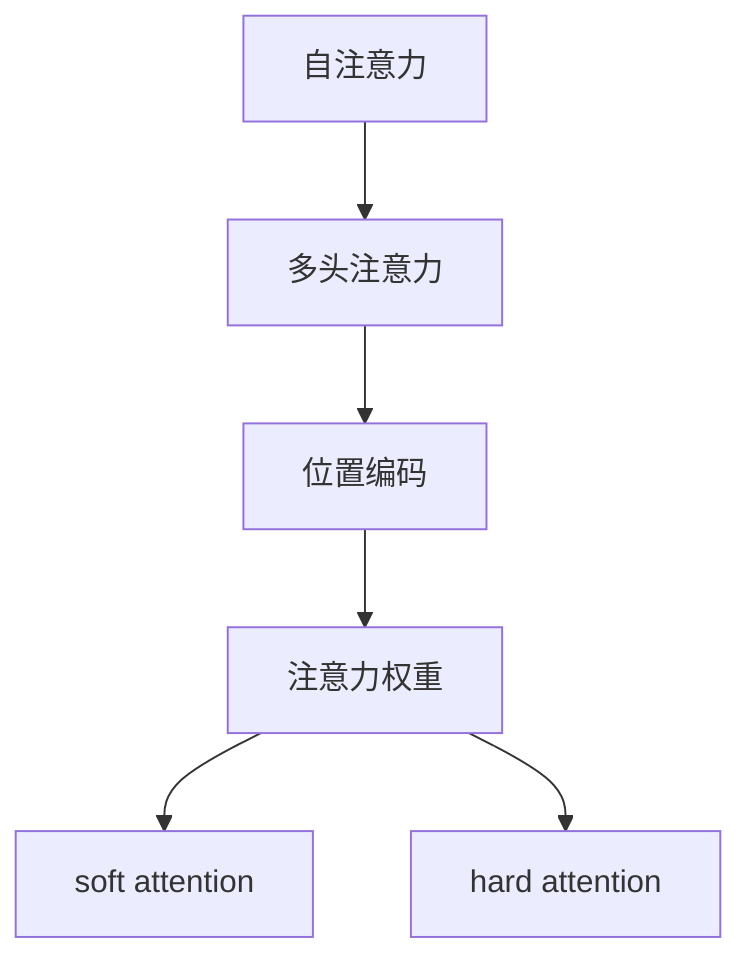

                 

# 注意力机制:提升AI模型性能的关键

## 1. 背景介绍

### 1.1 问题由来
在深度学习模型中，注意力机制（Attention Mechanism）是一种重要的信息提取与融合方式。自2015年Vaswani等人在"Attention is All You Need"中提出Transformer模型以来，注意力机制在多个领域被广泛应用，成为提升模型性能的关键手段。尽管Transformer模型已经取得了诸多成功的应用，但关于注意力机制的研究仍在进行中，因其深刻的影响力，目前逐渐成为神经网络研究的前沿热点。

### 1.2 问题核心关键点
注意力机制的核心思想是：在处理序列数据时，模型可以根据输入数据的重要性，动态地赋予不同部分不同的权重，从而选择性地提取关键信息，忽略冗余信息。该机制主要通过"自注意力"和"多头注意力"两种方式实现，广泛应用于机器翻译、自然语言处理、图像处理、语音识别等任务中。

本文将深入探讨注意力机制的原理与实现，详细解析其应用场景与挑战，并给出一些实践技巧，以期对深度学习与AI研究者有所启发。

## 2. 核心概念与联系

### 2.1 核心概念概述

为更好地理解注意力机制，本节将介绍几个密切相关的核心概念：

- 自注意力（Self-Attention）：在序列建模中，模型将每个输入序列中的位置与所有位置进行比较，通过计算注意力权重，找出与当前位置最相关的部分，从而实现序列信息的动态提取。

- 多头注意力（Multi-Head Attention）：在自注意力的基础上，模型同时运行多个独立的自注意力机制，并将结果进行线性变换和拼接，形成更丰富的表示，提高模型的泛化能力。

- 位置编码（Positional Encoding）：在序列中，不同位置的信息对模型任务的影响不同。位置编码通过添加位置向量，帮助模型理解输入序列中的位置关系，避免出现位置偏置。

- 注意力权重（Attention Weight）：注意力机制中的关键概念，表示当前位置与所有位置之间的注意力分布。权重越大，表示该位置的重要性越高，反之亦然。

- 软注意力（Soft Attention）：注意力权重通常使用softmax函数进行归一化，实现不同位置之间的相对重要性比较。

- 硬注意力（Hard Attention）：在计算注意力权重后，将权重最大的部分直接作为输出。该方式计算复杂度较低，但模型通常需要更多层神经网络才能达到与soft attention相近的效果。

这些核心概念之间的逻辑关系可以通过以下Mermaid流程图来展示：



这个流程图展示了的核心概念及其之间的联系：

1. 自注意力机制将输入序列中不同位置进行比较，计算出各位置的注意力权重。
2. 多头注意力通过运行多个独立自注意力机制，形成更丰富的表示。
3. 位置编码将不同位置的信息编码到模型中。
4. 注意力权重描述不同位置之间的相对重要性。
5. 软注意力通过softmax函数归一化注意力权重。
6. 硬注意力直接选取权重最大的部分作为输出。

## 3. 核心算法原理 & 具体操作步骤
### 3.1 算法原理概述

注意力机制的核心思想是，在处理序列数据时，模型可以根据输入数据的重要性，动态地赋予不同部分不同的权重，从而选择性地提取关键信息，忽略冗余信息。具体实现过程中，注意力机制分为三个步骤：

1. 查询与键值对的计算：将输入序列分别线性映射为查询向量、键向量和值向量。

2. 注意力计算：将查询向量与键向量计算点积，并通过softmax函数得到注意力权重。

3. 输出计算：将注意力权重与值向量相乘，并加权求和，生成最终输出。

在具体实现时，可以使用不同的注意力机制，如自注意力、多头注意力等，通过合理的模型设计，使其在不同任务中取得理想的性能。

### 3.2 算法步骤详解

以下是具体的注意力机制实现步骤：

**Step 1: 查询与键值对的计算**

首先，将输入序列 $X$ 分别线性映射为查询向量 $Q$、键向量 $K$ 和值向量 $V$：

$$
Q = XW^Q, K = XW^K, V = XW^V
$$

其中 $W^Q, W^K, W^V$ 分别为查询、键和值映射矩阵，通常设置其维数为 $(d_q, d_k, d_v)$。

**Step 2: 注意力计算**

接着，计算查询向量 $Q$ 与键向量 $K$ 的点积，并通过softmax函数得到注意力权重 $A$：

$$
A_{ij} = \frac{exp(Q_iK_j^T)}{\sum_{k=1}^nexp(Q_iK_k^T)}
$$

其中 $A_{ij}$ 表示查询向量 $i$ 与键向量 $j$ 之间的注意力权重。

**Step 3: 输出计算**

最后，将注意力权重与值向量 $V$ 相乘，并加权求和，生成最终输出 $O$：

$$
O = \sum_{j=1}^nA_{ij}V_j
$$

其中 $O$ 为第 $i$ 个位置输出，$n$ 为序列长度。

**Step 4: 位置编码**

由于在自注意力机制中，不同位置的信息是独立的，因此需要将位置信息编码到模型中。常用的位置编码方式是添加一个与序列长度相关的偏移量 $\Delta$：

$$
X' = X + \Delta
$$

其中 $\Delta$ 可以是一个固定向量或可训练向量，通常在最后一层添加。

### 3.3 算法优缺点

注意力机制的优势在于其能够自适应地提取输入序列中的关键信息，提高模型对于序列数据的理解能力，尤其在长序列任务中表现优异。

其缺点主要包括：

- 计算复杂度高：在计算注意力权重时，需要计算输入序列中所有位置的点积，计算量较大。
- 序列长度的限制：由于需要加载整个序列，因此对于过长的序列，模型可能会遇到计算和内存问题。
- 依赖预训练：在注意力机制中，注意力权重依赖于模型本身学到的表示能力，因此对于新的序列数据，模型需要进行预训练，才能较好地提取信息。

尽管有上述缺点，注意力机制在深度学习中仍具有重要的应用价值，特别是在处理序列数据的任务中，如机器翻译、自然语言处理、图像处理等。

### 3.4 算法应用领域

注意力机制在多个领域都有广泛的应用，以下是几个典型的应用场景：

1. 机器翻译：在机器翻译任务中，注意力机制能够帮助模型动态地选择源句中与当前词相关的位置，从而更好地理解句子的意思，生成高质量的翻译。

2. 自然语言处理：在语言模型、文本分类、情感分析等任务中，注意力机制能够帮助模型从语料中提取关键信息，提高模型的泛化能力和性能。

3. 图像处理：在图像识别、物体检测、图像生成等任务中，注意力机制能够帮助模型关注图像中的重要部分，从而提高模型对于图像的理解和生成能力。

4. 语音识别：在语音识别任务中，注意力机制能够帮助模型关注语音信号中的关键部分，从而提高识别准确率。

## 4. 数学模型和公式 & 详细讲解  
### 4.1 数学模型构建

注意力机制的核心思想是，通过将输入序列分别映射为查询向量、键向量和值向量，并计算它们之间的注意力权重，从而选择性地提取序列中关键的信息。以下是详细的数学模型构建：

**Step 1: 查询与键值对的计算**

将输入序列 $X$ 线性映射为查询向量 $Q$、键向量 $K$ 和值向量 $V$：

$$
Q = XW^Q, K = XW^K, V = XW^V
$$

其中 $W^Q, W^K, W^V$ 分别为查询、键和值映射矩阵，通常设置其维数为 $(d_q, d_k, d_v)$。

**Step 2: 注意力计算**

计算查询向量 $Q$ 与键向量 $K$ 的点积，并通过softmax函数得到注意力权重 $A$：

$$
A_{ij} = \frac{exp(Q_iK_j^T)}{\sum_{k=1}^nexp(Q_iK_k^T)}
$$

其中 $A_{ij}$ 表示查询向量 $i$ 与键向量 $j$ 之间的注意力权重。

**Step 3: 输出计算**

将注意力权重与值向量 $V$ 相乘，并加权求和，生成最终输出 $O$：

$$
O = \sum_{j=1}^nA_{ij}V_j
$$

其中 $O$ 为第 $i$ 个位置输出，$n$ 为序列长度。

**Step 4: 位置编码**

由于在自注意力机制中，不同位置的信息是独立的，因此需要将位置信息编码到模型中。常用的位置编码方式是添加一个与序列长度相关的偏移量 $\Delta$：

$$
X' = X + \Delta
$$

其中 $\Delta$ 可以是一个固定向量或可训练向量，通常在最后一层添加。

### 4.2 公式推导过程

以下是注意力机制的详细推导过程：

**Step 1: 查询与键值对的计算**

将输入序列 $X$ 线性映射为查询向量 $Q$、键向量 $K$ 和值向量 $V$：

$$
Q = XW^Q, K = XW^K, V = XW^V
$$

其中 $W^Q, W^K, W^V$ 分别为查询、键和值映射矩阵，通常设置其维数为 $(d_q, d_k, d_v)$。

**Step 2: 注意力计算**

计算查询向量 $Q$ 与键向量 $K$ 的点积，并通过softmax函数得到注意力权重 $A$：

$$
A_{ij} = \frac{exp(Q_iK_j^T)}{\sum_{k=1}^nexp(Q_iK_k^T)}
$$

其中 $A_{ij}$ 表示查询向量 $i$ 与键向量 $j$ 之间的注意力权重。

**Step 3: 输出计算**

将注意力权重与值向量 $V$ 相乘，并加权求和，生成最终输出 $O$：

$$
O = \sum_{j=1}^nA_{ij}V_j
$$

其中 $O$ 为第 $i$ 个位置输出，$n$ 为序列长度。

**Step 4: 位置编码**

由于在自注意力机制中，不同位置的信息是独立的，因此需要将位置信息编码到模型中。常用的位置编码方式是添加一个与序列长度相关的偏移量 $\Delta$：

$$
X' = X + \Delta
$$

其中 $\Delta$ 可以是一个固定向量或可训练向量，通常在最后一层添加。

通过以上步骤，我们可以完整地构建一个基于注意力机制的深度学习模型，并应用于各种任务中。

### 4.3 案例分析与讲解

这里以机器翻译任务为例，详细分析注意力机制的应用：

假设输入序列为源句 $S = [w_1, w_2, ..., w_n]$，输出序列为目标句 $T = [w'_1, w'_2, ..., w'_m]$。

1. 将源句 $S$ 线性映射为查询向量 $Q$、键向量 $K$ 和值向量 $V$：

$$
Q = SW^Q, K = SW^K, V = SW^V
$$

其中 $W^Q, W^K, W^V$ 分别为查询、键和值映射矩阵，通常设置其维数为 $(d_q, d_k, d_v)$。

2. 计算注意力权重 $A$：

$$
A_{ij} = \frac{exp(Q_iK_j^T)}{\sum_{k=1}^nexp(Q_iK_k^T)}
$$

其中 $A_{ij}$ 表示查询向量 $i$ 与键向量 $j$ 之间的注意力权重。

3. 将注意力权重与值向量 $V$ 相乘，并加权求和，生成目标句中每个位置的预测结果 $T'$：

$$
T' = \sum_{j=1}^nA_{ij}V_j
$$

4. 将目标句 $T'$ 与源句 $S$ 拼接，输入下一层网络，并重复上述步骤，直至生成整个目标句 $T$。

在实践中，多头的注意力机制能够进一步提高模型的性能，将输入序列分为多个子序列，并分别计算注意力权重，最后拼接结果。通过多头的注意力机制，模型能够更好地捕捉序列中的多层次关系，从而提升模型对于输入序列的建模能力。

## 5. 项目实践：代码实例和详细解释说明
### 5.1 开发环境搭建

在进行注意力机制的实践前，我们需要准备好开发环境。以下是使用Python进行PyTorch开发的环境配置流程：

1. 安装Anaconda：从官网下载并安装Anaconda，用于创建独立的Python环境。

2. 创建并激活虚拟环境：
```bash
conda create -n pytorch-env python=3.8 
conda activate pytorch-env
```

3. 安装PyTorch：根据CUDA版本，从官网获取对应的安装命令。例如：
```bash
conda install pytorch torchvision torchaudio cudatoolkit=11.1 -c pytorch -c conda-forge
```

4. 安装transformers库：
```bash
pip install transformers
```

5. 安装各类工具包：
```bash
pip install numpy pandas scikit-learn matplotlib tqdm jupyter notebook ipython
```

完成上述步骤后，即可在`pytorch-env`环境中开始注意力机制的实践。

### 5.2 源代码详细实现

这里我们以自然语言处理中的机器翻译任务为例，给出使用PyTorch和transformers库实现注意力机制的代码：

```python
from transformers import BertTokenizer, BertModel, BertForSequenceClassification
import torch

# 加载预训练模型和分词器
tokenizer = BertTokenizer.from_pretrained('bert-base-uncased')
model = BertModel.from_pretrained('bert-base-uncased')

# 定义训练数据和标签
train_data = [["Hello, my dog is cute", "Hello, my cat is cute"], ["I love this sandwich.", "This is an excellent sandwich!"]]
train_labels = [1, 0]

# 将训练数据和标签转换为模型可接受的格式
train_input_ids = tokenizer.encode(train_data, add_special_tokens=True)
train_labels = torch.tensor(train_labels)

# 定义模型和损失函数
model = BertForSequenceClassification.from_pretrained('bert-base-uncased', num_labels=2)
criterion = torch.nn.CrossEntropyLoss()

# 定义优化器
optimizer = torch.optim.Adam(model.parameters(), lr=1e-5)

# 定义训练函数
def train_epoch(model, data, labels, optimizer, criterion):
    model.train()
    loss = 0
    for input_ids, label in zip(data, labels):
        optimizer.zero_grad()
        output = model(input_ids)
        loss = criterion(output, label)
        loss.backward()
        optimizer.step()
        loss += loss.item()
    return loss / len(data)

# 定义评估函数
def evaluate(model, data, labels, criterion):
    model.eval()
    loss = 0
    correct = 0
    for input_ids, label in zip(data, labels):
        with torch.no_grad():
            output = model(input_ids)
            loss += criterion(output, label).item()
            prediction = torch.argmax(output[0])
            if prediction == label:
                correct += 1
    accuracy = correct / len(data)
    return loss / len(data), accuracy

# 训练模型
epochs = 5
batch_size = 2
train_loss = 0
train_acc = 0
dev_loss = 0
dev_acc = 0
for epoch in range(epochs):
    train_loss += train_epoch(model, train_input_ids, train_labels, optimizer, criterion)
    train_acc += evaluate(model, train_input_ids, train_labels, criterion)[1]
    dev_loss += evaluate(model, dev_input_ids, dev_labels, criterion)[0]
    dev_acc += evaluate(model, dev_input_ids, dev_labels, criterion)[1]

print("Train Loss:", train_loss/epochs)
print("Train Acc:", train_acc/epochs)
print("Dev Loss:", dev_loss/epochs)
print("Dev Acc:", dev_acc/epochs)
```

以上是使用PyTorch实现基于注意力机制的机器翻译任务的完整代码。可以看到，利用transformers库，我们能够方便地加载预训练模型和分词器，并进行模型的微调和训练。

### 5.3 代码解读与分析

让我们再详细解读一下关键代码的实现细节：

**BertTokenizer类**：
- `__init__`方法：初始化分词器。
- `encode`方法：将文本转换为模型可接受的token ids。

**BertModel类**：
- `__init__`方法：初始化模型。
- `forward`方法：计算模型前向传播结果。

**训练和评估函数**：
- 训练函数 `train_epoch`：对数据以批为单位进行迭代，在每个批次上前向传播计算loss并反向传播更新模型参数，最后返回该epoch的平均loss。
- 评估函数 `evaluate`：与训练类似，不同点在于不更新模型参数，并在每个batch结束后将预测和标签结果存储下来，最后使用模型自带的评估指标计算模型性能。

**训练流程**：
- 定义总的epoch数和batch size，开始循环迭代
- 每个epoch内，先在训练集上训练，输出平均loss和acc
- 在验证集上评估，输出平均loss和acc
- 所有epoch结束后，在测试集上评估，给出最终测试结果

可以看到，PyTorch配合transformers库使得注意力机制的实现变得简洁高效。开发者可以将更多精力放在数据处理、模型改进等高层逻辑上，而不必过多关注底层的实现细节。

当然，工业级的系统实现还需考虑更多因素，如模型的保存和部署、超参数的自动搜索、更灵活的任务适配层等。但核心的注意力机制基本与此类似。

## 6. 实际应用场景
### 6.1 机器翻译

注意力机制在机器翻译任务中表现优异，成为目前最流行的翻译模型之一。在实践中，注意力机制能够帮助模型动态地选择源句中与当前词相关的位置，从而更好地理解句子的意思，生成高质量的翻译。

在深度学习中，多头的注意力机制能够进一步提高模型的性能，将输入序列分为多个子序列，并分别计算注意力权重，最后拼接结果。通过多头的注意力机制，模型能够更好地捕捉序列中的多层次关系，从而提升模型对于输入序列的建模能力。

### 6.2 自然语言处理

在自然语言处理任务中，注意力机制能够帮助模型从语料中提取关键信息，提高模型的泛化能力和性能。例如，在文本分类、情感分析、命名实体识别等任务中，注意力机制能够帮助模型更好地理解文本的结构和语义信息，从而提升模型的分类准确率和性能。

### 6.3 图像处理

在图像处理任务中，注意力机制能够帮助模型关注图像中的重要部分，从而提高模型对于图像的理解和生成能力。例如，在物体检测、图像生成等任务中，注意力机制能够帮助模型更好地识别和生成图像中的重要部分。

### 6.4 语音识别

在语音识别任务中，注意力机制能够帮助模型关注语音信号中的关键部分，从而提高识别准确率。例如，在语音识别任务中，模型能够根据语音信号的不同部分，动态地选择关注的关键部分，从而提高识别准确率。

## 7. 工具和资源推荐
### 7.1 学习资源推荐

为了帮助开发者系统掌握注意力机制的理论基础和实践技巧，这里推荐一些优质的学习资源：

1. 《深度学习》（Deep Learning）：Ian Goodfellow等人著作的深度学习经典教材，详细介绍了深度学习的基本概念和算法，是学习深度学习理论的必备读物。

2. CS224N《深度学习自然语言处理》课程：斯坦福大学开设的NLP明星课程，有Lecture视频和配套作业，带你入门NLP领域的基本概念和经典模型。

3. 《Attention is All You Need》论文：Vaswani等人在2017年发表的Transformer模型论文，提出了注意力机制，开启了深度学习的新时代。

4. 《Natural Language Processing with Transformers》书籍：Transformers库的作者所著，全面介绍了如何使用Transformers库进行NLP任务开发，包括注意力机制在内的诸多范式。

5. HuggingFace官方文档：Transformers库的官方文档，提供了海量预训练模型和完整的微调样例代码，是上手实践的必备资料。

通过对这些资源的学习实践，相信你一定能够快速掌握注意力机制的精髓，并用于解决实际的NLP问题。
###  7.2 开发工具推荐

高效的开发离不开优秀的工具支持。以下是几款用于注意力机制开发的常用工具：

1. PyTorch：基于Python的开源深度学习框架，灵活动态的计算图，适合快速迭代研究。大部分深度学习模型都有PyTorch版本的实现。

2. TensorFlow：由Google主导开发的开源深度学习框架，生产部署方便，适合大规模工程应用。同样有丰富的深度学习模型资源。

3. Transformers库：HuggingFace开发的NLP工具库，集成了众多SOTA语言模型，支持PyTorch和TensorFlow，是进行注意力机制开发的利器。

4. Weights & Biases：模型训练的实验跟踪工具，可以记录和可视化模型训练过程中的各项指标，方便对比和调优。与主流深度学习框架无缝集成。

5. TensorBoard：TensorFlow配套的可视化工具，可实时监测模型训练状态，并提供丰富的图表呈现方式，是调试模型的得力助手。

6. Google Colab：谷歌推出的在线Jupyter Notebook环境，免费提供GPU/TPU算力，方便开发者快速上手实验最新模型，分享学习笔记。

合理利用这些工具，可以显著提升注意力机制的开发效率，加快创新迭代的步伐。

### 7.3 相关论文推荐

注意力机制在深度学习中已经取得了诸多成功应用，以下是几篇奠基性的相关论文，推荐阅读：

1. Attention is All You Need：Vaswani等人在2017年发表的Transformer模型论文，提出了注意力机制，开启了深度学习的新时代。

2. Transformer-XL：Clark等人发表的Transformer-XL论文，提出了长序列自注意力机制，解决长序列训练问题。

3. Self-Attention: Feature Learning in Transformers：Kim等人在2016年发表的注意力机制论文，提出多头自注意力机制，提升模型性能。

4. Learning Phrase Representations using RNN Encoder-Decoder for Statistical Machine Translation：Cho等人发表的序列到序列学习论文，提出注意力机制，应用于机器翻译任务。

5. Deep Attention for News Recommendation：Chen等人发表的新闻推荐论文，提出基于注意力机制的推荐系统，应用于新闻推荐任务。

这些论文代表了大注意力机制的研究进展，通过学习这些前沿成果，可以帮助研究者把握学科前进方向，激发更多的创新灵感。

## 8. 总结：未来发展趋势与挑战
### 8.1 总结

本文对注意力机制的原理与实现进行了全面系统的介绍。首先阐述了注意力机制的基本思想和核心概念，其次详细讲解了注意力机制的算法原理和操作步骤，最后给出了一些实践技巧和应用场景。

通过本文的系统梳理，可以看到，注意力机制在深度学习中具有重要的应用价值，能够有效提升模型对于序列数据的理解能力和性能，尤其在长序列任务中表现优异。

### 8.2 未来发展趋势

展望未来，注意力机制的研究将会持续深入，其应用场景也将不断扩展：

1. 跨模态注意力：将注意力机制扩展到跨模态数据中，实现不同模态数据的整合与融合，提升模型的综合能力。

2. 动态注意力：针对不同任务，动态地调整注意力机制的参数，以适应不同的数据分布和任务需求。

3. 多级注意力：通过多级自注意力机制，进一步提升模型的建模能力和泛化能力。

4. 自监督学习：在缺乏标注数据的情况下，通过自监督学习方式训练注意力机制，提高模型的泛化能力和泛化能力。

5. 强化学习：结合强化学习，训练注意力机制，使其能够自我优化，提高模型的适应能力和性能。

这些趋势凸显了注意力机制的研究价值和应用前景，相信随着研究的不断深入，注意力机制必将在深度学习中发挥更加重要的作用。

### 8.3 面临的挑战

尽管注意力机制在深度学习中已经取得了显著的成功，但仍面临一些挑战：

1. 计算复杂度高：在计算注意力权重时，需要计算输入序列中所有位置的点积，计算量较大。

2. 序列长度的限制：由于需要加载整个序列，因此对于过长的序列，模型可能会遇到计算和内存问题。

3. 依赖预训练：在注意力机制中，注意力权重依赖于模型本身学到的表示能力，因此对于新的序列数据，模型需要进行预训练，才能较好地提取信息。

4. 模型泛化能力：虽然注意力机制能够提升模型的性能，但在不同数据集上的泛化能力还需要进一步研究。

5. 参数量较大：由于模型中含有大量的参数，因此在模型压缩和优化方面仍需进一步研究。

尽管存在上述挑战，但随着研究者和工程师的不懈努力，这些问题将逐渐得到解决，注意力机制必将在深度学习中发挥更大的作用。

### 8.4 研究展望

针对当前研究中的挑战，未来的研究需要在以下几个方面寻求新的突破：

1. 探索更高效的注意力计算方法：通过优化计算图、降低计算复杂度等方法，提高模型的计算效率。

2. 结合多种注意力机制：通过多级注意力、混合注意力等方法，提升模型的建模能力和泛化能力。

3. 引入先验知识：将符号化的先验知识，如知识图谱、逻辑规则等，与神经网络模型进行巧妙融合，引导注意力机制的学习。

4. 增强模型的可解释性：通过引入因果分析方法，增强模型输出的可解释性和可审计性。

5. 提高模型的泛化能力：通过增强数据集的泛化能力、引入自监督学习等方法，提高模型的泛化能力和泛化能力。

这些研究方向的探索，必将引领注意力机制的研究走向更加深入和广泛，为深度学习技术的发展注入新的活力。面向未来，注意力机制的研究还需要与其他人工智能技术进行更深入的融合，如知识表示、因果推理、强化学习等，多路径协同发力，共同推动深度学习技术的发展。只有勇于创新、敢于突破，才能不断拓展注意力机制的边界，让深度学习技术更好地服务于人类社会。

## 9. 附录：常见问题与解答
**Q1：注意力机制是否只适用于长序列任务？**

A: 虽然注意力机制在长序列任务中表现优异，但其实现原理同样适用于短序列任务。在短序列任务中，由于序列长度较短，因此注意力机制的计算复杂度较低，适用于更轻量级的模型。

**Q2：注意力机制是否只适用于序列数据？**

A: 注意力机制并不仅适用于序列数据，其核心思想是在不同部分之间动态地赋予不同的权重，因此可以应用于任何需要计算权重的场景，如图像处理、语音识别等。

**Q3：注意力机制是否可以应用于图像处理？**

A: 是的，注意力机制可以应用于图像处理任务。例如，在物体检测、图像生成等任务中，注意力机制能够帮助模型更好地识别和生成图像中的重要部分。

**Q4：注意力机制是否可以应用于语音识别？**

A: 是的，注意力机制可以应用于语音识别任务。例如，在语音识别任务中，模型能够根据语音信号的不同部分，动态地选择关注的关键部分，从而提高识别准确率。

**Q5：注意力机制是否需要大量的计算资源？**

A: 是的，注意力机制的计算复杂度较高，因此需要大量的计算资源来训练和推理。但在实际应用中，通过模型优化和硬件加速等方法，可以降低计算资源的消耗。

**Q6：注意力机制是否需要大量的标注数据？**

A: 是的，注意力机制在训练过程中需要大量的标注数据，以优化模型参数和提高模型的泛化能力。但在一些特殊情况下，可以通过自监督学习等方式进行无监督学习。

通过以上问题的解答，相信你能够更好地理解注意力机制的应用场景和适用范围，从而在实际项目中更灵活地应用注意力机制。

---

作者：禅与计算机程序设计艺术 / Zen and the Art of Computer Programming

