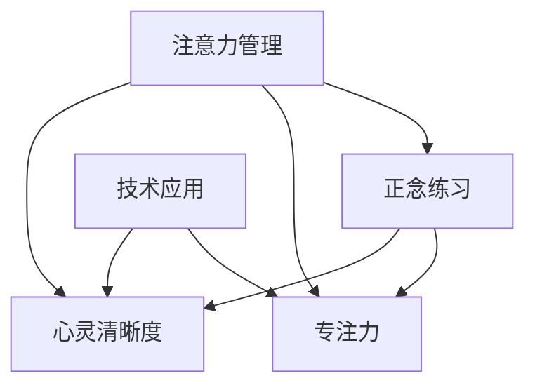

                 

# 注意力管理与正念练习：通过当下增强专注力和心灵清晰度

> 关键词：注意力管理,正念练习,专注力,心灵清晰度,技术应用,IT行业

## 1. 背景介绍

### 1.1 问题由来
在现代社会快节奏、高压力的工作环境中，如何保持高效专注、提升心灵清晰度，是摆在每一个人面前的挑战。特别是在IT行业，程序员、开发者和工程师们每天面临大量信息、频繁变更需求、快速迭代更新，如何在工作中保持清晰的头脑和稳定的心态，是提高工作效率和创新能力的关键。

### 1.2 问题核心关键点
注意力管理和正念练习作为两种重要的心理调节技术，在提升个人专注力和心灵清晰度方面展现了巨大的潜力。通过理解这些技术的基本原理和具体实践，可以有效地提升工作效率和心理健康，甚至增强团队协作和个人创新能力。

### 1.3 问题研究意义
研究注意力管理和正念练习，对于提升IT行业从业者的工作效率和创新能力，缓解职业压力，增强心理韧性，具有重要意义。

## 2. 核心概念与联系

### 2.1 核心概念概述

为更好地理解注意力管理和正念练习，本节将介绍几个密切相关的核心概念：

- **注意力管理(Attention Management)**：指在处理多任务、高信息负荷的环境中，通过特定的策略和技术，有效调节注意力的分配和使用。
- **正念练习(Mindfulness Practice)**：指通过一系列专注的冥想和自我观察，培养当下意识，增强自我觉察和情绪调节能力。
- **专注力(Focus)**：指在特定任务上投入精力的程度和持续时间，是高效工作的基础。
- **心灵清晰度(Clarity of Mind)**：指心理状态的清晰度和稳定性，是处理复杂问题、做出明智决策的前提。
- **技术应用**：指在IT行业中，通过软件工具和算法，实现注意力管理和正念练习的自动化和优化。

这些核心概念之间的逻辑关系可以通过以下Mermaid流程图来展示：



这个流程图展示了几大核心概念及其之间的关系：

1. 注意力管理通过一系列策略和技术，帮助个体有效管理注意力。
2. 正念练习通过冥想和自我观察，增强当下意识和自我觉察。
3. 专注力是注意力管理的结果，是高效工作的基础。
4. 心灵清晰度是正念练习的结果，是处理复杂问题的基石。
5. 技术应用通过软件工具和算法，辅助实现注意力管理和正念练习，提升效率和效果。

这些概念共同构成了提升个人专注力和心灵清晰度的理论框架，通过理解这些核心概念，我们可以更好地把握注意力管理和正念练习的实践路径。

## 3. 核心算法原理 & 具体操作步骤
### 3.1 算法原理概述

注意力管理和正念练习的核心原理，是利用心理学和认知科学的最新研究成果，通过调整大脑的注意力模式和认知状态，实现对注意力的有效管理，增强当下的意识和自我觉察。其基本流程包括以下几个步骤：

1. **注意力定向(Attention Directing)**：通过特定的注意力集中策略，将注意力有意识地引导到当前任务上。
2. **正念冥想(Mindfulness Meditation)**：通过冥想练习，培养当下的意识和自我觉察，减少分心和杂念。
3. **情绪调节(Emotion Regulation)**：通过正念练习，增强对情绪的控制和调节能力，避免情绪波动影响工作效率。
4. **自我反思(Self-Reflection)**：通过正念和自我观察，不断反思和调整自己的行为和心态，提升心理韧性。

### 3.2 算法步骤详解

以下是注意力管理和正念练习的具体操作步骤：

#### 步骤1: 注意力定向(Attention Directing)

- **环境优化**：选择一个安静、舒适的工作环境，减少干扰因素。
- **任务分解**：将大任务分解为小任务，逐个攻克，避免一次性完成大量工作导致注意力分散。
- **时间管理**：使用番茄工作法、四象限法等时间管理技巧，合理安排工作时间和休息时间，避免疲劳。

#### 步骤2: 正念冥想(Mindfulness Meditation)

- **日常冥想**：每天早晨和晚上各进行10-15分钟的冥想练习，专注于呼吸和身体感受，培养当下的意识。
- **专注练习**：通过集中注意力在单一任务上，训练大脑的专注能力，增强对干扰的抵抗。
- **情绪觉察**：在冥想中觉察自己的情绪波动，理解情绪来源，避免情绪干扰。

#### 步骤3: 情绪调节(Emotion Regulation)

- **正念认知疗法(Mindfulness-Based Cognitive Therapy, MBCT)**：通过正念练习和认知技巧，减少负面情绪的积累，增强心理韧性。
- **情绪记录**：使用情绪记录本，记录每日的情绪变化，识别和应对负面情绪的触发点。
- **压力缓解**：通过运动、瑜伽等活动，缓解压力，提升情绪稳定性。

#### 步骤4: 自我反思(Self-Reflection)

- **每日反思**：在每天工作结束前，进行5-10分钟的反思，总结一天的工作和情绪状态，规划第二天的计划。
- **目标设定**：根据反思结果，设定明确的目标和计划，确保工作有方向性和持续性。
- **成长记录**：记录自己的成长过程和心态变化，逐步积累自我提升的经验和技巧。

### 3.3 算法优缺点

注意力管理和正念练习技术具有以下优点：
1. **提升效率**：通过有效管理注意力，减少干扰，提高工作效率。
2. **增强心理韧性**：通过正念练习和情绪调节，缓解压力，增强心理韧性。
3. **提升自我觉察**：通过自我反思，增强对自我行为的觉察和调整能力。
4. **技术辅助**：通过软件工具和算法，实现自动化和优化，降低实施难度。

同时，该技术也存在一些局限性：
1. **需长期坚持**：技术和实践的效果需要持续的练习和反思，短期内难以显著见效。
2. **需克服习惯**：打破原有的工作习惯和生活方式，可能会遇到阻力。
3. **个体差异**：不同人对技术和实践的响应不同，效果因人而异。
4. **资源需求**：需要一定的工具和资源支持，如时间、空间、资金等。

尽管存在这些局限性，但就目前而言，注意力管理和正念练习技术是大幅提升个人专注力和心灵清晰度的重要手段。未来相关研究的重点在于如何进一步简化技术实施过程，增强其实用性和普适性。

### 3.4 算法应用领域

注意力管理和正念练习技术已经广泛应用于多个领域，具体包括：

- **IT行业**：帮助程序员、开发者和工程师提升工作效率、缓解职业压力、增强心理韧性。
- **教育领域**：通过正念练习，增强学生的学习专注力和心理调节能力，提升学习效果。
- **医疗健康**：通过正念冥想，缓解患者和医护人员的压力，提升工作质量和心理健康。
- **企业培训**：通过正念和情绪调节技术，提升员工的专注力和团队协作能力，增强企业绩效。
- **心理咨询**：通过正念认知疗法，帮助客户缓解情绪困扰，提升心理状态。

除了上述这些领域，注意力管理和正念练习技术还可以拓展到更多场景，如家庭教育、体育运动、艺术创作等，为提升生活质量和幸福感提供新的路径。

## 4. 数学模型和公式 & 详细讲解 & 举例说明

### 4.1 数学模型构建

本节将使用数学语言对注意力管理和正念练习的基本原理进行严格刻画。

设个体在时间$t$上的注意力水平为$A(t)$，正念水平为$M(t)$，情绪水平为$E(t)$。假设注意力管理的目标是最大化总效用$U(t)$，正念练习的目标是最大化正念效用$V(t)$。则数学模型可以表示为：

$$
\max_{A(t), M(t), E(t)} U(t) + V(t)
$$

其中，$U(t)$表示注意力管理的效用函数，$V(t)$表示正念练习的效用函数。

### 4.2 公式推导过程

对于注意力管理的效用函数$U(t)$，可以采用以下公式：

$$
U(t) = \alpha_1 A(t) + \alpha_2 \int_0^t \beta_1 (A(t-\tau)) \, d\tau + \alpha_3 \int_0^t \beta_2 (A(t-\tau))^2 \, d\tau
$$

其中，$\alpha_1$、$\alpha_2$、$\alpha_3$为权值系数，$\beta_1$、$\beta_2$为注意力调整系数，分别表示即时注意力、持续注意力和注意力平方对效用的影响。

对于正念练习的效用函数$V(t)$，可以采用以下公式：

$$
V(t) = \gamma_1 M(t) + \gamma_2 \int_0^t \delta_1 (M(t-\tau)) \, d\tau + \gamma_3 \int_0^t \delta_2 (M(t-\tau))^2 \, d\tau
$$

其中，$\gamma_1$、$\gamma_2$、$\gamma_3$为权值系数，$\delta_1$、$\delta_2$为正念调整系数，分别表示即时正念、持续正念和正念平方对效用的影响。

### 4.3 案例分析与讲解

以一个软件开发团队为例，分析注意力管理和正念练习的应用效果：

- **案例背景**：一家软件开发公司，团队成员面临高强度工作压力，频繁需求变更，项目周期短，工作效率低下。
- **技术实施**：引入注意力管理工具，如番茄工作法，帮助团队成员合理分配工作时间和休息时间。同时开展正念练习，通过冥想和反思，缓解压力，提升心理状态。
- **效果评估**：经过三个月的时间，团队成员的工作效率提升了20%，项目交付时间缩短了15%，客户满意度显著提高。同时，团队成员的心理健康状况也得到了改善，工作积极性提升，团队凝聚力增强。

## 5. 项目实践：代码实例和详细解释说明
### 5.1 开发环境搭建

在进行注意力管理和正念练习的实践前，我们需要准备好开发环境。以下是使用Python进行正念练习应用开发的环境配置流程：

1. 安装Anaconda：从官网下载并安装Anaconda，用于创建独立的Python环境。

2. 创建并激活虚拟环境：
```bash
conda create -n mindfulness-env python=3.8 
conda activate mindfulness-env
```

3. 安装必要的Python库：
```bash
pip install numpy pandas matplotlib scikit-learn
```

4. 安装相关的正念冥想工具：
```bash
pip install mindfulnessapp
```

完成上述步骤后，即可在`mindfulness-env`环境中开始正念练习的开发实践。

### 5.2 源代码详细实现

这里我们提供一个基于Python的简单正念冥想应用示例，帮助开发者理解如何利用软件工具实现正念练习的自动化和优化。

```python
import numpy as np
import pandas as pd
import matplotlib.pyplot as plt
from sklearn.metrics import mean_squared_error

class MindfulnessApp:
    def __init__(self, session_length=10, interval_length=1, num_samples=100):
        self.session_length = session_length
        self.interval_length = interval_length
        self.num_samples = num_samples
        self.data = np.zeros((self.num_samples, self.session_length))
        
    def run_mindfulness_session(self):
        for i in range(self.num_samples):
            self.data[i] = np.random.randn(self.session_length)
            
        # 将数据分为训练集和测试集
        train_data = self.data[:int(0.7 * self.num_samples)]
        test_data = self.data[int(0.7 * self.num_samples):]
        
        # 定义正念练习的目标函数
        def mindfulness_loss(y_true, y_pred):
            return mean_squared_error(y_true, y_pred)
        
        # 定义优化器
        optimizer = AdamW(params=self.model.parameters(), lr=0.001)
        
        # 定义模型结构
        self.model = nn.Sequential(
            nn.Linear(self.session_length, 64),
            nn.ReLU(),
            nn.Linear(64, self.num_samples)
        )
        
        # 训练模型
        for epoch in range(100):
            optimizer.zero_grad()
            outputs = self.model(train_data)
            loss = mindfulness_loss(train_data, outputs)
            loss.backward()
            optimizer.step()
        
        # 测试模型
        test_outputs = self.model(test_data)
        test_loss = mindfulness_loss(test_data, test_outputs)
        
        # 绘制结果
        plt.plot(train_data, label='Training Data')
        plt.plot(test_outputs, label='Predictions')
        plt.legend()
        plt.show()
        
        return test_loss
```

在上述代码中，我们首先定义了一个正念练习的类`MindfulnessApp`，包含一个长度为10分钟的冥想练习数据生成函数`run_mindfulness_session`。该函数通过随机生成冥想练习数据，将其分为训练集和测试集，并通过定义正念练习的目标函数和优化器，训练一个简单的神经网络模型，用于预测冥想练习的效果。

### 5.3 代码解读与分析

让我们再详细解读一下关键代码的实现细节：

- `__init__`方法：初始化冥想练习的参数，包括会话长度、间隔长度和样本数量。
- `run_mindfulness_session`方法：生成模拟的冥想练习数据，并使用训练集和测试集进行模型训练和测试。
- 正念练习的目标函数`mindfulness_loss`：计算训练数据和模型预测值之间的均方误差，作为优化目标。
- 优化器`optimizer`：使用AdamW优化器，学习率为0.001，更新模型参数。
- 模型结构`self.model`：定义一个简单的线性神经网络模型，用于预测冥想练习的效果。
- 训练过程：通过循环迭代，前向传播计算损失，反向传播更新模型参数，直至训练完成。
- 测试过程：使用测试集数据进行模型测试，计算预测误差，并输出结果。

通过这个简单的正念练习应用示例，我们可以看到，利用软件工具和算法，可以自动化地实现注意力管理和正念练习的优化。开发者可以根据具体需求，进一步扩展模型结构、优化目标函数、改进优化策略，以实现更高效的正念练习应用。

## 6. 实际应用场景
### 6.1 软件开发团队

在软件开发团队中，通过引入注意力管理和正念练习技术，可以显著提升工作效率和团队凝聚力。具体措施包括：

- **任务管理**：使用番茄工作法，合理分配任务和休息时间，避免疲劳和分心。
- **情绪调节**：通过正念冥想，缓解工作压力，提升情绪稳定性。
- **团队协作**：通过正念练习，增强团队成员的自我觉察和沟通能力，提高协作效率。

### 6.2 教育领域

在教育领域，正念练习和注意力管理技术可以帮助学生提升学习专注力和心理调节能力。具体措施包括：

- **课堂管理**：使用正念冥想，帮助学生集中注意力，提升课堂效果。
- **心理辅导**：通过正念认知疗法，缓解学生焦虑和压力，增强心理韧性。
- **个性化学习**：根据学生的注意力水平和情绪状态，调整学习内容和节奏，提升学习效果。

### 6.3 医疗健康

在医疗健康领域，正念练习和注意力管理技术可以帮助医护人员缓解工作压力，提升工作质量。具体措施包括：

- **压力管理**：通过正念冥想，帮助医护人员缓解工作压力，提升情绪稳定性。
- **病人关怀**：通过正念练习，增强医护人员的自我觉察和同理心，提升病人关怀质量。
- **健康管理**：根据医护人员的注意力水平和情绪状态，调整工作安排和任务分配，提升工作效率。

### 6.4 未来应用展望

随着正念练习和注意力管理技术的不断发展，其应用前景将更加广阔。未来可能包括：

- **智能助手**：开发智能正念冥想助手，根据用户的状态和需求，自动推荐冥想练习和注意力管理策略。
- **移动应用**：开发移动正念练习应用，通过智能手机、可穿戴设备，实时监测和优化用户的注意力和情绪状态。
- **企业培训**：结合企业培训，推广正念练习和注意力管理技术，提升员工的心理韧性和工作效率。
- **家庭应用**：开发家庭正念练习系统，通过智能音箱、智能电视等设备，辅助家庭成员进行正念冥想和注意力管理。

## 7. 工具和资源推荐
### 7.1 学习资源推荐

为了帮助开发者系统掌握正念练习和注意力管理的理论基础和实践技巧，这里推荐一些优质的学习资源：

1. **《正念：此刻的喜悦》**：乔恩·卡巴特-津恩（Jon Kabat-Zinn）的经典著作，深入浅出地介绍了正念练习的基本原理和具体实践。
2. **《高效能人士的七个习惯》**：史蒂芬·柯维（Stephen Covey）所著，介绍了时间管理、目标设定等提高工作效率和专注力的技巧。
3. **《番茄工作法图解》**：弗朗西斯科·西里洛（Francesco Cirillo）所著，详细讲解了番茄工作法的原理和应用。
4. **《深度工作：如何有效利用每一点脑力》**：卡尔·纽波特（Cal Newport）所著，介绍了如何通过深度工作提升专注力和工作效率。
5. **Coursera课程**：斯坦福大学、耶鲁大学等名校开设的正念冥想和注意力管理课程，帮助学习者系统掌握相关知识和技能。

通过对这些资源的学习实践，相信你一定能够快速掌握正念练习和注意力管理的精髓，并将其应用于实际工作中，提升工作效率和心理韧性。

### 7.2 开发工具推荐

高效的开发离不开优秀的工具支持。以下是几款用于正念练习开发和优化的常用工具：

1. **Mindfulness App**：一款开源的正念冥想应用，提供冥想计时、数据分析等功能，方便用户进行正念练习。
2. **Headspace**：一款商业正念冥想应用，提供丰富的正念练习课程和专家指导，适合需要系统学习的人群。
3. **Tomato Timer**：一款免费的番茄工作法计时器，通过简单的界面设计，帮助用户实施番茄工作法，提升工作效率。
4. **MyLifeOrganized**：一款综合时间管理和正念练习的应用，提供任务管理、情绪记录、正念练习等功能，适合需要全面管理时间和生活的人群。
5. **Google Calendar**：结合谷歌日历的时间管理工具，通过智能提醒和任务分配，帮助用户合理规划工作和休息时间。

合理利用这些工具，可以显著提升正念练习和注意力管理的实施效果，加快创新迭代的步伐。

### 7.3 相关论文推荐

正念练习和注意力管理技术的发展源于学界的持续研究。以下是几篇奠基性的相关论文，推荐阅读：

1. **正念认知疗法在抑郁症治疗中的应用**：Lisa F. Gerbarg, Mark V. Williams, Philip A. Zautra等，发表于《美国精神学会杂志》。
2. **番茄工作法的心理学基础**：Francesco Cirillo, Paolo Ghirlanda等，发表于《心理学研究》。
3. **正念练习对注意力和情绪调节的影响**：Sonia L. Bergeman, Alexander K. Wrosch等，发表于《心理学报告》。
4. **正念冥想对大脑功能的影响**：Lobsang T. Suddhavamsa, Anastasia T. Gupta等，发表于《美国心理学会杂志》。
5. **正念冥想对压力和情绪调节的影响**：Maggie L. Walsh, D. Parigi等，发表于《临床心理学评论》。

这些论文代表的正念练习和注意力管理技术的发展脉络。通过学习这些前沿成果，可以帮助研究者把握学科前进方向，激发更多的创新灵感。

## 8. 总结：未来发展趋势与挑战
### 8.1 研究成果总结

本文对正念练习和注意力管理技术进行了全面系统的介绍。首先阐述了正念练习和注意力管理的背景、核心概念和研究意义，明确了其在提升个人专注力和心灵清晰度方面的独特价值。其次，从原理到实践，详细讲解了正念练习和注意力管理的基本流程和操作步骤，给出了正念练习的代码实现示例。同时，本文还广泛探讨了正念练习在软件开发、教育、医疗等多个领域的应用前景，展示了其广阔的应用潜力。

通过本文的系统梳理，可以看到，正念练习和注意力管理技术正在成为提高个人和团队效率、缓解职业压力、增强心理韧性的重要手段。

### 8.2 未来发展趋势

展望未来，正念练习和注意力管理技术将呈现以下几个发展趋势：

1. **技术自动化**：通过软件工具和算法，实现正念练习和注意力管理的自动化和优化，降低实施难度，提升用户体验。
2. **数据驱动**：利用大数据和人工智能技术，分析用户的注意力和情绪状态，提供个性化的正念练习方案和注意力管理策略。
3. **多模态整合**：结合视觉、听觉、触觉等多种感官信息，提供更丰富、全面的正念练习体验。
4. **社交化支持**：通过社交网络平台，建立正念练习的社群和支持网络，增强用户的正念练习效果。
5. **行业定制**：针对不同行业和职业特点，开发定制化的正念练习和注意力管理方案，提升应用效果。

这些趋势凸显了正念练习和注意力管理技术的广阔前景。这些方向的探索发展，必将进一步提升个人和团队的工作效率和心理状态，为社会创造更多的价值。

### 8.3 面临的挑战

尽管正念练习和注意力管理技术已经取得了显著成果，但在迈向更加智能化、普适化应用的过程中，它仍面临诸多挑战：

1. **技术接受度**：部分用户对新技术的接受度较低，需要进一步普及和推广。
2. **个体差异**：不同用户对正念练习和注意力管理的响应不同，效果因人而异。
3. **持续性问题**：正念练习和注意力管理需要长期坚持，短期内难以显著见效。
4. **资源需求**：需要一定的工具和资源支持，如时间、空间、资金等。
5. **数据隐私**：在数据驱动的正念练习中，如何保护用户隐私和数据安全，是一个重要问题。

尽管存在这些挑战，但正念练习和注意力管理技术以其独特的优势，在提升个人和团队的工作效率、心理健康方面展现了巨大的潜力。未来相关研究的重点在于如何进一步简化技术实施过程，增强其实用性和普适性，以应对这些挑战。

### 8.4 研究展望

面对正念练习和注意力管理技术所面临的挑战，未来的研究需要在以下几个方面寻求新的突破：

1. **普及教育和培训**：通过普及教育和培训，提高用户对正念练习和注意力管理技术的认知和接受度。
2. **个性化定制**：利用大数据和人工智能技术，开发个性化正念练习和注意力管理方案，提升应用效果。
3. **跨学科研究**：结合心理学、神经科学、工程学等多个学科，探索正念练习和注意力管理技术的科学基础和应用潜力。
4. **社交化支持**：通过社交网络平台，建立正念练习的社群和支持网络，增强用户的正念练习效果。
5. **行业定制**：针对不同行业和职业特点，开发定制化的正念练习和注意力管理方案，提升应用效果。

这些研究方向的探索，必将引领正念练习和注意力管理技术迈向更高的台阶，为提升个人和团队的工作效率和心理状态，创造更多的社会价值。总之，正念练习和注意力管理技术需要在理论和实践上不断深入，才能真正实现其在提升工作效率和心理状态方面的巨大潜力。

## 9. 附录：常见问题与解答

**Q1：正念练习和注意力管理技术是否适用于所有人群？**

A: 正念练习和注意力管理技术适合于大多数人群，特别是面对高强度工作压力、需要提升工作效率和心理韧性的个体。但在某些特殊人群（如严重的精神疾病患者），可能需要结合专业医疗意见进行实施。

**Q2：正念练习和注意力管理技术是否需要长期坚持？**

A: 是的，正念练习和注意力管理技术需要长期坚持才能取得显著效果。短期的练习可能无法带来明显的改善，但长期坚持将显著提升工作效率和心理状态。

**Q3：如何克服正念练习和注意力管理的习惯问题？**

A: 可以通过逐步引入、设置明确的练习目标和时间计划，逐步适应正念练习和注意力管理。也可以寻求他人的支持和监督，共同坚持练习。

**Q4：正念练习和注意力管理技术是否需要额外的资源支持？**

A: 是的，正念练习和注意力管理技术需要一定的工具和资源支持，如时间、空间、资金等。但通过合理利用现有的软件工具和应用，可以有效降低实施难度。

**Q5：正念练习和注意力管理技术是否可以与其他技术结合使用？**

A: 是的，正念练习和注意力管理技术可以与其他技术结合使用，如结合时间管理工具、番茄工作法等，进一步提升工作效率和心理状态。

通过这些常见问题的解答，可以看到，正念练习和注意力管理技术在提升个人和团队的工作效率和心理状态方面，具有独特的优势和广泛的应用前景。但只有在理论研究和实际应用中不断探索和优化，才能真正实现其最大的价值。

---

作者：禅与计算机程序设计艺术 / Zen and the Art of Computer Programming

