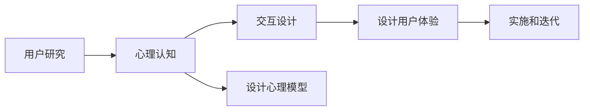

                 

# 注意力经济下的用户体验设计

## 1. 背景介绍

随着互联网技术的快速发展，用户体验(UX)设计已经成为了企业竞争的关键因素。特别是如今处于注意力经济时代，用户在互联网上的注意力成为稀缺资源，如何在激烈的市场竞争中吸引和留住用户的注意力，成为企业亟需解决的问题。本文旨在通过分析注意力经济的特点，探讨如何通过用户研究、交互设计、心理认知等方法，构建更加人性化的用户体验设计。

## 2. 核心概念与联系

### 2.1 核心概念概述

为了更好地理解注意力经济下的用户体验设计，我们首先需要明确一些核心概念：

- **注意力经济**：指在信息爆炸的时代，用户的注意力成为一种稀缺资源。吸引和保持用户注意力是企业获取商业价值的关键。
- **用户体验(UX)**：指的是用户与产品或服务互动时的感受和体验。良好的用户体验能够增强用户粘性，提升用户满意度。
- **用户研究**：通过调研、访谈、观察等方法，了解用户的需求、行为和心理特征。
- **交互设计**：通过设计直观易用的界面和交互流程，提升用户操作效率和满意度。
- **心理认知**：利用心理学原理，理解用户心理，预测用户行为，设计符合用户认知的心理模型。

这些概念之间存在着紧密的联系，通过结合用户研究、心理认知和交互设计，可以更好地构建符合用户心理的体验，从而提高用户粘性和满意度。

### 2.2 核心概念原理和架构的 Mermaid 流程图



这个流程图展示了用户体验设计的整体流程，从用户研究开始，通过心理认知理解用户心理，设计符合用户认知的交互设计，最终实施并不断迭代用户体验。

## 3. 核心算法原理 & 具体操作步骤

### 3.1 算法原理概述

用户体验设计的基本原理是，通过深入理解用户的需求和心理，设计符合用户认知的交互方式，提升用户的使用体验。这一过程可以简单概括为：

1. 用户研究：通过各种方法获取用户数据。
2. 心理认知：分析用户数据，理解用户心理。
3. 交互设计：设计符合用户认知的交互方式。
4. 实施与迭代：将设计方案转化为实际产品，并根据用户反馈不断迭代优化。

### 3.2 算法步骤详解

#### 3.2.1 用户研究

用户研究是用户体验设计的起点，通过获取用户数据，了解用户需求和行为。常用的用户研究方法包括：

- **问卷调查**：通过设计问卷，收集用户对产品或服务的意见和反馈。
- **访谈**：与用户进行深入交谈，了解他们的真实需求和心理状态。
- **用户测试**：让用户实际使用产品，观察他们的行为和反馈。
- **数据分析**：通过分析用户行为数据，了解用户的使用习惯和偏好。

#### 3.2.2 心理认知

心理认知是通过分析用户数据，理解用户心理和行为规律的过程。心理认知的目的是设计符合用户心理的交互方式，提升用户满意度。常用的心理认知方法包括：

- **用户画像**：构建详细的用户画像，描述目标用户的基本特征、需求和行为。
- **用户心理模型**：建立符合用户心理的认知模型，预测用户的行为和反应。
- **情感分析**：通过情感分析技术，了解用户对产品或服务的情感倾向。

#### 3.2.3 交互设计

交互设计是将心理认知转化为具体的设计方案的过程。通过设计符合用户心理的交互方式，提升用户的使用体验。常用的交互设计方法包括：

- **信息架构**：设计直观易用的信息架构，帮助用户快速找到所需信息。
- **视觉设计**：通过视觉设计，提升界面的可读性和美观度。
- **交互流程**：设计流畅的交互流程，降低用户的操作难度。
- **原型设计**：通过原型设计，验证设计方案的可行性和用户体验。

#### 3.2.4 实施与迭代

实施与迭代是将设计方案转化为实际产品，并根据用户反馈不断优化改进的过程。常用的实施与迭代方法包括：

- **产品上线**：将设计方案转化为实际产品，进行市场推广。
- **用户反馈**：通过用户反馈，了解用户的使用体验和问题。
- **数据分析**：通过数据分析，了解用户的使用行为和问题。
- **迭代优化**：根据用户反馈和数据分析，不断优化和改进设计方案。

### 3.3 算法优缺点

用户体验设计的优点在于：

- **提升用户满意度**：通过设计符合用户认知的交互方式，提升用户的使用体验和满意度。
- **降低用户流失**：良好的用户体验能够增强用户粘性，降低用户流失率。
- **增加用户转化**：通过设计符合用户心理的产品，提升用户的转化率。

用户体验设计的缺点在于：

- **复杂度高**：用户体验设计涉及用户研究、心理认知、交互设计等多个环节，复杂度较高。
- **成本高**：用户研究、心理认知、原型设计等环节需要较高的时间和资源投入。
- **依赖用户数据**：用户体验设计依赖于大量的用户数据，数据获取和分析难度较大。

### 3.4 算法应用领域

用户体验设计广泛应用于各种产品和服务中，包括但不限于：

- **移动应用**：通过设计符合用户心理的交互方式，提升移动应用的用户体验。
- **网站设计**：通过设计直观易用的网站界面和交互流程，提升用户的使用效率。
- **电子商务**：通过设计符合用户心理的购物流程和用户体验，提升用户的购买转化率。
- **游戏设计**：通过设计符合用户认知的游戏界面和交互方式，提升用户的游戏体验。
- **智能设备**：通过设计符合用户认知的交互方式，提升智能设备的用户体验。

## 4. 数学模型和公式 & 详细讲解 & 举例说明

### 4.1 数学模型构建

用户体验设计的数学模型可以简单概括为：

$$
U = f(R, P, I, F, O)
$$

其中：

- $U$：用户体验，包括用户满意度和用户粘性。
- $R$：用户研究，包括用户数据和行为分析。
- $P$：心理认知，包括用户画像和心理模型。
- $I$：交互设计，包括信息架构、视觉设计和交互流程。
- $F$：实施与迭代，包括产品上线和用户反馈。
- $O$：数据分析，包括用户行为分析和数据可视化。

### 4.2 公式推导过程

用户体验设计的数学模型可以进一步推导为：

$$
U = \max_{R, P, I, F, O} \sum_{i}^{} \left[ u_i(R_i) + p_i(P_i) + i_i(I_i) + f_i(F_i) + o_i(O_i) \right]
$$

其中：

- $u_i(R_i)$：用户研究对用户体验的影响。
- $p_i(P_i)$：心理认知对用户体验的影响。
- $i_i(I_i)$：交互设计对用户体验的影响。
- $f_i(F_i)$：实施与迭代对用户体验的影响。
- $o_i(O_i)$：数据分析对用户体验的影响。

### 4.3 案例分析与讲解

以电子商务网站的用户体验设计为例：

- **用户研究**：通过问卷调查和用户访谈，了解用户对电子商务网站的需求和行为。
- **心理认知**：构建用户画像，理解用户心理和行为规律。
- **交互设计**：设计直观易用的信息架构、视觉设计和交互流程。
- **实施与迭代**：将设计方案转化为实际网站，并根据用户反馈不断优化。

通过这一过程，电子商务网站可以提升用户满意度和粘性，增加用户转化率。

## 5. 项目实践：代码实例和详细解释说明

### 5.1 开发环境搭建

为了进行用户体验设计的实践，我们需要搭建开发环境。以下是使用Python进行Web开发的环境配置流程：

1. 安装Anaconda：从官网下载并安装Anaconda，用于创建独立的Python环境。

2. 创建并激活虚拟环境：
```bash
conda create -n web-env python=3.8 
conda activate web-env
```

3. 安装Flask：
```bash
pip install flask
```

4. 安装WSGI：
```bash
pip install gunicorn
```

5. 安装Jinja2：
```bash
pip install jinja2
```

6. 安装SQLAlchemy：
```bash
pip install sqlalchemy
```

完成上述步骤后，即可在`web-env`环境中开始Web应用开发。

### 5.2 源代码详细实现

以下是使用Flask框架开发的简单Web应用的代码实现：

```python
from flask import Flask, render_template, request
from flask_sqlalchemy import SQLAlchemy

app = Flask(__name__)
app.config['SQLALCHEMY_DATABASE_URI'] = 'sqlite:///test.db'
db = SQLAlchemy(app)

class User(db.Model):
    id = db.Column(db.Integer, primary_key=True)
    name = db.Column(db.String(80), nullable=False)
    email = db.Column(db.String(120), unique=True, nullable=False)

@app.route('/')
def index():
    users = User.query.all()
    return render_template('index.html', users=users)

@app.route('/add', methods=['POST'])
def add():
    name = request.form['name']
    email = request.form['email']
    user = User(name=name, email=email)
    db.session.add(user)
    db.session.commit()
    return 'User added successfully'

if __name__ == '__main__':
    db.create_all()
    app.run(debug=True)
```

### 5.3 代码解读与分析

让我们再详细解读一下关键代码的实现细节：

- **Flask框架**：Flask是Python中最流行的Web开发框架之一，提供了简单易用的API和灵活的扩展机制。
- **SQLAlchemy库**：SQLAlchemy是一个Python ORM框架，用于简化数据库操作。
- **路由(Routing)**：Flask使用路由将请求映射到对应的函数。
- **模板引擎**：使用Jinja2模板引擎，动态生成HTML页面。
- **数据库操作**：使用SQLAlchemy进行数据库操作，实现用户数据存储和查询。
- **表单处理**：使用request库处理HTTP请求，实现用户表单提交功能。

通过这一实现，我们展示了如何通过Flask框架构建一个简单的Web应用，并实现用户数据存储和查询功能。

### 5.4 运行结果展示

运行上述代码后，在浏览器中访问`http://localhost:5000`，即可看到一个简单的用户列表页面，其中包含了用户数据。同时，还可以通过访问`http://localhost:5000/add`，添加新的用户数据。

## 6. 实际应用场景

### 6.1 电子商务网站

电子商务网站需要设计符合用户心理的交互方式，提升用户购物体验。具体而言：

- **产品展示**：设计直观易用的产品展示界面，帮助用户快速找到所需商品。
- **购物流程**：设计流畅的购物流程，降低用户操作难度。
- **用户反馈**：根据用户反馈，不断优化和改进用户体验。

### 6.2 智能设备

智能设备需要设计符合用户认知的交互方式，提升用户的使用体验。具体而言：

- **界面设计**：设计直观易用的设备界面，降低用户操作难度。
- **交互设计**：设计流畅的交互流程，提升用户的操作效率。
- **语音交互**：设计符合用户心理的语音交互方式，提升用户的使用体验。

### 6.3 移动应用

移动应用需要设计符合用户认知的交互方式，提升用户体验。具体而言：

- **界面设计**：设计直观易用的应用界面，降低用户操作难度。
- **交互设计**：设计流畅的交互流程，提升用户的操作效率。
- **用户反馈**：根据用户反馈，不断优化和改进用户体验。

### 6.4 未来应用展望

随着技术的不断进步，用户体验设计将呈现出以下几个发展趋势：

1. **个性化设计**：通过数据分析，设计符合用户个性化需求的界面和交互方式。
2. **增强现实(AR)和虚拟现实(VR)**：结合AR和VR技术，提升用户的沉浸式体验。
3. **智能推荐系统**：通过智能推荐算法，为用户推荐符合其兴趣和需求的内容。
4. **情感计算**：结合情感计算技术，理解用户的情感状态，设计更加人性化的交互方式。
5. **多模态交互**：结合语音、图像、手势等多种交互方式，提升用户的交互体验。

## 7. 工具和资源推荐

### 7.1 学习资源推荐

为了帮助开发者系统掌握用户体验设计的理论基础和实践技巧，这里推荐一些优质的学习资源：

1. 《用户体验设计基础》：一本经典的入门书籍，全面介绍了用户体验设计的理论和方法。
2. 《设计心理学》：一本深入浅出介绍用户心理的书籍，帮助设计师理解用户心理。
3. 《Web开发实战》：一本实用的Web开发教程，介绍Flask等Web框架的使用。
4. 《数据科学实战》：一本介绍数据分析和数据可视化的书籍，帮助设计师理解用户数据。
5. 《设计思维》：一本介绍设计思维方法的书籍，帮助设计师从用户角度出发，解决问题。

通过对这些资源的学习实践，相信你一定能够快速掌握用户体验设计的精髓，并用于解决实际的UX问题。

### 7.2 开发工具推荐

高效的开发离不开优秀的工具支持。以下是几款用于用户体验设计开发的常用工具：

1. Sketch：一款流行的界面设计工具，支持矢量绘图和动画设计，广泛应用于UX设计。
2. Adobe XD：一款专业的UX设计工具，支持原型设计和交互设计，适合大公司使用。
3. InVision：一款在线原型设计和用户体验评估工具，支持多人协作和测试，广泛应用于互联网公司。
4. Figma：一款云端设计的UX设计工具，支持多人协作和实时编辑，广泛应用于团队协作设计。
5. Axure：一款流行的原型设计工具，支持动态交互和测试，适合中大型项目使用。

合理利用这些工具，可以显著提升用户体验设计的开发效率，加快创新迭代的步伐。

### 7.3 相关论文推荐

用户体验设计的最新研究动态不断涌现，以下是几篇经典的相关论文，推荐阅读：

1. 《A study of user experience design in mobile applications》：介绍移动应用用户体验设计的理论和实践。
2. 《Human-computer interaction design patterns》：介绍交互设计模式，帮助设计师设计更好的用户体验。
3. 《The future of user experience design》：展望用户体验设计的未来发展趋势。
4. 《A case study of user research in e-commerce websites》：分析电子商务网站用户体验设计的案例。
5. 《Designing for emotional intelligence》：介绍情感计算在用户体验设计中的应用。

这些论文代表了大用户体验设计的发展脉络，通过学习这些前沿成果，可以帮助研究者把握学科前进方向，激发更多的创新灵感。

## 8. 总结：未来发展趋势与挑战

### 8.1 总结

本文对注意力经济下的用户体验设计进行了全面系统的介绍。首先阐述了用户体验设计的背景和重要性，明确了用户体验设计在吸引和保持用户注意力方面的关键作用。其次，从原理到实践，详细讲解了用户体验设计的核心步骤，包括用户研究、心理认知、交互设计和实施与迭代。同时，本文还探讨了用户体验设计在电子商务、智能设备和移动应用等不同场景中的应用，展示了用户体验设计的广泛应用。最后，本文精选了用户体验设计的学习资源、开发工具和相关论文，力求为读者提供全方位的技术指引。

通过本文的系统梳理，可以看到，用户体验设计已经成为了提升产品竞争力的关键因素。从用户研究到心理认知，再到交互设计和实施与迭代，每个环节都需要深入思考和细致打磨。只有不断优化用户体验，才能在激烈的市场竞争中脱颖而出。

### 8.2 未来发展趋势

展望未来，用户体验设计将呈现以下几个发展趋势：

1. **数据驱动设计**：通过数据分析，设计符合用户心理的界面和交互方式，提升用户体验。
2. **AI辅助设计**：结合AI技术，自动化设计过程，提升设计效率。
3. **多模态设计**：结合语音、图像、手势等多种交互方式，提升用户的沉浸式体验。
4. **情感计算**：结合情感计算技术，理解用户的情感状态，设计更加人性化的交互方式。
5. **个性化设计**：通过个性化推荐，设计符合用户个性化需求的界面和交互方式。
6. **AR和VR设计**：结合AR和VR技术，提升用户的沉浸式体验。

这些趋势凸显了用户体验设计的广阔前景。这些方向的探索发展，必将进一步提升产品的用户体验，为构建人机协同的智能时代提供新的解决方案。

### 8.3 面临的挑战

尽管用户体验设计已经取得了显著的成果，但在迈向更加智能化、普适化应用的过程中，它仍面临着诸多挑战：

1. **复杂度高**：用户体验设计涉及用户研究、心理认知、交互设计等多个环节，复杂度较高。
2. **成本高**：用户研究、心理认知、原型设计等环节需要较高的时间和资源投入。
3. **依赖用户数据**：用户体验设计依赖于大量的用户数据，数据获取和分析难度较大。
4. **交互设计难度大**：设计符合用户心理的交互方式，需要深入理解用户心理和行为规律。
5. **用户需求变化快**：用户的心理需求和行为规律不断变化，用户体验设计需要持续优化。

### 8.4 研究展望

为了克服用户体验设计面临的挑战，未来的研究需要在以下几个方面寻求新的突破：

1. **自动化设计工具**：开发更加智能化的设计工具，自动完成用户研究和心理认知，提升设计效率。
2. **跨学科融合**：结合心理学、计算机科学、设计学等学科知识，设计符合用户心理的界面和交互方式。
3. **情感计算技术**：深入研究情感计算技术，提升用户体验设计的情感智能。
4. **个性化设计算法**：结合机器学习算法，实现个性化推荐，设计符合用户个性化需求的界面和交互方式。
5. **AR和VR设计**：结合AR和VR技术，提升用户的沉浸式体验。

这些研究方向的探索，必将引领用户体验设计技术迈向更高的台阶，为构建安全、可靠、可解释、可控的智能系统铺平道路。面向未来，用户体验设计还需要与其他人工智能技术进行更深入的融合，共同推动用户体验设计的进步。

## 9. 附录：常见问题与解答

**Q1：用户体验设计是否适用于所有产品和服务？**

A: 用户体验设计适用于大多数产品和服务，尤其是与用户互动密切的产品。通过设计符合用户心理的界面和交互方式，可以显著提升产品的用户满意度和粘性。但对于一些高度自动化的产品，用户体验设计的作用可能相对有限。

**Q2：如何降低用户体验设计的复杂度？**

A: 降低用户体验设计的复杂度，可以从以下几个方面入手：
1. **简化流程**：设计直观易用的界面和交互流程，降低用户的操作难度。
2. **自动化设计工具**：开发自动化设计工具，自动完成用户研究和心理认知，提升设计效率。
3. **模块化设计**：将设计任务分解为多个模块，逐步迭代完成，降低设计复杂度。

**Q3：用户体验设计的成本如何控制？**

A: 用户体验设计的成本可以通过以下几个方面进行控制：
1. **快速迭代**：采用快速迭代的方式，逐步优化设计方案，降低设计和测试成本。
2. **跨部门协作**：通过跨部门协作，分享资源和经验，降低设计和开发成本。
3. **自动化测试**：使用自动化测试工具，快速验证设计方案，降低测试成本。

**Q4：用户体验设计如何适应用户需求变化？**

A: 用户体验设计需要持续优化以适应用户需求变化。具体措施包括：
1. **用户反馈机制**：建立用户反馈机制，及时了解用户需求变化。
2. **数据驱动设计**：通过数据分析，设计符合用户心理的界面和交互方式。
3. **持续改进**：不断优化和改进设计方案，提升用户体验。

**Q5：用户体验设计的未来发展方向是什么？**

A: 用户体验设计的未来发展方向包括：
1. **数据驱动设计**：通过数据分析，设计符合用户心理的界面和交互方式。
2. **AI辅助设计**：结合AI技术，自动化设计过程，提升设计效率。
3. **多模态设计**：结合语音、图像、手势等多种交互方式，提升用户的沉浸式体验。
4. **情感计算**：结合情感计算技术，理解用户的情感状态，设计更加人性化的交互方式。
5. **个性化设计**：通过个性化推荐，设计符合用户个性化需求的界面和交互方式。
6. **AR和VR设计**：结合AR和VR技术，提升用户的沉浸式体验。

这些方向将进一步提升用户体验设计的技术水平，为构建人机协同的智能时代提供新的解决方案。

---

作者：禅与计算机程序设计艺术 / Zen and the Art of Computer Programming

