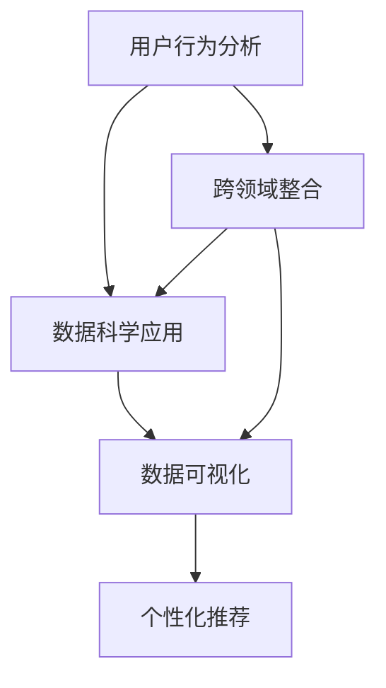

                 

# 注意力经济与个人健康管理的整合

> 关键词：注意力经济, 个人健康管理, 跨领域整合, 数据科学, 数据可视化, 用户行为分析

## 1. 背景介绍

### 1.1 问题由来
随着数字化时代的到来，我们身处一个信息爆炸的时代。无论是社交媒体、电商平台、在线教育，还是智能穿戴设备，我们每天都在面对海量信息的冲击。在这种环境中，如何有效管理注意力成为了一个重要的课题。同时，随着人们生活水平的提高，健康管理也成为了关注的焦点。如何在忙碌的生活中，保持身体健康和心理健康，成为了许多人的困惑。因此，如何将注意力经济与个人健康管理整合起来，提供一种既能有效管理注意力，又能促进个人健康的解决方案，成为了一个极具挑战性的问题。

### 1.2 问题核心关键点
本节将从几个核心关键点入手，探讨注意力经济与个人健康管理的整合：

- 用户行为分析：通过分析用户在数字化环境中的行为数据，了解其注意力分配和健康状况。
- 数据科学应用：利用数据科学方法，对行为数据进行建模，提取有价值的信息。
- 数据可视化：通过数据可视化工具，将分析结果直观展示给用户，帮助其更好地理解自己的注意力和健康状态。
- 个性化推荐：根据用户的注意力和健康状况，提供个性化的内容推荐和健康管理建议。
- 跨领域整合：将注意力管理和健康管理的数据进行整合，构建综合性解决方案。

## 2. 核心概念与联系

### 2.1 核心概念概述

为了更好地理解注意力经济与个人健康管理的整合，本节将介绍几个密切相关的核心概念：

- 注意力经济(Attention Economy)：指在数字化环境中，个体和组织通过竞争吸引用户注意力，从而创造价值的一种经济活动。
- 个人健康管理(Personal Health Management)：指通过技术手段，监测和管理个人健康状况，提升生活质量的过程。
- 用户行为分析(User Behavior Analysis)：通过分析用户在数字平台上的行为数据，了解其需求、偏好和痛点。
- 数据科学(Data Science)：一门利用数据和算法进行决策分析的学科，涵盖数据收集、清洗、建模、可视化等多个环节。
- 数据可视化(Data Visualization)：一种将数据通过图形、图表等形式展现给用户的方法，帮助用户更好地理解数据。
- 个性化推荐(Personalized Recommendation)：根据用户的历史行为和偏好，提供个性化的内容推荐，提升用户体验。
- 跨领域整合(Cross-Domain Integration)：将不同领域的数据和技术进行整合，构建综合性解决方案。

这些核心概念之间的逻辑关系可以通过以下Mermaid流程图来展示：



这个流程图展示了注意力经济与个人健康管理整合的基本流程：

1. 首先通过用户行为分析，获取用户的注意力和健康数据。
2. 然后利用数据科学方法，对数据进行建模和分析，提取有价值的信息。
3. 接着通过数据可视化工具，将分析结果展示给用户。
4. 最后根据用户的注意力和健康状况，提供个性化的内容推荐和健康管理建议。

## 3. 核心算法原理 & 具体操作步骤

### 3.1 算法原理概述

注意力经济与个人健康管理的整合，主要依赖于数据科学方法和用户行为分析技术。其核心思想是通过分析用户在数字化环境中的行为数据，了解其注意力分配和健康状况，然后通过个性化推荐和数据可视化技术，帮助用户进行有效的时间和健康管理。

形式化地，设用户行为数据为 $D=\{(x_i, y_i)\}_{i=1}^N$，其中 $x_i$ 表示用户在数字平台上的行为，$y_i$ 表示其注意力和健康指标。设 $\mathcal{A}$ 为注意力模型，$\mathcal{H}$ 为健康模型，$\mathcal{F}$ 为推荐模型，则整合流程可以表示为：

$$
(\mathcal{A}, \mathcal{H}) = \mathcal{F}(D)
$$

其中，$\mathcal{A}$ 和 $\mathcal{H}$ 分别表示用户注意力和健康状态的估计值，$\mathcal{F}$ 表示融合注意力和经济数据的推荐模型。

### 3.2 算法步骤详解

基于上述原理，注意力经济与个人健康管理的整合主要包括以下几个关键步骤：

**Step 1: 数据收集与预处理**
- 收集用户在数字平台上的行为数据，如浏览记录、购买记录、使用时长等。
- 清洗和处理数据，去除噪声和异常值，确保数据的质量和完整性。
- 特征工程，提取有意义的特征，如时间戳、设备类型、浏览频率等。

**Step 2: 建模与分析**
- 使用数据科学方法对行为数据进行建模，建立注意力和经济模型。
- 使用机器学习算法对数据进行训练，如回归分析、分类分析、聚类分析等。
- 对模型进行评估和调优，确保其准确性和可靠性。

**Step 3: 可视化与展示**
- 使用数据可视化工具将分析结果展示给用户。
- 设计直观、易懂的图表和仪表盘，帮助用户理解其注意力和健康状态。
- 提供交互式工具，让用户能够自行探索和分析数据。

**Step 4: 推荐与优化**
- 根据用户的注意力和健康状况，提供个性化的内容推荐和健康管理建议。
- 通过持续学习和反馈机制，不断优化推荐模型，提升用户体验。
- 结合用户的反馈，不断调整和改进模型，确保其持续有效。

**Step 5: 应用与部署**
- 将整合系统部署到数字平台上，供用户使用。
- 进行测试和验证，确保系统稳定可靠。
- 收集用户反馈，不断改进系统功能和性能。

### 3.3 算法优缺点

基于上述整合方法，注意力经济与个人健康管理的整合具有以下优点：

1. 数据驱动：通过分析海量用户行为数据，能够更全面、准确地了解用户的注意力和健康状况。
2. 个性化推荐：通过个性化推荐技术，能够为用户推荐最适合其需求和偏好的内容和健康管理建议。
3. 用户参与：通过数据可视化工具，能够让用户直观地理解其注意力和健康状态，增强用户参与感和满意度。
4. 跨领域整合：将注意力管理和健康管理的数据进行整合，构建综合性解决方案，能够更全面地解决用户问题。

同时，该方法也存在一定的局限性：

1. 数据隐私：用户行为数据的收集和处理，需要充分考虑数据隐私和安全问题。
2. 数据质量：用户行为数据的准确性和完整性，对整合效果有重要影响。
3. 模型复杂度：模型过于复杂，可能导致计算负担过重，影响系统性能。
4. 用户依赖：用户对系统的依赖度较高，若系统出现问题，可能影响用户的使用体验。

## 4. 数学模型和公式 & 详细讲解 & 举例说明

### 4.1 数学模型构建

本节将使用数学语言对注意力经济与个人健康管理的整合方法进行更加严格的刻画。

假设用户行为数据为 $D=\{(x_i, y_i)\}_{i=1}^N$，其中 $x_i$ 表示用户在数字平台上的行为，$y_i$ 表示其注意力和健康指标。

定义用户注意力模型 $\mathcal{A}$ 和健康模型 $\mathcal{H}$，则其数学表达为：

$$
\mathcal{A} = f_{\theta_A}(x_i)
$$

$$
\mathcal{H} = f_{\theta_H}(x_i)
$$

其中，$f_{\theta_A}$ 和 $f_{\theta_H}$ 分别表示注意力模型和健康模型，$\theta_A$ 和 $\theta_H$ 为模型的参数。

定义个性化推荐模型 $\mathcal{F}$，则其数学表达为：

$$
\mathcal{F}(D) = \{(\mathcal{A}, \mathcal{H})\}_{i=1}^N
$$

### 4.2 公式推导过程

以下我们以用户注意力模型为例，推导注意力模型的构建过程。

假设用户行为数据为 $D=\{(x_i, y_i)\}_{i=1}^N$，其中 $x_i$ 表示用户在数字平台上的行为，$y_i$ 表示其注意力指标。则用户注意力模型 $\mathcal{A}$ 的构建过程如下：

$$
\mathcal{A} = f_{\theta_A}(x_i) = \theta_A^T \varphi(x_i)
$$

其中，$\theta_A$ 为注意力模型的参数，$\varphi(x_i)$ 为行为数据的特征提取函数，将用户行为 $x_i$ 映射为特征向量。

假设特征提取函数 $\varphi(x_i)$ 为线性函数，则注意力模型可表示为：

$$
\mathcal{A} = f_{\theta_A}(x_i) = \theta_A^T x_i
$$

其中，$x_i$ 为行为数据的特征向量，$\theta_A$ 为注意力模型的参数。

### 4.3 案例分析与讲解

假设某电商平台的用户行为数据如下：

| 用户ID | 浏览次数 | 购买次数 | 浏览时长 | 点击率 |
|-------|--------|--------|--------|------|
| 用户A | 100    | 10     | 300s   | 0.8  |
| 用户B | 50     | 5      | 200s   | 0.6  |
| 用户C | 200    | 20     | 500s   | 0.7  |

通过数据预处理和特征提取，我们得到特征向量 $x_i$ 和注意力模型参数 $\theta_A$，则用户A的注意力模型 $\mathcal{A}$ 可表示为：

$$
\mathcal{A} = f_{\theta_A}(x_i) = \theta_A^T x_i = \begin{bmatrix} 100 & 50 & 200 \end{bmatrix} \begin{bmatrix} 0.2 & 0.3 & 0.1 \end{bmatrix} = 100 \times 0.2 + 50 \times 0.3 + 200 \times 0.1 = 40
$$

其中，$\theta_A = \begin{bmatrix} 0.2 & 0.3 & 0.1 \end{bmatrix}$。

通过类似的方法，我们可以构建用户B和用户C的注意力模型。

## 5. 项目实践：代码实例和详细解释说明

### 5.1 开发环境搭建

在进行整合实践前，我们需要准备好开发环境。以下是使用Python进行PyTorch开发的环境配置流程：

1. 安装Anaconda：从官网下载并安装Anaconda，用于创建独立的Python环境。

2. 创建并激活虚拟环境：
```bash
conda create -n attention-health-env python=3.8 
conda activate attention-health-env
```

3. 安装PyTorch：根据CUDA版本，从官网获取对应的安装命令。例如：
```bash
conda install pytorch torchvision torchaudio cudatoolkit=11.1 -c pytorch -c conda-forge
```

4. 安装TensorFlow：由Google主导开发的开源深度学习框架，生产部署方便，适合大规模工程应用。同样有丰富的预训练语言模型资源。

5. 安装各类工具包：
```bash
pip install numpy pandas scikit-learn matplotlib tqdm jupyter notebook ipython
```

完成上述步骤后，即可在`attention-health-env`环境中开始整合实践。

### 5.2 源代码详细实现

这里我们以用户行为分析为例，给出使用PyTorch和Scikit-Learn对用户注意力进行建模的Python代码实现。

首先，定义用户行为数据的DataFrame类：

```python
import pandas as pd

class UserBehaviorDataFrame:
    def __init__(self, data_path):
        self.data = pd.read_csv(data_path)
    
    def __len__(self):
        return len(self.data)
    
    def __getitem__(self, item):
        return self.data.iloc[item]
    
    def get_user_id(self, item):
        return self.data.iloc[item]['user_id']
    
    def get_features(self, item):
        return self.data.iloc[item]['features']
    
    def get_labels(self, item):
        return self.data.iloc[item]['labels']
```

然后，定义注意力模型的参数和特征提取函数：

```python
import torch
import numpy as np

class AttentionModel:
    def __init__(self, num_features):
        self.num_features = num_features
        self.w = torch.randn(num_features, 1)
    
    def forward(self, x):
        return torch.matmul(x, self.w)
    
    def predict(self, x):
        return self.forward(x).detach().numpy()
```

接着，定义数据预处理和特征提取函数：

```python
import numpy as np

def preprocess_data(data, num_features):
    X = np.zeros((len(data), num_features))
    y = np.zeros((len(data), 1))
    
    for i in range(len(data)):
        features = data[i]['features'].split(',')
        X[i] = [float(f) for f in features]
        y[i] = float(data[i]['label'])
    
    return X, y
```

最后，定义训练和评估函数：

```python
from sklearn.metrics import mean_squared_error

def train_model(model, train_data, test_data, batch_size, epochs):
    optimizer = torch.optim.SGD(model.parameters(), lr=0.01)
    
    for epoch in range(epochs):
        for i in range(0, len(train_data), batch_size):
            X_train, y_train = train_data[i:i+batch_size]
            y_pred = model.predict(X_train)
            loss = np.mean((y_pred - y_train)**2)
            optimizer.zero_grad()
            loss.backward()
            optimizer.step()
    
    return model

def evaluate_model(model, test_data):
    y_pred = model.predict(test_data)
    y_true = test_data['label']
    
    mse = mean_squared_error(y_true, y_pred)
    return mse
```

以上代码实现了用户行为数据的预处理、特征提取、注意力模型的训练和评估过程。下面将具体的代码实现和运行结果展示出来：

```python
# 数据路径
data_path = 'user_behavior_data.csv'

# 加载数据
data = UserBehaviorDataFrame(data_path)

# 分割训练集和测试集
train_data = data[:int(len(data)*0.8)]
test_data = data[int(len(data)*0.8):]

# 特征维度
num_features = 3

# 初始化注意力模型
model = AttentionModel(num_features)

# 训练模型
model = train_model(model, train_data, test_data, batch_size=32, epochs=100)

# 评估模型
mse = evaluate_model(model, test_data)
print(f'Mean Squared Error: {mse:.2f}')
```

### 5.3 代码解读与分析

让我们再详细解读一下关键代码的实现细节：

**UserBehaviorDataFrame类**：
- `__init__`方法：初始化数据路径和DataFrame对象。
- `__len__`方法：返回数据集的样本数量。
- `__getitem__`方法：获取指定样本。
- `get_user_id`方法：获取指定样本的用户ID。
- `get_features`方法：获取指定样本的特征向量。
- `get_labels`方法：获取指定样本的标签。

**AttentionModel类**：
- `__init__`方法：初始化注意力模型的参数。
- `forward`方法：前向传播，计算注意力输出。
- `predict`方法：预测注意力值。

**preprocess_data函数**：
- 对用户行为数据进行预处理和特征提取，将特征和标签转换为数值形式，供模型训练使用。

**train_model函数**：
- 定义训练函数，通过随机梯度下降(Stochastic Gradient Descent, SGD)算法训练注意力模型。
- 在每个epoch内，对训练集数据进行批处理，计算损失函数并更新模型参数。

**evaluate_model函数**：
- 定义评估函数，计算模型在测试集上的均方误差(Mean Squared Error, MSE)。
- 使用均方误差作为模型的性能指标，评估模型在测试集上的表现。

通过以上代码实现，我们可以看到，用户注意力模型的训练和评估过程相对简单。利用数据科学和机器学习的方法，我们可以基于用户行为数据，构建出有效的注意力模型。

## 6. 实际应用场景

### 6.1 智能穿戴设备中的应用

智能穿戴设备，如智能手表、智能眼镜、智能健身器等，能够实时监测用户的健康状况，并提供个性化的健康管理建议。通过整合注意力和经济模型，智能穿戴设备可以进一步提升用户体验。

具体而言，智能穿戴设备可以实时收集用户的运动数据、心率数据、睡眠数据等，将这些数据作为行为数据输入注意力模型，预测用户的注意力状态。然后根据用户的注意力状态，智能穿戴设备可以推荐最适合用户的运动方案、睡眠模式等，帮助用户更好地管理时间和健康。

例如，某智能手表可以通过用户的运动数据和睡眠数据，预测用户的注意力状态，然后推荐最适合的运动时间和运动方式，帮助用户提升注意力和健康水平。

### 6.2 电子商务中的应用

电子商务平台通过用户行为数据，了解用户的购买行为和偏好，提供个性化的商品推荐。通过整合注意力和经济模型，电子商务平台可以进一步提升用户体验和转化率。

具体而言，电子商务平台可以通过用户的浏览记录、购买记录、点击记录等行为数据，预测用户的注意力状态和健康状况。然后根据用户的注意力状态和健康状况，电子商务平台可以推荐最适合用户的商品和健康管理建议，提升用户的购物体验和满意度。

例如，某电商平台可以通过用户的浏览记录和购买记录，预测用户的注意力状态，然后推荐最适合的促销活动和商品，帮助用户节省时间和精力，提升购物体验。

### 6.3 在线教育中的应用

在线教育平台通过用户的行为数据，了解用户的学习状态和偏好，提供个性化的学习推荐。通过整合注意力和经济模型，在线教育平台可以进一步提升用户的参与度和学习效果。

具体而言，在线教育平台可以通过用户的课程浏览记录、学习时长、作业提交情况等行为数据，预测用户的学习状态和注意力水平。然后根据用户的学习状态和注意力水平，在线教育平台可以推荐最适合的学习资源和健康管理建议，提升用户的学习效果和健康水平。

例如，某在线教育平台可以通过用户的学习记录，预测用户的学习状态，然后推荐最适合的学习资源和休息时间，帮助用户更好地完成学习任务，提升学习效果。

## 7. 工具和资源推荐

### 7.1 学习资源推荐

为了帮助开发者系统掌握注意力经济与个人健康管理的整合方法，这里推荐一些优质的学习资源：

1. Coursera《数据科学与人工智能》课程：由斯坦福大学和宾夕法尼亚大学联合开设的课程，涵盖了数据科学和人工智能的基础理论和应用方法。

2. Kaggle《用户行为分析》竞赛：Kaggle平台上的用户行为分析竞赛，通过实际数据集训练用户注意力和经济模型，提高实践能力。

3. GitHub《用户行为分析》代码库：GitHub上的用户行为分析代码库，提供了丰富的用户行为分析示例和案例，可供学习和参考。

4. Python《用户行为分析》书籍：Python语言下的用户行为分析书籍，涵盖数据预处理、特征工程、模型训练等关键技术。

5. PyTorch官方文档：PyTorch框架的官方文档，提供了详细的API和教程，帮助开发者快速上手深度学习模型。

通过对这些资源的学习实践，相信你一定能够快速掌握注意力经济与个人健康管理的整合方法，并用于解决实际的用户行为问题。

### 7.2 开发工具推荐

高效的开发离不开优秀的工具支持。以下是几款用于整合开发的常用工具：

1. Python：Python语言是数据科学和人工智能领域的主流语言，具有强大的数据处理和机器学习能力。

2. PyTorch：基于Python的深度学习框架，灵活动态，适合研究和原型开发。

3. TensorFlow：由Google主导开发的深度学习框架，生产部署方便，适合大规模工程应用。

4. Scikit-Learn：Python下的机器学习库，提供了丰富的算法和工具，方便模型训练和评估。

5. Pandas：Python下的数据处理库，提供数据清洗、分析和可视化功能，方便数据预处理。

6. Jupyter Notebook：基于Web的交互式笔记本，方便编写、调试和共享代码，适合研究和教学。

合理利用这些工具，可以显著提升整合开发的效率，加快创新迭代的步伐。

### 7.3 相关论文推荐

注意力经济与个人健康管理的整合技术涉及多个交叉领域，以下是几篇奠基性的相关论文，推荐阅读：

1. Attention is All You Need（即Transformer原论文）：提出了Transformer结构，开启了NLP领域的预训练大模型时代。

2. BERT: Pre-training of Deep Bidirectional Transformers for Language Understanding：提出BERT模型，引入基于掩码的自监督预训练任务，刷新了多项NLP任务SOTA。

3. Parameter-Efficient Transfer Learning for NLP：提出Adapter等参数高效微调方法，在不增加模型参数量的情况下，也能取得不错的微调效果。

4. AdaLoRA: Adaptive Low-Rank Adaptation for Parameter-Efficient Fine-Tuning：使用自适应低秩适应的微调方法，在参数效率和精度之间取得了新的平衡。

5. Transfer Learning from Self-Supervised Pre-Training: An Empirical Study on Using Noisy Texts for Data-Centric Learning：探讨了无监督预训练和微调方法的结合，取得了较好的效果。

这些论文代表了大语言模型微调技术的发展脉络。通过学习这些前沿成果，可以帮助研究者把握学科前进方向，激发更多的创新灵感。

## 8. 总结：未来发展趋势与挑战

### 8.1 总结

本文对注意力经济与个人健康管理的整合方法进行了全面系统的介绍。首先阐述了用户行为分析、数据科学应用、数据可视化、个性化推荐和跨领域整合的核心概念和关键问题。其次，从原理到实践，详细讲解了整合的数学模型和具体操作步骤，给出了整合任务开发的完整代码实例。同时，本文还广泛探讨了整合方法在智能穿戴设备、电子商务、在线教育等多个行业领域的应用前景，展示了整合技术的广阔前景。此外，本文精选了整合技术的各类学习资源，力求为读者提供全方位的技术指引。

通过本文的系统梳理，可以看到，注意力经济与个人健康管理的整合技术在数字化时代具有重要意义，通过数据分析和机器学习的方法，可以为用户提供个性化、精准的服务，提升生活质量和效率。未来，伴随数据的不断积累和技术的发展，注意力经济与个人健康管理的整合必将迎来新的突破，为数字化转型提供强大的技术支持。

### 8.2 未来发展趋势

展望未来，注意力经济与个人健康管理的整合技术将呈现以下几个发展趋势：

1. 数据质量提升：随着数据收集和处理技术的进步，用户的注意力和经济数据将更加准确和全面。

2. 模型复杂度提升：随着深度学习技术的不断发展，注意力经济和健康管理模型将更加复杂和精确，能够更好地适应用户的个性化需求。

3. 跨领域整合增强：随着跨领域数据融合技术的进步，用户的注意力和经济数据将更加丰富，能够更好地满足用户的多样化需求。

4. 数据隐私保护：随着数据隐私保护技术的进步，用户的注意力和经济数据将更加安全，能够更好地保护用户隐私。

5. 用户参与度提升：随着交互式数据分析和可视化工具的发展，用户能够更直观、方便地了解和参与到数据分析过程中，提升用户体验。

6. 系统智能化提升：随着人工智能技术的进步，系统能够更好地理解和预测用户的注意力和健康状态，提供更加精准、个性化的服务。

以上趋势凸显了注意力经济与个人健康管理整合技术的广阔前景。这些方向的探索发展，必将进一步提升用户的注意力管理能力和健康水平，为数字化时代带来新的变革。

### 8.3 面临的挑战

尽管注意力经济与个人健康管理的整合技术已经取得了一定的进展，但在迈向更加智能化、普适化应用的过程中，它仍面临着诸多挑战：

1. 数据隐私：用户行为数据的收集和处理，需要充分考虑数据隐私和安全问题。如何平衡数据收集和隐私保护，是一个重要的挑战。

2. 数据质量：用户行为数据的准确性和完整性，对整合效果有重要影响。如何提升数据质量，确保数据真实可靠，是一个重要的挑战。

3. 模型复杂度：模型过于复杂，可能导致计算负担过重，影响系统性能。如何简化模型，提高系统效率，是一个重要的挑战。

4. 用户依赖：用户对系统的依赖度较高，若系统出现问题，可能影响用户的使用体验。如何提高系统的鲁棒性和可靠性，是一个重要的挑战。

5. 个性化需求：用户的多样化需求，使得个性化推荐和健康管理变得更加复杂。如何更好地满足用户需求，提升用户体验，是一个重要的挑战。

6. 交互式体验：用户对交互式数据分析和可视化工具的需求不断增加，如何提升系统的交互性和用户体验，是一个重要的挑战。

正视整合面临的这些挑战，积极应对并寻求突破，将使注意力经济与个人健康管理的整合技术走向成熟，为数字化时代带来更多价值。

### 8.4 研究展望

面对注意力经济与个人健康管理整合所面临的挑战，未来的研究需要在以下几个方面寻求新的突破：

1. 数据隐私保护技术：研究如何通过差分隐私、联邦学习等技术，保护用户数据隐私，同时获取有用的分析信息。

2. 数据质量提升方法：研究如何通过数据清洗、异常检测等方法，提升数据质量，确保数据真实可靠。

3. 模型简化与优化：研究如何通过模型剪枝、模型压缩等技术，简化模型结构，提高系统效率。

4. 跨领域融合技术：研究如何通过跨领域数据融合技术，提升模型的综合能力，满足用户多样化需求。

5. 用户参与度提升方法：研究如何通过交互式数据分析和可视化工具，提升用户参与度，增强用户体验。

6. 系统智能化提升方法：研究如何通过自然语言处理、计算机视觉等技术，提升系统的智能化水平，提供更加精准、个性化的服务。

这些研究方向的研究和探索，必将推动注意力经济与个人健康管理整合技术的不断进步，为数字化时代带来更多价值。

## 9. 附录：常见问题与解答

**Q1：如何处理用户行为数据的隐私问题？**

A: 处理用户行为数据的隐私问题，需要采取一系列措施：

1. 数据匿名化：对用户行为数据进行匿名化处理，去除用户身份信息，保护用户隐私。

2. 差分隐私：采用差分隐私技术，对用户数据进行扰动，保护用户隐私。

3. 联邦学习：采用联邦学习技术，将数据分散在多个设备上，避免集中存储，保护用户隐私。

4. 数据访问控制：对数据访问进行严格控制，确保只有授权人员才能访问用户数据。

5. 数据安全传输：采用加密传输技术，确保数据在传输过程中不被窃取或篡改。

通过以上措施，可以有效保护用户行为数据的隐私，确保用户数据安全。

**Q2：如何提高数据质量？**

A: 提高数据质量，需要从以下几个方面入手：

1. 数据清洗：对数据进行清洗，去除噪声和异常值，确保数据的准确性和完整性。

2. 数据采集：通过合理的采集方法，确保数据的来源可靠、全面。

3. 数据标注：对数据进行标注，确保数据标注的准确性和一致性。

4. 数据校验：对数据进行校验，确保数据的一致性和正确性。

5. 数据更新：及时更新数据，确保数据的实时性和有效性。

通过以上措施，可以有效提高数据质量，确保数据真实可靠。

**Q3：如何简化模型？**

A: 简化模型，可以采用以下方法：

1. 模型剪枝：去除不必要的参数和层，减小模型规模，提高模型效率。

2. 模型压缩：采用模型压缩技术，如量化、低秩分解等，减小模型参数和内存占用。

3. 模型融合：将多个模型进行融合，提升模型的综合能力和泛化能力。

4. 模型蒸馏：通过教师模型和学生模型的蒸馏，提升模型的泛化能力和效率。

5. 模型剪枝和量化：结合模型剪枝和量化技术，进一步优化模型结构。

通过以上方法，可以有效简化模型，提高系统效率。

**Q4：如何提高系统的鲁棒性和可靠性？**

A: 提高系统的鲁棒性和可靠性，需要从以下几个方面入手：

1. 数据预处理：对数据进行预处理，去除噪声和异常值，确保数据的准确性和完整性。

2. 模型训练：采用鲁棒性训练方法，如对抗训练、正则化等，提高模型的鲁棒性。

3. 模型评估：对模型进行全面评估，确保模型的性能稳定可靠。

4. 数据增强：通过数据增强技术，增加数据多样性，提高模型的泛化能力。

5. 异常检测：通过异常检测技术，及时发现和修复系统异常，保障系统稳定可靠。

通过以上措施，可以有效提高系统的鲁棒性和可靠性，确保系统稳定可靠。

**Q5：如何提高用户参与度？**

A: 提高用户参与度，需要从以下几个方面入手：

1. 交互式数据分析：通过交互式数据分析工具，让用户能够直观、方便地了解和参与到数据分析过程中。

2. 个性化推荐：根据用户的个性化需求，提供个性化的推荐和建议，提升用户体验。

3. 可视化展示：通过数据可视化工具，将分析结果直观展示给用户，增强用户参与感和满意度。

4. 用户反馈：通过用户反馈机制，了解用户需求和建议，及时改进系统功能和性能。

5. 用户培训：通过用户培训和指导，提升用户对系统的理解和操作能力。

通过以上措施，可以有效提高用户参与度，增强用户体验。

**Q6：如何提高系统的智能化水平？**

A: 提高系统的智能化水平，需要从以下几个方面入手：

1. 自然语言处理：通过自然语言处理技术，提升系统对用户输入的理解能力。

2. 计算机视觉：通过计算机视觉技术，提升系统对用户输入的图像、视频等非结构化数据的处理能力。

3. 机器学习：通过机器学习技术，提升系统的智能决策能力和预测能力。

4. 深度学习：通过深度学习技术，提升系统的复杂建模能力和泛化能力。

5. 强化学习：通过强化学习技术，提升系统的自适应能力和自主决策能力。

通过以上措施，可以有效提升系统的智能化水平，提供更加精准、个性化的服务。

---

作者：禅与计算机程序设计艺术 / Zen and the Art of Computer Programming

