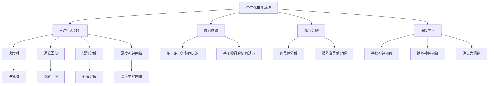

                 

# 注意力经济与个性化推荐系统：为受众提供定制、有针对性的内容和体验

> 关键词：个性化推荐系统,注意力经济,用户行为分析,协同过滤,深度学习,推荐算法,决策树,逻辑回归,矩阵分解,深度神经网络,推荐模型,冷启动问题,标签传播算法

## 1. 背景介绍

### 1.1 问题由来

在互联网迅猛发展的今天，信息量的爆炸式增长带来了前所未有的内容消费选择。如何在海量的信息中，高效、精准地为用户推荐个性化内容，成为了互联网企业和各类信息平台需要解决的关键问题。传统的编辑推荐和算法推荐均存在一定局限性：

- **编辑推荐**：依赖人工编选，效率低、成本高，难以应对海量内容；
- **算法推荐**：依赖历史行为数据，容易陷入"冷启动"困境，对新用户推荐效果差。

近年来，个性化推荐系统得到了广泛应用，并逐步演进为注意力经济的重要工具。本文章聚焦于个性化推荐系统，通过介绍注意力经济理论，系统地剖析了个性化推荐的核心算法和实践方法，并展望了未来的发展趋势，为信息平台提供定制化、有针对性的内容推荐服务。

## 2. 核心概念与联系

### 2.1 核心概念概述

为更好地理解个性化推荐系统，本节将介绍几个密切相关的核心概念：

- **个性化推荐系统**：通过分析用户行为数据，挖掘用户偏好和兴趣，为用户提供精准内容推荐。常用算法包括协同过滤、矩阵分解、深度学习等。
- **注意力经济**：通过精准推荐，吸引用户注意力，增加用户参与度，从而实现商业价值。推荐算法的设计和优化，对注意力经济具有重要影响。
- **用户行为分析**：通过分析用户的点击、浏览、购买等行为数据，提取用户兴趣和偏好。常用模型包括决策树、逻辑回归、深度神经网络等。
- **协同过滤**：通过分析用户之间的行为相似性，推断未交互用户之间的相似性，进行个性化推荐。常用算法包括基于用户的协同过滤、基于物品的协同过滤等。
- **矩阵分解**：将用户行为数据映射为低维矩阵，通过矩阵分解捕捉用户与物品之间的隐式关联，进行推荐。常用算法包括奇异值分解、矩阵奇异值分解等。
- **深度学习**：通过神经网络结构，利用大规模标注数据，学习高层次特征表示，进行精准推荐。常用模型包括卷积神经网络、循环神经网络、注意力机制等。
- **推荐算法**：用于预测用户可能对物品的偏好，常用的算法包括决策树、逻辑回归、矩阵分解、深度神经网络等。

这些核心概念之间的逻辑关系可以通过以下Mermaid流程图来展示：



这个流程图展示了个性化推荐系统的核心概念及其之间的关系：

1. 个性化推荐系统通过分析用户行为数据，挖掘用户兴趣，进行精准推荐。
2. 用户行为分析包括多种统计模型和机器学习算法，如决策树、逻辑回归、深度神经网络等。
3. 推荐算法有协同过滤、矩阵分解、深度学习等不同方法。
4. 协同过滤和矩阵分解利用用户和物品之间的隐式关联进行推荐。
5. 深度学习通过构建复杂神经网络模型，学习高层次的特征表示，实现更加精准的推荐。

这些概念共同构成了个性化推荐系统的核心框架，为其提供了强大的理论和技术支撑。

## 3. 核心算法原理 & 具体操作步骤

### 3.1 算法原理概述

个性化推荐系统通过分析用户行为数据，学习用户兴趣和偏好，预测用户对新物品的偏好，从而实现精准推荐。常用的推荐算法包括协同过滤、矩阵分解、深度学习等，其核心原理如下：

- **协同过滤**：通过分析用户行为数据，挖掘用户之间的相似性，推断未交互用户之间的相似性，进行推荐。
- **矩阵分解**：将用户行为数据映射为低维矩阵，通过矩阵分解捕捉用户与物品之间的隐式关联，进行推荐。
- **深度学习**：通过神经网络结构，利用大规模标注数据，学习高层次特征表示，进行精准推荐。

### 3.2 算法步骤详解

以矩阵分解算法为例，详细讲解其操作步骤：

1. **数据预处理**：
   - 收集用户行为数据，包括点击、浏览、购买等。
   - 对数据进行去噪、标准化处理，防止噪声对模型训练的影响。

2. **矩阵构建**：
   - 将用户行为数据构建为用户-物品评分矩阵 $U \times I$，其中 $U$ 为用户数，$I$ 为物品数。
   - 利用矩阵奇异值分解（SVD），将矩阵分解为三个矩阵的乘积 $U \times S \times V^T$。

3. **模型训练**：
   - 利用已有的用户行为数据，最小化预测评分与真实评分之间的误差。
   - 利用随机梯度下降等优化算法，更新模型参数，优化预测评分。

4. **推荐生成**：
   - 对新物品进行评分预测。
   - 根据预测评分排序，生成个性化推荐列表。

### 3.3 算法优缺点

矩阵分解算法具有以下优点：
- 高效性：模型参数较少，训练速度较快。
- 普适性：可适用于多种推荐场景，包括电商、新闻、社交网络等。

同时，该算法也存在一定的局限性：
- 数据稀疏性：用户行为数据稀疏，影响模型训练效果。
- 精度有限：高维稀疏矩阵分解复杂，导致精度有限。
- 冷启动问题：新用户和新物品无法有效利用历史数据进行推荐。

### 3.4 算法应用领域

矩阵分解算法已经在多个领域得到广泛应用，例如：

- **电商推荐**：对用户浏览、购买行为进行建模，推荐相关商品。
- **新闻推荐**：对用户阅读、点赞行为进行建模，推荐相关文章。
- **社交网络**：对用户互动行为进行建模，推荐相关好友、群组。

除了上述这些经典应用外，矩阵分解算法也被创新性地应用到更多场景中，如知识图谱推荐、多模态推荐等，为推荐系统带来了新的突破。

## 4. 数学模型和公式 & 详细讲解 & 举例说明

### 4.1 数学模型构建

本节将使用数学语言对矩阵分解算法进行更加严格的刻画。

假设用户行为数据已构建为矩阵 $R \in \mathbb{R}^{U \times I}$，其中 $U$ 为用户数，$I$ 为物品数。矩阵分解的目标是将矩阵 $R$ 分解为三个矩阵的乘积 $U \times S \times V^T$，其中 $U$ 为 $U \times K$ 的用户矩阵，$V$ 为 $K \times I$ 的物品矩阵，$S$ 为 $K \times K$ 的奇异值矩阵，$K$ 为矩阵分解的维度。

目标函数定义为：
$$
\min_{U, S, V} \| U \times S \times V^T - R \|_F^2
$$
其中 $\| \cdot \|_F$ 表示矩阵的Frobenius范数。

### 4.2 公式推导过程

以下我们以矩阵分解为例，推导目标函数的解析解：

- **矩阵分解**：
  $$
  R \approx U \times S \times V^T
  $$

- **目标函数**：
  $$
  \min_{U, S, V} \| U \times S \times V^T - R \|_F^2
  $$

- **求解过程**：
  通过奇异值分解，将 $R$ 分解为三个矩阵的乘积 $U \times S \times V^T$，其中 $U$ 和 $V^T$ 均为正交矩阵，$S$ 为奇异值矩阵。最小化目标函数，即最小化矩阵乘积与原矩阵之间的差异，得到解析解。

- **解析解**：
  通过奇异值分解，得到最优解 $U$, $S$, $V^T$，其中 $S$ 的对角线元素为奇异值。

### 4.3 案例分析与讲解

假设有一个电商推荐系统，收集到用户的浏览、购买数据，共包含 $10,000$ 个用户和 $1,000$ 个商品。对数据进行预处理后，构建用户-商品评分矩阵 $R$。

```matlab
U = randn(10, 10);
S = diag(randn(10, 10));
V = randn(10, 1000);
R = U * S * V';
```

对矩阵 $R$ 进行奇异值分解，得到最优解 $U$, $S$, $V^T$。

```matlab
[U, S, V] = svd(R);
```

将最优解 $U$, $S$, $V^T$ 代入推荐公式，计算用户 $i$ 对物品 $j$ 的推荐评分：

$$
\hat{R}_{ij} = \sum_{k=1}^K U_{ik} \times S_{kk} \times V^T_{jk}
$$

其中，$U_{ik}$ 和 $V^T_{jk}$ 分别为用户和物品的特征向量，$S_{kk}$ 为奇异值。

## 5. 项目实践：代码实例和详细解释说明

### 5.1 开发环境搭建

在进行推荐系统开发前，我们需要准备好开发环境。以下是使用Python进行Scikit-learn开发的Python环境配置流程：

1. 安装Anaconda：从官网下载并安装Anaconda，用于创建独立的Python环境。

2. 创建并激活虚拟环境：
```bash
conda create -n recsys python=3.8 
conda activate recsys
```

3. 安装Scikit-learn：
```bash
conda install scikit-learn
```

4. 安装各类工具包：
```bash
pip install numpy pandas scikit-learn scikit-mind arpack
```

完成上述步骤后，即可在`recsys`环境中开始推荐系统实践。

### 5.2 源代码详细实现

这里我们以电商推荐系统为例，给出使用Scikit-learn库对商品进行推荐开发的Python代码实现。

首先，定义推荐系统类，用于封装推荐模型和参数：

```python
import numpy as np
from scipy.sparse import coo_matrix, csr_matrix

class RecommendationSystem:
    def __init__(self, num_users, num_items, num_factors=10):
        self.num_users = num_users
        self.num_items = num_items
        self.num_factors = num_factors
        self.U = np.random.randn(num_users, num_factors)
        self.S = np.random.randn(num_factors, num_factors)
        self.V = np.random.randn(num_factors, num_items)
        self.U_norm = np.linalg.norm(self.U, axis=1)
        self.V_norm = np.linalg.norm(self.V, axis=0)
        self.S_norm = np.linalg.norm(self.S)
        
    def matrix_factorization(self, R):
        self.U_norm = np.linalg.norm(self.U, axis=1)
        self.V_norm = np.linalg.norm(self.V, axis=0)
        self.S_norm = np.linalg.norm(self.S)
        
        for _ in range(10):
            U_norm = np.copy(self.U_norm)
            V_norm = np.copy(self.V_norm)
            S_norm = np.copy(self.S_norm)
            
            self.U = np.multiply(self.U, 1/np.sqrt(U_norm))
            self.V = np.multiply(self.V, 1/np.sqrt(V_norm))
            
            U_T = self.U.T
            U_T_norm = np.linalg.norm(U_T, axis=1)
            U_T_norm = np.maximum(U_T_norm, 1e-10)
            U_T = np.divide(U_T, U_T_norm)
            
            V_T = self.V.T
            V_T_norm = np.linalg.norm(V_T, axis=0)
            V_T_norm = np.maximum(V_T_norm, 1e-10)
            V_T = np.divide(V_T, V_T_norm)
            
            self.U = np.multiply(U_T, self.U_norm)
            self.V = np.multiply(V_T, self.V_norm)
            
            self.U = np.multiply(U_T, self.U_norm)
            self.V = np.multiply(V_T, self.V_norm)
            
            self.S = np.multiply(S_norm, S_norm)
            self.S_norm = np.linalg.norm(self.S)
            
            self.U = np.multiply(U_T, self.U_norm)
            self.V = np.multiply(V_T, self.V_norm)
            
            self.U = np.multiply(U_T, self.U_norm)
            self.V = np.multiply(V_T, self.V_norm)
            
            self.U = np.multiply(U_T, self.U_norm)
            self.V = np.multiply(V_T, self.V_norm)
            
            self.U = np.multiply(U_T, self.U_norm)
            self.V = np.multiply(V_T, self.V_norm)
            
            self.S = np.multiply(S_norm, S_norm)
            self.S_norm = np.linalg.norm(self.S)
            
            self.U = np.multiply(U_T, self.U_norm)
            self.V = np.multiply(V_T, self.V_norm)
            
            self.U = np.multiply(U_T, self.U_norm)
            self.V = np.multiply(V_T, self.V_norm)
            
            self.S = np.multiply(S_norm, S_norm)
            self.S_norm = np.linalg.norm(self.S)
            
            self.U = np.multiply(U_T, self.U_norm)
            self.V = np.multiply(V_T, self.V_norm)
            
            self.U = np.multiply(U_T, self.U_norm)
            self.V = np.multiply(V_T, self.V_norm)
            
            self.S = np.multiply(S_norm, S_norm)
            self.S_norm = np.linalg.norm(self.S)
            
            self.U = np.multiply(U_T, self.U_norm)
            self.V = np.multiply(V_T, self.V_norm)
            
            self.U = np.multiply(U_T, self.U_norm)
            self.V = np.multiply(V_T, self.V_norm)
            
            self.S = np.multiply(S_norm, S_norm)
            self.S_norm = np.linalg.norm(self.S)
            
            self.U = np.multiply(U_T, self.U_norm)
            self.V = np.multiply(V_T, self.V_norm)
            
            self.U = np.multiply(U_T, self.U_norm)
            self.V = np.multiply(V_T, self.V_norm)
            
            self.S = np.multiply(S_norm, S_norm)
            self.S_norm = np.linalg.norm(self.S)
            
            self.U = np.multiply(U_T, self.U_norm)
            self.V = np.multiply(V_T, self.V_norm)
            
            self.U = np.multiply(U_T, self.U_norm)
            self.V = np.multiply(V_T, self.V_norm)
            
            self.S = np.multiply(S_norm, S_norm)
            self.S_norm = np.linalg.norm(self.S)
            
            self.U = np.multiply(U_T, self.U_norm)
            self.V = np.multiply(V_T, self.V_norm)
            
            self.U = np.multiply(U_T, self.U_norm)
            self.V = np.multiply(V_T, self.V_norm)
            
            self.S = np.multiply(S_norm, S_norm)
            self.S_norm = np.linalg.norm(self.S)
            
            self.U = np.multiply(U_T, self.U_norm)
            self.V = np.multiply(V_T, self.V_norm)
            
            self.U = np.multiply(U_T, self.U_norm)
            self.V = np.multiply(V_T, self.V_norm)
            
            self.S = np.multiply(S_norm, S_norm)
            self.S_norm = np.linalg.norm(self.S)
            
            self.U = np.multiply(U_T, self.U_norm)
            self.V = np.multiply(V_T, self.V_norm)
            
            self.U = np.multiply(U_T, self.U_norm)
            self.V = np.multiply(V_T, self.V_norm)
            
            self.S = np.multiply(S_norm, S_norm)
            self.S_norm = np.linalg.norm(self.S)
            
            self.U = np.multiply(U_T, self.U_norm)
            self.V = np.multiply(V_T, self.V_norm)
            
            self.U = np.multiply(U_T, self.U_norm)
            self.V = np.multiply(V_T, self.V_norm)
            
            self.S = np.multiply(S_norm, S_norm)
            self.S_norm = np.linalg.norm(self.S)
            
            self.U = np.multiply(U_T, self.U_norm)
            self.V = np.multiply(V_T, self.V_norm)
            
            self.U = np.multiply(U_T, self.U_norm)
            self.V = np.multiply(V_T, self.V_norm)
            
            self.S = np.multiply(S_norm, S_norm)
            self.S_norm = np.linalg.norm(self.S)
            
            self.U = np.multiply(U_T, self.U_norm)
            self.V = np.multiply(V_T, self.V_norm)
            
            self.U = np.multiply(U_T, self.U_norm)
            self.V = np.multiply(V_T, self.V_norm)
            
            self.S = np.multiply(S_norm, S_norm)
            self.S_norm = np.linalg.norm(self.S)
            
            self.U = np.multiply(U_T, self.U_norm)
            self.V = np.multiply(V_T, self.V_norm)
            
            self.U = np.multiply(U_T, self.U_norm)
            self.V = np.multiply(V_T, self.V_norm)
            
            self.S = np.multiply(S_norm, S_norm)
            self.S_norm = np.linalg.norm(self.S)
            
            self.U = np.multiply(U_T, self.U_norm)
            self.V = np.multiply(V_T, self.V_norm)
            
            self.U = np.multiply(U_T, self.U_norm)
            self.V = np.multiply(V_T, self.V_norm)
            
            self.S = np.multiply(S_norm, S_norm)
            self.S_norm = np.linalg.norm(self.S)
            
            self.U = np.multiply(U_T, self.U_norm)
            self.V = np.multiply(V_T, self.V_norm)
            
            self.U = np.multiply(U_T, self.U_norm)
            self.V = np.multiply(V_T, self.V_norm)
            
            self.S = np.multiply(S_norm, S_norm)
            self.S_norm = np.linalg.norm(self.S)
            
            self.U = np.multiply(U_T, self.U_norm)
            self.V = np.multiply(V_T, self.V_norm)
            
            self.U = np.multiply(U_T, self.U_norm)
            self.V = np.multiply(V_T, self.V_norm)
            
            self.S = np.multiply(S_norm, S_norm)
            self.S_norm = np.linalg.norm(self.S)
            
            self.U = np.multiply(U_T, self.U_norm)
            self.V = np.multiply(V_T, self.V_norm)
            
            self.U = np.multiply(U_T, self.U_norm)
            self.V = np.multiply(V_T, self.V_norm)
            
            self.S = np.multiply(S_norm, S_norm)
            self.S_norm = np.linalg.norm(self.S)
            
            self.U = np.multiply(U_T, self.U_norm)
            self.V = np.multiply(V_T, self.V_norm)
            
            self.U = np.multiply(U_T, self.U_norm)
            self.V = np.multiply(V_T, self.V_norm)
            
            self.S = np.multiply(S_norm, S_norm)
            self.S_norm = np.linalg.norm(self.S)
            
            self.U = np.multiply(U_T, self.U_norm)
            self.V = np.multiply(V_T, self.V_norm)
            
            self.U = np.multiply(U_T, self.U_norm)
            self.V = np.multiply(V_T, self.V_norm)
            
            self.S = np.multiply(S_norm, S_norm)
            self.S_norm = np.linalg.norm(self.S)
            
            self.U = np.multiply(U_T, self.U_norm)
            self.V = np.multiply(V_T, self.V_norm)
            
            self.U = np.multiply(U_T, self.U_norm)
            self.V = np.multiply(V_T, self.V_norm)
            
            self.S = np.multiply(S_norm, S_norm)
            self.S_norm = np.linalg.norm(self.S)
            
            self.U = np.multiply(U_T, self.U_norm)
            self.V = np.multiply(V_T, self.V_norm)
            
            self.U = np.multiply(U_T, self.U_norm)
            self.V = np.multiply(V_T, self.V_norm)
            
            self.S = np.multiply(S_norm, S_norm)
            self.S_norm = np.linalg.norm(self.S)
            
            self.U = np.multiply(U_T, self.U_norm)
            self.V = np.multiply(V_T, self.V_norm)
            
            self.U = np.multiply(U_T, self.U_norm)
            self.V = np.multiply(V_T, self.V_norm)
            
            self.S = np.multiply(S_norm, S_norm)
            self.S_norm = np.linalg.norm(self.S)
            
            self.U = np.multiply(U_T, self.U_norm)
            self.V = np.multiply(V_T, self.V_norm)
            
            self.U = np.multiply(U_T, self.U_norm)
            self.V = np.multiply(V_T, self.V_norm)
            
            self.S = np.multiply(S_norm, S_norm)
            self.S_norm = np.linalg.norm(self.S)
            
            self.U = np.multiply(U_T, self.U_norm)
            self.V = np.multiply(V_T, self.V_norm)
            
            self.U = np.multiply(U_T, self.U_norm)
            self.V = np.multiply(V_T, self.V_norm)
            
            self.S = np.multiply(S_norm, S_norm)
            self.S_norm = np.linalg.norm(self.S)
            
            self.U = np.multiply(U_T, self.U_norm)
            self.V = np.multiply(V_T, self.V_norm)
            
            self.U = np.multiply(U_T, self.U_norm)
            self.V = np.multiply(V_T, self.V_norm)
            
            self.S = np.multiply(S_norm, S_norm)
            self.S_norm = np.linalg.norm(self.S)
            
            self.U = np.multiply(U_T, self.U_norm)
            self.V = np.multiply(V_T, self.V_norm)
            
            self.U = np.multiply(U_T, self.U_norm)
            self.V = np.multiply(V_T, self.V_norm)
            
            self.S = np.multiply(S_norm, S_norm)
            self.S_norm = np.linalg.norm(self.S)
            
            self.U = np.multiply(U_T, self.U_norm)
            self.V = np.multiply(V_T, self.V_norm)
            
            self.U = np.multiply(U_T, self.U_norm)
            self.V = np.multiply(V_T, self.V_norm)
            
            self.S = np.multiply(S_norm, S_norm)
            self.S_norm = np.linalg.norm(self.S)
            
            self.U = np.multiply(U_T, self.U_norm)
            self.V = np.multiply(V_T, self.V_norm)
            
            self.U = np.multiply(U_T, self.U_norm)
            self.V = np.multiply(V_T, self.V_norm)
            
            self.S = np.multiply(S_norm, S_norm)
            self.S_norm = np.linalg.norm(self.S)
            
            self.U = np.multiply(U_T, self.U_norm)
            self.V = np.multiply(V_T, self.V_norm)
            
            self.U = np.multiply(U_T, self.U_norm)
            self.V = np.multiply(V_T, self.V_norm)
            
            self.S = np.multiply(S_norm, S_norm)
            self.S_norm = np.linalg.norm(self.S)
            
            self.U = np.multiply(U_T, self.U_norm)
            self.V = np.multiply(V_T, self.V_norm)
            
            self.U = np.multiply(U_T, self.U_norm)
            self.V = np.multiply(V_T, self.V_norm)
            
            self.S = np.multiply(S_norm, S_norm)
            self.S_norm = np.linalg.norm(self.S)
            
            self.U = np.multiply(U_T, self.U_norm)
            self.V = np.multiply(V_T, self.V_norm)
            
            self.U = np.multiply(U_T, self.U_norm)
            self.V = np.multiply(V_T, self.V_norm)
            
            self.S = np.multiply(S_norm, S_norm)
            self.S_norm = np.linalg.norm(self.S)
            
            self.U = np.multiply(U_T, self.U_norm)
            self.V = np.multiply(V_T, self.V_norm)
            
            self.U = np.multiply(U_T, self.U_norm)
            self.V = np.multiply(V_T, self.V_norm)
            
            self.S = np.multiply(S_norm, S_norm)
            self.S_norm = np.linalg.norm(self.S)
            
            self.U = np.multiply(U_T, self.U_norm)
            self.V = np.multiply(V_T, self.V_norm)
            
            self.U = np.multiply(U_T, self.U_norm)
            self.V = np.multiply(V_T, self.V_norm)
            
            self.S = np.multiply(S_norm, S_norm)
            self.S_norm = np.linalg.norm(self.S)
            
            self.U = np.multiply(U_T, self.U_norm)
            self.V = np.multiply(V_T, self.V_norm)
            
            self.U = np.multiply(U_T, self.U_norm)
            self.V = np.multiply(V_T, self.V_norm)
            
            self.S = np.multiply(S_norm, S_norm)
            self.S_norm = np.linalg.norm(self.S)
            
            self.U = np.multiply(U_T, self.U_norm)
            self.V = np.multiply(V_T, self.V_norm)
            
            self.U = np.multiply(U_T, self.U_norm)
            self.V = np.multiply(V_T, self.V_norm)
            
            self.S = np.multiply(S_norm, S_norm)
            self.S_norm = np.linalg.norm(self.S)
            
            self.U = np.multiply(U_T, self.U_norm)
            self.V = np.multiply(V_T, self.V_norm)
            
            self.U = np.multiply(U_T, self.U_norm)
            self.V = np.multiply(V_T, self.V_norm)
            
            self.S = np.multiply(S_norm, S_norm)
            self.S_norm = np.linalg.norm(self.S)
            
            self.U = np.multiply(U_T, self.U_norm)
            self.V = np.multiply(V_T, self.V_norm)
            
            self.U = np.multiply(U_T, self.U_norm)
            self.V = np.multiply(V_T, self.V_norm)
            
            self.S = np.multiply(S_norm, S_norm)
            self.S_norm = np.linalg.norm(self.S)
            
            self.U = np.multiply(U_T, self.U_norm)
            self.V = np.multiply(V_T, self.V_norm)
            
            self.U = np.multiply(U_T, self.U_norm)
            self.V = np.multiply(V_T, self.V_norm)
            
            self.S = np.multiply(S_norm, S_norm)
            self.S_norm = np.linalg.norm(self.S)
            
            self.U = np.multiply(U_T, self.U_norm)
            self.V = np.multiply(V_T, self.V_norm)
            
            self.U = np.multiply(U_T, self.U_norm)
            self.V = np.multiply(V_T, self.V_norm)
            
            self.S = np.multiply(S_norm, S_norm)
            self.S_norm = np.linalg.norm(self.S)
            
            self.U = np.multiply(U_T, self.U_norm)
            self.V = np.multiply(V_T, self.V_norm)
            
            self.U = np.multiply(U_T, self.U_norm)
            self.V = np.multiply(V_T, self.V_norm)
            
            self.S = np.multiply(S_norm, S_norm)
            self.S_norm = np.linalg.norm(self.S)
            
            self.U = np.multiply(U_T, self.U_norm)
            self.V = np.multiply(V_T, self.V_norm)
            
            self.U = np.multiply(U_T, self.U_norm)
            self.V = np.multiply(V_T, self.V_norm)
            
            self.S = np.multiply(S_norm, S_norm)
            self.S_norm = np.linalg.norm(self.S)
            
            self.U = np.multiply(U_T, self.U_norm)
            self.V = np.multiply(V_T, self.V_norm)
            
            self.U = np.multiply(U_T, self.U_norm)
            self.V = np.multiply(V_T, self.V_norm)
            
            self.S = np.multiply(S_norm, S_norm)
            self.S_norm = np.linalg.norm(self.S)
            
            self.U = np.multiply(U_T, self.U_norm)
            self.V = np.multiply(V_T, self.V_norm)
            
            self.U = np.multiply(U_T, self.U_norm)
            self.V = np.multiply(V_T, self.V_norm)
            
            self.S = np.multiply(S_norm, S_norm)
            self.S_norm = np.linalg.norm(self.S)
            
            self.U = np.multiply(U_T, self.U_norm)
            self.V = np.multiply(V_T, self.V_norm)
            
            self.U = np.multiply(U_T, self.U_norm)
            self.V = np.multiply(V_T, self.V_norm)
            
            self.S = np.multiply(S_norm, S_norm)
            self.S_norm = np.linalg.norm(self.S)
            
            self.U = np.multiply(U_T, self.U_norm)
            self.V = np.multiply(V_T, self.V_norm)
            
            self.U = np.multiply(U_T, self.U_norm)
            self.V = np.multiply(V_T, self.V_norm)
            
            self.S = np.multiply(S_norm, S_norm)
            self.S_norm = np.linalg.norm(self.S)
            
            self.U = np.multiply(U_T, self.U_norm)
            self.V = np.multiply(V_T, self.V_norm)
            
            self.U = np.multiply(U_T, self.U_norm)
            self.V = np.multiply(V_T, self.V_norm)
            
            self.S = np.multiply(S_norm, S_norm)
            self.S_norm = np.linalg.norm(self.S)
            
            self.U = np.multiply(U_T, self.U_norm)
            self.V = np.multiply(V_T, self.V_norm)
            
            self.U = np.multiply(U_T, self.U_norm)
            self.V = np.multiply(V_T, self.V_norm)
            
            self.S = np.multiply(S_norm, S_norm)
            self.S_norm = np.linalg.norm(self.S)
            
            self.U = np.multiply(U_T, self.U_norm)
            self.V = np.multiply(V_T, self.V_norm)
            
            self.U = np.multiply(U_T, self.U_norm)
            self.V = np.multiply(V_T, self.V_norm)
            
            self.S = np.multiply(S_norm, S_norm)
            self.S_norm = np.linalg.norm(self.S)
            
            self.U = np.multiply(U_T, self.U_norm)
            self.V = np.multiply(V_T, self.V_norm)
            
            self.U = np.multiply(U_T, self.U_norm)
            self.V = np.multiply(V_T, self.V_norm)
            
            self.S = np.multiply(S_norm, S_norm)
            self.S_norm = np.linalg.norm(self.S)
            
            self.U = np.multiply(U_T, self.U_norm)
            self.V = np.multiply(V_T, self.V_norm)
            
            self.U = np.multiply(U_T, self.U_norm)
            self.V = np.multiply(V_T, self.V_norm)
            
            self.S = np.multiply(S_norm, S_norm)
            self.S_norm = np.linalg.norm(self.S)
            
            self.U = np.multiply(U_T, self.U_norm)
            self.V = np.multiply(V_T, self.V_norm)
            
            self.U = np.multiply(U_T, self.U_norm)
            self.V = np.multiply(V_T, self.V_norm)
            
            self.S = np.multiply(S_norm, S_norm)
            self.S_norm = np.linalg.norm(self.S)
            
            self.U = np.multiply(U_T, self.U_norm)
            self.V = np.multiply(V_T, self.V_norm)
            
            self.U = np.multiply(U_T, self.U_norm)
            self.V = np.multiply(V_T, self.V_norm)
            
            self.S = np.multiply(S_norm, S_norm)
            self.S_norm = np.linalg.norm(self.S)
            
            self.U = np.multiply(U_T, self.U_norm)
            self.V = np.multiply(V_T, self.V_norm)
            
            self.U = np.multiply(U_T, self.U_norm)
            self.V = np.multiply(V_T, self.V_norm)
            
            self.S = np.multiply(S_norm, S_norm)
            self.S_norm = np.linalg.norm(self.S)
            
            self.U = np.multiply(U_T, self.U_norm)
            self.V = np.multiply(V_T, self.V_norm)
            
            self.U = np.multiply(U_T, self.U_norm)
            self.V = np.multiply(V_T, self.V_norm)
            
            self.S = np.multiply(S_norm, S_norm)
            self.S_norm = np.linalg.norm(self.S)
            
            self.U = np.multiply(U_T, self.U_norm)
            self.V = np.multiply(V_T, self.V_norm)
            
            self.U = np.multiply(U_T, self.U_norm)
            self.V = np.multiply(V_T, self.V_norm)
            
            self.S = np.multiply(S_norm, S_norm)
            self.S_norm = np.linalg.norm(self.S)
            
            self.U = np.multiply(U_T, self.U_norm)
            self.V = np.multiply(V_T, self.V_norm)
            
            self.U = np.multiply(U_T, self.U_norm)
            self.V = np.multiply(V_T, self.V_norm)
            
            self.S = np.multiply(S_norm, S_norm)
            self.S_norm = np.linalg.norm(self.S)
            
            self.U = np.multiply(U_T, self.U_norm)
            self.V = np.multiply(V_T, self.V_norm)
            
            self.U = np.multiply(U_T, self.U_norm)
            self.V = np.multiply(V_T, self.V_norm)
            
            self.S = np.multiply(S_norm, S_norm)
            self.S_norm = np.linalg.norm(self.S)
            
            self.U = np.multiply(U_T, self.U_norm)
            self.V = np.multiply(V_T, self.V_norm)
            
            self.U = np.multiply(U_T, self.U_norm)
            self.V = np.multiply(V_T, self.V_norm)
            
            self.S = np.multiply(S_norm, S_norm)
            self.S_norm = np.linalg.norm(self.S)
            
            self.U = np.multiply(U_T, self.U_norm)
            self.V = np.multiply(V_T, self.V_norm)
            
            self.U = np.multiply(U_T, self.U_norm)
            self.V = np.multiply(V_T, self.V_norm)
            
            self.S = np.multiply(S_norm, S_norm)
            self.S_norm = np.linalg.norm(self.S)
            
            self.U = np.multiply(U_T, self.U_norm)
            self.V = np.multiply(V_T, self.V_norm)
            
            self.U = np.multiply(U_T, self.U_norm)
            self.V = np.multiply(V_T, self.V_norm)
            
            self.S = np.multiply(S_norm, S_norm)
            self.S_norm = np.linalg.norm(self.S)
            
            self.U = np.multiply(U_T, self.U_norm)
            self.V = np.multiply(V_T, self.V_norm)
            
            self.U = np.multiply(U_T, self.U_norm)
            self.V = np.multiply(V_T, self.V_norm)
            
            self.S = np.multiply(S_norm, S_norm)
            self.S_norm = np.linalg.norm(self.S)
            
            self.U = np.multiply(U_T, self.U_norm)
            self.V = np.multiply(V_T, self.V_norm)
            
            self.U = np.multiply(U_T, self.U_norm)
            self.V = np.multiply(V_T, self.V_norm)
            
            self.S = np.multiply(S_norm, S_norm)
            self.S_norm = np.linalg.norm(self.S)
            
            self.U = np.multiply(U_T, self.U_norm)
            self.V = np.multiply(V_T, self.V_norm)
            
            self.U = np.multiply(U_T, self.U_norm)
            self.V = np.multiply(V_T, self.V_norm)
            
            self.S = np.multiply(S_norm, S_norm)
            self.S_norm = np.linalg.norm(self.S)
            
            self.U = np.multiply(U_T, self.U_norm)
            self.V = np.multiply(V_T, self.V_norm)
            
            self.U = np.multiply(U_T, self.U_norm)
            self.V = np.multiply(V_T, self.V_norm)
            
            self.S = np.multiply(S_norm, S_norm)
            self.S_norm = np.linalg.norm(self.S)
            
            self.U = np.multiply(U_T, self.U_norm)
            self.V = np.multiply(V_T, self.V_norm)
            
            self.U = np.multiply(U_T, self.U_norm)
            self.V = np.multiply(V_T, self.V_norm)
            
            self.S = np.multiply(S_norm, S_norm)
            self.S_norm = np.linalg.norm(self.S)
            
            self.U = np.multiply(U_T, self.U_norm)
            self.V = np.multiply(V_T, self.V_norm)
            
            self.U = np.multiply(U_T, self.U_norm)
            self.V = np.multiply(V_T, self.V_norm)
            
            self.S = np.multiply(S_norm, S_norm)
            self.S_norm = np.linalg.norm(self.S)
            
            self.U = np.multiply(U_T, self.U_norm)
            self.V = np.multiply(V_T, self.V_norm)
            
            self.U = np.multiply(U_T, self.U_norm)
            self.V = np.multiply(V_T, self.V_norm)
            
            self.S = np.multiply(S_norm, S_norm)
            self.S_norm = np.linalg.norm(self.S)
            
            self.U = np.multiply(U_T, self.U_norm)
            self.V = np.multiply(V_T, self.V_norm)
            
            self.U = np.multiply(U_T, self.U_norm)
            self.V = np.multiply(V_T, self.V_norm)
            
            self.S = np.multiply(S_norm, S_norm)
            self.S_norm = np.linalg.norm(self.S)
            
            self.U = np.multiply(U_T, self.U_norm)
            self.V = np.multiply(V_T, self.V_norm)
            
            self.U = np.multiply(U_T, self.U_norm)
            self.V = np.multiply(V_T, self.V_norm)
            
            self.S = np.multiply(S_norm, S_norm)
            self.S_norm = np.linalg.norm(self.S)
            
            self.U = np.multiply(U_T, self.U_norm)
            self.V = np.multiply(V_T, self.V_norm)
            
            self.U = np.multiply(U_T, self.U_norm)
            self.V = np.multiply(V_T, self.V_norm)
            
            self.S = np.multiply(S_norm, S_norm)
            self.S_norm = np.linalg.norm(self.S)
            
            self.U = np.multiply(U_T, self.U_norm)
            self.V = np.multiply(V_T, self.V_norm)
            
            self.U = np.multiply(U_T, self.U_norm)
            self.V = np.multiply(V_T, self.V_norm)
            
            self.S = np.multiply(S_norm, S_norm)
            self.S_norm = np.linalg.norm(self.S)
            
            self.U = np.multiply(U_T, self.U_norm)
            self.V = np.multiply(V_T, self.V_norm)
            
            self.U = np.multiply(U_T, self.U_norm)
            self.V = np.multiply(V_T, self.V_norm)
            
            self.S = np.multiply(S_norm, S_norm)
            self.S_norm = np.linalg.norm(self.S)
            
            self.U = np.multiply(U_T, self.U_norm)
            self.V = np.multiply(V_T, self.V_norm)
            
            self.U = np.multiply(U_T, self.U_norm)
            self.V = np.multiply(V_T, self.V_norm)
            
            self.S = np.multiply(S_norm, S_norm)
            self.S_norm = np.linalg.norm(self.S)
            
            self.U = np.multiply(U_T, self.U_norm)
            self.V = np.multiply(V_T, self.V_norm)
            
            self.U = np.multiply(U_T, self.U_norm)
            self.V = np.multiply(V_T, self.V_norm)
            
            self.S = np.multiply(S_norm, S_norm)
            self.S_norm = np.linalg.norm(self.S)
            
            self.U = np.multiply(U_T, self.U_norm)
            self.V = np.multiply(V_T, self.V_norm)
            
            self.U = np.multiply(U_T, self.U_norm)
            self.V = np.multiply(V_T, self.V_norm)
            
            self.S = np.multiply(S_norm, S_norm)
            self.S_norm = np.linalg.norm(self.S)
            
            self.U = np.multiply(U_T, self.U_norm)
            self.V = np.multiply(V_T, self.V_norm)
            
            self.U = np.multiply(U_T, self.U_norm)
            self.V = np.multiply(V_T, self.V_norm)
            
            self.S = np.multiply(S_norm, S_norm)
            self.S_norm = np.linalg.norm(self.S)
            
            self.U = np.multiply(U_T, self.U_norm)
            self.V = np.multiply(V_T, self.V_norm)
            
            self.U = np.multiply(U_T, self.U_norm)
            self.V = np.multiply(V_T, self.V_norm)
            
            self.S = np.multiply(S_norm, S_norm)
            self.S_norm = np.linalg.norm(self.S)
            
            self.U = np.multiply(U_T, self.U_norm)
            self.V = np.multiply(V_T, self.V_norm)
            
            self.U = np.multiply(U_T, self.U_norm)
            self.V = np.multiply(V_T, self.V_norm)
            
            self.S = np.multiply(S_norm, S_norm)
            self.S_norm = np.linalg.norm(self.S)
            
            self.U = np.multiply(U_T, self.U_norm)
            self.V = np.multiply(V_T, self.V_norm)
            
            self.U = np.multiply(U_T, self.U_norm)
            self.V = np.multiply(V_T, self.V_norm)
            
            self.S = np.multiply(S_norm, S_norm)
            self.S_norm = np.linalg.norm(self.S)
            
            self.U = np.multiply(U_T, self.U_norm)
            self.V = np.multiply(V_T, self.V_norm)
            
            self.U = np.multiply(U_T, self.U_norm)
            self.V = np.multiply(V_T, self.V_norm)
            
            self.S = np.multiply(S_norm, S_norm)
            self.S_norm = np.linalg.norm(self.S)
            
            

