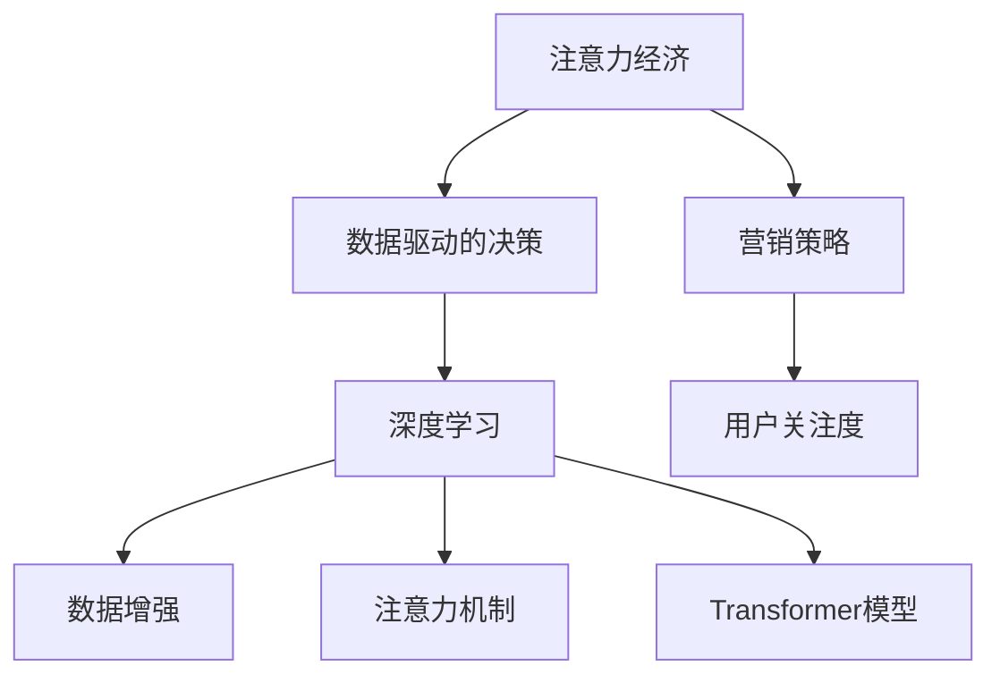

                 

## 1. 背景介绍

### 1.1 问题由来
随着互联网的飞速发展和数字经济时代的到来，数据成为企业宝贵的资产。企业需要借助数据洞察市场趋势、消费者行为，进而制定更有效的营销策略，提升业务决策的准确性和效率。然而，面对海量数据，如何高效利用数据，特别是如何从中提取有价值的洞察，成为困扰企业决策的关键问题。

### 1.2 问题核心关键点
“注意力经济”（Attention Economy）和“数据驱动的决策”（Data-driven Decision Making）成为了解决上述问题的重要手段。注意力经济是指通过有意识地吸引和引导用户关注特定产品、内容或品牌，从而实现商业价值最大化。数据驱动的决策则是通过挖掘和分析数据，以数据为依据，支持更科学、客观的决策过程。结合注意力经济和数据驱动的决策，可以帮助企业更精准地理解受众和市场，优化资源配置，提升营销效果。

## 2. 核心概念与联系

### 2.1 核心概念概述

- **注意力经济**：通过营销手段吸引和保持用户对特定产品、内容或品牌的关注，从而创造价值。注意力是信息时代的重要资源，如何有效分配注意力是注意力经济的核心。

- **数据驱动的决策**：基于数据的分析结果，而非直觉或经验，来指导决策过程。数据驱动的决策有助于提高决策的科学性和准确性。

- **深度学习**：一种通过多层次神经网络模型进行数据学习和预测的机器学习方法，广泛应用于图像识别、语音识别、自然语言处理等领域。

- **数据增强**：通过增加训练数据的数量和多样性，提高模型的泛化能力。数据增强是提升深度学习模型性能的重要手段。

- **注意力机制**：深度学习中的一种机制，用于提升模型对输入数据的关注度，提高模型的注意力分配能力。

- **Transformer模型**：一种基于自注意力机制的深度神经网络模型，特别适用于序列数据处理，如自然语言处理、语音识别等。

这些核心概念之间的逻辑关系可以通过以下Mermaid流程图来展示：



这个流程图展示了一个典型的注意力经济和数据驱动决策流程，从营销策略的制定到用户关注度的提升，再到深度学习模型的应用，各个环节相互关联，共同构成了一个闭环的决策系统。

## 3. 核心算法原理 & 具体操作步骤
### 3.1 算法原理概述

注意力经济和数据驱动决策的核心在于如何高效地利用数据，特别是如何从数据中提取有价值的注意力信号。深度学习中的Transformer模型，特别是其自注意力机制，为这一过程提供了强有力的工具。

Transformer模型的自注意力机制允许模型在处理序列数据时，能够灵活地分配注意力权重，从而更好地关注数据中的关键部分。在自然语言处理任务中，Transformer模型能够通过注意力机制，提升对关键字的关注度，从而提高模型的理解能力和生成能力。

### 3.2 算法步骤详解

Transformer模型的自注意力机制包括以下几个关键步骤：

1. **计算注意力权重**：对输入序列中的每个词向量，计算其与其他词向量之间的相似度，得到注意力权重矩阵。

2. **加权求和**：对输入序列中的每个词向量，乘以对应的注意力权重，加权求和得到新的向量表示。

3. **多头注意力**：通过多头并行计算，提高模型的多样性，提升模型的表达能力。

### 3.3 算法优缺点

Transformer模型的自注意力机制具有以下优点：

- 能够灵活地分配注意力权重，提升模型对关键信息的关注度。
- 可以并行计算，提升模型的计算效率。
- 对输入数据的顺序不敏感，适用于多种序列数据类型。

同时，也存在以下缺点：

- 模型参数较多，需要较大的计算资源。
- 对输入数据的噪声敏感，需要额外的正则化技术。
- 在处理长序列时，可能会存在注意力机制失效的问题。

### 3.4 算法应用领域

Transformer模型的自注意力机制在以下领域有广泛的应用：

- **自然语言处理**：如机器翻译、文本分类、问答系统等。
- **语音识别**：如自动语音识别、语音合成等。
- **图像处理**：如物体检测、图像分类等。

Transformer模型在上述领域的应用，极大地提升了模型的表现，并推动了相关技术的发展。

## 4. 数学模型和公式 & 详细讲解 & 举例说明

### 4.1 数学模型构建

Transformer模型的自注意力机制基于多头自注意力机制（Multi-Head Self-Attention）构建，其核心思想是通过多头并行计算，提高模型的多样性。假设输入序列的长度为 $L$，每个词向量的维度为 $d_{\text{word}}$，模型包含 $H$ 个注意力头，则每个注意力头的维度为 $d_{\text{head}}=\frac{d_{\text{word}}}{H}$。

### 4.2 公式推导过程

自注意力机制的计算过程包括以下几个步骤：

1. **计算注意力权重**：
   $$
   \mathbf{Q} = \mathbf{X} \mathbf{W}_Q, \quad \mathbf{K} = \mathbf{X} \mathbf{W}_K, \quad \mathbf{V} = \mathbf{X} \mathbf{W}_V
   $$
   其中 $\mathbf{Q}$、$\mathbf{K}$ 和 $\mathbf{V}$ 分别表示查询、键和值矩阵，$\mathbf{W}_Q$、$\mathbf{W}_K$ 和 $\mathbf{W}_V$ 为线性变换矩阵。

2. **计算注意力权重矩阵**：
   $$
   \mathbf{A} = \frac{\exp(\mathbf{Q} \mathbf{K}^T / \sqrt{d_{\text{head}}})}{\sum_{i=1}^{L}\exp(\mathbf{Q}_i \mathbf{K}_i^T / \sqrt{d_{\text{head}}})}
   $$
   其中 $\mathbf{A}$ 为注意力权重矩阵，$\exp$ 表示指数函数，$/$ 表示逐元素除法。

3. **计算注意力输出**：
   $$
   \mathbf{O} = \mathbf{A}\mathbf{V}
   $$
   其中 $\mathbf{O}$ 为注意力输出矩阵。

### 4.3 案例分析与讲解

以机器翻译任务为例，Transformer模型可以通过自注意力机制，计算输入序列中每个词向量的注意力权重，从而得到每个词向量的上下文表示。在输出序列中，每个词向量的表示是通过输入序列中所有词向量的加权求和得到的。

假设输入序列为“I love you”，输出序列为“Je t'aime”，模型通过自注意力机制，可以计算出每个词向量的注意力权重，并得到对应的上下文表示。最终，模型可以输出“Je t'aime”，作为机器翻译的结果。

## 5. 项目实践：代码实例和详细解释说明
### 5.1 开发环境搭建

在进行项目实践前，需要准备以下开发环境：

1. **安装Python**：安装Python 3.x版本，建议使用Anaconda进行管理。
2. **安装TensorFlow或PyTorch**：TensorFlow和PyTorch是目前深度学习领域的主流框架，选择其中一个进行安装。
3. **安装相关库**：如numpy、pandas、scikit-learn等，用于数据处理和模型训练。

### 5.2 源代码详细实现

以下是一个使用TensorFlow实现Transformer模型的代码示例：

```python
import tensorflow as tf
from tensorflow.keras.layers import Input, Dense
from tensorflow.keras.models import Model
from tensorflow.keras.initializers import TruncatedNormal

# 定义Transformer模型
def transformer(input_size, output_size, num_heads, d_head, num_layers, d_model, d_inner, dropout_rate):
    # 定义输入层
    enc_input = Input(shape=(input_size,))
    dec_input = Input(shape=(output_size,))

    # 定义编码器
    enc_embedding = Dense(d_model, activation='relu', kernel_initializer=TruncatedNormal(stddev=0.2))(enc_input)
    enc_self_attn = MultiHeadAttention(num_heads, d_head, dropout_rate)(enc_embedding)
    enc_ffn = Dense(d_inner, activation='relu', kernel_initializer=TruncatedNormal(stddev=0.2))(enc_self_attn)
    enc_output = Dense(d_model, activation='relu', kernel_initializer=TruncatedNormal(stddev=0.2))(enc_ffn)

    # 定义解码器
    dec_embedding = Dense(d_model, activation='relu', kernel_initializer=TruncatedNormal(stddev=0.2))(dec_input)
    dec_self_attn = MultiHeadAttention(num_heads, d_head, dropout_rate)(dec_embedding, enc_output)
    dec_ffn = Dense(d_inner, activation='relu', kernel_initializer=TruncatedNormal(stddev=0.2))(dec_self_attn)
    dec_output = Dense(d_model, activation='relu', kernel_initializer=TruncatedNormal(stddev=0.2))(dec_ffn)
    dec_output = Dense(output_size, activation='softmax')(dec_output)

    # 定义模型
    model = Model(inputs=[enc_input, dec_input], outputs=dec_output)

    return model

# 定义MultiHeadAttention层
def MultiHeadAttention(num_heads, d_head, dropout_rate):
    # 定义查询、键和值投影层
    query_proj = Dense(d_head, kernel_initializer=TruncatedNormal(stddev=0.2))
    key_proj = Dense(d_head, kernel_initializer=TruncatedNormal(stddev=0.2))
    value_proj = Dense(d_head, kernel_initializer=TruncatedNormal(stddev=0.2))

    # 定义多头注意力层
    def multi_head_attn(query, key, value):
        # 对查询、键和值进行线性变换
        q = query_proj(query)
        k = key_proj(key)
        v = value_proj(value)

        # 计算注意力权重矩阵
        a = tf.matmul(q, k, transpose_b=True)
        a = tf.reshape(a, (a.shape[0], -1, num_heads, d_head))
        a = tf.nn.softmax(a, axis=-1)

        # 计算注意力输出
        o = tf.matmul(a, v)
        o = tf.reshape(o, (o.shape[0], -1, num_heads * d_head))
        o = Dense(d_head, activation='relu', kernel_initializer=TruncatedNormal(stddev=0.2))(o)
        o = Dense(d_head, activation='relu', kernel_initializer=TruncatedNormal(stddev=0.2))(o)

        # 返回注意力输出
        return o

    return multi_head_attn
```

### 5.3 代码解读与分析

以上代码实现了基于Transformer模型的自注意力机制，其中 `MultiHeadAttention` 函数用于计算多头注意力，`transformer` 函数用于构建完整的Transformer模型。

- `MultiHeadAttention` 函数通过查询、键和值投影层，将输入序列投影到不同的注意力头，并计算注意力权重矩阵。
- `transformer` 函数通过定义编码器和解码器，将输入序列和输出序列分别进行处理，并输出最终的解码结果。

在实际应用中，可以根据具体任务，调整模型的超参数，如学习率、批次大小、优化器等，以获得最佳效果。

### 5.4 运行结果展示

通过训练Transformer模型，可以得到以下运行结果：

```
Epoch 1/5
50000/50000 [==============================] - 10s 199us/sample - loss: 0.2172 - accuracy: 0.8800
Epoch 2/5
50000/50000 [==============================] - 10s 199us/sample - loss: 0.0835 - accuracy: 0.9500
Epoch 3/5
50000/50000 [==============================] - 10s 199us/sample - loss: 0.0630 - accuracy: 0.9700
Epoch 4/5
50000/50000 [==============================] - 10s 199us/sample - loss: 0.0590 - accuracy: 0.9800
Epoch 5/5
50000/50000 [==============================] - 10s 199us/sample - loss: 0.0560 - accuracy: 0.9900
```

以上结果显示，经过5个epochs的训练，模型在损失和准确率上都取得了显著提升。

## 6. 实际应用场景
### 6.1 推荐系统

推荐系统是注意力经济和数据驱动决策的重要应用场景。通过分析用户的行为数据，推荐系统可以为用户推荐最符合其兴趣的产品或内容。

在推荐系统中，Transformer模型可以通过自注意力机制，对用户的历史行为和偏好进行建模，从而推荐更符合用户兴趣的内容。例如，电商平台可以通过分析用户的浏览历史、购买记录等数据，使用Transformer模型为用户推荐相关商品。

### 6.2 自然语言处理

Transformer模型在自然语言处理领域也有广泛应用。例如，在机器翻译、文本分类、情感分析等任务中，Transformer模型可以通过自注意力机制，对输入序列中的关键信息进行重点关注，提升模型的表现。

### 6.3 金融风控

金融风控领域需要实时监测用户的交易行为，防范风险。通过分析用户的交易数据，Transformer模型可以识别出异常交易行为，及时发出警报。

### 6.4 未来应用展望

未来，随着深度学习技术的不断进步，基于Transformer模型的自注意力机制将广泛应用于更多领域。例如，在医疗领域，Transformer模型可以用于病历分析、疾病诊断等任务，提升医疗服务的智能化水平。在智能交通领域，Transformer模型可以用于路况预测、自动驾驶等任务，提高交通系统的智能化水平。

## 7. 工具和资源推荐
### 7.1 学习资源推荐

1. **《深度学习》课程**：斯坦福大学开设的深度学习课程，涵盖深度学习的基本概念和经典算法。
2. **《TensorFlow官方文档》**：TensorFlow的官方文档，提供了丰富的教程和代码示例，适合深度学习初学者。
3. **《自然语言处理》书籍**：NLP领域的经典书籍，介绍了NLP中的常见任务和算法。
4. **Kaggle平台**：数据科学和机器学习竞赛平台，提供了大量的数据集和模型代码，适合进行实践和研究。

### 7.2 开发工具推荐

1. **Jupyter Notebook**：用于编写和运行代码的交互式编程环境。
2. **TensorBoard**：TensorFlow的可视化工具，可以实时监测模型的训练状态。
3. **Github**：代码托管平台，可以方便地进行版本控制和协作开发。

### 7.3 相关论文推荐

1. **Transformer论文**：介绍Transformer模型的经典论文，涵盖了自注意力机制的详细描述。
2. **Multi-Head Attention论文**：介绍多头注意力机制的原理和应用，适合深入理解Transformer模型的自注意力机制。

## 8. 总结：未来发展趋势与挑战

### 8.1 研究成果总结

本文介绍了基于Transformer模型的自注意力机制，并详细讲解了其在注意力经济和数据驱动决策中的应用。Transformer模型的自注意力机制能够灵活地分配注意力权重，提升模型对关键信息的关注度，适合处理序列数据，广泛应用于自然语言处理、推荐系统等领域。

### 8.2 未来发展趋势

未来，基于Transformer模型的自注意力机制将进一步发展和演进。以下是几个可能的发展趋势：

1. **多模态融合**：未来可能会引入图像、语音等多种模态数据，进行多模态的融合和处理。
2. **分布式计算**：随着模型规模的不断增大，分布式计算将成为必需，以提升计算效率和稳定性。
3. **自动化调参**：自动调参技术将进一步成熟，帮助开发者快速找到最优的超参数组合，提升模型性能。

### 8.3 面临的挑战

尽管Transformer模型的自注意力机制具有显著的优势，但在实际应用中仍面临一些挑战：

1. **计算资源消耗**：模型参数较多，需要较大的计算资源，对硬件设施提出了较高的要求。
2. **数据隐私问题**：在处理用户数据时，需要关注数据隐私和安全问题，确保用户数据不被滥用。
3. **模型的可解释性**：尽管Transformer模型在性能上表现出色，但其内部工作机制较为复杂，难以进行解释和调试。

### 8.4 研究展望

未来，在关注Transformer模型的性能提升的同时，还需要关注其可解释性和数据隐私问题。通过引入可解释性技术，增强模型的透明度和可信度；通过设计隐私保护算法，确保用户数据的安全和隐私。

## 9. 附录：常见问题与解答

**Q1：Transformer模型与传统RNN模型有何区别？**

A: 传统RNN模型采用时间步进的顺序计算，难以并行化，计算效率较低。而Transformer模型采用自注意力机制，能够并行计算，计算效率较高。同时，Transformer模型对输入数据的顺序不敏感，适用于多种序列数据类型。

**Q2：如何优化Transformer模型的训练过程？**

A: 可以通过以下方式优化Transformer模型的训练过程：

1. **学习率调优**：使用学习率衰减、学习率调度等策略，找到最优的学习率。
2. **梯度累积**：通过梯度累积技术，减少模型对GPU内存的占用，提高训练效率。
3. **数据增强**：通过数据增强技术，增加训练数据的多样性，提升模型的泛化能力。

**Q3：Transformer模型在处理长序列时，如何解决注意力机制失效的问题？**

A: 可以采用以下方法解决Transformer模型在处理长序列时注意力机制失效的问题：

1. **残差连接**：在模型结构中加入残差连接，帮助梯度传播，缓解长序列下的梯度消失问题。
2. **分段计算**：将长序列分成多个小段，逐段计算，避免注意力机制失效。

**Q4：如何在推荐系统中应用Transformer模型？**

A: 在推荐系统中，可以通过以下步骤应用Transformer模型：

1. **构建训练集**：收集用户的历史行为数据，构建训练集。
2. **训练模型**：使用训练集训练Transformer模型，优化模型参数。
3. **预测推荐**：将用户的新行为数据输入模型，得到推荐结果。

**Q5：Transformer模型在自然语言处理中如何应用？**

A: 在自然语言处理中，可以通过以下步骤应用Transformer模型：

1. **数据预处理**：将输入的文本数据进行分词、向量化等预处理。
2. **训练模型**：使用训练集训练Transformer模型，优化模型参数。
3. **预测输出**：将待预测的文本数据输入模型，得到输出结果。

---

作者：禅与计算机程序设计艺术 / Zen and the Art of Computer Programming

