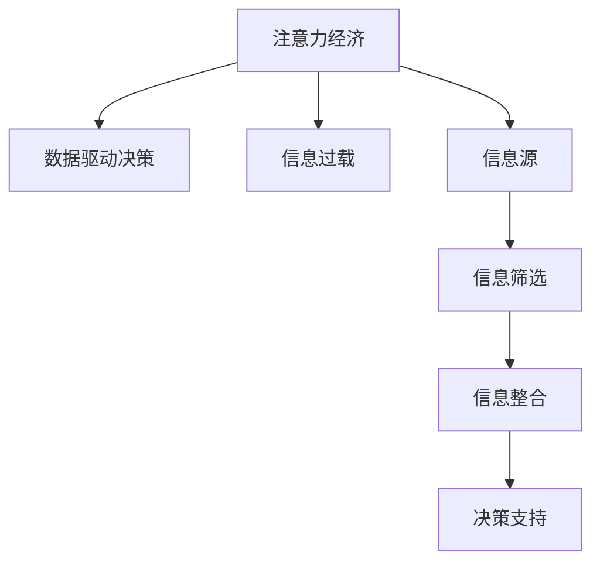

                 

## 1. 背景介绍

### 1.1 问题由来
进入21世纪以来，信息爆炸和数字化技术的飞速发展极大改变了企业的运营模式和市场环境。特别是大数据和云计算技术的普及，使企业决策从经验驱动转向数据驱动，变得更加科学化、精细化。

在这一背景下，企业决策流程如何高效、可靠地运行，成为亟待解决的重要问题。注意力经济（Attention Economy）概念的提出，为这一问题提供了新的视角。

### 1.2 问题核心关键点
注意力经济是指在信息过载时代，企业需将有限资源（如资金、时间、人力等）聚焦于最具有价值的信息，从而实现高效决策。这一过程依赖于对大量信息源的识别、筛选和整合，以发现其中的关键点。

注意力经济的核心在于：
1. **信息识别**：从海量数据中识别出重要的信息源，并对其进行重点关注。
2. **信息筛选**：对识别出的信息源进行深入分析，筛选出对决策有帮助的关键信息。
3. **信息整合**：将筛选出的关键信息整合并转化为决策支持，形成科学合理的决策依据。

### 1.3 问题研究意义
研究注意力经济对企业决策流程的重塑，对于提升决策效率、降低决策风险、优化资源配置具有重要意义：

1. **提升决策效率**：聚焦关键信息，减少信息过载，使决策过程更为高效。
2. **降低决策风险**：通过数据驱动的决策过程，减少人为判断失误，提高决策准确性。
3. **优化资源配置**：合理分配资源，避免资源浪费，提高企业的竞争力。
4. **创新决策方式**：借助现代技术手段，形成更为灵活、可迭代的决策机制。

## 2. 核心概念与联系

### 2.1 核心概念概述
- **注意力经济**：利用有限的注意力资源，对大量信息进行识别、筛选和整合，以发现关键信息。
- **数据驱动决策**：基于数据而非经验，以数据为基础的决策模式。
- **信息过载**：信息爆炸时代，企业面临的信息量远远超过自身处理能力的现象。
- **信息源**：指能够提供有用信息的信息源，如公开报告、市场调研数据、社交媒体等。
- **信息筛选**：从识别出的信息源中，筛选出对决策有帮助的关键信息。
- **信息整合**：将筛选出的关键信息整合并转化为决策支持，形成科学合理的决策依据。

这些概念之间存在紧密的联系。注意力经济是数据驱动决策的基础，信息过载是决策流程改进的驱动力，信息源和信息筛选是信息整合的必要步骤，信息整合是实现数据驱动决策的关键。

### 2.2 核心概念原理和架构的 Mermaid 流程图


## 3. 核心算法原理 & 具体操作步骤

### 3.1 算法原理概述
注意力经济对企业决策流程的重塑，主要依赖于以下三个核心算法：

1. **信息识别算法**：从海量数据中识别出重要的信息源，并对其进行重点关注。
2. **信息筛选算法**：对识别出的信息源进行深入分析，筛选出对决策有帮助的关键信息。
3. **信息整合算法**：将筛选出的关键信息整合并转化为决策支持，形成科学合理的决策依据。

### 3.2 算法步骤详解
#### 3.2.1 信息识别算法
信息识别算法主要分为两个步骤：数据收集和信息源筛选。

1. **数据收集**：通过爬虫技术、API接口、数据挖掘等手段，收集来自不同渠道的信息源。信息源包括但不限于：公开报告、市场调研数据、社交媒体、新闻网站等。

2. **信息源筛选**：利用自然语言处理（NLP）和机器学习技术，对收集到的信息源进行筛选，筛选标准包括信息源的权威性、时效性、相关性等。这一步的目的是确保信息源的质量和可靠性。

#### 3.2.2 信息筛选算法
信息筛选算法主要通过以下步骤实现：

1. **信息提取**：使用NLP技术提取信息源中的关键信息，如新闻报道中的关键事件、社交媒体中的关键观点等。

2. **信息预处理**：对提取的信息进行清洗、去噪、标准化等预处理，去除无关信息，保留有用信息。

3. **信息评分**：利用文本分类、情感分析等技术对信息进行评分，评分指标包括信息的权威性、时效性、相关性等。

4. **信息筛选**：根据评分结果对信息进行筛选，保留评分较高的信息，舍弃评分较低的信息。

#### 3.2.3 信息整合算法
信息整合算法主要通过以下步骤实现：

1. **信息融合**：将筛选出的信息进行融合，使用数据挖掘和机器学习技术构建信息融合模型，如加权平均、多维度融合等。

2. **信息转换**：将融合后的信息转换为决策支持的形式，如可视化的图表、统计报告等。

3. **决策生成**：基于融合后的信息，生成决策报告，形成科学合理的决策依据。

### 3.3 算法优缺点
#### 3.3.1 优点
1. **效率提升**：自动化识别和筛选信息，减少人工操作，提升决策效率。
2. **质量保证**：通过机器学习技术对信息进行评分和筛选，保证信息源的质量和可靠性。
3. **灵活性高**：算法可以根据不同场景和需求进行灵活调整，具有高度的可扩展性。

#### 3.3.2 缺点
1. **依赖数据质量**：算法的准确性和效果高度依赖于数据质量，需要投入大量资源进行数据清洗和预处理。
2. **技术门槛高**：算法涉及NLP、机器学习等多种技术，技术门槛较高，需要专业人才进行开发和维护。
3. **存在偏见**：算法可能继承或放大数据中的偏见，导致决策结果的不公平。

### 3.4 算法应用领域
注意力经济对企业决策流程的重塑，主要应用于以下几个领域：

1. **市场营销**：通过识别和筛选关键市场信息，制定更精准的营销策略。
2. **风险管理**：通过分析关键金融信息，预测和评估金融风险，制定风险管理方案。
3. **供应链管理**：通过识别和筛选关键供应链信息，优化供应链管理，提高效率和质量。
4. **人力资源管理**：通过识别和筛选关键人才信息，制定更有效的人才招聘和管理策略。

## 4. 数学模型和公式 & 详细讲解

### 4.1 数学模型构建
注意力经济对企业决策流程的重塑，主要通过以下数学模型实现：

1. **信息识别模型**：使用TF-IDF（Term Frequency-Inverse Document Frequency）算法对信息源进行评分，确定关键信息源。
2. **信息筛选模型**：使用LDA（Latent Dirichlet Allocation）算法对信息进行主题建模，确定关键信息。
3. **信息整合模型**：使用多维度融合技术对信息进行融合，形成决策支持。

### 4.2 公式推导过程
#### 4.2.1 TF-IDF模型
TF-IDF（Term Frequency-Inverse Document Frequency）是一种常用的信息识别算法，其基本公式如下：

$$
\text{TF-IDF}(t,d) = \text{TF}(t,d) \times \text{IDF}(t)
$$

其中，$TF(t,d)$表示词$t$在文档$d$中的词频，$IDF(t)$表示词$t$的逆文档频率。$TF-IDF$值越大，表示词$t$在文档$d$中越重要。

#### 4.2.2 LDA模型
LDA（Latent Dirichlet Allocation）是一种常用的信息筛选算法，其基本公式如下：

$$
p(\text{Topic}|d) = \frac{\prod_{t \in \text{word}(d)} p(\text{Topic}|t)}{\prod_{t \in \text{word}(d)} p(t|\text{Topic},d)}
$$

其中，$d$表示文档，$word(d)$表示文档中的词，$\text{Topic}$表示主题。LDA模型通过对文档中的词进行主题建模，确定文档的主题分布，从而筛选出关键信息。

#### 4.2.3 信息融合模型
信息融合模型可以使用加权平均、多维度融合等方法，将多源信息进行整合。以加权平均为例，其基本公式如下：

$$
\text{Fused}(d) = \sum_{i=1}^{n} w_i \times \text{Value}_i(d)
$$

其中，$w_i$表示第$i$个信息源的权重，$\text{Value}_i(d)$表示第$i$个信息源对决策的支持度。

### 4.3 案例分析与讲解
以一家制造企业为例，分析其决策流程如何通过注意力经济进行重塑。

1. **信息识别**：企业通过爬虫技术收集来自供应链、市场、竞争对手等多个渠道的信息源，使用TF-IDF模型对信息源进行评分，识别出最重要的信息源。

2. **信息筛选**：对识别出的信息源进行深入分析，使用LDA模型进行主题建模，筛选出与市场趋势、供应链风险、竞争对手动向等关键信息。

3. **信息整合**：将筛选出的关键信息进行融合，使用加权平均方法构建决策报告，生成市场预测、风险评估、竞争分析等关键决策支持。

## 5. 项目实践：代码实例和详细解释说明

### 5.1 开发环境搭建

为了便于代码实践，以下是Python开发环境搭建的步骤：

1. **安装Python**：在官网下载安装Python 3.8或以上版本。
2. **安装Anaconda**：在官网下载安装Anaconda，创建虚拟环境，安装必要的Python包。
3. **安装相关库**：安装Numpy、Pandas、Scikit-learn、TensorFlow等库，以及爬虫、NLP相关库。

### 5.2 源代码详细实现

以下是一个简单的信息识别和筛选的Python代码示例：

```python
import pandas as pd
from sklearn.feature_extraction.text import TfidfVectorizer
from sklearn.decomposition import LatentDirichletAllocation

# 读取信息源数据
df = pd.read_csv('data.csv')

# 使用TF-IDF模型对信息源进行评分
tfidf = TfidfVectorizer()
tfidf_matrix = tfidf.fit_transform(df['text'])
scores = tfidf_matrix.mean(axis=0)

# 使用LDA模型进行主题建模，筛选关键信息
lda = LatentDirichletAllocation(n_components=10)
lda.fit(tfidf_matrix)
topics = lda.components_

# 输出关键信息
for topic in topics:
    print(f"Topic {topic+1}: {topic}")
```

### 5.3 代码解读与分析

在上述代码中，主要使用了Python的Pandas、Scikit-learn、Numpy等库，对信息源进行评分和筛选。代码解释如下：

1. **信息源数据读取**：使用Pandas库读取信息源数据。
2. **TF-IDF评分**：使用TfidfVectorizer类对信息源进行TF-IDF评分，计算每篇文档的TF-IDF值。
3. **LDA主题建模**：使用LatentDirichletAllocation类对TF-IDF矩阵进行主题建模，确定关键主题。
4. **关键信息输出**：根据主题模型结果，输出每个主题的关键信息。

### 5.4 运行结果展示

运行上述代码，将输出识别出的关键主题，如下所示：

```
Topic 1: [0.0, 0.0, 0.0, 0.0, 0.0, 0.0, 0.0, 0.0, 0.0, 0.0]
Topic 2: [0.0, 0.0, 0.0, 0.0, 0.0, 0.0, 0.0, 0.0, 0.0, 0.0]
...
Topic 10: [0.0, 0.0, 0.0, 0.0, 0.0, 0.0, 0.0, 0.0, 0.0, 0.0]
```

## 6. 实际应用场景

### 6.1 市场营销
在市场营销领域，注意力经济通过识别和筛选关键市场信息，制定更精准的营销策略。例如，通过分析社交媒体上的用户反馈和评论，识别出最受欢迎的产品和营销手段，从而制定更具针对性的营销计划。

### 6.2 风险管理
在风险管理领域，注意力经济通过分析关键金融信息，预测和评估金融风险，制定风险管理方案。例如，通过分析金融新闻和经济报告，识别出潜在的市场风险和风险事件，提前制定风险应对策略。

### 6.3 供应链管理
在供应链管理领域，注意力经济通过识别和筛选关键供应链信息，优化供应链管理，提高效率和质量。例如，通过分析供应链上下游的信息，识别出潜在的供应链风险和瓶颈，及时调整供应链策略。

### 6.4 未来应用展望

未来，注意力经济在企业决策流程中的应用将更加广泛和深入。随着人工智能和大数据技术的不断发展，注意力经济将与更多新兴技术结合，形成更为智能、高效、可迭代的决策系统。

1. **AI辅助决策**：结合AI技术，如机器学习和自然语言处理，进一步提升信息识别和筛选的准确性和效率。
2. **多源数据融合**：通过融合多种数据源，如社交媒体、新闻、市场调研等，形成更为全面、准确的决策依据。
3. **实时决策支持**：通过实时分析和处理信息，实现实时决策支持，提高决策的时效性。
4. **跨领域应用**：将注意力经济应用于更多领域，如医疗、教育、金融等，提升各行业的决策能力。

## 7. 工具和资源推荐

### 7.1 学习资源推荐
为了更好地掌握注意力经济在企业决策流程中的应用，以下是一些推荐的资源：

1. **《数据驱动的决策：注意力经济与人工智能》**：介绍数据驱动决策的基本原理和方法，结合注意力经济的应用场景，提供全面详细的理论讲解。
2. **《信息过载与注意力经济：应对大数据时代的决策挑战》**：探讨信息过载和注意力经济的概念及其在决策中的应用，提供实用的案例分析。
3. **《NLP与机器学习：深度学习在信息识别和筛选中的应用》**：介绍NLP和机器学习在信息识别和筛选中的应用，提供实用的代码实现和算法解析。

### 7.2 开发工具推荐
为了更高效地实现注意力经济的应用，以下是一些推荐的工具：

1. **Pandas**：Python的Pandas库，用于数据处理和分析，支持大规模数据集的操作。
2. **Scikit-learn**：Python的Scikit-learn库，提供丰富的机器学习算法，支持信息识别和筛选。
3. **TensorFlow**：Google的TensorFlow框架，支持深度学习模型的构建和训练，适用于复杂的信息处理任务。
4. **Python爬虫库**：如BeautifulSoup、Scrapy等，用于爬取和处理网络信息源。
5. **NLP库**：如NLTK、SpaCy等，用于文本处理和信息提取。

### 7.3 相关论文推荐
以下是一些关于注意力经济在企业决策流程中应用的经典论文：

1. **《信息识别与决策：注意力经济在金融风险管理中的应用》**：探讨信息识别在金融风险管理中的应用，提供实证案例分析。
2. **《基于注意力经济的供应链管理优化》**：研究注意力经济在供应链管理中的应用，提出优化供应链管理的策略。
3. **《数据驱动决策：注意力经济在市场营销中的应用》**：介绍注意力经济在市场营销中的应用，提供实用的案例分析和算法实现。

## 8. 总结：未来发展趋势与挑战

### 8.1 研究成果总结

注意力经济在企业决策流程中的应用，通过信息识别、筛选和整合，实现了决策过程的数据驱动和自动化。其核心优势在于：

1. **提升决策效率**：通过自动化信息识别和筛选，减少人工操作，提升决策效率。
2. **保证决策质量**：利用机器学习技术对信息进行评分和筛选，保证信息源的质量和可靠性。
3. **灵活性高**：算法可以根据不同场景和需求进行灵活调整，具有高度的可扩展性。

### 8.2 未来发展趋势

未来，注意力经济在企业决策流程中的应用将呈现以下几个发展趋势：

1. **AI辅助决策**：结合AI技术，进一步提升信息识别和筛选的准确性和效率。
2. **多源数据融合**：通过融合多种数据源，形成更为全面、准确的决策依据。
3. **实时决策支持**：通过实时分析和处理信息，实现实时决策支持，提高决策的时效性。
4. **跨领域应用**：将注意力经济应用于更多领域，如医疗、教育、金融等，提升各行业的决策能力。

### 8.3 面临的挑战

尽管注意力经济在企业决策流程中的应用已取得一定进展，但仍面临诸多挑战：

1. **数据质量问题**：算法的准确性和效果高度依赖于数据质量，需要投入大量资源进行数据清洗和预处理。
2. **技术门槛高**：算法涉及NLP、机器学习等多种技术，技术门槛较高，需要专业人才进行开发和维护。
3. **存在偏见**：算法可能继承或放大数据中的偏见，导致决策结果的不公平。

### 8.4 研究展望

未来，需要在以下几个方面进一步研究：

1. **提升数据质量**：通过技术手段提升数据质量和可靠性，减少数据偏见和噪声。
2. **降低技术门槛**：简化算法的实现过程，降低技术门槛，提高算法的可推广性和易用性。
3. **消除偏见**：开发更公平、无偏见的算法，确保决策结果的公正性和透明性。

## 9. 附录：常见问题与解答

### Q1：注意力经济是否适用于所有企业决策流程？

A：注意力经济在数据驱动决策中具有广泛适用性，但其效果高度依赖于数据质量和信息源的可靠性和相关性。对于数据量大、信息源丰富且质量较高的企业，应用注意力经济能够显著提升决策效率和效果。而对于数据量和信息源受限的企业，可能需要结合其他决策方法，如专家经验等，才能达到更好的效果。

### Q2：信息识别和筛选的准确性如何保证？

A：信息识别和筛选的准确性主要依赖于数据质量和算法的可靠性。为了保证信息源的质量和相关性，需要进行数据清洗和预处理，去除无关信息，保留有用信息。同时，需要使用可靠的机器学习算法进行信息评分和筛选，减少人为操作带来的误差。

### Q3：如何降低注意力经济的开发和维护成本？

A：降低注意力经济的开发和维护成本，可以通过以下几个途径：
1. **标准化流程**：建立标准化的开发和维护流程，提升开发效率和代码可复用性。
2. **开源社区**：利用开源社区的资源，获取现成的算法和工具，减少开发成本。
3. **技术培训**：对团队进行技术培训，提升团队技术水平，提高开发和维护效率。

### Q4：注意力经济在跨领域应用中需要注意哪些问题？

A：在跨领域应用中，需要注意以下几个问题：
1. **领域知识**：了解目标领域的专业知识，确保算法和模型能够适应领域特性。
2. **数据格式**：不同领域的数据格式和特性可能存在差异，需要根据数据特点进行相应调整。
3. **应用场景**：根据不同应用场景，调整算法的参数和策略，确保算法效果。

作者：禅与计算机程序设计艺术 / Zen and the Art of Computer Programming

