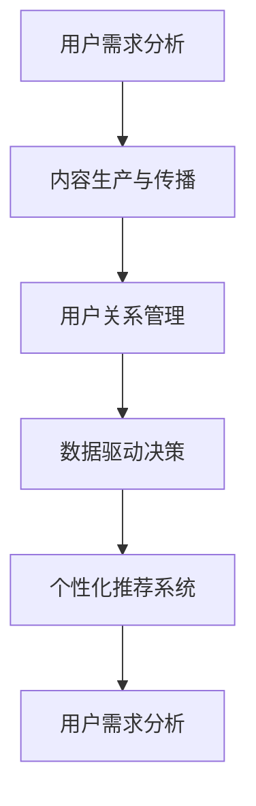

                 

# 注意力经济对企业组织结构的影响

在数字化时代，注意力成为一种稀缺资源，企业的运营模式逐渐向注意力经济转型。文章将深入探讨注意力经济对企业组织结构的影响，包括其核心概念、实施步骤、具体应用，以及未来趋势和面临的挑战。

## 1. 背景介绍

### 1.1 问题由来

随着互联网的普及和社交媒体的兴起，用户注意力开始成为一种经济资源。企业为了获得用户关注和购买，需要投入大量的营销和广告费用。这种依赖注意力获取收益的经济模式，被称作“注意力经济”。

注意力经济对企业组织结构提出了新的要求。传统的基于产品的企业结构，开始向基于注意力的组织模式转型。

### 1.2 问题核心关键点

注意力经济的核心在于如何吸引、维持和转化用户的注意力。其关键点在于：

- 用户需求分析：了解用户需求和兴趣点，定制化内容吸引用户。
- 内容生产与传播：高效生产有价值的内容，并有效传播至目标受众。
- 用户关系管理：建立长期稳定的用户关系，增强用户粘性。
- 数据驱动决策：利用数据分析，优化广告投放和营销策略。
- 个性化推荐系统：精准推荐用户感兴趣的内容，提高转化率。

### 1.3 问题研究意义

研究注意力经济对企业组织结构的影响，对于理解数字化转型中的企业发展模式，优化营销策略，提升企业竞争力具有重要意义。

## 2. 核心概念与联系

### 2.1 核心概念概述

- **注意力经济（Attention Economy）**：以用户注意力为经济资源，通过提供有价值的内容吸引用户，从而获取收益的经济模式。
- **注意力驱动的组织结构（Attention-Driven Organization Structure）**：以用户关注度为核心的企业组织结构，强调内容生产和传播，以及用户关系管理。
- **数据驱动决策（Data-Driven Decision Making）**：利用数据分析指导业务决策，优化营销策略和广告投放。
- **个性化推荐系统（Personalized Recommendation System）**：基于用户行为数据，推荐符合用户兴趣的内容，提升转化率。

这些概念之间通过数据和用户行为相联系，形成一个闭环。用户注意力驱动企业内容生产和传播，同时数据反馈指导优化决策和推荐系统，形成一个完整的注意力经济闭环。

### 2.2 核心概念原理和架构的 Mermaid 流程图



## 3. 核心算法原理 & 具体操作步骤

### 3.1 算法原理概述

注意力经济的核心在于如何吸引和维持用户的注意力。其基本原理包括：

- 用户行为建模：通过分析用户在线行为，构建用户兴趣模型，理解用户需求。
- 内容推荐算法：基于用户模型，推荐符合用户兴趣的内容。
- 广告投放策略：利用数据驱动的决策，优化广告投放渠道和时机。

### 3.2 算法步骤详解

1. **用户行为分析**：
    - 收集用户点击、浏览、购买等行为数据。
    - 利用聚类、分类等算法分析用户兴趣和行为模式。

2. **内容生产与传播**：
    - 基于用户兴趣模型，生成相关内容。
    - 利用SEO优化和社交媒体传播，扩大内容覆盖面。

3. **用户关系管理**：
    - 建立用户数据库，记录用户行为和历史互动。
    - 利用CRM系统，维护用户关系，增强用户粘性。

4. **数据驱动决策**：
    - 利用A/B测试等方法，优化广告投放策略。
    - 定期分析数据反馈，调整内容和传播策略。

5. **个性化推荐系统**：
    - 实时分析用户行为，动态调整推荐算法。
    - 引入协同过滤、内容过滤等技术，提升推荐精度。

### 3.3 算法优缺点

#### 3.3.1 算法优点

- 高效利用用户注意力资源。通过精准推荐和广告投放，最大化用户价值。
- 提升用户体验和满意度。个性化内容能够更好地满足用户需求，增强用户体验。
- 数据驱动决策，优化运营效率。通过数据分析指导决策，提升广告投放效果。

#### 3.3.2 算法缺点

- 依赖数据质量。注意力经济的成功取决于数据的质量和用户行为的准确性。
- 资源消耗大。内容生产和数据处理需要大量计算资源，成本较高。
- 需要持续优化。用户兴趣和市场变化快，需不断优化算法和策略。

### 3.4 算法应用领域

注意力经济模式已经广泛应用于电商、社交媒体、新闻出版等多个领域：

- **电商**：通过个性化推荐和精准广告，提升用户转化率和复购率。
- **社交媒体**：利用算法推荐用户感兴趣的内容，增强用户粘性。
- **新闻出版**：通过数据驱动的内容制作，吸引更多读者关注。
- **视频平台**：通过个性化推荐，提升用户观看时间和付费订阅率。

## 4. 数学模型和公式 & 详细讲解 & 举例说明

### 4.1 数学模型构建

注意力经济的核心模型包括用户行为模型、内容推荐模型和广告投放模型。

- **用户行为模型**：
    - 假设用户行为数据为 $D=\{(x_i,y_i)\}_{i=1}^N$，其中 $x_i$ 为行为特征，$y_i$ 为行为标签。
    - 用户兴趣模型为 $\hat{y}=f(x;\theta)$，其中 $f$ 为模型函数，$\theta$ 为模型参数。

- **内容推荐模型**：
    - 内容-用户匹配度模型为 $P(u,c)=s(u,c;\theta)$，其中 $u$ 为用户，$c$ 为内容，$s$ 为匹配度函数。
    - 推荐结果为 $R=P(u,c)$，选择最匹配的内容进行推荐。

- **广告投放模型**：
    - 广告点击率模型为 $CTR=\pi(a,d;\theta)$，其中 $a$ 为广告特征，$d$ 为用户特征，$\pi$ 为点击率模型函数。
    - 投放决策为 $D=\arg\max_a CTR(a,d;\theta)$，选择最优广告进行投放。

### 4.2 公式推导过程

#### 4.2.1 用户行为模型

假设用户行为数据为二分类数据，利用逻辑回归模型进行建模。

$$
\hat{y}=f(x;\theta)=\frac{1}{1+e^{-\theta^T x}}
$$

其中 $x$ 为特征向量，$\theta$ 为模型参数，$y$ 为标签。

利用交叉熵损失函数进行训练：

$$
L(y,\hat{y})=-\frac{1}{N}\sum_{i=1}^N[y_i\log\hat{y}_i+(1-y_i)\log(1-\hat{y}_i)]
$$

通过梯度下降法进行优化：

$$
\theta \leftarrow \theta - \eta\nabla_{\theta}L(y,\hat{y})
$$

#### 4.2.2 内容推荐模型

假设内容特征为 $c_i$，用户特征为 $u_j$，利用协同过滤模型进行推荐。

$$
P(u,c)=s(u,c;\theta)=\sum_{i=1}^N \alpha_i \hat{y}(u_i,c_i)
$$

其中 $\alpha_i$ 为内容权重，$\hat{y}(u_i,c_i)$ 为内容-用户匹配度函数。

通过最大化匹配度进行推荐：

$$
R=\arg\max_c P(u,c)
$$

#### 4.2.3 广告投放模型

假设广告特征为 $a_k$，用户特征为 $d_j$，利用线性回归模型进行广告点击率建模。

$$
CTR=\pi(a,d;\theta)=\sum_{k=1}^N \beta_k \cdot a_k^T d_j
$$

其中 $\beta_k$ 为广告特征权重，$a_k^T d_j$ 为广告-用户匹配度函数。

通过最大化点击率进行投放决策：

$$
D=\arg\max_a CTR(a,d)
$$

### 4.3 案例分析与讲解

**电商推荐系统案例**：
- 数据来源：用户浏览历史、购买记录、评价信息等。
- 模型构建：利用协同过滤、深度学习等技术，构建用户兴趣模型和内容推荐模型。
- 优化策略：利用A/B测试、增量学习等方法，不断优化推荐算法和广告投放策略。
- 效果评估：利用点击率、转化率等指标，评估推荐系统的性能。

**社交媒体内容推荐案例**：
- 数据来源：用户点赞、评论、分享等行为数据。
- 模型构建：利用自然语言处理技术，提取文本特征，构建用户兴趣模型。
- 优化策略：利用强化学习等技术，动态调整推荐算法。
- 效果评估：利用用户粘性、用户留存等指标，评估推荐系统的效果。

## 5. 项目实践：代码实例和详细解释说明

### 5.1 开发环境搭建

开发环境搭建需要安装Python和相关依赖包。

- Python 3.x
- NumPy、Pandas、Scikit-learn
- TensorFlow或PyTorch
- Flask、Django 等Web框架

### 5.2 源代码详细实现

**电商推荐系统**：

```python
import numpy as np
from sklearn.neighbors import NearestNeighbors
from sklearn.linear_model import LogisticRegression

# 用户行为数据
data = np.loadtxt('user_behavior.csv', delimiter=',')

# 用户特征提取
X = data[:, :-1]
y = data[:, -1]

# 构建用户兴趣模型
model = LogisticRegression(solver='lbfgs', random_state=42)
model.fit(X, y)

# 内容特征提取
content_features = np.loadtxt('content_features.csv', delimiter=',')

# 构建内容推荐模型
knn = NearestNeighbors(n_neighbors=10, algorithm='brute')
knn.fit(X)
recommendations = knn.kneighbors(content_features)

# 输出推荐结果
for content, indices in zip(content_features, recommendations):
    top_n = np.argsort(model.predict_proba(indices))[-10:]
    print(f"推荐内容: {content}")
```

**社交媒体内容推荐**：

```python
import pandas as pd
from sklearn.feature_extraction.text import CountVectorizer
from sklearn.decomposition import TruncatedSVD

# 社交媒体数据
df = pd.read_csv('social_media_data.csv')

# 特征提取
vectorizer = CountVectorizer(stop_words='english')
X = vectorizer.fit_transform(df['text'])
y = df['label']

# 用户兴趣模型
model = TruncatedSVD(n_components=100)
X_transformed = model.fit_transform(X)

# 内容推荐模型
K = 10
U = X_transformed[y == 1].mean(axis=0)
V = X_transformed[y == 0].mean(axis=0)
R = np.dot(U, V.T)
recommendations = np.argsort(R)[::-1][:K]

# 输出推荐结果
for recommendation in recommendations:
    print(f"推荐内容: {df.iloc[recommendation]['text']}")
```

### 5.3 代码解读与分析

电商推荐系统主要基于协同过滤算法，利用用户行为数据进行内容推荐。社交媒体内容推荐则基于矩阵分解算法，利用文本特征进行内容推荐。

## 6. 实际应用场景

### 6.1 智能推荐系统

智能推荐系统已经成为电商、视频、新闻等多个领域的重要组成部分。通过个性化推荐，能够提高用户满意度，提升转化率和留存率。

### 6.2 广告投放优化

广告投放优化利用数据分析，优化广告投放策略，提升广告效果，降低投放成本。

### 6.3 社交媒体内容传播

社交媒体利用推荐算法，提升用户粘性，增强用户互动。

### 6.4 未来应用展望

未来的注意力经济将更加注重数据隐私保护和用户个性化需求。此外，利用人工智能技术，实现更加智能化的推荐和投放策略，将进一步提升用户价值。

## 7. 工具和资源推荐

### 7.1 学习资源推荐

- 《数据挖掘导论》：经典教材，涵盖机器学习和数据挖掘的基础知识。
- Coursera《机器学习》课程：由斯坦福大学开设，涵盖机器学习的基本算法和应用。
- Google Cloud AI：官方文档和教程，学习使用Google Cloud平台进行数据处理和模型训练。

### 7.2 开发工具推荐

- TensorFlow：灵活的深度学习框架，支持分布式计算和模型优化。
- PyTorch：动态计算图，适合快速迭代开发。
- Apache Spark：大数据处理和机器学习库，适合大规模数据处理。

### 7.3 相关论文推荐

- Andrew Ng. Machine Learning Yearning. 2018.
- Yann LeCun, Yoshua Bengio, Geoffrey Hinton. Deep Learning. 2015.
- D. J. Heckerman. Probabilistic Graphical Models. 1999.

## 8. 总结：未来发展趋势与挑战

### 8.1 研究成果总结

本文深入探讨了注意力经济对企业组织结构的影响，提出基于数据的推荐系统和广告投放策略。利用逻辑回归、协同过滤等算法，构建了个性化推荐模型，并通过实际案例展示了其应用效果。

### 8.2 未来发展趋势

- 技术融合：人工智能、大数据和注意力经济将深度融合，共同推动数字化转型。
- 个性化需求：用户对个性化需求不断增长，需要更智能化的推荐系统。
- 数据隐私保护：用户数据隐私保护将成为重点，需设计更加安全和透明的算法。

### 8.3 面临的挑战

- 数据获取和质量：获取高质量的数据是首要挑战，数据不平衡、不完整等问题需进一步解决。
- 算法复杂度：复杂算法对计算资源和数据处理能力要求较高，需要优化算法复杂度。
- 用户粘性和留存：提高用户粘性和留存率是长期目标，需不断优化推荐策略。

### 8.4 研究展望

- 多模态数据融合：利用多模态数据提升推荐精度。
- 联邦学习：分布式处理用户数据，保护用户隐私。
- 自适应推荐算法：动态调整推荐策略，提高用户满意度。

## 9. 附录：常见问题与解答

**Q1：注意力经济和传统经济有何区别？**

A: 传统经济依赖于物质资源，而注意力经济依赖于用户的注意力资源。通过提供有价值的内容吸引用户，从而获取收益。

**Q2：如何提升广告投放效果？**

A: 利用数据分析，优化广告投放渠道和时机。通过A/B测试，不断优化广告策略。利用个性化推荐，提高用户转化率。

**Q3：注意力经济中的用户数据如何保护？**

A: 用户数据隐私保护是重点，需设计匿名化处理和差分隐私技术。同时需合理设置数据使用权限，保护用户隐私。

**Q4：如何设计高效的内容推荐系统？**

A: 利用协同过滤、矩阵分解等算法，构建用户兴趣模型和内容推荐模型。利用深度学习等技术，提升推荐精度。

**Q5：注意力经济对组织结构有何影响？**

A: 以用户关注度为核心，企业组织结构向内容生产和传播倾斜。需建立数据驱动的决策机制，优化运营效率。

---

作者：禅与计算机程序设计艺术 / Zen and the Art of Computer Programming

