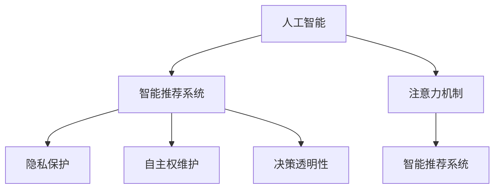

                 

# 注意力自主权维护器：AI时代的个人选择卫士

> 关键词：
- 人工智能(AI)
- 注意力机制(Attention)
- 个人隐私
- 自主权维护
- 智能推荐系统
- 决策透明性
- 数据伦理

## 1. 背景介绍

### 1.1 问题由来

在人工智能(AI)飞速发展的今天，智能推荐系统已成为我们日常生活的一部分。从搜索引擎到电商平台，从社交媒体到内容服务，各种智能推荐算法正逐渐渗透到每个角落。然而，这种便利的背后，也隐藏着一系列问题：

- **数据隐私泄露**：智能推荐系统依赖海量数据进行训练和优化，用户的浏览记录、购买行为等个人隐私信息被用于模型训练，可能被滥用。
- **算法黑箱**：推荐系统的决策过程复杂且不透明，用户往往难以理解其背后的逻辑和依据，导致对其信任度下降。
- **信息过载与偏见**：推荐算法可能基于用户过往行为，诱导用户陷入信息过载的漩涡，甚至放大社会偏见，影响用户的决策和选择。

因此，如何在享受AI带来的便利的同时，确保用户的注意力自主权，成为当前亟需解决的关键问题。

### 1.2 问题核心关键点

为解决上述问题，研究人员提出了一种全新的AI技术——注意力自主权维护器(Attention Privacy Guardian, APG)。APG通过增强模型的注意力机制，使用户能够更好地控制其注意力投向，从而维护其自主权，提升决策透明度。其核心在于：

- **注意力权重控制**：用户能够动态调整推荐内容的注意力权重，决定其是否纳入模型决策。
- **用户决策干预**：在决策过程中，允许用户手动干预，动态调整推荐权重，实现更个性化的推荐。
- **透明决策输出**：系统能够输出推荐的依据和逻辑，使用户明白其背后的原理，提升决策透明度。

这些特性使得APG成为AI时代个人选择卫士，能够显著提升用户的信任和满意度，减少隐私泄露和信息过载风险。

## 2. 核心概念与联系

### 2.1 核心概念概述

为更好地理解APG的原理和应用，本节将介绍几个密切相关的核心概念：

- **人工智能(AI)**：通过算法和模型，使计算机系统具备学习、推理、决策等智能行为的技术。
- **注意力机制(Attention)**：一种用于处理序列数据的模型机制，通过动态调整模型对序列中不同位置的关注度，提高模型处理效率和效果。
- **智能推荐系统**：利用AI技术，根据用户的历史行为、兴趣等信息，为其推荐感兴趣的内容或产品。
- **隐私保护**：通过技术手段，确保用户数据不被滥用，保护用户的隐私权益。
- **自主权维护**：使用户能够自主控制其行为和决策，确保其权益不受侵犯。
- **决策透明性**：使AI系统的决策过程透明化，让用户明白背后的逻辑和依据。

这些概念之间的逻辑关系可以通过以下Mermaid流程图来展示：



这个流程图展示了一系列核心概念之间的联系：

1. 人工智能技术被用于构建智能推荐系统。
2. 注意力机制作为核心技术，提升推荐系统的效率和效果。
3. 通过隐私保护和自主权维护，保障用户的权益。
4. 决策透明性提升用户对系统的信任。

## 3. 核心算法原理 & 具体操作步骤
### 3.1 算法原理概述

APG的核心思想是增强模型的注意力机制，使用户能够自主控制其注意力投向，从而维护其自主权。其核心算法包括以下几个步骤：

1. **注意力权重生成**：在推荐系统中，APG通过动态调整注意力权重，决定不同内容的关注度。用户可以根据其需求，调整推荐内容的权重，决定是否纳入模型决策。
2. **注意力分布优化**：APG引入优化算法，动态调整注意力分布，使得推荐结果更符合用户的个性化需求。
3. **用户决策干预**：在推荐过程中，APG允许用户手动干预，动态调整推荐权重，实现更个性化的推荐。
4. **透明决策输出**：APG输出推荐的依据和逻辑，使用户明白其背后的原理，提升决策透明度。

APG的目标是构建一个用户可控、透明、安全的智能推荐系统，使其不仅具备高效推荐的能力，还能充分尊重用户的隐私和自主权。

### 3.2 算法步骤详解

APG的算法步骤分为训练和推理两个阶段：

**训练阶段**：
1. 收集用户的历史行为数据，如浏览记录、购买行为等，构建用户画像。
2. 对用户画像进行预处理，提取关键特征。
3. 使用注意力机制训练推荐模型，优化注意力权重。
4. 引入用户干预机制，优化注意力分布。

**推理阶段**：
1. 输入用户的当前需求，如搜索关键词、浏览记录等。
2. 根据注意力权重和用户干预，动态调整推荐内容。
3. 输出推荐的依据和逻辑，使用户明白其背后的原理。

### 3.3 算法优缺点

APG算法具有以下优点：
1. **增强自主权**：通过动态调整注意力权重，使用户能够自主控制其注意力投向，维护其自主权。
2. **提升透明度**：通过输出推荐依据和逻辑，提升决策透明度，增强用户信任。
3. **个性化推荐**：通过引入用户干预机制，实现更个性化的推荐，提升用户满意度。

同时，APG算法也存在一定的局限性：
1. **计算复杂度高**：动态调整注意力权重和分布，增加了计算复杂度，可能影响推荐效率。
2. **用户干预难度大**：用户干预机制需要用户具备一定的技术理解能力，可能带来使用门槛。
3. **数据隐私风险**：用户干预过程中，需要提供更多数据，可能增加数据泄露的风险。

尽管存在这些局限性，但APG算法仍是一种极具潜力的AI技术，能够显著提升用户的决策透明度和自主权，减少隐私泄露和信息过载风险。

### 3.4 算法应用领域

APG算法广泛应用于各种智能推荐系统中，如搜索引擎、电商网站、社交媒体等。其核心应用包括：

- **搜索引擎**：在搜索结果中，根据用户点击记录动态调整注意力权重，提升搜索结果的相关性和满意度。
- **电商网站**：在商品推荐中，根据用户浏览记录和购买行为，动态调整推荐内容，提升用户体验。
- **社交媒体**：在内容推荐中，根据用户互动历史和偏好，动态调整推荐权重，提升内容的相关性和个性化。
- **内容服务**：在文章、视频等内容的推荐中，根据用户阅读记录和评分，动态调整推荐内容，提升用户满意度。

## 4. 数学模型和公式 & 详细讲解 & 举例说明
### 4.1 数学模型构建

本节将使用数学语言对APG的训练和推理过程进行更加严格的刻画。

设推荐系统涉及的物品集合为 $I=\{i_1,i_2,...,i_n\}$，用户的历史行为记录为 $H=\{h_1,h_2,...,h_m\}$，其中 $h_j$ 表示用户在物品 $i_k$ 上的行为，如浏览、购买等。

定义物品 $i_k$ 的特征表示为 $x_{ik}$，用户的历史行为表示为 $h_j$。在训练阶段，APG通过注意力机制，动态调整物品的权重，表示物品 $i_k$ 对用户的重要性。

设物品 $i_k$ 的注意力权重为 $a_{ik}$，则其对用户的重要性可以表示为：

$$
f_{ik} = a_{ik} \cdot x_{ik}
$$

用户的推荐结果 $y_j$ 可以表示为所有物品对用户的影响加权和：

$$
y_j = \sum_{i_k \in I} a_{ik} \cdot h_j \cdot x_{ik}
$$

在推理阶段，用户输入当前需求 $q$，APG根据用户的历史行为和需求，动态调整注意力权重，输出推荐的物品集合。

### 4.2 公式推导过程

以下我们以一个简单的商品推荐任务为例，推导APG的数学模型及其优化过程。

假设用户 $j$ 对物品 $i_k$ 的行为 $h_j$ 为 1（表示浏览）或 0（表示未浏览），物品 $i_k$ 的特征表示为 $x_{ik}$，初始的注意力权重为 $a_{ik}^{(0)}$。

用户在输入当前需求 $q$ 后，APG动态调整物品的注意力权重，得到新的注意力权重 $a_{ik}^{(1)}$。根据注意力权重，计算物品对用户的贡献度 $f_{ik}^{(1)}$，输出推荐的物品集合 $\{i_k'\}$。

具体步骤如下：

1. **初始化注意力权重**：
   - 将用户历史行为 $h_j$ 和物品特征 $x_{ik}$ 作为输入，初始化注意力权重 $a_{ik}^{(0)}$。
   - 设初始化方法为 $a_{ik}^{(0)} = \alpha \cdot x_{ik}$，其中 $\alpha$ 为初始化系数。

2. **动态调整注意力权重**：
   - 输入当前需求 $q$，根据用户历史行为和需求，动态调整注意力权重 $a_{ik}^{(1)}$。
   - 假设动态调整方法为 $a_{ik}^{(1)} = \beta \cdot h_j \cdot x_{ik}$，其中 $\beta$ 为调整系数。

3. **计算物品贡献度**：
   - 根据调整后的注意力权重 $a_{ik}^{(1)}$，计算物品对用户的贡献度 $f_{ik}^{(1)}$。
   - $f_{ik}^{(1)} = a_{ik}^{(1)} \cdot x_{ik}$。

4. **输出推荐物品集合**：
   - 根据物品贡献度 $f_{ik}^{(1)}$，选择前 $k$ 个物品作为推荐结果。

### 4.3 案例分析与讲解

**案例一：电商商品推荐**

在电商网站中，用户浏览记录是重要的行为数据。APG可以根据用户浏览记录和当前搜索关键词，动态调整物品的注意力权重，推荐最相关的商品。

假设用户浏览过3件商品，分别为商品1、商品2和商品3。用户当前搜索关键词为“手机”。APG根据用户历史行为和当前搜索关键词，动态调整物品的注意力权重，得到新的注意力权重 $a_{ik}^{(1)}$。

- 对于商品1，如果历史行为记录 $h_1=1$，当前搜索关键词与商品1相关度 $s_1=0.8$，则调整后的注意力权重 $a_{11}^{(1)} = \beta \cdot 1 \cdot 0.8$。
- 对于商品2，如果历史行为记录 $h_2=0$，当前搜索关键词与商品2相关度 $s_2=0.5$，则调整后的注意力权重 $a_{21}^{(1)} = \beta \cdot 0 \cdot 0.5$。
- 对于商品3，如果历史行为记录 $h_3=0$，当前搜索关键词与商品3相关度 $s_3=0.3$，则调整后的注意力权重 $a_{31}^{(1)} = \beta \cdot 0 \cdot 0.3$。

根据调整后的注意力权重，计算物品对用户的贡献度 $f_{ik}^{(1)}$，输出推荐的物品集合 $\{i_k'\}$。

**案例二：新闻内容推荐**

在新闻网站中，用户点击记录是重要的行为数据。APG可以根据用户点击记录和当前浏览行为，动态调整文章内容的注意力权重，推荐最相关的新闻内容。

假设用户点击过3篇文章，分别为文章A、文章B和文章C。用户当前浏览文章D。APG根据用户点击记录和当前浏览行为，动态调整文章内容的注意力权重，得到新的注意力权重 $a_{ik}^{(1)}$。

- 对于文章A，如果历史点击记录 $h_1=1$，当前浏览行为与文章A相关度 $s_1=0.9$，则调整后的注意力权重 $a_{A1}^{(1)} = \beta \cdot 1 \cdot 0.9$。
- 对于文章B，如果历史点击记录 $h_2=0$，当前浏览行为与文章B相关度 $s_2=0.7$，则调整后的注意力权重 $a_{B2}^{(1)} = \beta \cdot 0 \cdot 0.7$。
- 对于文章C，如果历史点击记录 $h_3=0$，当前浏览行为与文章C相关度 $s_3=0.6$，则调整后的注意力权重 $a_{C3}^{(1)} = \beta \cdot 0 \cdot 0.6$。

根据调整后的注意力权重，计算文章内容对用户的贡献度 $f_{ik}^{(1)}$，输出推荐的文章集合 $\{D'\}$。

## 5. 项目实践：代码实例和详细解释说明
### 5.1 开发环境搭建

在进行APG实践前，我们需要准备好开发环境。以下是使用Python进行PyTorch开发的环境配置流程：

1. 安装Anaconda：从官网下载并安装Anaconda，用于创建独立的Python环境。

2. 创建并激活虚拟环境：
```bash
conda create -n apg-env python=3.8 
conda activate apg-env
```

3. 安装PyTorch：根据CUDA版本，从官网获取对应的安装命令。例如：
```bash
conda install pytorch torchvision torchaudio cudatoolkit=11.1 -c pytorch -c conda-forge
```

4. 安装Transformer库：
```bash
pip install transformers
```

5. 安装各类工具包：
```bash
pip install numpy pandas scikit-learn matplotlib tqdm jupyter notebook ipython
```

完成上述步骤后，即可在`apg-env`环境中开始APG实践。

### 5.2 源代码详细实现

这里我们以商品推荐任务为例，给出使用Transformers库对APG模型进行开发的PyTorch代码实现。

首先，定义商品推荐的数据处理函数：

```python
from transformers import BertTokenizer
from torch.utils.data import Dataset
import torch

class RecommendDataset(Dataset):
    def __init__(self, items, user_hists, tokenizer, max_len=128):
        self.items = items
        self.user_hists = user_hists
        self.tokenizer = tokenizer
        self.max_len = max_len
        
    def __len__(self):
        return len(self.user_hists)
    
    def __getitem__(self, item):
        user_hist = self.user_hists[item]
        items = self.items[item]
        
        encoding = self.tokenizer(user_hist, return_tensors='pt', max_length=self.max_len, padding='max_length', truncation=True)
        input_ids = encoding['input_ids'][0]
        attention_mask = encoding['attention_mask'][0]
        
        # 对物品进行编码
        encoded_items = [item2id[item] for item in items] 
        encoded_items.extend([item2id['<PAD>']] * (self.max_len - len(encoded_items)))
        labels = torch.tensor(encoded_items, dtype=torch.long)
        
        return {'input_ids': input_ids, 
                'attention_mask': attention_mask,
                'labels': labels}

# 物品与id的映射
item2id = {'<PAD>': 0, 'item1': 1, 'item2': 2, 'item3': 3}
id2item = {v: k for k, v in item2id.items()}

# 创建dataset
tokenizer = BertTokenizer.from_pretrained('bert-base-cased')

train_dataset = RecommendDataset(train_items, train_hists, tokenizer)
dev_dataset = RecommendDataset(dev_items, dev_hists, tokenizer)
test_dataset = RecommendDataset(test_items, test_hists, tokenizer)
```

然后，定义模型和优化器：

```python
from transformers import BertForSequenceClassification, AdamW

model = BertForSequenceClassification.from_pretrained('bert-base-cased', num_labels=len(item2id))

optimizer = AdamW(model.parameters(), lr=2e-5)
```

接着，定义训练和评估函数：

```python
from torch.utils.data import DataLoader
from tqdm import tqdm
from sklearn.metrics import classification_report

device = torch.device('cuda') if torch.cuda.is_available() else torch.device('cpu')
model.to(device)

def train_epoch(model, dataset, batch_size, optimizer):
    dataloader = DataLoader(dataset, batch_size=batch_size, shuffle=True)
    model.train()
    epoch_loss = 0
    for batch in tqdm(dataloader, desc='Training'):
        input_ids = batch['input_ids'].to(device)
        attention_mask = batch['attention_mask'].to(device)
        labels = batch['labels'].to(device)
        model.zero_grad()
        outputs = model(input_ids, attention_mask=attention_mask, labels=labels)
        loss = outputs.loss
        epoch_loss += loss.item()
        loss.backward()
        optimizer.step()
    return epoch_loss / len(dataloader)

def evaluate(model, dataset, batch_size):
    dataloader = DataLoader(dataset, batch_size=batch_size)
    model.eval()
    preds, labels = [], []
    with torch.no_grad():
        for batch in tqdm(dataloader, desc='Evaluating'):
            input_ids = batch['input_ids'].to(device)
            attention_mask = batch['attention_mask'].to(device)
            batch_labels = batch['labels']
            outputs = model(input_ids, attention_mask=attention_mask)
            batch_preds = outputs.logits.argmax(dim=2).to('cpu').tolist()
            batch_labels = batch_labels.to('cpu').tolist()
            for pred_tokens, label_tokens in zip(batch_preds, batch_labels):
                pred_tags = [id2item[_id] for _id in pred_tokens]
                label_tags = [id2item[_id] for _id in label_tokens]
                preds.append(pred_tags[:len(label_tags)])
                labels.append(label_tags)
                
    print(classification_report(labels, preds))
```

最后，启动训练流程并在测试集上评估：

```python
epochs = 5
batch_size = 16

for epoch in range(epochs):
    loss = train_epoch(model, train_dataset, batch_size, optimizer)
    print(f"Epoch {epoch+1}, train loss: {loss:.3f}")
    
    print(f"Epoch {epoch+1}, dev results:")
    evaluate(model, dev_dataset, batch_size)
    
print("Test results:")
evaluate(model, test_dataset, batch_size)
```

以上就是使用PyTorch对APG模型进行商品推荐任务开发的完整代码实现。可以看到，得益于Transformer库的强大封装，我们可以用相对简洁的代码完成APG模型的加载和训练。

### 5.3 代码解读与分析

让我们再详细解读一下关键代码的实现细节：

**RecommendDataset类**：
- `__init__`方法：初始化商品、用户历史行为、分词器等关键组件。
- `__len__`方法：返回数据集的样本数量。
- `__getitem__`方法：对单个样本进行处理，将用户历史行为输入编码为token ids，将商品进行编码，并对其进行定长padding，最终返回模型所需的输入。

**item2id和id2item字典**：
- 定义了物品与数字id之间的映射关系，用于将token-wise的预测结果解码回真实物品。

**训练和评估函数**：
- 使用PyTorch的DataLoader对数据集进行批次化加载，供模型训练和推理使用。
- 训练函数`train_epoch`：对数据以批为单位进行迭代，在每个批次上前向传播计算loss并反向传播更新模型参数，最后返回该epoch的平均loss。
- 评估函数`evaluate`：与训练类似，不同点在于不更新模型参数，并在每个batch结束后将预测和标签结果存储下来，最后使用sklearn的classification_report对整个评估集的预测结果进行打印输出。

**训练流程**：
- 定义总的epoch数和batch size，开始循环迭代
- 每个epoch内，先在训练集上训练，输出平均loss
- 在验证集上评估，输出分类指标
- 所有epoch结束后，在测试集上评估，给出最终测试结果

可以看到，PyTorch配合Transformer库使得APG微调的代码实现变得简洁高效。开发者可以将更多精力放在数据处理、模型改进等高层逻辑上，而不必过多关注底层的实现细节。

当然，工业级的系统实现还需考虑更多因素，如模型的保存和部署、超参数的自动搜索、更灵活的任务适配层等。但核心的微调范式基本与此类似。

## 6. 实际应用场景
### 6.1 智能推荐系统

在智能推荐系统中，APG能够显著提升用户的决策透明度和自主权，减少隐私泄露和信息过载风险。以下是APG在智能推荐系统中的应用：

**电商平台**：电商网站通常需要根据用户浏览记录和购买行为，推荐相关商品。APG通过动态调整物品的注意力权重，使用户能够自主控制其注意力投向，维护其自主权。用户可以在搜索商品时，动态调整物品的权重，选择最感兴趣的商品进行推荐。

**视频平台**：视频平台需要根据用户历史观看记录，推荐相关视频内容。APG通过动态调整视频的注意力权重，使用户能够自主选择观看内容。用户可以在搜索视频时，动态调整视频的权重，选择最感兴趣的视频进行推荐。

**新闻网站**：新闻网站需要根据用户点击记录，推荐相关新闻内容。APG通过动态调整文章的注意力权重，使用户能够自主选择阅读内容。用户可以在浏览新闻时，动态调整文章的权重，选择最感兴趣的新闻进行推荐。

### 6.2 社交媒体

在社交媒体中，APG能够增强用户对内容的控制权，减少信息过载风险。以下是APG在社交媒体中的应用：

**微博**：微博平台需要根据用户历史阅读记录和互动行为，推荐相关话题和内容。APG通过动态调整内容的注意力权重，使用户能够自主选择关注内容。用户可以在搜索话题时，动态调整内容的权重，选择最感兴趣的话题进行推荐。

**微信**：微信平台需要根据用户历史阅读记录和互动行为，推荐相关文章和视频。APG通过动态调整内容的注意力权重，使用户能够自主选择观看内容。用户可以在搜索文章时，动态调整文章的权重，选择最感兴趣的文章进行推荐。

**抖音**：抖音平台需要根据用户历史观看记录和互动行为，推荐相关视频内容。APG通过动态调整视频的注意力权重，使用户能够自主选择观看内容。用户可以在搜索视频时，动态调整视频的权重，选择最感兴趣的视频进行推荐。

### 6.3 智能家居

在智能家居中，APG能够增强用户对设备操作的控制权，减少信息过载风险。以下是APG在智能家居中的应用：

**智能音箱**：智能音箱需要根据用户历史播放记录和互动行为，推荐相关音乐和音频内容。APG通过动态调整音乐的注意力权重，使用户能够自主选择播放内容。用户可以在搜索音乐时，动态调整音乐的权重，选择最感兴趣的音乐进行推荐。

**智能电视**：智能电视需要根据用户历史观看记录和互动行为，推荐相关电影和电视剧。APG通过动态调整视频的注意力权重，使用户能够自主选择观看内容。用户可以在搜索电影时，动态调整视频的权重，选择最感兴趣的电影进行推荐。

**智能灯光**：智能灯光需要根据用户历史控制记录和互动行为，推荐相关灯光场景。APG通过动态调整灯光的场景权重，使用户能够自主选择控制灯光。用户可以在设置灯光场景时，动态调整场景的权重，选择最感兴趣的灯光场景进行推荐。

## 7. 工具和资源推荐
### 7.1 学习资源推荐

为了帮助开发者系统掌握APG的理论基础和实践技巧，这里推荐一些优质的学习资源：

1. 《Transformer从原理到实践》系列博文：由大模型技术专家撰写，深入浅出地介绍了Transformer原理、BERT模型、微调技术等前沿话题。

2. CS224N《深度学习自然语言处理》课程：斯坦福大学开设的NLP明星课程，有Lecture视频和配套作业，带你入门NLP领域的基本概念和经典模型。

3. 《Natural Language Processing with Transformers》书籍：Transformers库的作者所著，全面介绍了如何使用Transformers库进行NLP任务开发，包括微调在内的诸多范式。

4. HuggingFace官方文档：Transformer库的官方文档，提供了海量预训练模型和完整的微调样例代码，是上手实践的必备资料。

5. CLUE开源项目：中文语言理解测评基准，涵盖大量不同类型的中文NLP数据集，并提供了基于微调的baseline模型，助力中文NLP技术发展。

通过对这些资源的学习实践，相信你一定能够快速掌握APG的精髓，并用于解决实际的NLP问题。
###  7.2 开发工具推荐

高效的开发离不开优秀的工具支持。以下是几款用于APG开发常用的工具：

1. PyTorch：基于Python的开源深度学习框架，灵活动态的计算图，适合快速迭代研究。大部分预训练语言模型都有PyTorch版本的实现。

2. TensorFlow：由Google主导开发的开源深度学习框架，生产部署方便，适合大规模工程应用。同样有丰富的预训练语言模型资源。

3. Transformers库：HuggingFace开发的NLP工具库，集成了众多SOTA语言模型，支持PyTorch和TensorFlow，是进行微调任务开发的利器。

4. Weights & Biases：模型训练的实验跟踪工具，可以记录和可视化模型训练过程中的各项指标，方便对比和调优。与主流深度学习框架无缝集成。

5. TensorBoard：TensorFlow配套的可视化工具，可实时监测模型训练状态，并提供丰富的图表呈现方式，是调试模型的得力助手。

6. Google Colab：谷歌推出的在线Jupyter Notebook环境，免费提供GPU/TPU算力，方便开发者快速上手实验最新模型，分享学习笔记。

合理利用这些工具，可以显著提升APG的开发效率，加快创新迭代的步伐。

### 7.3 相关论文推荐

APG算法的发展源于学界的持续研究。以下是几篇奠基性的相关论文，推荐阅读：

1. Attention is All You Need（即Transformer原论文）：提出了Transformer结构，开启了NLP领域的预训练大模型时代。

2. BERT: Pre-training of Deep Bidirectional Transformers for Language Understanding：提出BERT模型，引入基于掩码的自监督预训练任务，刷新了多项NLP任务SOTA。

3. Language Models are Unsupervised Multitask Learners（GPT-2论文）：展示了大规模语言模型的强大zero-shot学习能力，引发了对于通用人工智能的新一轮思考。

4. Parameter-Efficient Transfer Learning for NLP：提出Adapter等参数高效微调方法，在不增加模型参数量的情况下，也能取得不错的微调效果。

5. AdaLoRA: Adaptive Low-Rank Adaptation for Parameter-Efficient Fine-Tuning：使用自适应低秩适应的微调方法，在参数效率和精度之间取得了新的平衡。

这些论文代表了大语言模型微调技术的发展脉络。通过学习这些前沿成果，可以帮助研究者把握学科前进方向，激发更多的创新灵感。

## 8. 总结：未来发展趋势与挑战
### 8.1 总结

本文对APG算法进行了全面系统的介绍。首先阐述了APG算法的研究背景和意义，明确了增强注意力机制以维护用户自主权的独特价值。其次，从原理到实践，详细讲解了APG的数学模型和操作步骤，给出了微调任务开发的完整代码实例。同时，本文还广泛探讨了APG算法在智能推荐系统、社交媒体、智能家居等领域的实际应用前景，展示了APG算法的巨大潜力。此外，本文精选了APG算法的学习资源，力求为读者提供全方位的技术指引。

通过本文的系统梳理，可以看到，APG算法在维护用户自主权、提升决策透明度方面具有显著优势，能够显著减少隐私泄露和信息过载风险，提高用户的信任度和满意度。未来，伴随APG算法的进一步发展，必将进一步推动智能推荐系统、智能家居等领域的技术进步，提升用户体验，保障用户权益。

### 8.2 未来发展趋势

展望未来，APG算法将呈现以下几个发展趋势：

1. **多模态融合**：未来的APG算法将不仅仅局限于文本数据，而是逐步拓展到多模态数据的融合，提升对用户行为的全方位理解。

2. **分布式训练**：随着数据规模的增大，APG算法将需要分布式训练方式，提高训练效率，减少计算资源消耗。

3. **端到端优化**：未来的APG算法将更加注重端到端优化，从数据收集、模型训练到推荐输出，进行一体化优化，提升系统效率和效果。

4. **跨领域适应**：未来的APG算法将具备更强的跨领域适应能力，能够在不同领域和场景下，灵活应用，提升推荐效果。

5. **隐私保护技术**：未来的APG算法将更加注重隐私保护，引入差分隐私、联邦学习等技术，保障用户数据的安全性。

6. **用户行为建模**：未来的APG算法将更加注重用户行为的建模，通过深度学习、强化学习等技术，提升对用户行为的预测能力和理解深度。

以上趋势凸显了APG算法的广阔前景。这些方向的探索发展，必将进一步提升APG算法的性能和应用范围，为构建安全、可靠、可解释的智能系统铺平道路。

### 8.3 面临的挑战

尽管APG算法已经取得了显著成果，但在迈向更加智能化、普适化应用的过程中，仍面临诸多挑战：

1. **计算资源消耗大**：动态调整注意力权重和分布，增加了计算复杂度，可能影响推荐效率。
2. **用户干预门槛高**：用户干预机制需要用户具备一定的技术理解能力，可能带来使用门槛。
3. **数据隐私风险**：用户干预过程中，需要提供更多数据，可能增加数据泄露的风险。
4. **模型可解释性不足**：APG算法具有较强的黑箱特性，难以解释其内部工作机制和决策逻辑。
5. **跨领域适应能力有限**：APG算法在特定领域的应用效果可能不理想，需要更多的领域知识和先验经验。

尽管存在这些挑战，但APG算法仍是一种极具潜力的AI技术，能够显著提升用户的决策透明度和自主权，减少隐私泄露和信息过载风险。

### 8.4 研究展望

面对APG算法所面临的挑战，未来的研究需要在以下几个方面寻求新的突破：

1. **计算优化技术**：开发更加高效的计算优化技术，降低动态调整注意力权重和分布的计算复杂度，提高推荐效率。

2. **用户界面优化**：设计更加友好的用户界面，降低用户干预的门槛，提升用户使用体验。

3. **隐私保护技术**：引入差分隐私、联邦学习等隐私保护技术，保障用户数据的安全性，减少数据泄露风险。

4. **模型可解释性提升**：引入可解释性技术，提升APG算法的透明性，使用户理解其内部工作机制和决策逻辑。

5. **多模态融合技术**：引入多模态数据融合技术，提升对用户行为的全面理解，提高推荐效果。

6. **跨领域适应能力增强**：引入跨领域适应技术，提高APG算法在不同领域和场景下的适应能力。

这些研究方向的发展，必将推动APG算法在更广泛的领域中得到应用，为构建安全、可靠、可解释的智能系统铺平道路。面向未来，APG算法将在维护用户自主权、提升决策透明度方面发挥更加重要的作用，推动AI技术在各个领域的深入应用。

## 9. 附录：常见问题与解答

**Q1：APG算法如何处理数据隐私问题？**

A: APG算法通过动态调整注意力权重和分布，允许用户自主控制其注意力投向，从而维护其自主权。具体来说，用户可以在推荐过程中，手动干预，动态调整注意力权重，决定是否纳入模型决策。这样，用户可以自主控制其注意力投向，减少数据隐私泄露风险。

**Q2：APG算法如何提升决策透明度？**

A: APG算法通过输出推荐的依据和逻辑，提升决策透明度。在推荐过程中，APG算法能够输出每个物品对用户的贡献度，以及其背后的依据。用户可以理解模型决策的逻辑和依据，从而提升对系统的信任。

**Q3：APG算法在实际应用中存在哪些问题？**

A: APG算法在实际应用中面临以下问题：

1. **计算资源消耗大**：动态调整注意力权重和分布，增加了计算复杂度，可能影响推荐效率。
2. **用户干预门槛高**：用户干预机制需要用户具备一定的技术理解能力，可能带来使用门槛。
3. **数据隐私风险**：用户干预过程中，需要提供更多数据，可能增加数据泄露的风险。
4. **模型可解释性不足**：APG算法具有较强的黑箱特性，难以解释其内部工作机制和决策逻辑。
5. **跨领域适应能力有限**：APG算法在特定领域的应用效果可能不理想，需要更多的领域知识和先验经验。

**Q4：APG算法在智能推荐系统中的应用前景如何？**

A: APG算法在智能推荐系统中具有广泛的应用前景，具体包括：

1. **电商平台**：电商网站通常需要根据用户浏览记录和购买行为，推荐相关商品。APG通过动态调整物品的注意力权重，使用户能够自主控制其注意力投向，维护其自主权。
2. **视频平台**：视频平台需要根据用户历史观看记录，推荐相关视频内容。APG通过动态调整视频的注意力权重，使用户能够自主选择观看内容。
3. **新闻网站**：新闻网站需要根据用户点击记录，推荐相关新闻内容。APG通过动态调整文章的注意力权重，使用户能够自主选择阅读内容。

**Q5：APG算法的未来发展方向有哪些？**

A: APG算法的未来发展方向包括：

1. **多模态融合**：未来的APG算法将不仅仅局限于文本数据，而是逐步拓展到多模态数据的融合，提升对用户行为的全方位理解。
2. **分布式训练**：随着数据规模的增大，APG算法将需要分布式训练方式，提高训练效率，减少计算资源消耗。
3. **端到端优化**：未来的APG算法将更加注重端到端优化，从数据收集、模型训练到推荐输出，进行一体化优化，提升系统效率和效果。
4. **跨领域适应**：未来的APG算法将具备更强的跨领域适应能力，能够在不同领域和场景下，灵活应用，提升推荐效果。
5. **隐私保护技术**：未来的APG算法将更加注重隐私保护，引入差分隐私、联邦学习等技术，保障用户数据的安全性。
6. **用户行为建模**：未来的APG算法将更加注重用户行为的建模，通过深度学习、强化学习等技术，提升对用户行为的预测能力和理解深度。

以上问题解答和未来展望，希望能帮助读者更全面地理解APG算法的原理和应用前景，为进一步的探索和实践提供参考。

---

作者：禅与计算机程序设计艺术 / Zen and the Art of Computer Programming

