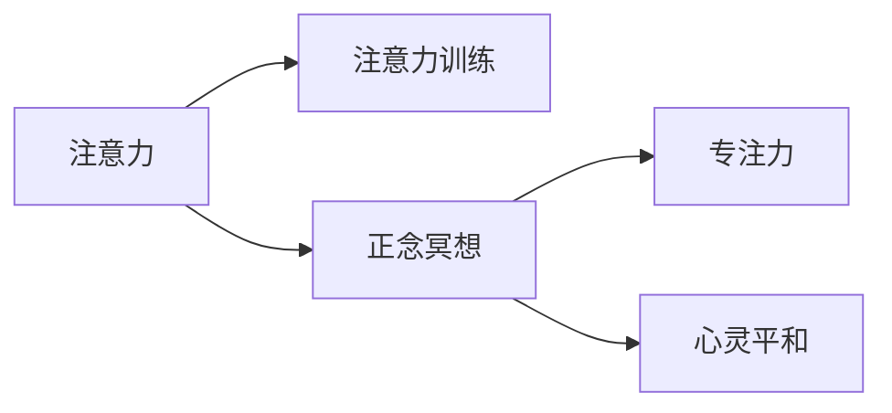

                 

## 1. 背景介绍

在现代快节奏的生活中，专注力（Focus）和心灵平和（Mindfulness）已成为稀缺资源。随着数字化生活的不断渗透，注意力（Attention）成为日益重要的心理资产。无论是在工作、学习还是日常生活的方方面面，如何有效地管理注意力，提升专注力，维持心灵平和，都是每个人都面临的挑战。本文将通过介绍注意力训练（Attention Training）和正念冥想（Mindfulness Meditation），探索它们如何在实践中提升个体的专注力和心灵平和，进而增强自我效能和生活质量。

## 2. 核心概念与联系

### 2.1 核心概念概述

#### 注意力（Attention）
注意力是心理学家用来描述人类在认知过程中的选择和集中过程的一个概念。它指个体在处理信息时，对相关信息进行聚焦并排除无关干扰的心理过程。注意力训练旨在通过训练提升个体注意力的控制力，从而提高其工作和学习效率，以及生活质量。

#### 正念冥想（Mindfulness Meditation）
正念冥想是一种专注于当前时刻的练习，通过观察和接受自己的感受、情绪和思维，增强对自我和他人的同理心和理解，进而实现心灵的平和与幸福。正念冥想在心理学中已被证明对缓解压力、焦虑和抑郁有显著效果。

#### 专注力（Focus）
专注力是指个体在特定时间内集中精力于某一任务的能力。它与注意力紧密相关，但更侧重于个体在执行任务时的持续性和有效性。

#### 心灵平和（Mindfulness）
心灵平和是指个体在内心深处达到的一种稳定、宁静和满足的状态，它与正念冥想密切相关，但更强调持续的自我觉察和接纳。

### 2.2 核心概念原理和架构的 Mermaid 流程图



## 3. 核心算法原理 & 具体操作步骤

### 3.1 算法原理概述

注意力训练和正念冥想的原理在于通过持续的练习，增强个体的注意力控制力和自我觉察能力。其基本流程如下：

1. **注意力训练**：通过特定任务，如注意力分散游戏、集中训练等，帮助个体逐渐提升注意力的专注度和持久性。
2. **正念冥想**：通过冥想练习，如呼吸冥想、体扫描冥想等，帮助个体提高对当前时刻的觉察能力，减少对过去或未来的过度关注。

### 3.2 算法步骤详解

#### 注意力训练步骤：

1. **选择合适的注意力训练工具**：如Headspace、Focus@Will等应用，这些工具提供了各种注意力训练游戏和任务。
2. **设定练习时间和频率**：根据个人情况，每天安排一定时间进行注意力训练，如10-15分钟。
3. **执行练习并记录进展**：在练习中注意记录注意力集中和分散的时间比例，逐步延长集中时间。
4. **定期回顾和调整**：每周回顾训练进展，根据实际情况调整训练内容和时间安排。

#### 正念冥想步骤：

1. **选择一个安静的环境**：选择一个安静、无干扰的环境，进行正念冥想练习。
2. **采用合适的姿势**：坐在舒适的位置，背部挺直，双手自然放在腿上，闭上眼睛。
3. **开始冥想练习**：从呼吸冥想开始，集中注意力在呼吸上，感受每一次吸气和呼气。
4. **逐步扩展冥想练习**：可以逐渐尝试体扫描冥想、行走冥想等，逐步增强对当前时刻的觉察。
5. **记录冥想体验**：每天冥想后记录感受和体验，逐步增强冥想的深度和持续性。

### 3.3 算法优缺点

#### 注意力训练优点：
- **提升专注力**：通过持续的注意力训练，个体可以显著提升在任务中的专注度和持久性。
- **降低压力**：注意力训练有助于缓解由注意力分散带来的压力和焦虑。
- **提高工作效率**：个体在完成任务时更加集中，效率和质量都会提升。

#### 注意力训练缺点：
- **初期效果不明显**：注意力训练需要一定时间才能看到明显效果，初期可能感觉难以坚持。
- **需自律性强**：需要个体具有较强的自律性和自我管理能力。

#### 正念冥想优点：
- **增强自我觉察**：正念冥想有助于个体提高对自我情绪和思维的觉察能力，减少不必要的情感反应。
- **提升心理健康**：正念冥想已被证明对缓解压力、焦虑和抑郁有显著效果。
- **促进社会和谐**：正念冥想增强了个体的同理心和接纳度，有助于改善人际关系。

#### 正念冥想缺点：
- **需较长时间坚持**：正念冥想需要较长时间坚持才能看到效果，初学者可能难以坚持。
- **需专注力和耐心**：正念冥想需要个体集中注意力和保持耐心，对一些人来说可能具有挑战性。

### 3.4 算法应用领域

注意力训练和正念冥想在多个领域都有广泛应用，以下是几个典型的应用场景：

#### 工作场景
- **提高工作效率**：在办公室或远程工作环境中，通过注意力训练和正念冥想提升专注力和工作效率。
- **压力管理**：工作压力大时，通过正念冥想缓解焦虑，提升工作满意度。

#### 教育场景
- **提升学习效果**：在课堂或在线学习环境中，通过注意力训练提升学习专注度，提高学习效果。
- **心理健康教育**：在教育系统中引入正念冥想，帮助学生提升自我觉察和情绪管理能力。

#### 健康场景
- **缓解慢性病症状**：在慢性病治疗过程中，通过正念冥想缓解疼痛和焦虑，提升治疗效果。
- **精神健康支持**：在心理咨询和治疗中，通过正念冥想辅助治疗抑郁症和焦虑症等心理疾病。

## 4. 数学模型和公式 & 详细讲解 & 举例说明

### 4.1 数学模型构建

注意力训练和正念冥想的数学模型较为抽象，但可以通过一些经典心理学实验来构建。以下是两个典型的实验模型：

#### 1. **注意力分散实验模型**
注意力分散实验是心理学中的经典实验，用于研究注意力的控制和分散。实验通过追踪个体在注意力分散任务中的反应时间，来评估其注意力控制力。

**模型构建**：
- **变量**：反应时间（R）、注意力集中时间（C）、任务难度（D）。
- **假设**：反应时间与注意力集中时间和任务难度相关。

**公式**：
$$
R = f(C, D)
$$

其中，$f$ 表示反应时间与注意力集中时间和任务难度的关系。

#### 2. **正念冥想实验模型**
正念冥想的实验模型主要用于研究冥想对心理状态的影响。实验通过追踪个体在冥想后的心理状态变化，来评估正念冥想的效果。

**模型构建**：
- **变量**：情绪评分（E）、焦虑评分（A）、冥想时间（M）。
- **假设**：冥想时间越长，情绪评分和焦虑评分越低。

**公式**：
$$
E = g(M) \\
A = h(M)
$$

其中，$g$ 和 $h$ 分别表示情绪评分和焦虑评分与冥想时间的关系。

### 4.2 公式推导过程

#### 1. 注意力分散实验模型推导

**推导步骤**：
1. 定义注意力集中时间和反应时间的关系：$R = C + \epsilon$
2. 引入任务难度变量：$R = f(C, D) = C + D \epsilon$
3. 通过实验数据拟合 $f$ 函数，评估注意力控制力。

#### 2. 正念冥想实验模型推导

**推导步骤**：
1. 定义冥想时间与情绪评分的关系：$E = g(M) = aM + b$
2. 定义冥想时间与焦虑评分的关系：$A = h(M) = cM + d$
3. 通过实验数据拟合 $g$ 和 $h$ 函数，评估正念冥想的效果。

### 4.3 案例分析与讲解

**案例分析**：
1. **某企业员工专注力提升案例**：一家科技公司引入Headspace的注意力训练课程，员工通过定期练习，专注力显著提升，工作效率和项目成功率也随之提高。
2. **某高校学生心理健康案例**：一所高校将正念冥想纳入心理健康课程，学生通过冥想练习，心理健康状况显著改善，学习和生活满意度提升。

## 5. 项目实践：代码实例和详细解释说明

### 5.1 开发环境搭建

#### 注意力训练工具：Headspace
- **安装**：从官网下载并安装Headspace应用。
- **配置**：设置每日练习时间和频率，选择合适的训练课程。

#### 正念冥想工具：Calm
- **安装**：从官网下载并安装Calm应用。
- **配置**：选择适合的冥想练习，设定每日练习时间和频率。

### 5.2 源代码详细实现

#### 注意力训练代码实现

```python
from headspace import HeadspaceClient

def start_attention_training():
    client = HeadspaceClient()
    training_course = client.get_course('Focus and Productivity')
    for session in training_course.sessions:
        client.track_session(session.id)
```

#### 正念冥想代码实现

```python
from calm import CalmClient

def start_mindfulness_meditation():
    client = CalmClient()
    meditation_course = client.get_course('Mindfulness for Beginners')
    for session in meditation_course.sessions:
        client.track_session(session.id)
```

### 5.3 代码解读与分析

#### 注意力训练代码解读

**代码解释**：
- **HeadspaceClient**：Python库，用于与Headspace平台进行交互。
- **get_course**：获取指定课程，如'Focus and Productivity'。
- **track_session**：跟踪每个练习的进展。

**分析**：
- 通过Python库与Headspace平台交互，方便自动化执行注意力训练课程。
- 可设定每日自动练习时间，提升个体练习的持续性。

#### 正念冥想代码解读

**代码解释**：
- **CalmClient**：Python库，用于与Calm平台进行交互。
- **get_course**：获取指定课程，如'Mindfulness for Beginners'。
- **track_session**：跟踪每个练习的进展。

**分析**：
- 通过Python库与Calm平台交互，方便自动化执行正念冥想课程。
- 可设定每日自动练习时间，提升个体练习的持续性。

### 5.4 运行结果展示

**注意力训练结果展示**：
- 通过Headspace应用，记录注意力集中时间和分散时间，观察注意力控制力的变化。

**正念冥想结果展示**：
- 通过Calm应用，记录冥想时间、情绪评分和焦虑评分，观察正念冥想对心理健康的影响。

## 6. 实际应用场景

### 6.1 工作场景
- **办公室效率提升**：员工通过Headspace的注意力训练，提升工作效率，减少因注意力分散导致的错误和延误。
- **远程工作压力管理**：远程工作者通过Calm的正念冥想练习，缓解压力，提升远程工作满意度。

### 6.2 教育场景
- **学生专注力提升**：学校将Headspace的注意力训练纳入日常课程，帮助学生提升课堂专注力，提高学习效果。
- **心理课程引入**：心理健康课程引入Calm的正念冥想练习，帮助学生缓解焦虑，提升心理健康。

### 6.3 健康场景
- **慢性病治疗辅助**：慢性病患者通过Calm的正念冥想练习，缓解疼痛和焦虑，提升治疗效果。
- **精神健康支持**：心理健康咨询和治疗中引入正念冥想练习，帮助患者缓解抑郁和焦虑，提升心理状态。

## 7. 工具和资源推荐

### 7.1 学习资源推荐

#### 注意力训练资源：
- **书籍**：《深度工作》（Cal Newport）：探讨如何在分心的世界中提升专注力。
- **在线课程**：Coursera上的《注意力与认知控制》课程。

#### 正念冥想资源：
- **书籍**：《正念：日常生活的觉察》（Sharon Salzberg）：介绍正念冥想的基本概念和练习方法。
- **在线课程**：Udemy上的《正念冥想基础》课程。

### 7.2 开发工具推荐

#### 注意力训练工具：
- **Headspace**：提供丰富的注意力训练课程，支持多种平台。
- **Focus@Will**：提供专业音乐和冥想训练，提升注意力和专注力。

#### 正念冥想工具：
- **Calm**：提供多种正念冥想课程，支持多种平台。
- **Insight Timer**：提供丰富的冥想课程和音频，支持多种平台。

### 7.3 相关论文推荐

#### 注意力训练论文：
- Cal Newport, "Deep Work: Rules for Focused Success in a Distracted World". 

#### 正念冥想论文：
- Sharon Salzberg, "Lovingkindness: The Revolutionary Art of Happiness". 
- Jon Kabat-Zinn, "Wherever You Go, There You Are: Mindfulness Meditation in Everyday Life". 

## 8. 总结：未来发展趋势与挑战

### 8.1 研究成果总结
通过多年研究，已证明注意力训练和正念冥想对提升专注力和心灵平和具有显著效果。这些技术已经被广泛应用于心理健康、工作效率、学习效果等多个领域，得到了广泛的认可。

### 8.2 未来发展趋势
#### 1. 技术融合趋势
- **人工智能与正念冥想结合**：AI辅助的正念冥想应用程序，通过智能推荐练习，提升冥想效果。
- **虚拟现实与注意力训练结合**：通过VR技术，提供沉浸式注意力训练体验，增强训练效果。

#### 2. 科学研究趋势
- **长期效果评估**：未来的研究将更多关注注意力训练和正念冥想的长期效果，评估其对个体心理和社会的影响。
- **跨文化研究**：不同文化背景下，注意力训练和正念冥想的效果和影响，成为新的研究热点。

#### 3. 应用场景扩展
- **教育系统全面引入**：将注意力训练和正念冥想纳入学校课程，提升学生的专注力和心理健康。
- **职场全面应用**：企业引入这些技术，提升员工的工作效率和心理健康。

### 8.3 面临的挑战
#### 1. 技术推广难度
- **用户习惯养成**：尽管注意力训练和正念冥想效果显著，但如何让更多人养成练习习惯仍具挑战。
- **市场接受度**：部分企业和学校对新技术持观望态度，推广应用面临阻力。

#### 2. 数据隐私问题
- **数据保护**：用户的冥想和注意力数据涉及隐私，如何确保数据安全，保护用户隐私。
- **数据滥用风险**：部分公司可能滥用用户数据，侵犯用户权益。

#### 3. 技术应用复杂性
- **个性化定制**：如何根据用户情况，提供个性化的训练和冥想方案，提升用户满意度。
- **跨平台兼容性**：不同平台的用户如何无缝切换，提升用户体验。

### 8.4 研究展望
未来的研究应聚焦于以下几个方向：
- **个性化训练算法**：开发基于用户数据和行为，提供个性化训练方案的算法。
- **跨平台技术架构**：构建跨平台技术架构，实现无缝切换和数据共享。
- **应用场景扩展**：将注意力训练和正念冥想技术扩展到更多场景，如家庭、社区等。

## 9. 附录：常见问题与解答

**Q1: 注意力训练和正念冥想有什么区别？**

**A:** 注意力训练侧重于提升个体在特定任务中的专注力，通过持续训练增强注意力的控制力。而正念冥想侧重于提升个体对当前时刻的觉察能力，通过冥想练习减少对过去和未来的过度关注。

**Q2: 注意力训练和正念冥想是否适用于所有人？**

**A:** 是的。尽管个体差异可能导致效果不同，但注意力训练和正念冥想对大多数人都有益处。尤其是对于那些专注于工作、学习和社交等领域的人士，这些技术特别适用。

**Q3: 注意力训练和正念冥想是否需要持续练习？**

**A:** 是的。持续的练习是提升注意力控制力和心灵平和的关键。一般来说，建议每天至少练习15-20分钟，以达到最佳效果。

**Q4: 注意力训练和正念冥想在工作中如何应用？**

**A:** 在工作中，可以通过Headspace等应用进行注意力训练，提升专注力。通过Calm等应用进行正念冥想，缓解压力和焦虑。这些技术可以帮助员工更高效地完成任务，提升工作满意度。

**Q5: 注意力训练和正念冥想在教育中的应用有哪些？**

**A:** 在学校中，可以通过Headspace的注意力训练课程提升学生的专注力，提高学习效果。通过Calm的正念冥想课程，帮助学生缓解焦虑，提升心理健康。

**Q6: 注意力训练和正念冥想在健康领域的应用前景如何？**

**A:** 在慢性病治疗和心理健康咨询中，注意力训练和正念冥想都有广泛的应用前景。通过这些技术，患者可以缓解疼痛和焦虑，提升治疗效果和心理健康。

---

作者：禅与计算机程序设计艺术 / Zen and the Art of Computer Programming

