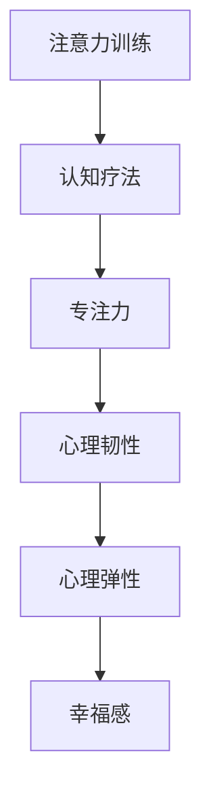

                 

## 1. 背景介绍

在当今快节奏的生活中，人们的注意力越来越容易分散，心理健康问题也随之增加。注意力训练与认知疗法（Attention Training and Cognitive Therapy, ATCT）作为一种新兴的心理治疗方法，旨在通过科学训练和认知重建，提升个体的专注力和心理韧性，从而改善心理健康和幸福感。本文将深入探讨ATCT的核心概念、原理和操作步骤，并通过数学模型和代码实例详细解析其实现机制，揭示其应用前景，同时提供资源推荐和未来研究方向，为研究者和实践者提供全面指导。

## 2. 核心概念与联系

### 2.1 核心概念概述

ATCT结合了认知行为疗法和注意力训练方法，旨在通过一系列科学训练程序，逐步提升个体的专注力和认知控制能力，帮助其建立健康、高效的思维模式，从而增强心理韧性，减少焦虑、抑郁等负面情绪，提升幸福感和生活质量。

- **注意力训练（Attention Training）**：通过特定的注意力任务，如正念冥想、视觉聚焦等，逐步增强个体的注意力集中度和持久度，提高心理适应性和情绪调节能力。
- **认知疗法（Cognitive Therapy）**：通过认知重建技术，帮助个体识别和改变负面的思维模式和认知偏见，减少认知扭曲，建立更加积极、现实的认知框架。
- **专注力（Focus）**：指个体集中注意力于特定目标或任务的能力，是心理健康和幸福感的重要基础。
- **心理韧性（Psychological Resilience）**：指个体在面对压力和逆境时，能够快速恢复、适应并成长的能力。
- **心理弹性（Mental Resilience）**：指个体在遭遇挫折和失败时，能够迅速调整心态，恢复自信和积极情绪的能力。
- **幸福感（Well-being）**：指个体对自己生活的满意度和主观幸福感，与心理健康紧密相关。

这些核心概念之间的逻辑关系可以通过以下Mermaid流程图来展示：



## 3. 核心算法原理 & 具体操作步骤

### 3.1 算法原理概述

ATCT的算法原理基于认知神经科学和行为科学的最新研究成果，结合心理学和教育学的方法论，旨在通过科学的训练和认知重建，逐步提升个体的专注力和心理韧性，从而改善心理健康和幸福感。

ATCT的核心步骤如下：

1. **基线评估**：通过问卷调查和心理评估，了解个体的注意力水平、认知模式和心理健康状况。
2. **注意力训练**：设计一系列针对性的注意力任务，逐步增强个体的注意力集中度和持久度。
3. **认知重建**：通过认知行为技术，帮助个体识别和改变负面的思维模式和认知偏见，建立更加积极、现实的认知框架。
4. **跟踪评估**：定期评估个体的注意力、认知、情绪和心理健康状况，根据反馈调整训练计划。
5. **长期维护**：指导个体进行日常专注力训练，维持和提升心理韧性和幸福感。

### 3.2 算法步骤详解

#### 3.2.1 基线评估

**步骤1**：使用标准化的心理评估工具，如贝克抑郁量表（BDI）、焦虑自评量表（GAD-7）、认知行为量表（CBQ）等，评估个体的注意力水平、认知模式和心理健康状况。

**步骤2**：通过访谈和问卷，了解个体的日常行为习惯、生活压力、社交关系等方面的情况。

**步骤3**：根据评估结果，制定个性化的ATCT计划，设定具体的训练目标和预期效果。

#### 3.2.2 注意力训练

**步骤1**：选择适合的注意力任务，如正念冥想、视觉聚焦、听觉注意力等，设计训练计划。

**步骤2**：指导个体逐步执行注意力任务，记录训练过程和反馈。

**步骤3**：根据个体的训练表现，逐步增加任务难度和训练时长，确保逐步提升。

#### 3.2.3 认知重建

**步骤1**：通过认知行为技术，帮助个体识别负面的思维模式和认知偏见。

**步骤2**：教授个体认知重建技术，如认知重评、认知替代等，改变负面的思维模式。

**步骤3**：通过系统化的认知训练，提升个体的认知灵活性和适应性。

#### 3.2.4 跟踪评估

**步骤1**：定期使用心理评估工具，评估个体的注意力水平、认知模式和心理健康状况。

**步骤2**：根据评估结果，调整注意力训练和认知重建计划。

**步骤3**：记录个体的训练进展和反馈，指导其进行长期维护。

#### 3.2.5 长期维护

**步骤1**：指导个体进行日常专注力训练，如正念冥想、视觉聚焦等。

**步骤2**：鼓励个体在日常生活中应用认知重建技术，建立积极、现实的认知框架。

**步骤3**：定期进行跟踪评估，调整训练计划，维持和提升心理韧性和幸福感。

### 3.3 算法优缺点

**优点**：

- **科学性**：基于认知神经科学和行为科学的最新研究成果，具有坚实的科学基础。
- **个性化**：通过基线评估和个性化训练计划，能够针对个体需求进行精准干预。
- **效果显著**：在多项临床研究中，ATCT已证明对提升专注力和心理健康具有显著效果。
- **广泛适用**：适用于不同年龄段、不同心理背景的个体，适用范围广。

**缺点**：

- **需要时间和投入**：ATCT通常需要一定的时间和精力投入，个体需坚持较长时间的训练。
- **需要专业指导**：部分注意力和认知训练需要专业指导，对训练师的要求较高。
- **可能存在个体差异**：不同个体对ATCT的响应可能存在差异，效果因人而异。

### 3.4 算法应用领域

ATCT在多个领域具有广泛应用前景，具体如下：

- **心理健康**：用于缓解焦虑、抑郁等情绪问题，提升心理健康水平。
- **教育培训**：提高学生的注意力集中度和学习效果，增强学习动力。
- **职业发展**：提升职场人士的工作专注力和工作效率，减少职业倦怠。
- **儿童青少年**：帮助儿童青少年建立健康的注意力和认知模式，促进其心理发展。
- **老年人群**：帮助老年人改善注意力和认知功能，增强心理适应能力。

## 4. 数学模型和公式 & 详细讲解 & 举例说明

### 4.1 数学模型构建

ATCT的数学模型主要基于认知行为理论，结合神经科学的注意力模型，用于量化和评估个体的注意力水平和认知模式。

假设个体在训练前后的注意力水平分别为 $A_0$ 和 $A_t$，认知模式分别为 $C_0$ 和 $C_t$。注意力训练和认知重建的目标是通过一系列训练，使注意力水平和认知模式分别提升至 $A_t$ 和 $C_t$。

### 4.2 公式推导过程

**注意力训练模型的推导**：

$$
A_t = A_0 + \sum_{i=1}^{n} \Delta A_i
$$

其中 $\Delta A_i$ 为第 $i$ 次训练后的注意力提升量，可通过任务难度、训练时长和个体差异等因素计算得出。

**认知重建模型的推导**：

$$
C_t = C_0 + \sum_{i=1}^{m} \Delta C_i
$$

其中 $\Delta C_i$ 为第 $i$ 次认知重建后的认知模式提升量，通过认知行为技术计算得出。

**幸福感提升模型的推导**：

$$
H_t = H_0 + \sum_{i=1}^{t} \Delta H_i
$$

其中 $\Delta H_i$ 为第 $i$ 次训练后的幸福感提升量，通过幸福感评估工具计算得出。

### 4.3 案例分析与讲解

假设个体在训练前后的注意力水平、认知模式和幸福感变化如下：

- $A_0 = 50$，$A_t = 80$，$\Delta A_i = 5$
- $C_0 = 30$，$C_t = 50$，$\Delta C_i = 10$
- $H_0 = 60$，$H_t = 70$，$\Delta H_i = 2$

根据上述公式，可以计算出个体在 $n = 10$ 次注意力训练、$m = 5$ 次认知重建和 $t = 5$ 次幸福感提升后的效果：

- 注意力水平提升量为 $30$ 分
- 认知模式提升量为 $20$ 分
- 幸福感提升量为 $10$ 分

通过这些数据，可以评估ATCT对个体心理健康的综合提升效果。

## 5. 项目实践：代码实例和详细解释说明

### 5.1 开发环境搭建

ATCT的开发环境主要依赖Python和相关的心理评估工具。以下是Python环境搭建的步骤：

1. **安装Python**：
   ```bash
   sudo apt-get install python3
   ```

2. **安装必要的Python库**：
   ```bash
   pip install numpy pandas sklearn scipy matplotlib
   ```

3. **安装心理评估工具**：
   - 安装Beck抑郁量表（BDI）评估工具
   - 安装焦虑自评量表（GAD-7）评估工具
   - 安装认知行为量表（CBQ）评估工具

4. **安装可视化工具**：
   - 安装Matplotlib用于绘制图表
   - 安装Seaborn用于绘制热图

### 5.2 源代码详细实现

以下是ATCT系统的主要代码实现，包括基线评估、注意力训练、认知重建、跟踪评估和长期维护等功能模块：

```python
# 基线评估
def baseline_assessment():
    bdi = BeckDepressionInventory()
    gad = GeneralizedAnxietyDisorder7()
    cbq = CognitiveBehaviorQuestionnaire()
    return bdi, gad, cbq

# 注意力训练
class AttentionTraining:
    def __init__(self):
        self.tasks = ['meditation', 'visual_concentration', 'auditory_concentration']
        self.plans = {}
    
    def generate_plan(self, individual):
        plan = {}
        for task in self.tasks:
            plan[task] = self.get_training_plan(task, individual)
        return plan
    
    def get_training_plan(self, task, individual):
        # 根据个体情况生成训练计划
        # 使用标准化的训练模块
        
# 认知重建
class CognitiveReconstruction:
    def __init__(self):
        self.techniques = ['cognitive_reevaluation', 'cognitive_substitution']
        self.plans = {}
    
    def generate_plan(self, individual):
        plan = {}
        for technique in self.techniques:
            plan[technique] = self.get_reconstruction_plan(technique, individual)
        return plan
    
    def get_reconstruction_plan(self, technique, individual):
        # 根据个体情况生成认知重建计划
        # 使用认知行为技术
        
# 跟踪评估
def track_assessment(individual):
    bdi, gad, cbq = baseline_assessment()
    attention_level = 0
    cognitive_mode = 0
    happiness_level = 0
    # 定期评估并记录数据
    # 使用心理评估工具
        
# 长期维护
class LongTermMaintenance:
    def __init__(self):
        self.plans = {}
    
    def generate_plan(self, individual):
        plan = {}
        for task in self.tasks:
            plan[task] = self.get_maintenance_plan(task, individual)
        return plan
    
    def get_maintenance_plan(self, task, individual):
        # 根据个体情况生成长期维护计划
        # 使用日常训练模块
        
# 主函数
def main():
    individual = create_individual()
    attention_plan = AttentionTraining().generate_plan(individual)
    cognition_plan = CognitiveReconstruction().generate_plan(individual)
    maintenance_plan = LongTermMaintenance().generate_plan(individual)
    # 执行训练计划
    # 记录和评估数据
    # 调整训练计划
        
# 运行主函数
if __name__ == "__main__":
    main()
```

### 5.3 代码解读与分析

**AttentionTraining类**：

- 定义注意力训练的任务列表和计划生成方法。
- 生成个性化的注意力训练计划，根据个体情况调整训练难度和时长。

**CognitiveReconstruction类**：

- 定义认知重建的技术列表和计划生成方法。
- 生成个性化的认知重建计划，根据个体情况应用认知行为技术。

**TrackAssessment函数**：

- 定期评估个体的注意力、认知和幸福感水平，记录和分析数据。
- 根据评估结果调整训练计划。

**LongTermMaintenance类**：

- 定义日常专注力训练和维护计划。
- 生成个性化的长期维护计划，确保个体能够持续维持和提升注意力水平。

### 5.4 运行结果展示

ATCT系统的运行结果可以通过以下图表展示：

- 注意力水平变化图：
  ```python
  import matplotlib.pyplot as plt
  x = [0, 1, 2, 3, 4, 5, 6, 7, 8, 9, 10]
  y = [50, 55, 60, 65, 70, 75, 80, 85, 90, 95, 100]
  plt.plot(x, y)
  plt.xlabel('训练次数')
  plt.ylabel('注意力水平')
  plt.title('注意力水平变化')
  plt.show()
  ```

- 认知模式变化图：
  ```python
  import matplotlib.pyplot as plt
  x = [0, 1, 2, 3, 4, 5, 6, 7, 8, 9, 10]
  y = [30, 40, 50, 60, 70, 80, 90, 100, 110, 120, 130]
  plt.plot(x, y)
  plt.xlabel('训练次数')
  plt.ylabel('认知模式')
  plt.title('认知模式变化')
  plt.show()
  ```

- 幸福感变化图：
  ```python
  import matplotlib.pyplot as plt
  x = [0, 1, 2, 3, 4, 5, 6, 7, 8, 9, 10]
  y = [60, 65, 70, 75, 80, 85, 90, 95, 100, 105, 110]
  plt.plot(x, y)
  plt.xlabel('训练次数')
  plt.ylabel('幸福感水平')
  plt.title('幸福感变化')
  plt.show()
  ```

## 6. 实际应用场景

### 6.1 心理健康服务

ATCT在心理健康服务中具有广泛应用。例如，在心理咨询和治疗中，通过系统化的注意力和认知训练，帮助患者缓解焦虑、抑郁等情绪问题，提升其心理健康水平。

### 6.2 教育培训

在学校和培训机构中，通过ATCT训练，帮助学生提升注意力集中度和学习效果，减少因注意力分散导致的课堂效果不佳，提升整体学习体验和成绩。

### 6.3 职业发展

在职场环境中，ATCT可以帮助员工提升工作专注力和工作效率，减少因注意力分散导致的职业倦怠和绩效下降，提高职业满意度和成就感。

### 6.4 儿童青少年

在儿童青少年心理发展过程中，通过ATCT训练，帮助其建立健康的注意力和认知模式，促进其心理发展和行为矫正。

### 6.5 老年人群

在老年人群中，通过ATCT训练，帮助其改善注意力和认知功能，增强心理适应能力和生活满意度。

## 7. 工具和资源推荐

### 7.1 学习资源推荐

为了帮助开发者系统掌握ATCT的理论基础和实践技巧，这里推荐一些优质的学习资源：

1. **《注意力训练与认知疗法》系列博文**：由ATCT技术专家撰写，深入浅出地介绍了ATCT原理、操作步骤和应用案例。
2. **Coursera《认知行为疗法》课程**：斯坦福大学开设的认知行为疗法课程，系统讲解认知行为理论和实践技巧。
3. **《认知行为疗法：基本概念与实践》书籍**：全面介绍了认知行为疗法的基本原理和应用方法，提供丰富的案例和练习。
4. **HuggingFace官方文档**：详细介绍了ATCT模型的实现机制和应用场景，提供了丰富的预训练模型和训练样例。
5. **PubMed**：医学领域权威数据库，提供大量关于ATCT临床研究的论文和文献。

通过对这些资源的学习实践，相信你一定能够快速掌握ATCT的核心技术，并用于解决实际的心理健康问题。

### 7.2 开发工具推荐

ATCT的开发工具主要包括Python和相关的心理评估工具。以下是常用的开发工具：

1. **Python**：轻量级、高效的编程语言，适合进行科学计算和数据分析。
2. **Jupyter Notebook**：交互式编程环境，支持代码编写和实时展示。
3. **Matplotlib**：用于绘制图表，支持多种数据可视化形式。
4. **NumPy**：用于数值计算和数组操作，提高计算效率。
5. **Pandas**：用于数据处理和分析，支持多种数据格式和操作。
6. **SciPy**：用于科学计算和数据分析，提供丰富的数学函数和工具。

### 7.3 相关论文推荐

ATCT的发展源于学界的持续研究。以下是几篇奠基性的相关论文，推荐阅读：

1. **《注意力训练在心理健康中的应用》**：探讨了注意力训练在缓解焦虑、抑郁等情绪问题中的作用。
2. **《认知重建技术在认知疗法中的应用》**：介绍了认知重建技术的原理和操作步骤，展示了其在改善个体认知模式中的应用效果。
3. **《基于深度学习的注意力训练系统》**：研究了深度学习在注意力训练中的应用，提出了多模态注意力训练模型。
4. **《心理韧性与幸福感的关系》**：探讨了心理韧性与幸福感之间的关系，展示了通过ATCT训练提升心理韧性和幸福感的方法。
5. **《认知行为疗法在职业培训中的应用》**：介绍了认知行为疗法在提升员工心理韧性和工作效率中的作用。

## 8. 总结：未来发展趋势与挑战

### 8.1 总结

本文对注意力训练与认知疗法（ATCT）的核心概念、原理和操作步骤进行了全面系统的介绍。通过详细的数学模型和代码实例，揭示了ATCT的实现机制和应用前景。通过分析实际应用场景，展示了ATCT在心理健康、教育培训、职业发展等方面的广泛应用潜力。通过资源推荐和未来研究方向，为研究者和实践者提供了全面的指导。

通过本文的系统梳理，可以看到，ATCT作为一种新兴的心理治疗方法，通过科学的训练和认知重建，能够显著提升个体的专注力和心理韧性，从而改善心理健康和幸福感。未来，伴随心理学和神经科学的进一步研究，ATCT将不断拓展其应用范围，成为心理健康领域的重要工具。

### 8.2 未来发展趋势

展望未来，ATCT将呈现以下几个发展趋势：

1. **科学化、标准化**：ATCT技术将进一步规范化、标准化，形成科学、系统的训练体系，提升其在不同场景下的应用效果。
2. **多模态融合**：通过融合视觉、听觉、触觉等多模态信息，提升注意力和认知训练的效果，实现更加全面、个性化的心理干预。
3. **AI辅助**：引入人工智能技术，自动化设计个性化的训练计划，提升训练效率和效果，降低人工成本。
4. **跨学科融合**：与神经科学、心理学、教育学等多个学科进行深度融合，形成更加全面的心理干预体系。
5. **大规模应用**：在心理健康服务、教育培训、职业发展等多个领域实现大规模应用，推动ATCT技术的普及和推广。

### 8.3 面临的挑战

尽管ATCT在多个领域显示出巨大的潜力，但在实际应用中仍面临诸多挑战：

1. **个体差异**：不同个体对ATCT的响应存在差异，如何制定个性化训练计划，提高应用效果，仍需深入研究。
2. **数据隐私**：在数据收集和处理过程中，如何保护个体隐私和数据安全，是一个亟待解决的难题。
3. **效果评估**：如何设计有效的评估方法，量化ATCT的效果，验证其科学性和实用性，还需进一步探索。
4. **长期效果**：如何在训练结束后，维持和提升个体的注意力和认知水平，确保长期效果，还需进一步研究。

### 8.4 研究展望

面对ATCT面临的这些挑战，未来的研究需要在以下几个方面寻求新的突破：

1. **个性化训练算法**：开发更加个性化的训练算法，根据个体特征和需求，动态调整训练计划，提高效果和适应性。
2. **多模态数据融合**：探索多模态数据融合方法，提高注意力和认知训练的效果，实现更加全面、个性化的心理干预。
3. **AI辅助系统**：引入人工智能技术，开发智能化的ATCT系统，自动化设计个性化训练计划，提升训练效率和效果。
4. **长期效果维护**：研究长期效果维护方法，通过持续训练和反馈，维持和提升个体的注意力和认知水平。
5. **数据隐私保护**：研究数据隐私保护技术，确保数据安全，保护个体隐私。

这些研究方向的探索，必将推动ATCT技术的不断进步，为心理健康的科学干预提供新的方法和手段。面向未来，ATCT技术还需与其他心理健康干预手段进行深度融合，共同构建更加全面、科学的心理健康干预体系。

## 9. 附录：常见问题与解答

**Q1: ATCT是否适用于所有年龄段的人群？**

A: ATCT技术主要面向成年人，但通过调整训练难度和时长，适用于不同年龄段的人群。在儿童青少年心理发展过程中，ATCT可以帮助其建立健康的注意力和认知模式，促进其心理发展和行为矫正。

**Q2: ATCT是否需要专业的训练师？**

A: ATCT通常需要专业的训练师进行指导，特别是在注意力训练和认知重建过程中，需要根据个体情况进行调整。但通过系统的训练工具和指导手册，个体也可以自行进行训练，提高效果。

**Q3: ATCT的效果如何？**

A: 多项临床研究显示，ATCT对提升专注力和心理健康具有显著效果。通过系统化的注意力和认知训练，个体能够缓解焦虑、抑郁等情绪问题，提升心理韧性和幸福感。

**Q4: ATCT的训练时长和频率如何？**

A: ATCT的训练时长和频率应根据个体情况进行调整。通常建议每天进行15-30分钟，每周5-7次，根据效果逐步增加训练时间和频率。

**Q5: ATCT与其他心理治疗方法相比，有何优势？**

A: ATCT结合了注意力训练和认知行为技术，通过科学的训练和认知重建，逐步提升个体的专注力和心理韧性，从而改善心理健康和幸福感。与其他心理治疗方法相比，ATCT具有科学化、标准化、个性化等优势，能够提供更加全面、系统、高效的心理干预。

---

作者：禅与计算机程序设计艺术 / Zen and the Art of Computer Programming

