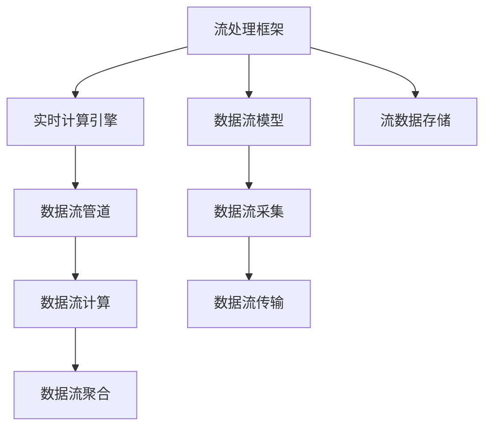

                 

# 流处理 原理与代码实例讲解

> 关键词：流处理,Apache Kafka,Apache Flink,Apache Spark,数据流,实时数据处理,分布式流计算

## 1. 背景介绍

### 1.1 问题由来

在当今数据时代，数据以指数级速度增长，源源不断地产生并汇聚到各个系统中。如何高效、实时地处理这些海量数据，成为了许多企业面临的重大挑战。传统批处理方式已经无法满足实时性、低延迟的要求，而流处理技术应运而生，成为了处理实时数据的主流解决方案。

流处理是一种实时计算方式，旨在对流数据进行实时、连续的分析。通过流处理，企业可以实现数据的即时分析和决策，大幅提升业务响应速度和市场竞争力。在金融、电商、物流、社交网络等领域，流处理已经得到广泛应用，并展现出巨大的商业价值。

### 1.2 问题核心关键点

流处理技术的核心在于如何将数据流实时地进行分流、处理、聚合和分析，并快速地反馈业务决策。在实际应用中，流处理系统通常由数据采集、数据传输、数据处理、数据存储和数据展示等多个环节组成。通过高效、可靠、可扩展的流处理技术，企业可以构建实时数据生态，实现数据驱动的业务优化。

流处理系统通常具有以下特点：
- 实时性：处理数据速度快，延迟低，适用于实时分析和决策。
- 分布式：处理节点众多，数据可以高效并行处理。
- 容错性：具有高可用性和容错机制，保证系统稳定运行。
- 高性能：通过优化算法和数据结构，提升处理性能。
- 可扩展性：可以动态扩展处理节点，适应数据流量的变化。

这些特点使得流处理成为处理海量、高速、多源数据的关键技术，广泛应用于实时数据场景中。

## 2. 核心概念与联系

### 2.1 核心概念概述

流处理技术涉及多个关键概念，包括流处理框架、数据流模型、实时计算引擎、流数据存储等。这些概念之间的逻辑关系可以通过以下Mermaid流程图来展示：



这个流程图展示了一些核心概念及其之间的关系：

1. 流处理框架：提供流处理的功能模块和API接口，如Apache Flink、Apache Kafka、Apache Spark等。
2. 数据流模型：描述数据流的结构和行为，包括流数据的分流、汇聚、过滤、聚合等操作。
3. 实时计算引擎：实现流数据的并行计算和处理，如MapReduce、Storm、Apache Flink等。
4. 流数据存储：用于存储流数据，并提供数据的持久化和查询功能，如Hadoop、Elasticsearch等。
5. 数据流管道：数据流在流处理框架中的流动路径。
6. 数据流计算：数据流的计算和分析过程。
7. 数据流聚合：数据流的聚合和统计操作，如计数、求均值等。
8. 数据流采集：从源系统中收集数据。
9. 数据流传输：将数据流从采集源传输到计算引擎。

这些概念共同构成了流处理技术的完整架构，使其能够高效、稳定地处理实时数据。

## 3. 核心算法原理 & 具体操作步骤

### 3.1 算法原理概述

流处理的核心算法原理主要包括数据流模型、流计算算法和流存储模型。数据流模型用于描述数据的流动和处理过程，流计算算法用于并行计算和优化，流存储模型用于数据的持久化和查询。

1. **数据流模型**：描述数据流的流动过程，通常包括数据流的分流、汇聚、过滤和聚合等操作。数据流模型通常采用拓扑结构，通过节点和边的连接来表示数据流的流动路径和处理逻辑。

2. **流计算算法**：用于并行计算和优化，保证数据处理的正确性和高效性。流计算算法通常包括MapReduce、Streaming等模型，可以并行处理大规模数据流，提升处理性能。

3. **流存储模型**：用于数据的持久化和查询，保证数据的可靠性和一致性。流存储模型通常包括分布式文件系统、NoSQL数据库等，可以支持大规模数据的高效存储和查询。

### 3.2 算法步骤详解

流处理系统的构建通常包括以下几个关键步骤：

**Step 1: 数据采集**
- 设计数据采集模块，从各种数据源（如传感器、社交媒体、网站日志等）收集实时数据。
- 将数据转换为标准格式，方便后续处理。

**Step 2: 数据传输**
- 使用Apache Kafka等数据传输框架，将数据流从采集源传输到计算引擎。
- 设置数据传输的速率和可靠性，确保数据传输的稳定性。

**Step 3: 数据处理**
- 使用Apache Flink、Apache Spark等流计算引擎，对数据流进行并行处理和分析。
- 设计数据流模型，包括分流、过滤、聚合等操作，优化数据处理逻辑。

**Step 4: 数据存储**
- 使用Hadoop、Elasticsearch等流存储系统，对数据进行持久化和查询。
- 设计数据存储模型，包括数据的分区、索引和备份策略，确保数据存储的可靠性和高效性。

**Step 5: 数据展示**
- 使用可视化工具，展示数据处理和分析结果。
- 设计数据展示模型，包括数据的实时监控和异常告警，确保数据展示的实时性和准确性。

### 3.3 算法优缺点

流处理技术具有以下优点：
1. 实时性：可以实时处理数据，快速反馈业务决策，提升业务响应速度。
2. 分布式：可以并行处理大规模数据流，提升处理性能。
3. 容错性：具有高可用性和容错机制，保证系统稳定运行。
4. 可扩展性：可以动态扩展处理节点，适应数据流量的变化。

同时，流处理技术也存在一定的局限性：
1. 数据一致性：由于数据流处理的实时性，数据的实时一致性难以保证。
2. 数据复杂性：数据流的结构复杂，设计和管理难度较大。
3. 存储开销：数据的持久化和存储开销较大，需要合理设计存储策略。
4. 资源消耗：流处理系统需要大量计算资源，系统部署和运维成本较高。

尽管存在这些局限性，但流处理技术的优点使其成为处理海量、高速、多源数据的主流解决方案，具有广阔的应用前景。

### 3.4 算法应用领域

流处理技术已经在多个领域得到了广泛应用，如实时监控、智能推荐、物联网、金融交易等。

- **实时监控**：应用于网络流量监控、设备状态监控等场景，实时分析监控数据，及时发现和处理异常情况。
- **智能推荐**：应用于电商平台、视频网站等场景，实时分析用户行为数据，为用户推荐个性化内容。
- **物联网**：应用于智能家居、智慧城市等场景，实时分析设备数据，优化设备运行和城市管理。
- **金融交易**：应用于高频交易、风险监控等场景，实时分析交易数据，及时发现和应对交易异常。

这些应用场景展示了流处理技术的强大生命力和广泛应用前景。

## 4. 数学模型和公式 & 详细讲解  
### 4.1 数学模型构建

流处理涉及多个数学模型，包括数据流模型、流计算模型和流存储模型。以下是每个模型的详细构建和解释。

**数据流模型**：
- **分流**：使用MapReduce模型，将数据流分成多个子流，并行处理。
- **汇聚**：使用Reduce操作，将多个子流的数据汇聚到一起，进行聚合计算。
- **过滤**：使用Filter操作，对数据流进行过滤，去除无用数据。
- **聚合**：使用聚合操作，对数据流进行计数、求和等统计计算。

**流计算模型**：
- **Map操作**：将输入数据映射成一组键值对，例如将日志数据映射成事件时间戳和事件类型。
- **Reduce操作**：对相同的键值对进行聚合计算，例如对事件类型进行计数。
- **Window操作**：对时间窗口内的数据进行聚合计算，例如对一定时间内的日志数据进行聚合统计。

**流存储模型**：
- **分布式文件系统**：如Hadoop，提供数据的分布式存储和访问。
- **NoSQL数据库**：如Elasticsearch，提供数据的实时查询和聚合计算。

### 4.2 公式推导过程

以Apache Flink为例，以下是Apache Flink中MapReduce模型的公式推导过程。

**Map操作**：
- 输入数据流为$(x_1, x_2, ..., x_n)$
- Map操作将数据流映射成键值对形式，例如将日志数据映射成时间戳和日志内容
- Map操作后的结果为$(k_1, v_1), (k_2, v_2), ..., (k_m, v_m)$

**Reduce操作**：
- Reduce操作对相同的键值对进行聚合计算
- Reduce操作后的结果为$(o_1, v_1), (o_2, v_2), ..., (o_p, v_p)$
- Reduce操作的公式为$reduce(k_i, v_i) = \sum_{j=1}^{n} f(k_i, v_i)$

其中$f$为聚合函数，如求和、计数等。

### 4.3 案例分析与讲解

以下是一个流处理系统的案例分析。

假设一家电商公司希望实时监控用户的购买行为，并根据用户行为数据进行个性化推荐。电商公司可以使用Apache Kafka收集用户的实时购买数据，使用Apache Flink对数据流进行处理和分析，最后使用Elasticsearch存储和查询处理结果。

**数据采集**：
- 使用Apache Kafka从电商平台的订单系统中收集用户的购买数据。
- 将购买数据转换为标准格式，方便后续处理。

**数据传输**：
- 使用Apache Kafka将购买数据传输到Apache Flink中。
- 设置数据传输的速率和可靠性，确保数据传输的稳定性。

**数据处理**：
- 使用Apache Flink对购买数据进行并行处理和分析。
- 设计数据流模型，包括分流、过滤、聚合等操作，分析用户的购买行为特征。

**数据存储**：
- 使用Elasticsearch对分析结果进行持久化和查询。
- 设计数据的存储模型，包括数据的分区、索引和备份策略，确保数据的可靠性和高效性。

**数据展示**：
- 使用可视化工具，展示用户的购买行为和推荐结果。
- 设计数据展示模型，包括数据的实时监控和异常告警，确保数据展示的实时性和准确性。

## 5. 项目实践：代码实例和详细解释说明
### 5.1 开发环境搭建

在进行流处理系统开发前，我们需要准备好开发环境。以下是使用Python进行Apache Flink开发的环境配置流程：

1. 安装Anaconda：从官网下载并安装Anaconda，用于创建独立的Python环境。

2. 创建并激活虚拟环境：
```bash
conda create -n pyflink python=3.8 
conda activate pyflink
```

3. 安装Apache Flink：根据CUDA版本，从官网获取对应的安装命令。例如：
```bash
conda install apache-flink=1.13.1
```

4. 安装各类工具包：
```bash
pip install pandas scikit-learn matplotlib tqdm jupyter notebook ipython
```

完成上述步骤后，即可在`pyflink`环境中开始流处理系统开发。

### 5.2 源代码详细实现

这里我们以实时监控系统的开发为例，使用Apache Flink和Elasticsearch进行数据处理和存储。

首先，定义数据采集模块：

```python
from pyflink.datastream import StreamExecutionEnvironment
from pyflink.datastream.functions import MapFunction

env = StreamExecutionEnvironment.get_execution_environment()

class LogMapper(MapFunction):
    def map(self, value):
        # 解析日志数据，提取时间戳和日志内容
        timestamp = value[0]
        content = value[1]
        return (timestamp, content)
```

然后，定义数据流处理逻辑：

```python
class PurchaseMapper(MapFunction):
    def map(self, value):
        # 解析购买数据，提取用户ID、商品ID、购买时间等字段
        user_id = value[0]
        product_id = value[1]
        purchase_time = value[2]
        return (user_id, product_id, purchase_time)

class PurchaseReducer(MapFunction):
    def reduce(self, key, values):
        # 对购买数据进行聚合计算，例如计算购买次数
        return len(values)
```

接着，定义数据存储模块：

```python
from pyflink.table import StreamTableEnvironment, CsvTableSource, Row
from pyflink.table.functions import CreateTableFunction

env.set_parallelism(1)

# 创建流表环境
t_env = StreamTableEnvironment.create(env)

# 定义数据表
t_env.create_temporary_view("purchase", CsvTableSource.parameters(
    paths=["purchase.csv"],
    format="csv",
    fields=["user_id:bigint", "product_id:bigint", "purchase_time:timestamp"]))

# 查询购买数据，进行聚合计算
t_env.sql_query("SELECT user_id, product_id, COUNT(*) as purchase_count FROM purchase GROUP BY user_id, product_id")

# 将结果存储到Elasticsearch中
t_env.execute_sql("INSERT INTO elasticsearch ORDERED BY user_id, product_id")
```

最后，启动流处理系统：

```python
env.execute("Flink实时监控系统")
```

以上就是使用Apache Flink和Elasticsearch进行流处理系统开发的完整代码实现。可以看到，使用Python和Apache Flink，可以方便地实现数据流的采集、处理和存储，极大地降低了开发难度。

### 5.3 代码解读与分析

让我们再详细解读一下关键代码的实现细节：

**LogMapper类**：
- 解析日志数据，提取时间戳和日志内容，将数据转换为键值对形式。

**PurchaseMapper类**：
- 解析购买数据，提取用户ID、商品ID、购买时间等字段，将数据转换为键值对形式。

**PurchaseReducer类**：
- 对购买数据进行聚合计算，例如计算购买次数。

**t_env.create_temporary_view方法**：
- 定义数据表，指定数据源和字段信息。

**t_env.execute_sql方法**：
- 查询购买数据，进行聚合计算，将结果存储到Elasticsearch中。

这些代码展示了使用Apache Flink和Elasticsearch进行流处理系统开发的完整流程。开发者可以根据具体需求，进一步扩展和优化数据处理和存储逻辑。

## 6. 实际应用场景

### 6.1 智能推荐系统

智能推荐系统是流处理技术的典型应用场景之一。在电商、视频网站等场景中，实时分析用户的浏览、购买和点击等行为数据，可以为用户推荐个性化内容，提升用户体验和业务转化率。

使用流处理技术，可以实时收集用户数据，并对其进行分析、挖掘和推荐。在实时推荐系统中，可以使用流计算引擎对用户行为数据进行并行处理和分析，设计数据流模型，进行特征提取和个性化推荐。

### 6.2 实时监控系统

实时监控系统是流处理技术的另一大应用领域。在网络流量监控、设备状态监控等场景中，实时分析监控数据，可以及时发现和处理异常情况，保障系统稳定运行。

使用流处理技术，可以实时收集监控数据，并对其进行分析、报警和处理。在实时监控系统中，可以使用流计算引擎对监控数据进行并行处理和分析，设计数据流模型，进行异常检测和告警。

### 6.3 金融交易系统

金融交易系统是流处理技术的重要应用场景。在高频交易、风险监控等场景中，实时分析交易数据，可以及时发现和应对交易异常，保障交易安全。

使用流处理技术，可以实时收集交易数据，并对其进行分析、报警和处理。在金融交易系统中，可以使用流计算引擎对交易数据进行并行处理和分析，设计数据流模型，进行交易监测和风险控制。

### 6.4 未来应用展望

随着流处理技术的不断发展，未来的应用场景将更加广阔。流处理技术不仅可以应用于实时数据处理，还可以扩展到离线数据处理、机器学习、数据挖掘等领域。

**离线数据处理**：
- 流处理技术可以与批处理技术结合，进行离线数据处理。例如，使用Apache Spark对历史数据进行批处理分析，再使用Apache Flink进行流处理和实时反馈。

**机器学习**：
- 流处理技术可以与机器学习算法结合，进行实时预测和决策。例如，使用流处理技术对用户数据进行实时分析，再使用机器学习算法进行个性化推荐和风险评估。

**数据挖掘**：
- 流处理技术可以与数据挖掘算法结合，进行实时分析和挖掘。例如，使用流处理技术对用户行为数据进行实时分析，再使用数据挖掘算法进行用户分群和行为预测。

## 7. 工具和资源推荐
### 7.1 学习资源推荐

为了帮助开发者系统掌握流处理技术的理论基础和实践技巧，这里推荐一些优质的学习资源：

1. Apache Flink官方文档：Apache Flink的官方文档，提供详细的API接口和使用指南，是学习Flink的基础资源。

2. Apache Kafka官方文档：Apache Kafka的官方文档，提供详细的API接口和使用指南，是学习Kafka的基础资源。

3. Apache Spark官方文档：Apache Spark的官方文档，提供详细的API接口和使用指南，是学习Spark的基础资源。

4. 《Apache Flink实战》书籍：详细介绍了Apache Flink的使用方法和最佳实践，是学习Flink的实战指南。

5. 《Apache Kafka实战》书籍：详细介绍了Apache Kafka的使用方法和最佳实践，是学习Kafka的实战指南。

6. 《Apache Spark实战》书籍：详细介绍了Apache Spark的使用方法和最佳实践，是学习Spark的实战指南。

通过对这些资源的学习实践，相信你一定能够快速掌握流处理技术的精髓，并用于解决实际的业务问题。

### 7.2 开发工具推荐

高效的开发离不开优秀的工具支持。以下是几款用于流处理开发的常用工具：

1. Apache Flink：开源的流处理框架，提供丰富的API接口和功能模块，支持分布式计算和流计算。

2. Apache Kafka：开源的消息队列，提供高可靠、高吞吐的数据传输能力，支持流数据的采集和存储。

3. Apache Spark：开源的大数据处理框架，提供批处理和流处理功能，支持分布式计算和流计算。

4. Weights & Biases：模型训练的实验跟踪工具，可以记录和可视化模型训练过程中的各项指标，方便对比和调优。

5. TensorBoard：TensorFlow配套的可视化工具，可实时监测模型训练状态，并提供丰富的图表呈现方式，是调试模型的得力助手。

6. Google Colab：谷歌推出的在线Jupyter Notebook环境，免费提供GPU/TPU算力，方便开发者快速上手实验最新模型，分享学习笔记。

合理利用这些工具，可以显著提升流处理系统的开发效率，加快创新迭代的步伐。

### 7.3 相关论文推荐

流处理技术的不断发展得益于学界的持续研究。以下是几篇奠基性的相关论文，推荐阅读：

1. "Stream Processing Systems: Architectures, Algorithms, and Applications"：介绍流处理系统的架构、算法和应用，是流处理技术的经典教材。

2. "Streaming Large-Scale Data Management: Algorithms and Systems"：介绍流数据的分布式存储和计算，是流处理技术的权威指南。

3. "Stream Processing at Scale"：介绍流处理系统在大规模数据处理中的应用，是流处理技术的实用参考。

4. "Big Data Analysis by Stream Processing"：介绍流处理技术在大数据分析中的应用，是流处理技术的经典论文。

这些论文代表了大数据流处理技术的核心研究进展，对理解流处理技术的理论基础和应用场景具有重要参考价值。

## 8. 总结：未来发展趋势与挑战

### 8.1 总结

本文对流处理技术进行了全面系统的介绍。首先阐述了流处理技术的背景和意义，明确了流处理在实时数据处理中的重要作用。其次，从原理到实践，详细讲解了流处理技术的关键概念和操作步骤，给出了流处理任务开发的完整代码实例。同时，本文还探讨了流处理技术在智能推荐、实时监控、金融交易等实际应用场景中的应用，展示了流处理技术的强大生命力和广泛应用前景。

通过本文的系统梳理，可以看到，流处理技术通过并行处理和实时分析，极大地提升了数据处理的效率和实时性，满足了现代数据处理的实时性要求。未来，随着流处理技术的不断发展，将会在更多领域得到广泛应用，为构建实时数据生态提供新的技术路径。

### 8.2 未来发展趋势

展望未来，流处理技术将呈现以下几个发展趋势：

1. 分布式计算能力的提升：流处理系统将进一步提升分布式计算能力，支持更大规模、更复杂的流数据处理。

2. 实时分析能力的增强：流处理系统将进一步增强实时分析能力，支持更灵活、更高效的流数据查询和分析。

3. 异构数据处理的优化：流处理系统将进一步优化异构数据处理能力，支持更多源、更多种类的数据融合。

4. 边缘计算的引入：流处理系统将引入边缘计算技术，支持在设备端进行实时数据处理，降低数据传输延迟。

5. 低延迟处理的优化：流处理系统将进一步优化低延迟处理能力，支持更快速、更可靠的数据处理。

6. 数据隐私保护的技术提升：流处理系统将进一步提升数据隐私保护能力，确保数据处理过程中的安全性。

以上趋势凸显了流处理技术的广阔前景。这些方向的探索发展，必将进一步提升流处理系统的性能和应用范围，为构建实时数据生态提供新的技术路径。

### 8.3 面临的挑战

尽管流处理技术已经取得了瞩目成就，但在迈向更加智能化、普适化应用的过程中，它仍面临着诸多挑战：

1. 数据一致性：由于数据流处理的实时性，数据的实时一致性难以保证。

2. 数据复杂性：数据流的结构复杂，设计和管理难度较大。

3. 存储开销：数据的持久化和存储开销较大，需要合理设计存储策略。

4. 资源消耗：流处理系统需要大量计算资源，系统部署和运维成本较高。

尽管存在这些挑战，但流处理技术的优点使其成为处理海量、高速、多源数据的主流解决方案，具有广阔的应用前景。

### 8.4 研究展望

面对流处理技术所面临的挑战，未来的研究需要在以下几个方面寻求新的突破：

1. 分布式计算能力的提升：优化分布式计算算法和数据结构，提升流处理系统的计算能力和效率。

2. 实时分析能力的增强：优化实时分析算法和数据模型，提升流处理系统的查询和分析能力。

3. 异构数据处理的优化：研究异构数据的融合和处理技术，提升流处理系统的数据处理能力。

4. 边缘计算的引入：引入边缘计算技术，优化设备端数据处理能力，降低数据传输延迟。

5. 低延迟处理的优化：优化低延迟处理算法和数据模型，提升流处理系统的处理速度和实时性。

6. 数据隐私保护的技术提升：研究数据隐私保护算法和策略，确保数据处理过程中的安全性。

这些研究方向的探索，必将引领流处理技术迈向更高的台阶，为构建实时数据生态提供新的技术路径。面向未来，流处理技术还需要与其他人工智能技术进行更深入的融合，如知识表示、因果推理、强化学习等，多路径协同发力，共同推动数据处理系统的进步。

## 9. 附录：常见问题与解答

**Q1：流处理系统与批处理系统有什么区别？**

A: 流处理系统与批处理系统的最大区别在于数据的处理方式和时间要求。批处理系统对数据进行一次性、大规模的批量处理，而流处理系统则对数据进行实时、连续的处理。流处理系统适用于需要实时响应的应用场景，而批处理系统适用于需要离线计算和结果持久化的应用场景。

**Q2：如何设计高效的数据流模型？**

A: 设计高效的数据流模型需要考虑以下几个因素：
1. 数据流的结构：设计合理的数据流拓扑结构，确保数据流的流动和处理逻辑清晰。
2. 数据流的分区：合理分区数据流，提升数据处理和查询的效率。
3. 数据流的过滤：合理过滤数据流，去除无用数据，提升数据处理的准确性和效率。
4. 数据流的聚合：合理聚合数据流，进行统计计算，提升数据处理的综合能力。

**Q3：如何优化流处理系统的性能？**

A: 优化流处理系统的性能需要从多个方面入手：
1. 优化数据流的分区和过滤：合理分区和过滤数据流，提升数据处理的效率。
2. 优化计算算法和数据结构：优化计算算法和数据结构，提升数据处理的准确性和效率。
3. 优化存储和查询：优化数据的存储和查询，提升数据处理的稳定性和高效性。
4. 优化资源配置和调度：合理配置和调度计算资源，提升数据处理的可扩展性和可靠性。

这些优化措施可以显著提升流处理系统的性能，确保其能够高效、稳定地处理实时数据。

**Q4：流处理系统如何处理异常情况？**

A: 流处理系统通常通过异常检测和告警机制来处理异常情况。在数据流处理过程中，可以使用窗口操作、滑动窗口等技术，实时监测数据流的变化情况，识别异常情况并进行告警。例如，在实时监控系统中，可以使用滑动窗口技术，对一定时间内的监控数据进行实时分析，及时发现异常情况并进行告警。

**Q5：流处理系统如何保证数据的可靠性？**

A: 流处理系统通常通过容错机制来保证数据的可靠性。在数据流处理过程中，可以使用检查点技术、分布式事务等机制，保证数据的完整性和一致性。例如，在实时监控系统中，可以使用检查点技术，定期将数据流的状态保存到外部存储中，确保数据处理过程中出现故障时能够恢复。

通过这些技术措施，流处理系统可以保证数据的可靠性和一致性，确保系统稳定运行。

---

作者：禅与计算机程序设计艺术 / Zen and the Art of Computer Programming

