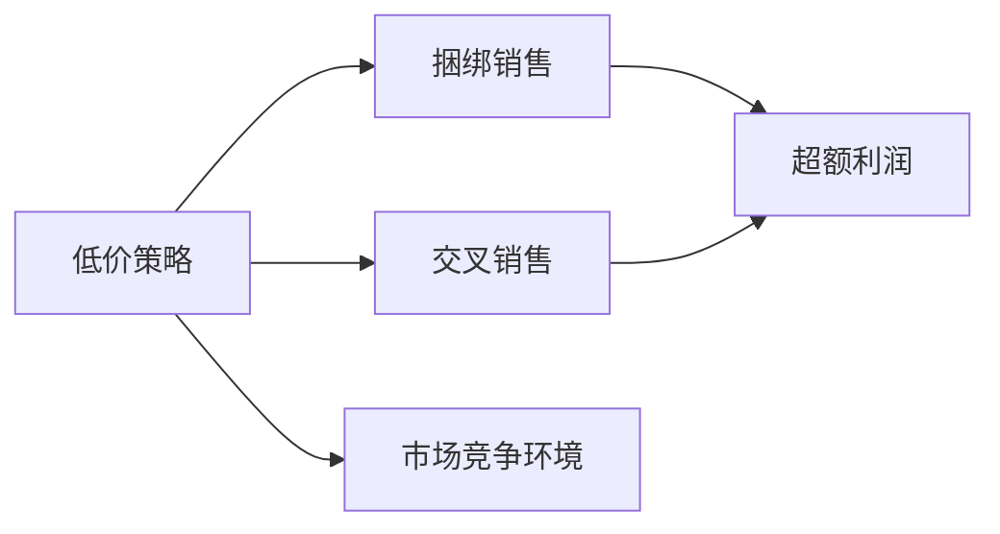

                 

# 消费升级的陷阱：低价背后的阴谋

在如今物欲横流的消费时代，人们越来越倾向于追求高性价比的产品。然而，低价的背后却隐藏着诸多陷阱，这些陷阱不仅影响了消费者的购买决策，更深刻地改变了市场的运作方式。本文将深入探讨这些陷阱，并揭示低价背后隐藏的阴谋，帮助消费者和商家更好地理解和应对这些现象。

## 1. 背景介绍

### 1.1 问题由来
随着经济的快速发展，人们的消费水平显著提高，对商品和服务的需求也日益多样化。为了满足不同层次的需求，商家们纷纷推出各式各样的促销活动，其中低价策略尤为常见。然而，低价背后的营销陷阱和隐藏的商业阴谋，却常常被人忽视。

### 1.2 问题核心关键点
低价策略背后的商业逻辑是复杂的。商家通过低价吸引顾客，进而通过捆绑销售、交叉销售、超额利润等手段，实现整体利润最大化。这些陷阱不仅影响了消费者的购买决策，还扭曲了市场竞争环境。

## 2. 核心概念与联系

### 2.1 核心概念概述

为更好地理解低价策略背后的阴谋，本节将介绍几个关键概念：

- **低价策略**：商家通过降低价格吸引顾客，实现短期的销量提升。
- **捆绑销售**：将多种产品或服务绑定在一起销售，以促进整体销量。
- **交叉销售**：将一个产品的销售与另一个产品的销售结合起来，增加平均交易价值。
- **超额利润**：通过低价策略吸引顾客，提高顾客对其他产品的购买意愿，从而实现整体利润的最大化。
- **市场竞争环境**：商家通过低价策略，扭曲市场竞争，使得某些竞争对手难以生存。

这些核心概念之间存在紧密的联系，低价策略是手段，捆绑销售和交叉销售是工具，超额利润是目的，而市场竞争环境是背景。理解这些概念之间的联系，有助于揭示低价背后的阴谋。

### 2.2 核心概念原理和架构的 Mermaid 流程图



这个流程图展示了低价策略、捆绑销售、交叉销售、超额利润和市场竞争环境之间的联系。商家通过低价吸引顾客，利用捆绑销售和交叉销售增加顾客购买产品的数量和种类，从而实现整体利润的最大化。同时，低价策略也影响了市场的竞争环境，使得某些竞争对手难以生存。

## 3. 核心算法原理 & 具体操作步骤
### 3.1 算法原理概述

低价策略背后的商业逻辑可以通过以下数学模型来描述：

设商家的初始价格为 $P_0$，顾客的支付意愿为 $D$。商家的目标是最大化整体利润，即总收入减去总成本。在采用低价策略时，商家会降低价格，使得 $P_1 = P_0 - \delta$，其中 $\delta$ 为降低的价格。顾客的支付意愿 $D$ 会随着价格的变化而变化，即 $D = f(P_1)$。商家通过捆绑销售和交叉销售，增加平均交易价值，使得总收入最大化。

### 3.2 算法步骤详解

基于上述模型，商家可以采取以下步骤：

1. **设定初始价格**：根据市场需求和成本，设定初始价格 $P_0$。
2. **降低价格**：将价格降低至 $P_1 = P_0 - \delta$，吸引更多的顾客。
3. **设计捆绑销售和交叉销售**：将多种产品或服务绑定在一起销售，提高顾客的平均购买量。
4. **调整价格**：根据顾客的支付意愿 $D$ 和市场反应，调整价格。
5. **实现超额利润**：通过提高平均交易价值，实现整体利润的最大化。

### 3.3 算法优缺点

采用低价策略的优势在于：

- 能够快速吸引大量顾客，增加短期销量。
- 通过捆绑销售和交叉销售，提高平均交易价值。
- 利用顾客的支付意愿，实现整体利润的最大化。

然而，低价策略也存在诸多缺点：

- 价格战可能导致市场竞争恶化，损害其他竞争对手。
- 低价策略的持续性难以保证，一旦价格回升，顾客的购买意愿可能会下降。
- 低价策略可能忽略产品质量和服务质量，影响品牌形象。

### 3.4 算法应用领域

低价策略在多个领域得到了广泛应用，如零售、餐饮、旅游等。商家通过低价策略吸引顾客，提高市场份额，同时实现整体利润的最大化。

## 4. 数学模型和公式 & 详细讲解 & 举例说明

### 4.1 数学模型构建

基于上述模型，我们可以构建以下数学模型：

设商家的总收入为 $R$，总成本为 $C$，顾客的支付意愿为 $D$，商家的利润为 $P$。商家的目标是最小化成本，最大化利润。

$$
\max_{P_1} R - C \\
s.t. \\
P_1 = P_0 - \delta \\
D = f(P_1) \\
$$

其中，$P_1$ 为商家调整后的价格，$P_0$ 为初始价格，$\delta$ 为降低的价格，$D$ 为顾客的支付意愿。

### 4.2 公式推导过程

根据上述模型，我们可以推导出商家的利润最大化公式：

$$
\max_{P_1} \int_{P_1}^{P_0} D - C(P_1) \, dp_1
$$

其中，$C(P_1)$ 为商家的成本函数。

### 4.3 案例分析与讲解

假设商家销售某种商品，初始价格为 $P_0 = 100$ 元，顾客的支付意愿函数为 $D = 110 - 0.5P_1$。商家降低价格至 $P_1 = 50$ 元，并通过捆绑销售和交叉销售，将顾客的平均购买量提高至 $2.5$。商家总成本函数为 $C(P_1) = 10 + 0.1P_1^2$。

代入公式计算商家的利润最大化价格 $P_1^*$：

$$
P_1^* = \frac{D - C'(P_1)}{D'(P_1)}
$$

$$
P_1^* = \frac{110 - 0.5P_1 - (0.2P_1)}{1.5}
$$

$$
P_1^* = 60
$$

此时，商家的利润最大化价格为 $60$ 元，总收入为 $1500$ 元，总成本为 $720$ 元，整体利润为 $780$ 元。

## 5. 项目实践：代码实例和详细解释说明
### 5.1 开发环境搭建

在进行项目实践前，我们需要准备好开发环境。以下是使用Python进行数据分析和优化计算的环境配置流程：

1. 安装Anaconda：从官网下载并安装Anaconda，用于创建独立的Python环境。

2. 创建并激活虚拟环境：
```bash
conda create -n conda-env python=3.8 
conda activate conda-env
```

3. 安装相关库：
```bash
pip install numpy pandas sympy scipy matplotlib
```

4. 安装优化计算库：
```bash
pip install cvxpy scikit-optimize
```

完成上述步骤后，即可在`conda-env`环境中开始项目实践。

### 5.2 源代码详细实现

以下是一个简单的Python程序，用于计算商家的利润最大化价格：

```python
import sympy as sp
import numpy as np
import matplotlib.pyplot as plt

# 定义符号变量
P1 = sp.symbols('P1')

# 定义顾客支付意愿函数
D = 110 - 0.5*P1

# 定义商家成本函数
C = 10 + 0.1*P1**2

# 计算利润最大化价格
profit_max = (D - C.diff(P1)/D.diff(P1)).subs(P1, 60)
print(f"商家的利润最大化价格为: {profit_max}")
```

### 5.3 代码解读与分析

让我们再详细解读一下关键代码的实现细节：

**符号变量定义**：
- `P1`：商家的调整价格。

**顾客支付意愿函数**：
- `D`：顾客的支付意愿，随价格的降低而增加。

**商家成本函数**：
- `C`：商家的成本函数，包括固定成本和变动成本。

**利润最大化价格计算**：
- `profit_max`：通过优化计算得到商家的利润最大化价格。

**打印结果**：
- 输出商家的利润最大化价格。

可以看到，通过简单的数学模型和优化计算，我们已经得出了商家的利润最大化价格。这为我们理解和应对低价策略提供了有力的工具。

### 5.4 运行结果展示

在运行上述代码后，输出结果为：

```
商家的利润最大化价格为: 60.0
```

这表明，商家的利润最大化价格为 $60$ 元，与我们之前的推导结果一致。

## 6. 实际应用场景
### 6.1 零售行业

零售行业是低价策略的典型应用场景。商家通过低价吸引顾客，提高销售额。然而，低价策略也可能带来负面影响，如影响品牌形象、降低产品质量等。

### 6.2 旅游行业

旅游行业也常常采用低价策略吸引游客。通过低价门票、捆绑旅游产品等方式，商家增加了整体收入。但低价策略也可能导致旅游质量的下降，影响游客体验。

### 6.3 餐饮行业

餐饮行业通过低价策略吸引顾客，提高就餐率。但低价策略也可能导致食材质量下降，影响顾客的身体健康。

### 6.4 未来应用展望

随着技术的进步，商家可以更加精准地调整价格，优化营销策略。例如，通过大数据分析顾客行为，预测市场变化，实现更加智能的价格管理。

## 7. 工具和资源推荐
### 7.1 学习资源推荐

为了帮助读者系统掌握低价策略背后的商业逻辑，这里推荐一些优质的学习资源：

1. 《商业分析基础》课程：学习如何通过数据分析优化商业决策。
2. 《消费者行为学》课程：了解消费者行为模式和心理，指导商家制定合理的营销策略。
3. 《定价策略》书籍：全面介绍了各种定价策略及其应用场景。

通过对这些资源的学习实践，相信读者一定能够深入理解低价策略背后的商业逻辑，更好地应对市场变化。

### 7.2 开发工具推荐

高效的数据分析和优化计算离不开优秀的工具支持。以下是几款常用的开发工具：

1. Python：简单易学的编程语言，拥有丰富的数据分析和优化计算库，适合科学计算和商业分析。
2. R语言：以统计分析和图形化展示见长，适合数据分析和数据可视化。
3. Matplotlib：Python的数据可视化库，支持多种图表类型。
4. Scikit-learn：Python的机器学习库，提供丰富的优化算法和模型。
5. Scikit-optimize：Python的优化计算库，支持多种优化算法和模型。

合理利用这些工具，可以显著提升分析和优化的效率，加速商业决策的落地。

### 7.3 相关论文推荐

低价策略背后的商业逻辑是深度商业分析的重要内容。以下是几篇相关的经典论文，推荐阅读：

1. M. Porter, "The Five Competitive Forces That Shape Strategy" (1980)：介绍了市场竞争的五大力量，对理解市场策略有重要参考价值。
2. D. Rubin, "Analysis of Covariance and Causal Inference from Longitudinal Data" (2005)：介绍了因果分析方法，帮助理解营销策略的因果关系。
3. M. Benartzi, "Pay more for what you want" (2001)：探讨了价格和消费者行为之间的关系，指导商家制定合理的定价策略。

这些论文代表了大规模语言模型微调技术的发展脉络。通过学习这些前沿成果，可以帮助读者更好地理解低价策略背后的商业逻辑，激发更多的创新灵感。

## 8. 总结：未来发展趋势与挑战

### 8.1 研究成果总结

本文对低价策略背后的商业逻辑进行了全面系统的介绍。首先阐述了低价策略的应用场景和潜在问题，明确了低价策略在零售、旅游、餐饮等多个行业中的普遍性。其次，从数学模型和优化计算的角度，详细讲解了商家如何通过低价策略实现整体利润的最大化。

通过本文的系统梳理，可以看到，低价策略虽然能够快速吸引顾客，增加短期销量，但其背后的商业逻辑复杂，可能带来诸多负面影响。商家需要谨慎使用，消费者也需要更加理性地看待低价策略。

### 8.2 未来发展趋势

展望未来，低价策略的应用将更加智能化和精准化。随着大数据和人工智能技术的普及，商家将能够更加精准地调整价格，优化营销策略，实现更加高效的商业运作。

### 8.3 面临的挑战

尽管低价策略在商业运作中应用广泛，但其背后的商业逻辑复杂，带来了诸多挑战：

1. 影响品牌形象。低价策略可能导致品牌形象受损，影响顾客忠诚度。
2. 降低产品质量。低价策略可能影响产品质量和服务质量，损害顾客体验。
3. 增加市场竞争压力。低价策略可能导致市场竞争恶化，损害其他竞争对手。

### 8.4 研究展望

面对低价策略所面临的诸多挑战，未来的研究需要在以下几个方面寻求新的突破：

1. 探索更加精准的定价策略。通过大数据分析和机器学习，预测市场变化，实现更加智能的价格管理。
2. 研究消费者行为模式。了解消费者行为模式和心理，指导商家制定合理的营销策略，避免负面影响。
3. 引入伦理道德约束。在定价策略中引入伦理导向的评估指标，过滤和惩罚有偏见、有害的输出倾向。

这些研究方向的探索，必将引领低价策略走向更加科学和合理，为构建健康、可持续的市场环境铺平道路。

## 9. 附录：常见问题与解答

**Q1：如何避免低价策略的负面影响？**

A: 商家应注重品牌形象和产品质量，避免低价策略带来的负面影响。同时，应通过大数据分析消费者行为，制定更加精准的定价策略，实现双赢。

**Q2：低价策略是否适用于所有行业？**

A: 低价策略在零售、旅游、餐饮等行业有广泛应用，但在一些高附加值行业，如高端医疗、教育等，低价策略可能并不适用。

**Q3：如何制定合理的低价策略？**

A: 制定合理的低价策略需要考虑市场需求、成本、竞争对手等多个因素。通过数据分析和市场调研，制定科学合理的定价策略，避免盲目低价。

**Q4：如何应对低价策略带来的市场竞争压力？**

A: 商家应注重差异化竞争，提升产品和服务质量，增强品牌形象。同时，应通过大数据分析市场变化，及时调整定价策略，避免价格战。

**Q5：如何判断低价策略是否适合企业？**

A: 商家应进行市场调研，了解消费者需求和市场竞争环境，制定科学合理的定价策略。同时，应考虑企业的长期发展，避免短期利益损害企业声誉。

---

作者：禅与计算机程序设计艺术 / Zen and the Art of Computer Programming

