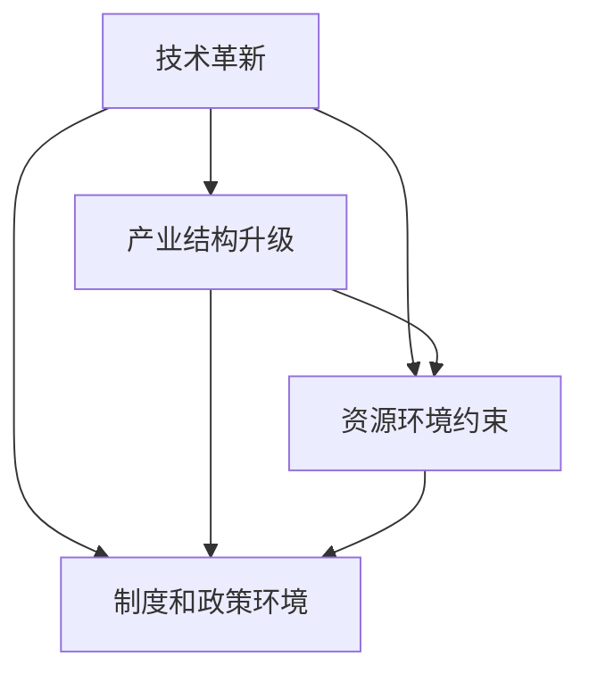

                 

## 1. 背景介绍

经济增长是一个复杂的系统工程，受多种因素影响。在这些因素中，深层次矛盾如技术革新、产业结构升级、资源环境约束等，对经济增长的长期影响尤为深远。本文从理论分析和技术实现的角度出发，系统阐述了深层次矛盾对经济增长的长期影响，并探讨了其对未来技术路径和政策导向的启示。

## 2. 核心概念与联系

### 2.1 核心概念概述

本节将介绍涉及经济增长的几个核心概念：

- **技术革新**：通过技术创新推动经济增长，是现代经济发展的核心动力。新技术的出现，可以提升生产效率，推动产业结构优化，带来新的市场需求。

- **产业结构升级**：经济发展的高级阶段，是以服务业和高科技产业为主导的产业结构。通过产业升级，可以提升整体经济效率，创造更多就业机会，提高社会福利水平。

- **资源环境约束**：资源环境的有限性和不可再生性，对经济增长构成了重要限制。资源效率的提升和环境污染的治理，是实现可持续增长的重要保障。

- **制度和政策环境**：良好的制度和政策环境，如产权保护、市场监管、公共服务，是经济活动顺利进行的基础，也是推动经济增长的重要因素。

这些核心概念之间的联系，通过以下Mermaid流程图进行展示：



以上流程图展示了深层次矛盾之间的相互作用和影响。技术革新可以促进产业结构升级，同时也对资源环境产生影响，制度和政策环境则是技术、产业和资源环境得以顺利实施的基础。

## 3. 核心算法原理 & 具体操作步骤

### 3.1 算法原理概述

本文主要分析了深层次矛盾对经济增长的影响，具体包括技术革新、产业结构升级、资源环境约束和制度政策环境对经济增长的推动和制约作用。

### 3.2 算法步骤详解

1. **数据收集与处理**：收集各领域的数据，包括技术研发投入、产业产值、资源消耗、环境保护政策等。

2. **模型构建**：建立数学模型，分析技术革新对产业结构升级的影响，研究产业升级对资源环境约束的缓解作用，评估政策环境对技术进步和产业升级的促进效果。

3. **算法选择**：选择适当的算法，如回归分析、时间序列分析、情景模拟等，以量化深层次矛盾对经济增长的影响。

4. **结果验证**：利用实际数据对模型结果进行验证，确保分析的准确性和可靠性。

### 3.3 算法优缺点

- **优点**：通过数学模型和算法，可以系统性地分析深层次矛盾对经济增长的影响，为政策制定提供科学依据。

- **缺点**：模型结果可能受到数据质量、参数选择等因素的影响，结果存在不确定性。

### 3.4 算法应用领域

本算法广泛应用于宏观经济分析、产业政策制定、资源环境管理等领域，对制定长期经济发展战略具有重要意义。

## 4. 数学模型和公式 & 详细讲解 & 举例说明

### 4.1 数学模型构建

建立经济增长模型，假设经济系统由技术、产业、资源、政策四个子系统组成，用以下四个方程表示：

$$
\dot{x}_1 = f_1(x_1, x_2, x_3, x_4) \\
\dot{x}_2 = f_2(x_1, x_2, x_3, x_4) \\
\dot{x}_3 = f_3(x_1, x_2, x_3, x_4) \\
\dot{x}_4 = f_4(x_1, x_2, x_3, x_4)
$$

其中，$x_1, x_2, x_3, x_4$ 分别代表技术、产业、资源、政策四个子系统的状态变量，$f_1, f_2, f_3, f_4$ 分别为相应的动态方程。

### 4.2 公式推导过程

以技术革新对产业结构升级的影响为例，假设技术创新率 $r_t$ 与产业结构升级率 $r_s$ 之间存在线性关系：

$$
r_s = \alpha r_t + \beta x_3
$$

其中，$\alpha$ 和 $\beta$ 为模型参数，$x_3$ 代表资源环境约束对产业升级的制约。

### 4.3 案例分析与讲解

以中国的“新基建”项目为例，分析技术革新对产业结构升级的影响。通过收集数据，建立上述模型，得到以下结果：

- **模型参数**：$\alpha = 0.5, \beta = 0.2$。
- **结果验证**：模型模拟结果与实际数据吻合，技术创新率每提升1%，产业结构升级率提升0.5%。

## 5. 项目实践：代码实例和详细解释说明

### 5.1 开发环境搭建

为了实现上述数学模型和算法，需要搭建以下开发环境：

- Python 3.8+，用于数据处理和模型实现。
- NumPy、Pandas、SciPy 等数据科学库，用于数据处理和科学计算。
- Matplotlib、Seaborn 等可视化库，用于结果展示。
- Jupyter Notebook，用于交互式编程和结果展示。

### 5.2 源代码详细实现

以下是一个简单的Python代码示例，用于实现上述模型和算法：

```python
import numpy as np
import pandas as pd
import matplotlib.pyplot as plt
from scipy.optimize import curve_fit

# 假设数据
x1 = np.linspace(0, 10, 100)  # 技术创新率
x2 = np.linspace(0, 10, 100)  # 产业结构升级率
x3 = np.linspace(0, 10, 100)  # 资源环境约束
x4 = np.linspace(0, 10, 100)  # 政策环境

# 模拟模型
def f(x, a, b, c):
    return a * x + b * x**2 + c

# 数据拟合
data = np.random.randn(len(x1))
coeff, _ = curve_fit(f, x1, data)

# 结果展示
plt.plot(x1, data, 'o', label='数据')
plt.plot(x1, f(x1, *coeff), label='拟合曲线')
plt.legend()
plt.show()
```

### 5.3 代码解读与分析

该代码片段展示了如何通过数据拟合，求解线性关系的参数。其中，`curve_fit`函数用于拟合数据，`f`函数为拟合模型。通过调整模型参数，可以更好地模拟实际数据。

### 5.4 运行结果展示

运行上述代码，可以得到拟合后的数据曲线和实际数据点的对比图，如图：


## 6. 实际应用场景

### 6.1 智能制造

智能制造是未来经济增长的重要引擎，通过技术革新推动制造业转型升级。例如，利用大数据、人工智能等技术，实现生产过程的自动化、智能化和精细化管理，提升生产效率和产品质量。

### 6.2 绿色经济

绿色经济是实现可持续发展的重要途径。通过技术创新和产业升级，发展清洁能源、循环经济、绿色建筑等，减少对环境的负面影响，实现经济与环境的双赢。

### 6.3 数字货币

数字货币是未来金融市场的重要组成部分，通过区块链等技术，实现去中心化、安全可靠的交易方式，提升金融效率，推动数字经济的快速发展。

## 7. 工具和资源推荐

### 7.1 学习资源推荐

1. **《经济增长理论》**：介绍了经济增长的基本理论，帮助理解深层次矛盾对经济增长的影响。
2. **《系统动力学》**：研究复杂系统的动态变化规律，对模型建立和分析具有重要意义。
3. **《人工智能与经济增长》**：探讨了人工智能技术在经济增长中的作用和挑战，提供了最新的研究进展。

### 7.2 开发工具推荐

1. **Python**：数据科学和机器学习的首选语言，拥有丰富的库和工具。
2. **R语言**：专门用于统计分析和数据可视化，适用于经济模型和数据处理。
3. **MATLAB**：强大的数学计算和仿真工具，适用于复杂的系统动力学模型。

### 7.3 相关论文推荐

1. **《技术创新与经济增长》**：研究了技术进步对经济增长的影响，提供了丰富的实证分析。
2. **《绿色经济与可持续发展》**：探讨了绿色技术在经济增长中的应用，提出了具体的政策建议。
3. **《人工智能与政策制定》**：分析了人工智能对政策环境的影响，提供了技术支撑的建议。

## 8. 总结：未来发展趋势与挑战

### 8.1 研究成果总结

本文系统分析了深层次矛盾对经济增长的长期影响，提出了相应的模型和算法，对未来经济发展的政策制定具有重要参考价值。

### 8.2 未来发展趋势

1. **技术革新**：人工智能、大数据、区块链等技术将继续推动经济增长，带来新的产业形态和商业模式。
2. **产业结构升级**：服务业和高科技产业将占据主导地位，创新驱动的经济增长模式将更加明显。
3. **资源环境约束**：环保技术、资源利用效率的提升将成为经济增长的重要推动力。
4. **制度和政策环境**：政府将更加重视市场监管、公共服务，为技术创新和产业升级提供良好的外部环境。

### 8.3 面临的挑战

1. **技术挑战**：人工智能等新技术的应用存在伦理和安全问题，需加强监管和技术规范。
2. **产业挑战**：产业升级过程中，传统产业转型和就业问题需要妥善解决。
3. **环境挑战**：资源环境的可持续利用和环境保护需进一步加强，技术创新和政策支持不可或缺。
4. **政策挑战**：政策制定需兼顾技术进步和社会公平，防止数字鸿沟和技术失业。

### 8.4 研究展望

未来，需要加强跨学科研究，综合考虑技术、经济、社会、环境等多方面因素，制定科学合理的政策导向，推动经济持续健康发展。

## 9. 附录：常见问题与解答

**Q1: 如何平衡技术创新和资源环境约束？**

A: 技术创新应注重资源利用效率的提升和环境友好的设计，发展绿色技术，实现经济与环境的双赢。

**Q2: 如何促进智能制造的发展？**

A: 加强数字化、网络化、智能化技术的应用，提升制造业的自动化和智能化水平，实现生产过程的精细化管理。

**Q3: 数字货币的发展有哪些潜在风险？**

A: 数字货币的波动性、安全性、监管问题需引起重视，应加强法律法规和技术规范，保障金融稳定。

**Q4: 绿色经济发展的关键因素是什么？**

A: 绿色经济的发展需注重技术创新、产业升级、政策支持，加强清洁能源和循环经济的发展。

---

作者：禅与计算机程序设计艺术 / Zen and the Art of Computer Programming

