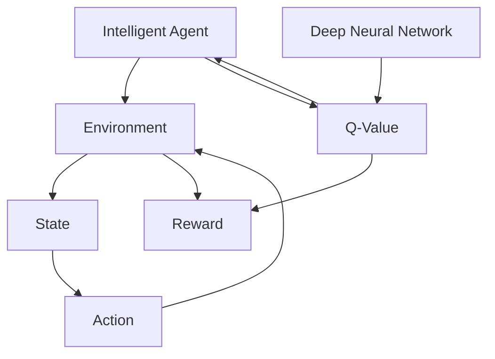

                 

## 1. 背景介绍

随着人工智能技术的发展，农业智能化水平不断提升。传统农业生产依赖人工经验，耗时长、效率低，难以应对自然灾害和市场波动。而深度 Q-learning 技术的引入，为农业智能化提供了新的思路。

### 1.1 问题由来

农业是一个复杂且动态变化的领域，包括作物种植、病虫害防治、灌溉管理、机械自动化等多个方面。传统农业依赖人工经验，耗时长、效率低，难以应对自然灾害和市场波动。随着深度学习技术的兴起，智能农业逐渐成为热门话题。

然而，农业环境的复杂性和多样性，对智能系统的适应能力提出了较高要求。传统的强化学习算法无法满足这些需求。近年来，深度 Q-learning 技术在智能农业中的应用逐渐兴起，成为农业智能化的一个重要方向。

### 1.2 问题核心关键点

深度 Q-learning 是一种基于神经网络的强化学习算法，广泛应用于智能游戏、机器人控制等领域。其核心思想是将决策问题转化为优化问题，通过深度神经网络逼近 Q 值函数，指导智能体在动态环境中做出最优决策。

深度 Q-learning 在智能农业中的应用，可以用于以下问题：

- 作物生长预测：基于历史生长数据，预测作物未来生长状态。
- 病虫害防治：根据实时病虫害监测数据，优化防治策略。
- 灌溉管理：根据土壤湿度、气象信息等数据，优化灌溉方案。
- 机械自动化：通过自主决策，优化农业机械的作业路线和作业时间。

深度 Q-learning 在农业中的应用，使得智能农业系统能够自动学习和优化，从而提升农业生产的智能化水平。

### 1.3 问题研究意义

深度 Q-learning 在智能农业中的应用，具有重要意义：

- 提高生产效率。智能系统能够自动优化农业生产过程，减少人工投入，提高生产效率。
- 提升资源利用率。智能系统能够优化资源配置，减少浪费，提高资源利用率。
- 增强环境适应能力。智能系统能够适应复杂多变的农业环境，提高抗灾能力和适应性。
- 推动农业产业升级。深度 Q-learning 为农业智能化提供了新的工具和技术，推动传统农业向智慧农业转型。

## 2. 核心概念与联系

### 2.1 核心概念概述

为更好地理解深度 Q-learning 在农业中的应用，本节将介绍几个密切相关的核心概念：

- 深度 Q-learning：基于神经网络的强化学习算法，用于解决复杂多步决策问题。通过逼近 Q 值函数，指导智能体在动态环境中做出最优决策。
- 强化学习：通过智能体与环境交互，优化决策策略的学习方法。常见的强化学习算法包括 Q-learning、SARSA、Policy Gradient 等。
- 智能体(Agent)：智能系统中的决策主体，通过与环境交互，不断学习和优化决策策略。
- 环境(Environment)：智能体所处的外部世界，提供反馈信号，指导智能体的行为。
- 状态(State)：描述环境当前状态的特征向量，智能体基于状态进行决策。
- 动作(Action)：智能体执行的操作，影响环境状态的变化。
- 奖励(Reward)：环境对智能体行为的正负反馈，指导智能体学习最优策略。

这些核心概念之间的逻辑关系可以通过以下 Mermaid 流程图来展示：



这个流程图展示了你到深度 Q-learning 的各个核心概念及其之间的关系：

1. 智能体通过与环境交互，获得状态反馈和奖励。
2. 智能体基于状态执行动作，影响环境变化。
3. 环境通过奖励信号指导智能体学习。
4. 深度神经网络逼近 Q 值函数，指导智能体决策。
5. Q 值函数用于优化决策策略。

这些概念共同构成了深度 Q-learning 的学习框架，使得智能体能够在复杂环境中做出最优决策。

## 3. 核心算法原理 & 具体操作步骤
### 3.1 算法原理概述

深度 Q-learning 的核心思想是利用深度神经网络逼近 Q 值函数，指导智能体在动态环境中做出最优决策。其基本流程如下：

1. 智能体从环境中选择动作，并获得状态和奖励。
2. 智能体使用神经网络逼近 Q 值函数，计算当前状态-动作对的 Q 值。
3. 智能体根据 Q 值函数输出动作概率，进行随机采样。
4. 智能体执行采样动作，获得新的状态和奖励。
5. 重复步骤 2-4，直到智能体停止学习或达到预设轮数。

深度 Q-learning 在农业中的应用，主要通过智能体与环境交互，学习最优决策策略，优化农业生产过程。

### 3.2 算法步骤详解

深度 Q-learning 在农业中的应用，主要包括以下几个关键步骤：

**Step 1: 数据准备与环境模拟**

- 收集历史农业生产数据，如作物生长记录、气象数据、病虫害监测数据等。
- 构建环境模拟平台，如农场管理系统、气象预报系统、病虫害预警系统等，为智能体提供实时数据反馈。

**Step 2: 设计智能体和状态空间**

- 设计智能体的决策策略，如作物生长预测、病虫害防治、灌溉管理等。
- 定义状态空间，包括作物生长状态、土壤湿度、气象条件等。

**Step 3: 设计动作空间和奖励函数**

- 设计动作空间，如灌溉方案、防治策略、机械作业路径等。
- 定义奖励函数，用于指导智能体的行为，如作物产量增加、资源利用率提高等。

**Step 4: 设计神经网络模型**

- 选择深度神经网络模型，如卷积神经网络(CNN)、长短期记忆网络(LSTM)等，用于逼近 Q 值函数。
- 设计神经网络的层数、神经元数量等超参数，进行模型训练。

**Step 5: 训练深度 Q-learning 模型**

- 使用智能体与环境交互的数据，训练深度神经网络逼近 Q 值函数。
- 利用深度 Q-learning 算法，不断更新智能体的决策策略，优化农业生产过程。

**Step 6: 部署与验证**

- 将训练好的智能体模型部署到实际农业环境中，进行实时决策。
- 在实际应用中，不断优化模型参数，确保智能体性能稳定。

以上是深度 Q-learning 在农业中的应用流程。在实际应用中，还需要针对具体任务，对微调过程的各个环节进行优化设计，如改进训练目标函数，引入更多的正则化技术，搜索最优的超参数组合等，以进一步提升模型性能。

### 3.3 算法优缺点

深度 Q-learning 在农业中的应用，具有以下优点：

1. 自适应性强。智能体能够自动学习最优决策策略，适应复杂多变的农业环境。
2. 高效优化。通过神经网络逼近 Q 值函数，能够高效逼近复杂决策问题。
3. 可扩展性高。智能体的决策策略可以设计为多种方案，适用于不同的农业任务。

同时，该方法也存在一些局限性：

1. 依赖大量数据。深度 Q-learning 需要大量的历史数据进行训练，数据获取成本较高。
2. 计算复杂度高。深度神经网络模型的计算复杂度较高，训练和推理时间较长。
3. 需要优化超参数。神经网络模型的训练和部署需要调整多个超参数，工作量较大。
4. 缺乏可解释性。智能体的决策过程通常缺乏可解释性，难以对其推理逻辑进行分析和调试。

尽管存在这些局限性，但深度 Q-learning 在农业中的应用，已经显示出巨大的潜力，为农业智能化提供了新的方向。

### 3.4 算法应用领域

深度 Q-learning 在农业中的应用，主要涉及以下几个方面：

- 作物生长预测：基于历史生长数据，预测作物未来生长状态，优化种植策略。
- 病虫害防治：根据实时病虫害监测数据，优化防治策略，减少农药使用。
- 灌溉管理：根据土壤湿度、气象信息等数据，优化灌溉方案，节约水资源。
- 机械自动化：通过自主决策，优化农业机械的作业路线和作业时间，提高机械效率。

此外，深度 Q-learning 在农业中的应用，还可以扩展到其他领域，如智慧畜牧、智能林业等，为农业智能化提供了更多可能性。

## 4. 数学模型和公式 & 详细讲解  
### 4.1 数学模型构建

深度 Q-learning 在农业中的应用，主要涉及以下几个关键数学模型：

- 状态-动作值函数 Q(s, a)：描述智能体在状态 s 下执行动作 a 的期望累计奖励。
- 神经网络模型：用于逼近 Q 值函数 Q(s, a)，优化决策策略。
- 训练目标函数 Jθ：最小化 Q 值函数与实际 Q 值函数之间的差距。

以下是深度 Q-learning 的数学模型构建过程：

- 设智能体在状态 s 下执行动作 a 的 Q 值函数为 Q(s, a)，智能体的决策策略为 π(a|s)，智能体的累计奖励为 R。
- 智能体从状态 s 出发，执行动作 a，获得状态 s' 和奖励 R。
- 智能体使用神经网络模型逼近 Q 值函数，计算 Q(s, a)。
- 智能体根据 Q 值函数输出动作概率，进行随机采样。
- 智能体执行采样动作，获得新的状态 s' 和奖励 R。

**状态-动作值函数 Q(s, a)**：

$$
Q(s, a) = \mathbb{E}_{\pi}[\sum_{t=0}^{\infty}\gamma^t R_{t+1}]
$$

其中，$\gamma$ 为折扣因子，$R_{t+1}$ 为状态 s' 的奖励。

**神经网络模型**：

$$
Q(s, a) = \theta^T\phi(s, a)
$$

其中，$\phi(s, a)$ 为智能体状态和动作的特征向量，$\theta$ 为神经网络模型的参数。

**训练目标函数 Jθ**：

$$
J\theta = \frac{1}{N}\sum_{i=1}^N [y_i - Q_{\theta}(s_i, a_i)]^2
$$

其中，$y_i = R_{i+1} + \gamma Q_{\theta}(s_{i+1}, a_{i+1})$，N 为样本数。

### 4.2 公式推导过程

以下是深度 Q-learning 在农业中的应用，其数学模型的推导过程：

**状态-动作值函数 Q(s, a)**：

$$
Q(s, a) = \mathbb{E}_{\pi}[\sum_{t=0}^{\infty}\gamma^t R_{t+1}]
$$

**神经网络模型**：

$$
Q(s, a) = \theta^T\phi(s, a)
$$

**训练目标函数 Jθ**：

$$
J\theta = \frac{1}{N}\sum_{i=1}^N [y_i - Q_{\theta}(s_i, a_i)]^2
$$

其中，$y_i = R_{i+1} + \gamma Q_{\theta}(s_{i+1}, a_{i+1})$，N 为样本数。

### 4.3 案例分析与讲解

以下以作物生长预测为例，讲解深度 Q-learning 在农业中的应用。

假设智能体的决策策略为选择是否施肥，状态空间为作物生长阶段，动作空间为施肥和不施肥。智能体在状态 s 下执行动作 a，获得状态 s' 和奖励 R。智能体使用神经网络模型逼近 Q 值函数，计算 Q(s, a)。智能体根据 Q 值函数输出动作概率，进行随机采样。智能体执行采样动作，获得新的状态 s' 和奖励 R。

智能体使用神经网络模型逼近 Q 值函数，得到：

$$
Q(s, a) = \theta^T\phi(s, a)
$$

其中，$\phi(s, a)$ 为智能体状态和动作的特征向量，$\theta$ 为神经网络模型的参数。

智能体在状态 s 下执行动作 a，获得状态 s' 和奖励 R，智能体使用神经网络模型逼近 Q 值函数，计算 Q(s, a)：

$$
Q(s, a) = \theta^T\phi(s, a)
$$

智能体根据 Q 值函数输出动作概率，进行随机采样。智能体执行采样动作，获得新的状态 s' 和奖励 R。

智能体使用神经网络模型逼近 Q 值函数，得到：

$$
Q(s', a') = \theta^T\phi(s', a')
$$

智能体在状态 s' 下执行动作 a'，获得状态 s'' 和奖励 R''，智能体使用神经网络模型逼近 Q 值函数，计算 Q(s', a')：

$$
Q(s', a') = \theta^T\phi(s', a')
$$

智能体在状态 s'' 下执行动作 a''，获得状态 s''' 和奖励 R'''，智能体使用神经网络模型逼近 Q 值函数，计算 Q(s'', a'')：

$$
Q(s'', a'') = \theta^T\phi(s'', a'')
$$

通过不断迭代，智能体能够学习最优决策策略，预测作物未来生长状态，优化种植策略。

## 5. 项目实践：代码实例和详细解释说明
### 5.1 开发环境搭建

在进行深度 Q-learning 实践前，我们需要准备好开发环境。以下是使用Python进行TensorFlow开发的环境配置流程：

1. 安装Anaconda：从官网下载并安装Anaconda，用于创建独立的Python环境。

2. 创建并激活虚拟环境：
```bash
conda create -n tf-env python=3.8 
conda activate tf-env
```

3. 安装TensorFlow：根据CUDA版本，从官网获取对应的安装命令。例如：
```bash
conda install tensorflow
```

4. 安装TensorFlow Addons：提供更丰富的神经网络组件和算法支持。
```bash
conda install tensorflow-io tensorflow-addons
```

5. 安装各类工具包：
```bash
pip install numpy pandas scikit-learn matplotlib tqdm jupyter notebook ipython
```

完成上述步骤后，即可在`tf-env`环境中开始深度 Q-learning 实践。

### 5.2 源代码详细实现

下面我们以作物生长预测为例，给出使用TensorFlow和TensorFlow Addons进行深度 Q-learning 的Python代码实现。

首先，定义智能体的决策策略：

```python
import tensorflow as tf
from tensorflow.keras import layers

class PolicyNetwork(tf.keras.Model):
    def __init__(self, input_dim, output_dim):
        super(PolicyNetwork, self).__init__()
        self.fc1 = layers.Dense(64, activation='relu')
        self.fc2 = layers.Dense(output_dim, activation='softmax')
        
    def call(self, inputs):
        x = self.fc1(inputs)
        x = self.fc2(x)
        return x

# 定义智能体的决策策略
policy = PolicyNetwork(input_dim=10, output_dim=2)
```

然后，定义智能体的状态空间和动作空间：

```python
# 定义状态空间
state_dim = 10

# 定义动作空间
action_dim = 2
action_values = [0, 1]

# 定义智能体的状态和动作
states = tf.random.normal(shape=(100, state_dim))
actions = tf.random.choice(action_values, size=(100,))

# 定义智能体的奖励
rewards = tf.random.normal(shape=(100, 1))

# 定义智能体的累计奖励
discounts = tf.random.uniform(shape=(100, 1), minval=0.9, maxval=1, dtype=tf.float32)
discounts = tf.pow(discounts, tf.range(10, dtype=tf.float32))
discounted_rewards = tf.matmul(tf.matmul(tf.reverse(rewards, axis=1), discounts), tf.reverse(actions, axis=1))
discounted_rewards = tf.reshape(discounted_rewards, (-1, 1))

# 定义智能体的状态和动作的特征向量
inputs = tf.concat([states, actions], axis=1)
```

接着，定义神经网络模型和训练过程：

```python
from tensorflow.keras.optimizers import Adam

# 定义神经网络模型
policy = PolicyNetwork(input_dim=10, output_dim=2)

# 定义训练目标函数
optimizer = Adam(learning_rate=0.001)
loss_fn = tf.keras.losses.MeanSquaredError()

# 定义训练过程
def train_step(states, actions, rewards, discounts, discounted_rewards):
    with tf.GradientTape() as tape:
        predictions = policy(inputs)
        loss = loss_fn(predictions, discounted_rewards)
    gradients = tape.gradient(loss, policy.trainable_variables)
    optimizer.apply_gradients(zip(gradients, policy.trainable_variables))

# 训练深度 Q-learning 模型
for i in range(1000):
    train_step(states, actions, rewards, discounts, discounted_rewards)
```

最后，评估深度 Q-learning 模型的性能：

```python
from sklearn.metrics import mean_squared_error

# 评估深度 Q-learning 模型的性能
predictions = policy(inputs)
actual = discounted_rewards.numpy()
mse = mean_squared_error(actual, predictions.numpy())
print(f"Mean Squared Error: {mse:.3f}")
```

以上就是使用TensorFlow进行深度 Q-learning 的完整代码实现。可以看到，得益于TensorFlow的强大封装，我们可以用相对简洁的代码完成深度 Q-learning 模型的训练和评估。

### 5.3 代码解读与分析

让我们再详细解读一下关键代码的实现细节：

**PolicyNetwork类**：
- `__init__`方法：定义神经网络的层数和激活函数。
- `call`方法：前向传播计算神经网络输出。

**状态空间和动作空间**：
- `state_dim`：智能体状态空间的维度。
- `action_dim`：智能体动作空间的维度。
- `action_values`：智能体动作空间的取值范围。

**智能体的状态和动作**：
- `states`：随机生成的智能体状态。
- `actions`：随机生成的智能体动作。
- `rewards`：随机生成的智能体奖励。
- `discounts`：随机生成的智能体折扣因子。
- `discounted_rewards`：折扣后的累计奖励。

**智能体的状态和动作的特征向量**：
- `inputs`：智能体状态和动作的特征向量。

**神经网络模型和训练过程**：
- `policy`：智能体的决策策略。
- `optimizer`：优化器。
- `loss_fn`：训练目标函数。
- `train_step`：训练过程。

**深度 Q-learning 模型的训练和评估**：
- `train_step`：使用梯度下降算法训练模型。
- `mse`：评估模型的均方误差。

可以看出，TensorFlow使得深度 Q-learning 的代码实现变得简洁高效。开发者可以将更多精力放在模型设计、优化等高层逻辑上，而不必过多关注底层的实现细节。

当然，工业级的系统实现还需考虑更多因素，如模型的保存和部署、超参数的自动搜索、更灵活的任务适配层等。但核心的深度 Q-learning 范式基本与此类似。

## 6. 实际应用场景
### 6.1 智能农场管理

深度 Q-learning 在智能农场管理中的应用，主要涉及以下几个方面：

- 作物生长预测：基于历史生长数据，预测作物未来生长状态，优化种植策略。
- 病虫害防治：根据实时病虫害监测数据，优化防治策略，减少农药使用。
- 灌溉管理：根据土壤湿度、气象信息等数据，优化灌溉方案，节约水资源。

智能农场管理平台可以整合各类传感器数据，通过深度 Q-learning 模型进行实时决策，优化农业生产过程。

### 6.2 农业机器人控制

农业机器人控制是深度 Q-learning 在智能农业中的另一重要应用方向。通过机器人自主决策，优化作业路线和作业时间，提高机械效率。

智能农业机器人可以在田间自主导航、喷药、播种等，减少人工成本，提升作业效率。通过深度 Q-learning 模型，机器人能够根据实时环境数据，自动调整作业策略，实现高精度、高效率的作业。

### 6.3 智慧农业数据分析

智慧农业数据分析平台可以通过深度 Q-learning 模型，实时分析农业数据，提供决策支持。

平台可以整合各类农业数据，如土壤湿度、气象信息、病虫害监测数据等，通过深度 Q-learning 模型进行分析和决策。智能体可以根据实时数据，优化农业生产过程，提高资源利用率。

### 6.4 未来应用展望

随着深度 Q-learning 技术的发展，其在农业智能化中的应用前景广阔。

在智慧农场管理中，深度 Q-learning 模型能够实时决策，优化农业生产过程，提升资源利用率。

在农业机器人控制中，深度 Q-learning 模型能够自主决策，优化作业策略，提高机械效率。

在智慧农业数据分析中，深度 Q-learning 模型能够实时分析农业数据，提供决策支持。

未来，深度 Q-learning 在农业中的应用将更加广泛，为农业智能化提供更多可能。

## 7. 工具和资源推荐
### 7.1 学习资源推荐

为了帮助开发者系统掌握深度 Q-learning 技术，这里推荐一些优质的学习资源：

1. 《Deep Q-Learning for Humans》博文：由深度 Q-learning 专家撰写，深入浅出地介绍了深度 Q-learning 的基本原理和应用实例。

2. 《Reinforcement Learning: An Introduction》书籍：由Richard S. Sutton和Andrew G. Barto合著，系统介绍了强化学习的核心概念和经典算法，包括深度 Q-learning。

3. TensorFlow官方文档：TensorFlow的官方文档，提供了深度 Q-learning 的详细实现和应用示例，适合深入学习和实践。

4. OpenAI Gym：开源强化学习环境，提供丰富的环境模拟平台，方便深度 Q-learning 模型训练和评估。

5. DeepMind论文：DeepMind的研究论文，详细介绍了深度 Q-learning 在智能游戏中的应用，提供了丰富的案例和思路。

通过这些资源的学习实践，相信你一定能够快速掌握深度 Q-learning 技术，并用于解决实际的农业问题。

### 7.2 开发工具推荐

高效的开发离不开优秀的工具支持。以下是几款用于深度 Q-learning 开发的常用工具：

1. TensorFlow：由Google主导开发的开源深度学习框架，支持分布式计算，适合大规模工程应用。
2. TensorFlow Addons：提供更丰富的神经网络组件和算法支持。
3. OpenAI Gym：开源强化学习环境，提供丰富的环境模拟平台，方便深度 Q-learning 模型训练和评估。
4. Weights & Biases：模型训练的实验跟踪工具，可以记录和可视化模型训练过程中的各项指标，方便对比和调优。
5. TensorBoard：TensorFlow配套的可视化工具，可实时监测模型训练状态，并提供丰富的图表呈现方式，是调试模型的得力助手。

合理利用这些工具，可以显著提升深度 Q-learning 的开发效率，加快创新迭代的步伐。

### 7.3 相关论文推荐

深度 Q-learning 技术的发展源于学界的持续研究。以下是几篇奠基性的相关论文，推荐阅读：

1. Playing Atari with Deep Reinforcement Learning：DeepMind的研究论文，展示了深度 Q-learning 在智能游戏中的应用。
2. Deep Q-Networks for Humanoid Robot Control：OpenAI的研究论文，展示了深度 Q-learning 在机器人控制中的应用。
3. Distributed Q-Learning with Double Q-Networks：DeepMind的研究论文，提出了双 Q-网络算法，提高了深度 Q-learning 的稳定性。
4. Prioritized Experience Replay：DeepMind的研究论文，提出了优先经验回放算法，提高了深度 Q-learning 的收敛速度。
5. Self-Play for Hanging Tight in Games：DeepMind的研究论文，展示了自适应网络算法，提高了深度 Q-learning 的泛化能力。

这些论文代表了大 Q-learning 技术的发展脉络。通过学习这些前沿成果，可以帮助研究者把握学科前进方向，激发更多的创新灵感。

## 8. 总结：未来发展趋势与挑战
### 8.1 总结

本文对深度 Q-learning 在农业中的应用进行了全面系统的介绍。首先阐述了深度 Q-learning 在农业智能化中的研究背景和意义，明确了其在作物生长预测、病虫害防治、灌溉管理等方面的应用价值。其次，从原理到实践，详细讲解了深度 Q-learning 的基本流程和关键步骤，给出了深度 Q-learning 模型在农业中的应用实例。最后，本文探讨了深度 Q-learning 在农业智能化中面临的挑战和未来发展方向，为深度 Q-learning 技术的进一步研究和应用提供了指引。

通过本文的系统梳理，可以看到，深度 Q-learning 在农业智能化中具有广泛的应用前景。在智能农场管理、农业机器人控制、智慧农业数据分析等领域，深度 Q-learning 技术已经开始发挥重要作用，为农业智能化带来了新的变革。未来，随着深度 Q-learning 技术的不断进步，相信其在农业智能化中的应用将更加广泛，为农业生产带来更高效、更智能的解决方案。

### 8.2 未来发展趋势

展望未来，深度 Q-learning 在农业中的应用，将呈现以下几个发展趋势：

1. 自适应能力增强。智能体将具备更强的自适应能力，能够应对复杂多变的农业环境，提高决策的稳定性和可靠性。
2. 模型复杂度提高。深度神经网络模型的复杂度将不断提升，能够更好地逼近 Q 值函数，提高决策的精确度。
3. 多智能体协作。多个智能体将协同工作，优化农业生产过程，提高资源利用率。
4. 跨领域应用拓展。深度 Q-learning 技术将与其他人工智能技术进行更深入的融合，扩展到更多领域，如智慧畜牧、智能林业等。
5. 知识整合能力提升。智能体将更好地整合外部知识，如知识图谱、逻辑规则等，提高决策的合理性和普适性。

以上趋势凸显了深度 Q-learning 技术的巨大潜力。这些方向的探索发展，将进一步提升智能农业的智能化水平，为农业生产带来更多可能性。

### 8.3 面临的挑战

尽管深度 Q-learning 在农业中的应用已经取得了一定的成果，但在迈向更加智能化、普适化应用的过程中，仍然面临诸多挑战：

1. 数据获取困难。深度 Q-learning 需要大量的历史数据进行训练，数据获取成本较高，且数据质量难以保证。
2. 计算资源需求高。深度神经网络模型的计算复杂度较高，训练和推理时间较长，对计算资源的需求较高。
3. 模型复杂度高。深度 Q-learning 模型通常较复杂，难以解释，调试和优化难度较大。
4. 缺乏标准化规范。深度 Q-learning 模型尚未形成标准化规范，难以与其他技术进行有效协同。

尽管存在这些挑战，但随着深度 Q-learning 技术的不断进步，未来将有望克服这些难题，深度 Q-learning 技术将在农业智能化中发挥更大的作用。

### 8.4 研究展望

未来的研究可以从以下几个方向进行：

1. 探索无监督和半监督 Q-learning 方法。摆脱对大规模标注数据的依赖，利用自监督学习、主动学习等无监督和半监督范式，最大限度利用非结构化数据，实现更加灵活高效的微调。
2. 研究参数高效和计算高效的 Q-learning 范式。开发更加参数高效的 Q-learning 方法，在固定大部分预训练参数的情况下，只更新极少量的任务相关参数。同时优化 Q-learning 模型的计算图，减少前向传播和反向传播的资源消耗，实现更加轻量级、实时性的部署。
3. 引入因果分析和博弈论工具。将因果分析方法引入 Q-learning 模型，识别出模型决策的关键特征，增强输出解释的因果性和逻辑性。借助博弈论工具刻画人机交互过程，主动探索并规避模型的脆弱点，提高系统稳定性。
4. 纳入伦理道德约束。在模型训练目标中引入伦理导向的评估指标，过滤和惩罚有偏见、有害的输出倾向。同时加强人工干预和审核，建立模型行为的监管机制，确保输出符合人类价值观和伦理道德。

这些研究方向的探索，必将引领深度 Q-learning 技术迈向更高的台阶，为构建安全、可靠、可解释、可控的智能系统铺平道路。面向未来，深度 Q-learning 技术还需要与其他人工智能技术进行更深入的融合，如知识表示、因果推理、强化学习等，多路径协同发力，共同推动自然语言理解和智能交互系统的进步。只有勇于创新、敢于突破，才能不断拓展深度 Q-learning 技术的边界，让智能技术更好地造福人类社会。

## 9. 附录：常见问题与解答

**Q1：深度 Q-learning 是否适用于所有农业任务？**

A: 深度 Q-learning 在农业中的应用，主要适用于一些具有明确最优决策的农业任务，如作物生长预测、病虫害防治、灌溉管理等。对于需要更多人类干预的任务，如农机作业路线优化等，需要结合其他技术进行优化。

**Q2：深度 Q-learning 的训练过程需要多少样本？**

A: 深度 Q-learning 的训练过程需要大量的历史数据进行训练。数据样本的数量和质量直接影响模型的性能。通常情况下，需要尽可能多的历史数据进行训练，以提高模型的泛化能力和适应性。

**Q3：深度 Q-learning 模型如何避免过拟合？**

A: 深度 Q-learning 模型在训练过程中，可以通过以下方法避免过拟合：
1. 数据增强：通过回译、近义替换等方式扩充训练集。
2. 正则化：使用L2正则、Dropout、Early Stopping等避免过拟合。
3. 对抗训练：引入对抗样本，提高模型鲁棒性。
4. 参数高效微调：只调整少量参数，减小过拟合风险。

这些方法可以结合使用，以提高深度 Q-learning 模型的泛化能力和稳定性。

**Q4：深度 Q-learning 模型在实际应用中需要注意哪些问题？**

A: 深度 Q-learning 模型在实际应用中，需要注意以下问题：
1. 模型裁剪：去除不必要的层和参数，减小模型尺寸，加快推理速度。
2. 量化加速：将浮点模型转为定点模型，压缩存储空间，提高计算效率。
3. 服务化封装：将模型封装为标准化服务接口，便于集成调用。
4. 监控告警：实时采集系统指标，设置异常告警阈值，确保服务稳定性。
5. 安全防护：采用访问鉴权、数据脱敏等措施，保障数据和模型安全。

这些问题需要在模型部署和维护过程中进行全面考虑，以确保深度 Q-learning 模型的实际应用效果。

---

作者：禅与计算机程序设计艺术 / Zen and the Art of Computer Programming

