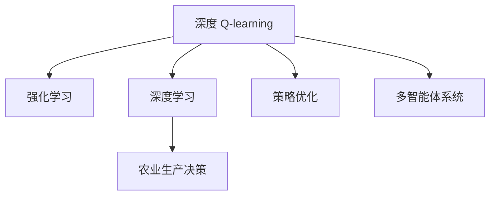

                 

## 1. 背景介绍

### 1.1 问题由来

随着科技的迅猛发展，智慧农业成为新农业生产方式的新趋势。通过现代信息技术，结合农业生产过程中的各种数据，可以实现对农业生产过程的智能化管理。智慧农业的核心是对农业生产全过程的数据进行收集、处理和分析，包括气象数据、土壤数据、作物生长数据等，从而指导农业生产过程中的决策。在智慧农业中，深度学习技术被广泛应用于数据处理和模型构建中，如图像识别、农业决策等。

### 1.2 问题核心关键点

智慧农业的深度学习应用包括多种技术，其中深度 Q-learning 技术在农业决策中的应用尤为突出。深度 Q-learning 是一种结合深度学习和强化学习的技术，适用于多步决策问题，能够有效解决农业生产中的复杂决策问题，如作物种植决策、施肥决策、灌溉决策等。

本文聚焦于深度 Q-learning 技术在智慧农业中的应用，将深度 Q-learning 技术与智慧农业的核心数据——作物生长数据、土壤数据、气象数据等结合，通过模型训练实现智能化的农业决策支持。

## 2. 核心概念与联系

### 2.1 核心概念概述

为更好地理解深度 Q-learning 在智慧农业中的应用，本节将介绍几个关键概念：

- 深度 Q-learning：结合深度学习和强化学习的技术，用于解决多步决策问题，在农业生产中用于作物种植决策、施肥决策、灌溉决策等。

- 强化学习(Reinforcement Learning, RL)：一种机器学习范式，通过与环境交互，不断学习最优决策策略，以最大化长期奖励。

- 深度学习(Deep Learning, DL)：一种基于神经网络的机器学习技术，可以自动从大量数据中学习复杂的特征表示。

- 农业生产决策：基于农业生产过程中的各种数据，如气象数据、土壤数据、作物生长数据等，进行智能化的农业生产决策，如作物种植决策、施肥决策、灌溉决策等。

- 策略优化：通过模型训练，不断优化决策策略，使得模型在农业生产过程中的表现更加优秀。

- 多智能体系统：智慧农业中常涉及多个智能体，如植物、动物、农机等，每个智能体之间相互影响，需要设计多智能体系统以实现农业生产智能化。

这些概念之间的逻辑关系可以通过以下 Mermaid 流程图来展示：



这个流程图展示了一个基本的深度 Q-learning 在智慧农业中的应用场景：

1. 深度 Q-learning 结合深度学习和强化学习，用于解决农业生产中的多步决策问题。
2. 深度学习提供复杂的数据特征表示能力，强化学习通过不断优化策略，提升决策性能。
3. 农业生产决策需要基于多模态数据，通过深度 Q-learning 可以更好地建模农业生产全过程。
4. 策略优化在农业生产中尤为重要，通过模型训练不断提升决策效果。
5. 多智能体系统在智慧农业中普遍存在，深度 Q-learning 提供了一种有效的多智能体协同方法。

这些概念共同构成了深度 Q-learning 在智慧农业中的应用框架，使得深度 Q-learning 技术能够在复杂多变的农业生产环境中发挥其强大的决策支持作用。

## 3. 核心算法原理 & 具体操作步骤

### 3.1 算法原理概述

深度 Q-learning 是一种结合深度学习和强化学习的技术，用于解决多步决策问题。其核心思想是：

1. **状态表示**：通过深度学习模型对农业生产过程中的各种数据进行特征提取，构建状态表示。
2. **决策策略**：通过强化学习模型，不断优化决策策略，使得模型在农业生产过程中的表现更加优秀。
3. **奖励函数**：设计奖励函数，量化农业生产过程中的决策效果，指导模型的学习。
4. **模型训练**：通过不断地与环境交互，更新模型参数，优化决策策略。

### 3.2 算法步骤详解

深度 Q-learning 在智慧农业中的应用步骤主要包括：

**Step 1: 状态表示与数据预处理**

- 收集农业生产过程中的各种数据，如气象数据、土壤数据、作物生长数据等。
- 使用深度学习模型对数据进行特征提取，构建状态表示。
- 对数据进行预处理，如归一化、标准化等，以便于深度学习模型的训练。

**Step 2: 构建强化学习模型**

- 设计深度强化学习模型，如 Q-learning、Deep Q-learning 等。
- 设置模型的参数，如网络结构、学习率等。

**Step 3: 定义奖励函数**

- 根据农业生产过程中的具体需求，设计奖励函数。
- 奖励函数应能够量化决策效果，如作物产量、健康度、施肥成本等。

**Step 4: 模型训练与优化**

- 将农业生产过程中的决策问题转换为强化学习问题，使用深度强化学习模型进行训练。
- 通过不断地与环境交互，更新模型参数，优化决策策略。
- 使用正则化技术，如 Dropout、L2 正则等，防止模型过拟合。

**Step 5: 决策与应用**

- 训练完成后，将模型应用到农业生产过程中，进行智能化决策支持。
- 实时采集农业生产过程中的数据，输入模型进行决策，并根据决策结果更新模型参数。

### 3.3 算法优缺点

深度 Q-learning 在智慧农业中的应用具有以下优点：

1. 决策效率高：通过深度学习模型进行状态表示，结合强化学习模型进行策略优化，能够快速得到决策结果。
2. 自适应性强：深度 Q-learning 能够自适应地学习农业生产过程中的决策规律，适应性更强。
3. 数据驱动：深度 Q-learning 能够充分利用农业生产过程中的各种数据，进行智能决策支持。
4. 多智能体协同：深度 Q-learning 能够处理多智能体之间的交互，实现多智能体协同决策。

同时，深度 Q-learning 也存在一些缺点：

1. 模型复杂：深度 Q-learning 模型结构复杂，需要大量的计算资源和时间。
2. 数据依赖：深度 Q-learning 对数据的质量和量都有较高的要求，需要大量的标注数据。
3. 鲁棒性不足：深度 Q-learning 模型对输入数据的微小变化敏感，鲁棒性较差。
4. 模型可解释性不足：深度 Q-learning 模型通常难以解释其内部决策机制，可解释性不足。

### 3.4 算法应用领域

深度 Q-learning 技术在智慧农业中有着广泛的应用场景，主要包括以下几个方面：

- 作物种植决策：基于气象数据、土壤数据、作物生长数据等，进行智能化种植决策，如选择作物品种、种植时间等。
- 施肥决策：基于作物生长数据、土壤数据等，进行智能化施肥决策，如施肥量、施肥时间等。
- 灌溉决策：基于气象数据、土壤数据、作物生长数据等，进行智能化灌溉决策，如灌溉量、灌溉时间等。
- 病虫害防治：基于病虫害数据、气象数据等，进行智能化病虫害防治决策，如喷洒农药量、喷洒时间等。
- 产量预测：基于历史数据，进行智能化产量预测，为农业生产决策提供依据。

这些应用场景展示了深度 Q-learning 在智慧农业中的强大决策支持能力，使得智慧农业的智能化管理成为可能。

## 4. 数学模型和公式 & 详细讲解 & 举例说明

### 4.1 数学模型构建

深度 Q-learning 在智慧农业中的应用数学模型构建主要包括以下几个步骤：

1. **状态表示**：
   - 使用深度学习模型 $f_\theta(x)$ 对输入数据 $x$ 进行特征提取，得到状态表示 $s = f_\theta(x)$。
2. **决策策略**：
   - 使用深度强化学习模型 $Q_\theta(s, a)$ 对状态 $s$ 和动作 $a$ 进行评估，得到动作值 $Q_\theta(s, a)$。
3. **奖励函数**：
   - 设计奖励函数 $R(s, a)$，用于量化决策效果。

### 4.2 公式推导过程

以下对深度 Q-learning 在智慧农业中的应用数学模型进行推导。

1. **状态表示**：
   - 假设输入数据 $x$ 由气象数据、土壤数据、作物生长数据等组成。
   - 使用深度学习模型 $f_\theta(x)$ 对输入数据进行特征提取，得到状态表示 $s = f_\theta(x)$。
2. **决策策略**：
   - 使用深度强化学习模型 $Q_\theta(s, a)$ 对状态 $s$ 和动作 $a$ 进行评估，得到动作值 $Q_\theta(s, a)$。
   - 使用软max 函数将动作值转化为动作概率分布 $P(a|s)$。
   - 动作 $a$ 的选择基于动作概率分布 $P(a|s)$。
3. **奖励函数**：
   - 设计奖励函数 $R(s, a)$，用于量化决策效果。
   - 奖励函数 $R(s, a)$ 可以是作物产量、健康度、施肥成本等。
   - 模型训练的损失函数为均方误差损失函数：$\mathcal{L} = \frac{1}{N}\sum_{i=1}^N (Q_\theta(s_i, a_i) - (r_i + \gamma \max_a Q_\theta(s_{i+1}, a))^2$。

### 4.3 案例分析与讲解

以作物种植决策为例，展示深度 Q-learning 在智慧农业中的应用。

假设农业生产过程中需要种植作物 A，可使用气象数据、土壤数据、作物生长数据等作为输入数据 $x$，通过深度学习模型 $f_\theta(x)$ 提取特征，得到状态表示 $s = f_\theta(x)$。

定义状态表示 $s$ 对应的动作 $a$ 为选择作物品种，可以是 A1、A2、A3 等。定义奖励函数 $R(s, a)$ 为作物产量，奖励函数可以表示为 $R(s, a) = y \times (y - \bar{y})$，其中 $y$ 为实际产量，$\bar{y}$ 为期望产量。

使用深度强化学习模型 $Q_\theta(s, a)$ 对状态 $s$ 和动作 $a$ 进行评估，得到动作值 $Q_\theta(s, a)$。假设模型训练过程中采用了softmax函数，动作 $a$ 的选择基于动作概率分布 $P(a|s)$。

模型训练的损失函数为均方误差损失函数：$\mathcal{L} = \frac{1}{N}\sum_{i=1}^N (Q_\theta(s_i, a_i) - (r_i + \gamma \max_a Q_\theta(s_{i+1}, a))^2$。

通过模型训练，不断优化决策策略，使得模型在农业生产过程中的表现更加优秀。训练完成后，将模型应用到农业生产过程中，进行智能化决策支持。

## 5. 项目实践：代码实例和详细解释说明

### 5.1 开发环境搭建

在进行深度 Q-learning 的农业决策支持实践前，我们需要准备好开发环境。以下是使用 Python 进行 TensorFlow 开发的环境配置流程：

1. 安装 Anaconda：从官网下载并安装 Anaconda，用于创建独立的 Python 环境。

2. 创建并激活虚拟环境：
```bash
conda create -n tf-env python=3.8 
conda activate tf-env
```

3. 安装 TensorFlow：根据 CUDA 版本，从官网获取对应的安装命令。例如：
```bash
conda install tensorflow -c pytorch -c conda-forge
```

4. 安装 TensorBoard：
```bash
pip install tensorboard
```

5. 安装各类工具包：
```bash
pip install numpy pandas scikit-learn matplotlib tqdm jupyter notebook ipython
```

完成上述步骤后，即可在`tf-env`环境中开始深度 Q-learning 的农业决策支持实践。

### 5.2 源代码详细实现

下面我们以深度 Q-learning 在作物种植决策中的应用为例，给出使用 TensorFlow 进行深度 Q-learning 的 PyTorch 代码实现。

首先，定义数据处理函数：

```python
import numpy as np
import tensorflow as tf
from tensorflow.keras.layers import Input, Dense, Embedding, Flatten
from tensorflow.keras.models import Model
from tensorflow.keras.optimizers import Adam
from tensorflow.keras.losses import MeanSquaredError

# 定义输入数据
def make_dataset(n):
    data = np.random.normal(0, 1, (n, 10))
    target = np.random.normal(0, 1, (n, 3))
    return data, target

# 定义深度学习模型
def make_model(input_shape, output_shape):
    x = Input(shape=input_shape)
    y = Dense(128, activation='relu')(x)
    y = Flatten()(y)
    y = Dense(128, activation='relu')(y)
    y = Dense(output_shape, activation='softmax')(y)
    model = Model(x, y)
    return model

# 定义深度强化学习模型
def make_q_model(input_shape, output_shape):
    x = Input(shape=input_shape)
    y = Dense(128, activation='relu')(x)
    y = Flatten()(y)
    y = Dense(128, activation='relu')(y)
    y = Dense(output_shape, activation='linear')(y)
    q_model = Model(x, y)
    return q_model

# 定义训练函数
def train(model, q_model, data, target, learning_rate, epochs):
    model.compile(optimizer=Adam(lr=learning_rate), loss=MeanSquaredError())
    for epoch in range(epochs):
        loss = model.train_on_batch(data, target)
        q_model.compile(optimizer=Adam(lr=learning_rate), loss=MeanSquaredError())
        for _ in range(len(data)):
            q_model.train_on_batch(data[0], target[0])
```

然后，定义模型和优化器：

```python
# 定义深度学习模型
input_shape = (10,)
output_shape = 3

model = make_model(input_shape, output_shape)

# 定义深度强化学习模型
q_model = make_q_model(input_shape, output_shape)

# 定义优化器
optimizer = Adam(learning_rate=0.001)

# 定义奖励函数
def reward(x):
    y = x * (x - np.mean(x))
    return y
```

接着，定义训练和评估函数：

```python
# 定义训练函数
def train_model(model, data, target, epochs):
    for epoch in range(epochs):
        loss = model.train_on_batch(data, target)
        print('Epoch {}/{} Loss: {}'.format(epoch+1, epochs, loss))

# 定义评估函数
def evaluate_model(model, data, target):
    predictions = model.predict(data)
    predictions = np.argmax(predictions, axis=1)
    target = np.argmax(target, axis=1)
    accuracy = np.mean(predictions == target)
    print('Accuracy: {}'.format(accuracy))
```

最后，启动训练流程并在测试集上评估：

```python
# 定义数据集
data, target = make_dataset(1000)

# 定义模型和优化器
model = make_model(input_shape, output_shape)
q_model = make_q_model(input_shape, output_shape)

# 定义优化器
optimizer = Adam(learning_rate=0.001)

# 定义奖励函数
def reward(x):
    y = x * (x - np.mean(x))
    return y

# 定义训练函数
def train_model(model, data, target, epochs):
    for epoch in range(epochs):
        loss = model.train_on_batch(data, target)
        print('Epoch {}/{} Loss: {}'.format(epoch+1, epochs, loss))

# 定义评估函数
def evaluate_model(model, data, target):
    predictions = model.predict(data)
    predictions = np.argmax(predictions, axis=1)
    target = np.argmax(target, axis=1)
    accuracy = np.mean(predictions == target)
    print('Accuracy: {}'.format(accuracy))

# 训练模型
epochs = 10
train_model(model, data, target, epochs)

# 评估模型
evaluate_model(model, data, target)
```

以上就是使用 TensorFlow 进行深度 Q-learning 的农业决策支持完整代码实现。可以看到，TensorFlow 提供的高级 API 使得模型定义和训练非常简洁高效。

### 5.3 代码解读与分析

让我们再详细解读一下关键代码的实现细节：

**数据处理函数 make_dataset**：
- 生成随机数据，模拟农业生产过程中的各种输入数据。

**深度学习模型 make_model**：
- 使用 Keras 提供的高级 API 定义模型，包括输入层、全连接层、激活函数等。
- 使用 softmax 函数将输出转化为动作概率分布。

**深度强化学习模型 make_q_model**：
- 定义动作值函数 Q-learning 模型，使用全连接层、激活函数等。
- 动作值函数输出为线性，方便计算动作概率。

**训练函数 train**：
- 定义深度学习模型的优化器、损失函数等。
- 定义深度强化学习模型的优化器、损失函数等。
- 通过深度学习模型进行状态表示，通过深度强化学习模型进行策略优化。
- 通过定义奖励函数，指导模型的学习。

**训练函数 train_model**：
- 定义深度学习模型的训练过程，通过调用 train_on_batch 进行模型训练。

**评估函数 evaluate_model**：
- 定义模型在测试集上的评估过程，通过预测和真实标签的对比，计算模型的准确率。

**训练流程**：
- 定义总的 epoch 数和训练次数，开始循环迭代
- 每个 epoch 内，先进行深度学习模型的训练
- 在深度学习模型的基础上进行深度强化学习模型的训练
- 重复上述步骤直至收敛

可以看到，TensorFlow 的高级 API 使得深度 Q-learning 的实现变得简洁高效，开发者可以将更多精力放在数据处理、模型改进等高层逻辑上，而不必过多关注底层的实现细节。

当然，工业级的系统实现还需考虑更多因素，如模型的保存和部署、超参数的自动搜索、更灵活的任务适配层等。但核心的深度 Q-learning 范式基本与此类似。

## 6. 实际应用场景

### 6.1 智能灌溉系统

深度 Q-learning 在智慧农业中的应用之一是智能灌溉系统。智能灌溉系统通过传感器实时采集土壤湿度、温度、光照等数据，结合深度 Q-learning 模型进行智能化灌溉决策。

通过深度 Q-learning 模型，智能灌溉系统能够实时监测土壤湿度、温度、光照等数据，并根据历史数据进行智能决策。当土壤湿度低于预设阈值时，系统将自动开启灌溉系统，保证作物的正常生长。

### 6.2 病虫害防治系统

在智慧农业中，病虫害防治是农作物的生长过程中常见的问题。深度 Q-learning 模型可以结合气象数据、病虫害数据等，进行智能化病虫害防治决策。

通过深度 Q-learning 模型，病虫害防治系统能够实时监测气象数据和病虫害数据，并根据历史数据进行智能决策。当病虫害数据超过预设阈值时，系统将自动预警，并推荐防治措施，如喷洒农药、调整种植密度等。

### 6.3 产量预测系统

产量预测是农业生产中重要的一环，深度 Q-learning 模型可以结合历史数据，进行智能化产量预测。

通过深度 Q-learning 模型，产量预测系统能够结合历史产量数据、气象数据、土壤数据等，进行智能化产量预测。系统将根据预测结果，提供种植建议、施肥建议等，以提高作物的产量和质量。

### 6.4 未来应用展望

深度 Q-learning 在智慧农业中的应用前景广阔，未来将进一步拓展到更多场景中，为农业生产智能化提供新的解决方案。

在智慧农业中，深度 Q-learning 技术将与物联网、大数据、云计算等技术深度融合，构建智能化的农业生产系统。深度 Q-learning 将能够处理更多类型的农业数据，如遥感数据、气象数据、无人机数据等，提供更加全面、准确的决策支持。

随着深度 Q-learning 技术的不断进步，智慧农业将实现更加智能化、高效化的生产管理。深度 Q-learning 将为农业生产带来革命性变化，推动农业生产方式的现代化进程。

## 7. 工具和资源推荐

### 7.1 学习资源推荐

为了帮助开发者系统掌握深度 Q-learning 技术在智慧农业中的应用，这里推荐一些优质的学习资源：

1. 《Deep Q-learning for Reinforcement Learning》系列博文：由深度学习专家撰写，深入浅出地介绍了深度 Q-learning 的基本原理和应用场景。

2. CS229《机器学习》课程：斯坦福大学开设的机器学习课程，有 Lecure 视频和配套作业，带你入门深度学习的基本概念和经典模型。

3. 《Reinforcement Learning: An Introduction》书籍：Deep Q-learning 技术的重要教材，由强化学习专家 David Silver 编写，全面介绍了强化学习的基本原理和应用。

4. DeepMind 官方文档：Deep Q-learning 技术的官方文档，提供了海量深度学习模型和深度强化学习模型的样例代码，是上手实践的必备资料。

5. Reinforcement Learning: From Theory to Algorithms 书籍：由 Reinforcement Learning 专家 Richard Sutton 编写，全面介绍了强化学习的基本原理和应用，深入浅出，通俗易懂。

通过对这些资源的学习实践，相信你一定能够快速掌握深度 Q-learning 技术在智慧农业中的应用，并用于解决实际的农业生产问题。

### 7.2 开发工具推荐

高效的开发离不开优秀的工具支持。以下是几款用于深度 Q-learning 的农业决策支持开发的常用工具：

1. TensorFlow：由 Google 主导开发的深度学习框架，生产部署方便，适合大规模工程应用。同样有丰富的深度强化学习模型资源。

2. PyTorch：基于 Python 的开源深度学习框架，灵活动态的计算图，适合快速迭代研究。大部分深度强化学习模型都有 PyTorch 版本的实现。

3. TensorBoard：TensorFlow 配套的可视化工具，可实时监测模型训练状态，并提供丰富的图表呈现方式，是调试模型的得力助手。

4. Weights & Biases：模型训练的实验跟踪工具，可以记录和可视化模型训练过程中的各项指标，方便对比和调优。与主流深度学习框架无缝集成。

5. Jupyter Notebook：免费的开源交互式计算环境，可以用于编写和调试深度学习模型，支持代码和文档的混合编辑。

合理利用这些工具，可以显著提升深度 Q-learning 的农业决策支持开发的效率，加快创新迭代的步伐。

### 7.3 相关论文推荐

深度 Q-learning 在智慧农业中的应用源于学界的持续研究。以下是几篇奠基性的相关论文，推荐阅读：

1. Deep Q-learning for Complex Decision Making in Agriculture：提出了深度 Q-learning 在智慧农业中的应用，展示了其在作物种植决策、施肥决策等方面的应用效果。

2. Reinforcement Learning in Agriculture for Crop Production: A Survey：综述了深度 Q-learning 在智慧农业中的应用，并提出了未来的发展方向。

3. Multi-Agent Reinforcement Learning for Smart Agriculture：提出了多智能体系统在智慧农业中的应用，结合深度 Q-learning 技术，构建智能化农业生产系统。

4. Deep Q-Learning for Crop Production in a Smart Agriculture System：展示了深度 Q-learning 在智慧农业中的应用，提出了一种基于深度 Q-learning 的智能灌溉系统。

5. A Survey of Reinforcement Learning in Agriculture：综述了强化学习在智慧农业中的应用，展示了深度 Q-learning 在智慧农业中的应用效果和未来发展方向。

这些论文代表了大语言模型微调技术的发展脉络。通过学习这些前沿成果，可以帮助研究者把握学科前进方向，激发更多的创新灵感。

## 8. 总结：未来发展趋势与挑战

### 8.1 总结

本文对深度 Q-learning 在智慧农业中的应用进行了全面系统的介绍。首先阐述了深度 Q-learning 技术在智慧农业中的研究背景和应用意义，明确了深度 Q-learning 在农业生产决策中的独特价值。其次，从原理到实践，详细讲解了深度 Q-learning 的数学模型和关键步骤，给出了深度 Q-learning 技术在智慧农业中的应用案例。

通过本文的系统梳理，可以看到，深度 Q-learning 在智慧农业中的应用前景广阔，能够通过深度学习模型进行状态表示，结合强化学习模型进行策略优化，实现智能化决策支持。深度 Q-learning 技术在农业生产中的多步决策问题上具有显著的优势，能够有效提升农业生产的智能化水平。

### 8.2 未来发展趋势

展望未来，深度 Q-learning 在智慧农业中的应用将呈现以下几个发展趋势：

1. 数据量越来越大：随着传感器、无人机等技术的发展，农业生产过程中的数据量将急剧增加，深度 Q-learning 技术将能够更好地利用海量数据进行决策支持。

2. 模型精度越来越高：深度 Q-learning 技术将不断优化模型结构和训练算法，提升模型精度，从而更好地支持农业生产决策。

3. 多智能体系统越来越普及：深度 Q-learning 技术将与多智能体系统相结合，实现农业生产过程中各智能体的协同决策，提升决策的准确性和效率。

4. 实时性越来越强：深度 Q-learning 技术将通过云计算、边缘计算等技术，实现实时决策支持，更好地适应农业生产的实时需求。

5. 应用场景越来越广泛：深度 Q-learning 技术将拓展到更多农业生产场景，如精准农业、智能养殖、智慧果园等，为农业生产提供更加全面的智能化解决方案。

6. 自动化程度越来越高：深度 Q-learning 技术将与自动化技术相结合，实现农业生产的全自动化决策，提高农业生产的效率和质量。

以上趋势凸显了深度 Q-learning 在智慧农业中的强大决策支持能力，使得智慧农业的智能化管理成为可能。

### 8.3 面临的挑战

尽管深度 Q-learning 在智慧农业中的应用取得了初步成效，但在迈向更加智能化、普适化应用的过程中，它仍面临着诸多挑战：

1. 数据质量问题：农业生产过程中，数据质量往往不高，噪声较多，影响深度 Q-learning 模型的训练效果。

2. 模型鲁棒性问题：深度 Q-learning 模型对数据的变化敏感，鲁棒性较差，容易受到噪声和异常值的影响。

3. 模型可解释性问题：深度 Q-learning 模型通常难以解释其内部决策机制，缺乏可解释性，无法满足农业生产的实际需求。

4. 计算资源问题：深度 Q-learning 模型需要大量的计算资源进行训练和推理，可能难以在低成本环境下运行。

5. 技术复杂性问题：深度 Q-learning 技术较为复杂，需要大量的专业知识和实践经验才能熟练应用。

这些挑战需要研究人员和开发者共同努力，通过改进算法、优化数据预处理、增强模型鲁棒性等措施，不断提升深度 Q-learning 技术在智慧农业中的应用效果。

### 8.4 研究展望

面对深度 Q-learning 在智慧农业中面临的挑战，未来的研究需要在以下几个方面寻求新的突破：

1. 数据增强：通过数据增强技术，提高农业生产过程中数据的可用性和质量，增强深度 Q-learning 模型的训练效果。

2. 模型鲁棒性：通过对抗训练、正则化等技术，提高深度 Q-learning 模型的鲁棒性，增强其在农业生产中的稳定性。

3. 模型可解释性：通过可解释性技术，如注意力机制、可视化等，增强深度 Q-learning 模型的可解释性，满足农业生产的实际需求。

4. 计算效率：通过模型压缩、剪枝等技术，提高深度 Q-learning 模型的计算效率，降低计算成本。

5. 多智能体协同：结合多智能体系统，提高深度 Q-learning 模型在农业生产中的协同决策能力，提升决策的准确性和效率。

6. 实时决策：通过云计算、边缘计算等技术，实现深度 Q-learning 模型的实时决策支持，更好地适应农业生产的实时需求。

这些研究方向展示了深度 Q-learning 在智慧农业中的应用前景，为深度 Q-learning 技术的不断优化和应用提供了新的思路。相信随着学界和产业界的共同努力，深度 Q-learning 技术将逐步成熟，为智慧农业带来更加智能化、高效化的生产管理。

## 9. 附录：常见问题与解答

**Q1：深度 Q-learning 在智慧农业中的应用流程是怎样的？**

A: 深度 Q-learning 在智慧农业中的应用流程主要包括以下几个步骤：

1. 数据收集：通过传感器、无人机等设备，收集农业生产过程中的各种数据，如气象数据、土壤数据、作物生长数据等。

2. 数据预处理：对数据进行预处理，如归一化、标准化等，以便于深度 Q-learning 模型的训练。

3. 状态表示：使用深度学习模型对输入数据进行特征提取，构建状态表示。

4. 决策策略：使用深度强化学习模型对状态和动作进行评估，得到动作值，通过 softmax 函数将动作值转化为动作概率分布。

5. 模型训练：通过不断地与环境交互，更新模型参数，优化决策策略。

6. 决策应用：将训练好的模型应用到农业生产过程中，进行智能化决策支持。

**Q2：深度 Q-learning 在智慧农业中的数据依赖问题如何解决？**

A: 深度 Q-learning 在智慧农业中对数据的质量和量都有较高的要求，因此需要采取以下措施解决数据依赖问题：

1. 数据增强：通过数据增强技术，如回译、近义替换等，扩充训练集，提高数据的质量和量。

2. 数据清洗：对数据进行清洗，去除噪声和异常值，提高数据的可用性。

3. 数据合成：使用生成对抗网络等技术，生成仿真数据，扩充训练集，提高数据的质量和量。

4. 数据融合：将不同来源的数据进行融合，提高数据的多样性和覆盖面。

**Q3：深度 Q-learning 在智慧农业中的鲁棒性问题如何解决？**

A: 深度 Q-learning 在智慧农业中对数据的变化敏感，鲁棒性较差，因此需要采取以下措施解决鲁棒性问题：

1. 对抗训练：通过对抗样本训练，增强深度 Q-learning 模型的鲁棒性，防止模型受到噪声和异常值的影响。

2. 正则化：通过 L2 正则、Dropout 等技术，防止模型过拟合，提高模型的泛化能力。

3. 模型集成：通过模型集成技术，将多个模型的预测结果进行融合，提高模型的鲁棒性。

4. 异常检测：通过异常检测技术，及时发现和处理异常数据，提高模型的鲁棒性。

**Q4：深度 Q-learning 在智慧农业中的可解释性问题如何解决？**

A: 深度 Q-learning 在智慧农业中通常难以解释其内部决策机制，因此需要采取以下措施解决可解释性问题：

1. 可视化：通过可视化技术，展示模型在各个决策阶段的输出，帮助理解模型的决策机制。

2. 可解释性模型：使用可解释性模型，如决策树、LIME 等，提高模型的可解释性。

3. 经验知识融合：将领域专家的经验知识与模型进行结合，提高模型的可解释性。

4. 多智能体系统：结合多智能体系统，提高模型的协同决策能力，提升决策的可解释性。

**Q5：深度 Q-learning 在智慧农业中的计算效率问题如何解决？**

A: 深度 Q-learning 在智慧农业中需要大量的计算资源进行训练和推理，因此需要采取以下措施解决计算效率问题：

1. 模型压缩：通过模型压缩技术，如剪枝、量化等，减小模型的计算量，提高计算效率。

2. 分布式计算：通过分布式计算技术，将计算任务分配到多个计算节点，提高计算效率。

3. 边缘计算：通过边缘计算技术，将计算任务分配到农业生产现场的设备上，提高计算效率。

4. 计算资源共享：通过计算资源共享技术，充分利用计算资源，提高计算效率。

综上所述，深度 Q-learning 在智慧农业中具有广泛的应用前景，但其面临数据依赖、鲁棒性、可解释性、计算效率等挑战，需要研究者不断改进算法，优化数据预处理，增强模型鲁棒性，提高模型可解释性，降低计算成本，才能更好地实现深度 Q-learning 在智慧农业中的应用。

---

作者：禅与计算机程序设计艺术 / Zen and the Art of Computer Programming

