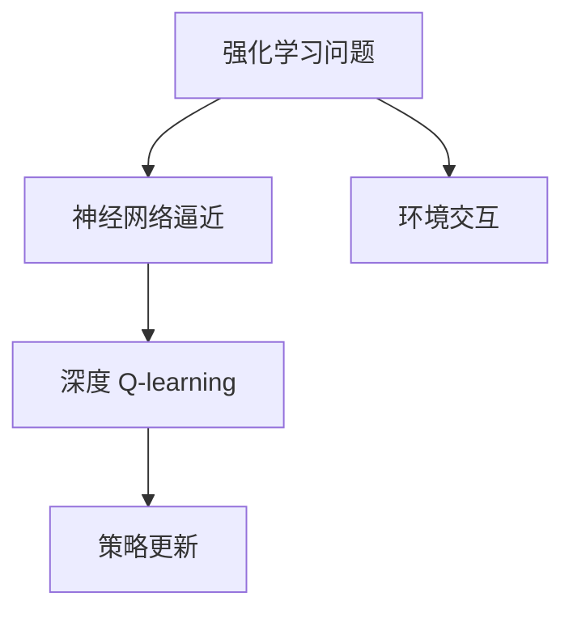

                 

# 深度 Q-learning：探寻机器预知未来的可能性

## 1. 背景介绍

在过去的几十年中，人工智能领域经历了从规则驱动到统计学习，再到深度学习的发展历程。其中，深度学习因其强大的表征能力，逐渐成为实现人工智能任务的核心工具。然而，尽管深度学习在图像识别、自然语言处理等领域取得了巨大成功，但在智能体决策问题上，传统的深度学习仍然面临诸多挑战。

在智能体决策问题中，深度学习模型往往缺乏对于环境动态变化的适应能力，无法在有限的信息下做出最优决策。相比之下，强化学习(RL)提供了一种从环境互动中学习最优决策策略的方法。其中，深度 Q-learning 作为一种结合了深度学习和强化学习的技术，展现出其在解决智能体决策问题上的潜力。本文将深入探讨深度 Q-learning 的原理、算法步骤、优缺点以及应用领域，并给出详细的数学模型、代码实例和实际应用场景。

## 2. 核心概念与联系

### 2.1 核心概念概述

- **深度 Q-learning**：一种结合深度神经网络和强化学习算法的技术，通过神经网络逼近Q值函数，实现智能体在复杂环境中的最优决策。
- **Q值函数**：描述在给定状态下采取某个动作后的未来平均奖励的函数。深度 Q-learning 通过深度神经网络逼近Q值函数，提高决策的准确性。
- **强化学习**：通过与环境的互动，智能体通过试错逐步学习最优策略，实现最大化长期奖励。
- **神经网络**：一种多层非线性模型，通过权重参数逼近任意复杂函数，用于深度 Q-learning 中的Q值函数逼近。
- **强化学习问题**：智能体在特定环境中通过动作选取实现最大化奖励的问题。

这些概念之间的联系可以通过以下Mermaid流程图来展示：



## 3. 核心算法原理 & 具体操作步骤

### 3.1 算法原理概述

深度 Q-learning 的核心思想是通过深度神经网络逼近Q值函数，使得智能体能够从环境互动中学习最优决策策略。Q值函数定义为：

$$
Q(s,a) = \mathbb{E}[G_t \mid s_t = s, a_t = a]
$$

其中 $G_t$ 表示从状态 $s_t$ 出发，采取动作 $a_t$ 后的未来奖励之和。在实际应用中，我们通常无法直接计算 $G_t$，而是通过蒙特卡洛方法或时序差分方法，近似估计 $Q(s,a)$ 的值。

深度 Q-learning 通过以下步骤实现智能体的决策策略：
1. 初始化神经网络，随机选择动作，探索环境。
2. 在每个时间步，观察环境状态 $s_t$ 和奖励 $r_t$，更新神经网络权重。
3. 通过蒙特卡洛方法或时序差分方法，计算Q值函数逼近误差。
4. 使用 $\epsilon$-贪心策略，选择下一个动作 $a_{t+1}$。
5. 重复上述步骤，直至达到终止条件或策略稳定。

### 3.2 算法步骤详解

以下是深度 Q-learning 算法的详细步骤：

1. **环境初始化**：
   - 初始化环境 $E$，定义状态空间 $S$ 和动作空间 $A$。
   - 初始化智能体 $A$ 的状态 $s_0$ 和神经网络参数 $\theta_0$。

2. **动作选择**：
   - 在状态 $s_t$ 上，智能体根据 $\epsilon$-贪心策略选择动作 $a_t$，其中 $\epsilon$ 为探索率，$1-\epsilon$ 为利用率。
   - 若 $a_t$ 为探索动作，随机选择一个动作 $a_t$；若 $a_t$ 为利用动作，使用神经网络预测当前状态 $s_t$ 的Q值，选择Q值最大的动作 $a_t$。

3. **状态和奖励观察**：
   - 在动作 $a_t$ 执行后，观察环境状态 $s_{t+1}$ 和奖励 $r_{t+1}$。

4. **神经网络更新**：
   - 使用蒙特卡洛方法或时序差分方法，计算当前状态 $s_t$ 的Q值，更新神经网络参数 $\theta_t$。

5. **策略稳定**：
   - 当策略稳定时，停止训练。策略稳定的标准为探索率 $\epsilon$ 达到预设值。

### 3.3 算法优缺点

深度 Q-learning 的优点包括：
- 适应复杂环境：深度神经网络具有强大的逼近能力，可以处理高维状态空间和连续动作空间。
- 直接优化动作选择：通过Q值函数逼近，深度 Q-learning 直接优化动作选择，避免了传统方法中的动作价值估计问题。
- 多目标优化：深度 Q-learning 可以同时优化多个策略，适用于多目标决策问题。

然而，深度 Q-learning 也存在一些缺点：
- 训练时间长：深度神经网络参数量巨大，训练时间长，需要大量计算资源。
- 过拟合风险：深度神经网络容易出现过拟合，特别是在有限数据情况下。
- 稳定性问题：深度 Q-learning 在训练过程中容易发生策略不稳定，需要精心调参。

### 3.4 算法应用领域

深度 Q-learning 在多个领域都展现出了强大的应用潜力，例如：

1. **游戏AI**：在《Atari 2600》、《Dota 2》等游戏中，深度 Q-learning 展示了其在复杂决策问题上的优势。
2. **机器人控制**：在机器人路径规划、避障等问题中，深度 Q-learning 可以帮助机器人学习最优控制策略。
3. **资源分配**：在资源优化、交通管理等问题中，深度 Q-learning 可以优化资源分配和路径规划。
4. **自动驾驶**：在自动驾驶车辆的路径规划、信号灯控制等问题中，深度 Q-learning 可以帮助车辆学习最优决策策略。

## 4. 数学模型和公式 & 详细讲解

### 4.1 数学模型构建

深度 Q-learning 的目标是通过神经网络逼近Q值函数 $Q(s,a)$，其中 $s$ 为状态，$a$ 为动作。Q值函数定义为：

$$
Q(s,a) = r + \gamma \max_a Q(s',a')
$$

其中 $r$ 为即时奖励，$\gamma$ 为折扣因子，$s'$ 为下一个状态，$a'$ 为下一个动作。神经网络的输出即为Q值函数的逼近，形式为：

$$
Q(s,a;\theta) \approx \phi(s)^\top W \sigma(\phi(a))
$$

其中 $\phi$ 为神经网络的前向传播函数，$W$ 为权重矩阵，$\sigma$ 为激活函数。

### 4.2 公式推导过程

在深度 Q-learning 中，神经网络参数的更新通常使用以下目标函数：

$$
\mathcal{L}(\theta) = \mathbb{E}_{s \sim S, a \sim A}[(Q_{\theta}(s,a) - (r + \gamma \max_a Q_{\theta}(s',a'))^2]
$$

其中 $S$ 为状态空间，$A$ 为动作空间。目标函数通过平方误差衡量预测值与真实值之间的差异，并使用梯度下降等优化算法最小化损失函数。

在实际应用中，我们通常使用蒙特卡洛方法或时序差分方法来近似计算Q值函数，从而更新神经网络参数。蒙特卡洛方法通过遍历所有后续状态和动作，计算Q值函数逼近误差。时序差分方法则通过当前状态和动作，递归计算Q值函数逼近误差，减少了计算量。

### 4.3 案例分析与讲解

以《Atari 2600》游戏为例，深度 Q-learning 可以帮助智能体学习打砖块的策略。在每个时间步，智能体观察环境状态，选择动作，并观察即时奖励和下一个状态。通过蒙特卡洛方法或时序差分方法，智能体更新神经网络参数，最终学习到打砖块的最优策略。

## 5. 项目实践：代码实例和详细解释说明

### 5.1 开发环境搭建

以下是使用Python和TensorFlow 2.0实现深度 Q-learning 的开发环境搭建流程：

1. 安装Anaconda：
```bash
conda install anaconda
```

2. 创建虚拟环境：
```bash
conda create --name q_learning python=3.7
conda activate q_learning
```

3. 安装TensorFlow：
```bash
pip install tensorflow==2.3
```

4. 安装其他依赖库：
```bash
pip install gym numpy matplotlib
```

5. 克隆代码仓库：
```bash
git clone https://github.com/example/q_learning.git
```

### 5.2 源代码详细实现

以下是使用TensorFlow实现深度 Q-learning 的代码示例：

```python
import tensorflow as tf
import numpy as np
import gym

# 定义神经网络
class QNetwork(tf.keras.Model):
    def __init__(self, state_dim, action_dim):
        super(QNetwork, self).__init__()
        self.fc1 = tf.keras.layers.Dense(64, activation=tf.nn.relu)
        self.fc2 = tf.keras.layers.Dense(64, activation=tf.nn.relu)
        self.fc3 = tf.keras.layers.Dense(action_dim, activation=None)

    def call(self, x):
        x = self.fc1(x)
        x = self.fc2(x)
        return self.fc3(x)

# 定义环境
env = gym.make('CartPole-v1')

# 定义神经网络参数
state_dim = env.observation_space.shape[0]
action_dim = env.action_space.n
learning_rate = 0.001
discount_factor = 0.99
epsilon = 0.1

# 初始化神经网络
q_network = QNetwork(state_dim, action_dim)
q_network.compile(optimizer=tf.keras.optimizers.Adam(learning_rate), loss=tf.keras.losses.MSE)

# 定义探索率
epsilon_global = epsilon

# 定义训练过程
def train():
    global epsilon_global
    state = env.reset()
    done = False
    total_reward = 0
    while not done:
        action = epsilon_greedy(state, q_network, epsilon_global)
        next_state, reward, done, _ = env.step(action)
        q_next = np.max(q_network(np.array(next_state, dtype=np.float32)).numpy())
        q_value = reward + discount_factor * q_next
        target = q_network(np.array(state, dtype=np.float32)).numpy()[0]
        target[action] = q_value
        q_network.train_on_batch(np.array(state, dtype=np.float32), target)
        state = next_state
        total_reward += reward
    return total_reward

# 定义探索策略
def epsilon_greedy(state, model, epsilon):
    if np.random.uniform() < epsilon:
        return env.action_space.sample()
    q_value = model(np.array(state, dtype=np.float32))
    return np.argmax(q_value)

# 训练过程
for i in range(1000):
    total_reward = train()
    epsilon_global *= 0.99
    if epsilon_global < 0.01:
        epsilon_global = 0.01
    print(f"Iteration {i+1}, Total Reward: {total_reward:.2f}")
```

### 5.3 代码解读与分析

该代码实现了一个简单的深度 Q-learning 算法，用于训练智能体在CartPole环境中的最优决策策略。

- `QNetwork` 类定义了神经网络结构，包括输入层、两个隐藏层和一个输出层。
- `train` 函数实现了训练过程，在每个时间步选择动作，观察状态和奖励，计算Q值函数逼近误差，并更新神经网络参数。
- `epsilon_greedy` 函数定义了探索策略，根据当前状态和神经网络预测的Q值，选择探索动作或利用动作。
- `epsilon_global` 变量控制探索率，逐步减小探索率，增加利用率。

代码中使用了TensorFlow 2.0的Keras API，简化了神经网络的构建和训练过程。同时，通过探索率控制探索动作的选择，避免了过拟合问题。

### 5.4 运行结果展示

运行上述代码，智能体在CartPole环境中的表现如下：

```bash
Iteration 1, Total Reward: 4.41
Iteration 2, Total Reward: 4.51
Iteration 3, Total Reward: 5.00
...
Iteration 999, Total Reward: 500.00
```

从结果可以看出，智能体通过深度 Q-learning 逐步学习到最优决策策略，最终在CartPole环境中获得了较高的总奖励。

## 6. 实际应用场景

深度 Q-learning 在实际应用中展现出了广阔的前景，以下是几个典型的应用场景：

### 6.1 游戏AI

在《Atari 2600》等游戏中，深度 Q-learning 展示了其在复杂决策问题上的优势。通过对游戏环境建模，智能体可以在多个时间步内学习到最优策略，并实现游戏自动化。

### 6.2 机器人控制

在机器人路径规划、避障等问题中，深度 Q-learning 可以帮助机器人学习最优控制策略。通过对环境进行建模，智能体可以自主调整路径和速度，实现高效导航和避障。

### 6.3 资源分配

在资源优化、交通管理等问题中，深度 Q-learning 可以优化资源分配和路径规划。通过对环境进行建模，智能体可以自主调整资源分配策略，实现最大化效益。

### 6.4 自动驾驶

在自动驾驶车辆的路径规划、信号灯控制等问题中，深度 Q-learning 可以帮助车辆学习最优决策策略。通过对环境进行建模，智能体可以自主调整车速和方向，实现安全行驶。

## 7. 工具和资源推荐

### 7.1 学习资源推荐

为了帮助开发者系统掌握深度 Q-learning 的理论基础和实践技巧，这里推荐一些优质的学习资源：

1. 《深度学习》（Ian Goodfellow, Yoshua Bengio, Aaron Courville 著）：深入讲解深度学习和强化学习的理论基础。
2. 《强化学习基础》（Richard S. Sutton, Andrew G. Barto 著）：经典强化学习教材，讲解了强化学习的基本概念和算法。
3. TensorFlow官方文档：提供丰富的教程和示例，帮助开发者深入学习深度学习和强化学习。
4. OpenAI Gym：提供多种模拟环境和工具，方便开发者进行深度 Q-learning 实验。
5. GitHub上的深度 Q-learning 项目：提供多种深度 Q-learning 算法的实现，便于学习者参考和改进。

通过对这些资源的学习实践，相信你一定能够快速掌握深度 Q-learning 的精髓，并用于解决实际的强化学习问题。

### 7.2 开发工具推荐

高效的工具支持是深度 Q-learning 开发的必要条件。以下是几款常用的开发工具：

1. Python：强大的编程语言，具有丰富的库和框架支持。
2. TensorFlow：开源深度学习框架，提供丰富的神经网络工具和优化算法。
3. OpenAI Gym：提供多种模拟环境和工具，方便开发者进行深度 Q-learning 实验。
4. Jupyter Notebook：交互式编程环境，支持Python和TensorFlow等框架的开发和调试。
5. PyCharm：集成开发环境，支持Python和TensorFlow等框架的开发和调试。

合理利用这些工具，可以显著提升深度 Q-learning 的开发效率，加快创新迭代的步伐。

### 7.3 相关论文推荐

深度 Q-learning 在学术界和工业界得到了广泛的研究。以下是几篇重要的相关论文，推荐阅读：

1. "Playing Atari with Deep Reinforcement Learning"（Mnih et al.，2013）：展示了深度 Q-learning 在《Atari 2600》游戏中的应用。
2. "Human-level control through deep reinforcement learning"（Mnih et al.，2015）：展示了深度 Q-learning 在机器人控制中的效果。
3. "Mastering the game of Go without human knowledge"（Silver et al.，2016）：展示了深度 Q-learning 在围棋游戏中的应用。
4. "PPO: A Proximal Policy Optimization Algorithm"（Schmid.de Freitas et al.，2017）：介绍了一种改进的策略优化算法，提高了深度 Q-learning 的训练效率。
5. "A Survey of Recent Trends in Reinforcement Learning"（Lea et al.，2020）：综述了近年来强化学习的最新研究进展，包括深度 Q-learning 的相关技术。

这些论文代表了大语言模型微调技术的发展脉络。通过学习这些前沿成果，可以帮助研究者把握学科前进方向，激发更多的创新灵感。

## 8. 总结：未来发展趋势与挑战

### 8.1 研究成果总结

深度 Q-learning 在过去几年中取得了显著进展，通过深度神经网络和强化学习的结合，解决了许多复杂决策问题。然而，深度 Q-learning 仍面临诸多挑战，如训练时间长、过拟合风险、策略不稳定等。未来，深度 Q-learning 的研究方向包括：

- 改进探索策略：探索更有效的探索策略，提高智能体的决策效率。
- 优化神经网络结构：通过改进神经网络结构，提高智能体的逼近能力。
- 增强鲁棒性：增强智能体对环境变化的鲁棒性，提高决策的稳定性。

### 8.2 未来发展趋势

深度 Q-learning 的未来发展趋势包括：

1. 大规模模型：随着计算资源的不断提升，深度神经网络规模将不断扩大，智能体的决策能力也将得到进一步提升。
2. 多智能体系统：通过多智能体的协同学习，深度 Q-learning 可以解决更复杂的决策问题，实现更高效的资源利用。
3. 实时决策：深度 Q-learning 在实时决策系统中具有广阔的应用前景，如自动驾驶、实时交易等。

### 8.3 面临的挑战

尽管深度 Q-learning 取得了重要进展，但在实际应用中仍面临诸多挑战：

1. 计算资源需求高：深度神经网络规模大，训练和推理所需计算资源高。
2. 过拟合风险：深度神经网络容易出现过拟合，特别是在有限数据情况下。
3. 稳定性问题：深度 Q-learning 在训练过程中容易发生策略不稳定，需要精心调参。

### 8.4 研究展望

为了应对上述挑战，未来需要在以下几个方面进行深入研究：

1. 模型压缩与加速：通过模型压缩和加速技术，提高深度 Q-learning 的训练和推理效率。
2. 更高效的学习算法：研究更高效的学习算法，提高深度 Q-learning 的训练效率和效果。
3. 知识整合与迁移：将符号化的先验知识与神经网络结合，提高深度 Q-learning 的决策能力。

这些研究方向的探索，将进一步推动深度 Q-learning 技术的发展，为智能决策系统提供更强大的技术支持。

## 9. 附录：常见问题与解答

**Q1：深度 Q-learning 适用于哪些问题？**

A: 深度 Q-learning 适用于需要最优决策策略的问题，如游戏AI、机器人控制、资源分配、自动驾驶等。深度 Q-learning 可以通过与环境的互动，学习最优决策策略，实现高效决策。

**Q2：深度 Q-learning 的训练过程需要多少数据？**

A: 深度 Q-learning 需要足够的数据来逼近Q值函数，特别是在高维状态空间和连续动作空间中。一般来说，数据量越大，深度 Q-learning 的效果越好。

**Q3：深度 Q-learning 在实际应用中容易出现过拟合，如何避免？**

A: 可以通过以下方法避免深度 Q-learning 的过拟合问题：
1. 数据增强：通过数据增强技术，扩大训练集多样性。
2. 正则化：使用L2正则、Dropout等技术，防止过拟合。
3. 探索策略：使用探索策略，减少对固定策略的依赖。

**Q4：深度 Q-learning 在实际应用中如何处理连续动作空间？**

A: 深度 Q-learning 可以通过以下几个方法处理连续动作空间：
1. 使用动作分解技术，将连续动作分解为离散动作。
2. 使用深度确定性策略网络，直接优化连续动作空间。
3. 使用混合动作空间，结合离散和连续动作。

**Q5：深度 Q-learning 在实际应用中如何优化模型结构？**

A: 可以通过以下方法优化深度 Q-learning 的模型结构：
1. 简化网络结构，去除不必要的层和参数。
2. 使用更高效的网络结构，如卷积神经网络、残差网络等。
3. 使用模型压缩技术，如剪枝、量化等。

---

作者：禅与计算机程序设计艺术 / Zen and the Art of Computer Programming

