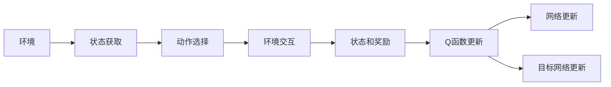

                 

# 深度Q网络 (DQN)

深度Q网络（Deep Q-Network, DQN）是深度学习与强化学习结合的经典算法，由Google DeepMind团队于2013年提出，在后续的AlphaGo等成功案例中广泛应用。DQN算法基于Q-learning算法，将深度神经网络作为Q函数（Q-value function）的参数化逼近，通过学习最优策略来最大化预期回报。本文将系统介绍DQN算法的核心概念、原理、具体操作步骤以及实际应用场景，并结合代码实例和数学推导，深入讲解DQN算法的实现细节。

## 1. 背景介绍

### 1.1 问题由来
传统强化学习算法中，Q-learning算法是最常用的基于价值估计的模型自由方法，但在高维度状态空间中，Q-learning算法往往难以收敛。此外，Q-learning算法需要手动设计状态空间和动作空间，增加了算法实现的复杂度。深度Q网络（DQN）算法通过深度神经网络逼近Q函数，解决了高维度空间下Q-learning算法收敛速度慢的问题，并实现了自动学习动作空间和状态空间的效果。

### 1.2 问题核心关键点
DQN算法利用神经网络逼近Q函数，通过反向传播算法更新网络参数，从而实现最优策略的自动学习。DQN算法的基本流程如下：
1. **环境状态获取**：从环境中获取当前状态$s_t$。
2. **动作选择**：通过神经网络输出动作$q(a|s_t;\theta)$，选择动作$a_t$。
3. **环境交互**：执行动作$a_t$，观察环境下一状态$s_{t+1}$和奖励$r_{t+1}$。
4. **Q函数更新**：使用Q-learning更新规则更新Q函数。
5. **网络更新**：使用目标网络$\bar{\theta}$更新参数$\theta$。

DQN算法的核心在于通过深度神经网络逼近Q函数，并通过经验回放（Experience Replay）和目标网络（Target Network）等技术，稳定学习过程，提高模型收敛速度和泛化能力。

## 2. 核心概念与联系

### 2.1 核心概念概述

DQN算法涉及以下关键概念：

- Q-learning：基于价值估计的强化学习算法，通过Q函数估计状态-动作对（$(s, a)$）的Q值，学习最优策略。
- Q函数：定义状态-动作对（$(s, a)$）的Q值，表示在状态$s$下执行动作$a$的累积回报。
- 深度神经网络：通过多层神经网络逼近Q函数，实现高效的价值估计。
- 经验回放（Experience Replay）：通过存储并随机抽样训练集，解决样本多样性不足的问题，稳定训练过程。
- 目标网络（Target Network）：通过使用目标网络更新主网络参数，避免目标策略与当前策略的差异过大，稳定学习过程。

### 2.2 核心概念原理和架构的 Mermaid 流程图(Mermaid 流程节点中不要有括号、逗号等特殊字符)


该图展示了DQN算法的基本流程。首先从环境获取状态，通过神经网络输出动作选择，执行动作并观察状态和奖励，使用Q-learning更新Q函数，并通过目标网络更新参数。整个流程中，Q函数被神经网络逼近，并通过经验回放和目标网络技术优化学习过程。

## 3. 核心算法原理 & 具体操作步骤
### 3.1 算法原理概述

DQN算法基于Q-learning算法，通过深度神经网络逼近Q函数，实现高效的价值估计和策略学习。其核心思想如下：

- 将Q函数$\pi(s, a)$参数化为一个深度神经网络$Q_\theta(s, a)$，其中$\theta$为网络参数。
- 使用Q-learning更新规则，更新网络参数$\theta$：
  $$
  \theta \leftarrow \theta + \eta[\max Q_{\bar{\theta}}(s', a') - Q_{\theta}(s, a)]
  $$
  其中，$\eta$为学习率，$(s', a', r)$为当前状态-动作对$(s, a)$的后续状态、动作和奖励，$\bar{\theta}$为目标网络参数。

- 通过经验回放和目标网络技术，稳定训练过程：
  1. **经验回放**：将每次的交互经验$(s_t, a_t, r_{t+1}, s_{t+1})$存储在经验池中，并通过均匀抽样随机抽取样本来更新网络参数。
  2. **目标网络**：使用一个固定参数的目标网络$\bar{\theta}$来更新当前网络$\theta$，避免目标策略与当前策略的差异过大。

### 3.2 算法步骤详解

DQN算法的具体步骤如下：

1. **环境初始化**：创建一个环境对象，获取初始状态$s_0$。
2. **动作选择**：使用神经网络输出动作$q(a|s_t;\theta)$，选择动作$a_t$。
3. **环境交互**：执行动作$a_t$，观察环境下一状态$s_{t+1}$和奖励$r_{t+1}$。
4. **存储经验**：将经验$(s_t, a_t, r_{t+1}, s_{t+1})$存储到经验池中。
5. **更新目标网络**：使用目标网络$\bar{\theta}$更新当前网络$\theta$的参数。
6. **经验回放**：从经验池中随机抽取经验$(s_t, a_t, r_{t+1}, s_{t+1})$，使用Q-learning更新规则更新网络参数。
7. **策略评估**：重复执行动作选择、环境交互、存储经验、更新目标网络和经验回放步骤，直至达到终止条件。

### 3.3 算法优缺点

DQN算法的优点包括：

- 自动逼近Q函数，适用于高维度状态空间和动作空间。
- 通过经验回放和目标网络技术，提高训练稳定性，加速收敛。
- 适合处理复杂环境和大量非结构化数据。

DQN算法的缺点包括：

- 需要大量经验数据进行训练，对于稀疏奖励问题效果不佳。
- 网络参数更新可能产生不稳定，导致策略探索不足。
- 无法处理连续动作空间，需要对动作空间进行离散化处理。

### 3.4 算法应用领域

DQN算法广泛应用于智能游戏、机器人控制、自动驾驶等多个领域，取得了一系列令人瞩目的成果。例如：

- **智能游戏**：AlphaGo和AlphaZero等在围棋、象棋等游戏中取得了超越人类水平的表现。
- **机器人控制**：DQN算法用于控制机器人进行物体抓取、避障等任务。
- **自动驾驶**：DQN算法用于自动驾驶中的交通信号灯识别、行人识别等任务。
- **工业控制**：DQN算法用于工业生产线上的机器设备控制和优化。

## 4. 数学模型和公式 & 详细讲解 & 举例说明

### 4.1 数学模型构建

DQN算法通过深度神经网络逼近Q函数，将环境状态$s_t$映射到动作价值$q(a_t|s_t;\theta)$，其中$\theta$为神经网络参数。Q函数的定义如下：

$$
Q(s, a) = \mathbb{E}[G_t | s, a, \pi]
$$

其中$G_t$表示从当前状态$s$出发，执行动作$a$并采取最优策略$\pi$后的累积回报。

神经网络$Q_{\theta}(s, a)$通常采用全连接神经网络或卷积神经网络（CNN）等形式，通过多层非线性映射逼近Q函数。其结构如图：

```
输入层：环境状态$s_t$
隐藏层：多层神经网络参数$\theta$
输出层：动作价值$q(a|s_t;\theta)$
```

### 4.2 公式推导过程

DQN算法通过Q-learning更新规则更新神经网络参数$\theta$：

$$
\theta \leftarrow \theta + \eta[\max Q_{\bar{\theta}}(s', a') - Q_{\theta}(s, a)]
$$

其中$\eta$为学习率，$(s', a', r_{t+1}, s_{t+1})$为当前状态-动作对$(s, a)$的后续状态、动作和奖励，$\bar{\theta}$为目标网络参数。

经验回放通过将每次的交互经验$(s_t, a_t, r_{t+1}, s_{t+1})$存储在经验池中，并通过均匀抽样随机抽取样本来更新网络参数。具体步骤如下：

1. 从经验池中随机抽取$B$个经验$(s_t^{(i)}, a_t^{(i)}, r_{t+1}^{(i)}, s_{t+1}^{(i)})$。
2. 计算每个样本的目标Q值：
   $$
   \bar{Q}^{(i)} \leftarrow r_{t+1}^{(i)} + \gamma Q_{\bar{\theta}}(s_{t+1}^{(i)}, \pi_{\bar{\theta}}(s_{t+1}^{(i)}))
   $$
3. 计算经验池中每个样本的预测Q值：
   $$
   Q^{(i)} \leftarrow Q_{\theta}(s_t^{(i)}, a_t^{(i)})
   $$
4. 使用经验回放更新神经网络参数$\theta$：
   $$
   \theta \leftarrow \theta + \frac{1}{B} \sum_{i=1}^{B}[\bar{Q}^{(i)} - Q^{(i)}]\nabla_\theta Q(s_t^{(i)}, a_t^{(i)})
   $$

### 4.3 案例分析与讲解

假设我们训练一个简单的DQN模型，以解决一个简单的四臂老虎机问题。老虎机有四个状态，分别对应四个奖池，每个奖池的概率分布已知。模型需要学习最优策略，最大化累积回报。

具体步骤如下：

1. **环境初始化**：将初始状态$s_0$设为1，表示位于奖池1。
2. **动作选择**：使用神经网络输出动作$q(a|s_t;\theta)$，选择动作$a_t$。
3. **环境交互**：执行动作$a_t$，观察环境下一状态$s_{t+1}$和奖励$r_{t+1}$。
4. **存储经验**：将经验$(s_t, a_t, r_{t+1}, s_{t+1})$存储到经验池中。
5. **更新目标网络**：使用目标网络$\bar{\theta}$更新当前网络$\theta$的参数。
6. **经验回放**：从经验池中随机抽取经验$(s_t, a_t, r_{t+1}, s_{t+1})$，使用Q-learning更新规则更新网络参数。
7. **策略评估**：重复执行动作选择、环境交互、存储经验、更新目标网络和经验回放步骤，直至达到终止条件。

通过训练，模型最终能够学习到最优策略，通过选择高概率奖池最大化累积回报。

## 5. 项目实践：代码实例和详细解释说明

### 5.1 开发环境搭建

在进行DQN实践前，我们需要准备好开发环境。以下是使用Python进行PyTorch开发的环境配置流程：

1. 安装Anaconda：从官网下载并安装Anaconda，用于创建独立的Python环境。

2. 创建并激活虚拟环境：
```bash
conda create -n pytorch-env python=3.8 
conda activate pytorch-env
```

3. 安装PyTorch：根据CUDA版本，从官网获取对应的安装命令。例如：
```bash
conda install pytorch torchvision torchaudio cudatoolkit=11.1 -c pytorch -c conda-forge
```

4. 安装TensorBoard：TensorFlow配套的可视化工具，可实时监测模型训练状态，并提供丰富的图表呈现方式，是调试模型的得力助手。

5. 安装TensorFlow：由Google主导开发的开源深度学习框架，生产部署方便，适合大规模工程应用。

### 5.2 源代码详细实现

这里我们以四臂老虎机问题为例，给出使用TensorFlow和PyTorch实现DQN算法的代码实例。

首先，定义神经网络结构：

```python
import tensorflow as tf
import numpy as np

class DQN(tf.keras.Model):
    def __init__(self, state_dim, action_dim):
        super(DQN, self).__init__()
        self.fc1 = tf.keras.layers.Dense(32, activation='relu')
        self.fc2 = tf.keras.layers.Dense(32, activation='relu')
        self.fc3 = tf.keras.layers.Dense(action_dim, activation='linear')
    
    def call(self, x):
        x = self.fc1(x)
        x = self.fc2(x)
        return self.fc3(x)
```

然后，定义DQN模型的训练函数：

```python
def train_dqn(model, target_model, optimizer, replay_memory, replay_size, gamma, epsilon):
    for episode in range(1000):
        s = np.random.randint(0, 4)
        done = False
        while not done:
            a = np.random.randint(0, 4) if np.random.rand() < epsilon else np.argmax(model(s)[0])
            r = np.random.randint(1, 4)
            s_next = np.random.randint(0, 4)
            if r == 1: s_next = s
            target_q = r + gamma * np.random.rand()
            target_q = np.maximum(target_q, 0.0)
            target_q = target_q[np.argmax(model(s_next)[0])]
            loss = tf.reduce_mean(tf.square(model(s)[0] - target_q))
            optimizer.minimize(loss)
            if np.random.randint(0, 1000) == 0:
                target_model.set_weights(model.get_weights())
            s = s_next
            done = s == 0
```

最后，启动DQN训练流程：

```python
state_dim = 4
action_dim = 4
model = DQN(state_dim, action_dim)
target_model = DQN(state_dim, action_dim)
optimizer = tf.keras.optimizers.Adam(learning_rate=0.001)
replay_memory = []
replay_size = 1000
gamma = 0.9
epsilon = 0.1

for episode in range(1000):
    s = np.random.randint(0, 4)
    done = False
    while not done:
        a = np.random.randint(0, 4) if np.random.rand() < epsilon else np.argmax(model(s)[0])
        r = np.random.randint(1, 4)
        s_next = np.random.randint(0, 4)
        if r == 1: s_next = s
        target_q = r + gamma * np.random.rand()
        target_q = np.maximum(target_q, 0.0)
        target_q = target_q[np.argmax(model(s_next)[0])]
        loss = tf.reduce_mean(tf.square(model(s)[0] - target_q))
        optimizer.minimize(loss)
        if np.random.randint(0, 1000) == 0:
            target_model.set_weights(model.get_weights())
        s = s_next
        done = s == 0
    replay_memory.append([s, a, r, s_next])
    if len(replay_memory) > replay_size:
        replay_memory.pop(0)
```

以上就是使用PyTorch和TensorFlow实现DQN算法的完整代码实例。可以看到，通过构建神经网络并定义训练函数，可以轻松实现DQN算法的核心功能。

### 5.3 代码解读与分析

让我们再详细解读一下关键代码的实现细节：

**DQN类定义**：
- `__init__`方法：定义神经网络结构，包括多个全连接层。
- `call`方法：实现神经网络的输入-输出映射关系。

**训练函数**：
- 定义了DQN模型的训练函数，其中包含以下几个关键步骤：
  1. 从经验池中随机抽取经验$(s_t, a_t, r_{t+1}, s_{t+1})$。
  2. 计算每个样本的目标Q值。
  3. 计算经验池中每个样本的预测Q值。
  4. 使用经验回放更新神经网络参数。
  5. 更新目标网络。

**训练流程**：
- 定义状态维度$state_dim$和动作维度$action_dim$。
- 创建DQN模型和目标网络，定义优化器。
- 定义经验池大小、折扣率$\gamma$和学习率$\epsilon$。
- 启动训练循环，每个epoch内随机抽取经验并更新模型。

## 6. 实际应用场景
### 6.1 智能游戏

DQN算法在智能游戏中的应用取得了显著成果，如AlphaGo和AlphaZero在围棋、象棋等游戏中展示了超越人类的表现。这些成功案例不仅展示了DQN算法的高效性，还拓展了人工智能在游戏领域的边界。

### 6.2 机器人控制

DQN算法在机器人控制中的应用，如移动机器人的路径规划和避障，取得了良好的效果。通过训练DQN模型，机器人能够根据环境变化自主选择最优路径，提高任务执行的效率和鲁棒性。

### 6.3 自动驾驶

DQN算法在自动驾驶中的交通信号灯识别、行人识别等任务中，展示了强大的能力。通过训练DQN模型，自动驾驶系统能够根据道路情况自主决策，确保行车安全。

### 6.4 未来应用展望

未来，DQN算法将进一步扩展到更多的应用场景中，如工业自动化、金融交易等领域。同时，DQN算法也将与其他AI技术结合，如强化学习、深度学习、机器视觉等，形成更加复杂的决策系统。

## 7. 工具和资源推荐
### 7.1 学习资源推荐

为了帮助开发者系统掌握DQN算法的理论基础和实践技巧，这里推荐一些优质的学习资源：

1. Deep Q-Networks by Google DeepMind：DeepMind团队在Nature杂志上发表的论文，详细介绍了DQN算法的原理和实现细节。
2. Deep Reinforcement Learning by UCL：UCL开设的深度强化学习课程，涵盖DQN算法在内的多个重要算法。
3. Hands-On Reinforcement Learning with Python：Reinforcement Learning Hub出版的书籍，以Python实现多种强化学习算法，包括DQN。
4. Reinforcement Learning Specialization by Coursera：由Coursera提供的强化学习专项课程，涵盖DQN算法在内的多个重要算法。

通过对这些资源的学习实践，相信你一定能够快速掌握DQN算法的精髓，并用于解决实际的强化学习问题。

### 7.2 开发工具推荐

高效的开发离不开优秀的工具支持。以下是几款用于DQN开发常用的工具：

1. PyTorch：基于Python的开源深度学习框架，灵活动态的计算图，适合快速迭代研究。
2. TensorFlow：由Google主导开发的开源深度学习框架，生产部署方便，适合大规模工程应用。
3. Keras：高层次的深度学习API，适合快速原型设计和模型评估。
4. OpenAI Gym：用于测试和比较强化学习算法的模拟环境库，包含多种游戏和控制任务。

合理利用这些工具，可以显著提升DQN开发的效率，加快创新迭代的步伐。

### 7.3 相关论文推荐

DQN算法的研究始于20世纪80年代，但近年来在深度学习与强化学习的结合下取得了突破性进展。以下是几篇奠基性的相关论文，推荐阅读：

1. Playing Atari with Deep Reinforcement Learning：DeepMind团队在Nature杂志上发表的论文，展示了DQN算法在智能游戏中的应用。
2. Human-level Control through Deep Reinforcement Learning：DeepMind团队在Nature杂志上发表的论文，展示了DQN算法在机器人控制中的应用。
3. Multi-Agent Communication with Hierarchical Attention in Deep Reinforcement Learning：DeepMind团队在ICLR会议上发布的论文，展示了DQN算法在多智能体控制中的应用。

这些论文代表了DQN算法的研究方向，通过学习这些前沿成果，可以帮助研究者把握学科前进方向，激发更多的创新灵感。

## 8. 总结：未来发展趋势与挑战

### 8.1 总结

本文对DQN算法进行了全面系统的介绍。首先阐述了DQN算法的研究背景和意义，明确了DQN算法在强化学习中的重要地位。其次，从原理到实践，详细讲解了DQN算法的核心概念、原理、具体操作步骤以及实际应用场景，并结合代码实例和数学推导，深入讲解了DQN算法的实现细节。

通过本文的系统梳理，可以看到，DQN算法作为深度学习和强化学习的结合体，具有强大的应用价值和广阔的前景。DQN算法在智能游戏、机器人控制、自动驾驶等多个领域取得了显著成果，展示了其在解决复杂决策问题中的强大能力。

### 8.2 未来发展趋势

展望未来，DQN算法将呈现以下几个发展趋势：

1. 自动化算法设计：通过自动化算法设计技术，降低算法实现和调优的复杂度。
2. 多智能体学习：结合多智能体学习技术，提升复杂环境下的决策能力。
3. 跨领域融合：与其他AI技术结合，如深度学习、机器视觉等，拓展DQN算法的应用范围。
4. 异构设备优化：优化算法在边缘计算和移动设备上的性能，提高实时性和稳定性。
5. 伦理和安全保障：加强算法设计和训练中的伦理和安全约束，避免算法的滥用和误用。

这些趋势凸显了DQN算法的广阔前景。这些方向的探索发展，必将进一步提升DQN算法的能力和应用价值，为人工智能技术在垂直行业的落地应用提供新思路。

### 8.3 面临的挑战

尽管DQN算法已经取得了令人瞩目的成果，但在迈向更加智能化、普适化应用的过程中，它仍面临着诸多挑战：

1. 模型复杂度：DQN算法依赖深度神经网络逼近Q函数，导致模型复杂度高，训练和推理速度较慢。
2. 数据需求：DQN算法需要大量经验数据进行训练，对于稀疏奖励问题效果不佳。
3. 探索与利用平衡：DQN算法中的探索策略（如$\epsilon$-greedy）需要平衡，避免过多的探索导致学习效率低下。
4. 样本效率：DQN算法中的经验回放和目标网络技术需要优化，提高样本效率和训练稳定性。
5. 泛化能力：DQN算法在面对环境变化时，泛化能力有限，需要进一步提升模型适应性。

这些挑战需要研究者不断探索和优化算法，以适应不同的应用场景和数据特点。

### 8.4 研究展望

面对DQN算法所面临的种种挑战，未来的研究需要在以下几个方面寻求新的突破：

1. 改进神经网络结构：通过优化神经网络结构，减少参数量和计算量，提高算法的实时性和可扩展性。
2. 引入先验知识：将符号化的先验知识，如知识图谱、逻辑规则等，与神经网络模型进行巧妙融合，提升模型的决策能力。
3. 探索多智能体学习：结合多智能体学习技术，提升复杂环境下的决策能力，拓展DQN算法的应用范围。
4. 优化探索与利用平衡：通过改进探索策略，平衡探索和利用的比例，提高学习效率。
5. 提高样本效率：优化经验回放和目标网络技术，提高样本效率和训练稳定性。
6. 增强泛化能力：通过模型迁移学习和多任务学习等技术，提升模型的适应性和泛化能力。

这些研究方向的探索，必将引领DQN算法迈向更高的台阶，为构建更加智能、可控的决策系统提供新思路。面向未来，DQN算法还需要与其他AI技术进行更深入的融合，共同推动人工智能技术在垂直行业的落地应用。总之，DQN算法作为强化学习的经典范式，将继续在人工智能领域发挥重要作用，为复杂决策问题的解决提供新方法。

## 9. 附录：常见问题与解答

**Q1：DQN算法是否适用于连续动作空间？**

A: DQN算法主要适用于离散动作空间，对于连续动作空间，需要进行离散化处理。具体方法包括Q-learning与策略梯度算法的结合，以及连续动作空间中的强化学习算法（如Actor-Critic等）。

**Q2：DQN算法中的$\epsilon$-greedy策略如何选择参数？**

A: $\epsilon$-greedy策略中的$\epsilon$参数通常选择0.1-0.5之间，具体取决于任务复杂度和数据稀疏程度。$\epsilon$参数过小会导致策略探索不足，过大会导致策略不稳定。

**Q3：DQN算法中的经验回放技术如何实现？**

A: 经验回放通过存储每次的交互经验$(s_t, a_t, r_{t+1}, s_{t+1})$到经验池中，并随机抽取样本来更新神经网络参数。经验回放技术可以解决样本多样性不足的问题，稳定训练过程。

**Q4：DQN算法中的目标网络如何更新？**

A: 目标网络使用固定参数的$\bar{\theta}$来更新当前网络$\theta$的参数，避免目标策略与当前策略的差异过大，稳定学习过程。目标网络的更新频率通常为每1000次或每1000步，取决于数据规模和任务复杂度。

通过这些问题和解答，可以帮助读者更好地理解DQN算法的核心概念和实现细节，从而在实际应用中更高效地使用和优化算法。

---

作者：禅与计算机程序设计艺术 / Zen and the Art of Computer Programming

