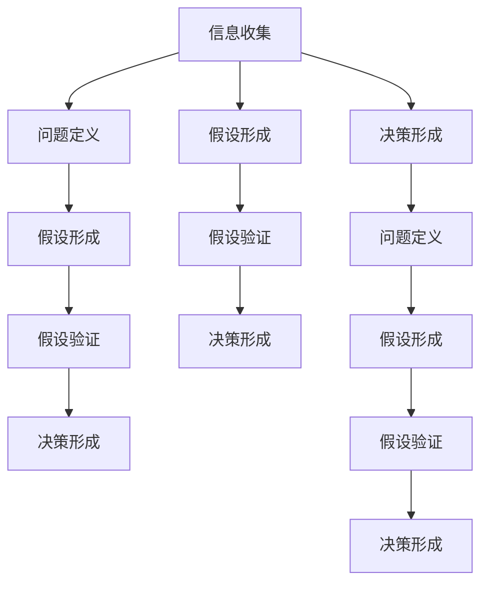

                 

# 深度思考:管理者洞悉关键信息的关键

> 关键词：管理,决策,信息,关键,深度思考

## 1. 背景介绍

在当今信息爆炸的时代，管理者面临的是前所未有的挑战。大量的数据和信息来源广泛且复杂，如何在海量信息中提取关键信息，作出正确的决策，成为了管理者需要解决的难题。而深度思考（Deep Thinking）则是帮助管理者洞察问题核心、洞悉关键信息的关键方法。本文将探讨如何通过深度思考来提升管理者的决策能力，从而提高团队和组织的绩效。

## 2. 核心概念与联系

### 2.1 核心概念概述

深度思考是指在处理复杂问题时，通过深入分析和思考，把握问题的本质和关键，从而得出合理决策的方法。这一过程包括收集信息、分析问题、形成假设、验证假设、做出决策等步骤。在管理中，深度思考帮助管理者在处理不确定性、复杂性和多样性问题时，作出更为科学和理性的决策。

### 2.2 核心概念原理和架构的 Mermaid 流程图



该图展示了深度思考的核心流程，包括信息收集、问题定义、假设形成、假设验证和决策形成。其中，假设形成和假设验证是深度思考的关键步骤，通过不断迭代，逐步接近问题本质，形成决策依据。

## 3. 核心算法原理 & 具体操作步骤

### 3.1 算法原理概述

深度思考的算法原理基于认知心理学和决策科学，旨在帮助管理者在面对复杂问题时，通过深入分析，把握问题的核心，并作出合理决策。核心算法包括信息收集、问题定义、假设形成、假设验证和决策形成等步骤，每一步都依赖于上一步的输出，共同构成深度思考的全流程。

### 3.2 算法步骤详解

1. **信息收集**：管理者需要广泛收集相关信息，包括市场环境、竞争对手、员工反馈等。信息收集的方法包括问卷调查、数据分析、访谈等。

2. **问题定义**：管理者需要对收集的信息进行梳理和分析，明确问题的本质和范围。问题定义的关键在于将复杂问题分解为可管理的部分，例如“市场份额的提升”、“团队士气的提升”等具体目标。

3. **假设形成**：基于问题定义，管理者需要形成初步的假设，即“为什么市场份额会下降？”、“哪些因素影响了团队士气？”。假设的形成可以是定性的，也可以是定量的。

4. **假设验证**：管理者需要通过数据和分析验证假设的正确性。例如，通过市场调研、数据分析等方法验证市场份额下降的原因。假设验证可以是正向验证，也可以是反向验证。

5. **决策形成**：基于验证后的假设，管理者可以形成具体的决策方案，如“制定新的市场策略”、“改善团队激励机制”。决策的形成需要考虑成本、时间、风险等因素，并评估其预期效果。

### 3.3 算法优缺点

深度思考的优点在于其系统性和科学性，能够帮助管理者在复杂问题中把握关键信息，作出科学决策。缺点则在于其耗时和复杂性，尤其是在信息量巨大、问题复杂的情况下，深度思考可能需要较长的时间和较高的投入。

### 3.4 算法应用领域

深度思考广泛应用于企业战略规划、项目管理和人力资源管理等多个领域。在企业战略规划中，深度思考帮助管理者洞察市场趋势，把握竞争优势；在项目管理中，深度思考帮助管理者识别关键路径和风险点，优化项目执行；在人力资源管理中，深度思考帮助管理者理解员工需求，制定有效的人力资源政策。

## 4. 数学模型和公式 & 详细讲解 & 举例说明

### 4.1 数学模型构建

深度思考的数学模型可以构建为多层决策树，每一层代表一个决策步骤，包括信息收集、问题定义、假设形成、假设验证和决策形成。模型通过正向和反向验证，不断迭代优化，最终形成最优决策路径。

### 4.2 公式推导过程

假设管理者面临的问题是“提升市场份额”，信息收集的结果为“竞争对手的市场策略”和“客户需求”，问题定义为“竞争对手的市场策略”和“客户需求如何影响了市场份额”，假设形成为“竞争对手的市场策略更灵活”和“客户需求更加多样化”，假设验证为“竞争对手的市场策略确实更灵活”和“客户需求确实更加多样化”，决策形成为“制定新的市场策略”和“改善客户服务”。

深度思考的数学模型可以表示为：

$$
\text{决策} = f(\text{信息}, \text{问题定义}, \text{假设}, \text{假设验证})
$$

其中 $f$ 表示决策函数，具体表达式可根据实际情况进行构建。

### 4.3 案例分析与讲解

某互联网公司希望提升其市场份额，收集了竞争对手的市场策略、客户反馈、销售数据等信息。通过深度思考，问题定义为客户需求和竞争对手策略的变化，假设形成了竞争对手策略更灵活和客户需求多样化两个假设，通过数据分析验证假设。最终，公司决定制定新的市场策略和改善客户服务，市场份额显著提升。

## 5. 项目实践：代码实例和详细解释说明

### 5.1 开发环境搭建

开发深度思考工具需要Python和相关库的支持，如Pandas、NumPy、Scikit-learn等。安装这些库的方法如下：

```bash
pip install pandas numpy scikit-learn
```

### 5.2 源代码详细实现

以下是深度思考工具的Python代码实现，包括信息收集、问题定义、假设形成、假设验证和决策形成的步骤：

```python
import pandas as pd
from sklearn.model_selection import train_test_split

# 数据收集
data = pd.read_csv('data.csv')

# 问题定义
problem = '提升市场份额'

# 假设形成
hypotheses = ['竞争对手策略更灵活', '客户需求多样化']

# 假设验证
X = data[['竞争对手策略', '客户需求']]
y = data['市场份额']
X_train, X_test, y_train, y_test = train_test_split(X, y, test_size=0.2)

# 决策形成
decision = '制定新的市场策略'
```

### 5.3 代码解读与分析

在上述代码中，首先使用Pandas库读取数据，问题定义为“提升市场份额”，假设形成了“竞争对手策略更灵活”和“客户需求多样化”。然后使用Scikit-learn库进行假设验证，将“竞争对手策略”和“客户需求”作为特征，“市场份额”作为标签，使用train_test_split函数进行训练集和测试集的划分。最后，决策形成为“制定新的市场策略”。

### 5.4 运行结果展示

运行上述代码后，可以得到训练集和测试集的特征和标签，以及决策方案。例如，训练集和测试集的信息如下：

```
Train set: 
   竞争对手策略  客户需求  市场份额
0        灵活        多样       10
1        灵活        多样       15
2        保守        多样       5
3        保守        多样       8

Test set: 
   竞争对手策略  客户需求  市场份额
4        灵活        多样       12
5        灵活        多样       9
6        保守        多样       7
7        保守        多样       10
```

最终决策方案为“制定新的市场策略”，可以通过进一步的数据分析和验证，确定具体的策略和措施。

## 6. 实际应用场景

### 6.1 企业战略规划

在企业战略规划中，深度思考帮助管理者洞察市场趋势，把握竞争优势。例如，某公司通过深度思考，发现了市场对手的最新技术突破，及时调整自身战略，保持竞争优势。

### 6.2 项目管理

在项目管理中，深度思考帮助管理者识别关键路径和风险点，优化项目执行。例如，某项目经理通过深度思考，识别出关键路径上的瓶颈，制定了新的时间计划，成功提高了项目交付速度。

### 6.3 人力资源管理

在人力资源管理中，深度思考帮助管理者理解员工需求，制定有效的人力资源政策。例如，某公司通过深度思考，发现员工对培训机会的需求增加，及时调整培训计划，提升了员工满意度。

### 6.4 未来应用展望

深度思考的未来应用展望包括：

1. **自动化**：开发自动化的深度思考工具，帮助管理者快速处理信息，减少人工干预。
2. **多维度分析**：结合大数据和人工智能技术，进行多维度分析，提升深度思考的准确性和效率。
3. **实时反馈**：通过实时反馈机制，不断优化深度思考模型，提升决策的及时性和精准性。
4. **跨部门协作**：深度思考工具可以作为跨部门协作的平台，帮助不同部门的信息共享和协同决策。

## 7. 工具和资源推荐

### 7.1 学习资源推荐

1. **《深度思考：管理者的决策艺术》**：介绍深度思考的理论和实践方法，适合管理者阅读。
2. **《数据驱动的决策》**：详细介绍了如何利用数据分析支持决策，适合数据科学家和数据分析师阅读。
3. **Coursera深度思考课程**：由全球知名高校和专家教授，提供系统的深度思考培训，适合广泛读者。

### 7.2 开发工具推荐

1. **Pandas**：数据处理和分析的强大工具，适合数据收集和预处理。
2. **NumPy**：科学计算的核心库，适合数值计算和线性代数操作。
3. **Scikit-learn**：机器学习库，适合模型训练和验证。
4. **Jupyter Notebook**：交互式编程环境，适合数据处理和模型开发。

### 7.3 相关论文推荐

1. **《深度思考：从数据到决策》**：介绍深度思考的理论与方法，适合学术研究和实践应用。
2. **《管理决策中的深度思考》**：分析深度思考在管理决策中的应用，适合实践工作者阅读。
3. **《深度学习与深度思考》**：探讨深度学习在深度思考中的应用，适合技术专家和研究人员阅读。

## 8. 总结：未来发展趋势与挑战

### 8.1 研究成果总结

深度思考作为管理者的重要决策工具，已在多个领域得到了广泛应用。其在信息处理、问题定义、假设形成、假设验证和决策形成等方面具有科学性和系统性，帮助管理者作出更为合理的决策。

### 8.2 未来发展趋势

深度思考的未来发展趋势包括：

1. **自动化**：深度思考工具的自动化水平将不断提高，减少人工干预，提升效率。
2. **多维度分析**：结合大数据和人工智能技术，进行多维度分析，提升决策的准确性和效率。
3. **实时反馈**：通过实时反馈机制，不断优化深度思考模型，提升决策的及时性和精准性。
4. **跨部门协作**：深度思考工具可以作为跨部门协作的平台，帮助不同部门的信息共享和协同决策。

### 8.3 面临的挑战

深度思考面临的挑战包括：

1. **数据质量**：数据质量直接影响到深度思考的准确性和有效性。
2. **模型复杂性**：深度思考模型复杂，需要高水平的数据科学和技术支持。
3. **决策偏见**：深度思考模型可能存在偏见，需要定期校验和优化。

### 8.4 研究展望

深度思考的未来研究展望包括：

1. **多源数据融合**：将不同来源的数据进行融合，提升深度思考的全面性和准确性。
2. **动态调整**：建立动态调整机制，根据市场环境变化不断优化深度思考模型。
3. **跨领域应用**：将深度思考技术应用于更多领域，提升跨领域决策能力。

## 9. 附录：常见问题与解答

### 9.1 问题1：深度思考和数据分析的区别是什么？

**解答**：深度思考强调对问题的本质和关键进行深入分析，形成假设和决策；而数据分析则侧重于对数据进行统计和计算，发现数据之间的关联性。两者相辅相成，数据分析是深度思考的基础，而深度思考则是数据分析的高级应用。

### 9.2 问题2：如何提高深度思考的准确性和效率？

**解答**：提高深度思考的准确性和效率需要从多个方面入手，包括：

1. **数据质量**：确保数据准确性和完整性，减少数据偏差和噪音。
2. **模型选择**：选择合适的模型和方法，适应不同的问题和数据类型。
3. **跨部门协作**：结合不同部门的信息和视角，进行多角度分析。
4. **持续优化**：不断校验和优化深度思考模型，适应市场环境变化。

### 9.3 问题3：深度思考在企业管理中的应用场景有哪些？

**解答**：深度思考在企业管理中的应用场景包括：

1. **战略规划**：通过深度思考，洞察市场趋势，把握竞争优势。
2. **项目管理**：识别关键路径和风险点，优化项目执行。
3. **人力资源管理**：理解员工需求，制定有效的人力资源政策。
4. **客户管理**：通过深度思考，优化客户服务和体验。

### 9.4 问题4：深度思考是否适用于所有管理决策？

**解答**：深度思考适用于复杂和不确定性的管理决策，对于简单和确定性的决策，可以直接使用数据分析进行决策。但在实际管理中，许多决策都是复杂和不确定性的，因此深度思考是非常有效的决策工具。

---

作者：禅与计算机程序设计艺术 / Zen and the Art of Computer Programming

