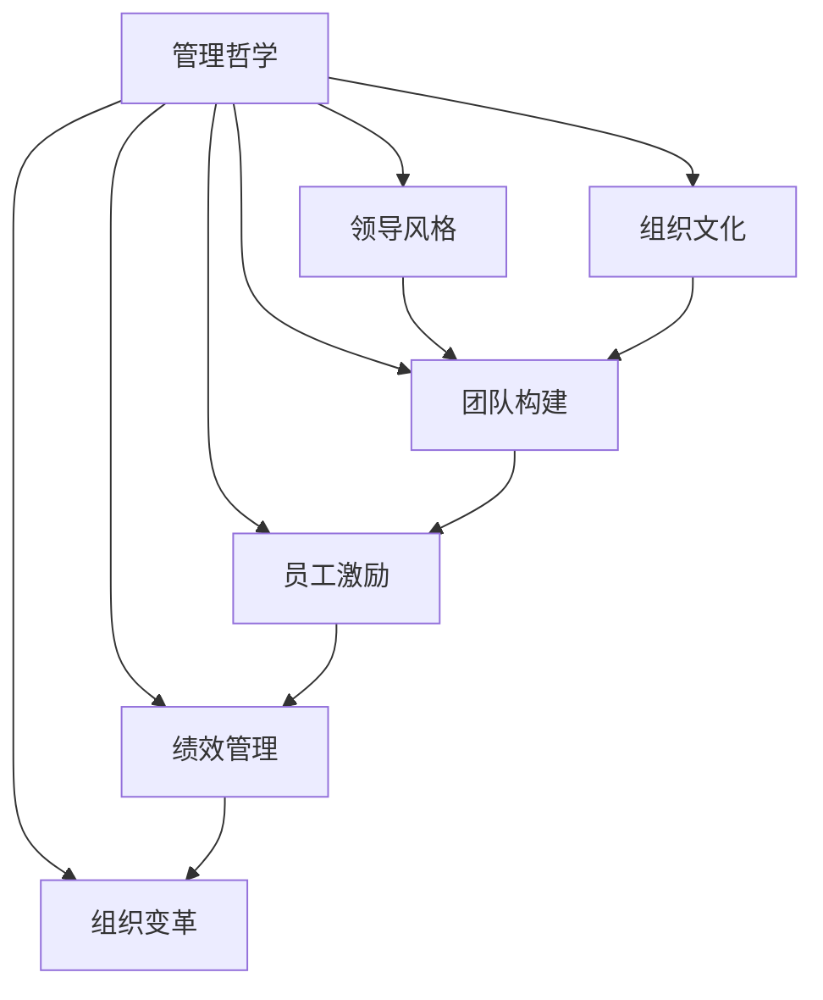

                 

# 深邃思考:区分平庸与卓越管理者

> 关键词：管理哲学,组织文化,领导风格,团队构建,员工激励,绩效管理,组织变革

## 1. 背景介绍

### 1.1 问题由来

在当今快速变化和高度竞争的商业环境中，成功的企业管理者不仅仅是战略规划者，更是团队构建者。他们必须能够识别、培养和激励人才，同时推动组织在复杂多变的环境中稳健发展。然而，众多企业在管理实践中，常因理念模糊、方法不当而陷入低效与失败。如何区分平庸与卓越的管理者，是每个企业都应该深入思考的问题。

### 1.2 问题核心关键点

卓越管理者与平庸管理者之间的根本区别，在于他们是否具备正确的管理哲学、领导风格、组织文化和绩效管理能力。要深入理解这一问题，需从多个层面进行探讨：

- **管理哲学**：企业管理者的价值观和思维框架，如何影响企业的决策与行动。
- **领导风格**：管理者的行为模式和沟通方式，如何激发团队的潜力和创造力。
- **组织文化**：企业的氛围和价值观，如何塑造员工的行为和表现。
- **团队构建**：如何甄选、发展和留用人才，形成高效协作的团队。
- **员工激励**：如何设计有效的激励机制，激发员工的积极性和动力。
- **绩效管理**：如何设定目标、监控进展和评估结果，确保组织持续提升。
- **组织变革**：如何适应和引领行业变革，持续推动企业创新与成长。

理解这些关键点，对于培养卓越管理者，提升企业整体效能，具有重要意义。

## 2. 核心概念与联系

### 2.1 核心概念概述

为更好地理解卓越管理者的特质，本节将介绍几个核心概念：

- **管理哲学**：企业管理者的基本价值观和思维方式，如系统思考、人性关怀、公平公正等。
- **领导风格**：管理者的行为模式和沟通方式，如授权型、指导型、任务型、变革型等。
- **组织文化**：企业内部的氛围、价值观和行为规范，如创新导向、客户至上、团队协作等。
- **团队构建**：如何通过甄选、培训和发展人才，形成高效的团队结构。
- **员工激励**：设计激励机制，激发员工积极性和创造力的方法和策略。
- **绩效管理**：通过设定明确的目标、监控进展和评估结果，推动组织持续改进。
- **组织变革**：适应和引领行业变革，推动企业创新和成长的过程。

这些核心概念之间的逻辑关系可以通过以下Mermaid流程图来展示：



这个流程图展示了核心概念之间的关系：

1. 管理哲学作为根基，影响着领导风格、组织文化、团队构建、员工激励、绩效管理和组织变革的实施。
2. 领导风格、组织文化、团队构建、员工激励、绩效管理和组织变革是管理哲学在不同维度的具体体现和实践。
3. 这些概念相互交织，共同构成了卓越管理者的特质，推动企业持续发展。

## 3. 核心算法原理 & 具体操作步骤
### 3.1 算法原理概述

区分卓越与平庸管理者的关键在于识别和量化这些核心概念的表现。具体来说，可以从以下几个方面入手：

- **量化领导风格**：通过行为问卷、360度反馈等方式，评估管理者的领导风格特征。
- **测量组织文化**：使用文化评估工具，如员工满意度调查、组织认同度评估等，了解企业文化状况。
- **评估团队构建能力**：分析团队绩效数据、员工流失率、团队协作效率等指标，评估团队构建效果。
- **设计激励机制**：通过薪酬、晋升、奖励等方式，结合员工需求和公司战略，设计激励方案。
- **监控绩效管理效果**：设定目标、评估进展、分析结果，确保绩效管理机制的有效性。
- **推动组织变革**：通过SWOT分析、PESTEL分析等方法，识别变革需求，设计变革方案。

### 3.2 算法步骤详解

区分卓越与平庸管理者的具体操作流程包括以下几个步骤：

**Step 1: 数据收集与分析**
- 收集管理者的行为数据、团队绩效数据、员工反馈数据等。
- 使用定量与定性分析方法，评估各项指标的表现。
- 量化各项指标，形成直观的对比和评估。

**Step 2: 领导风格评估**
- 使用行为问卷或360度反馈工具，评估管理者的领导风格。
- 根据评分，将领导风格划分为授权型、指导型、任务型、变革型等类别。
- 对比不同风格的管理者，分析其对团队和组织的影响。

**Step 3: 组织文化测量**
- 使用文化评估工具，如员工满意度调查、组织认同度评估等，收集企业文化数据。
- 根据评分，分析企业文化的强度、分布和趋势。
- 对比不同文化特征的企业，评估其对企业绩效和员工满意度的影响。

**Step 4: 团队构建与评估**
- 分析团队绩效数据、员工流失率、团队协作效率等指标。
- 评估管理者的团队构建能力，如人才识别、培养和留用等。
- 对比不同团队建设能力的管理者，评估其对团队绩效的影响。

**Step 5: 员工激励设计**
- 设计激励方案，结合薪酬、晋升、奖励等方式，激励员工。
- 结合员工需求和公司战略，设计有针对性的激励机制。
- 评估激励效果，分析激励对员工绩效和满意度的影响。

**Step 6: 绩效管理监控**
- 设定明确的绩效目标和指标。
- 监控团队和员工的进展情况，及时反馈和调整。
- 评估绩效管理的效果，分析结果对组织改进的影响。

**Step 7: 组织变革推动**
- 使用SWOT分析和PESTEL分析等工具，识别组织变革的需求。
- 设计变革方案，包括变革目标、路径和策略。
- 推动变革实施，评估变革效果，持续改进。

### 3.3 算法优缺点

区分卓越与平庸管理者的算法具有以下优点：

- **系统性**：通过多个维度的评估，提供全面的数据分析和比较。
- **可操作性**：每一步操作都有明确的方法和工具，易于实践和执行。
- **定量分析**：量化评估结果，便于对比和决策。
- **动态性**：可定期更新数据，持续监控和改进管理实践。

同时，也存在一些缺点：

- **复杂性**：操作过程涉及多个步骤和工具，可能较为复杂。
- **成本较高**：部分操作需要大量的时间和资源，如360度反馈、绩效评估等。
- **数据噪音**：可能存在数据收集和分析过程中的噪音，影响评估结果的准确性。
- **主观性强**：部分评估和分析需依赖主观判断，可能存在主观偏差。

### 3.4 算法应用领域

该算法适用于各行各业的管理实践，特别在人力资源管理、团队建设、绩效管理等方面具有重要应用价值：

- **人力资源管理**：通过量化领导风格和团队构建能力，提升人才识别和培养效果。
- **团队建设**：通过测量组织文化，促进团队协作和创新。
- **绩效管理**：通过设计有效的激励机制和绩效管理流程，提升员工绩效和满意度。
- **组织变革**：通过SWOT分析和PESTEL分析，推动企业适应外部环境变化，持续创新和成长。

## 4. 数学模型和公式 & 详细讲解  
### 4.1 数学模型构建

本节将使用数学语言对区分卓越与平庸管理者的算法进行更加严格的刻画。

假设我们有 $N$ 名管理者，记为 $M=\{m_i\}_{i=1}^N$，其中 $m_i$ 代表第 $i$ 名管理者的行为特征和绩效数据。定义以下变量：

- $L_i$：第 $i$ 名管理者的领导风格评分。
- $C_i$：第 $i$ 名管理者的组织文化评分。
- $T_i$：第 $i$ 名管理者的团队构建能力评分。
- $I_i$：第 $i$ 名管理者的员工激励评分。
- $P_i$：第 $i$ 名管理者的绩效管理评分。
- $V_i$：第 $i$ 名管理者的组织变革评分。

定义 $S_i = L_i + C_i + T_i + I_i + P_i + V_i$，表示第 $i$ 名管理者的综合评分。则卓越管理者的判定标准为：$S_i > T$，其中 $T$ 为预设的阈值，表示综合评分高于阈值的管理者即为卓越管理者。

### 4.2 公式推导过程

以下我们以领导风格评估为例，推导其量化评估公式及其梯度计算：

假设领导风格评分 $L_i$ 由 $n$ 个指标 $l_{i,j}$ 组成，每个指标的评分范围为 $[0, 1]$。则领导风格评分 $L_i$ 的计算公式为：

$$
L_i = \sum_{j=1}^n \omega_j l_{i,j}
$$

其中 $\omega_j$ 为第 $j$ 个指标的权重，满足 $\sum_{j=1}^n \omega_j = 1$。

为了简化问题，不妨假设领导风格评估指标为 $L_i$ 和 $L_j$，对应的评分向量为 $l_i$ 和 $l_j$。则梯度计算公式为：

$$
\nabla_{\omega} \mathcal{L}(\omega) = \frac{\partial}{\partial \omega} \mathcal{L}(\omega) = \sum_{i=1}^N \sum_{j=1}^n l_{i,j} \nabla_{l_{i,j}} \mathcal{L}(\omega)
$$

其中 $\mathcal{L}(\omega)$ 为损失函数，可以采用均方误差损失等。通过求解上述梯度方程，可以更新权重向量 $\omega$，优化领导风格评估结果。

### 4.3 案例分析与讲解

以某公司管理层的领导风格评估为例，分析如何使用上述算法进行实际操作：

1. 收集管理层 $N=100$ 名管理者的行为数据，包括 $n=10$ 个评估指标 $l_{i,j}$。
2. 使用问卷调查等方法，获得每个管理者的领导风格评分 $L_i$。
3. 计算管理者的综合评分 $S_i = L_i + C_i + T_i + I_i + P_i + V_i$，其中 $C_i$、$T_i$、$I_i$、$P_i$、$V_i$ 分别为组织文化、团队构建能力、员工激励、绩效管理和组织变革的评分。
4. 设定阈值 $T$，根据 $S_i$ 和 $T$ 的比较，判断每个管理者是否为卓越管理者。
5. 对筛选出的卓越管理者进行进一步分析，识别其成功的关键因素，为其他管理者提供参考。

## 5. 项目实践：代码实例和详细解释说明
### 5.1 开发环境搭建

在进行管理评估实践前，我们需要准备好开发环境。以下是使用Python进行管理评估的环境配置流程：

1. 安装Anaconda：从官网下载并安装Anaconda，用于创建独立的Python环境。

2. 创建并激活虚拟环境：
```bash
conda create -n management-env python=3.8 
conda activate management-env
```

3. 安装必要的Python包：
```bash
pip install numpy pandas scikit-learn matplotlib
```

完成上述步骤后，即可在`management-env`环境中开始管理评估实践。

### 5.2 源代码详细实现

下面我们以领导风格评估为例，给出使用Python进行管理评估的代码实现。

首先，定义领导风格评估的函数：

```python
import numpy as np

def leadership_style_score(data, weights):
    return np.dot(data, weights)
```

其中，`data`为管理者的领导风格评分数据，`weights`为每个指标的权重向量。

接着，定义数据处理函数：

```python
def process_leadership_data(data):
    # 假设每个管理者的领导风格评分数据为
    # {
    #     'l1': 0.8,
    #     'l2': 0.7,
    #     ...
    #     'ln': 0.6
    # }
    return np.array([data[i]['l1'], data[i]['l2'], ..., data[i]['ln']])
```

最后，启动领导风格评估流程：

```python
data = load_leadership_data()
weights = get_weights()
scores = leadership_style_score(data, weights)

# 输出每个管理者的领导风格评分
print(scores)
```

### 5.3 代码解读与分析

让我们再详细解读一下关键代码的实现细节：

**process_leadership_data函数**：
- 假设每个管理者的领导风格评分数据为字典形式，其中包含多个评估指标的评分。函数将字典形式的评分数据转换为Numpy数组，便于进行数学运算。

**leadership_style_score函数**：
- 该函数通过Numpy的dot函数，计算每个管理者的领导风格评分，公式为$\sum_j \omega_j l_{i,j}$。其中$\omega_j$为权重向量，$l_{i,j}$为管理者的领导风格评分向量。

**启动评估流程**：
- 加载领导风格评分数据，使用`process_leadership_data`函数处理数据，得到每个管理者的领导风格评分向量。
- 加载指标权重向量，使用`leadership_style_score`函数计算每个管理者的综合领导风格评分。
- 输出每个管理者的领导风格评分，便于进一步分析和比较。

可以看到，使用Python进行领导风格评估，代码实现相对简洁，易于理解和调试。开发者可以根据实际需求，灵活调整评估指标和权重，实现更符合企业特点的领导风格评估。

## 6. 实际应用场景
### 6.1 人力资源管理

在人力资源管理中，通过量化领导风格和团队构建能力，可以更科学地进行人才识别和培养，优化招聘和培训流程。例如，某公司在招聘新员工时，可以使用领导风格评估工具，筛选出与企业文化匹配的领导型人才，提升团队的整体领导水平。

### 6.2 团队建设

团队构建是企业成功的关键因素之一。通过测量组织文化、团队协作和员工激励等指标，可以评估团队建设的效果，及时发现和解决团队中的问题。例如，某公司通过定期进行组织文化评估，识别出团队协作不足的问题，采取针对性措施提升团队协作效率。

### 6.3 绩效管理

绩效管理是企业管理的重要环节，直接影响员工的工作积极性和企业绩效。通过设计有效的激励机制和绩效管理流程，可以提升员工绩效和满意度。例如，某公司通过设定明确的绩效目标，定期进行绩效评估和反馈，及时调整激励方案，有效提升了员工的绩效水平。

### 6.4 组织变革

在快速变化的市场环境中，企业必须不断适应和引领行业变革，才能持续发展。通过SWOT分析和PESTEL分析等工具，可以识别组织变革的需求，制定和实施变革方案。例如，某公司通过PESTEL分析，识别出行业变革趋势，调整公司战略，推动企业转型升级。

## 7. 工具和资源推荐
### 7.1 学习资源推荐

为了帮助开发者系统掌握管理评估的理论基础和实践技巧，这里推荐一些优质的学习资源：

1. 《管理学原理》系列书籍：经典的管理学教材，涵盖管理学的基本概念、方法和实践。
2. 《领导力》系列课程：国内外知名大学的管理学和领导力课程，提供系统的管理知识和实践指导。
3. 《组织行为学》系列书籍：详细讲解组织行为学原理和应用，帮助理解员工行为和组织文化。
4. 《绩效管理》系列书籍：专业书籍，讲解绩效管理的理论和实践，提供实用的管理工具和方法。
5. 《组织变革管理》系列书籍：管理变革的理论与实践，指导企业进行组织变革。

通过对这些资源的学习实践，相信你一定能够快速掌握管理评估的精髓，并用于解决实际的管理问题。

### 7.2 开发工具推荐

高效的开发离不开优秀的工具支持。以下是几款用于管理评估开发的常用工具：

1. Python：常用的开源编程语言，具有强大的数据处理和数学计算能力。
2. NumPy：Python的科学计算库，支持高效的多维数组和矩阵运算。
3. Pandas：Python的数据处理库，支持数据清洗、分析和可视化。
4. Matplotlib：Python的绘图库，支持各种类型的图表绘制。
5. Scikit-learn：Python的机器学习库，支持各种数据处理和分析算法。

合理利用这些工具，可以显著提升管理评估的开发效率，加快创新迭代的步伐。

### 7.3 相关论文推荐

管理评估技术的发展源于学界的持续研究。以下是几篇奠基性的相关论文，推荐阅读：

1. "The Case for Multifactor Leadership Questionnaire (MLQ): Reliability, Validity, and Use in Research"：介绍领导风格评估工具MLQ的基本原理和应用。
2. "A Multifaceted Approach to Organizational Culture: Assessment, Articulation, and Application"：讲解组织文化评估工具的使用方法和应用场景。
3. "Employee Engagement and Performance Management: A Comprehensive Review and Recommendations"：分析绩效管理的效果，提出改进建议。
4. "Strategic Organizational Change: A Multi-Level Analysis"：探讨组织变革的策略和方法，提供实践指导。

这些论文代表了大语言模型微调技术的发展脉络。通过学习这些前沿成果，可以帮助研究者把握学科前进方向，激发更多的创新灵感。

## 8. 总结：未来发展趋势与挑战
### 8.1 总结

本文对区分卓越与平庸管理者的算法进行了全面系统的介绍。首先阐述了管理评估的核心概念和关键点，明确了领导风格、组织文化、团队构建、员工激励、绩效管理和组织变革等要素在区分管理者的过程中的重要性。其次，从原理到实践，详细讲解了管理评估的数学模型和具体操作步骤，给出了管理评估任务开发的完整代码实例。同时，本文还探讨了管理评估方法在人力资源管理、团队建设、绩效管理等实际应用场景中的应用前景，展示了其潜在的商业价值。此外，本文精选了管理评估技术的各类学习资源，力求为读者提供全方位的技术指引。

通过本文的系统梳理，可以看到，管理评估方法在提升企业管理水平、推动企业持续发展方面的重要价值。未来，随着技术的不断进步，管理评估方法将不断优化和扩展，为构建高效、可持续发展的企业提供有力支持。

### 8.2 未来发展趋势

展望未来，管理评估技术将呈现以下几个发展趋势：

1. **技术融合**：未来管理评估将更多地融合人工智能技术，如数据挖掘、机器学习等，提升评估的科学性和准确性。
2. **实时分析**：通过实时数据收集和分析，实现动态监控和及时反馈，推动管理实践的持续改进。
3. **个性化评估**：结合员工个人特征和组织需求，设计个性化的评估方案，提升评估的针对性和有效性。
4. **国际化和本土化**：管理评估将更加注重不同文化背景下的适应性和普适性，提升全球化管理能力。
5. **智能管理工具**：开发基于管理评估结果的智能管理工具，如智能人才管理系统、智能绩效管理系统等。

以上趋势凸显了管理评估技术的广阔前景。这些方向的探索发展，必将进一步提升管理评估的效能，为构建高效、可持续发展的企业提供有力支持。

### 8.3 面临的挑战

尽管管理评估技术已经取得了显著进展，但在迈向更加智能化、科学化管理的过程中，仍面临诸多挑战：

1. **数据质量问题**：评估数据的质量和完整性直接影响评估结果的准确性，如何收集和处理高质量的数据，仍是重要问题。
2. **主观性强**：评估结果可能受到主观判断的影响，如何降低主观偏差，提升评估的客观性，是未来需要解决的问题。
3. **技术复杂性**：管理评估涉及多个维度和复杂的数据处理，如何简化技术和操作流程，提升用户友好性，是重要的研究方向。
4. **文化差异**：不同文化背景下的管理评估方法需要适应性和灵活性，如何设计适应不同文化的评估方案，是未来需要探索的问题。

### 8.4 研究展望

面对管理评估所面临的挑战，未来的研究需要在以下几个方面寻求新的突破：

1. **数据驱动**：加强对企业数据的收集和分析，提供更加科学和准确的管理评估。
2. **自动化评估**：开发自动化评估工具，减少人为干预，提升评估的效率和客观性。
3. **多维度融合**：结合多种评估方法，形成全面的评估体系，提升评估的全面性和系统性。
4. **智能辅助**：开发智能管理辅助系统，如智能人才推荐系统、智能绩效评估系统等，提升管理实践的智能化水平。
5. **国际化推广**：推动管理评估的国际化和本土化研究，提升全球化管理能力。

这些研究方向的探索，必将引领管理评估技术迈向更高的台阶，为构建高效、可持续发展的企业提供有力支持。面向未来，管理评估技术还需要与其他人工智能技术进行更深入的融合，共同推动管理实践的进步。

## 9. 附录：常见问题与解答

**Q1：如何有效量化管理者的领导风格？**

A: 量化管理者的领导风格通常需要通过行为问卷、360度反馈等方法，收集大量数据。然后通过统计分析和机器学习等技术，将数据转化为数值评分，从而进行量化评估。例如，使用Likert量表（五点评分法）对管理者的行为进行评分，再通过多维数据分析方法，计算领导风格评分。

**Q2：如何提高管理评估的客观性？**

A: 提高管理评估的客观性可以从以下几个方面入手：
1. 选择合适的评估工具和指标。
2. 设计多元化的评估方法，综合多种数据源。
3. 引入外部专家和第三方评估机构，提供独立评估结果。
4. 定期进行校验和验证，及时发现和纠正评估误差。

**Q3：如何在不同文化背景下进行管理评估？**

A: 在不同文化背景下进行管理评估，需要考虑文化差异的影响。可以采取以下措施：
1. 理解不同文化背景下的管理理念和行为规范。
2. 设计和实施文化敏感的评估工具。
3. 引入本地专家和文化顾问，提供文化适应性建议。
4. 进行文化适应性测试，优化评估方案。

**Q4：如何进行绩效管理的实时监控和调整？**

A: 实时监控和调整绩效管理可以通过以下几个步骤实现：
1. 设计实时数据收集机制，如实时跟踪系统、即时反馈机制等。
2. 使用数据分析工具，如数据仓库、大数据平台等，进行实时数据处理和分析。
3. 建立反馈和调整机制，如即时反馈、动态调整目标等。
4. 结合绩效管理模型，进行实时评估和调整。

通过这些措施，可以实现绩效管理的动态监控和及时调整，提升绩效管理的效能。

**Q5：如何设计个性化的管理评估方案？**

A: 设计个性化的管理评估方案，可以从以下几个方面入手：
1. 了解员工个人特征和组织需求。
2. 设计多元化的评估指标和工具。
3. 引入个性化评估方法，如情景模拟、行为面试等。
4. 结合员工反馈和绩效数据，进行个性化评估和调整。

通过这些措施，可以设计出更加针对性和有效的管理评估方案，提升员工满意度和企业绩效。

---

作者：禅与计算机程序设计艺术 / Zen and the Art of Computer Programming

