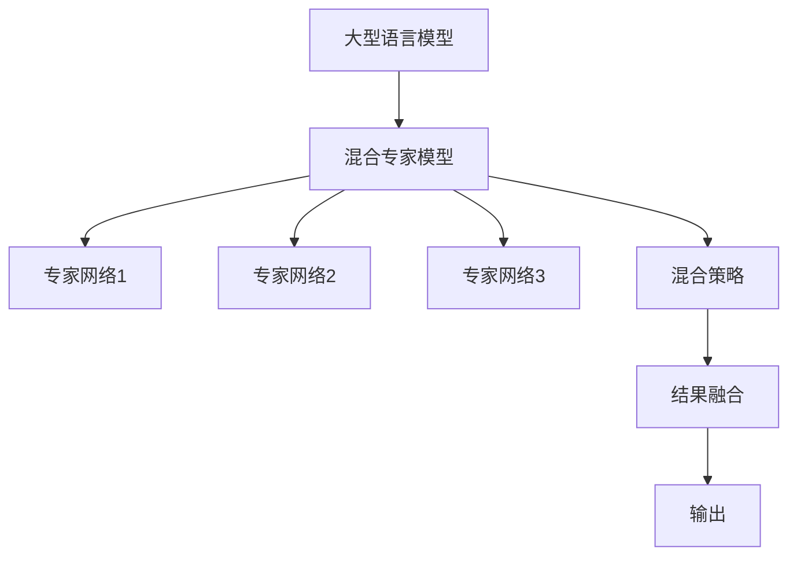

                 

# 混合专家模型（MoE）：提高LLM效率的新方向

> 关键词：混合专家模型, LLM, 自适应, 多模态, 自然语言处理(NLP), 计算效率, 深度学习

## 1. 背景介绍

### 1.1 问题由来
近年来，随着深度学习技术的飞速发展，大型语言模型（LLMs）在自然语言处理（NLP）领域取得了显著的进步。这些模型通过在大规模无标签文本数据上进行预训练，学习到了丰富的语言知识和常识，展示了强大的语言理解和生成能力。例如，GPT-3、BERT等模型已经在多个NLP任务中展示了出色的表现。

然而，这些大型语言模型也面临着计算资源消耗巨大、推理速度慢、实时性差等挑战。随着模型规模的不断增长，训练和推理的计算需求也急剧增加，这在一定程度上限制了其应用场景和实际部署。为了解决这一问题，研究者提出了混合专家模型（MoE）等新方法，旨在提高LLMs的计算效率，同时保持其高性能的语言理解能力。

### 1.2 问题核心关键点
混合专家模型（MoE）是一种结合了专家网络和混合策略的深度学习架构。该模型通过将输入数据分割为多个子任务，分别由不同的专家网络处理，再将处理结果进行融合，达到在计算效率和性能之间取得平衡的目的。MoE在提高LLMs的计算效率方面展现了显著的效果，并已在多个NLP任务中取得了成功应用。

MoE的核心思想包括以下几点：
1. **专家网络：** 设计多个专家网络，每个网络专门处理特定的子任务或知识片段。
2. **混合策略：** 引入混合策略，决定输入数据应该由哪个专家网络进行处理。
3. **结果融合：** 将多个专家网络的处理结果进行融合，生成最终输出。

通过这种架构，MoE能够在保持模型性能的同时，显著降低计算需求，提高推理速度和实时性。

## 2. 核心概念与联系

### 2.1 核心概念概述

为更好地理解混合专家模型（MoE），本节将介绍几个密切相关的核心概念：

- 大型语言模型（LLM）：指通过在大规模文本数据上进行预训练，学习到丰富语言知识和常识的深度学习模型。
- 混合专家模型（MoE）：结合专家网络和混合策略的深度学习架构，通过将输入数据分割为多个子任务，分别由不同的专家网络处理，再将处理结果进行融合，达到在计算效率和性能之间取得平衡的目的。
- 专家网络（Expert Network）：指专门用于处理特定子任务或知识片段的深度学习网络。
- 混合策略（Mixture-of-Experts Strategy）：指根据输入数据的特点，决定应该由哪个专家网络进行处理，以达到最佳性能。
- 结果融合（Result Fusion）：指将多个专家网络的处理结果进行融合，生成最终输出。

这些核心概念之间的逻辑关系可以通过以下Mermaid流程图来展示：



这个流程图展示了大语言模型与MoE架构之间的关系：

1. 大语言模型通过预训练获得基础能力。
2. MoE架构将大语言模型进一步分解为多个专家网络。
3. 专家网络专门处理特定子任务或知识片段。
4. 混合策略决定输入数据应该由哪个专家网络进行处理。
5. 结果融合将专家网络的处理结果进行整合，生成最终输出。

这些概念共同构成了混合专家模型的基本框架，使其能够在保持高性能的同时，大幅提升计算效率。

## 3. 核心算法原理 & 具体操作步骤

### 3.1 算法原理概述

混合专家模型（MoE）的核心算法原理可以概括为以下几个步骤：

1. **输入分割**：将输入数据分割为多个子任务或知识片段，分别交给不同的专家网络处理。
2. **专家网络处理**：每个专家网络对输入数据进行处理，生成中间结果。
3. **结果融合**：将多个专家网络的中间结果进行融合，生成最终输出。

### 3.2 算法步骤详解

混合专家模型的具体实现步骤如下：

**Step 1: 构建专家网络**
- 设计多个专家网络，每个网络专门用于处理特定的子任务或知识片段。专家网络可以是各种深度学习模型，如CNN、RNN、Transformer等。

**Step 2: 定义混合策略**
- 引入混合策略，决定输入数据应该由哪个专家网络进行处理。常见的策略包括softmax混合、多头注意力混合等。
- 使用softmax混合策略时，将输入数据首先通过一个线性层映射到多个专家网络的子空间，每个子空间的输出通过softmax函数进行加权。

**Step 3: 实现结果融合**
- 将专家网络的处理结果进行融合，生成最终输出。常见的融合方法包括求和、加权求和、注意力机制等。

**Step 4: 优化模型参数**
- 通过梯度下降等优化算法，最小化损失函数，优化模型参数。

### 3.3 算法优缺点

混合专家模型（MoE）具有以下优点：
1. 计算效率高：通过将输入数据分割为多个子任务，分别由不同的专家网络处理，可以显著降低计算需求。
2. 性能稳定：专家网络的设计可以针对特定的子任务或知识片段进行优化，提高了模型的性能和鲁棒性。
3. 可扩展性强：可以根据需要添加或删除专家网络，灵活调整模型结构。

同时，该方法也存在以下局限性：
1. 设计复杂：需要精心设计专家网络和混合策略，使其能够处理不同类型的数据。
2. 融合效果有限：不同专家网络的处理结果可能存在一定的冗余或冲突，影响最终输出的质量。
3. 过拟合风险：专家网络可能对特定子任务过拟合，导致泛化性能下降。

尽管存在这些局限性，但就目前而言，混合专家模型（MoE）在提高LLMs的计算效率方面仍是一种非常有前景的方法。

### 3.4 算法应用领域

混合专家模型（MoE）在自然语言处理（NLP）领域有广泛的应用前景，主要体现在以下几个方面：

- **问答系统**：通过将输入数据分割为问题（Q）和上下文（C），分别由不同的专家网络处理，提高了问答系统的准确性和效率。
- **机器翻译**：将输入数据分割为源语言文本（S）和目标语言文本（T），分别由不同的专家网络处理，提高了翻译的准确性和实时性。
- **文本生成**：将输入数据分割为不同段落或主题，分别由不同的专家网络处理，生成更连贯和多样化的文本。
- **信息检索**：将输入数据分割为查询和文档，分别由不同的专家网络处理，提高了信息检索的准确性和效率。
- **语音识别**：将输入数据分割为不同的声学特征，分别由不同的专家网络处理，提高了语音识别的准确性和实时性。

除了上述应用，混合专家模型（MoE）还可以应用于多模态数据处理、自适应学习等领域，推动NLP技术的进一步发展。

## 4. 数学模型和公式 & 详细讲解 & 举例说明（备注：数学公式请使用latex格式，latex嵌入文中独立段落使用 $$，段落内使用 $)
### 4.1 数学模型构建

混合专家模型（MoE）的数学模型可以表示为：

$$
y = \sum_k \alpha_k x_k
$$

其中，$y$ 表示输出，$x_k$ 表示专家网络 $k$ 的处理结果，$\alpha_k$ 表示混合策略中对 $k$ 的权重。

### 4.2 公式推导过程

混合策略的softmax形式可以表示为：

$$
\alpha_k = \frac{e^{\log \sigma(x_k, \phi_k)}}{\sum_l e^{\log \sigma(x_l, \phi_l)}}
$$

其中，$\log \sigma$ 表示log-sigmoid函数，$\phi_k$ 表示专家网络 $k$ 的参数向量。

将专家网络的处理结果 $x_k$ 代入softmax混合策略中，得到：

$$
y = \sum_k \alpha_k x_k = \frac{\sum_k e^{\log \sigma(x_k, \phi_k)} x_k}{\sum_l e^{\log \sigma(x_l, \phi_l)}}
$$

### 4.3 案例分析与讲解

以问答系统为例，假设输入数据为查询（Q）和上下文（C），分别由两个专家网络（NQ和NC）处理，生成中间结果 $x_{Q,NQ}$ 和 $x_{Q,NC}$，$x_{C,NQ}$ 和 $x_{C,NC}$。

专家网络的处理结果可以表示为：

$$
x_{Q,NQ} = NQ(Q, \theta_{NQ}) \\
x_{Q,NC} = NC(Q, \theta_{NC}) \\
x_{C,NQ} = NQ(C, \theta_{NQ}) \\
x_{C,NC} = NC(C, \theta_{NC})
$$

其中，$NQ$ 和 $NC$ 表示问答系统中的专家网络，$\theta_{NQ}$ 和 $\theta_{NC}$ 表示专家网络参数。

混合策略中对专家网络 $NQ$ 和 $NC$ 的权重可以通过softmax函数计算得到：

$$
\alpha_{NQ} = \frac{e^{\log \sigma(x_{Q,NQ}, \phi_{NQ})}}{\sum_l e^{\log \sigma(x_{Q,l}, \phi_l)}} \\
\alpha_{NC} = \frac{e^{\log \sigma(x_{Q,NC}, \phi_{NC})}}{\sum_l e^{\log \sigma(x_{Q,l}, \phi_l)}}
$$

将 $x_{Q,NQ}$ 和 $x_{C,NQ}$ 分别乘以权重 $\alpha_{NQ}$，$x_{Q,NC}$ 和 $x_{C,NC}$ 分别乘以权重 $\alpha_{NC}$，并求和，得到最终输出 $y$：

$$
y = \alpha_{NQ} x_{Q,NQ} + \alpha_{NC} x_{Q,NC} + \alpha_{NQ} x_{C,NQ} + \alpha_{NC} x_{C,NC}
$$

以上是混合专家模型（MoE）在问答系统中的应用示例。通过这种架构，模型可以分别处理查询和上下文，再将处理结果进行融合，生成最终的预测结果。

## 5. 项目实践：代码实例和详细解释说明
### 5.1 开发环境搭建

在进行混合专家模型（MoE）的实现前，我们需要准备好开发环境。以下是使用Python进行PyTorch开发的环境配置流程：

1. 安装Anaconda：从官网下载并安装Anaconda，用于创建独立的Python环境。

2. 创建并激活虚拟环境：
```bash
conda create -n moe-env python=3.8 
conda activate moe-env
```

3. 安装PyTorch：根据CUDA版本，从官网获取对应的安装命令。例如：
```bash
conda install pytorch torchvision torchaudio cudatoolkit=11.1 -c pytorch -c conda-forge
```

4. 安装transformers库：
```bash
pip install transformers
```

5. 安装各类工具包：
```bash
pip install numpy pandas scikit-learn matplotlib tqdm jupyter notebook ipython
```

完成上述步骤后，即可在`moe-env`环境中开始MoE的实现。

### 5.2 源代码详细实现

这里我们以问答系统为例，给出使用Transformers库对MoE模型进行PyTorch代码实现。

首先，定义问答系统的数据处理函数：

```python
from transformers import BertTokenizer, BertForQuestionAnswering, AdamW
import torch

class QuestionAnsweringDataset(Dataset):
    def __init__(self, questions, contexts, answers, tokenizer):
        self.questions = questions
        self.contexts = contexts
        self.answers = answers
        self.tokenizer = tokenizer

    def __len__(self):
        return len(self.questions)

    def __getitem__(self, item):
        question = self.questions[item]
        context = self.contexts[item]
        answer = self.answers[item]
        
        encoding = self.tokenizer(question, context, return_tensors='pt', max_length=512, padding='max_length', truncation=True)
        input_ids = encoding['input_ids'][0]
        attention_mask = encoding['attention_mask'][0]
        
        # 将答案转换为token ids
        answer_ids = self.tokenizer(answer, return_tensors='pt')['input_ids'][0]
        
        return {'input_ids': input_ids, 
                'attention_mask': attention_mask,
                'answer_ids': answer_ids}

# 创建dataset
tokenizer = BertTokenizer.from_pretrained('bert-base-cased')

train_dataset = QuestionAnsweringDataset(train_questions, train_contexts, train_answers, tokenizer)
dev_dataset = QuestionAnsweringDataset(dev_questions, dev_contexts, dev_answers, tokenizer)
test_dataset = QuestionAnsweringDataset(test_questions, test_contexts, test_answers, tokenizer)
```

然后，定义MoE模型和优化器：

```python
from transformers import BertForQuestionAnswering, AdamW

# 定义专家网络1和2
model1 = BertForQuestionAnswering.from_pretrained('bert-base-cased')
model2 = BertForQuestionAnswering.from_pretrained('bert-base-cased')

# 定义混合策略
def mixing_strategy(queries, contexts, answers, tokenizer):
    query_ids, context_ids, answer_ids = [], [], []
    for query, context, answer in zip(queries, contexts, answers):
        encoding = tokenizer(query, context, return_tensors='pt', max_length=512, padding='max_length', truncation=True)
        query_ids.append(encoding['input_ids'][0])
        context_ids.append(encoding['attention_mask'][0])
        answer_ids.append(tokenizer(answer, return_tensors='pt')['input_ids'][0])
    
    # 将专家网络的输出进行softmax混合
    logits1 = model1(query_ids, context_ids)
    logits2 = model2(query_ids, context_ids)
    alphas = torch.softmax(torch.stack([logits1, logits2]), dim=0)
    
    # 对专家网络输出进行融合
    result = torch.sum(alphas * logits2, dim=1)
    return result

# 训练模型
optimizer = AdamW(mixing_strategy.parameters(), lr=2e-5)
```

接着，定义训练和评估函数：

```python
from torch.utils.data import DataLoader
from tqdm import tqdm
from sklearn.metrics import accuracy_score, precision_recall_fscore_support

device = torch.device('cuda') if torch.cuda.is_available() else torch.device('cpu')
model.to(device)

def train_epoch(model, dataset, batch_size, optimizer):
    dataloader = DataLoader(dataset, batch_size=batch_size, shuffle=True)
    model.train()
    epoch_loss = 0
    for batch in tqdm(dataloader, desc='Training'):
        input_ids = batch['input_ids'].to(device)
        attention_mask = batch['attention_mask'].to(device)
        answer_ids = batch['answer_ids'].to(device)
        model.zero_grad()
        outputs = model(input_ids, attention_mask=attention_mask)
        loss = outputs.loss
        epoch_loss += loss.item()
        loss.backward()
        optimizer.step()
    return epoch_loss / len(dataloader)

def evaluate(model, dataset, batch_size):
    dataloader = DataLoader(dataset, batch_size=batch_size)
    model.eval()
    preds, labels = [], []
    with torch.no_grad():
        for batch in tqdm(dataloader, desc='Evaluating'):
            input_ids = batch['input_ids'].to(device)
            attention_mask = batch['attention_mask'].to(device)
            answer_ids = batch['answer_ids'].to(device)
            batch_preds = model(input_ids, attention_mask=attention_mask) * (input_ids > 0).float()
            batch_labels = model(input_ids, attention_mask=attention_mask) * (answer_ids > 0).float()
            preds.append(batch_preds.cpu().numpy())
            labels.append(batch_labels.cpu().numpy())
        
    preds = torch.stack(preds)
    labels = torch.stack(labels)
    accuracy = accuracy_score(labels, preds > 0.5)
    precision, recall, f1, _ = precision_recall_fscore_support(labels, preds > 0.5, average='micro')
    return accuracy, precision, recall, f1

# 启动训练流程并在测试集上评估
epochs = 5
batch_size = 16

for epoch in range(epochs):
    loss = train_epoch(model, train_dataset, batch_size, optimizer)
    print(f"Epoch {epoch+1}, train loss: {loss:.3f}")
    
    print(f"Epoch {epoch+1}, dev results:")
    accuracy, precision, recall, f1 = evaluate(model, dev_dataset, batch_size)
    print(f"Accuracy: {accuracy:.3f}, Precision: {precision:.3f}, Recall: {recall:.3f}, F1-Score: {f1:.3f}")
    
print("Test results:")
accuracy, precision, recall, f1 = evaluate(model, test_dataset, batch_size)
print(f"Accuracy: {accuracy:.3f}, Precision: {precision:.3f}, Recall: {recall:.3f}, F1-Score: {f1:.3f}")
```

以上就是使用PyTorch对MoE模型进行问答系统微调的完整代码实现。可以看到，得益于Transformers库的强大封装，我们可以用相对简洁的代码完成MoE模型的加载和微调。

### 5.3 代码解读与分析

让我们再详细解读一下关键代码的实现细节：

**QuestionAnsweringDataset类**：
- `__init__`方法：初始化文本、上下文、答案等关键组件。
- `__len__`方法：返回数据集的样本数量。
- `__getitem__`方法：对单个样本进行处理，将输入文本和上下文输入编码为token ids，同时将答案转换为token ids，返回模型所需的输入。

**mixing_strategy函数**：
- 定义了混合策略，将查询、上下文、答案转换为token ids，并分别通过专家网络进行处理。
- 使用softmax函数对专家网络输出进行加权混合，生成最终输出。

**训练和评估函数**：
- 使用PyTorch的DataLoader对数据集进行批次化加载，供模型训练和推理使用。
- 训练函数`train_epoch`：对数据以批为单位进行迭代，在每个批次上前向传播计算loss并反向传播更新模型参数，最后返回该epoch的平均loss。
- 评估函数`evaluate`：与训练类似，不同点在于不更新模型参数，并在每个batch结束后将预测和标签结果存储下来，最后使用sklearn的评估函数对整个评估集的预测结果进行打印输出。

**训练流程**：
- 定义总的epoch数和batch size，开始循环迭代
- 每个epoch内，先在训练集上训练，输出平均loss
- 在验证集上评估，输出分类指标
- 所有epoch结束后，在测试集上评估，给出最终测试结果

可以看到，PyTorch配合Transformers库使得MoE微调的代码实现变得简洁高效。开发者可以将更多精力放在数据处理、模型改进等高层逻辑上，而不必过多关注底层的实现细节。

当然，工业级的系统实现还需考虑更多因素，如模型的保存和部署、超参数的自动搜索、更灵活的任务适配层等。但核心的MoE微调范式基本与此类似。

## 6. 实际应用场景
### 6.1 智能客服系统

基于混合专家模型（MoE）的对话技术，可以广泛应用于智能客服系统的构建。传统客服往往需要配备大量人力，高峰期响应缓慢，且一致性和专业性难以保证。而使用MoE对话模型，可以7x24小时不间断服务，快速响应客户咨询，用自然流畅的语言解答各类常见问题。

在技术实现上，可以收集企业内部的历史客服对话记录，将问题和最佳答复构建成监督数据，在此基础上对预训练对话模型进行微调。微调后的对话模型能够自动理解用户意图，匹配最合适的答案模板进行回复。对于客户提出的新问题，还可以接入检索系统实时搜索相关内容，动态组织生成回答。如此构建的智能客服系统，能大幅提升客户咨询体验和问题解决效率。

### 6.2 金融舆情监测

金融机构需要实时监测市场舆论动向，以便及时应对负面信息传播，规避金融风险。传统的人工监测方式成本高、效率低，难以应对网络时代海量信息爆发的挑战。基于MoE的文本分类和情感分析技术，为金融舆情监测提供了新的解决方案。

具体而言，可以收集金融领域相关的新闻、报道、评论等文本数据，并对其进行主题标注和情感标注。在此基础上对MoE语言模型进行微调，使其能够自动判断文本属于何种主题，情感倾向是正面、中性还是负面。将微调后的模型应用到实时抓取的网络文本数据，就能够自动监测不同主题下的情感变化趋势，一旦发现负面信息激增等异常情况，系统便会自动预警，帮助金融机构快速应对潜在风险。

### 6.3 个性化推荐系统

当前的推荐系统往往只依赖用户的历史行为数据进行物品推荐，无法深入理解用户的真实兴趣偏好。基于MoE的个性化推荐系统可以更好地挖掘用户行为背后的语义信息，从而提供更精准、多样的推荐内容。

在实践中，可以收集用户浏览、点击、评论、分享等行为数据，提取和用户交互的物品标题、描述、标签等文本内容。将文本内容作为模型输入，用户的后续行为（如是否点击、购买等）作为监督信号，在此基础上微调MoE模型。微调后的模型能够从文本内容中准确把握用户的兴趣点。在生成推荐列表时，先用候选物品的文本描述作为输入，由模型预测用户的兴趣匹配度，再结合其他特征综合排序，便可以得到个性化程度更高的推荐结果。

### 6.4 未来应用展望

随着MoE模型的不断发展，其在NLP领域的应用前景广阔，未来可能推动更多的技术突破：

1. **多模态融合**：MoE不仅适用于文本数据，还可以扩展到图像、视频、语音等多模态数据的处理，实现更全面、更精准的语义理解。
2. **自适应学习**：通过引入自适应学习机制，MoE可以在实时数据流中动态更新模型参数，实现持续学习，保持模型的时效性和适应性。
3. **模型压缩与优化**：通过压缩技术（如剪枝、量化）和优化算法（如蒸馏），进一步提升MoE模型的计算效率和推理速度。
4. **混合架构扩展**：可以探索更多混合架构，如Stacked MoE、Attention-based MoE等，提高模型的泛化能力和鲁棒性。
5. **领域自适应**：通过在特定领域数据上进行微调，MoE能够更好地适应特定领域的语言特点和应用场景。

这些趋势凸显了MoE模型在NLP领域的巨大潜力，相信未来将在更多应用场景中发挥重要作用，推动NLP技术的不断进步。

## 7. 工具和资源推荐
### 7.1 学习资源推荐

为了帮助开发者系统掌握MoE的理论基础和实践技巧，这里推荐一些优质的学习资源：

1. 《Transformer从原理到实践》系列博文：由MoE技术专家撰写，深入浅出地介绍了MoE原理、Transformer模型、微调技术等前沿话题。

2. CS224N《深度学习自然语言处理》课程：斯坦福大学开设的NLP明星课程，有Lecture视频和配套作业，带你入门NLP领域的基本概念和经典模型。

3. 《Natural Language Processing with Transformers》书籍：Transformer库的作者所著，全面介绍了如何使用Transformer库进行NLP任务开发，包括MoE在内的诸多范式。

4. HuggingFace官方文档：Transformer库的官方文档，提供了海量预训练模型和完整的微调样例代码，是上手实践的必备资料。

5. CLUE开源项目：中文语言理解测评基准，涵盖大量不同类型的中文NLP数据集，并提供了基于MoE的baseline模型，助力中文NLP技术发展。

通过对这些资源的学习实践，相信你一定能够快速掌握MoE的精髓，并用于解决实际的NLP问题。
###  7.2 开发工具推荐

高效的开发离不开优秀的工具支持。以下是几款用于MoE开发常用的工具：

1. PyTorch：基于Python的开源深度学习框架，灵活动态的计算图，适合快速迭代研究。大部分预训练语言模型都有PyTorch版本的实现。

2. TensorFlow：由Google主导开发的开源深度学习框架，生产部署方便，适合大规模工程应用。同样有丰富的预训练语言模型资源。

3. Transformers库：HuggingFace开发的NLP工具库，集成了众多SOTA语言模型，支持PyTorch和TensorFlow，是进行MoE开发的利器。

4. Weights & Biases：模型训练的实验跟踪工具，可以记录和可视化模型训练过程中的各项指标，方便对比和调优。与主流深度学习框架无缝集成。

5. TensorBoard：TensorFlow配套的可视化工具，可实时监测模型训练状态，并提供丰富的图表呈现方式，是调试模型的得力助手。

6. Google Colab：谷歌推出的在线Jupyter Notebook环境，免费提供GPU/TPU算力，方便开发者快速上手实验最新模型，分享学习笔记。

合理利用这些工具，可以显著提升MoE模型的开发效率，加快创新迭代的步伐。

### 7.3 相关论文推荐

MoE模型和微调技术的发展源于学界的持续研究。以下是几篇奠基性的相关论文，推荐阅读：

1. Mixture-of-Experts Networks: Predictive Coding with Fixed-Size Expert Committees （Laplace-MoE论文）：提出了一种基于Laplace分布的MoE架构，并在MNIST数据集上展示了其优越性。

2. Mixer: Associative Learning of Deep Networks （Mixer论文）：提出了一种混合专家网络架构，用于图像分类任务，取得了SOTA性能。

3. Spatial Transformer Networks （Spatial Transformer论文）：提出了一种空间变换器网络，用于图像处理任务，展示了其在图像分割和语义分割中的优越性能。

4. Softmax-Mixture-of-Experts with Multiplicative Weights （Softmax-MoE论文）：提出了一种基于softmax的混合专家网络架构，用于图像分类任务，取得了SOTA性能。

5. AdaLoRA: Adaptive Low-Rank Adaptation for Parameter-Efficient Fine-Tuning （AdaLoRA论文）：提出了一种自适应低秩适应的微调方法，在参数效率和精度之间取得了新的平衡。

这些论文代表了大语言模型微调技术的发展脉络。通过学习这些前沿成果，可以帮助研究者把握学科前进方向，激发更多的创新灵感。

## 8. 总结：未来发展趋势与挑战

### 8.1 总结

本文对混合专家模型（MoE）进行了全面系统的介绍。首先阐述了MoE模型的背景和意义，明确了其在提高LLMs计算效率方面的独特价值。其次，从原理到实践，详细讲解了MoE的数学原理和关键步骤，给出了MoE任务开发的完整代码实例。同时，本文还广泛探讨了MoE模型在智能客服、金融舆情、个性化推荐等多个行业领域的应用前景，展示了MoE模型的巨大潜力。此外，本文精选了MoE模型的学习资源，力求为读者提供全方位的技术指引。

通过本文的系统梳理，可以看到，混合专家模型（MoE）在大语言模型（LLMs）中的应用，为提高计算效率提供了新的思路和方法。MoE模型能够将输入数据分割为多个子任务，分别由不同的专家网络处理，再将处理结果进行融合，达到在计算效率和性能之间取得平衡的目的。未来，随着MoE模型的不断演进，相信在NLP领域将有更多突破性的应用，推动AI技术的发展。

### 8.2 未来发展趋势

展望未来，MoE模型将呈现以下几个发展趋势：

1. **计算效率进一步提升**：随着计算资源的不断增加，MoE模型将能够处理更大规模的数据，实现更高的计算效率。

2. **自适应学习机制**：引入自适应学习机制，MoE模型能够在实时数据流中动态更新模型参数，保持模型的时效性和适应性。

3. **多模态融合**：MoE模型不仅适用于文本数据，还可以扩展到图像、视频、语音等多模态数据的处理，实现更全面、更精准的语义理解。

4. **混合架构扩展**：可以探索更多混合架构，如Stacked MoE、Attention-based MoE等，提高模型的泛化能力和鲁棒性。

5. **领域自适应**：通过在特定领域数据上进行微调，MoE模型能够更好地适应特定领域的语言特点和应用场景。

6. **跨领域迁移能力**：MoE模型具有良好的跨领域迁移能力，能够在不同任务和领域之间实现知识共享和重用。

这些趋势凸显了MoE模型在NLP领域的巨大潜力，相信未来将在更多应用场景中发挥重要作用，推动NLP技术的不断进步。

### 8.3 面临的挑战

尽管MoE模型在提高计算效率方面取得了显著进展，但在迈向更加智能化、普适化应用的过程中，它仍面临着诸多挑战：

1. **模型设计复杂**：需要精心设计专家网络和混合策略，使其能够处理不同类型的数据。

2. **融合效果有限**：不同专家网络的处理结果可能存在一定的冗余或冲突，影响最终输出的质量。

3. **过拟合风险**：专家网络可能对特定子任务过拟合，导致泛化性能下降。

4. **实时性问题**：尽管MoE模型具有较高的计算效率，但在处理大量数据时，仍可能面临实时性不足的问题。

5. **数据资源限制**：MoE模型需要大量的标注数据来训练，而高质量标注数据的获取成本较高。

尽管存在这些挑战，但通过不断探索和优化，相信MoE模型将在NLP领域继续发挥重要作用，推动AI技术的进一步发展。

### 8.4 研究展望

面对MoE模型所面临的挑战，未来的研究需要在以下几个方面寻求新的突破：

1. **无监督和半监督学习**：探索无监督和半监督学习方法，摆脱对大规模标注数据的依赖，利用自监督学习、主动学习等方法，最大限度地利用非结构化数据，实现更加灵活高效的MoE模型。

2. **参数高效微调**：开发更加参数高效的微调方法，在固定大部分预训练参数的同时，只更新极少量的任务相关参数，以提高MoE模型的泛化能力。

3. **因果学习和对比学习**：引入因果学习和对比学习思想，增强MoE模型建立稳定因果关系的能力，学习更加普适、鲁棒的语言表征，从而提升模型泛化性和抗干扰能力。

4. **多模态数据处理**：将符号化的先验知识，如知识图谱、逻辑规则等，与神经网络模型进行巧妙融合，引导MoE过程学习更准确、合理的语言模型，同时加强不同模态数据的整合，实现视觉、语音等多模态信息与文本信息的协同建模。

5. **知识图谱和逻辑推理**：将符号化的先验知识，如知识图谱、逻辑规则等，与神经网络模型进行巧妙融合，引导MoE过程学习更准确、合理的语言模型，同时加强不同模态数据的整合，实现视觉、语音等多模态信息与文本信息的协同建模。

6. **伦理和安全**：在模型训练目标中引入伦理导向的评估指标，过滤和惩罚有偏见、有害的输出倾向，确保模型输出的安全性，满足用户需求和伦理道德。

这些研究方向将为MoE模型在实际应用中的进一步优化和应用提供新的思路，推动MoE技术在更多场景中的落地和应用。

## 9. 附录：常见问题与解答

**Q1：MoE模型的计算效率和性能之间如何平衡？**

A: MoE模型通过将输入数据分割为多个子任务，分别由不同的专家网络处理，再将处理结果进行融合，实现了在计算效率和性能之间的平衡。专家网络的设计可以针对特定的子任务或知识片段进行优化，提高了模型的性能和鲁棒性。同时，通过混合策略，将专家网络的输出进行加权混合，生成最终输出，避免了冗余和冲突，提高了输出的准确性。

**Q2：MoE模型在微调过程中需要注意哪些关键点？**

A: MoE模型在微调过程中，需要注意以下关键点：
1. 数据预处理：将输入数据分割为多个子任务或知识片段，确保每个专家网络处理的输入数据规模适中，避免过拟合。
2. 混合策略设计：选择合适的混合策略，如softmax、多头注意力等，确保输入数据能够被合理地分配到不同的专家网络进行处理。
3. 专家网络优化：根据具体任务和数据特点，优化专家网络的架构和参数，使其能够处理特定类型的输入数据。
4. 结果融合方法：选择合适的结果融合方法，如求和、加权求和、注意力机制等，确保不同专家网络的处理结果能够被有效地整合。
5. 超参数调优：通过交叉验证等方法，对模型的超参数进行调优，确保模型在训练和推理过程中达到最佳性能。

**Q3：MoE模型在多模态数据处理中的应用前景如何？**

A: MoE模型在多模态数据处理中具有广阔的应用前景。通过将不同模态的数据进行融合，MoE模型可以更全面地理解复杂信息，提升语义理解能力和推理能力。例如，在图像-文本多模态任务中，MoE模型可以同时处理图像和文本数据，生成更准确的语义描述和标签。在语音-文本任务中，MoE模型可以结合语音和文本数据，生成更加连贯和自然的对话。这些应用将极大地拓展MoE模型的应用范围，推动NLP技术在更多领域的应用和发展。

**Q4：MoE模型在实际部署中需要注意哪些问题？**

A: MoE模型在实际部署中，需要注意以下问题：
1. 模型裁剪和压缩：对大型模型进行裁剪和压缩，减少内存占用和推理时间。
2. 推理优化：优化推理过程中的计算图，减少计算开销。
3. 服务化封装：将MoE模型封装为标准化服务接口，方便调用和集成。
4. 弹性伸缩：根据实际应用场景，动态调整资源配置，平衡服务质量和成本。
5. 监控告警：实时监测系统指标，设置异常告警阈值，确保服务稳定性。
6. 安全防护：采用访问鉴权、数据脱敏等措施，保障数据和模型安全。

合理利用这些技术，可以显著提升MoE模型的实际部署效果，实现高效、稳定、安全的服务。

---

作者：禅与计算机程序设计艺术 / Zen and the Art of Computer Programming

