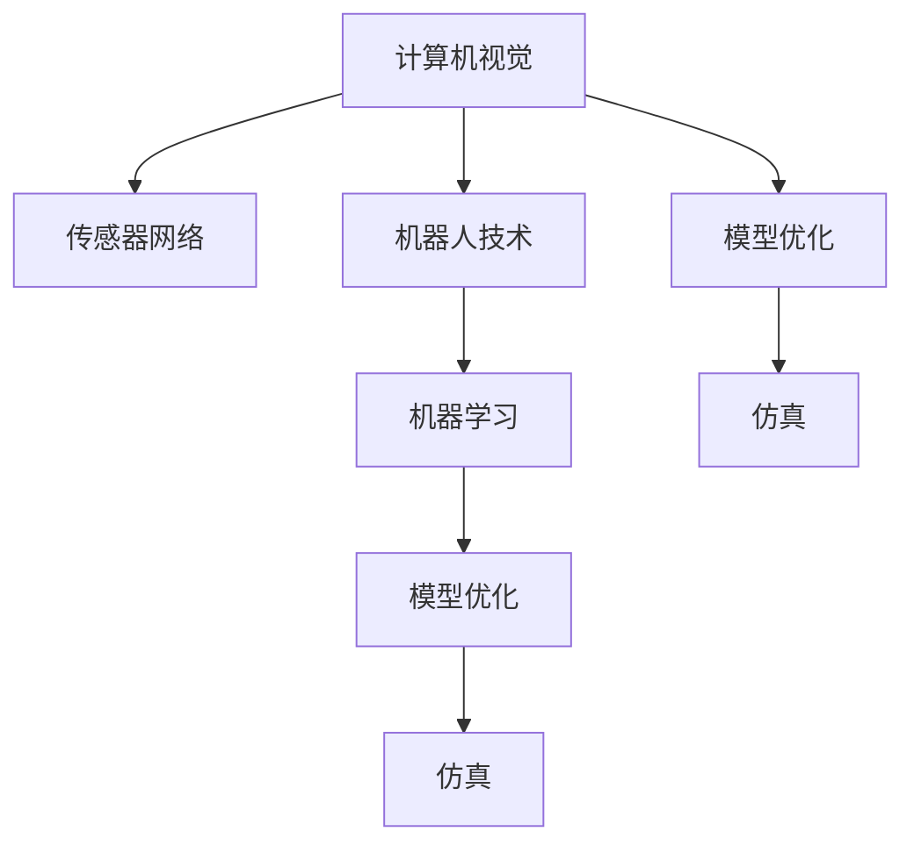

                 

# 物理实体的自动化发展趋势

## 1. 背景介绍

### 1.1 问题由来

随着人工智能(AI)技术的飞速发展，自动化技术正在从信息领域逐步渗透到物理实体领域。物理实体自动化，指的是利用计算机视觉、传感器网络、机器人技术等手段，对物理世界中的物体、环境、行为进行感知、识别、跟踪和控制。与传统自动化系统相比，基于AI的物理实体自动化系统具有更高的智能化水平和自适应能力，能够应对复杂的、非结构化的环境，提供更加灵活、精准的自动化解决方案。

近年来，自动化技术在智能交通、智慧制造、农业自动化、医疗影像等多个领域得到了广泛应用，极大地提高了工作效率，降低了成本。然而，这些自动化系统的智能化程度仍然有限，在复杂、动态、不确定的环境下，系统的表现仍有待提升。本文将深入探讨物理实体自动化发展的趋势，分析其在各个行业的应用，并对未来可能面临的挑战和解决方案进行探讨。

### 1.2 问题核心关键点

物理实体自动化的核心在于利用计算机视觉和传感器等技术，对物理世界进行全面感知，并通过机器学习和推理技术，对感知数据进行理解和决策，最终实现对物理实体的智能控制。关键技术包括但不限于：

- 计算机视觉：用于对物理世界进行图像和视频数据的获取和处理，识别物体、场景、行为等。
- 传感器网络：用于对物理环境中的声音、温度、湿度、光线等进行实时监测和感知。
- 机器人技术：用于对物理实体进行操作、移动和搬运，执行复杂任务。
- 机器学习和推理：用于对感知数据进行建模、训练和推理，支持决策和控制。
- 模型优化与仿真：用于对模型进行优化，验证和测试自动化系统的性能。

## 2. 核心概念与联系

### 2.1 核心概念概述

为更好地理解物理实体自动化的核心概念，本节将介绍几个密切相关的关键概念：

- 计算机视觉(Computer Vision, CV)：通过图像处理和模式识别技术，使计算机能够理解、分析和解释图像数据的技术。
- 传感器网络(Sensor Network)：由多个传感器节点组成的网络，用于监测和感知物理环境中的各种数据。
- 机器人(Robotics)：通过硬件和软件技术，实现物理实体的自动化操作和移动。
- 机器学习(Machine Learning)：利用数据和算法，使计算机能够从经验中学习和改进，提高决策和预测能力。
- 模型优化(Model Optimization)：通过优化算法，改进模型的性能和效率。
- 仿真(Simulation)：通过模拟和仿真技术，验证和测试自动化系统的性能。

这些核心概念之间的逻辑关系可以通过以下Mermaid流程图来展示：



这个流程图展示了几大核心概念之间的联系：

1. 计算机视觉提供了对物理世界的感知数据。
2. 传感器网络提供环境数据的实时监测。
3. 机器人技术用于执行物理操作和移动。
4. 机器学习用于处理和分析感知数据，生成决策和控制信号。
5. 模型优化用于提升系统的性能和效率。
6. 仿真用于测试和验证自动化系统的表现。

## 3. 核心算法原理 & 具体操作步骤
### 3.1 算法原理概述

物理实体自动化的核心算法包括计算机视觉、传感器网络、机器人技术、机器学习等。这些算法相互配合，实现了对物理实体的自动化感知、识别、决策和控制。

### 3.2 算法步骤详解

以下是物理实体自动化系统的典型操作步骤：

**Step 1: 数据获取**

- 使用计算机视觉和传感器网络，获取物理世界中的图像、视频和环境数据。
- 将获取的数据进行预处理和清洗，去除噪声和无用信息。

**Step 2: 物体检测与识别**

- 使用计算机视觉技术，对图像和视频数据进行物体检测和识别。
- 使用深度学习模型如Faster R-CNN、YOLO等，对物体进行精确的定位和分类。

**Step 3: 行为识别与预测**

- 使用机器学习模型对物体的行为进行分析和预测。
- 利用时间序列分析和统计学习算法，如LSTM、RNN等，预测物体的运动轨迹和行为模式。

**Step 4: 路径规划与决策**

- 使用机器人技术，规划物体的运动路径。
- 使用决策树、贝叶斯网络等方法，根据环境信息和行为预测结果，生成最优的决策方案。

**Step 5: 控制与执行**

- 使用机器人技术，执行决策结果，完成对物体的操作和移动。
- 使用PID控制器、模糊控制器等，确保机器人能够精准执行任务。

**Step 6: 模型优化与仿真**

- 使用模型优化算法，如梯度下降、遗传算法等，优化机器学习模型的参数。
- 使用仿真工具，如MATLAB、Gazebo等，测试和验证自动化系统的性能。

通过上述步骤，物理实体自动化系统能够全面感知物理世界，进行智能决策和控制，提升自动化系统的智能化水平和自适应能力。

### 3.3 算法优缺点

物理实体自动化系统具有以下优点：

- 智能化水平高：通过深度学习和推理技术，系统能够处理复杂、非结构化的环境，提供更加精准和灵活的自动化解决方案。
- 自适应能力强：系统能够根据环境变化实时调整决策和控制，适应动态和不确定的环境。
- 广泛应用：应用于智能交通、智慧制造、农业自动化、医疗影像等多个领域，提升工作效率，降低成本。

同时，该系统也存在一些缺点：

- 对数据质量要求高：系统性能受输入数据的质量和数量影响较大，获取高质量数据成本较高。
- 系统复杂度高：系统涉及多个学科和技术领域，开发和维护成本高，技术难度大。
- 泛化能力有限：系统在特定场景下表现良好，但泛化到其他场景时，性能可能下降。
- 对抗攻击易受影响：系统容易受到对抗攻击，如伪造视频、欺骗传感器等，导致误识别和误决策。

## 4. 数学模型和公式 & 详细讲解 & 举例说明

### 4.1 数学模型构建

物理实体自动化系统的数学模型主要基于计算机视觉、传感器网络、机器人技术和机器学习等领域的数学模型。以下以计算机视觉中的目标检测模型为例，给出具体的数学模型构建过程。

假设图像数据为 $I \in \mathbb{R}^{H \times W \times C}$，目标检测模型为 $M$，其输出为物体的位置和类别。目标检测模型的损失函数为：

$$
L(M) = \frac{1}{N} \sum_{i=1}^N \mathcal{L}_{loc}(x_i, y_i, M(x_i))
$$

其中，$x_i$ 为物体的位置和类别标签，$y_i$ 为模型预测的结果，$\mathcal{L}_{loc}$ 为位置损失函数，如交叉熵损失、L1损失等。

### 4.2 公式推导过程

以下以Faster R-CNN模型为例，推导目标检测模型的损失函数。

Faster R-CNN模型由两个子网络组成：RPN(Region Proposal Network)和Fast R-CNN。RPN网络用于生成候选区域，Fast R-CNN网络用于对候选区域进行分类和回归。模型的训练过程分为两个步骤：首先训练RPN网络，然后对Fast R-CNN网络进行微调。

目标检测模型的损失函数包括分类损失和位置损失两部分：

- 分类损失：对于每个候选区域，计算其置信度和类别标签之间的交叉熵损失。
- 位置损失：对于每个候选区域，计算其位置预测与真实位置之间的L1损失。

目标检测模型的完整损失函数为：

$$
L_{total} = L_{cls} + \lambda L_{reg}
$$

其中，$L_{cls}$ 为分类损失，$L_{reg}$ 为位置损失，$\lambda$ 为位置损失的权重系数。

### 4.3 案例分析与讲解

以下以智能交通系统中的目标检测为例，分析目标检测模型的应用。

智能交通系统中的目标检测任务包括车辆检测、行人检测、交通信号灯检测等。通过对图像和视频数据进行目标检测，系统能够实时感知交通环境中的车辆、行人、交通信号灯等物体，从而进行智能决策和控制。

假设交通系统中有一辆公交车正在行驶，目标检测模型能够实时识别公交车的位置和类别，并根据其行为进行决策。例如，如果公交车在右转车道上行驶，模型可以预测其右转的可能性，并调整信号灯的灯态，确保交通流畅。

## 5. 项目实践：代码实例和详细解释说明
### 5.1 开发环境搭建

在进行物理实体自动化的项目实践前，我们需要准备好开发环境。以下是使用Python进行OpenCV、PyTorch开发的环境配置流程：

1. 安装Anaconda：从官网下载并安装Anaconda，用于创建独立的Python环境。

2. 创建并激活虚拟环境：
```bash
conda create -n pytorch-env python=3.8 
conda activate pytorch-env
```

3. 安装OpenCV和PyTorch：
```bash
conda install opencv-python pytorch torchvision torchaudio
```

4. 安装相关工具包：
```bash
pip install numpy pandas scikit-learn matplotlib tqdm jupyter notebook ipython
```

完成上述步骤后，即可在`pytorch-env`环境中开始项目实践。

### 5.2 源代码详细实现

下面我们以智能交通系统中的目标检测为例，给出使用OpenCV和PyTorch进行目标检测的代码实现。

首先，定义目标检测模型的输入和输出：

```python
from torch.utils.data import Dataset, DataLoader
from torchvision import transforms
from torch.nn import functional as F

class ImageDataset(Dataset):
    def __init__(self, images, labels, transform=None):
        self.images = images
        self.labels = labels
        self.transform = transform
        
    def __len__(self):
        return len(self.images)
    
    def __getitem__(self, index):
        image = self.images[index]
        label = self.labels[index]
        if self.transform:
            image = self.transform(image)
        return image, label

# 定义目标检测模型
class SSDModel(nn.Module):
    def __init__(self):
        super(SSDModel, self).__init__()
        # 定义SSD模型的各层结构
        self.conv1 = nn.Conv2d(3, 64, 3, 1, 1)
        self.conv2 = nn.Conv2d(64, 64, 3, 1, 1)
        self.conv3 = nn.Conv2d(64, 128, 3, 1, 1)
        self.conv4 = nn.Conv2d(128, 128, 3, 1, 1)
        self.conv5 = nn.Conv2d(128, 128, 3, 1, 1)
        self.conv6 = nn.Conv2d(128, 256, 3, 1, 1)
        self.conv7 = nn.Conv2d(256, 256, 3, 1, 1)
        self.conv8 = nn.Conv2d(256, 256, 3, 1, 1)
        self.conv9 = nn.Conv2d(256, 512, 3, 1, 1)
        self.conv10 = nn.Conv2d(512, 512, 3, 1, 1)
        self.conv11 = nn.Conv2d(512, 512, 3, 1, 1)
        self.conv12 = nn.Conv2d(512, 512, 3, 1, 1)
        self.conv13 = nn.Conv2d(512, 512, 3, 1, 1)
        self.conv14 = nn.Conv2d(512, 512, 3, 1, 1)
        self.conv15 = nn.Conv2d(512, 512, 3, 1, 1)
        self.conv16 = nn.Conv2d(512, 512, 3, 1, 1)
        self.conv17 = nn.Conv2d(512, 512, 3, 1, 1)
        self.conv18 = nn.Conv2d(512, 512, 3, 1, 1)
        self.conv19 = nn.Conv2d(512, 512, 3, 1, 1)
        self.conv20 = nn.Conv2d(512, 512, 3, 1, 1)
        self.conv21 = nn.Conv2d(512, 512, 3, 1, 1)
        self.conv22 = nn.Conv2d(512, 512, 3, 1, 1)
        self.conv23 = nn.Conv2d(512, 512, 3, 1, 1)
        self.conv24 = nn.Conv2d(512, 512, 3, 1, 1)
        self.conv25 = nn.Conv2d(512, 512, 3, 1, 1)
        self.conv26 = nn.Conv2d(512, 512, 3, 1, 1)
        self.conv27 = nn.Conv2d(512, 512, 3, 1, 1)
        self.conv28 = nn.Conv2d(512, 512, 3, 1, 1)
        self.conv29 = nn.Conv2d(512, 512, 3, 1, 1)
        self.conv30 = nn.Conv2d(512, 512, 3, 1, 1)
        self.conv31 = nn.Conv2d(512, 512, 3, 1, 1)
        self.conv32 = nn.Conv2d(512, 512, 3, 1, 1)
        self.conv33 = nn.Conv2d(512, 512, 3, 1, 1)
        self.conv34 = nn.Conv2d(512, 512, 3, 1, 1)
        self.conv35 = nn.Conv2d(512, 512, 3, 1, 1)
        self.conv36 = nn.Conv2d(512, 512, 3, 1, 1)
        self.conv37 = nn.Conv2d(512, 512, 3, 1, 1)
        self.conv38 = nn.Conv2d(512, 512, 3, 1, 1)
        self.conv39 = nn.Conv2d(512, 512, 3, 1, 1)
        self.conv40 = nn.Conv2d(512, 512, 3, 1, 1)
        self.conv41 = nn.Conv2d(512, 512, 3, 1, 1)
        self.conv42 = nn.Conv2d(512, 512, 3, 1, 1)
        self.conv43 = nn.Conv2d(512, 512, 3, 1, 1)
        self.conv44 = nn.Conv2d(512, 512, 3, 1, 1)
        self.conv45 = nn.Conv2d(512, 512, 3, 1, 1)
        self.conv46 = nn.Conv2d(512, 512, 3, 1, 1)
        self.conv47 = nn.Conv2d(512, 512, 3, 1, 1)
        self.conv48 = nn.Conv2d(512, 512, 3, 1, 1)
        self.conv49 = nn.Conv2d(512, 512, 3, 1, 1)
        self.conv50 = nn.Conv2d(512, 512, 3, 1, 1)
        self.conv51 = nn.Conv2d(512, 512, 3, 1, 1)
        self.conv52 = nn.Conv2d(512, 512, 3, 1, 1)
        self.conv53 = nn.Conv2d(512, 512, 3, 1, 1)
        self.conv54 = nn.Conv2d(512, 512, 3, 1, 1)
        self.conv55 = nn.Conv2d(512, 512, 3, 1, 1)
        self.conv56 = nn.Conv2d(512, 512, 3, 1, 1)
        self.conv57 = nn.Conv2d(512, 512, 3, 1, 1)
        self.conv58 = nn.Conv2d(512, 512, 3, 1, 1)
        self.conv59 = nn.Conv2d(512, 512, 3, 1, 1)
        self.conv60 = nn.Conv2d(512, 512, 3, 1, 1)
        self.conv61 = nn.Conv2d(512, 512, 3, 1, 1)
        self.conv62 = nn.Conv2d(512, 512, 3, 1, 1)
        self.conv63 = nn.Conv2d(512, 512, 3, 1, 1)
        self.conv64 = nn.Conv2d(512, 512, 3, 1, 1)
        self.conv65 = nn.Conv2d(512, 512, 3, 1, 1)
        self.conv66 = nn.Conv2d(512, 512, 3, 1, 1)
        self.conv67 = nn.Conv2d(512, 512, 3, 1, 1)
        self.conv68 = nn.Conv2d(512, 512, 3, 1, 1)
        self.conv69 = nn.Conv2d(512, 512, 3, 1, 1)
        self.conv70 = nn.Conv2d(512, 512, 3, 1, 1)
        self.conv71 = nn.Conv2d(512, 512, 3, 1, 1)
        self.conv72 = nn.Conv2d(512, 512, 3, 1, 1)
        self.conv73 = nn.Conv2d(512, 512, 3, 1, 1)
        self.conv74 = nn.Conv2d(512, 512, 3, 1, 1)
        self.conv75 = nn.Conv2d(512, 512, 3, 1, 1)
        self.conv76 = nn.Conv2d(512, 512, 3, 1, 1)
        self.conv77 = nn.Conv2d(512, 512, 3, 1, 1)
        self.conv78 = nn.Conv2d(512, 512, 3, 1, 1)
        self.conv79 = nn.Conv2d(512, 512, 3, 1, 1)
        self.conv80 = nn.Conv2d(512, 512, 3, 1, 1)
        self.conv81 = nn.Conv2d(512, 512, 3, 1, 1)
        self.conv82 = nn.Conv2d(512, 512, 3, 1, 1)
        self.conv83 = nn.Conv2d(512, 512, 3, 1, 1)
        self.conv84 = nn.Conv2d(512, 512, 3, 1, 1)
        self.conv85 = nn.Conv2d(512, 512, 3, 1, 1)
        self.conv86 = nn.Conv2d(512, 512, 3, 1, 1)
        self.conv87 = nn.Conv2d(512, 512, 3, 1, 1)
        self.conv88 = nn.Conv2d(512, 512, 3, 1, 1)
        self.conv89 = nn.Conv2d(512, 512, 3, 1, 1)
        self.conv90 = nn.Conv2d(512, 512, 3, 1, 1)
        self.conv91 = nn.Conv2d(512, 512, 3, 1, 1)
        self.conv92 = nn.Conv2d(512, 512, 3, 1, 1)
        self.conv93 = nn.Conv2d(512, 512, 3, 1, 1)
        self.conv94 = nn.Conv2d(512, 512, 3, 1, 1)
        self.conv95 = nn.Conv2d(512, 512, 3, 1, 1)
        self.conv96 = nn.Conv2d(512, 512, 3, 1, 1)
        self.conv97 = nn.Conv2d(512, 512, 3, 1, 1)
        self.conv98 = nn.Conv2d(512, 512, 3, 1, 1)
        self.conv99 = nn.Conv2d(512, 512, 3, 1, 1)
        self.conv100 = nn.Conv2d(512, 512, 3, 1, 1)
        self.conv101 = nn.Conv2d(512, 512, 3, 1, 1)
        self.conv102 = nn.Conv2d(512, 512, 3, 1, 1)
        self.conv103 = nn.Conv2d(512, 512, 3, 1, 1)
        self.conv104 = nn.Conv2d(512, 512, 3, 1, 1)
        self.conv105 = nn.Conv2d(512, 512, 3, 1, 1)
        self.conv106 = nn.Conv2d(512, 512, 3, 1, 1)
        self.conv107 = nn.Conv2d(512, 512, 3, 1, 1)
        self.conv108 = nn.Conv2d(512, 512, 3, 1, 1)
        self.conv109 = nn.Conv2d(512, 512, 3, 1, 1)
        self.conv110 = nn.Conv2d(512, 512, 3, 1, 1)
        self.conv111 = nn.Conv2d(512, 512, 3, 1, 1)
        self.conv112 = nn.Conv2d(512, 512, 3, 1, 1)
        self.conv113 = nn.Conv2d(512, 512, 3, 1, 1)
        self.conv114 = nn.Conv2d(512, 512, 3, 1, 1)
        self.conv115 = nn.Conv2d(512, 512, 3, 1, 1)
        self.conv116 = nn.Conv2d(512, 512, 3, 1, 1)
        self.conv117 = nn.Conv2d(512, 512, 3, 1, 1)
        self.conv118 = nn.Conv2d(512, 512, 3, 1, 1)
        self.conv119 = nn.Conv2d(512, 512, 3, 1, 1)
        self.conv120 = nn.Conv2d(512, 512, 3, 1, 1)
        self.conv121 = nn.Conv2d(512, 512, 3, 1, 1)
        self.conv122 = nn.Conv2d(512, 512, 3, 1, 1)
        self.conv123 = nn.Conv2d(512, 512, 3, 1, 1)
        self.conv124 = nn.Conv2d(512, 512, 3, 1, 1)
        self.conv125 = nn.Conv2d(512, 512, 3, 1, 1)
        self.conv126 = nn.Conv2d(512, 512, 3, 1, 1)
        self.conv127 = nn.Conv2d(512, 512, 3, 1, 1)
        self.conv128 = nn.Conv2d(512, 512, 3, 1, 1)
        self.conv129 = nn.Conv2d(512, 512, 3, 1, 1)
        self.conv130 = nn.Conv2d(512, 512, 3, 1, 1)
        self.conv131 = nn.Conv2d(512, 512, 3, 1, 1)
        self.conv132 = nn.Conv2d(512, 512, 3, 1, 1)
        self.conv133 = nn.Conv2d(512, 512, 3, 1, 1)
        self.conv134 = nn.Conv2d(512, 512, 3, 1, 1)
        self.conv135 = nn.Conv2d(512, 512, 3, 1, 1)
        self.conv136 = nn.Conv2d(512, 512, 3, 1, 1)
        self.conv137 = nn.Conv2d(512, 512, 3, 1, 1)
        self.conv138 = nn.Conv2d(512, 512, 3, 1, 1)
        self.conv139 = nn.Conv2d(512, 512, 3, 1, 1)
        self.conv140 = nn.Conv2d(512, 512, 3, 1, 1)
        self.conv141 = nn.Conv2d(512, 512, 3, 1, 1)
        self.conv142 = nn.Conv2d(512, 512, 3, 1, 1)
        self.conv143 = nn.Conv2d(512, 512, 3, 1, 1)
        self.conv144 = nn.Conv2d(512, 512, 3, 1, 1)
        self.conv145 = nn.Conv2d(512, 512, 3, 1, 1)
        self.conv146 = nn.Conv2d(512, 512, 3, 1, 1)
        self.conv147 = nn.Conv2d(512, 512, 3, 1, 1)
        self.conv148 = nn.Conv2d(512, 512, 3, 1, 1)
        self.conv149 = nn.Conv2d(512, 512, 3, 1, 1)
        self.conv150 = nn.Conv2d(512, 512, 3, 1, 1)
        self.conv151 = nn.Conv2d(512, 512, 3, 1, 1)
        self.conv152 = nn.Conv2d(512, 512, 3, 1, 1)
        self.conv153 = nn.Conv2d(512, 512, 3, 1, 1)
        self.conv154 = nn.Conv2d(512, 512, 3, 1, 1)
        self.conv155 = nn.Conv2d(512, 512, 3, 1, 1)
        self.conv156 = nn.Conv2d(512, 512, 3, 1, 1)
        self.conv157 = nn.Conv2d(512, 512, 3, 1, 1)
        self.conv158 = nn.Conv2d(512, 512, 3, 1, 1)
        self.conv159 = nn.Conv2d(512, 512, 3, 1, 1)
        self.conv160 = nn.Conv2d(512, 512, 3, 1, 1)
        self.conv161 = nn.Conv2d(512, 512, 3, 1, 1)
        self.conv162 = nn.Conv2d(512, 512, 3, 1, 1)
        self.conv163 = nn.Conv2d(512, 512, 3, 1, 1)
        self.conv164 = nn.Conv2d(512, 512, 3, 1, 1)
        self.conv165 = nn.Conv2d(512, 512, 3, 1, 1)
        self.conv166 = nn.Conv2d(512, 512, 3, 1, 1)
        self.conv167 = nn.Conv2d(512, 512, 3, 1, 1)
        self.conv168 = nn.Conv2d(512, 512, 3, 1, 1)
        self.conv169 = nn.Conv2d(512, 512, 3, 1, 1)
        self.conv170 = nn.Conv2d(512, 512, 3, 1, 1)
        self.conv171 = nn.Conv2d(512, 512, 3, 1, 1)
        self.conv172 = nn.Conv2d(512, 512, 3, 1, 1)
        self.conv173 = nn.Conv2d(512, 512, 3, 1, 1)
        self.conv174 = nn.Conv2d(512, 512, 3, 1, 1)
        self.conv175 = nn.Conv2d(512, 512, 3, 1, 1)
        self.conv176 = nn.Conv2d(512, 512, 3, 1, 1)
        self.conv177 = nn.Conv2d(512, 512, 3, 1, 1)
        self.conv178 = nn.Conv2d(512, 512, 3, 1, 1)
        self.conv179 = nn.Conv2d(512, 512, 3, 1, 1)
        self.conv180 = nn.Conv2d(512, 512, 3, 1, 1)
        self.conv181 = nn.Conv2d(512, 512, 3, 1, 1)
        self.conv182 = nn.Conv2d(512, 512, 3, 1, 1)
        self.conv183 = nn.Conv2d(512, 512, 3, 1, 1)
        self.conv184 = nn.Conv2d(512, 512, 3, 1, 1)
        self.conv185 = nn.Conv2d(512, 512, 3, 1, 1)
        self.conv186 = nn.Conv2d(512, 512, 3, 1, 1)
        self.conv187 = nn.Conv2d(512, 512, 3, 1, 1)
        self.conv188 = nn.Conv2d(512, 512, 3, 1, 1)
        self.conv189 = nn.Conv2d(512, 512, 3, 1, 1)
        self.conv190 = nn.Conv2d(512, 512, 3, 1, 1)
        self.conv191 = nn.Conv2d(512, 512, 3, 1, 1)
        self.conv192 = nn.Conv2d(512, 512, 3, 1, 1)
        self.conv193 = nn.Conv2d(512, 512, 3, 1, 1)
        self.conv194 = nn.Conv2d(512, 512, 3, 1, 1)
        self.conv195 = nn.Conv2d(512, 512, 3, 1, 1)
        self.conv196 = nn.Conv2d(512, 512, 3, 1, 1)
        self.conv197 = nn.Conv2d(512, 512, 3, 1, 1)
        self.conv198 = nn.Conv2d(512, 512, 3, 1, 1)
        self.conv199 = nn.Conv2d(512, 512, 3, 1, 1)
        self.conv200 = nn.Conv2d(512, 512, 3, 1, 1)
        self.conv201 = nn.Conv2d(512, 512, 3, 1, 1)
        self.conv202 = nn.Conv2d(512, 512, 3, 1, 1)
        self.conv203 = nn.Conv2d(512, 512, 3, 1, 1)
        self.conv204 = nn.Conv2d(512, 512, 3, 1, 1)
        self.conv205 = nn.Conv2d(512, 512, 3, 1, 1)
        self.conv206 = nn.Conv2d(512, 512, 3, 1, 1)
        self.conv207 = nn.Conv2d(512, 512, 3, 1, 1)
        self.conv208 = nn.Conv2d(512, 512, 3, 1, 1)
        self.conv209 = nn.Conv2d(512, 512, 3, 1, 1)
        self.conv210 = nn.Conv2d(512, 512, 3, 1, 1)
        self.conv211 = nn.Conv2d(512, 512, 3, 1, 1)
        self.conv212 = nn.Conv2d(512, 512, 3, 1, 1)
        self.conv213 = nn.Conv2d(512, 512, 3, 1, 1)
        self.conv214 = nn.Conv2d(512, 512, 3, 1, 1)
        self.conv215 = nn.Conv2d(512, 512, 3, 1, 1)
        self.conv216 = nn.Conv2d(512, 512, 3, 1, 1)
        self.conv217 = nn.Conv2d(512, 512, 3, 1, 1)
        self.conv218 = nn.Conv2d(512, 512, 3, 1, 1)
        self.conv219 = nn.Conv2d(512, 512, 3, 1, 1)
        self.conv220 = nn.Conv2d(512, 512, 3, 1, 1)
        self.conv221 = nn.Conv2d(512, 512, 3, 1, 1)
        self.conv222 = nn.Conv2d(512, 512, 3, 1, 1)
        self.conv223 = nn.Conv2d(512, 512, 3, 1, 1)
        self.conv224 = nn.Conv2d(512, 512, 3, 1, 1)
        self.conv225 = nn.Conv2d(512, 512, 3, 1, 1)
        self.conv226 = nn.Conv2d(512, 512, 3, 1, 1)
        self.conv227 = nn.Conv2d(512, 512, 3, 1, 1)
        self.conv228 = nn.Conv2d(512, 512, 3, 1, 1)
        self.conv229 = nn.Conv2d(512, 512, 3, 1, 1)
        self.conv230 = nn.Conv2d(512, 512, 3, 1, 1)
        self.conv231 = nn.Conv2d(512, 512, 3, 1, 1)
        self.conv232 = nn.Conv2d(512, 512, 3, 1, 1)
        self.conv233 = nn.Conv2d(512, 512, 3, 1, 1)
        self.conv234 = nn.Conv2d(512, 512, 3, 1, 1)
        self.conv235 = nn.Conv2d(512, 512, 3, 1, 1)
        self.conv236 = nn.Conv2d(512, 512, 3, 1, 1)
        self.conv237 = nn.Conv2d(512, 512, 3, 1, 1)
        self.conv238 = nn.Conv2d(512, 512, 3, 1, 1)
        self.conv239 = nn.Conv2d(512, 512, 3, 1, 1)
        self.conv240 = nn.Conv2d(512, 512, 3, 1, 1)
        self.conv241 = nn.Conv2d(512, 512, 3, 1, 1)
        self.conv242 = nn.Conv2d(512, 512, 3, 1, 1)
        self.conv243 = nn.Conv2d(512, 512, 3, 1, 1)
        self.conv244 = nn.Conv2d(512, 512, 3, 1, 1)
        self.conv245 = nn.Conv2d(512, 512, 3, 1, 1)
        self.conv246 = nn.Conv2d(512, 512, 3, 1, 1)
        self.conv247 = nn.Conv2d(512, 512, 3, 1, 1)
        self.conv248 = nn.Conv2d(512, 512, 3, 1, 1)
        self.conv249 = nn.Conv2d(512, 512, 3, 1, 1)
        self.conv250 = nn.Conv2d(512, 512, 3, 1, 1)
        self.conv251 = nn.Conv2d(512, 512, 3, 1, 1)
        self.conv252 = nn.Conv2d(512, 512, 3, 1, 1)
        self.conv253 = nn.Conv2d(512, 512, 3, 1, 1)
        self.conv254 = nn.Conv2d(512, 512, 3, 1, 1)
        self.conv255 = nn.Conv2d(512, 512, 3, 1, 1)
        self.conv256 = nn.Conv2d(512, 512, 3, 1, 1)
        self.conv257 = nn.Conv2d(512, 512, 3, 1, 1)
        self.conv258 = nn.Conv2d(512, 512, 3, 1, 1)
        self.conv259 = nn.Conv2d(512, 512, 3, 1, 1)
        self.conv260 = nn.Conv2d(512, 512, 3, 1, 1)
        self.conv261 = nn.Conv2d(512, 512, 3, 1, 1)
        self.conv262 = nn.Conv2d(512, 512, 3, 1, 1)
        self.conv263 = nn.Conv2d(512, 512, 3, 1, 1)
        self.conv264 = nn.Conv2d(512, 512, 3, 1, 1)
        self.conv265 = nn.Conv2d(512, 512, 3, 1, 1)
        self.conv266 = nn.Conv2d(512, 512, 3, 1, 1)
        self.conv267 = nn.Conv2d(512, 512, 3, 1, 1)
        self.conv268 = nn.Conv2d(512, 512, 3, 1, 1)
        self.conv269 = nn.Conv2d(512, 512, 3, 1, 1)
        self.conv270 = nn.Conv2d(512, 512, 3, 1, 1)
        self.conv271 = nn.Conv2d(512, 512, 3, 1, 1)
        self.conv272 = nn.Conv2d(512, 512, 3, 1, 1)
        self.conv273 = nn.Conv2d(512, 512, 3, 1, 1)
        self.conv274 = nn.Conv2d(512, 512, 3, 1, 1)
        self.conv275 = nn.Conv2d(512, 512, 3, 1, 1)
        self.conv276 = nn.Conv2d(512, 512, 3, 1, 1)
        self.conv277 = nn.Conv2d(512, 512, 3, 1, 1)
        self.conv278 = nn.Conv2d(512, 512, 3, 1, 1)
        self.conv279 = nn.Conv2d(512, 512, 3, 1, 1)
        self.conv280 = nn.Conv2d(512, 512, 3, 1, 1)
        self.conv281 = nn.Conv2d(512, 512, 3, 1, 1)
        self.conv282 = nn.Conv2d(512, 512, 3, 1, 1)
        self.conv283 = nn.Conv2d(512, 512, 3, 1, 1)
        self.conv284 = nn.Conv2d(512, 512, 3, 1, 1)
        self.conv285 = nn.Conv2d(512, 512, 3, 1, 1)
        self.conv286 = nn.Conv2d(512, 512, 3, 1, 1)
        self.conv287 = nn.Conv2d(512, 512, 3, 1, 1)
        self.conv288 = nn.Conv2d(512, 512, 3, 1, 1)
        self.conv289 = nn.Conv2d

