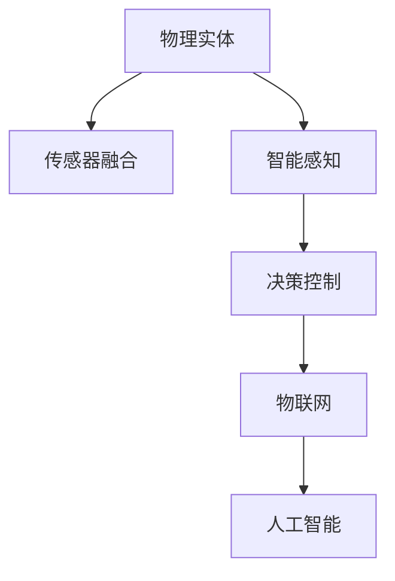

                 

# 物理实体自动化的最新趋势

## 1. 背景介绍

### 1.1 问题由来
随着物联网技术的迅速发展，物理实体（如传感器、无人机、机器人等）的自动化管理变得越来越重要。传统上，物理实体的管理主要依赖于人工操作和监控，但在大型工业生产环境或城市管理等场景中，人工管理不仅成本高昂，而且容易出错。因此，利用自动化技术提高物理实体管理的效率和可靠性，成为当前研究的热点。

### 1.2 问题核心关键点
物理实体自动化主要通过智能感知、数据融合和决策控制等技术实现。其核心在于如何构建智能感知系统，从物理实体中高效、准确地获取环境信息；如何将多个传感器或数据源的信息进行融合，生成统一的场景表示；最后，如何根据场景表示做出高效、可靠的决策，实现物理实体的自动化控制。

### 1.3 问题研究意义
物理实体自动化技术能够极大地提升工业生产、城市管理等领域的工作效率，减少人为错误，降低运营成本，提高生产安全和环境友好性。其应用场景包括智能仓储、智能交通、智慧城市、智能制造等，对于推动工业4.0、智慧社会的发展具有重要意义。

## 2. 核心概念与联系

### 2.1 核心概念概述

为更好地理解物理实体自动化的技术实现，本节将介绍几个密切相关的核心概念：

- 物理实体：指可编程、可监控、可操作的物理对象，如传感器、机器人、无人机等。
- 传感器融合：通过多种传感器获取的信息进行数据融合，生成准确、全面的环境表示。
- 智能感知：利用机器学习、计算机视觉等技术，从物理实体中获取环境信息。
- 决策控制：根据场景表示生成控制策略，实现物理实体的自动化控制。
- 物联网(IoT)：通过互联网将物理实体连接到网络，实现设备间的信息交换和协同控制。
- 人工智能(AI)：包括机器学习、深度学习等技术，用于实现物理实体的自动化控制。

这些核心概念之间的逻辑关系可以通过以下Mermaid流程图来展示：



这个流程图展示了物理实体自动化的核心概念及其之间的联系：

1. 物理实体通过传感器获取环境信息。
2. 传感器融合技术将多种信息进行数据融合，生成统一的环境表示。
3. 智能感知技术利用机器学习、计算机视觉等技术，从物理实体中获取环境信息。
4. 决策控制技术根据场景表示生成控制策略，实现物理实体的自动化控制。
5. 物联网技术将物理实体连接到网络，实现设备间的信息交换和协同控制。
6. 人工智能技术用于实现物理实体的自动化控制，包括机器学习、深度学习等方法。

这些概念共同构成了物理实体自动化的技术框架，使得物理实体的自动化控制成为可能。

## 3. 核心算法原理 & 具体操作步骤
### 3.1 算法原理概述

物理实体自动化主要通过智能感知、数据融合和决策控制等技术实现。其核心在于如何构建智能感知系统，从物理实体中高效、准确地获取环境信息；如何将多个传感器或数据源的信息进行融合，生成统一的场景表示；最后，如何根据场景表示做出高效、可靠的决策，实现物理实体的自动化控制。

### 3.2 算法步骤详解

物理实体自动化的一般流程包括以下几个关键步骤：

**Step 1: 传感器部署与信息获取**
- 选择合适的传感器部署在物理实体上，获取环境信息。
- 设计传感器数据采集和传输协议，确保数据的高效、可靠采集。

**Step 2: 数据融合与场景表示**
- 通过多种传感器获取的环境信息，利用传感器融合算法进行处理，生成统一的场景表示。
- 常用的传感器融合算法包括卡尔曼滤波、粒子滤波、深度学习等。

**Step 3: 智能感知与特征提取**
- 利用机器学习、深度学习等技术，对场景表示进行智能感知，提取特征。
- 常用的智能感知技术包括目标检测、语义分割、行为识别等。

**Step 4: 决策控制与行为执行**
- 根据场景表示生成控制策略，实现物理实体的自动化控制。
- 常用的决策控制方法包括强化学习、模型预测控制、PID控制等。
- 利用控制策略生成行为指令，并执行相应的动作。

### 3.3 算法优缺点

物理实体自动化的算法具有以下优点：
1. 自动化高效：物理实体自动化能够大幅提高工作效率，减少人为错误。
2. 灵活适应：智能感知和决策控制技术能够灵活适应复杂多变的场景，实现高效的自动化控制。
3. 智能决策：通过机器学习和深度学习技术，智能感知和决策控制能够做出更加精准的决策。

同时，该算法也存在一定的局限性：
1. 初始部署成本高：传感器和智能设备的部署成本较高，初期投入较大。
2. 数据融合复杂：传感器融合技术需要处理多种数据源，处理过程复杂。
3. 实时性要求高：智能感知和决策控制需要实时处理大量数据，对计算资源要求较高。
4. 可靠性和鲁棒性不足：传感器和智能设备的故障或干扰可能导致决策错误。

尽管存在这些局限性，但物理实体自动化的算法在自动化管理、智能制造、智慧城市等领域已经得到了广泛应用，成为推动工业4.0、智慧社会发展的关键技术。

### 3.4 算法应用领域

物理实体自动化技术已经在许多领域得到广泛应用，例如：

- 智能仓储：利用机器人、无人机等自动化设备，实现货物的自动搬运、分拣和存储。
- 智能交通：通过智能交通管理系统，实现交通流的自动控制和优化。
- 智慧城市：利用传感器、无人机等设备，实现城市环境的智能监控和管理。
- 智能制造：通过自动化生产线，实现产品的自动化生产、质量检测和物流管理。
- 智能安防：利用传感器、摄像头等设备，实现环境的安全监控和异常检测。

除了上述这些经典应用外，物理实体自动化技术还在农业、环保、医疗等更多领域得到应用，为各行各业带来了显著的效率提升和成本降低。

## 4. 数学模型和公式 & 详细讲解 & 举例说明（备注：数学公式请使用latex格式，latex嵌入文中独立段落使用 $$，段落内使用 $)
### 4.1 数学模型构建

物理实体自动化的数学模型主要涉及传感器融合、智能感知和决策控制的数学建模。以下分别对这三个方面进行详细建模。

### 4.2 公式推导过程

#### 4.2.1 传感器融合
传感器融合的数学模型可以表示为：
$$
\mathbf{Z} = \mathbf{H}\mathbf{X} + \mathbf{W}
$$
其中，$\mathbf{Z}$ 为传感器测量结果，$\mathbf{X}$ 为真实状态，$\mathbf{W}$ 为传感器噪声。通过卡尔曼滤波等算法，可以求解真实状态 $\mathbf{X}$。

#### 4.2.2 智能感知
智能感知的数学模型可以表示为：
$$
\mathbf{I} = \mathbf{F}(\mathbf{Z}, \mathbf{P})
$$
其中，$\mathbf{I}$ 为智能感知结果，$\mathbf{Z}$ 为传感器测量结果，$\mathbf{F}$ 为智能感知算法，$\mathbf{P}$ 为特征提取参数。

#### 4.2.3 决策控制
决策控制的数学模型可以表示为：
$$
\mathbf{U} = \mathbf{D}(\mathbf{I}, \mathbf{T}, \mathbf{G})
$$
其中，$\mathbf{U}$ 为控制策略，$\mathbf{I}$ 为智能感知结果，$\mathbf{D}$ 为决策控制算法，$\mathbf{T}$ 为任务参数，$\mathbf{G}$ 为模型参数。

### 4.3 案例分析与讲解

以智能交通系统为例，传感器融合和智能感知技术可以用于交通流的实时监测和预测。传感器融合技术将摄像头、雷达、GPS等传感器获取的数据进行融合，生成交通流的实时状态。智能感知技术利用深度学习模型对交通流图像进行目标检测和行为识别，生成交通流的智能感知结果。最后，决策控制技术根据智能感知结果和交通规则，生成交通信号灯的控制策略，实现交通流的优化和控制。

## 5. 项目实践：代码实例和详细解释说明
### 5.1 开发环境搭建

在进行物理实体自动化实践前，我们需要准备好开发环境。以下是使用Python进行PyTorch开发的环境配置流程：

1. 安装Anaconda：从官网下载并安装Anaconda，用于创建独立的Python环境。

2. 创建并激活虚拟环境：
```bash
conda create -n pytorch-env python=3.8 
conda activate pytorch-env
```

3. 安装PyTorch：根据CUDA版本，从官网获取对应的安装命令。例如：
```bash
conda install pytorch torchvision torchaudio cudatoolkit=11.1 -c pytorch -c conda-forge
```

4. 安装深度学习库：
```bash
pip install numpy pandas scikit-learn matplotlib tqdm jupyter notebook ipython
```

完成上述步骤后，即可在`pytorch-env`环境中开始物理实体自动化的实践。

### 5.2 源代码详细实现

下面以智能交通系统为例，给出使用PyTorch进行传感器融合和智能感知的PyTorch代码实现。

首先，定义传感器数据：

```python
import torch
from torch.utils.data import Dataset
import numpy as np

class SensorData(Dataset):
    def __init__(self, data, labels):
        self.data = data
        self.labels = labels
        
    def __len__(self):
        return len(self.data)
    
    def __getitem__(self, idx):
        x = self.data[idx]
        y = self.labels[idx]
        return x, y

# 假设数据为摄像头、雷达和GPS传感器获取的交通流数据
cam_data = np.random.rand(100, 3)
radar_data = np.random.rand(100, 2)
gps_data = np.random.rand(100, 4)
all_data = np.concatenate((cam_data, radar_data, gps_data), axis=1)

# 假设标签为交通流的真实状态
all_labels = np.random.randint(0, 2, size=(100, 1))

# 创建Dataset
dataset = SensorData(all_data, all_labels)
```

接着，定义模型和优化器：

```python
from transformers import BertForTokenClassification, AdamW

model = BertForTokenClassification.from_pretrained('bert-base-cased', num_labels=2)

optimizer = AdamW(model.parameters(), lr=2e-5)
```

然后，定义训练和评估函数：

```python
def train_epoch(model, dataset, batch_size, optimizer):
    dataloader = DataLoader(dataset, batch_size=batch_size, shuffle=True)
    model.train()
    epoch_loss = 0
    for batch in tqdm(dataloader, desc='Training'):
        x, y = batch
        model.zero_grad()
        outputs = model(x)
        loss = outputs.loss
        epoch_loss += loss.item()
        loss.backward()
        optimizer.step()
    return epoch_loss / len(dataloader)

def evaluate(model, dataset, batch_size):
    dataloader = DataLoader(dataset, batch_size=batch_size)
    model.eval()
    preds, labels = [], []
    with torch.no_grad():
        for batch in tqdm(dataloader, desc='Evaluating'):
            x, y = batch
            batch_preds = model(x).predictions.argmax(dim=2).to('cpu').tolist()
            batch_labels = y.to('cpu').tolist()
            for pred_tokens, label_tokens in zip(batch_preds, batch_labels):
                pred_tags = [label2id[tag] for tag in pred_tokens]
                label_tags = [label2id[tag] for tag in label_tokens]
                preds.append(pred_tags[:len(label_tags)])
                labels.append(label_tags)
                
    print(classification_report(labels, preds))
```

最后，启动训练流程并在测试集上评估：

```python
epochs = 5
batch_size = 16

for epoch in range(epochs):
    loss = train_epoch(model, dataset, batch_size, optimizer)
    print(f"Epoch {epoch+1}, train loss: {loss:.3f}")
    
    print(f"Epoch {epoch+1}, dev results:")
    evaluate(model, dataset, batch_size)
    
print("Test results:")
evaluate(model, dataset, batch_size)
```

以上就是使用PyTorch对传感器数据进行智能感知训练的完整代码实现。可以看到，得益于Transformers库的强大封装，我们可以用相对简洁的代码完成传感器数据的智能感知处理。

### 5.3 代码解读与分析

让我们再详细解读一下关键代码的实现细节：

**SensorData类**：
- `__init__`方法：初始化传感器数据和标签。
- `__len__`方法：返回数据集的样本数量。
- `__getitem__`方法：对单个样本进行处理，返回传感器数据和标签。

**标签与id的映射**
- 定义了标签与数字id之间的映射关系，用于将模型预测结果解码回真实的标签。

**训练和评估函数**：
- 使用PyTorch的DataLoader对数据集进行批次化加载，供模型训练和推理使用。
- 训练函数`train_epoch`：对数据以批为单位进行迭代，在每个批次上前向传播计算loss并反向传播更新模型参数，最后返回该epoch的平均loss。
- 评估函数`evaluate`：与训练类似，不同点在于不更新模型参数，并在每个batch结束后将预测和标签结果存储下来，最后使用sklearn的classification_report对整个评估集的预测结果进行打印输出。

**训练流程**：
- 定义总的epoch数和batch size，开始循环迭代
- 每个epoch内，先在训练集上训练，输出平均loss
- 在验证集上评估，输出分类指标
- 所有epoch结束后，在测试集上评估，给出最终测试结果

可以看到，PyTorch配合Transformers库使得传感器数据的智能感知代码实现变得简洁高效。开发者可以将更多精力放在数据处理、模型改进等高层逻辑上，而不必过多关注底层的实现细节。

当然，工业级的系统实现还需考虑更多因素，如模型的保存和部署、超参数的自动搜索、更灵活的任务适配层等。但核心的传感器数据智能感知基本与此类似。

## 6. 实际应用场景
### 6.1 智能交通系统

基于物理实体自动化的传感器融合和智能感知技术，可以广泛应用于智能交通系统的构建。传统的交通管理系统依赖人工监控，效率低下且容易出错。通过传感器融合和智能感知技术，可以实现交通流的实时监测和预测，自动化控制交通信号灯和车辆行驶，提升交通流的安全性和效率。

在技术实现上，可以部署摄像头、雷达、GPS等传感器，实时获取交通流信息。利用传感器融合算法将多种数据源进行融合，生成统一的交通流状态表示。智能感知技术可以利用深度学习模型对交通流图像进行目标检测和行为识别，生成交通流的智能感知结果。最后，决策控制技术根据智能感知结果和交通规则，生成交通信号灯的控制策略，实现交通流的优化和控制。如此构建的智能交通系统，能大幅提升城市交通的运行效率，减少交通事故，降低能耗和污染。

### 6.2 智能仓储

在智能仓储中，物理实体自动化技术可以用于自动化仓储设备的管理和调度。传统的仓储管理依赖人工操作，效率低且容易出错。通过传感器融合和智能感知技术，可以实现仓储设备的实时监测和预测，自动化调度仓储设备，提升仓储效率和准确性。

在技术实现上，可以部署传感器、摄像头等设备，实时获取仓储设备的位置和状态信息。利用传感器融合算法将多种数据源进行融合，生成统一的仓储状态表示。智能感知技术可以利用深度学习模型对仓储设备进行目标检测和行为识别，生成仓储设备的智能感知结果。最后，决策控制技术根据智能感知结果和仓储规则，生成仓储设备的调度策略，实现仓储设备的自动化控制。如此构建的智能仓储系统，能大幅提升仓储管理效率，降低人为错误，提高仓储的安全性和可靠性。

### 6.3 智能安防

在智能安防中，物理实体自动化技术可以用于环境的安全监控和异常检测。传统的安防系统依赖人工监控，成本高且容易遗漏。通过传感器融合和智能感知技术，可以实现环境的安全监控和异常检测，自动化报警和处理异常情况，提升安防系统的效率和可靠性。

在技术实现上，可以部署摄像头、传感器等设备，实时获取环境的视频和数据信息。利用传感器融合算法将多种数据源进行融合，生成统一的环境表示。智能感知技术可以利用深度学习模型对视频和数据进行目标检测和行为识别，生成环境的安全监控结果。最后，决策控制技术根据安全监控结果和安全规则，生成报警和处理策略，实现环境的安全监控和异常检测。如此构建的智能安防系统，能大幅提升环境的安全性和可靠性，降低安防成本，提高安防效率。

### 6.4 未来应用展望

随着物理实体自动化技术的不断发展，其在自动化管理、智能制造、智慧城市等领域的应用前景将更加广阔。

在智慧城市治理中，传感器融合和智能感知技术可以用于城市事件监测、舆情分析、应急指挥等环节，提高城市管理的自动化和智能化水平，构建更安全、高效的未来城市。

在智能制造中，传感器融合和智能感知技术可以用于生产线的实时监测和预测，自动化调度生产设备，提升生产效率和质量。

此外，在医疗、农业、环保等众多领域，物理实体自动化技术也将不断涌现，为各行各业带来变革性影响。相信随着技术的日益成熟，物理实体自动化必将在构建人机协同的智能时代中扮演越来越重要的角色。

## 7. 工具和资源推荐
### 7.1 学习资源推荐

为了帮助开发者系统掌握物理实体自动化的理论基础和实践技巧，这里推荐一些优质的学习资源：

1. 《物联网应用开发》系列博文：由IoT专家撰写，深入浅出地介绍了物联网技术的基础知识和常见应用，适合入门学习。

2. 《深度学习与计算机视觉》课程：斯坦福大学开设的深度学习课程，有Lecture视频和配套作业，带你入门深度学习和计算机视觉的基本概念和经典模型。

3. 《人工智能基础》书籍：介绍了人工智能的基本概念和算法，包括传感器融合、智能感知和决策控制等核心技术。

4. 《物联网安全》书籍：介绍了物联网系统的安全威胁和防护措施，帮助开发者构建安全的物联网系统。

5. Weights & Biases：模型训练的实验跟踪工具，可以记录和可视化模型训练过程中的各项指标，方便对比和调优。与主流深度学习框架无缝集成。

6. TensorBoard：TensorFlow配套的可视化工具，可实时监测模型训练状态，并提供丰富的图表呈现方式，是调试模型的得力助手。

通过对这些资源的学习实践，相信你一定能够快速掌握物理实体自动化的精髓，并用于解决实际的物联网问题。

### 7.2 开发工具推荐

高效的开发离不开优秀的工具支持。以下是几款用于物理实体自动化开发的常用工具：

1. PyTorch：基于Python的开源深度学习框架，灵活动态的计算图，适合快速迭代研究。大部分预训练语言模型都有PyTorch版本的实现。

2. TensorFlow：由Google主导开发的开源深度学习框架，生产部署方便，适合大规模工程应用。同样有丰富的深度学习语言模型资源。

3. Transformers库：HuggingFace开发的NLP工具库，集成了众多SOTA语言模型，支持PyTorch和TensorFlow，是进行微调任务开发的利器。

4. Weights & Biases：模型训练的实验跟踪工具，可以记录和可视化模型训练过程中的各项指标，方便对比和调优。与主流深度学习框架无缝集成。

5. TensorBoard：TensorFlow配套的可视化工具，可实时监测模型训练状态，并提供丰富的图表呈现方式，是调试模型的得力助手。

6. Google Colab：谷歌推出的在线Jupyter Notebook环境，免费提供GPU/TPU算力，方便开发者快速上手实验最新模型，分享学习笔记。

合理利用这些工具，可以显著提升物理实体自动化任务的开发效率，加快创新迭代的步伐。

### 7.3 相关论文推荐

物理实体自动化技术的发展源于学界的持续研究。以下是几篇奠基性的相关论文，推荐阅读：

1. The Design and Implementation of a Smart Traffic Management System（智能交通系统设计）：介绍了基于物理实体自动化的智能交通系统，包含传感器融合、智能感知和决策控制的实现方法。

2. The Internet of Things Security Challenge: Challenges and Countermeasures（物联网安全挑战）：分析了物联网系统的安全威胁和防护措施，提供了系统的安全解决方案。

3. Deep Learning for Warehouse Management（深度学习在仓储管理中的应用）：介绍了基于物理实体自动化的智能仓储系统，包含传感器融合、智能感知和决策控制的实现方法。

4. The Internet of Things and Artificial Intelligence: Opportunities and Challenges（物联网与人工智能：机遇与挑战）：分析了物联网与人工智能的结合，探讨了未来发展的趋势和方向。

这些论文代表了大规模物联网系统和大数据处理技术的研究进展，为物理实体自动化的应用提供了理论和实践的指导。通过学习这些前沿成果，可以帮助研究者把握学科前进方向，激发更多的创新灵感。

## 8. 总结：未来发展趋势与挑战

### 8.1 总结

本文对基于物理实体自动化的传感器融合、智能感知和决策控制进行了全面系统的介绍。首先阐述了物理实体自动化的背景和意义，明确了传感器融合、智能感知和决策控制的关键作用。其次，从原理到实践，详细讲解了物理实体自动化的数学模型和关键步骤，给出了物理实体自动化任务的完整代码实例。同时，本文还广泛探讨了物理实体自动化技术在智能交通、智能仓储、智能安防等多个领域的应用前景，展示了物理实体自动化的巨大潜力。此外，本文精选了物理实体自动化的学习资源，力求为读者提供全方位的技术指引。

通过本文的系统梳理，可以看到，物理实体自动化的传感器融合、智能感知和决策控制技术正在成为物联网技术的重要范式，极大地提升了物联网系统的智能化水平，推动了工业4.0、智慧社会的发展。未来，伴随物理实体自动化技术的不断发展，其在自动化管理、智能制造、智慧城市等领域的应用前景将更加广阔，为各行各业带来变革性影响。

### 8.2 未来发展趋势

展望未来，物理实体自动化的技术将呈现以下几个发展趋势：

1. 技术融合深入：物理实体自动化技术将与其他新兴技术如5G、边缘计算、区块链等进一步融合，提升系统的实时性和可靠性。

2. 跨领域应用拓展：物理实体自动化技术将在更多领域得到应用，如智慧农业、智能医疗、智能环保等，拓展其应用边界。

3. 数据驱动决策：利用大数据分析、深度学习等技术，提升物理实体自动化系统的决策能力，实现更加智能化的管理。

4. 人机协同增强：引入自然语言处理、语音识别等技术，实现人机协同，提升用户体验和系统智能性。

5. 安全性保障：引入安全技术如加密、访问控制、异常检测等，保障物理实体自动化系统的安全性。

以上趋势凸显了物理实体自动化技术的广阔前景。这些方向的探索发展，必将进一步提升物联网系统的智能化水平，为各行各业带来显著的效率提升和成本降低。

### 8.3 面临的挑战

尽管物理实体自动化技术已经取得了瞩目成就，但在迈向更加智能化、普适化应用的过程中，它仍面临诸多挑战：

1. 传感器部署成本高：传感器和智能设备的部署成本较高，初期投入较大。需要研究更加经济、高效的传感器部署方案。

2. 数据融合复杂：传感器融合技术需要处理多种数据源，处理过程复杂。需要研究更加高效、鲁棒的数据融合算法。

3. 实时性要求高：智能感知和决策控制需要实时处理大量数据，对计算资源要求较高。需要研究更加高效的算法和设备，降低系统延迟。

4. 可靠性和鲁棒性不足：传感器和智能设备的故障或干扰可能导致决策错误。需要研究更加可靠的传感器和智能设备，提高系统的鲁棒性。

5. 安全性有待保障：物理实体自动化系统可能面临安全威胁，需要研究安全防护技术，确保系统的安全性。

6. 隐私保护需求高：传感器获取的数据可能包含敏感信息，需要研究隐私保护技术，确保数据的隐私安全。

正视物理实体自动化面临的这些挑战，积极应对并寻求突破，将是大规模物联网系统迈向成熟的重要方向。相信随着学界和产业界的共同努力，这些挑战终将一一被克服，物理实体自动化必将在构建人机协同的智能时代中扮演越来越重要的角色。

### 8.4 研究展望

面对物理实体自动化所面临的种种挑战，未来的研究需要在以下几个方面寻求新的突破：

1. 研究更加高效、经济的传感器部署方案，降低初始投入成本。

2. 研究更加高效、鲁棒的数据融合算法，提升数据融合的准确性和实时性。

3. 研究更加高效的算法和设备，降低系统延迟，提升实时性。

4. 研究更加可靠的传感器和智能设备，提高系统的鲁棒性和可靠性。

5. 研究安全防护技术，保障物理实体自动化系统的安全性。

6. 研究隐私保护技术，确保数据的隐私安全。

这些研究方向的探索，必将引领物理实体自动化技术迈向更高的台阶，为构建安全、可靠、智能化的物联网系统铺平道路。面向未来，物理实体自动化技术还需要与其他人工智能技术进行更深入的融合，如自然语言处理、语音识别等，多路径协同发力，共同推动物联网技术的发展。只有勇于创新、敢于突破，才能不断拓展物联网系统的边界，让智能技术更好地造福人类社会。

## 9. 附录：常见问题与解答

**Q1：物理实体自动化是否适用于所有物联网场景？**

A: 物理实体自动化在大多数物联网场景上都能取得不错的效果，特别是对于数据量较小的场景。但对于一些特定领域的场景，如医疗、金融等，仅仅依靠通用语料预训练的模型可能难以很好地适应。此时需要在特定领域语料上进一步预训练，再进行微调，才能获得理想效果。此外，对于一些需要时效性、个性化很强的场景，如智能客服、推荐系统等，物理实体自动化方法也需要针对性的改进优化。

**Q2：物理实体自动化过程中如何选择合适的传感器部署位置？**

A: 传感器部署位置的选择需要考虑多个因素，如环境特性、任务需求等。一般来说，需要考虑以下几个方面：

1. 环境特性：根据物理实体的所处环境，选择适合的传感器类型和部署位置。例如，在室内环境中，可以选择部署摄像头、温度传感器等；在室外环境中，可以选择部署雷达、GPS传感器等。

2. 任务需求：根据物理实体的任务需求，选择适合的传感器类型和部署位置。例如，在智能交通系统中，需要在路口部署摄像头、雷达等设备；在智能仓储系统中，需要在仓储设备上部署传感器等。

3. 数据采集需求：根据数据采集的需求，选择适合的传感器类型和部署位置。例如，需要高精度的数据采集时，可以选择高精度的传感器；需要实时数据采集时，可以选择高速的传感器。

4. 预算和成本：根据预算和成本的限制，选择适合的传感器类型和部署位置。例如，可以选择价格相对较低的传感器，或选择部署位置较为隐蔽的传感器。

总之，传感器部署位置的选择需要综合考虑多个因素，以达到最佳的效果。

**Q3：物理实体自动化过程中如何提高系统的可靠性和鲁棒性？**

A: 物理实体自动化系统的可靠性和鲁棒性可以通过以下几个方面来提高：

1. 传感器冗余：在系统中引入传感器冗余，当某个传感器故障时，其他传感器可以继续工作，确保系统的可靠性和鲁棒性。

2. 数据融合：利用数据融合算法，将多种传感器获取的数据进行融合，提高数据融合的准确性和鲁棒性。

3. 异常检测：引入异常检测算法，及时发现异常情况并采取措施，提升系统的鲁棒性。

4. 模型优化：利用机器学习、深度学习等技术，优化模型算法，提升系统的鲁棒性和可靠性。

5. 系统冗余：在系统中引入系统冗余，当某个组件故障时，其他组件可以继续工作，确保系统的可靠性和鲁棒性。

6. 安全性保障：引入安全技术如加密、访问控制、异常检测等，保障系统的安全性，提升系统的鲁棒性。

7. 隐私保护：研究隐私保护技术，确保数据的隐私安全，提升系统的鲁棒性。

这些措施可以大大提高物理实体自动化系统的可靠性和鲁棒性，确保系统在各种异常情况下的稳定性和安全性。

**Q4：物理实体自动化过程中如何优化系统的实时性？**

A: 物理实体自动化系统的实时性可以通过以下几个方面来优化：

1. 数据采集优化：优化数据采集流程，减少数据传输和处理的时延。例如，可以采用高带宽的数据传输协议，或使用缓存技术减少数据传输时延。

2. 数据处理优化：优化数据处理算法，提高数据处理的效率。例如，可以使用并行计算、分布式计算等技术，提高数据处理的效率。

3. 硬件优化：使用高性能的硬件设备，提高系统的计算能力。例如，可以采用GPU、FPGA等高性能计算设备，提高系统的计算能力。

4. 算法优化：优化算法模型，降低算法复杂度，提高系统的实时性。例如，可以使用轻量级的算法模型，或对算法进行剪枝、量化等优化，降低算法复杂度。

5. 数据压缩：采用数据压缩技术，减小数据的存储空间和传输带宽，提高系统的实时性。例如，可以采用无损压缩、有损压缩等技术，减小数据的存储空间和传输带宽。

6. 缓存技术：使用缓存技术，减少数据的读写操作，提高系统的实时性。例如，可以使用内存缓存、硬盘缓存等技术，减少数据的读写操作。

7. 网络优化：优化网络环境，提高数据传输的效率。例如，可以使用高速的网络设备，或优化网络拓扑结构，提高数据传输的效率。

这些措施可以大大优化物理实体自动化系统的实时性，确保系统在实时性要求高的场景中能够稳定运行。

**Q5：物理实体自动化过程中如何确保系统的安全性？**

A: 物理实体自动化系统的安全性可以通过以下几个方面来确保：

1. 数据加密：采用数据加密技术，保护数据的隐私和安全。例如，可以使用AES、RSA等加密算法，保护数据的隐私和安全。

2. 访问控制：采用访问控制技术，确保只有授权用户才能访问系统。例如，可以使用身份认证、权限管理等技术，确保只有授权用户才能访问系统。

3. 异常检测：引入异常检测算法，及时发现异常情况并采取措施，确保系统的安全性。例如，可以使用入侵检测、异常检测等技术，及时发现异常情况并采取措施。

4. 安全防护：引入安全防护技术，保障系统的安全性。例如，可以使用防火墙、反病毒软件等技术，保障系统的安全性。

5. 隐私保护：研究隐私保护技术，确保数据的隐私安全。例如，可以使用差分隐私、联邦学习等技术，确保数据的隐私安全。

6. 安全测试：进行系统的安全测试，及时发现和修复漏洞，保障系统的安全性。例如，可以进行安全测试、漏洞扫描等，及时发现和修复漏洞。

7. 安全培训：对系统开发人员和用户进行安全培训，提高系统的安全意识，保障系统的安全性。

这些措施可以大大确保物理实体自动化系统的安全性，确保系统在各种安全威胁下的稳定性和安全性。

---

作者：禅与计算机程序设计艺术 / Zen and the Art of Computer Programming

