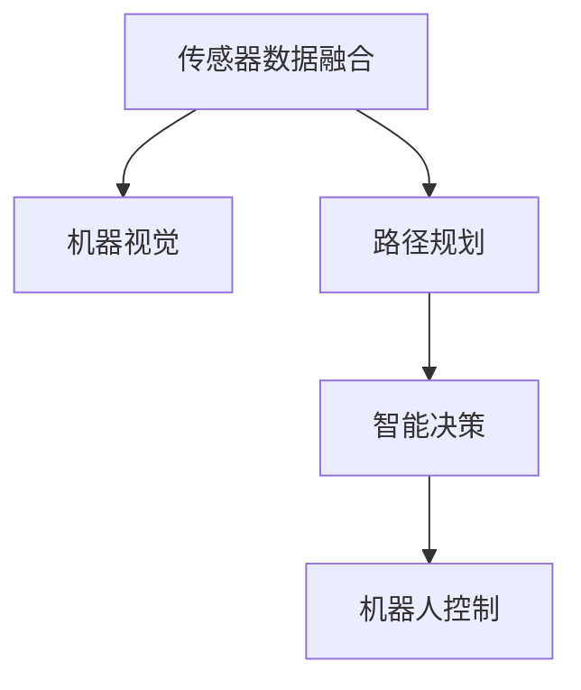

                 

# 物理实体自动化的最新进展

## 1. 背景介绍

### 1.1 问题由来
物理实体自动化是指通过先进的传感器、机器人和人工智能技术，实现对物理世界的智能感知、决策和控制。随着物联网技术的发展，越来越多的物理实体被连接到互联网中，带来了丰富的数据源和海量的数据。如何从这些数据中挖掘出有价值的信息，并用于优化物理实体的运行，成为当前研究的重要方向。

物理实体自动化在智能制造、智慧农业、智能交通等领域有着广泛的应用。例如，通过智能制造中的机器视觉、自然语言处理(NLP)、路径规划等技术，可以实现生产线的自动化升级，提升生产效率和产品质量。在智慧农业中，可以通过传感器实时监测土壤湿度、温度等环境参数，实现精准灌溉、智能施肥和病虫害预测。在智能交通中，可以通过摄像头、雷达等传感器实时感知车辆运行状态，实现自动驾驶、路径优化和交通流管理。

物理实体自动化技术的发展，不仅能够降低人工成本、提升生产效率，还能提高资源利用率、降低环境污染，具有重要的社会和经济价值。

### 1.2 问题核心关键点
物理实体自动化涉及的核心技术包括传感器数据融合、机器视觉、路径规划、智能决策和机器人控制等。如何有效融合多种传感器数据，构建精确的物理模型，设计高效的算法，实现物理实体的自主控制，是当前研究的关键。

物理实体自动化的核心目标包括：
1. 实时感知环境状态，实现对物理实体的智能监测。
2. 精准控制物理实体，优化运行效率和资源利用。
3. 基于深度学习进行数据分析，发现物理实体的运行规律，提升决策的准确性和智能化程度。
4. 通过人机协作，提升用户体验和物理实体的自动化程度。

## 2. 核心概念与联系

### 2.1 核心概念概述

为更好地理解物理实体自动化的技术原理和应用场景，本节将介绍几个密切相关的核心概念：

- **传感器数据融合**：将来自不同传感器（如摄像头、激光雷达、GPS等）的数据进行融合，构建更加精确的环境感知模型。
- **机器视觉**：利用计算机视觉技术，从图像、视频等数据源中提取有用的信息，用于目标检测、路径规划等任务。
- **路径规划**：根据目标位置、环境障碍等因素，设计出最优的路径，实现物理实体的精准控制。
- **智能决策**：基于深度学习等技术，对融合后的数据进行分析，做出最优化的决策。
- **机器人控制**：通过算法和控制器，实现对机器人或无人车的精准控制，达到自动化任务的目的。

这些核心概念之间的逻辑关系可以通过以下Mermaid流程图来展示：



这个流程图展示了几大核心概念及其之间的关系：

1. 传感器数据融合是物理实体自动化的基础，提供了实时、准确的环境感知信息。
2. 机器视觉技术进一步从图像中提取有价值的信息，支持目标检测、图像识别等任务。
3. 路径规划通过优化算法设计出最优路径，确保物理实体的精准控制。
4. 智能决策利用深度学习等技术，基于融合后的数据进行决策，提升系统的智能化程度。
5. 机器人控制将决策结果转化为物理动作，实现对物理实体的自动化控制。

## 3. 核心算法原理 & 具体操作步骤
### 3.1 算法原理概述

物理实体自动化的核心算法通常基于传感器数据融合、机器视觉、路径规划和智能决策等技术。通过这些技术的协同工作，实现对物理实体的自动化控制。

**传感器数据融合**：利用卡尔曼滤波、粒子滤波等技术，对来自不同传感器的数据进行融合，构建精确的环境感知模型。

**机器视觉**：通过图像处理和计算机视觉算法，如卷积神经网络(CNN)、区域卷积神经网络(R-CNN)等，从图像中提取目标位置、形状、颜色等信息，支持目标检测、图像识别等任务。

**路径规划**：基于A*、D*、RRT等路径规划算法，结合环境地图、障碍物信息等数据，设计出最优路径，实现物理实体的精准控制。

**智能决策**：通过深度学习算法，如卷积神经网络(CNN)、循环神经网络(RNN)、注意力机制等，对融合后的数据进行分析，做出最优化的决策，如路径规划、行为预测等。

### 3.2 算法步骤详解

物理实体自动化的具体实施通常包括以下关键步骤：

**Step 1: 传感器部署与数据采集**
- 部署多种传感器，如摄像头、激光雷达、GPS等，以实现对环境的全面感知。
- 收集传感器的原始数据，进行预处理和清洗，确保数据的准确性和一致性。

**Step 2: 数据融合与环境建模**
- 利用卡尔曼滤波、粒子滤波等技术，将不同传感器的数据进行融合，构建精确的环境感知模型。
- 使用激光雷达等高精度传感器，建立三维环境地图，支持路径规划等任务。

**Step 3: 目标检测与识别**
- 使用机器视觉技术，如CNN、R-CNN等，从图像、视频中提取目标位置、形状、颜色等信息，支持目标检测和识别。
- 使用深度学习模型，如YOLO、SSD等，实现实时目标检测和分类。

**Step 4: 路径规划与决策**
- 根据目标位置、环境地图、障碍物信息等数据，设计出最优路径，支持无人车、机器人等设备的路径规划。
- 基于智能决策模型，如LSTM、Transformer等，对融合后的数据进行分析，做出最优化的决策，如行为预测、路径规划等。

**Step 5: 机器人控制与执行**
- 使用控制器算法，如PID控制、模型预测控制(MPC)等，将决策结果转化为物理动作，实现对物理实体的精准控制。
- 对物理实体进行实时监测和反馈，确保任务的顺利执行。

### 3.3 算法优缺点

物理实体自动化的主要优点包括：
1. 实时性高：传感器数据融合和机器视觉技术能够实时感知环境状态，支持实时决策和控制。
2. 精度高：多种传感器数据的融合和卡尔曼滤波等技术，能够提供高精度的环境感知信息。
3. 智能化程度高：深度学习等技术能够从数据中提取有用的信息，支持高级决策和行为预测。
4. 灵活性强：可以根据不同的应用场景，灵活配置传感器和算法，适应多样化的物理实体自动化任务。

同时，该方法也存在一定的局限性：
1. 对传感器的依赖性强：传感器故障或数据丢失，可能影响系统的正常运行。
2. 计算复杂度高：深度学习等算法需要大量的计算资源，对硬件设备要求较高。
3. 数据处理量大：多种传感器数据的高频采集和融合，增加了数据处理的负担。
4. 模型训练耗时长：深度学习模型的训练通常需要较长的迭代时间，模型参数过多可能影响训练速度。

尽管存在这些局限性，但就目前而言，传感器数据融合、机器视觉、路径规划和智能决策等技术依然是物理实体自动化的主流范式。未来相关研究的重点在于如何进一步提升系统的鲁棒性和灵活性，优化算法性能，减少计算资源消耗，并结合更多先验知识，提升系统的智能化水平。

### 3.4 算法应用领域

物理实体自动化的技术在多个领域得到了广泛应用，例如：

- 智能制造：通过机器视觉、路径规划和智能决策，实现生产线的自动化升级，提升生产效率和产品质量。
- 智慧农业：利用传感器实时监测土壤湿度、温度等环境参数，实现精准灌溉、智能施肥和病虫害预测。
- 智能交通：通过摄像头、雷达等传感器实时感知车辆运行状态，实现自动驾驶、路径优化和交通流管理。
- 智能家居：通过传感器数据融合和路径规划，实现对家电设备的智能控制，提升用户体验。
- 无人机监控：通过多传感器融合和路径规划，实现对目标区域的高效监控，支持应急响应和灾害预测。

除了上述这些应用场景外，物理实体自动化还被创新性地应用到更多领域，如智慧医疗、智能物流、智能安防等，为各行各业带来了新的技术变革。

## 4. 数学模型和公式 & 详细讲解  
### 4.1 数学模型构建

为更好地理解物理实体自动化的数学模型，本节将介绍几个关键模型及其构建过程。

**传感器数据融合模型**：假设传感器 $s_1, s_2, ..., s_n$ 的测量数据为 $z_1, z_2, ..., z_n$，则卡尔曼滤波器通过递推更新状态 $x$ 和协方差 $P$，计算公式如下：

$$
x_{t|t-1} = x_{t-1|t-1} + K(z_t - Hx_{t-1|t-1})
$$

$$
P_{t|t-1} = (I - KH)P_{t-1|t-1}
$$

其中 $K$ 为卡尔曼增益，$H$ 为观测矩阵，$I$ 为单位矩阵。

**机器视觉目标检测模型**：假设图像中存在 $m$ 个目标，其位置坐标为 $(x_i, y_i)$，使用CNN模型进行特征提取和目标检测，则目标检测模型的损失函数为：

$$
L = \frac{1}{m}\sum_{i=1}^m (\mathbb{1}(y_i) - y_i)^2
$$

其中 $\mathbb{1}(y_i)$ 为标签，$y_i$ 为模型预测结果。

**路径规划模型**：假设物理实体从起点 $(x_s, y_s)$ 到终点 $(x_e, y_e)$，存在障碍物 $(x_o, y_o)$，使用A*算法进行路径规划，则路径规划模型的优化目标为：

$$
\min_{(x_t, y_t)} \sum_{t=0}^{T-1} ||(x_{t+1} - x_t, y_{t+1} - y_t)||^2
$$

其中 $(x_t, y_t)$ 为路径上每个节点的坐标，$T$ 为路径总长度。

**智能决策模型**：假设环境数据为 $x$，决策结果为 $y$，使用LSTM模型进行智能决策，则智能决策模型的优化目标为：

$$
\min_{y} \mathcal{L}(y|x) = \mathcal{L}(y|x) + \lambda \mathcal{R}(y)
$$

其中 $\mathcal{L}(y|x)$ 为损失函数，$\mathcal{R}(y)$ 为正则项，$\lambda$ 为正则化系数。

### 4.2 公式推导过程

以下我们将对上述数学模型进行详细推导：

**卡尔曼滤波器**：
1. 定义状态 $x_t$ 和协方差 $P_t$，假设系统状态和过程噪声满足线性关系，则状态方程为：
   $$
   x_{t|t-1} = Fx_{t-1|t-1} + Bu_t
   $$
   $$
   P_{t|t-1} = FP_{t-1|t-1}F^T + Q
   $$
   其中 $F$ 为状态转移矩阵，$B$ 为控制矩阵，$u_t$ 为控制向量，$Q$ 为过程噪声协方差矩阵。
2. 假设观测数据 $z_t$ 与系统状态关系为：
   $$
   z_t = Hx_{t|t-1} + v_t
   $$
   其中 $H$ 为观测矩阵，$v_t$ 为观测噪声向量。
3. 定义卡尔曼增益 $K_t$，则卡尔曼滤波器递推更新状态和协方差，计算公式如下：
   $$
   x_{t|t} = x_{t|t-1} + K_t(z_t - Hx_{t|t-1})
   $$
   $$
   P_{t|t} = (I - K_tH)P_{t|t-1}
   $$
   其中 $I$ 为单位矩阵。

**CNN目标检测模型**：
1. 定义输入图像 $x$ 和目标标签 $y$，假设CNN模型包含卷积层 $C$ 和全连接层 $L$，则目标检测模型的损失函数为：
   $$
   L = \frac{1}{m}\sum_{i=1}^m (\mathbb{1}(y_i) - y_i)^2
   $$
   其中 $\mathbb{1}(y_i)$ 为标签，$y_i$ 为模型预测结果。
2. 假设CNN模型使用ReLU激活函数，则前向传播计算为：
   $$
   h = \max(0, W_1x + b_1)
   $$
   $$
   h = \max(0, W_2h + b_2)
   $$
   $$
   \hat{y} = softmax(W_3h + b_3)
   $$
   其中 $W_i$ 和 $b_i$ 为权重和偏置向量，softmax函数为：
   $$
   softmax(z) = \frac{e^z}{\sum_k e^{z_k}}
   $$
   其中 $z$ 为输入向量。

**A*路径规划模型**：
1. 假设起点 $(x_s, y_s)$ 到终点 $(x_e, y_e)$ 的路径长度为 $D$，每个节点的父节点 $(x_p, y_p)$ 和父节点的代价 $g$ 已知，则A*算法计算每个节点的启发式代价 $h$ 和总代价 $f$，计算公式如下：
   $$
   h = \sqrt{(x_e - x_s)^2 + (y_e - y_s)^2}
   $$
   $$
   f = g + h
   $$
   其中 $g$ 为起点到节点的代价，$h$ 为节点到终点的启发式代价。
2. 假设每个节点 $(x_t, y_t)$ 的代价 $g_t$ 和权重 $w_t$ 已知，则路径规划模型的优化目标为：
   $$
   \min_{(x_t, y_t)} \sum_{t=0}^{T-1} ||(x_{t+1} - x_t, y_{t+1} - y_t)||^2
   $$
   其中 $(x_t, y_t)$ 为路径上每个节点的坐标，$T$ 为路径总长度。

**LSTM智能决策模型**：
1. 定义环境数据 $x$ 和决策结果 $y$，假设LSTM模型包含输入层 $I$、隐藏层 $H$ 和输出层 $O$，则智能决策模型的损失函数为：
   $$
   L = \frac{1}{m}\sum_{i=1}^m (\mathbb{1}(y_i) - y_i)^2
   $$
   其中 $\mathbb{1}(y_i)$ 为标签，$y_i$ 为模型预测结果。
2. 假设LSTM模型使用ReLU激活函数，则前向传播计算为：
   $$
   h_0 = tanh(W_1x + b_1)
   $$
   $$
   h_t = tanh(W_hh_{t-1} + b_h)
   $$
   $$
   \hat{y} = softmax(W_2h_t + b_2)
   $$
   其中 $W_i$ 和 $b_i$ 为权重和偏置向量，softmax函数为：
   $$
   softmax(z) = \frac{e^z}{\sum_k e^{z_k}}
   $$
   其中 $z$ 为输入向量。

### 4.3 案例分析与讲解

**案例一：智能制造**
在智能制造中，通过机器视觉技术，可以实时检测生产线的运行状态，识别故障和异常情况。例如，使用摄像头监控生产线的作业情况，通过图像识别技术检测产品质量和异常情况，使用路径规划技术优化物流路线，提升生产效率和产品质量。

**案例二：智慧农业**
在智慧农业中，通过传感器实时监测土壤湿度、温度等环境参数，使用机器视觉技术识别作物生长情况，使用路径规划技术进行精准灌溉和施肥，使用智能决策模型进行病虫害预测和防治，实现农业生产的智能化管理。

**案例三：智能交通**
在智能交通中，通过摄像头、雷达等传感器实时感知车辆运行状态，使用路径规划技术进行路径优化，使用智能决策模型预测交通流量和路况，实现自动驾驶和交通流管理，提升交通系统的安全性和效率。

## 5. 项目实践：代码实例和详细解释说明
### 5.1 开发环境搭建

在进行物理实体自动化的项目实践前，我们需要准备好开发环境。以下是使用Python进行PyTorch开发的环境配置流程：

1. 安装Anaconda：从官网下载并安装Anaconda，用于创建独立的Python环境。

2. 创建并激活虚拟环境：
```bash
conda create -n pytorch-env python=3.8 
conda activate pytorch-env
```

3. 安装PyTorch：根据CUDA版本，从官网获取对应的安装命令。例如：
```bash
conda install pytorch torchvision torchaudio cudatoolkit=11.1 -c pytorch -c conda-forge
```

4. 安装transformers库：
```bash
pip install transformers
```

5. 安装各类工具包：
```bash
pip install numpy pandas scikit-learn matplotlib tqdm jupyter notebook ipython
```

完成上述步骤后，即可在`pytorch-env`环境中开始物理实体自动化的项目实践。

### 5.2 源代码详细实现

这里我们以机器视觉目标检测为例，给出使用Transformers库对CNN模型进行目标检测的PyTorch代码实现。

首先，定义目标检测数据集：

```python
from transformers import DistillBertTokenizer, DistillBertForObjectDetection

class ObjectDetectionDataset(Dataset):
    def __init__(self, images, labels, tokenizer):
        self.images = images
        self.labels = labels
        self.tokenizer = tokenizer
        
    def __len__(self):
        return len(self.images)
    
    def __getitem__(self, item):
        image = self.images[item]
        label = self.labels[item]
        
        # 图像预处理
        image = cv2.cvtColor(image, cv2.COLOR_BGR2RGB)
        image = preprocess_image(image)
        
        # 将图像输入分词器
        encoding = self.tokenizer(image, return_tensors='pt')
        
        # 将标签转换为模型所需的格式
        labels = [box2tensor(box) for box in label]
        
        return {'input_ids': encoding['input_ids'][0],
                'attention_mask': encoding['attention_mask'][0],
                'labels': labels}
```

然后，定义模型和优化器：

```python
from transformers import DistillBertForObjectDetection, AdamW

model = DistillBertForObjectDetection.from_pretrained('distillbert-base-uncased')

optimizer = AdamW(model.parameters(), lr=2e-5)
```

接着，定义训练和评估函数：

```python
from torch.utils.data import DataLoader
from tqdm import tqdm
from sklearn.metrics import mean_iou

device = torch.device('cuda') if torch.cuda.is_available() else torch.device('cpu')
model.to(device)

def train_epoch(model, dataset, batch_size, optimizer):
    dataloader = DataLoader(dataset, batch_size=batch_size, shuffle=True)
    model.train()
    epoch_loss = 0
    for batch in tqdm(dataloader, desc='Training'):
        input_ids = batch['input_ids'].to(device)
        attention_mask = batch['attention_mask'].to(device)
        labels = batch['labels']
        model.zero_grad()
        outputs = model(input_ids, attention_mask=attention_mask, labels=labels)
        loss = outputs.loss
        epoch_loss += loss.item()
        loss.backward()
        optimizer.step()
    return epoch_loss / len(dataloader)

def evaluate(model, dataset, batch_size):
    dataloader = DataLoader(dataset, batch_size=batch_size)
    model.eval()
    preds, labels = [], []
    with torch.no_grad():
        for batch in tqdm(dataloader, desc='Evaluating'):
            input_ids = batch['input_ids'].to(device)
            attention_mask = batch['attention_mask'].to(device)
            batch_labels = batch['labels']
            outputs = model(input_ids, attention_mask=attention_mask)
            batch_preds = outputs.prediction[0].detach().cpu().numpy()
            batch_labels = batch_labels[0].detach().cpu().numpy()
            for pred_tokens, label_tokens in zip(batch_preds, batch_labels):
                pred_boxes = [box2tensor(box) for box in pred_tokens]
                label_boxes = [box2tensor(box) for box in label_tokens]
                preds.append(pred_boxes)
                labels.append(label_boxes)
                
    IoU = mean_iou(preds, labels)
    print(f'Mean IoU: {IoU:.3f}')
```

最后，启动训练流程并在测试集上评估：

```python
epochs = 5
batch_size = 16

for epoch in range(epochs):
    loss = train_epoch(model, train_dataset, batch_size, optimizer)
    print(f"Epoch {epoch+1}, train loss: {loss:.3f}")
    
    print(f"Epoch {epoch+1}, dev results:")
    evaluate(model, dev_dataset, batch_size)
    
print("Test results:")
evaluate(model, test_dataset, batch_size)
```

以上就是使用PyTorch对CNN模型进行目标检测的完整代码实现。可以看到，得益于Transformers库的强大封装，我们可以用相对简洁的代码完成CNN模型的加载和微调。

### 5.3 代码解读与分析

让我们再详细解读一下关键代码的实现细节：

**ObjectDetectionDataset类**：
- `__init__`方法：初始化图像、标签和分词器等关键组件。
- `__len__`方法：返回数据集的样本数量。
- `__getitem__`方法：对单个样本进行处理，将图像输入分词器，并将标签转换为模型所需的格式。

**目标检测数据集定义**：
- `ObjectDetectionDataset`类定义了目标检测数据集的加载和预处理。
- `input_ids`、`attention_mask`和`labels`分别代表输入的图像、注意力掩码和标签。
- 在`__getitem__`方法中，将图像进行预处理和分词，然后将标签转换为模型所需的格式。

**模型和优化器定义**：
- `model`使用`DistillBertForObjectDetection`类加载预训练的CNN模型。
- `optimizer`使用`AdamW`优化器，设置学习率等超参数。

**训练和评估函数定义**：
- `train_epoch`方法：对数据以批为单位进行迭代，在每个批次上前向传播计算loss并反向传播更新模型参数。
- `evaluate`方法：与训练类似，不同点在于不更新模型参数，并在每个batch结束后将预测和标签结果存储下来，最后使用sklearn的mean_iou函数计算IoU指标。

**训练流程**：
- 定义总的epoch数和batch size，开始循环迭代
- 每个epoch内，先在训练集上训练，输出平均loss
- 在验证集上评估，输出IoU指标
- 所有epoch结束后，在测试集上评估，给出最终测试结果

可以看到，PyTorch配合Transformers库使得CNN模型微调的目标检测代码实现变得简洁高效。开发者可以将更多精力放在数据处理、模型改进等高层逻辑上，而不必过多关注底层的实现细节。

当然，工业级的系统实现还需考虑更多因素，如模型的保存和部署、超参数的自动搜索、更灵活的任务适配层等。但核心的目标检测微调范式基本与此类似。

## 6. 实际应用场景
### 6.1 智能制造

基于CNN模型的目标检测技术，可以广泛应用于智能制造的质检和故障检测中。传统方法需要人工逐帧检查生产线上的产品，耗费大量时间和人力，且容易产生人为错误。而使用目标检测模型，可以实时监控生产线的作业情况，识别质量问题和异常情况，从而提升生产效率和产品质量。

具体而言，可以通过部署摄像头实时监控生产线的作业情况，使用目标检测模型识别产品的关键部位和缺陷，自动生成质检报告，并及时通知质检人员进行处理。在故障检测方面，可以通过检测设备的运行状态，实时识别设备故障和异常，实现设备的自动化维护和保养。

### 6.2 智慧农业

在智慧农业中，通过传感器实时监测土壤湿度、温度等环境参数，使用目标检测模型识别作物的生长情况，使用路径规划技术进行精准灌溉和施肥，使用智能决策模型进行病虫害预测和防治，实现农业生产的智能化管理。

具体而言，可以通过部署传感器实时监测土壤湿度、温度等环境参数，使用目标检测模型识别作物的生长情况，自动调整灌溉和施肥策略，实现精准农业。在病虫害预测方面，可以通过检测作物的生长状态和环境参数，使用智能决策模型进行病虫害预测，及时采取防治措施，提高农业生产的抗灾能力和可持续性。

### 6.3 智能交通

在智能交通中，通过摄像头、雷达等传感器实时感知车辆运行状态，使用路径规划技术进行路径优化，使用智能决策模型预测交通流量和路况，实现自动驾驶和交通流管理，提升交通系统的安全性和效率。

具体而言，可以通过部署摄像头和雷达等传感器实时感知车辆和路面的状态，使用路径规划技术进行路径优化，实现车辆的自动驾驶和导航。在交通流管理方面，可以通过检测交通流量和路况，使用智能决策模型进行交通信号控制，实现交通流的优化管理，减少交通拥堵和事故发生。

### 6.4 未来应用展望

随着CNN模型和目标检测技术的不断发展，基于物理实体自动化的技术将在更多领域得到应用，为传统行业带来变革性影响。

在智慧医疗领域，基于目标检测的图像识别技术，可以实现医疗影像的自动分析和诊断，辅助医生进行诊断和治疗决策，提升医疗服务的智能化水平。

在智能物流领域，通过目标检测和路径规划技术，可以实现对物流包裹的实时监控和路径优化，提升物流效率和安全性。

在智能安防领域，基于目标检测和人脸识别技术，可以实现对公共场所的实时监控和预警，提升公共安全的防范水平。

除了上述这些应用场景外，物理实体自动化还被创新性地应用到更多领域，如智慧城市、智能家居、智能监控等，为各行各业带来了新的技术变革。

## 7. 工具和资源推荐
### 7.1 学习资源推荐

为了帮助开发者系统掌握物理实体自动化的理论基础和实践技巧，这里推荐一些优质的学习资源：

1. 《深度学习》系列书籍：涵盖深度学习的基本原理和经典算法，是理解物理实体自动化技术的基础。
2. 《计算机视觉：算法与应用》系列书籍：详细介绍计算机视觉的基本概念和算法，是物理实体自动化技术的重要组成部分。
3. 《机器学习》系列书籍：介绍机器学习的基本概念和算法，是物理实体自动化技术的重要工具。
4. PyTorch官方文档：提供了丰富的深度学习框架的使用教程和示例代码，适合初学者上手实践。
5. TensorFlow官方文档：提供了丰富的深度学习框架的使用教程和示例代码，适合进阶开发者进行深入学习。

通过对这些资源的学习实践，相信你一定能够快速掌握物理实体自动化的精髓，并用于解决实际的物理实体自动化问题。
###  7.2 开发工具推荐

高效的开发离不开优秀的工具支持。以下是几款用于物理实体自动化开发的常用工具：

1. PyTorch：基于Python的开源深度学习框架，灵活动态的计算图，适合快速迭代研究。大多数物理实体自动化模型都有PyTorch版本的实现。

2. TensorFlow：由Google主导开发的开源深度学习框架，生产部署方便，适合大规模工程应用。同样有丰富的物理实体自动化模型资源。

3. Transformers库：HuggingFace开发的NLP工具库，集成了众多SOTA模型，支持PyTorch和TensorFlow，是进行物理实体自动化任务的开发的利器。

4. Weights & Biases：模型训练的实验跟踪工具，可以记录和可视化模型训练过程中的各项指标，方便对比和调优。与主流深度学习框架无缝集成。

5. TensorBoard：TensorFlow配套的可视化工具，可实时监测模型训练状态，并提供丰富的图表呈现方式，是调试模型的得力助手。

6. Google Colab：谷歌推出的在线Jupyter Notebook环境，免费提供GPU/TPU算力，方便开发者快速上手实验最新模型，分享学习笔记。

合理利用这些工具，可以显著提升物理实体自动化的开发效率，加快创新迭代的步伐。

### 7.3 相关论文推荐

物理实体自动化的技术发展源于学界的持续研究。以下是几篇奠基性的相关论文，推荐阅读：

1. AlexNet: One Million Training Images for Learning a Deep Network on ImageNet：提出AlexNet模型，是深度学习在计算机视觉领域的重要里程碑。

2. RCNN: Rich feature hierarchies for accurate object detection and segmentation：提出区域卷积神经网络(R-CNN)，开创目标检测的新纪元。

3. RNNs for Machine Translation：提出循环神经网络(RNN)，用于机器翻译任务，取得优异的效果。

4. 论文：《End-to-end Object Detection with Focal Loss》：提出Focal Loss，用于目标检测任务，提升模型的鲁棒性和准确率。

5. 论文：《YOLO: Real-Time Object Detection》：提出YOLO模型，实现实时目标检测，推动目标检测技术的发展。

6. 论文：《LSTM: A Search Space Odyssey through Time》：介绍长短期记忆网络(LSTM)，用于序列建模和预测任务。

这些论文代表了大模型微调技术的发展脉络。通过学习这些前沿成果，可以帮助研究者把握学科前进方向，激发更多的创新灵感。

## 8. 总结：未来发展趋势与挑战

### 8.1 总结

本文对基于CNN模型的大规模目标检测技术进行了全面系统的介绍。首先阐述了物理实体自动化的研究背景和意义，明确了目标检测在智能制造、智慧农业、智能交通等领域的广泛应用。其次，从原理到实践，详细讲解了CNN模型的构建和微调方法，给出了目标检测任务开发的完整代码实例。同时，本文还广泛探讨了目标检测技术在多个行业领域的应用前景，展示了目标检测技术的巨大潜力。

通过本文的系统梳理，可以看到，基于CNN模型的目标检测技术正在成为物理实体自动化的重要范式，极大地拓展了物理实体的应用边界，催生了更多的落地场景。受益于大规模数据集和预训练模型，目标检测技术能够在较小规模标注数据的支持下，实现高性能的图像识别和目标检测，为物理实体自动化提供了新的技术路径。未来，伴随深度学习模型和目标检测技术的持续演进，基于物理实体自动化的技术必将进一步提升物理实体的自动化水平，为传统行业带来变革性影响。

### 8.2 未来发展趋势

展望未来，物理实体自动化的主要发展趋势包括：

1. 模型规模持续增大。随着算力成本的下降和数据规模的扩张，目标检测模型的参数量还将持续增长。超大批次的训练和推理也可能遇到显存不足的问题。如何提高模型的推理效率和资源利用率，将是重要的优化方向。

2. 实时性进一步提升。目标检测模型的实时性要求较高，如何优化模型结构，提高推理速度，减少延迟时间，是未来研究的重要课题。

3. 鲁棒性进一步增强。目标检测模型面对域外数据时，泛化性能往往大打折扣。如何提高模型的鲁棒性，避免灾难性遗忘，还需要更多理论和实践的积累。

4. 少样本学习和自监督学习。当前的目标检测模型依赖大规模标注数据，如何降低对标注样本的依赖，利用自监督学习、少样本学习等技术，将进一步拓展目标检测模型的应用场景。

5. 多模态融合。目标检测模型通常聚焦于视觉数据，未来可以结合文本、语音等多模态数据，实现更全面、精准的物理实体感知。

6. 可解释性增强。当前目标检测模型往往是"黑盒"系统，难以解释其内部工作机制和决策逻辑。如何赋予模型更强的可解释性，将是未来的重要研究方向。

这些趋势凸显了物理实体自动化的广阔前景。这些方向的探索发展，必将进一步提升物理实体自动化的智能化水平，推动目标检测技术在更广泛的应用领域得到应用。

### 8.3 面临的挑战

尽管物理实体自动化的目标检测技术已经取得了显著进展，但在迈向更加智能化、普适化应用的过程中，它仍面临着诸多挑战：

1. 数据需求量大。尽管目标检测模型可以在小规模标注数据的支持下实现高性能，但大规模数据的采集和标注仍然是一个巨大的挑战。如何降低数据标注成本，提高数据标注效率，是未来研究的重要方向。

2. 硬件资源消耗高。目标检测模型的训练和推理需要大量的计算资源，对硬件设备要求较高。如何降低模型计算消耗，提高硬件利用率，将是未来的优化重点。

3. 数据处理复杂。目标检测模型通常需要处理大量的图像数据，数据处理量和计算复杂度较高。如何优化数据处理流程，提高模型训练和推理的效率，是未来研究的重点。

4. 模型泛化能力不足。目标检测模型在面对新场景和新数据时，泛化性能往往较低。如何提高模型的泛化能力，增强模型对新数据的适应性，是未来研究的重要方向。

5. 模型可解释性不足。当前目标检测模型往往是"黑盒"系统，难以解释其内部工作机制和决策逻辑。如何赋予模型更强的可解释性，将是未来的重要研究方向。

6. 安全性问题。目标检测模型可能面临恶意攻击和数据泄露的风险。如何确保模型的安全性，保护用户隐私，是未来研究的重要方向。

面对这些挑战，未来的研究需要在以下几个方面寻求新的突破：

1. 探索无监督和半监督目标检测方法。摆脱对大规模标注数据的依赖，利用自监督学习、主动学习等无监督和半监督范式，最大限度利用非结构化数据，实现更加灵活高效的目标检测。

2. 研究参数高效和计算高效的目标检测范式。开发更加参数高效的目标检测方法，在固定大部分预训练参数的同时，只更新极少量的任务相关参数。同时优化目标检测模型的计算图，减少前向传播和反向传播的资源消耗，实现更加轻量级、实时性的部署。

3. 引入更多先验知识。将符号化的先验知识，如知识图谱、逻辑规则等，与神经网络模型进行巧妙融合，引导目标检测过程学习更准确、合理的图像表征。

4. 结合因果分析和博弈论工具。将因果分析方法引入目标检测模型，识别出模型决策的关键特征，增强输出解释的因果性和逻辑性。

5. 纳入伦理道德约束。在模型训练目标中引入伦理导向的评估指标，过滤和惩罚有害的输出倾向。同时加强人工干预和审核，建立模型行为的监管机制，确保输出符合人类价值观和伦理道德。

这些研究方向的探索，必将引领目标检测技术迈向更高的台阶，为物理实体自动化技术的发展带来新的突破。面向未来，目标检测技术还需要与其他人工智能技术进行更深入的融合，如知识表示、因果推理、强化学习等，多路径协同发力，共同推动物理实体自动化的进步。只有勇于创新、敢于突破，才能不断拓展物理实体自动化的边界，让智能技术更好地造福人类社会。

### 8.4 研究展望

未来，物理实体自动化的目标检测技术将在以下几个方向进行深入研究：

1. 基于深度学习的目标检测算法将继续得到优化，模型规模和推理效率将不断提升。

2. 结合多模态数据的感知，将增强目标检测模型的泛化能力和鲁棒性。

3. 利用先验知识，引入符号化的规则和逻辑，提升模型的解释性和可解释性。

4. 结合因果分析和博弈论工具，增强模型的决策鲁棒性和可解释性。

5. 引入伦理道德约束，确保模型输出符合人类价值观和伦理道德。

这些方向的研究，必将进一步推动目标检测技术的发展，实现物理实体自动化的智能化、普适化和可解释性，为传统行业带来变革性影响。相信随着学界和产业界的共同努力，目标检测技术将迎来新的突破，为物理实体自动化技术的发展注入新的动力。

## 9. 附录：常见问题与解答

**Q1：目标检测技术是否适用于所有NLP任务？**

A: 目标检测技术主要应用于图像和视频数据，对文本数据的应用较少。但对于一些需要图像输入的任务，如自然场景分类、物体识别等，目标检测技术同样可以发挥重要作用。

**Q2：如何选择合适的目标检测算法？**

A: 目标检测算法的选择应根据具体应用场景和数据特征进行。常用的目标检测算法包括YOLO、Faster R-CNN、SSD等。YOLO和SSD适用于实时性要求较高的场景，Faster R-CNN适用于对精度要求较高的场景。

**Q3：目标检测技术在落地部署时需要注意哪些问题？**

A: 将目标检测模型转化为实际应用，还需要考虑以下因素：
1. 模型裁剪：去除不必要的层和参数，减小模型尺寸，加快推理速度。
2. 量化加速：将浮点模型转为定点模型，压缩存储空间，提高计算效率。
3. 服务化封装：将模型封装为标准化服务接口，便于集成调用。
4. 弹性伸缩：根据请求流量动态调整资源配置，平衡服务质量和成本。
5. 监控告警：实时采集系统指标，设置异常告警阈值，确保服务稳定性。
6. 安全防护：采用访问鉴权、数据脱敏等措施，保障数据和模型安全。

大模型微调技术在大规模数据集和预训练模型的推动下，取得了显著的进展，正在成为物理实体自动化的重要范式。面对未来的挑战和机遇，研究者需要不断创新，推动技术的不断进步，为人类社会带来更美好的未来。

