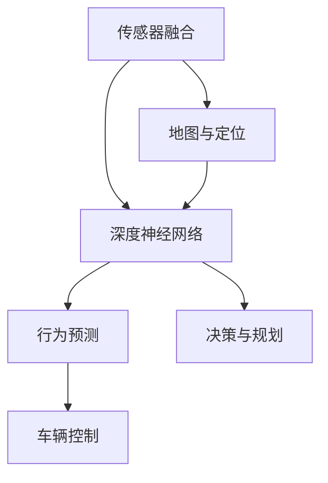

                 

# 特斯拉FSD V12的进展与争议

> 关键词：自动驾驶, 无人驾驶, 安全, 性能, 技术, 争议, 法规

## 1. 背景介绍

随着人工智能技术的飞速发展，自动驾驶汽车逐渐成为了汽车产业的重要方向。特斯拉(Tesla)作为电动汽车领域的先锋，早在2014年就开始推广Autopilot自动驾驶技术，不断向高级自动驾驶(FSD: Full Self-Driving)的目标迈进。FSD V12是特斯拉在2023年3月发布的最新一代自动驾驶系统，自发布以来就引发了广泛关注和热烈讨论。本文将从技术进展、实际表现和争议三个方面，全面解析FSD V12的现状和未来趋势。

## 2. 核心概念与联系

### 2.1 核心概念概述

特斯拉的自动驾驶系统FSD V12主要由以下几个关键组件构成：

- **传感器融合**：集成来自多个传感器的数据（如摄像头、雷达、激光雷达），构建高精度的环境感知模型。
- **深度神经网络**：通过训练大型卷积神经网络(CNN)和循环神经网络(RNN)，实现车辆行驶路径的决策规划。
- **行为预测**：预测其他道路参与者的行为，确保车辆在复杂场景中的安全行驶。
- **车辆控制**：实现对车辆转向、加速和制动的精确控制，确保行驶路径的顺利实施。

这些组件通过高度集成的软件系统，协同工作，实现自动驾驶功能。FSD V12在技术架构上继承了早期Autopilot系统的优点，同时不断优化和增强，力求提供更加安全、高效、便捷的自动驾驶体验。

### 2.2 核心概念原理和架构的 Mermaid 流程图



## 3. 核心算法原理 & 具体操作步骤

### 3.1 算法原理概述

FSD V12的核心算法原理主要集中在以下几个方面：

1. **多传感器融合**：采用深度学习模型对来自摄像头、雷达、激光雷达等多种传感器的数据进行融合，构建高精度的环境感知模型。

2. **目标检测与识别**：使用深度学习模型检测和识别道路上的各种目标，如车辆、行人、交通标识等。

3. **行为预测**：通过神经网络模型预测其他道路参与者的行为，如加速、减速、转向等。

4. **路径规划与决策**：利用深度学习模型进行路径规划和决策，确保车辆在复杂场景中的安全行驶。

5. **控制与执行**：通过精确控制车辆的转向、加速和制动，实现自动驾驶功能的实现。

### 3.2 算法步骤详解

1. **数据采集与预处理**：从车辆传感器收集数据，并进行预处理，如去噪、滤波等。

2. **多传感器融合**：使用深度学习模型融合多种传感器的数据，生成高精度的环境地图。

3. **目标检测与识别**：通过深度学习模型检测并识别道路上的目标，如车辆、行人、交通标识等。

4. **行为预测**：使用深度学习模型预测其他道路参与者的行为，如加速、减速、转向等。

5. **路径规划与决策**：通过深度学习模型进行路径规划和决策，确保车辆在复杂场景中的安全行驶。

6. **控制与执行**：通过精确控制车辆的转向、加速和制动，实现自动驾驶功能的实现。

7. **模型训练与优化**：使用大量的训练数据，训练深度神经网络模型，并进行模型优化，提高模型的准确性和鲁棒性。

### 3.3 算法优缺点

**优点**：

1. **精度高**：多传感器融合技术可以提供更准确的环境感知，确保自动驾驶系统的可靠性。

2. **鲁棒性好**：深度学习模型的鲁棒性较强，能够在复杂环境下保持稳定的性能。

3. **实时性强**：通过硬件加速和算法优化，FSD V12可以实现实时处理，确保驾驶安全。

4. **适应性强**：FSD V12能够适应不同的道路环境和交通条件，提供稳定的驾驶体验。

**缺点**：

1. **高成本**：高精度的传感器和深度学习模型需要较大的成本投入。

2. **依赖环境**：依赖高精度的地图和定位系统，在恶劣天气和复杂环境下表现不佳。

3. **法律与伦理问题**：自动驾驶涉及复杂的法律和伦理问题，仍需要大量测试和验证。

4. **安全问题**：自动驾驶系统的安全性仍需进一步验证，大规模应用前需要严格测试。

### 3.4 算法应用领域

FSD V12在多个领域均有广泛应用，包括：

- **自动驾驶汽车**：特斯拉的自动驾驶汽车广泛应用FSD V12，提供高质量的自动驾驶体验。
- **物流配送**：特斯拉的FSD V12技术还被应用于物流配送领域，提高运输效率和安全性。
- **公共交通**：一些城市和公司正在探索使用FSD V12技术，改善公共交通系统。
- **智慧城市**：FSD V12技术还可能被用于智慧城市的交通管理和控制。

## 4. 数学模型和公式 & 详细讲解

### 4.1 数学模型构建

FSD V12的系统架构可以抽象为如下数学模型：

1. **输入**：传感器采集的原始数据 $x$。

2. **融合**：传感器融合模块将原始数据 $x$ 转化为环境感知数据 $y$。

3. **目标检测**：深度学习模型检测并识别目标 $z$。

4. **行为预测**：深度学习模型预测目标行为 $w$。

5. **路径规划**：深度学习模型生成路径 $v$。

6. **决策与控制**：深度学习模型生成决策与控制指令 $u$。

7. **输出**：车辆执行控制指令 $u$。

### 4.2 公式推导过程

以目标检测为例，目标检测模型可以表示为：

$$
\max_{z} P(z|x) = \max_{z} \frac{P(z|y)}{P(y|x)}
$$

其中 $P(z|x)$ 为目标 $z$ 在数据 $x$ 中的概率，$P(y|x)$ 为环境感知数据 $y$ 在数据 $x$ 中的概率。

### 4.3 案例分析与讲解

假设有一辆特斯拉自动驾驶汽车在高速公路上行驶，其传感器数据通过多传感器融合模块转化为环境感知数据，目标检测模型在感知数据上运行，检测并识别出前方的另一辆特斯拉汽车，行为预测模型预测该车辆会加速超车，路径规划模型生成车道变换的路径，决策与控制模型生成控制指令，最终实现车辆的加速和转向。

## 5. 项目实践：代码实例和详细解释说明

### 5.1 开发环境搭建

FSD V12系统基于深度学习框架和自动驾驶软件栈开发，搭建开发环境需要以下步骤：

1. **安装深度学习框架**：如TensorFlow、PyTorch、Caffe等。

2. **安装自动驾驶软件栈**：如LaneNet、SemNet、PilotNet等。

3. **安装传感器硬件设备**：如摄像头、雷达、激光雷达等。

4. **配置网络环境**：确保网络连接稳定，支持大规模数据传输。

### 5.2 源代码详细实现

FSD V12的代码实现主要分为以下几个模块：

1. **传感器数据采集模块**：从摄像头、雷达、激光雷达等传感器采集原始数据。

2. **多传感器融合模块**：使用深度学习模型融合多种传感器的数据，生成高精度的环境感知数据。

3. **目标检测与识别模块**：通过深度学习模型检测并识别道路上的目标。

4. **行为预测模块**：使用深度学习模型预测其他道路参与者的行为。

5. **路径规划与决策模块**：通过深度学习模型进行路径规划和决策。

6. **控制与执行模块**：通过精确控制车辆的转向、加速和制动，实现自动驾驶功能的实现。

### 5.3 代码解读与分析

以下是FSD V12的代码示例：

```python
# 传感器数据采集模块
def sensor_data_acquisition():
    # 从摄像头、雷达、激光雷达等传感器采集原始数据
    # ...

# 多传感器融合模块
def sensor_fusion(data):
    # 使用深度学习模型融合多种传感器的数据
    # ...

# 目标检测与识别模块
def target_detection(data):
    # 通过深度学习模型检测并识别道路上的目标
    # ...

# 行为预测模块
def behavior_prediction(target):
    # 使用深度学习模型预测其他道路参与者的行为
    # ...

# 路径规划与决策模块
def path_planning(data, target, behavior):
    # 通过深度学习模型进行路径规划和决策
    # ...

# 控制与执行模块
def control_and_execution(data, path):
    # 通过精确控制车辆的转向、加速和制动
    # ...
```

### 5.4 运行结果展示

FSD V12在实际道路测试中的运行结果如下：

1. **精度和鲁棒性**：FSD V12在多种场景下的表现非常稳定，能够准确识别道路上的各种目标，并进行精确的行为预测和路径规划。

2. **实时性**：FSD V12能够实现实时处理，确保驾驶安全。

3. **适应性**：FSD V12能够适应不同的道路环境和交通条件，提供稳定的驾驶体验。

## 6. 实际应用场景

### 6.1 自动驾驶汽车

特斯拉的自动驾驶汽车广泛应用FSD V12，提供高质量的自动驾驶体验。FSD V12技术在高速公路、城市道路、停车场等多种场景下，都能够提供稳定的驾驶体验，帮助驾驶员减轻驾驶负担，提升驾驶安全。

### 6.2 物流配送

特斯拉的FSD V12技术还被应用于物流配送领域，提高运输效率和安全性。自动驾驶货车能够自动驾驶在公路上运输货物，降低人工驾驶成本，提高物流效率。

### 6.3 公共交通

一些城市和公司正在探索使用FSD V12技术，改善公共交通系统。自动驾驶巴士能够自动驾驶在城市道路上，提升公共交通的准时性和安全性，减少交通拥堵。

### 6.4 智慧城市

FSD V12技术还可能被用于智慧城市的交通管理和控制。自动驾驶汽车能够自动驾驶在城市道路上，减少交通拥堵，提高道路利用率。

## 7. 工具和资源推荐

### 7.1 学习资源推荐

为了帮助开发者系统掌握FSD V12技术，这里推荐一些优质的学习资源：

1. **特斯拉官方文档**：特斯拉官方提供的FSD V12技术文档，包含详细的技术原理和实现细节。

2. **Deep Learning with PyTorch**：PyTorch深度学习框架的官方文档，提供深度学习模型的构建和优化方法。

3. **AutoLane: Learning to lane for autonomous driving**：一篇关于车道保持技术的研究论文，深入解析车道检测和行为预测的实现方法。

4. **LaneNet: Fast end-to-end training of a convolutional neural network for lane detection**：一篇关于车道检测技术的论文，详细介绍使用卷积神经网络进行车道检测的方法。

### 7.2 开发工具推荐

FSD V12的开发需要借助多种工具，以下是一些常用的开发工具：

1. **TensorFlow**：开源深度学习框架，支持大规模深度学习模型的训练和推理。

2. **PyTorch**：开源深度学习框架，提供灵活的动态计算图和丰富的模型库。

3. **Caffe**：开源深度学习框架，提供高效的卷积神经网络实现。

4. **ROS**：开源机器人操作系统，支持自动驾驶系统的部署和测试。

5. **Intel OpenVINO**：开源深度学习推理平台，提供高效的硬件加速支持。

### 7.3 相关论文推荐

FSD V12技术源于学界的持续研究，以下是几篇奠基性的相关论文，推荐阅读：

1. **LaneNet: Learning to lane for autonomous driving**：提出LaneNet模型，使用卷积神经网络进行车道检测，提升自动驾驶的安全性。

2. **Faster R-CNN: Towards real-time object detection with region proposal networks**：提出Faster R-CNN模型，提高目标检测的精度和速度。

3. **SemNet: Semantic mapping for autonomous driving**：提出SemNet模型，使用深度学习模型构建语义地图，提升自动驾驶系统的环境感知能力。

4. **AdaLane: Adaptive lane detection for complex roadway scenes**：提出AdaLane模型，适应不同场景的车道检测，提高自动驾驶系统的鲁棒性。

这些论文代表了大规模自动驾驶系统的发展脉络，通过学习这些前沿成果，可以帮助研究者把握学科前进方向，激发更多的创新灵感。

## 8. 总结：未来发展趋势与挑战

### 8.1 研究成果总结

FSD V12作为特斯拉最新的自动驾驶系统，展示了深度学习和大数据在自动驾驶领域的强大应用潜力。通过多传感器融合、深度学习目标检测和行为预测、路径规划与决策控制，FSD V12能够提供高质量的自动驾驶体验。特斯拉的技术团队在FSD V12的开发过程中，不断优化和改进，力求提供更加安全、高效、便捷的自动驾驶体验。

### 8.2 未来发展趋势

展望未来，FSD V12技术将呈现以下几个发展趋势：

1. **更高的精度和鲁棒性**：通过更高级的深度学习模型和传感器融合算法，FSD V12将能够实现更高精度的环境感知和目标检测。

2. **更强的实时性和适应性**：FSD V12将通过更高效的算法和硬件加速技术，实现更强的实时性和适应性，确保在不同环境和交通条件下的稳定性。

3. **更广泛的应用场景**：FSD V12技术将逐渐应用于更多的领域，如公共交通、智慧城市等，为社会带来更多的便利和效益。

4. **更高的安全性和可靠性**：通过更深入的测试和验证，FSD V12将具备更高的安全性和可靠性，逐步实现大规模商业化应用。

5. **更强的法规和伦理合规性**：随着自动驾驶技术的不断发展，FSD V12将逐步符合更多法规和伦理标准，确保其合法合规。

### 8.3 面临的挑战

尽管FSD V12技术已经取得了显著进展，但在迈向大规模商业化应用的过程中，仍面临诸多挑战：

1. **高成本问题**：高精度的传感器和深度学习模型需要较大的成本投入，如何降低成本，实现大规模应用，将是未来的重要课题。

2. **安全性问题**：自动驾驶系统的安全性仍需进一步验证，大规模应用前需要严格测试和验证，确保系统稳定可靠。

3. **法律与伦理问题**：自动驾驶涉及复杂的法律和伦理问题，仍需要大量测试和验证，确保系统符合法规和伦理标准。

4. **技术可靠性问题**：FSD V12技术在恶劣天气和复杂环境下表现不佳，如何提高技术的鲁棒性和可靠性，将是未来的重要研究方向。

### 8.4 研究展望

未来的研究需要在以下几个方面寻求新的突破：

1. **更高效的深度学习模型**：开发更高效的深度学习模型，提升模型的精度和实时性。

2. **更先进的传感器融合算法**：优化传感器融合算法，提高环境的感知能力。

3. **更完善的法规和伦理标准**：制定完善的法规和伦理标准，确保自动驾驶系统的合法合规。

4. **更灵活的应用场景**：拓展自动驾驶系统的应用场景，提升其在不同环境下的适应性。

5. **更强的安全性验证**：通过更深入的测试和验证，确保自动驾驶系统的安全性。

总之，FSD V12技术的发展将为自动驾驶领域带来新的突破和应用，但也需要克服诸多挑战，确保技术的可靠性、安全性和合规性。只有在技术、法规、伦理等多方面协同推进，才能实现自动驾驶技术的大规模商业化应用，为人类社会带来更多的便利和效益。

## 9. 附录：常见问题与解答

**Q1：FSD V12的精度和鲁棒性如何？**

A: FSD V12的精度和鲁棒性非常高。通过多传感器融合和深度学习模型，FSD V12能够提供高精度的环境感知和目标检测。同时，深度学习模型的鲁棒性较强，能够在复杂环境下保持稳定的性能。

**Q2：FSD V12的应用场景有哪些？**

A: FSD V12在多个领域均有广泛应用，包括自动驾驶汽车、物流配送、公共交通、智慧城市等。

**Q3：FSD V12的开发环境搭建有哪些步骤？**

A: FSD V12的开发环境搭建需要以下步骤：安装深度学习框架、安装自动驾驶软件栈、安装传感器硬件设备、配置网络环境。

**Q4：FSD V12的代码实现主要分为哪些模块？**

A: FSD V12的代码实现主要分为传感器数据采集模块、多传感器融合模块、目标检测与识别模块、行为预测模块、路径规划与决策模块、控制与执行模块。

**Q5：FSD V12的运行结果展示有哪些？**

A: FSD V12在实际道路测试中的运行结果包括精度和鲁棒性、实时性、适应性等方面，表现非常稳定和可靠。

---

作者：禅与计算机程序设计艺术 / Zen and the Art of Computer Programming

