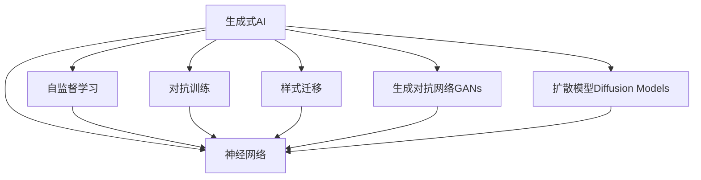

                 

# 生成式AI的未来市场趋势

## 1. 背景介绍

生成式人工智能（Generative AI）是指能够生成具有真实、创造性、多样性特征的AI模型。与传统的判别式AI（Discriminative AI）模型仅能对已知数据进行分类、预测等任务不同，生成式AI能够生成全新的数据，如文本、图像、音频等，为艺术创作、内容生成、游戏开发、自然语言处理等领域带来了革命性的变革。

当前，生成式AI技术已经从研究领域逐步走向应用，渗透到多个行业，包括娱乐、媒体、营销、设计、教育等。据统计，2023年全球生成式AI市场规模预计达到6亿美元，未来几年有望以50%的年复合增长率增长。随着技术的不断成熟和应用场景的扩展，生成式AI将带来哪些市场趋势？本文将从技术发展、行业应用、商业模式等多个维度展开分析。

## 2. 核心概念与联系

### 2.1 核心概念概述

在深入分析生成式AI的市场趋势之前，我们需要先了解其核心概念和联系：

- **生成式AI（Generative AI）**：指能够生成新数据的AI模型，如文本生成、图像生成、音频生成等。
- **神经网络（Neural Networks）**：生成式AI的核心技术之一，通过大量参数和层级结构模拟人脑神经元之间的连接关系，实现数据的生成和转换。
- **自监督学习（Self-Supervised Learning）**：一种无需人工标注数据的机器学习范式，生成式AI常采用自监督学习方法进行预训练，以获得更好的生成性能。
- **对抗训练（Adversarial Training）**：通过引入对抗样本，提高生成模型的鲁棒性和泛化能力。
- **样式迁移（Style Transfer）**：将一种风格的图像特征迁移到另一种风格的图像上，生成新的图像内容。
- **生成对抗网络（GANs）**：一种生成式模型，通过竞争博弈训练生成器和判别器，提高生成数据的质量和多样性。
- **扩散模型（Diffusion Models）**：基于物理过程进行图像生成的一种方法，具有较高的时间和空间复杂度，但生成图像质量优异。

这些核心概念之间相互联系，共同构成了生成式AI技术的核心框架。

### 2.2 核心概念原理和架构的 Mermaid 流程图



## 3. 核心算法原理 & 具体操作步骤

### 3.1 算法原理概述

生成式AI的算法原理主要基于神经网络和深度学习技术。其核心目标是学习数据生成过程的潜在分布，然后通过采样或条件生成过程，生成新的数据。常用的算法包括生成对抗网络（GANs）、变分自编码器（VAEs）、扩散模型等。这些算法的基本思路是通过优化损失函数，最大化生成数据的真实性和多样性。

生成式AI的具体操作包括：
- 数据预处理：对原始数据进行清洗、归一化、分块等处理。
- 模型构建：设计适合生成任务的神经网络结构，并选择合适的损失函数和优化器。
- 模型训练：在大量数据上进行预训练，调整模型参数以优化生成性能。
- 数据生成：根据训练好的模型，生成高质量的新数据。

### 3.2 算法步骤详解

以下以生成对抗网络（GANs）为例，详细讲解生成式AI的算法步骤：

**Step 1: 准备数据和模型**
- 收集和准备用于生成式训练的数据集，如文本、图像、音频等。
- 设计生成器（Generator）和判别器（Discriminator）的结构，如全连接网络、卷积神经网络等。

**Step 2: 定义损失函数**
- 生成器损失函数：鼓励生成器生成真实数据，最小化生成数据与真实数据之间的差距。
- 判别器损失函数：鼓励判别器区分真实数据和生成数据，最大化判别真实数据和生成数据的能力。
- 联合损失函数：将生成器损失和判别器损失组合起来，共同优化生成器和判别器的性能。

**Step 3: 优化参数**
- 使用优化算法（如Adam、SGD等）对生成器和判别器的参数进行更新。
- 在每个训练周期中，交替更新生成器和判别器的参数。

**Step 4: 生成新数据**
- 在训练完成后，使用生成器生成新的数据。
- 通过微调生成器或加入额外技术（如样式迁移、扩散模型等），进一步提升生成数据的质量和多样性。

### 3.3 算法优缺点

生成式AI的优点包括：
- 能够生成高质量、多样化的新数据。
- 应用于多个领域，如内容创作、图像生成、自然语言处理等。
- 能够提升自动化和智能化水平。

同时，生成式AI也存在一些缺点：
- 生成数据的质量不稳定，容易过拟合。
- 训练和生成数据的过程耗时较长，资源消耗较大。
- 生成的数据可能包含虚假信息，需要谨慎使用。

### 3.4 算法应用领域

生成式AI已经在多个领域得到了广泛应用：

- **内容创作**：自动生成文章、音乐、视频等创意内容。
- **图像生成**：生成逼真的人脸、风景、物品等图像。
- **自然语言处理**：自动生成对话、翻译、摘要等文本。
- **游戏开发**：生成逼真的虚拟角色和场景。
- **广告营销**：自动生成广告文案和视觉素材。
- **教育培训**：自动生成练习题、模拟测试等教学材料。
- **艺术创作**：生成新颖的绘画、雕塑、摄影作品。

## 4. 数学模型和公式 & 详细讲解 & 举例说明

### 4.1 数学模型构建

生成式AI的数学模型通常基于概率分布，旨在学习数据生成过程的潜在分布。以图像生成为例，一个简单的数学模型为：

$$
p(x|z) = \mathcal{N}(z, \Sigma)
$$

其中，$x$表示图像，$z$表示潜在变量，$\Sigma$表示协方差矩阵。在训练过程中，生成器尝试生成接近真实图像分布的伪造图像。

### 4.2 公式推导过程

以GANs为例，推导生成器和判别器的损失函数：

**生成器损失函数**：

$$
L_G = \mathbb{E}_{z \sim p(z)} [D(G(z))]
$$

其中，$z$是潜在变量，$G(z)$是生成器输出的图像，$D(G(z))$是判别器对生成图像的判别结果。

**判别器损失函数**：

$$
L_D = \mathbb{E}_{x \sim p(x)} [D(x)] + \mathbb{E}_{z \sim p(z)} [1 - D(G(z))]
$$

其中，$x$是真实图像，$D(x)$是判别器对真实图像的判别结果，$D(G(z))$是判别器对生成图像的判别结果。

**联合损失函数**：

$$
L = \frac{1}{2}L_D + \frac{1}{2}L_G
$$

### 4.3 案例分析与讲解

以下以图像生成为例，详细分析GANs的生成过程：

1. **生成器（Generator）**：输入潜在变量$z$，通过多层神经网络生成伪造图像$x_G$。
2. **判别器（Discriminator）**：输入图像$x$，通过多层神经网络判断是否为真实图像$x_R$。
3. **联合训练**：交替训练生成器和判别器，生成器生成逼真图像，判别器准确判断。

## 5. 项目实践：代码实例和详细解释说明

### 5.1 开发环境搭建

进行生成式AI项目开发，需要以下开发环境：

1. 安装Python 3.x及以上版本。
2. 安装TensorFlow、PyTorch等深度学习框架。
3. 安装OpenAI Gym等环境模拟工具。
4. 准备数据集和预处理工具。
5. 配置GPU或TPU硬件资源。

### 5.2 源代码详细实现

以下以GANs为例，详细展示生成式AI的代码实现：

```python
import tensorflow as tf
from tensorflow.keras import layers

class Generator(tf.keras.Model):
    def __init__(self):
        super(Generator, self).__init__()
        self.dense1 = layers.Dense(256, use_bias=False)
        self.dense2 = layers.Dense(256, use_bias=False)
        self.dense3 = layers.Dense(784, activation='tanh', use_bias=False)
    
    def call(self, inputs):
        x = self.dense1(inputs)
        x = layers.LeakyReLU(0.2)(x)
        x = self.dense2(x)
        x = layers.LeakyReLU(0.2)(x)
        x = self.dense3(x)
        return x

class Discriminator(tf.keras.Model):
    def __init__(self):
        super(Discriminator, self).__init__()
        self.dense1 = layers.Dense(256, use_bias=False)
        self.dense2 = layers.Dense(256, use_bias=False)
        self.dense3 = layers.Dense(1, activation='sigmoid', use_bias=False)
    
    def call(self, inputs):
        x = self.dense1(inputs)
        x = layers.LeakyReLU(0.2)(x)
        x = self.dense2(x)
        x = layers.LeakyReLU(0.2)(x)
        x = self.dense3(x)
        return x

# 定义损失函数
cross_entropy = tf.keras.losses.BinaryCrossentropy(from_logits=True)

# 定义生成器和判别器
generator = Generator()
discriminator = Discriminator()

# 定义联合损失函数
def combined_loss(fake_output, real_output):
    g_loss = cross_entropy(tf.ones_like(fake_output), discriminator(fake_output))
    d_loss = cross_entropy(tf.zeros_like(real_output), discriminator(real_output)) + cross_entropy(tf.ones_like(fake_output), discriminator(fake_output))
    return g_loss, d_loss

# 定义优化器
optimizer_G = tf.keras.optimizers.Adam(learning_rate=0.0002, beta_1=0.5)
optimizer_D = tf.keras.optimizers.Adam(learning_rate=0.0002, beta_1=0.5)

# 训练生成器和判别器
@tf.function
def train_step(images):
    noise = tf.random.normal([BATCH_SIZE, latent_dim])
    with tf.GradientTape() as gen_tape, tf.GradientTape() as disc_tape:
        generated_images = generator(noise, training=True)
        real_output = discriminator(images, training=True)
        fake_output = discriminator(generated_images, training=True)
        gen_loss, disc_loss = combined_loss(fake_output, real_output)
    gradients_of_G = gen_tape.gradient(gen_loss, generator.trainable_variables)
    gradients_of_D = disc_tape.gradient(disc_loss, discriminator.trainable_variables)
    optimizer_G.apply_gradients(zip(gradients_of_G, generator.trainable_variables))
    optimizer_D.apply_gradients(zip(gradients_of_D, discriminator.trainable_variables))
```

### 5.3 代码解读与分析

上述代码实现了GANs的生成和判别过程，并定义了联合损失函数和优化器。通过交替训练生成器和判别器，模型逐渐生成逼真的图像。

1. **生成器（Generator）**：将随机噪声转换为图像。
2. **判别器（Discriminator）**：判断图像是否为真实图像。
3. **联合损失函数**：将生成器和判别器的损失函数组合起来。
4. **优化器**：使用Adam优化算法，交替更新生成器和判别器的参数。

### 5.4 运行结果展示

训练完成后，可以通过以下代码生成新的图像：

```python
@tf.function
def generate_images(n):
    noise = tf.random.normal([n, latent_dim])
    generated_images = generator(noise, training=False)
    return generated_images
```

生成图像后，可以使用以下代码保存和展示：

```python
from matplotlib import pyplot as plt
import numpy as np

def save_images(images, save_path):
    images = (images + 1) / 2
    image = np.concatenate(images, axis=1)
    plt.figure(figsize=(8, 8))
    for i in range(image.shape[0]):
        plt.subplot(8, 8, i+1)
        plt.imshow(image[i, :, :, 0], cmap='gray')
        plt.axis('off')
    plt.savefig(save_path)
```

## 6. 实际应用场景

### 6.1 智能内容生成

生成式AI可以自动生成高质量的文章、音乐、视频等内容，大幅提高内容创作的效率和创新性。例如，自动写作助手可以根据用户输入的关键词，生成文章草稿、新闻稿件等；音乐生成系统可以根据用户偏好，生成独特的音乐作品；视频生成器可以自动生成短片、广告等内容。

### 6.2 娱乐与媒体

生成式AI在娱乐与媒体领域也有广泛应用。例如，游戏开发中的虚拟角色生成、虚拟场景设计；影视制作中的特效生成、自动剪辑；音乐创作中的声音合成、自动编曲。这些技术为娱乐和媒体产业带来了全新的创意和体验。

### 6.3 广告营销

生成式AI可以自动生成广告文案和视觉素材，提高广告创意和制作的效率。例如，自动生成广告文案、广告图像、视频广告等；还可以根据用户反馈自动调整广告内容，提升广告效果。

### 6.4 教育培训

生成式AI可以生成练习题、模拟测试、虚拟实验室等教学材料，提升教育培训的效率和效果。例如，自动生成数学题、编程题、物理实验等；还可以生成虚拟教师，进行个性化辅导和答疑。

### 6.5 艺术创作

生成式AI可以生成新颖的绘画、雕塑、摄影作品，提升艺术创作的效率和多样性。例如，自动生成绘画、雕塑、摄影作品；还可以生成虚拟艺术展览、虚拟展览馆等。

## 7. 工具和资源推荐

### 7.1 学习资源推荐

- **《深度学习与生成式模型》**：由斯坦福大学教授Ian Goodfellow所著，系统讲解生成式AI的基本原理和应用。
- **《GANs for the Impatient》**：由Ganesh Padmanabhan所著，深入浅出地介绍GANs的理论和实现。
- **Coursera《深度学习专项课程》**：由Coursera提供，涵盖深度学习的基础和生成式AI的前沿技术。
- **Google Colab**：免费提供GPU/TPU资源，方便实验学习和分享。

### 7.2 开发工具推荐

- **TensorFlow**：由Google开发，功能强大的深度学习框架，支持GPU/TPU加速。
- **PyTorch**：由Facebook开发，灵活高效的深度学习框架，适合研究和实验。
- **Jupyter Notebook**：交互式编程工具，方便代码调试和分享。
- **Weights & Biases**：模型训练的实验跟踪工具，记录和可视化模型训练过程。

### 7.3 相关论文推荐

- **Image-to-Image Translation with Conditional Adversarial Networks**：由Isola等人提出，使用条件GANs实现图像翻译。
- **Progressive Growing of GANs for Improved Quality, Stability, and Variation**：由Karras等人提出，改进GANs的训练方法，提升生成质量。
- **Cascaded Denoising Autoencoder for Image Recovery**：由Makhzani等人提出，使用级联去噪自编码器进行图像恢复。
- **Pix2PixHD**：由Isola等人提出，使用全卷积网络进行高分辨率图像生成。
- **CycleGAN for Real-Time Face Swap**：由Yang等人提出，使用CycleGAN进行实时人脸交换。

## 8. 总结：未来发展趋势与挑战

### 8.1 研究成果总结

生成式AI在多个领域已经取得了显著进展，但仍存在一些挑战：
- 生成数据的质量和多样性。
- 训练和生成的计算成本较高。
- 生成的数据可能包含虚假信息。
- 模型的可解释性和可控性有待提升。

### 8.2 未来发展趋势

未来，生成式AI的发展趋势包括：
- 更加高效的模型结构和训练方法。
- 跨领域、跨模态的生成技术。
- 更加多样和逼真的生成内容。
- 更加智能和可控的生成过程。
- 更加透明和可解释的生成模型。

### 8.3 面临的挑战

生成式AI面临的挑战包括：
- 数据质量和多样性的提升。
- 计算资源和时间的优化。
- 虚假信息和伦理道德的监管。
- 模型的可解释性和可控性。

### 8.4 研究展望

未来，生成式AI的研究方向包括：
- 引入更多先验知识，提升生成质量。
- 融合多模态数据，扩展应用场景。
- 改进训练方法，提高生成效率。
- 增强模型的可解释性和可控性。

## 9. 附录：常见问题与解答

**Q1：生成式AI如何保证生成的数据质量？**

A: 生成式AI通过优化损失函数、引入对抗训练、使用多样化的生成方法等方式，提高生成数据的质量和多样性。

**Q2：生成式AI的训练过程是否需要大量数据？**

A: 生成式AI的训练过程需要大量数据，尤其是在训练初期，数据量越大，生成的质量越好。

**Q3：生成式AI有哪些应用场景？**

A: 生成式AI应用于内容创作、娱乐媒体、广告营销、教育培训、艺术创作等多个领域。

**Q4：生成式AI的训练过程是否需要高计算资源？**

A: 生成式AI的训练过程需要高计算资源，特别是GANs等生成模型，训练过程耗时较长，资源消耗较大。

**Q5：生成式AI的生成过程是否容易过拟合？**

A: 生成式AI的生成过程容易过拟合，尤其是在训练数据较少的情况下。因此，需要在训练过程中引入正则化、数据增强等技术。

---

作者：禅与计算机程序设计艺术 / Zen and the Art of Computer Programming

