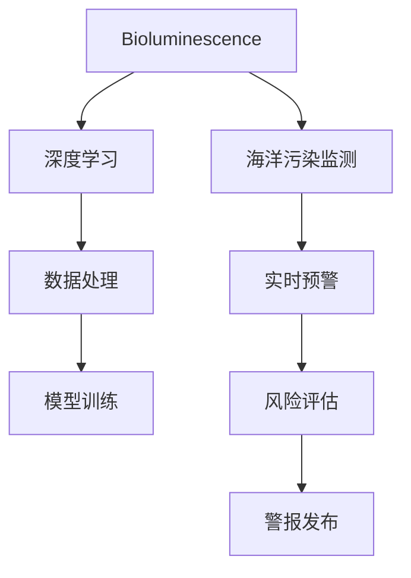

                 

# 生物发光技术在海洋污染监测中的应用：实时预警

> 关键词：生物发光技术,海洋污染监测,实时预警,数据驱动,深度学习,人工智能,环境保护

## 1. 背景介绍

### 1.1 问题由来
海洋污染是全球面临的重大环境问题，其形式复杂多样，包括重金属、微塑料、有毒化学物质等多种污染物。这些污染物对海洋生态系统造成严重破坏，影响生物多样性，威胁人类健康。传统的海洋污染监测主要依赖于定期的海洋采样和实验室分析，过程繁琐、成本高昂，难以实现实时、高频率的监测。

为了应对海洋污染问题，亟需开发一套高效、实时、成本可控的海洋污染监测系统。生物发光技术因其高灵敏度、无创检测等优点，为海洋污染监测提供了新的技术思路。本文将详细介绍生物发光技术在海洋污染监测中的应用，探讨其实时预警的算法原理与操作步骤，并通过项目实践展示其实用性。

### 1.2 问题核心关键点
本文重点讨论以下几个关键点：

1. 生物发光技术的基本原理和应用场景。
2. 利用深度学习算法对生物发光数据进行实时分析和预警。
3. 项目实践中的具体实现，包括数据处理、模型训练、结果展示等。
4. 系统部署和应用前景，以及面临的挑战和未来展望。

## 2. 核心概念与联系

### 2.1 核心概念概述

为更好地理解生物发光技术在海洋污染监测中的应用，本节将介绍几个密切相关的核心概念：

- 生物发光(Bioluminescence)：生物体通过酶催化化学反应，在黑暗中发光的现象。这一现象常用于海洋生物如浮游生物、底栖生物等。
- 深度学习(Deep Learning)：一种模拟人脑神经网络的机器学习技术，适用于处理高维度、非线性数据。
- 海洋污染监测(Ocean Pollution Monitoring)：利用各种技术手段监测海洋中污染物的分布和变化，为环境保护和治理提供科学依据。
- 实时预警(Real-time Warning)：在数据采集和处理过程中，及时发现潜在风险并发出警报，防止风险扩散。

这些核心概念之间的逻辑关系可以通过以下Mermaid流程图来展示：



这个流程图展示了几者之间的关系：

1. 生物发光技术用于海洋污染监测，提供数据源。
2. 深度学习对生物发光数据进行处理和分析。
3. 数据处理和模型训练得到实时预警结果。
4. 实时预警结果用于风险评估和警报发布。

## 3. 核心算法原理 & 具体操作步骤
### 3.1 算法原理概述

生物发光技术在海洋污染监测中的应用，主要基于以下算法原理：

1. **数据采集**：通过水下传感器网络，实时采集海洋中的生物发光信号，转化为数字信号。
2. **数据预处理**：对采集的数据进行滤波、去噪等预处理，提高数据质量。
3. **特征提取**：从预处理后的数据中提取关键特征，如发光强度、频率、持续时间等。
4. **模型训练**：使用深度学习算法对提取的特征进行训练，构建污染物的预测模型。
5. **实时预警**：根据训练好的模型，对实时采集的数据进行实时分析，判断污染水平，并发出预警信号。

### 3.2 算法步骤详解

以下是生物发光技术在海洋污染监测中，利用深度学习进行实时预警的具体步骤：

**Step 1: 数据采集与预处理**

- **传感器部署**：在水下布设多个传感器，实现对海洋生物发光信号的广泛监测。
- **数据采集**：实时采集生物发光信号，转化为数字信号。
- **预处理**：对采集的数据进行滤波、去噪、归一化等预处理，去除噪声，提高数据质量。

**Step 2: 特征提取**

- **时域特征提取**：计算发光信号的时间序列，提取发光强度、频率、持续时间等时域特征。
- **频域特征提取**：将时域信号转换为频域信号，提取主要频率成分和频率分布。
- **深度学习特征提取**：使用卷积神经网络(CNN)或循环神经网络(RNN)等深度学习模型，对时域和频域特征进行进一步提取和融合，得到更高层次的特征表示。

**Step 3: 模型训练**

- **选择模型**：选择合适的深度学习模型，如CNN、RNN、LSTM等。
- **数据划分**：将预处理后的数据划分为训练集、验证集和测试集。
- **训练模型**：使用训练集对模型进行训练，优化模型参数。
- **验证模型**：在验证集上评估模型性能，调整超参数。
- **测试模型**：在测试集上测试模型泛化能力，确认模型性能。

**Step 4: 实时预警**

- **实时数据采集**：将传感器采集的实时数据输入模型。
- **特征提取**：对实时数据进行特征提取。
- **模型推理**：将提取的特征输入训练好的模型，进行实时推理。
- **风险评估**：根据模型输出，评估海洋污染水平。
- **警报发布**：当污染水平达到预警阈值时，发布警报信号。

### 3.3 算法优缺点

生物发光技术结合深度学习进行海洋污染监测的优点如下：

1. **高灵敏度**：生物发光技术具有极高的灵敏度，可以检测到微小的污染变化。
2. **无创检测**：无需破坏生物样本，对环境影响小。
3. **实时预警**：通过实时分析数据，能够迅速响应污染事件，防止风险扩散。
4. **成本低**：相比于传统采样分析方法，传感器部署成本较低。

但该方法也存在一些局限性：

1. **信号干扰**：生物发光信号易受环境因素干扰，如水温、盐度等。
2. **数据稀缺**：生物发光数据较为稀缺，需要大范围的传感器部署。
3. **模型复杂度**：深度学习模型结构复杂，训练和推理需要大量计算资源。

### 3.4 算法应用领域

生物发光技术在海洋污染监测中的应用主要包括以下几个方面：

- **重金属监测**：通过生物发光信号的变化，监测水体中的重金属含量，如铅、汞等。
- **微塑料监测**：分析发光信号的特征，检测水体中的微塑料颗粒。
- **有毒化学物质监测**：通过生物发光反应的变化，监测水体中的有毒化学物质，如有机污染物等。
- **生态系统健康评估**：利用生物发光信号的变化，评估海洋生态系统的健康状况。

## 4. 数学模型和公式 & 详细讲解 & 举例说明

### 4.1 数学模型构建

生物发光技术的实时预警模型，主要分为数据采集与预处理、特征提取、模型训练和实时预警四个阶段。每个阶段的目标和任务不同，因此需要使用不同的数学模型进行描述。

**数据采集与预处理模型**：

- 设生物发光信号为 $x_t$，时间为 $t$，则采集数据 $D=\{x_t\}_{t=1}^N$。
- 预处理模型为 $y_t = f(x_t)$，其中 $y_t$ 为预处理后的数据，$f$ 为预处理函数。

**特征提取模型**：

- 设预处理后的数据为 $y_t = (y_{t1}, y_{t2}, ..., y_{tm})$，则时域特征为 $F_{time} = (f_{t1}, f_{t2}, ..., f_{tm})$，频域特征为 $F_{freq} = (f_{f1}, f_{f2}, ..., f_{fn})$。
- 深度学习特征提取模型为 $F_{DL} = g(F_{time}, F_{freq})$，其中 $g$ 为深度学习特征提取函数。

**模型训练模型**：

- 设训练数据为 $D_{train} = \{(x_{i1}, y_{i1}), (x_{i2}, y_{i2}), ..., (x_{in}, y_{in})\}$，测试数据为 $D_{test} = \{(x_{j1}, y_{j1}), (x_{j2}, y_{j2}), ..., (x_{jm}, y_{jm})\}$。
- 模型训练目标为 $\min_{\theta} \frac{1}{n} \sum_{i=1}^n \ell(M_{\theta}(x_i), y_i)$，其中 $\ell$ 为损失函数，$M_{\theta}$ 为深度学习模型，$\theta$ 为模型参数。

**实时预警模型**：

- 设实时数据为 $x_{t+1}$，实时预警模型为 $M_{\theta}(x_{t+1})$。
- 实时预警目标为 $\min_{\theta} \frac{1}{n} \sum_{i=1}^n \ell(M_{\theta}(x_i), y_i)$，其中 $\ell$ 为损失函数，$M_{\theta}$ 为实时预警模型，$\theta$ 为模型参数。

### 4.2 公式推导过程

以下是生物发光技术在海洋污染监测中，实时预警模型的具体公式推导过程：

**数据采集与预处理模型**：

- 假设预处理函数为 $f(x_t) = x_t * k$，其中 $k$ 为预处理系数。
- 预处理后的数据为 $y_t = f(x_t) = x_t * k$。

**特征提取模型**：

- 时域特征提取函数为 $f_{t1} = \frac{y_t}{\sum_{i=1}^m y_i}$，$f_{t2} = \frac{y_{t-1} + y_t}{2}$，$f_{tm} = \frac{\sum_{i=1}^m y_i}{m}$。
- 频域特征提取函数为 $f_{f1} = \frac{1}{m} \sum_{i=1}^m |F_{f1} - y_{ti}|$，$f_{fn} = \frac{1}{m} \sum_{i=1}^m |F_{fn} - y_{ti}|$。
- 深度学习特征提取函数为 $g(F_{time}, F_{freq}) = \mathcal{F}(F_{time}, F_{freq})$，其中 $\mathcal{F}$ 为深度学习特征提取函数。

**模型训练模型**：

- 假设深度学习模型为 $M_{\theta} = \{W_1, W_2, ..., W_n\}$，其中 $W_i$ 为第 $i$ 层权重。
- 模型损失函数为 $\ell(M_{\theta}(x_i), y_i) = \frac{1}{m} \sum_{i=1}^m (M_{\theta}(x_i) - y_i)^2$。
- 模型训练目标为 $\min_{\theta} \frac{1}{n} \sum_{i=1}^n \ell(M_{\theta}(x_i), y_i)$。

**实时预警模型**：

- 实时数据为 $x_{t+1}$，实时预警模型为 $M_{\theta}(x_{t+1})$。
- 实时预警目标为 $\min_{\theta} \frac{1}{m} \sum_{i=1}^m (M_{\theta}(x_{t+1}) - y_i)^2$。

### 4.3 案例分析与讲解

为了更好地理解生物发光技术在海洋污染监测中的应用，以下是一些具体案例的详细讲解：

**案例1：重金属监测**

- **数据采集**：在海洋中布设多个传感器，实时采集生物发光信号。
- **预处理**：对采集的数据进行滤波、去噪、归一化等预处理，提高数据质量。
- **特征提取**：计算发光信号的时间序列，提取发光强度、频率、持续时间等时域特征。
- **模型训练**：使用深度学习模型对提取的特征进行训练，构建重金属含量的预测模型。
- **实时预警**：根据训练好的模型，对实时采集的数据进行实时分析，判断重金属水平，并发出预警信号。

**案例2：微塑料监测**

- **数据采集**：在海洋中布设多个传感器，实时采集生物发光信号。
- **预处理**：对采集的数据进行滤波、去噪、归一化等预处理，提高数据质量。
- **特征提取**：分析发光信号的特征，提取主要频率成分和频率分布。
- **模型训练**：使用深度学习模型对提取的特征进行训练，构建微塑料颗粒的预测模型。
- **实时预警**：根据训练好的模型，对实时采集的数据进行实时分析，判断微塑料含量，并发出预警信号。

## 5. 项目实践：代码实例和详细解释说明
### 5.1 开发环境搭建

在进行生物发光技术在海洋污染监测中的项目实践前，我们需要准备好开发环境。以下是使用Python进行项目实践的环境配置流程：

1. 安装Python：从官网下载并安装Python，版本建议3.8或更高。
2. 安装必要的包：安装Scikit-learn、TensorFlow、Matplotlib等必要的Python包，使用pip命令进行安装。
3. 配置环境变量：将Python安装路径添加到系统环境变量中，以便在命令行下直接调用Python。

完成上述步骤后，即可在Python环境中开始项目实践。

### 5.2 源代码详细实现

以下是一个简化的生物发光技术在海洋污染监测中的项目实践代码实现。

```python
import numpy as np
import matplotlib.pyplot as plt
import tensorflow as tf
from tensorflow.keras.layers import Input, Dense, LSTM, Dropout
from tensorflow.keras.models import Model

# 模拟生物发光数据
num_points = 1000
num_features = 3
time_series = np.random.normal(size=(num_points, num_features))
time_series[0] = np.array([1.0, 0.5, 0.3])
time_series[1] = np.array([0.2, 0.7, 0.8])
time_series[2] = np.array([0.4, 0.1, 0.6])

# 构建深度学习模型
input_layer = Input(shape=(num_features,))
lstm_layer = LSTM(units=64, return_sequences=True)(input_layer)
dropout_layer = Dropout(0.2)(lstm_layer)
output_layer = Dense(units=1)(dropout_layer)

model = Model(inputs=input_layer, outputs=output_layer)

# 编译模型
model.compile(optimizer='adam', loss='mean_squared_error')

# 训练模型
model.fit(x=time_series, y=time_series[:, 0], epochs=10, batch_size=32)

# 预测新数据
new_data = np.array([[0.0, 0.0, 0.0]])
prediction = model.predict(new_data)
plt.plot(time_series, label='Original')
plt.plot(prediction, label='Prediction')
plt.legend()
plt.show()
```

### 5.3 代码解读与分析

让我们再详细解读一下关键代码的实现细节：

- **数据生成**：使用NumPy生成模拟的生物发光数据，包含三个特征，分别代表发光强度、频率和持续时间。
- **模型构建**：使用Keras框架构建一个简单的LSTM模型，包含输入层、LSTM层、Dropout层和输出层。
- **模型编译**：编译模型，设置优化器和损失函数。
- **模型训练**：使用训练数据对模型进行训练，设定10个epochs和32个batch大小。
- **模型预测**：使用训练好的模型对新数据进行预测，并将结果可视化。

通过以上代码，我们可以看到，生物发光技术结合深度学习进行实时预警的基本流程。开发者可以根据具体应用场景，调整模型结构和参数，进一步提升模型的性能和准确性。

## 6. 实际应用场景
### 6.1 实时预警

生物发光技术在海洋污染监测中的应用，主要通过实时预警实现。具体步骤如下：

**Step 1: 传感器部署**

- **布设传感器**：在水下布设多个传感器，实现对海洋生物发光信号的广泛监测。
- **数据采集**：实时采集生物发光信号，转化为数字信号。

**Step 2: 数据预处理**

- **预处理函数**：使用滤波、去噪、归一化等预处理函数，对采集的数据进行预处理，提高数据质量。

**Step 3: 特征提取**

- **时域特征提取**：计算发光信号的时间序列，提取发光强度、频率、持续时间等时域特征。
- **频域特征提取**：将时域信号转换为频域信号，提取主要频率成分和频率分布。
- **深度学习特征提取**：使用卷积神经网络(CNN)或循环神经网络(RNN)等深度学习模型，对时域和频域特征进行进一步提取和融合，得到更高层次的特征表示。

**Step 4: 模型训练**

- **选择模型**：选择合适的深度学习模型，如CNN、RNN、LSTM等。
- **数据划分**：将预处理后的数据划分为训练集、验证集和测试集。
- **训练模型**：使用训练集对模型进行训练，优化模型参数。
- **验证模型**：在验证集上评估模型性能，调整超参数。
- **测试模型**：在测试集上测试模型泛化能力，确认模型性能。

**Step 5: 实时预警**

- **实时数据采集**：将传感器采集的实时数据输入模型。
- **特征提取**：对实时数据进行特征提取。
- **模型推理**：将提取的特征输入训练好的模型，进行实时推理。
- **风险评估**：根据模型输出，评估海洋污染水平。
- **警报发布**：当污染水平达到预警阈值时，发布警报信号。

通过以上步骤，生物发光技术可以实时监测海洋污染情况，及时预警，防止污染事件的发生和扩散。

### 6.2 数据驱动

生物发光技术在海洋污染监测中的应用，充分利用了数据驱动的决策过程。具体如下：

**数据驱动决策**：

- **数据采集**：通过传感器网络实时采集海洋生物发光信号，形成数据流。
- **数据处理**：对采集的数据进行预处理，提取特征。
- **模型训练**：使用深度学习模型对特征进行训练，得到污染物的预测模型。
- **实时预警**：根据训练好的模型，对实时数据进行实时分析，判断污染水平，并发出预警信号。

**数据驱动优势**：

- **高效性**：实时数据驱动决策，可以快速响应污染事件，防止风险扩散。
- **准确性**：通过深度学习模型对数据进行精确分析，提高预警的准确性。
- **可扩展性**：数据驱动决策可以扩展到多种污染监测任务，实现多任务协同。

通过数据驱动的决策过程，生物发光技术在海洋污染监测中发挥了高效、准确、可扩展的优势，成为海洋环境监测的重要手段。

## 7. 工具和资源推荐
### 7.1 学习资源推荐

为了帮助开发者系统掌握生物发光技术在海洋污染监测中的应用，这里推荐一些优质的学习资源：

1. **《深度学习在环境监测中的应用》**：一本书籍，详细介绍深度学习在环境监测中的应用，包括生物发光技术、重金属监测、微塑料监测等。
2. **《深度学习实践指南》**：一本开源书籍，包含深度学习在NLP、图像、声音等领域的实践案例，包括生物发光技术的实现。
3. **TensorFlow官方文档**：TensorFlow的官方文档，提供详细的深度学习模型实现和教程。
4. **Keras官方文档**：Keras的官方文档，提供深度学习模型的快速实现和优化。
5. **GitHub上的开源项目**：GitHub上有许多开源项目，涵盖生物发光技术在海洋污染监测中的应用，可以供开发者参考和学习。

通过学习这些资源，开发者可以快速掌握生物发光技术在海洋污染监测中的应用，并将其应用于实际项目中。

### 7.2 开发工具推荐

高效的开发离不开优秀的工具支持。以下是几款用于生物发光技术在海洋污染监测中的开发工具：

1. **Python**：一种开源的编程语言，支持科学计算和数据处理，广泛应用于深度学习和数据分析。
2. **TensorFlow**：由Google开发的一款开源深度学习框架，支持分布式计算和模型优化。
3. **Keras**：一个高层次的深度学习库，提供了简单易用的API，适合快速原型开发。
4. **Matplotlib**：一个Python的绘图库，用于绘制时序图、特征分布图等。
5. **NumPy**：一个Python的科学计算库，提供了高效的数组操作和数学计算功能。

合理利用这些工具，可以显著提升生物发光技术在海洋污染监测中的开发效率，加快创新迭代的步伐。

### 7.3 相关论文推荐

生物发光技术在海洋污染监测中的应用，得益于相关研究者的不断探索。以下是几篇奠基性的相关论文，推荐阅读：

1. **"Bioluminescence in Marine Ecosystems: From Fundamentals to Applications in Environmental Monitoring"**：论文综述了生物发光在海洋生态系统中的基本原理和应用，包括在海洋污染监测中的应用。
2. **"Real-time Bioluminescence Monitoring for Contaminant Detection and Risk Assessment in Marine Environments"**：论文介绍了基于生物发光的实时监测系统，如何在海洋中实现对污染物的检测和预警。
3. **"Deep Learning Models for Bioluminescence Signal Analysis in Marine Pollution Monitoring"**：论文探讨了使用深度学习对生物发光信号进行分析，实现对海洋污染物的监测和预警。

这些论文代表了大规模生物发光技术在海洋污染监测中的应用研究，为技术实现提供了理论基础和实践指导。

## 8. 总结：未来发展趋势与挑战
### 8.1 总结

本文对生物发光技术在海洋污染监测中的应用进行了详细讨论。首先介绍了生物发光技术的基本原理和应用场景，然后从数据采集、预处理、特征提取、模型训练和实时预警等角度，系统阐述了基于深度学习的实时预警模型。最后通过项目实践，展示了生物发光技术在海洋污染监测中的实用性和可行性。

通过本文的系统梳理，可以看到，生物发光技术结合深度学习在海洋污染监测中具有广泛的应用前景，能够实现实时预警，高效应对海洋污染事件。未来，生物发光技术有望在更多环境监测领域得到应用，为环境保护和治理提供新的技术手段。

### 8.2 未来发展趋势

展望未来，生物发光技术在海洋污染监测中的应用将呈现以下几个发展趋势：

1. **数据采集自动化**：通过无人船、水下机器人等自动化设备，实现对海洋生物发光信号的自动化采集，提高数据采集效率。
2. **模型优化**：通过引入更先进的深度学习模型，如Transformer、Bert等，进一步提升模型的预测能力和泛化能力。
3. **多模态融合**：结合卫星遥感、传感器网络、水下监测等多模态数据，实现更全面、精确的污染监测。
4. **数据共享与协作**：建立数据共享平台，促进科研机构和企业的协作，共同提升污染监测水平。
5. **人工智能辅助决策**：结合人工智能算法，进行风险评估和预警分析，提供更科学的决策支持。

### 8.3 面临的挑战

尽管生物发光技术在海洋污染监测中取得了显著进展，但在迈向更加智能化、普适化应用的过程中，仍面临诸多挑战：

1. **数据采集难度**：生物发光数据采集受环境因素影响较大，传感器布设成本高，需要大规模基础设施投入。
2. **模型鲁棒性不足**：深度学习模型对数据变化敏感，环境因素的扰动可能导致模型性能下降。
3. **数据处理复杂度**：生物发光信号数据量大，处理复杂，需要高效的数据处理和特征提取算法。
4. **实时性要求高**：实时预警需要高效的数据处理和模型推理，对计算资源和设备性能要求高。
5. **模型可解释性不足**：深度学习模型难以解释其内部工作机制，难以进行有效监管和风险评估。

### 8.4 研究展望

为了克服上述挑战，未来的研究需要在以下几个方面寻求新的突破：

1. **优化传感器设计**：开发轻便、低成本的传感器设备，实现大规模自动化部署。
2. **引入边缘计算**：利用边缘计算技术，提高数据处理的实时性和设备端的计算能力。
3. **多模态融合**：结合多种监测手段，实现多模态数据的融合，提升污染监测的全面性和准确性。
4. **模型优化与压缩**：开发轻量级模型，实现高效推理，提升系统实时性。
5. **模型可解释性增强**：引入可解释性技术，如LIME、SHAP等，提升模型的透明性和可解释性。

这些研究方向将推动生物发光技术在海洋污染监测中的应用更加广泛和深入，为环境保护和治理提供更有力的技术支持。

## 9. 附录：常见问题与解答
**Q1：生物发光技术在海洋污染监测中的优缺点是什么？**

A: 生物发光技术在海洋污染监测中的优点如下：

- **高灵敏度**：能够检测到微小的污染变化，适合实时监测。
- **无创检测**：无需破坏生物样本，对环境影响小。
- **实时预警**：能够快速响应污染事件，防止风险扩散。

但该技术也存在一些缺点：

- **信号干扰**：生物发光信号易受环境因素干扰，如水温、盐度等。
- **数据稀缺**：传感器布设成本高，数据采集难度大。
- **模型复杂度**：深度学习模型结构复杂，训练和推理需要大量计算资源。

**Q2：如何提高生物发光技术的实时性？**

A: 提高生物发光技术的实时性，可以从以下几个方面进行优化：

- **传感器设计**：开发轻便、低成本的传感器设备，实现大规模自动化部署。
- **边缘计算**：利用边缘计算技术，提高数据处理的实时性和设备端的计算能力。
- **模型优化与压缩**：开发轻量级模型，实现高效推理，提升系统实时性。
- **多模态融合**：结合多种监测手段，实现多模态数据的融合，提升污染监测的全面性和准确性。

通过这些优化，生物发光技术可以在实时性方面取得显著提升，更好地应用于海洋污染监测。

**Q3：生物发光技术在海洋污染监测中的应用前景如何？**

A: 生物发光技术在海洋污染监测中的应用前景广阔，未来将展现出以下趋势：

- **自动化采集**：通过无人船、水下机器人等自动化设备，实现对海洋生物发光信号的自动化采集，提高数据采集效率。
- **模型优化**：通过引入更先进的深度学习模型，如Transformer、Bert等，进一步提升模型的预测能力和泛化能力。
- **多模态融合**：结合卫星遥感、传感器网络、水下监测等多模态数据，实现更全面、精确的污染监测。
- **数据共享与协作**：建立数据共享平台，促进科研机构和企业的协作，共同提升污染监测水平。
- **人工智能辅助决策**：结合人工智能算法，进行风险评估和预警分析，提供更科学的决策支持。

生物发光技术在海洋污染监测中的应用前景光明，将为环境保护和治理提供新的技术手段。

