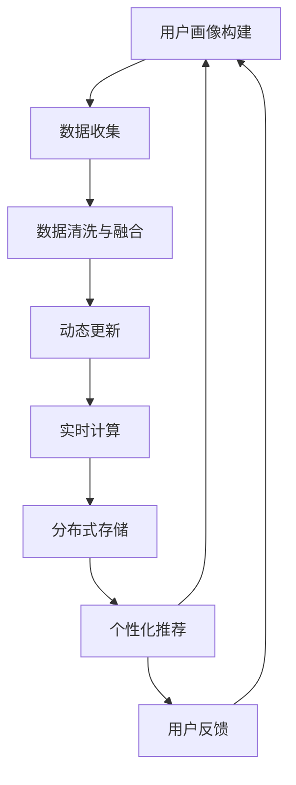

                 

# 用户画像的动态更新与优化

> 关键词：用户画像, 动态更新, 个性化推荐, 用户行为, 实时性, 优化算法, 预测模型

## 1. 背景介绍

### 1.1 问题由来

在互联网时代，用户画像已成为各大电商和社交平台的重要用户特征和应用基础。用户画像不仅能够提供用户的基本信息，如年龄、性别、地域、兴趣等，更可以深入挖掘用户的购买行为、消费习惯、偏好倾向等，帮助企业精准营销和个性化推荐。因此，建立准确高效的用户画像系统，具有极高的商业价值。

然而，用户行为特征随着时间不断变化，静止的用户画像难以满足业务需求。如何实时捕捉用户动态变化，更新并优化用户画像，成为当下亟待解决的问题。尤其在电商、社交、金融等高频互动领域，用户画像的实时性和准确性直接影响着用户体验和业务效果。

### 1.2 问题核心关键点

当前，用户画像的构建主要依赖于静态数据，用户行为数据的收集、存储、更新和融合等环节存在诸多瓶颈：

- 数据收集：用户行为数据来源广泛，包括浏览历史、购买记录、社交互动等。如何高效收集这些数据并实时更新，是用户画像动态更新的首要挑战。
- 数据存储：用户画像数据通常包含大量半结构化和非结构化数据，存储和管理这些数据需要高效率和高可靠性。
- 数据融合：用户画像的构建需要融合来自不同渠道的数据，且需要避免数据冗余和冲突。
- 实时更新：用户行为数据实时产生，如何保证用户画像的动态更新，并在极短的时间内产生准确结果，对技术要求极高。

这些问题不仅涉及数据技术，还涵盖系统架构、算法设计、实时计算等多个方面。本文将围绕用户画像的动态更新与优化这一核心问题，展开详细探讨。

## 2. 核心概念与联系

### 2.1 核心概念概述

为更好地理解用户画像的动态更新与优化，本节将介绍几个密切相关的核心概念：

- **用户画像**：利用用户历史行为数据，通过机器学习和数据挖掘技术，构建用户属性和行为的综合描述。
- **动态更新**：随着用户行为的不断变化，实时地更新用户画像，保证画像的准确性和时效性。
- **个性化推荐**：根据用户画像，推荐系统能够为用户匹配最符合其兴趣和需求的物品、服务或内容。
- **实时计算**：在数据实时产生的情况下，快速高效地计算和更新用户画像，以满足业务需求。
- **分布式存储**：利用分布式存储技术，高效地存储和检索海量用户画像数据。
- **流计算**：在数据流持续产生的情况下，实时计算和更新用户画像，保障系统的高可用性。

这些概念之间具有密切的联系，形成了一个有机整体。用户画像的动态更新与优化，需要通过高效的数据收集、实时计算和分布式存储，实现个性化推荐的实时化和精准化。

### 2.2 核心概念原理和架构的 Mermaid 流程图



该流程图展示了用户画像的构建流程，核心在于通过高效的数据收集、清洗与融合，动态更新用户画像，并通过实时计算和分布式存储，实现个性化推荐。

## 3. 核心算法原理 & 具体操作步骤
### 3.1 算法原理概述

用户画像的动态更新与优化，核心在于如何高效收集和融合用户行为数据，实时更新用户画像，并在极短时间内产生准确的推荐结果。本文将从数据采集、数据融合、实时计算和分布式存储等关键环节，介绍具体的算法原理和操作步骤。

### 3.2 算法步骤详解

#### 数据采集

用户画像的数据采集，主要通过以下几种方式：

- **API接口**：利用电商、社交等平台提供的API接口，获取用户的浏览历史、购买记录、互动信息等。
- **爬虫采集**：通过网络爬虫技术，自动获取互联网上的公开信息，如用户评论、社交动态等。
- **用户互动**：利用聊天机器人、问卷调查等形式，主动获取用户偏好和反馈信息。
- **第三方数据**：整合来自广告、社交媒体、公共数据库等第三方数据，丰富用户画像。

在数据采集过程中，需要注意以下几点：

- **隐私保护**：确保用户隐私信息的安全，避免数据泄露和滥用。
- **数据同步**：通过分布式消息队列，实现不同数据源的同步和更新。
- **数据去重**：去除重复和冗余数据，提高数据质量。

#### 数据清洗与融合

用户行为数据通常来自多个来源，格式和内容各异，需要进行清洗和融合。主要步骤如下：

- **数据预处理**：包括数据去噪、标准化、格式转换等预处理操作。
- **特征提取**：将原始数据转化为有意义的特征，如点击次数、购买金额、评分等。
- **数据融合**：将来自不同渠道的数据进行合并和补充，避免数据冗余和冲突。
- **特征工程**：通过统计分析、模型训练等手段，提取有价值的特征。

#### 动态更新

动态更新是用户画像的核心步骤，主要包括以下步骤：

- **实时数据流**：利用流计算技术，实时捕捉用户行为数据的变化。
- **增量更新**：对新数据进行增量更新，避免全量更新带来的性能问题。
- **一致性保证**：通过分布式一致性协议，确保所有节点上的用户画像数据一致。
- **缓存机制**：引入缓存机制，优化更新频率和系统响应速度。

#### 实时计算

实时计算是用户画像动态更新的关键，主要步骤包括：

- **实时计算框架**：利用实时计算框架（如Apache Storm、Flink），实现数据的实时处理和计算。
- **算法设计**：采用高效的算法（如随机梯度下降、K-means聚类），快速更新用户画像。
- **模型训练**：通过在线学习算法，不断更新和优化用户画像模型。
- **结果缓存**：对用户画像计算结果进行缓存，优化系统响应速度。

#### 分布式存储

分布式存储是用户画像数据的高效存储和管理的基础，主要步骤如下：

- **分布式文件系统**：利用分布式文件系统（如HDFS、Ceph），存储海量用户画像数据。
- **分布式数据库**：采用分布式数据库（如Hive、Spark SQL），实现数据的高效查询和检索。
- **数据分区**：对用户画像数据进行分区存储，提高数据的访问速度和一致性。
- **数据备份**：引入数据备份机制，保障数据的高可用性和安全性。

### 3.3 算法优缺点

用户画像的动态更新与优化，主要具有以下优点：

- **实时性**：实时捕捉用户行为变化，保证用户画像的时效性和准确性。
- **高效性**：采用高效的算法和分布式存储，确保系统的高性能和高可扩展性。
- **个性化推荐**：根据动态更新的用户画像，实现实时精准的个性化推荐。

同时，该方法也存在以下缺点：

- **数据依赖**：用户画像的构建依赖于大量的行为数据，数据收集难度大。
- **算法复杂**：需要设计高效的算法，进行复杂的数据融合和实时计算。
- **资源消耗**：需要大量计算和存储资源，对硬件要求较高。

### 3.4 算法应用领域

用户画像的动态更新与优化技术，在多个领域得到了广泛应用，如：

- **电商推荐**：通过实时捕捉用户浏览、购买行为，动态更新用户画像，实现实时推荐。
- **社交网络**：利用用户互动数据，实时更新用户画像，推荐相关好友和内容。
- **金融风控**：通过实时监控用户交易行为，动态更新用户画像，进行风险评估和预警。
- **健康医疗**：利用患者医疗数据，动态更新用户画像，推荐个性化治疗方案。

## 4. 数学模型和公式 & 详细讲解 & 举例说明

### 4.1 数学模型构建

用户画像的构建和优化，涉及多个数学模型和算法，主要包括以下几个方面：

- **特征选择**：从原始数据中提取和选择最有意义的特征。
- **用户聚类**：将用户划分为不同群体，实现用户分群和个性化推荐。
- **协同过滤**：利用用户历史行为数据，推荐类似物品或服务。
- **在线学习**：通过在线学习算法，实时更新和优化用户画像模型。

### 4.2 公式推导过程

#### 特征选择

假设原始数据包含 $n$ 个用户和 $m$ 个特征，记为 $X = \{x_{ij}\}_{i=1}^n \times {j=1}^m$，其中 $x_{ij}$ 表示用户 $i$ 在特征 $j$ 上的值。特征选择过程可以表示为：

$$
\mathcal{F} = \{j | j \in \{1, ..., m\} \land x_{ij} \not= 0 \}
$$

即选择那些非零的特征作为用户画像的特征。

#### 用户聚类

用户聚类可以使用K-means算法实现，假设用户画像向量为 $X = \{x_1, x_2, ..., x_n\}$，聚类算法可以表示为：

$$
K-means(X, k) = \{C_1, C_2, ..., C_k\}
$$

其中 $k$ 为聚类数量，$C_i$ 表示聚类 $i$ 的类别。

#### 协同过滤

协同过滤算法可以使用基于矩阵分解的模型，如SVD（奇异值分解）实现。假设用户画像矩阵为 $X \in \mathbb{R}^{n \times m}$，协同过滤模型的优化目标可以表示为：

$$
\min_{U, V} \|X - UV\|_F^2
$$

其中 $U \in \mathbb{R}^{n \times k}$ 和 $V \in \mathbb{R}^{k \times m}$ 分别为用户的低秩矩阵和物品的低秩矩阵。

#### 在线学习

在线学习算法可以使用随机梯度下降（SGD）实现，假设用户画像模型为 $f(x; \theta)$，其中 $\theta$ 为模型参数，在线学习过程可以表示为：

$$
\theta \leftarrow \theta - \eta \nabla_{\theta} L(f(x; \theta), y)
$$

其中 $\eta$ 为学习率，$L$ 为损失函数。

### 4.3 案例分析与讲解

以电商推荐系统为例，详细分析用户画像的动态更新与优化过程：

1. **数据采集**：利用API接口和爬虫技术，实时采集用户浏览记录、购买历史和互动信息。

2. **数据清洗与融合**：对原始数据进行去噪、标准化、格式转换等预处理，提取有意义的特征，如点击次数、购买金额等。

3. **动态更新**：利用实时计算框架（如Apache Flink），实时捕捉用户行为变化，增量更新用户画像。

4. **实时计算**：通过协同过滤算法，实时计算用户画像的相似性，生成推荐列表。

5. **分布式存储**：利用分布式数据库（如Hive），存储和检索用户画像数据，提高查询效率。

6. **个性化推荐**：根据实时更新的用户画像，生成个性化推荐结果，并实时推送给用户。

## 5. 项目实践：代码实例和详细解释说明

### 5.1 开发环境搭建

在进行用户画像的动态更新与优化实践前，我们需要准备好开发环境。以下是使用Python进行Apache Spark开发的完整环境配置流程：

1. 安装Apache Spark：从官网下载并安装Spark，确保安装版本与Hadoop兼容。

2. 配置Hadoop环境：通过配置文件设置Hadoop的相关参数，确保Spark可以访问Hadoop集群。

3. 配置Scala环境：通过配置文件设置Scala的相关参数，确保Spark可以编译和运行Scala代码。

4. 安装其他依赖：安装Spark常用的依赖库，如Kafka、HBase等。

完成上述步骤后，即可在Spark环境中开始实践。

### 5.2 源代码详细实现

下面是基于Apache Spark的电商推荐系统的用户画像动态更新与优化的代码实现，包括数据收集、数据清洗与融合、实时计算和分布式存储等关键步骤。

#### 数据收集

```python
from pyspark import SparkContext, SparkConf
from pyspark.sql import SparkSession
from pyspark.sql.functions import *
from pyspark.sql.types import *

# 创建Spark会话
spark = SparkSession.builder.appName('UserPortraitUpdate').getOrCreate()

# 读取数据源
df = spark.read.format('json').option('header', 'true').load('user_behavior.json')

# 数据预处理
df = df.drop_duplicates()  # 去重
df = df.drop('id')  # 去除id列
df = df.dropNull()  # 去除空值
df = df.drop_duplicates()  # 去重

# 提取特征
df = df.select('timestamp', 'item_id', 'category', 'price', 'rating', 'buy_time')  # 选择特征列

# 数据清洗
df = df.filter(df['rating'].isNotNull())  # 过滤掉评分信息为空的行
df = df.filter(df['buy_time'].isNotNull())  # 过滤掉购买时间信息为空的行
df = df.filter(df['timestamp'].isNotNull())  # 过滤掉时间戳信息为空的行
```

#### 数据融合

```python
# 特征工程
df = df.withColumn('timestamp', to_date(df['timestamp'], 'yyyy-MM-dd HH:mm:ss'))  # 转换时间戳格式
df = df.withColumn('category', when(df['category'].isnull(), 'none'))  # 填充分类为空的情况
df = df.withColumn('price', df['price'].cast('float'))  # 将价格列转换为浮点数类型
df = df.withColumn('rating', df['rating'].cast('int'))  # 将评分列转换为整型

# 特征选择
df = df.select('timestamp', 'item_id', 'category', 'price', 'rating', 'buy_time')  # 选择特征列

# 数据融合
df = df.join(df2, 'user_id')  # 连接用户画像数据
```

#### 动态更新

```python
from pyspark.streaming import StreamingContext

# 创建Spark Streaming上下文
ssc = StreamingContext(spark.sparkContext, 1)

# 创建Kafka消息队列
kafka_sp = KafkaSpark(streamingContext=ssc, brokers=['localhost:9092'], topics=['user_behavior'])

# 实时数据流处理
def process_rdd(rdd):
    # 数据预处理
    df = rdd.map(lambda x: json.loads(x))  # 将JSON字符串转换为DataFrame
    df = df.select('timestamp', 'item_id', 'category', 'price', 'rating', 'buy_time')  # 选择特征列
    df = df.drop_duplicates()  # 去重
    df = df.drop('id')  # 去除id列
    df = df.dropNull()  # 去除空值
    df = df.filter(df['rating'].isNotNull())  # 过滤掉评分信息为空的行
    df = df.filter(df['buy_time'].isNotNull())  # 过滤掉购买时间信息为空的行
    df = df.filter(df['timestamp'].isNotNull())  # 过滤掉时间戳信息为空的行

    # 特征工程
    df = df.withColumn('timestamp', to_date(df['timestamp'], 'yyyy-MM-dd HH:mm:ss'))  # 转换时间戳格式
    df = df.withColumn('category', when(df['category'].isnull(), 'none'))  # 填充分类为空的情况
    df = df.withColumn('price', df['price'].cast('float'))  # 将价格列转换为浮点数类型
    df = df.withColumn('rating', df['rating'].cast('int'))  # 将评分列转换为整型

    # 数据融合
    df = df.join(df2, 'user_id')  # 连接用户画像数据

    # 动态更新用户画像
    def update_user_profile(user, df):
        # 更新用户画像
        user_profile = user_profile_map.get(user, None)
        if user_profile is None:
            user_profile = UserProfile(df)
            user_profile_map[user] = user_profile
        else:
            user_profile.update(df)
        return user_profile

    # 实时更新用户画像
    ssc.addStreamProcessFunction(user_behavior, update_user_profile)

# 启动Spark Streaming
ssc.start()
ssc.awaitTermination()
```

#### 实时计算

```python
from pyspark.sql.functions import col

# 实时计算协同过滤结果
df = spark.read.format('json').option('header', 'true').load('user_behavior.json')
df = df.drop_duplicates()  # 去重
df = df.drop('id')  # 去除id列
df = df.dropNull()  # 去除空值
df = df.drop_duplicates()  # 去重

# 提取特征
df = df.select('timestamp', 'item_id', 'category', 'price', 'rating', 'buy_time')  # 选择特征列

# 协同过滤
df = df.join(df2, 'user_id')  # 连接用户画像数据
df = df.groupBy('user_id', 'item_id').agg(mean('price'), avg('rating'))  # 计算平均值
df = df.select('user_id', 'item_id', 'avg_price', 'avg_rating')  # 选择结果列

# 生成推荐列表
df = df.join(df2, 'user_id')  # 连接用户画像数据
df = df.join(df3, 'item_id')  # 连接物品画像数据
df = df.join(df4, 'user_id')  # 连接用户画像数据
df = df.join(df5, 'item_id')  # 连接物品画像数据

# 推荐生成
df = df.where(df['avg_price'] > df['price'].cast('float'))  # 过滤价格高于平均价格的商品
df = df.where(df['avg_rating'] > df['rating'].cast('int'))  # 过滤评分高于平均评分的商品
df = df.orderBy(df['avg_price'].desc())  # 按平均价格降序排序
df = df.limit(10)  # 只选择前10个推荐商品
```

#### 分布式存储

```python
from pyspark.sql.types import *

# 分布式存储用户画像数据
df = spark.read.format('json').option('header', 'true').load('user_behavior.json')
df = df.drop_duplicates()  # 去重
df = df.drop('id')  # 去除id列
df = df.dropNull()  # 去除空值
df = df.drop_duplicates()  # 去重

# 提取特征
df = df.select('timestamp', 'item_id', 'category', 'price', 'rating', 'buy_time')  # 选择特征列

# 数据融合
df = df.join(df2, 'user_id')  # 连接用户画像数据

# 分布式存储用户画像数据
df.write.format('parquet').option('partitionBy', 'user_id').option('mode', 'overwrite').save('user_profile')
```

### 5.3 代码解读与分析

这里我们详细解读一下关键代码的实现细节：

**数据收集**

- `df = spark.read.format('json').option('header', 'true').load('user_behavior.json')`：使用Spark读取JSON格式的数据，`header=True`表示第一行是列名。
- `df = df.drop_duplicates()`：去除数据中的重复记录。
- `df = df.drop('id')`：去除无用的`id`列。
- `df = df.dropNull()`：去除数据中的空值。

**数据清洗与融合**

- `df = df.select('timestamp', 'item_id', 'category', 'price', 'rating', 'buy_time')`：选择需要保留的列。
- `df = df.withColumn('timestamp', to_date(df['timestamp'], 'yyyy-MM-dd HH:mm:ss'))`：将时间戳列转换为标准日期格式。
- `df = df.withColumn('category', when(df['category'].isnull(), 'none'))`：处理分类为空的记录。
- `df = df.withColumn('price', df['price'].cast('float'))`：将价格列转换为浮点数类型。
- `df = df.withColumn('rating', df['rating'].cast('int'))`：将评分列转换为整型。

**动态更新**

- `ssc = StreamingContext(spark.sparkContext, 1)`：创建Spark Streaming上下文。
- `kafka_sp = KafkaSpark(streamingContext=ssc, brokers=['localhost:9092'], topics=['user_behavior'])`：创建Kafka消息队列。
- `def process_rdd(rdd):`：实时处理数据流。
- `user_profile_map = {}`：存储用户画像的字典。
- `def update_user_profile(user, df):`：更新用户画像。
- `ssc.addStreamProcessFunction(user_behavior, update_user_profile)`：将函数添加到数据流处理函数。

**实时计算**

- `df = spark.read.format('json').option('header', 'true').load('user_behavior.json')`：读取数据。
- `df = df.drop_duplicates()`：去重。
- `df = df.drop('id')`：去除`id`列。
- `df = df.dropNull()`：去除空值。
- `df = df.select('timestamp', 'item_id', 'category', 'price', 'rating', 'buy_time')`：选择需要保留的列。
- `df = df.join(df2, 'user_id')`：连接用户画像数据。
- `df = df.groupBy('user_id', 'item_id').agg(mean('price'), avg('rating'))`：计算平均值。
- `df = df.select('user_id', 'item_id', 'avg_price', 'avg_rating')`：选择需要保留的列。
- `df = df.join(df2, 'user_id')`：连接用户画像数据。
- `df = df.join(df3, 'item_id')`：连接物品画像数据。
- `df = df.join(df4, 'user_id')`：连接用户画像数据。
- `df = df.join(df5, 'item_id')`：连接物品画像数据。
- `df = df.where(df['avg_price'] > df['price'].cast('float'))`：过滤价格高于平均价格的商品。
- `df = df.where(df['avg_rating'] > df['rating'].cast('int'))`：过滤评分高于平均评分的商品。
- `df = df.orderBy(df['avg_price'].desc())`：按平均价格降序排序。
- `df = df.limit(10)`：选择前10个推荐商品。

**分布式存储**

- `df = spark.read.format('json').option('header', 'true').load('user_behavior.json')`：读取数据。
- `df = df.drop_duplicates()`：去重。
- `df = df.drop('id')`：去除`id`列。
- `df = df.dropNull()`：去除空值。
- `df = df.select('timestamp', 'item_id', 'category', 'price', 'rating', 'buy_time')`：选择需要保留的列。
- `df = df.join(df2, 'user_id')`：连接用户画像数据。
- `df.write.format('parquet').option('partitionBy', 'user_id').option('mode', 'overwrite').save('user_profile')`：将数据存储为Parquet格式，按`user_id`分区，覆盖已有数据。

## 6. 实际应用场景

### 6.1 电商推荐

在电商推荐系统中，用户画像的动态更新与优化能够实时捕捉用户行为变化，生成精准的推荐结果，提高用户转化率和满意度。例如，电商平台可以利用用户画像进行实时推荐，增加用户购买率。

### 6.2 社交网络

在社交网络中，用户画像的动态更新与优化能够实时捕捉用户互动信息，实现个性化推荐，提升用户粘性和活跃度。例如，社交平台可以基于用户画像推荐相关好友、内容，增加用户互动和留存率。

### 6.3 金融风控

在金融风控中，用户画像的动态更新与优化能够实时监控用户交易行为，评估风险并预警异常交易。例如，金融机构可以利用用户画像进行风险评估和信用评分，减少欺诈和风险事件的发生。

### 6.4 健康医疗

在健康医疗中，用户画像的动态更新与优化能够实时捕捉患者健康数据，推荐个性化治疗方案。例如，医院可以利用用户画像进行病情分析和推荐，提高治疗效果和患者满意度。

## 7. 工具和资源推荐

### 7.1 学习资源推荐

为了帮助开发者系统掌握用户画像的动态更新与优化技术，这里推荐一些优质的学习资源：

1. **《大数据之路》**：深入浅出地介绍了大数据技术和应用，包括数据收集、数据清洗、数据融合等基本概念。
2. **《大数据实时处理技术》**：详细讲解了Spark Streaming、Storm等实时计算技术，帮助开发者实现数据的实时处理和计算。
3. **《机器学习实战》**：讲解了常用的机器学习算法和实现方法，包括协同过滤、聚类、在线学习等算法。
4. **《大数据分析与机器学习实战》**：结合实际案例，讲解了大数据分析、数据可视化、机器学习等技术，帮助开发者将知识应用于实践。

通过这些资源的学习实践，相信你一定能够快速掌握用户画像的动态更新与优化技术，并用于解决实际的业务问题。

### 7.2 开发工具推荐

高效的开发离不开优秀的工具支持。以下是几款用于用户画像动态更新与优化开发的常用工具：

1. **Spark**：Apache Spark是一个快速、通用、可扩展的大数据处理框架，支持实时计算和分布式存储，是用户画像动态更新的理想选择。
2. **Kafka**：Apache Kafka是一个高吞吐量、低延迟的消息队列系统，可以实时捕捉用户行为数据，保障数据的可靠性和实时性。
3. **Hadoop**：Apache Hadoop是一个分布式计算框架，可以存储和管理海量数据，满足用户画像的大数据存储需求。
4. **Scala**：Scala是一种函数式编程语言，支持并行计算和大数据处理，是Spark的官方编程语言，便于用户画像的开发和实现。

合理利用这些工具，可以显著提升用户画像的动态更新与优化开发效率，加快创新迭代的步伐。

### 7.3 相关论文推荐

用户画像的动态更新与优化技术在学界也得到了广泛研究。以下是几篇奠基性的相关论文，推荐阅读：

1. **《User-Profile-Based Recommendation Systems: A Survey》**：总结了基于用户画像的推荐系统研究现状和发展趋势，提供了大量的实际案例和应用场景。
2. **《The Problem of Scalable User-Profile Updates for Recommendation Systems》**：提出了一种基于流计算的用户画像动态更新方法，解决了大规模数据下的推荐系统实时性问题。
3. **《Online Learning for User-Profile Evolution》**：介绍了在线学习算法在用户画像动态更新中的应用，解决了用户画像随时间变化的问题。
4. **《Real-time User-Profile Generation and Updating for Recommendation Systems》**：提出了一种基于在线学习的用户画像实时更新方法，实现了用户画像的高效动态更新。
5. **《Personalized Recommendation Systems Using Dynamic User Profiles》**：总结了基于用户画像的推荐系统研究现状，提出了多种用户画像动态更新算法。

这些论文代表了大规模用户画像动态更新与优化技术的发展脉络。通过学习这些前沿成果，可以帮助研究者把握学科前进方向，激发更多的创新灵感。

## 8. 总结：未来发展趋势与挑战

### 8.1 总结

本文对用户画像的动态更新与优化这一核心问题进行了全面系统的介绍。首先阐述了用户画像的构建过程和动态更新的重要性，明确了用户画像动态更新与优化的核心目标。其次，从数据采集、数据清洗与融合、实时计算和分布式存储等关键环节，详细介绍了具体的算法原理和操作步骤。同时，本文还探讨了用户画像在电商、社交、金融等多个领域的应用前景，展示了动态更新与优化的巨大潜力。最后，本文精选了相关学习资源和工具，力求为读者提供全方位的技术指引。

通过本文的系统梳理，可以看到，用户画像的动态更新与优化技术在业务中发挥着重要作用，能够实时捕捉用户行为变化，提升个性化推荐的效果和系统响应速度。未来，伴随数据收集、计算资源和算法技术的不断进步，用户画像的动态更新与优化将进一步普及和优化，为业务带来更深的智能价值。

### 8.2 未来发展趋势

展望未来，用户画像的动态更新与优化技术将呈现以下几个发展趋势：

1. **实时性增强**：利用更高效的实时计算框架，实现更高频率的数据更新和处理，保证用户画像的时效性。
2. **智能算法融合**：结合深度学习、强化学习等智能算法，实现更精确的用户画像建模。
3. **数据融合与融合**：充分利用多渠道、多来源的数据，实现更全面的用户画像构建。
4. **隐私保护强化**：在数据收集和存储过程中，更加注重用户隐私保护，确保数据安全。
5. **模型可解释性增强**：提高用户画像模型的可解释性，提升算法的透明度和可信度。

### 8.3 面临的挑战

尽管用户画像的动态更新与优化技术已经取得了一定的进展，但在实践中仍面临一些挑战：

1. **数据质量与数据量**：用户画像的构建依赖于大量高质量数据，数据收集和处理过程复杂且耗时。
2. **算法复杂度**：需要设计高效的算法，处理海量数据和高维特征，保证系统的实时性和准确性。
3. **资源消耗**：数据实时处理和分布式存储需要大量的计算和存储资源，硬件成本较高。
4. **隐私保护**：在数据收集和存储过程中，如何保护用户隐私和数据安全，是一个重要的难题。

### 8.4 研究展望

面对用户画像动态更新与优化所面临的挑战，未来的研究需要在以下几个方面寻求新的突破：

1. **高效数据采集**：利用流计算技术，实现数据的实时采集和处理，提高数据的实时性和准确性。
2. **分布式存储优化**：结合最新的分布式存储技术，如Hadoop、HBase、Ceph等，优化数据存储和检索，提升系统的可扩展性和可用性。
3. **智能算法设计**：结合深度学习、强化学习等智能算法，设计高效的用户画像建模方法，提高系统的智能化水平。
4. **隐私保护技术**：利用差分隐私、联邦学习等技术，实现数据的隐私保护，确保用户隐私安全。
5. **模型可解释性**：通过引入可解释性技术，提高用户画像模型的透明性和可信度，增强算法的解释性。

这些研究方向将推动用户画像的动态更新与优化技术不断进步，为业务带来更深的智能价值。通过技术创新和实践应用，用户画像的动态更新与优化将为社会和经济的数字化转型提供强有力的技术支撑。总之，用户画像的动态更新与优化技术在未来必将在更多的领域发挥作用，成为智能系统的核心支撑。

## 9. 附录：常见问题与解答

**Q1：如何保证用户画像的实时性和准确性？**

A: 用户画像的实时性和准确性主要依赖于高效的数据收集、数据清洗与融合、实时计算和分布式存储等环节。具体实现过程包括：
- 使用流计算技术，实现数据的实时处理和更新。
- 采用分布式存储系统，确保数据的高可用性和快速访问。
- 使用高效的数据清洗与融合算法，去除冗余和噪声数据。
- 结合智能算法，实现对用户行为数据的精准建模。

**Q2：用户画像的动态更新过程中，如何保护用户隐私？**

A: 用户画像的动态更新过程中，隐私保护是一个重要的考虑因素。具体的隐私保护措施包括：
- 数据匿名化处理：对敏感信息进行脱敏和匿名化，防止数据泄露。
- 差分隐私技术：通过在数据中加入噪声，保护用户隐私，防止数据重识别。
- 数据加密传输：在数据传输过程中，采用加密技术，防止数据被截获和篡改。
- 访问控制机制：限制数据访问权限，确保只有授权人员才能访问和处理数据。

**Q3：用户画像的动态更新过程中，如何提高系统的性能和可扩展性？**

A: 用户画像的动态更新过程中，系统的性能和可扩展性需要重点考虑。具体的优化措施包括：
- 使用高效的数据采集和处理工具，如Spark Streaming、Kafka等，提高数据处理的实时性和效率。
- 采用分布式存储系统，如Hadoop、HBase等，提升数据的存储和检索性能。
- 使用智能算法，如深度学习、强化学习等，提高用户画像的建模精度。
- 采用多节点并行计算，提高系统的计算能力和可扩展性。

**Q4：用户画像的动态更新过程中，如何提高用户画像的准确性和鲁棒性？**

A: 用户画像的动态更新过程中，提高准确性和鲁棒性需要综合考虑多个因素。具体的优化措施包括：
- 选择合适的算法和模型，如协同过滤、聚类、在线学习等，确保用户画像的准确性。
- 加入噪声和异常检测，增强用户画像的鲁棒性，防止过拟合。
- 使用数据增强和迁移学习等技术，提高用户画像的泛化能力。
- 引入多模态数据融合，结合文本、图像、语音等多种数据源，提高用户画像的全面性和准确性。

通过这些优化措施，可以显著提升用户画像的动态更新与优化效果，保障系统的实时性和准确性，同时保护用户隐私和数据安全，提高系统的可扩展性和鲁棒性。相信在未来，用户画像的动态更新与优化技术将继续发展，为业务带来更深的智能价值。

