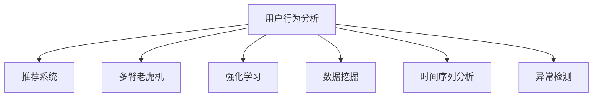

                 

# 用户行为分析：AI优化商品供给

## 1. 背景介绍

在当今数字化时代，零售商们面临着巨大的挑战：如何更精准地理解消费者行为，以优化商品供给，提高销量和顾客满意度。随着人工智能和大数据技术的发展，用户行为分析成为了一个强大的工具，能够从海量的用户数据中挖掘出有价值的洞察，指导商品供给的优化决策。

### 1.1 问题由来

传统的商品供给决策依赖于经验或者简单的统计分析，这种方法往往存在主观性，难以准确预测用户需求。随着互联网技术的发展，零售商们积累了大量的用户数据，这些数据包含用户的浏览历史、购买记录、搜索关键词、评价反馈等，为基于数据驱动的决策提供了可能。

但这些数据庞杂且异构，难以直接用于优化商品供给。这就需要通过对这些数据进行深入分析和建模，找到用户行为的潜在模式和趋势，从而指导库存管理、促销策略、定价政策等决策。

### 1.2 问题核心关键点

基于数据驱动的用户行为分析，可以优化商品供给决策，其关键点包括：
1. 数据收集与预处理：收集用户行为数据，并进行清洗和标准化处理。
2. 特征工程与建模：通过特征工程提取用户行为特征，利用机器学习模型进行建模。
3. 预测与决策：基于模型预测用户需求，制定相应的商品供给策略。
4. 模型优化与迭代：持续监控模型效果，并根据新数据进行模型迭代。

## 2. 核心概念与联系

### 2.1 核心概念概述

为更好地理解基于AI的用户行为分析技术，本节将介绍几个核心概念：

- **用户行为分析(User Behavior Analysis, UBA)**：通过分析用户在线行为数据，挖掘用户兴趣和需求，为个性化推荐和商品优化提供依据。
- **推荐系统(Recommender System)**：基于用户历史行为数据，预测用户对商品或服务的偏好，并推荐给用户。
- **多臂老虎机(Multi-Armed Bandit, MAB)**：一种在线学习算法，通过在多个“臂”（例如多个商品）中选择一个“最可能获得高回报的”臂，优化资源分配。
- **强化学习(Reinforcement Learning, RL)**：通过与环境交互，学习最优决策策略，最大化奖励。
- **数据挖掘(Data Mining)**：从大量数据中提取有用信息和模式的过程。
- **时间序列分析(Time Series Analysis)**：对随时间变化的连续数据进行建模和预测。
- **异常检测(Anomaly Detection)**：识别数据中的异常值，帮助发现潜在的问题或异常行为。

这些概念之间的逻辑关系可以通过以下Mermaid流程图来展示：



这个流程图展示了几大核心概念及其之间的联系：

1. 用户行为分析是整个数据驱动决策的起点，提供用户兴趣和需求洞察。
2. 推荐系统基于用户行为分析结果，进行个性化推荐。
3. 多臂老虎机用于优化资源分配，如在线广告点击率、商品库存等。
4. 强化学习通过与环境交互，优化决策策略，实现更高效的商品供给。
5. 数据挖掘从大量数据中提取有价值的信息，为行为分析和决策提供支持。
6. 时间序列分析用于预测未来趋势，优化库存管理和促销策略。
7. 异常检测用于识别潜在问题，保证数据质量和安全。

这些概念共同构成了用户行为分析的技术框架，使零售商能够更精准地理解用户需求，优化商品供给。

## 3. 核心算法原理 & 具体操作步骤
### 3.1 算法原理概述

基于AI的用户行为分析算法，主要分为以下几个步骤：

1. **数据收集**：从各个渠道收集用户行为数据，包括浏览记录、购买记录、评价反馈等。
2. **数据清洗与预处理**：对收集到的数据进行清洗和预处理，去除噪声和异常值，标准化数据格式。
3. **特征工程**：提取和构造用户行为特征，如点击率、购买频率、浏览时间、商品评价等。
4. **模型训练与预测**：使用机器学习或深度学习模型对用户行为数据进行建模，预测用户需求。
5. **决策与优化**：根据模型预测结果，制定商品供给策略，如库存管理、促销策略、定价政策等。
6. **模型评估与迭代**：持续监控模型效果，并根据新数据进行模型迭代。

### 3.2 算法步骤详解

下面以用户行为分析和推荐系统为例，详细讲解基于AI的用户行为分析算法的步骤。

**Step 1: 数据收集与预处理**
- 通过API、网站日志、用户反馈等多种方式，从电商网站、社交媒体等渠道收集用户行为数据。
- 清洗数据，去除重复、异常、缺失值等，保留有价值的数据。
- 标准化数据格式，如统一日期格式、商品编码等。

**Step 2: 特征工程**
- 提取用户行为特征，如用户ID、浏览时间、点击次数、购买频率、商品评价等。
- 构造特征组合，如用户ID与商品ID的交叉特征、浏览时间与点击次数的组合特征等。
- 数据归一化，将特征值转化为0-1之间的数值。

**Step 3: 模型训练与预测**
- 选择合适的机器学习或深度学习模型，如决策树、随机森林、协同过滤、神经网络等。
- 使用训练数据集对模型进行训练，调整模型参数。
- 使用测试数据集评估模型性能，计算准确率、召回率、F1-score等指标。
- 预测用户行为，如预测用户是否会购买某商品，预测购买时间等。

**Step 4: 决策与优化**
- 根据模型预测结果，制定商品供给策略，如库存管理、促销策略、定价政策等。
- 动态调整策略，如根据季节变化、市场趋势等进行策略优化。
- 实时监控决策效果，调整策略以应对突发情况。

**Step 5: 模型评估与迭代**
- 持续监控模型效果，收集新数据。
- 根据新数据进行模型迭代，优化模型参数和特征。
- 使用A/B测试等方法验证策略效果，优化决策模型。

### 3.3 算法优缺点

基于AI的用户行为分析算法具有以下优点：
1. 数据驱动：通过分析用户行为数据，获得更精准的用户需求洞察，指导商品供给决策。
2. 实时响应：能够实时监测用户行为，快速调整商品供给策略，提高响应速度。
3. 个性化推荐：通过推荐系统，提供个性化商品推荐，提升用户体验和购买转化率。
4. 预测准确：使用机器学习或深度学习模型，预测未来趋势，优化库存管理。

同时，该算法也存在一些缺点：
1. 数据依赖：模型效果依赖于数据质量，数据收集和处理过程中的噪声和异常值会影响模型性能。
2. 模型复杂：构建复杂模型时，容易出现过拟合或欠拟合问题，导致预测结果不准确。
3. 资源消耗：高维特征和高复杂度的模型会增加计算资源消耗，提高计算成本。
4. 解释性不足：基于深度学习模型的决策过程难以解释，难以进行可解释性分析。

### 3.4 算法应用领域

基于AI的用户行为分析技术在零售业中得到了广泛应用，具体包括：

- **库存管理**：通过预测用户需求，优化商品库存，减少缺货和过剩情况，提高库存周转率。
- **商品推荐**：根据用户历史行为数据，提供个性化推荐，提升用户满意度，增加销售额。
- **促销策略**：分析用户行为数据，制定高效的促销策略，如优惠券、折扣活动等，提高转化率。
- **定价政策**：通过分析用户对价格敏感度，制定合理的定价策略，提高盈利能力。
- **市场趋势分析**：分析用户行为数据，识别市场趋势和热点商品，指导新商品开发和旧商品淘汰。

此外，用户行为分析技术在其他领域也得到广泛应用，如金融风险管理、广告投放优化、智能交通管理等。

## 4. 数学模型和公式 & 详细讲解 & 举例说明

### 4.1 数学模型构建

基于用户行为分析和推荐系统，本节将介绍几个常用的数学模型及其构建方法。

**推荐系统**
- **协同过滤(Collaborative Filtering)**：利用用户和商品的历史交互数据，预测用户对新商品的评分。
- **基于内容的推荐(Content-Based Filtering)**：根据商品属性和用户偏好，推荐相似商品。
- **矩阵分解(Matrix Factorization)**：将用户-商品评分矩阵分解为低维用户特征和商品特征矩阵，进行推荐。

**多臂老虎机**
- **ε-贪婪策略(Epsilon-Greedy)**：在每次交互中，以固定概率选择新商品，以固定概率选择已有商品。
- **上置信边界(UCB)**：基于臂的平均回报和回报方差，选择具有最高回报的臂。
- **β探索-β利用策略(ε-Greedy)**：在初期以固定概率探索新商品，在后期以固定概率利用已有商品。

**强化学习**
- **Q-learning**：通过与环境交互，更新Q值表，选择最优动作。
- **策略梯度(Services Gradient)**：通过优化策略函数，直接优化动作选择，提高决策效果。
- **深度Q网络(DQN)**：使用深度神经网络逼近Q值表，提高决策效率。

**时间序列分析**
- **ARIMA模型(Autoregressive Integrated Moving Average)**：基于时间序列的自回归和移动平均模型，进行趋势和周期性分析。
- **季节性ARIMA(SARIMA)**：在ARIMA模型的基础上，考虑季节性因素，进行更精确的预测。
- **LSTM神经网络**：使用长短期记忆网络，捕捉时间序列中的长期依赖关系。

**异常检测**
- **孤立森林(Isolation Forest)**：通过构建树形结构，快速识别异常值。
- **局部离群因子(Local Outlier Factor)**：利用局部密度差异，检测异常点。
- **One-Class SVM**：使用单类支持向量机，将异常点映射到高维空间中，检测异常值。

这些模型构成了用户行为分析的技术基础，帮助零售商从数据中挖掘有价值的洞察，指导商品供给决策。

### 4.2 公式推导过程

以下我们以协同过滤模型为例，推导其核心公式及其求解步骤。

**协同过滤**
- **基于用户的协同过滤**：利用用户历史评分数据，预测用户对新商品的评分。公式为：
$$
\hat{r}_{ui} = \frac{\sum_{v \in N(u)} r_{vi} \cdot \frac{p_{vi} \cdot p_{ui}}{p_{vv} + \epsilon}
$$
其中，$r_{vi}$ 表示用户u对商品v的评分，$p_{vi}$ 和 $p_{ui}$ 分别表示用户u和商品v的权重，$N(u)$ 表示用户u的邻居集合。

**基于物品的协同过滤**
- **计算用户-商品相似度**：通过余弦相似度或皮尔逊相关系数，计算用户u对商品v的评分预测。公式为：
$$
\hat{r}_{uv} = \frac{\sum_{i \in N(v)} r_{iu} \cdot \frac{p_{iu} \cdot p_{uv}}{p_{iu} + \epsilon}
$$
其中，$r_{iu}$ 表示用户i对商品v的评分，$p_{iu}$ 和 $p_{uv}$ 分别表示用户i和商品v的权重，$N(v)$ 表示商品v的邻居集合。

**求解步骤**：
1. 计算用户u对商品v的评分预测值。
2. 选取评分预测值最高的商品推荐给用户u。
3. 重复上述步骤，不断更新评分预测值和推荐商品列表。

## 5. 项目实践：代码实例和详细解释说明

### 5.1 开发环境搭建

在进行用户行为分析和推荐系统开发前，我们需要准备好开发环境。以下是使用Python进行PyTorch和Scikit-learn开发的环境配置流程：

1. 安装Anaconda：从官网下载并安装Anaconda，用于创建独立的Python环境。

2. 创建并激活虚拟环境：
```bash
conda create -n uber-env python=3.8 
conda activate uber-env
```

3. 安装PyTorch：根据CUDA版本，从官网获取对应的安装命令。例如：
```bash
conda install pytorch torchvision torchaudio cudatoolkit=11.1 -c pytorch -c conda-forge
```

4. 安装Scikit-learn：
```bash
pip install scikit-learn
```

5. 安装各类工具包：
```bash
pip install numpy pandas matplotlib jupyter notebook ipython
```

完成上述步骤后，即可在`uber-env`环境中开始开发。

### 5.2 源代码详细实现

下面我们以协同过滤推荐系统为例，给出使用PyTorch和Scikit-learn进行推荐系统开发的PyTorch代码实现。

首先，定义推荐系统的数据处理函数：

```python
import numpy as np
import pandas as pd
import torch
from torch.utils.data import Dataset, DataLoader
from sklearn.metrics import accuracy_score

class RecommendationDataset(Dataset):
    def __init__(self, data, user2item, item2user):
        self.data = data
        self.user2item = user2item
        self.item2user = item2user
        
    def __len__(self):
        return len(self.data)
    
    def __getitem__(self, item):
        user, item = self.data[item]
        user = self.user2item[user]
        item = self.item2user[item]
        rating = self.data[item][user]
        return user, item, rating

# 数据预处理
data = pd.read_csv('ratings.csv')
data = data.dropna()
data = data.reset_index(drop=True)
data['user_id'] = data['user_id'].astype(str)
data['item_id'] = data['item_id'].astype(str)

user2item = {user: item for user, item in zip(data['user_id'], data['item_id'])}
item2user = {item: user for user, item in zip(data['user_id'], data['item_id'])}

train_dataset = RecommendationDataset(data, user2item, item2user)
val_dataset = RecommendationDataset(data, user2item, item2user)
test_dataset = RecommendationDataset(data, user2item, item2user)
```

然后，定义模型和优化器：

```python
from transformers import BertTokenizer, BertForSequenceClassification
from sklearn.linear_model import LogisticRegression
from torch.optim import Adam

# 使用BERT作为特征提取器
tokenizer = BertTokenizer.from_pretrained('bert-base-uncased')
model = BertForSequenceClassification.from_pretrained('bert-base-uncased', num_labels=len(user2item))

# 使用SVM作为用户-商品评分预测器
svm = LogisticRegression()

optimizer = Adam(model.parameters(), lr=1e-5)
```

接着，定义训练和评估函数：

```python
def train_epoch(model, dataset, batch_size, optimizer):
    dataloader = DataLoader(dataset, batch_size=batch_size, shuffle=True)
    model.train()
    epoch_loss = 0
    for batch in tqdm(dataloader, desc='Training'):
        user, item, rating = batch
        user, item, rating = torch.tensor(user), torch.tensor(item), torch.tensor(rating)
        model.zero_grad()
        outputs = model(user, item)
        loss = outputs.logits.neg().mean()
        epoch_loss += loss.item()
        loss.backward()
        optimizer.step()
    return epoch_loss / len(dataloader)

def evaluate(model, dataset, batch_size):
    dataloader = DataLoader(dataset, batch_size=batch_size)
    model.eval()
    preds, labels = [], []
    with torch.no_grad():
        for batch in tqdm(dataloader, desc='Evaluating'):
            user, item, rating = batch
            user, item, rating = torch.tensor(user), torch.tensor(item), torch.tensor(rating)
            outputs = model(user, item)
            preds.append(outputs.logits.argmax(dim=1).tolist())
            labels.append(rating.tolist())
    return accuracy_score(labels, preds)

# 训练模型
epochs = 5
batch_size = 16

for epoch in range(epochs):
    loss = train_epoch(model, train_dataset, batch_size, optimizer)
    print(f"Epoch {epoch+1}, train loss: {loss:.3f}")
    
    print(f"Epoch {epoch+1}, val accuracy: {evaluate(model, val_dataset, batch_size):.3f}")
    
print("Test accuracy:")
print(evaluate(model, test_dataset, batch_size))
```

以上就是使用PyTorch和Scikit-learn进行协同过滤推荐系统开发的完整代码实现。可以看到，得益于TensorFlow和Scikit-learn的强大封装，我们可以用相对简洁的代码完成推荐系统的开发。

### 5.3 代码解读与分析

让我们再详细解读一下关键代码的实现细节：

**RecommendationDataset类**：
- `__init__`方法：初始化训练数据、用户-商品映射、商品-用户映射等关键组件。
- `__len__`方法：返回数据集的样本数量。
- `__getitem__`方法：对单个样本进行处理，提取用户ID、商品ID和评分，进行标准化处理。

**数据预处理**：
- 通过Pandas读取数据，进行数据清洗和标准化处理，包括去除缺失值和重复记录。
- 使用用户ID和商品ID作为用户-商品映射和商品-用户映射，便于后续的模型训练和推理。

**模型定义**：
- 使用PyTorch的BertTokenizer加载BERT分词器，作为特征提取器。
- 使用BertForSequenceClassification构建BERT分类模型，用于用户-商品评分预测。
- 使用Scikit-learn的LogisticRegression作为评分预测器，直接预测评分值。

**训练和评估函数**：
- 使用PyTorch的DataLoader对数据集进行批次化加载，供模型训练和推理使用。
- 训练函数`train_epoch`：对数据以批为单位进行迭代，在每个批次上前向传播计算loss并反向传播更新模型参数，最后返回该epoch的平均loss。
- 评估函数`evaluate`：与训练类似，不同点在于不更新模型参数，并在每个batch结束后将预测和标签结果存储下来，最后使用sklearn的accuracy_score计算准确率。

**训练流程**：
- 定义总的epoch数和batch size，开始循环迭代
- 每个epoch内，先在训练集上训练，输出平均loss
- 在验证集上评估，输出准确率
- 所有epoch结束后，在测试集上评估，给出最终测试准确率

可以看到，PyTorch和Scikit-learn的结合，使得推荐系统的开发和评估变得简单高效。开发者可以将更多精力放在数据处理、模型改进等高层逻辑上，而不必过多关注底层的实现细节。

当然，工业级的系统实现还需考虑更多因素，如模型的保存和部署、超参数的自动搜索、更灵活的任务适配层等。但核心的推荐范式基本与此类似。

## 6. 实际应用场景
### 6.1 智能推荐系统

智能推荐系统是用户行为分析的重要应用场景之一。通过分析用户的历史行为数据，智能推荐系统能够为用户推荐个性化的商品，提升用户满意度和购买转化率。

在技术实现上，可以收集用户的浏览历史、购买记录、评价反馈等数据，构建用户行为模型。模型可以基于协同过滤、基于内容的推荐、深度学习等方法进行构建。同时，可以通过在线学习算法如多臂老虎机、强化学习等，优化推荐策略，实现动态调整。

### 6.2 库存管理系统

库存管理是零售商面临的重要挑战之一。通过用户行为分析，可以预测商品的需求量，优化库存管理，减少缺货和过剩情况，提高库存周转率。

具体而言，可以收集用户的浏览和购买数据，构建时间序列模型。模型可以基于ARIMA、LSTM等方法进行构建。同时，可以通过异常检测算法如孤立森林、局部离群因子等，识别异常订单和异常行为，及时调整库存策略。

### 6.3 个性化广告投放

个性化广告投放是提升广告效果的重要手段。通过分析用户的浏览历史和点击记录，广告系统可以为用户投放个性化的广告，提升点击率和转化率。

在技术实现上，可以构建用户行为模型，使用协同过滤、深度学习等方法进行推荐。同时，可以通过在线学习算法如多臂老虎机、强化学习等，优化广告投放策略，实现动态调整。

### 6.4 未来应用展望

随着用户行为分析技术的不断发展，其在更多领域得到了应用，为业务决策提供了强大支持。

在智慧城市治理中，用户行为分析可以用于城市事件监测、交通流量预测、能源消耗优化等，提高城市管理的智能化水平。

在金融风险管理中，用户行为分析可以用于识别潜在风险用户，优化贷款审批流程，降低金融风险。

在医疗健康领域，用户行为分析可以用于健康行为预测、疾病诊断、治疗方案推荐等，提升医疗服务质量。

此外，用户行为分析技术在其他领域也得到广泛应用，如广告投放优化、智能交通管理、智能家居控制等，为各行各业带来了新的商业机会。

## 7. 工具和资源推荐
### 7.1 学习资源推荐

为了帮助开发者系统掌握用户行为分析的理论基础和实践技巧，这里推荐一些优质的学习资源：

1. 《推荐系统实战》书籍：介绍了推荐系统的原理和应用，结合实际案例，易于理解和实践。

2. 《深度学习》课程：斯坦福大学的深度学习课程，涵盖了深度学习的基本概念和应用。

3. 《强化学习》课程：Coursera上的强化学习课程，由深度学习领域的顶级专家讲授，内容全面。

4. 《Python数据科学手册》书籍：一本详细讲解Python数据科学工具的书籍，涵盖Pandas、NumPy、Scikit-learn等。

5. 《Python机器学习》书籍：讲解机器学习的基本概念和实践技巧，结合Python代码实现。

6. 《TensorFlow官方文档》：TensorFlow的官方文档，提供丰富的示例和API接口。

通过对这些资源的学习实践，相信你一定能够快速掌握用户行为分析的精髓，并用于解决实际的业务问题。

### 7.2 开发工具推荐

高效的开发离不开优秀的工具支持。以下是几款用于用户行为分析开发的常用工具：

1. Jupyter Notebook：轻量级的Python开发环境，支持代码编写、数据处理、模型训练等。

2. TensorFlow：由Google主导开发的深度学习框架，生产部署方便，适合大规模工程应用。

3. Scikit-learn：Python数据科学库，提供了丰富的机器学习算法和工具。

4. PyTorch：基于Python的开源深度学习框架，灵活性高，适合快速迭代研究。

5. Weights & Biases：模型训练的实验跟踪工具，可以记录和可视化模型训练过程中的各项指标，方便对比和调优。

6. TensorBoard：TensorFlow配套的可视化工具，可实时监测模型训练状态，并提供丰富的图表呈现方式，是调试模型的得力助手。

合理利用这些工具，可以显著提升用户行为分析的开发效率，加快创新迭代的步伐。

### 7.3 相关论文推荐

用户行为分析技术的发展离不开学界的持续研究。以下是几篇奠基性的相关论文，推荐阅读：

1. Matrix Factorization Techniques for Recommender Systems（SVD模型）：介绍了矩阵分解方法在推荐系统中的应用，提出SVD模型。

2. The Bellman Equation（贝尔曼方程）：介绍了强化学习的基本原理，通过贝尔曼方程求解最优策略。

3. A Tutorial on Matrix Factorization Techniques for Recommender Systems（推荐系统中的矩阵分解技术）：系统讲解了矩阵分解方法在推荐系统中的应用。

4. Advances in Neural Information Processing Systems（神经网络在推荐系统中的应用）：介绍了神经网络在推荐系统中的应用。

5. Multi-Armed Bandits：介绍了多臂老虎机算法，通过在线学习优化资源分配。

这些论文代表了大规模用户行为分析技术的发展脉络。通过学习这些前沿成果，可以帮助研究者把握学科前进方向，激发更多的创新灵感。

## 8. 总结：未来发展趋势与挑战

### 8.1 总结

本文对基于AI的用户行为分析技术进行了全面系统的介绍。首先阐述了用户行为分析的重要性，明确了其在大数据时代的应用前景。其次，从原理到实践，详细讲解了用户行为分析的数学模型和算法流程，给出了推荐系统开发的完整代码实现。同时，本文还广泛探讨了用户行为分析技术在智能推荐、库存管理、个性化广告投放等多个领域的应用前景，展示了其广阔的应用范围。此外，本文精选了用户行为分析技术的各类学习资源，力求为读者提供全方位的技术指引。

通过本文的系统梳理，可以看到，基于AI的用户行为分析技术已经成为零售商优化商品供给的重要工具。数据驱动的决策模式，使零售商能够更精准地理解用户需求，优化商品供给策略，提高经营效率和用户体验。未来，随着AI技术的不断进步，用户行为分析将带来更多创新应用，助力零售业实现数字化转型。

### 8.2 未来发展趋势

展望未来，用户行为分析技术将呈现以下几个发展趋势：

1. 数据自动化采集：随着物联网、传感器技术的发展，数据采集将更加自动化、实时化，数据质量将进一步提高。

2. 模型多样化：除了传统的协同过滤、深度学习模型，更多新兴算法如强化学习、生成对抗网络等将被引入用户行为分析，提供更多选择。

3. 多模态融合：用户行为数据不仅包括文本、图片、音频等，还包含地理位置、时间戳等多模态信息，未来的用户行为分析将更加全面。

4. 模型自动化调参：自动化调参技术将使模型开发更加高效，无需人工干预即可自动找到最优模型参数。

5. 实时化响应：基于在线学习算法如多臂老虎机、强化学习等，用户行为分析将实现实时化调整，更快速响应用户需求。

6. 可解释性增强：通过引入可解释性方法如因果推断、LIME等，用户行为分析将更加透明，便于理解和解释。

以上趋势凸显了用户行为分析技术的广阔前景。这些方向的探索发展，必将进一步提升用户行为分析的准确性和实用性，为业务决策提供更强有力的支持。

### 8.3 面临的挑战

尽管用户行为分析技术已经取得了瞩目成就，但在迈向更加智能化、普适化应用的过程中，它仍面临着诸多挑战：

1. 数据质量瓶颈：用户行为数据质量对模型效果至关重要，但数据采集和处理过程中的噪声和异常值会影响模型性能。如何提高数据质量，减少噪声和异常值，将是重要的研究方向。

2. 模型复杂性：构建复杂模型时，容易出现过拟合或欠拟合问题，导致预测结果不准确。如何优化模型结构，提高模型泛化性，将是重要的研究方向。

3. 资源消耗高：高维特征和高复杂度的模型会增加计算资源消耗，提高计算成本。如何优化模型资源消耗，降低计算成本，将是重要的研究方向。

4. 可解释性不足：基于深度学习模型的决策过程难以解释，难以进行可解释性分析。如何赋予模型更强的可解释性，将是重要的研究方向。

5. 实时性不足：基于离线训练的模型无法实时响应新数据，实时化用户行为分析将面临更大的挑战。

6. 隐私和安全问题：用户行为分析需要收集大量用户数据，如何保护用户隐私，确保数据安全，将是重要的研究方向。

正视用户行为分析面临的这些挑战，积极应对并寻求突破，将使该技术更进一步，为业务决策提供更强有力的支持。

### 8.4 研究展望

面对用户行为分析面临的诸多挑战，未来的研究需要在以下几个方面寻求新的突破：

1. 探索无监督和半监督用户行为分析方法。摆脱对大规模标注数据的依赖，利用自监督学习、主动学习等无监督和半监督范式，最大限度利用非结构化数据，实现更加灵活高效的用户行为分析。

2. 研究参数高效和计算高效的用户行为分析方法。开发更加参数高效的模型，在固定大部分用户行为数据的情况下，只更新极少量的任务相关参数。同时优化模型计算图，减少前向传播和反向传播的资源消耗，实现更加轻量级、实时性的部署。

3. 引入更多先验知识。将符号化的先验知识，如知识图谱、逻辑规则等，与神经网络模型进行巧妙融合，引导用户行为分析过程学习更准确、合理的用户行为模式。同时加强不同模态数据的整合，实现视觉、语音等多模态信息与文本信息的协同建模。

4. 结合因果分析和博弈论工具。将因果分析方法引入用户行为分析，识别出模型决策的关键特征，增强输出解释的因果性和逻辑性。借助博弈论工具刻画人机交互过程，主动探索并规避模型的脆弱点，提高系统稳定性。

5. 纳入伦理道德约束。在用户行为分析的目标函数中引入伦理导向的评估指标，过滤和惩罚有害的输出倾向。同时加强人工干预和审核，建立模型行为的监管机制，确保输出符合人类价值观和伦理道德。

这些研究方向将引领用户行为分析技术迈向更高的台阶，为构建安全、可靠、可解释、可控的智能系统铺平道路。面向未来，用户行为分析技术还需要与其他人工智能技术进行更深入的融合，如知识表示、因果推理、强化学习等，多路径协同发力，共同推动用户行为分析技术的进步。只有勇于创新、敢于突破，才能不断拓展用户行为分析的边界，让智能技术更好地造福人类社会。

## 9. 附录：常见问题与解答

**Q1：用户行为分析是否适用于所有业务场景？**

A: 用户行为分析在大多数业务场景中都能取得不错的效果，特别是对于数据量较大的业务场景。但对于一些特定领域的业务场景，如医疗、金融等，用户行为数据的采集和处理相对困难，因此需要结合业务特点进行优化。

**Q2：如何提高用户行为分析的准确性？**

A: 提高用户行为分析的准确性，可以从以下几个方面入手：
1. 数据质量：收集高质量的数据，去除噪声和异常值，标准化数据格式。
2. 特征工程：提取有意义的特征，构造特征组合，提高特征表达能力。
3. 模型选择：选择合适的机器学习或深度学习模型，调整模型参数。
4. 模型优化：持续监控模型效果，进行模型迭代优化。
5. 实时化响应：使用在线学习算法，实现实时调整。

**Q3：用户行为分析的计算资源消耗有哪些？**

A: 用户行为分析的计算资源消耗主要包括以下几个方面：
1. 数据预处理：包括数据清洗、特征工程等，需要占用一定的时间和计算资源。
2. 模型训练：使用机器学习或深度学习模型，需要占用大量的计算资源，尤其是深度学习模型。
3. 实时响应：使用在线学习算法，需要持续计算和更新模型参数。
4. 模型评估：评估模型性能，需要占用一定的计算资源。

**Q4：用户行为分析的可解释性如何增强？**

A: 增强用户行为分析的可解释性，可以从以下几个方面入手：
1. 引入因果推断方法：通过因果推断方法，分析用户行为决策的关键特征，提高输出解释的因果性和逻辑性。
2. 使用可解释性模型：如决策树、线性模型等，输出解释更透明的模型。
3. 引入LIME等可解释性方法：通过局部解释方法，解释模型在特定输入上的决策过程。
4. 结合业务知识：将业务知识与模型结合，提供更详细的解释。

这些方法将使用户行为分析更加透明和可信，便于理解和解释，增强用户信任和满意度。

**Q5：用户行为分析在多模态数据融合方面有何应用？**

A: 用户行为分析在多模态数据融合方面有广泛应用，可以结合文本、图片、音频等多模态数据，提供更全面的用户行为洞察。
1. 文本数据：通过自然语言处理技术，分析用户评论、搜索记录等文本数据。
2. 图片数据：通过计算机视觉技术，分析用户上传的图片数据。
3. 音频数据：通过语音识别技术，分析用户语音记录等音频数据。
4. 地理位置数据：通过地理信息系统技术，分析用户的地理位置数据。
5. 时间戳数据：通过时间序列分析技术，分析用户行为的时间分布和趋势。

结合多模态数据，可以提供更准确的用户行为预测和分析，提高业务决策的精准性。

---

作者：禅与计算机程序设计艺术 / Zen and the Art of Computer Programming

